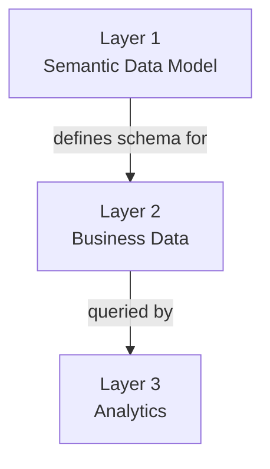

import Command from '~/components/common/Command.astro';

`use-semantius` is an **agent skill** that ships alongside the [Semantius CLI](/docs/cli-overview). Where the CLI gives an agent the ability to call Semantius, this skill teaches the agent **how to use it well**: which layer to reach for, which tool to pick, and which mistakes to avoid.

It is the foundational skill that every other workflow (schema editing, record CRUD, analytics) builds on. Install it whenever you want a coding agent to operate Semantius autonomously from a shell.

## Installation

Install all Semantius skills with a single command:

<Command command="npx skills add semantius/semantius-cli --all" />

To install for a specific agent only (e.g. Codex):

<Command command="npx skills add semantius/semantius-cli --all --agent codex" />

Supports [OpenCode, Claude Code, Codex, Cursor, and 51 more](https://github.com/vercel-labs/skills#supported-agents). See the [skills documentation](https://github.com/vercel-labs/skills) to learn how to install skills for your agent.

## When the Skill Triggers

The skill description tells the host agent to engage it whenever a task involves the Semantius platform via the CLI: creating, reading, updating or deleting entities, fields, modules, permissions, roles, users or business records; building or querying a semantic data model; setting up RBAC; importing data; running analytical queries; or writing shell or Bun scripts that chain `semantius` calls together.

In practice, any prompt that mentions Semantius data or schema work is enough to bring it in.

## The Three-Layer Mental Model

The single most important thing the skill teaches an agent is that Semantius is **three distinct layers**, and that each layer has its own toolset. Picking the wrong layer is the most common failure mode.



| Layer | What it covers | Tools |
| --- | --- | --- |
| **Layer 1** &nbsp;Semantic Data Model | Entities, fields, modules, relationships, RBAC | `create_entity`, `create_field`, `create_permission`, ... |
| **Layer 2** &nbsp;Business Data | Actual records in your entity tables | `postgrestRequest`, `sqlToRest` |
| **Layer 3** &nbsp;Analytics | Cross-table queries, aggregations, time series | `cube` discover, validate, load, chart |

**Rule of thumb:**

- Defining *what exists* (schema, permissions, roles): **Layer 1 typed tools**.
- Working with *actual records* in a single table: **Layer 2 `postgrestRequest`**.
- Querying *across tables* or needing *aggregations and metrics*: **Layer 3 `cube`**.

## The Two Modes

The CLI works in two modes, and the skill maps each one onto the layers above.

### `crud` mode: schema and records (Layers 1 and 2)

The typed `create_*`, `read_*`, `update_*`, `delete_*` tools manage the semantic data model itself. Alongside them, `postgrestRequest` operates on the actual rows in your business tables:

```bash
# Read records from your 'products' entity
semantius call crud postgrestRequest '{"method":"GET","path":"/products?status=eq.active&order=name.asc"}'

# Insert an order record
semantius call crud postgrestRequest '{"method":"POST","path":"/orders","body":{"customer_id":"123","total":99.99}}'

# Update matching products
semantius call crud postgrestRequest '{"method":"PATCH","path":"/products?category=eq.electronics","body":{"on_sale":true}}'
```

### `cube` mode: analytics (Layer 3)

`cube` mode speaks the CubeJS query DSL: measures, dimensions, time dimensions, filters, joins. The skill enforces one rule above all others: **always call `discover` first**. The `discover` response includes the cube schema, the complete query language reference, and the date filtering guide, so the agent never has to guess syntax.

## Golden Rules the Skill Enforces

The skill bakes in a small set of rules that prevent the most common mistakes:

1. **Read before writing.** Before any `create_*` call, run the matching `read_*` first. If a result already exists, reuse the ID instead of creating a duplicate.
2. **Schema first, in order.** Always create in the sequence Module, then Permissions, then Entity, then Fields. Never skip steps.
3. **Never recreate auto-generated fields.** `id`, `label`, `created_at`, `updated_at` and the entity's `label_column` field are created automatically by `create_entity`.
4. **`reference_table` mandates relational format.** Any field that points at another table must use `format: "reference"` (independent lifecycle) or `format: "parent"` (ownership / cascade delete).
5. **Warn before destructive changes.** Renaming `table_name` or `field_name`, deleting entities or fields: ask the user first.
6. **Link after schema changes.** When schema changes, hand back the UI link in the form `https://tests.semantius.app/{module_name}/{table_name}` so the user can verify visually.

## Reference Material

The skill ships with a small library of focused reference files that the agent loads on demand. Each one is scoped to a single concern:

| Reference | Purpose |
| --- | --- |
| `cli-usage.md` | CLI commands, shell patterns, chaining, installation. |
| `data-modeling.md` | Layer 1: entities, fields, modules, relationships, safe evolution. |
| `rbac.md` | Layer 1: permissions, roles, user assignments, hierarchy. |
| `crud-tools.md` | Layer 1 typed tools and Layer 2 `postgrestRequest` / `sqlToRest`. |
| `cube-queries.md` | Layer 3: query DSL, date filtering, analysis modes. |
| `cube-tools.md` | Layer 3: `discover`, `validate`, `load`, `chart` signatures. |
| `webhook-import.md` | Bulk import of records into Layer 2 via signed webhook. |

The agent does not read all of them upfront. It picks the right reference based on the task: data modeling work loads `data-modeling.md`, an analytical question loads `cube-queries.md`, and so on.

## What You Get in Practice

With `use-semantius` installed, you can hand a coding agent prompts like:

> "Add a `status` field to the orders entity, allowed values active, archived, and refunded, default active. Create a permission so only managers can change it."

> "List the top ten customers by total order value last quarter."

> "Import this CSV into the products table."

The agent picks the correct layer, follows the read-before-write and schema-first rules, calls the right typed tool or `postgrestRequest` or `cube` query, and reports back with the UI link to verify.

## Next Steps

- **[CLI Overview](/docs/cli-overview)**: why the CLI exists and where it fits.
- **[The semantius command](/docs/cli-command)**: the underlying surface this skill drives.
- **[Agent Skills Overview](/docs/agent-skills-overview)**: the broader set of skills (Business Analyst, Schema Editor, RBAC Configurator, Deployer, Optimizer) that build on `use-semantius`.
