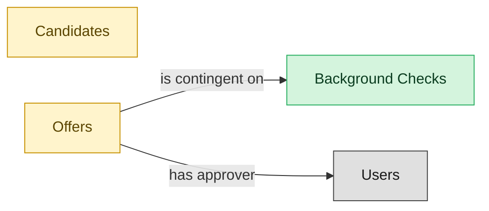

# Background Checks

## 1. Overview

Pre-employment background-check orchestration with adverse-action workflow. Coordinates vendor handoffs (Checkr, HireRight, Sterling) and gates offer-to-firm conversion on clearance. Requires an external `send_email` tool for FCRA adverse-action notices.

## 2. Entity summary

| Name | Description |
| --- | --- |
| Background Checks | External verification result for a candidate (criminal, employment history, education, credit, identity). Status and findings typically returned by a provider (Checkr, HireRight, Sterling). |
| Candidates | Person known to the recruiting org, with or without an active application. Carries contact details, resume, tags, GDPR consent, and source. Distinct from Employee until hired. |
| Offers | Formal employment offer extended to a candidate. Carries compensation components, start date, terms, approval chain, and status (draft / approved / sent / accepted / declined / rescinded). |

## 3. Entities catalog

| # | data_object | role | mastered in | necessity | pattern flags | notes |
| ---: | --- | --- | --- | --- | --- | --- |
| 1 | `background_checks` (Background Checks) | master | - | required | personal_content, submit_lock | - |
| 2 | `candidates` (Candidates) | embedded_master | `ats-candidate-crm` | required | personal_content | - |
| 3 | `job_offers` (Offers) | embedded_master | `ats-offers` | required | personal_content, single_approver | - |

## 4. Aliases and industry synonyms

_(no industry-scoped aliases or non-synonym alias types loaded for this scope; generic synonyms are omitted as common knowledge.)_

## 5. Relationships

### 5.1 Intra-scope edges

| from | verb | to | cardinality | kind | necessity | owner_side | notes |
| --- | --- | --- | --- | --- | --- | --- | --- |
| `job_offers` | is contingent on | `background_checks` | one_to_many | reference | required | source | intra \| ATS \| background check gates offer-to-firm conversion |

### 5.2 Built-in edges (`users` and other platform built-ins)

| from | verb | to | cardinality | necessity | owner_side | notes |
| --- | --- | --- | --- | --- | --- | --- |
| `job_offers` | has approver | `users` | many_to_many | required | source | users \| ATS \| approver role on offer |

### 5.3 Cross-scope edges

| from | verb | to | cardinality | necessity | notes |
| --- | --- | --- | --- | --- | --- |
| `skill_profiles` | feeds | `candidates` | one_to_many | optional | cross \| cluster A \| LMS \| internal-candidate skill data flows to ATS |
| `candidates` | submits | `job_applications` | one_to_many | required | intra \| ATS \| candidate persists across applications |
| `candidate_referrals` | introduces | `candidates` | one_to_many | required | intra \| ATS \| referral is the introduction event; candidate is durable |
| `recruitment_sources` | attributes | `candidates` | one_to_many | required | intra \| ATS \| source-of-hire dimension on candidate |
| `recruitment_agencies` | sources | `candidates` | one_to_many | required | intra \| ATS \| agency is the channel; candidate persists |
| `recruitment_events` | attracts | `candidates` | one_to_many | required | intra \| ATS \| event is the touchpoint; candidate persists |
| `talent_pools` | groups | `candidates` | many_to_many | required | intra \| ATS \| pool is a membership shell; candidate lives outside it |
| `job_applications` | results in | `job_offers` | one_to_many | required | intra \| ATS \| offer is the conversion of the application |
| `job_offers` | spawns | `onboarding_journeys` | one_to_one | required | cross \| ATS→ONBOARDING \| offer.accepted creates onboarding journey (high friction) |
| `job_offers` | triggers | `benefit_enrollments` | one_to_one | required | cross \| ATS→BEN-ADMIN \| offer.accepted opens benefit enrollment |
| `job_offers` | seeds | `compensation_statements` | one_to_one | required | cross \| ATS→COMP-MGMT \| offer.signed seeds first compensation statement |
| `candidates` | becomes | `employees` | one_to_one | required | cross \| ATS→HCM \| candidate.hired creates employee record; identity handoff |
| `job_offers` | spawns pre-employee record | `pre_employees` | one_to_one | required | Triggered on job_offer.accepted; the pre-employee record is the post-offer paperwork shell. |
| `candidates` | becomes pre-employee | `pre_employees` | one_to_one | required | Candidate identity continues into the pre-employee record; promoted to employees on activation. |

## 6. Cross-domain context

### 6.1 Master consumers (other modules / domains that embed this scope's masters)

| data_object | other module / domain | role | necessity | notes |
| --- | --- | --- | --- | --- |
| `background_checks` | HRSD-CASE-MGMT (HR Case Management) - HRSD | consumer | optional | - |
| `background_checks` | PAYROLL-RUN (Payroll Run Execution) - PAYROLL | consumer | required | - |

### 6.2 Outbound handoffs (events this scope publishes)

| source module | target domain | target module | trigger_event | payload | integration | friction | description |
| --- | --- | --- | --- | --- | --- | --- | --- |
| ATS-BACKGROUND-CHECKS | HRSD | HRSD-CASE-MGMT | `background_check.flagged` | `background_checks` | manual_handoff | high | Adverse-action workflow requires HR-legal review; manual escalation common. Friction shape: alert/escalation without feedback loop. |
| ATS-BACKGROUND-CHECKS | PAYROLL | PAYROLL-RUN | `background_check.cleared` | `background_checks` | api_call | medium | Cleared background check unblocks final pay setup at start date; PAYROLL setup proceeds. |
| ATS-BACKGROUND-CHECKS | ATS | ATS-OFFERS | `background_check.flagged` | `job_offers` | lifecycle_progression | medium | - |

### 6.3 Inbound handoffs (events this scope reacts to)

| target module | source domain | source module | trigger_event | payload | integration | friction | description |
| --- | --- | --- | --- | --- | --- | --- | --- |
| ATS-BACKGROUND-CHECKS | ATS | ATS-OFFERS | `job_offer.rescinded` | `background_checks` | lifecycle_progression | medium | - |
| ATS-BACKGROUND-CHECKS | ATS | ATS-OFFERS | `job_offer.accepted` | `background_checks` | lifecycle_progression | low | - |

### 6.4 Master providers (modules / domains that own masters this scope embeds)

| data_object | role here | necessity | canonical owner(s) | slice notes |
| --- | --- | --- | --- | --- |
| `candidates` | embedded_master | required | ATS-CANDIDATE-CRM (ATS) | - |
| `job_offers` | embedded_master | required | ATS-OFFERS (ATS) | - |

## 7. Lifecycle states (per master)

### `background_checks` (Background Check)

| order | state_name | initial? | terminal? | requires_permission? | derived gate | description |
| --- | --- | --- | --- | --- | --- | --- |
| 1 | `requested` | ✓ | - | - | - | Check ordered from the provider for a candidate. |
| 2 | `in_progress` | - | - | - | - | Provider is running verification (criminal, employment, education, identity). |
| 3 | `completed_clear` | - | ✓ | - | - | Provider returned a clear result; no adverse findings. |
| 4 | `completed_consider` | - | ✓ | ✓ | `ats-background-checks:completed_consider_background_check` | Provider returned adverse findings; gated review required before adjudication. |
| 5 | `cancelled` | - | ✓ | - | - | Check withdrawn before the provider returned a result. |

## 8. Permissions and business rules (derived)

### 8.1 Permissions

| permission | tier | description | included in `:admin`? |
| --- | --- | --- | --- |
| `ats-background-checks:read` | baseline-read | Read access to every entity in the module | ✓ |
| `ats-background-checks:manage` | baseline-manage | Edit operational records | ✓ |
| `ats-background-checks:admin` | baseline-admin | Edit reference data and inherit every workflow gate below | - |
| `ats-background-checks:completed_consider_background_check` | workflow-gate (lifecycle) | Transition `background_checks` into state `completed_consider` | ✓ |
| `ats-background-checks:view_all_background_checks` | override (personal_content) | View all `background_checks` rows beyond row-scope | ✓ |
| `ats-background-checks:manage_all_background_checks` | override (personal_content) | Manage all `background_checks` rows beyond row-scope | ✓ |
| `ats-background-checks:submit_background_check` | override (submit_lock) | Submit and lock a `background_checks` row (post-submit edits gated) | ✓ |

### 8.2 Business rules

| rule_name | data_object | source flag | intent |
| --- | --- | --- | --- |
| `background_check_edit_scope` | `background_checks` | has_personal_content | Row-scope by default; override via `ats-background-checks:view_all_background_checks` / `ats-background-checks:manage_all_background_checks` |
| `submit_restricted_to_background_check_owner` | `background_checks` | has_submit_lock | Only the row's authoring user can submit; post-submit the row is read-only except via `ats-background-checks:manage_all_background_checks` |
