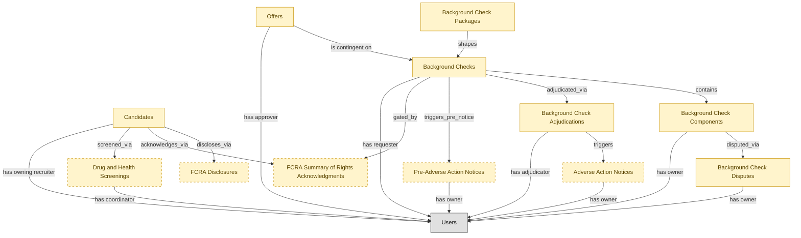

# Background Checks

## 1. Overview

Pre-employment background-check orchestration with adverse-action workflow. Coordinates external vendor handoffs and gates offer-to-firm conversion on clearance. Requires an external `send_email` tool for FCRA adverse-action notices.

## 2. Entity summary

| Name | data_object | Description |
| --- | --- | --- |
| Adverse Action Notices | `adverse_action_notices` | FCRA-mandated notices issued when a background check is used to decline a candidate, covering the pre-adverse and post-adverse two-step process and dispute window. |
| Background Check Adjudications | `background_check_adjudications` | Human review decisions on a completed background check (clear, engaged, decisional, declined), with rationale and individualized assessment notes. |
| Background Check Components | `background_check_components` | Individual sub-check results inside a background check order (county criminal, SSN trace, employment verification, drug screen), each with its own status and source. |
| Background Check Disputes | `background_check_disputes` | Candidate-initiated disputes of a background check result under FCRA, with the disputed component, candidate statement, re-investigation result, and resolution. |
| Background Check Packages | `background_check_packages` | Configured bundles of check types that can be ordered as one unit, defining what a standard package looks like for a role tier. |
| Background Checks | `background_checks` | External verification results for a candidate (criminal, employment, education, credit, identity), with status and findings from a screening provider. |
| Candidates | `candidates` | People known to the recruiting organization, with or without an active application, carrying contact details, resume, tags, consent, and source. |
| Drug and Health Screenings | `drug_health_screenings` | Pre-employment drug tests and occupational health screenings, tracking the order, provider, result, and any adverse-finding review. Holds sensitive medical data subject to legal restrictions. |
| FCRA Disclosures | `fcra_disclosures` | Legally required disclosure forms shown to a candidate before a consumer report is requested, with text version, signature, and timestamp. |
| FCRA Summary of Rights Acknowledgments | `fcra_summary_of_rights_acknowledgements` | Candidate acknowledgments of receiving the summary of consumer rights at consent time, captured separately so the copy and timestamp persist for audit. |
| Offers | `job_offers` | Formal employment offers extended to candidates, with compensation, start date, terms, approval chain, and status. |
| Pre-Adverse Action Notices | `pre_adverse_action_notices` | FCRA-mandated notices sent to a candidate before a final adverse-action decision, including the report and rights summary and opening a dispute waiting period. |

## 3. Entities catalog

| # | data_object | canonical code | singular | plural | role | mastered in | mastered label | necessity | pattern flags | entity_type | write tier | notes |
| ---: | --- | --- | --- | --- | --- | --- | --- | --- | --- | --- | --- | --- |
| 1 | `adverse_action_notices` | `adverse_action_notices` | Adverse Action Notice | Adverse Action Notices | embedded_master | `bgv-adjudication-compliance` | Adjudication and Compliance | optional | personal_content | operational_workflow | `:manage` | - |
| 2 | `background_check_adjudications` | `background_check_adjudications` | Background Check Adjudication | Background Check Adjudications | embedded_master | `bgv-adjudication-compliance` | Adjudication and Compliance | required | personal_content, single_approver | operational_workflow | `:manage` | - |
| 3 | `background_check_components` | `background_check_components` | Background Check Component | Background Check Components | embedded_master | `bgv-screening-orders` | Screening Orders and Packages | required | personal_content | operational_workflow | `:manage` | - |
| 4 | `background_check_disputes` | `background_check_disputes` | Background Check Dispute | Background Check Disputes | embedded_master | `bgv-adjudication-compliance` | Adjudication and Compliance | required | personal_content | operational_workflow | `:manage` | - |
| 5 | `background_check_packages` | `background_check_packages` | Background Check Package | Background Check Packages | embedded_master | `bgv-screening-orders` | Screening Orders and Packages | required | - | catalog | `:admin` | - |
| 6 | `background_checks` | `background_checks` | Background Check | Background Checks | embedded_master | `bgv-screening-orders` | Screening Orders and Packages | required | personal_content, submit_lock | operational_workflow | `:manage` | - |
| 7 | `candidates` | `candidates` | Candidate | Candidates | embedded_master | `ats-candidate-crm` | Candidate CRM | required | personal_content | operational_workflow | `:manage` | - |
| 8 | `drug_health_screenings` | `drug_health_screenings` | Drug and Health Screening | Drug and Health Screenings | embedded_master | `bgv-screening-orders` | Screening Orders and Packages | optional | personal_content | operational_workflow | `:manage` | - |
| 9 | `fcra_disclosures` | `fcra_disclosures` | FCRA Disclosure | FCRA Disclosures | embedded_master | `bgv-adjudication-compliance` | Adjudication and Compliance | optional | personal_content | operational_workflow | `:manage` | - |
| 10 | `fcra_summary_of_rights_acknowledgements` | `fcra_summary_of_rights_acknowledgements` | FCRA Summary of Rights Acknowledgment | FCRA Summary of Rights Acknowledgments | embedded_master | `bgv-adjudication-compliance` | Adjudication and Compliance | optional | personal_content, submit_lock | operational_record | `:manage` | - |
| 11 | `job_offers` | `job_offers` | Offer | Offers | embedded_master | `ats-offers` | Offers | required | personal_content, single_approver | operational_workflow | `:manage` | - |
| 12 | `pre_adverse_action_notices` | `pre_adverse_action_notices` | Pre-Adverse Action Notice | Pre-Adverse Action Notices | embedded_master | `bgv-adjudication-compliance` | Adjudication and Compliance | optional | personal_content, submit_lock | operational_workflow | `:manage` | - |

## 4. Aliases and industry synonyms

_(none: no industry-scoped aliases for this scope)_

## 5. Relationships

### 5.1 Intra-scope edges

| from | verb | to | cardinality | kind | necessity | owner_side | delete_mode | fk_format | notes |
| --- | --- | --- | --- | --- | --- | --- | --- | --- | --- |
| `background_checks` | contains | `background_check_components` | one_to_many | composition | required | source | cascade | parent | - |
| `background_check_packages` | shapes | `background_checks` | one_to_many | reference | required | source | restrict | reference | - |
| `candidates` | discloses_via | `fcra_disclosures` | one_to_many | composition | required | source | cascade | parent | - |
| `background_checks` | adjudicated_via | `background_check_adjudications` | one_to_one | reference | required | source | restrict | reference | - |
| `background_check_adjudications` | triggers | `adverse_action_notices` | one_to_one | reference | optional | source | clear | reference | - |
| `background_check_components` | disputed_via | `background_check_disputes` | one_to_many | reference | optional | target | clear | reference | - |
| `candidates` | acknowledges_via | `fcra_summary_of_rights_acknowledgements` | one_to_many | composition | optional | source | cascade | parent | - |
| `background_checks` | triggers_pre_notice | `pre_adverse_action_notices` | one_to_many | composition | optional | source | cascade | parent | - |
| `background_checks` | gated_by | `fcra_summary_of_rights_acknowledgements` | one_to_one | reference | required | source | restrict | reference | - |
| `job_offers` | is contingent on | `background_checks` | one_to_many | reference | required | source | restrict | reference | - |
| `candidates` | screened_via | `drug_health_screenings` | one_to_many | reference | optional | source | clear | reference | - |

### 5.2 Built-in edges (`users` and other platform built-ins)

| from | verb | to | cardinality | necessity | owner_side | delete_mode | fk_format | notes |
| --- | --- | --- | --- | --- | --- | --- | --- | --- |
| `candidates` | has owning recruiter | `users` | many_to_many | optional | source | clear | reference | - |
| `background_checks` | has requester | `users` | many_to_many | required | source | restrict | reference | - |
| `background_check_components` | has owner | `users` | many_to_many | optional | source | clear | reference | - |
| `background_check_adjudications` | has adjudicator | `users` | many_to_many | required | source | restrict | reference | - |
| `adverse_action_notices` | has owner | `users` | many_to_many | optional | source | clear | reference | - |
| `background_check_disputes` | has owner | `users` | many_to_many | optional | source | clear | reference | - |
| `pre_adverse_action_notices` | has owner | `users` | many_to_many | optional | source | clear | reference | - |
| `job_offers` | has approver | `users` | many_to_many | required | source | restrict | reference | - |
| `drug_health_screenings` | has coordinator | `users` | many_to_many | optional | source | clear | reference | - |

### 5.3 Cross-scope edges

#### 5.3a Outbound from this scope's masters and contributors

_Edges this scope drives: the in-scope endpoint has `role` of `master` or `contributor`._

_(none: no outbound cross-scope edges from this scope's masters or contributors)_

#### 5.3b Context edges on embedded shells and consumed entities

_Edges the canonical owner drives, shown for context: the in-scope endpoint has `role` of `embedded_master`, `consumer`, or `derived`._

| from | verb | to | cardinality | necessity | delete_mode | fk_format | notes |
| --- | --- | --- | --- | --- | --- | --- | --- |
| `candidates` | verified_via | `right_to_work_verifications` | one_to_many | optional | none | n/a | - |
| `candidates` | engaged_via | `candidate_engagements` | one_to_many | optional | none | n/a | - |
| `candidates` | attends_via | `recruiting_event_attendances` | one_to_many | required | none (required-if-present) | n/a | - |
| `candidates` | noted_via | `recruiter_interactions` | one_to_many | optional | none | n/a | - |
| `candidates` | consents_via | `candidate_consents` | one_to_many | required | ⚠ audit: required composed child out of scope | n/a | - |
| `candidates` | member_of_via | `talent_pool_memberships` | one_to_many | required | none (required-if-present) | n/a | - |
| `candidates` | self_identifies_via | `eeo_responses` | one_to_many | optional | none | n/a | - |
| `job_offers` | evolves_through | `offer_versions` | one_to_many | required | ⚠ audit: required composed child out of scope | n/a | - |
| `job_offers` | gated_by | `offer_approvals` | one_to_many | optional | none | n/a | - |
| `candidates` | submits_via | `data_subject_requests` | one_to_many | optional | none | n/a | - |
| `candidates` | self_ids_via | `voluntary_self_identifications` | one_to_many | optional | none | n/a | - |
| `candidates` | documented_via | `candidate_documents` | one_to_many | optional | none | n/a | - |
| `candidates` | annotated_via | `candidate_notes` | one_to_many | optional | none | n/a | - |
| `candidates` | tagged_via | `candidate_tag_assignments` | one_to_many | optional | none | n/a | - |
| `skill_profiles` | feeds | `candidates` | one_to_many | optional | none | n/a | - |
| `candidates` | submits | `job_applications` | one_to_many | required | none (required-if-present) | n/a | - |
| `candidate_referrals` | introduces | `candidates` | one_to_many | required | none (required-if-present) | n/a | - |
| `recruitment_sources` | attributes | `candidates` | one_to_many | required | none (required-if-present) | n/a | - |
| `recruitment_agencies` | sources | `candidates` | one_to_many | required | none (required-if-present) | n/a | - |
| `recruitment_events` | attracts | `candidates` | one_to_many | required | none (required-if-present) | n/a | - |
| `talent_pools` | groups | `candidates` | many_to_many | required | none (required-if-present) | n/a | - |
| `job_applications` | results in | `job_offers` | one_to_many | required | none (required-if-present) | n/a | - |
| `job_offers` | spawns | `onboarding_journeys` | one_to_one | required | none (required-if-present) | n/a | - |
| `job_offers` | triggers | `benefit_enrollments` | one_to_one | required | none (required-if-present) | n/a | - |
| `job_offers` | seeds | `compensation_statements` | one_to_one | required | none (required-if-present) | n/a | - |
| `candidates` | becomes | `employees` | one_to_one | required | none (required-if-present) | n/a | - |
| `job_offers` | spawns pre-employee record | `pre_employees` | one_to_one | required | none (required-if-present) | n/a | - |
| `candidates` | becomes pre-employee | `pre_employees` | one_to_one | required | none (required-if-present) | n/a | - |
| `employees` | applies_as | `candidates` | one_to_many | optional | none | n/a | - |
| `candidates` | corresponds_via | `candidate_emails` | one_to_many | optional | none | n/a | - |
| `candidates` | submitted_via | `agency_submissions` | one_to_many | optional | none | n/a | - |

## 6. Cross-domain context

### 6.1 Master consumers (other modules / domains that embed this scope's masters)

_(none: no other module embeds this scope's masters; the canonical owners do.)_

### 6.2 Outbound handoffs (events this scope publishes)

| source module | target domain | target module | trigger_event | transition | payload | integration | friction | description |
| --- | --- | --- | --- | --- | --- | --- | --- | --- |
| ATS-BACKGROUND-CHECKS | HRSD | HRSD-CASE-MGMT | `background_check.flagged` | _(lifecycle)_ | `background_checks` | manual_handoff | high | Adverse-action workflow requires HR-legal review; manual escalation common. Friction shape: alert/escalation without feedback loop. |
| ATS-CANDIDATE-CRM | HCM | HCM-LIFECYCLE-WORKFLOWS | `candidate.hired` | `hired` _(lifecycle)_ | `candidates` | event_stream | high | Hired-candidate event publishes the hiring outcome to HCM, which must create the employee record. Identifier mapping (candidate_id -> employee_id) is the canonical reconciliation gap. |
| ATS-OFFERS | HCM | HCM-LIFECYCLE-WORKFLOWS | `job_offer.accepted` | `accepted` _(state_change)_ | `job_offers` | event_stream | medium | Offer acceptance signals firm hiring intent; HCM creates pending-employee record. |
| ATS-BACKGROUND-CHECKS | PAYROLL | PAYROLL-RUN | `background_check.cleared` | _(lifecycle)_ | `background_checks` | api_call | medium | Cleared background check unblocks final pay setup at start date; PAYROLL setup proceeds. |
| ATS-BACKGROUND-CHECKS | ATS | ATS-OFFERS | `background_check.flagged` | _(lifecycle)_ | `job_offers` | lifecycle_progression | medium | - |
| ATS-OFFERS | COMP-MGMT | COMP-STATEMENTS | `job_offer.signed` | `signed` _(lifecycle)_ | `job_offers` | event_stream | low | Signed offer establishes the comp baseline; COMP-MGMT incorporates into cycle history. |
| ATS-CANDIDATE-CRM | BEN-ADMIN | BEN-ENROLLMENT | `candidate.hired` | `hired` _(lifecycle)_ | `candidates` | event_stream | low | Hired candidate triggers eligibility window in BEN-ADMIN. |
| ATS-CANDIDATE-CRM | ONBOARDING | ONB-JOURNEY-MGMT | `candidate.hired` | `hired` _(lifecycle)_ | `candidates` | event_stream | medium | Hired candidate drives onboarding-plan kickoff with role/location/manager context from ATS payload. |

### 6.3 Inbound handoffs (events this scope reacts to)

| target module | source domain | source module | trigger_event | transition | payload | integration | friction | description |
| --- | --- | --- | --- | --- | --- | --- | --- | --- |
| ATS-CANDIDATE-CRM | HCM | HCM-CORE-WORKER | `employee.applied_internally` | `active` → `active` _(signal)_ | `candidates` | api_call | medium | When an employee applies internally, HCM hands the worker context to the applicant tracker, which materializes an internal candidate record from the worker profile. Friction: reconciling the worker identity against the candidate identity space. |
| ATS-CANDIDATE-CRM | ATS | ATS-REFERRALS | `candidate_referral.submitted` | _(lifecycle)_ | `candidates` | lifecycle_progression | low | - |
| ATS-OFFERS | ATS | ATS-RECRUITMENT-PIPELINE | `job_application.advanced` | _(state_change)_ | `job_offers` | lifecycle_progression | low | - |
| ATS-BACKGROUND-CHECKS | ATS | ATS-OFFERS | `job_offer.accepted` | `accepted` _(state_change)_ | `background_checks` | lifecycle_progression | low | - |
| ATS-BACKGROUND-CHECKS | ATS | ATS-OFFERS | `job_offer.rescinded` | _(state_change)_ | `background_checks` | lifecycle_progression | medium | - |

### 6.4 Master providers (modules / domains that own masters this scope embeds)

| data_object | role here | necessity | canonical owner(s) | slice notes |
| --- | --- | --- | --- | --- |
| `adverse_action_notices` | embedded_master | optional | BGV-ADJUDICATION-COMPLIANCE (BGV) | - |
| `background_check_adjudications` | embedded_master | required | BGV-ADJUDICATION-COMPLIANCE (BGV) | - |
| `background_check_components` | embedded_master | required | BGV-SCREENING-ORDERS (BGV) | - |
| `background_check_disputes` | embedded_master | required | BGV-ADJUDICATION-COMPLIANCE (BGV) | - |
| `background_check_packages` | embedded_master | required | BGV-SCREENING-ORDERS (BGV) | - |
| `background_checks` | embedded_master | required | BGV-SCREENING-ORDERS (BGV) | - |
| `candidates` | embedded_master | required | ATS-CANDIDATE-CRM (ATS) | - |
| `drug_health_screenings` | embedded_master | optional | BGV-SCREENING-ORDERS (BGV) | - |
| `fcra_disclosures` | embedded_master | optional | BGV-ADJUDICATION-COMPLIANCE (BGV) | - |
| `fcra_summary_of_rights_acknowledgements` | embedded_master | optional | BGV-ADJUDICATION-COMPLIANCE (BGV) | - |
| `job_offers` | embedded_master | required | ATS-OFFERS (ATS) | - |
| `pre_adverse_action_notices` | embedded_master | optional | BGV-ADJUDICATION-COMPLIANCE (BGV) | - |

## 7. Lifecycle states

### `adverse_action_notices` (Adverse Action Notice)

_This scope holds `adverse_action_notices` as **embedded_master**; the canonical state machine is owned by `BGV-ADJUDICATION-COMPLIANCE`._

| order | state_name | initial? | terminal? | requires_permission? | derived gate | description |
| --- | --- | --- | --- | --- | --- | --- |
| 1 | `pre_adverse_sent` | ✓ | - | - | - | Pre-adverse notice sent; candidate has dispute window to respond. |
| 2 | `dispute_filed` | - | - | - | - | Candidate filed a dispute within the waiting window. |
| 3 | `waiting_period_elapsed` | - | - | - | - | Dispute window passed without action. |
| 4 | `post_adverse_sent` | - | ✓ | ✓ | - | Final adverse action notice issued; hiring decision final. |
| 5 | `rescinded` | - | ✓ | - | - | Adverse action process abandoned (dispute upheld, hire reinstated). |

### `background_check_adjudications` (Background Check Adjudication)

_This scope holds `background_check_adjudications` as **embedded_master**; the canonical state machine is owned by `BGV-ADJUDICATION-COMPLIANCE`._

| order | state_name | initial? | terminal? | requires_permission? | derived gate | description |
| --- | --- | --- | --- | --- | --- | --- |
| 1 | `pending` | ✓ | - | - | - | Awaiting adjudicator review. |
| 2 | `clear` | - | ✓ | ✓ | - | Decision: clear to hire. |
| 3 | `engaged` | - | - | ✓ | - | Decision: requires individualized assessment / candidate dialog per EEOC. |
| 4 | `declined` | - | ✓ | ✓ | - | Decision: hire declined based on results; triggers adverse action process. |

### `background_check_components` (Background Check Component)

_This scope holds `background_check_components` as **embedded_master**; the canonical state machine is owned by `BGV-SCREENING-ORDERS`._

| order | state_name | initial? | terminal? | requires_permission? | derived gate | description |
| --- | --- | --- | --- | --- | --- | --- |
| 1 | `ordered` | ✓ | - | - | - | Component requested from provider. |
| 2 | `in_progress` | - | - | - | - | Provider actively researching. |
| 3 | `completed_clear` | - | ✓ | - | - | Component returned clear (no findings). |
| 4 | `completed_flagged` | - | ✓ | - | - | Component returned with findings requiring adjudication. |
| 5 | `unable_to_verify` | - | ✓ | - | - | Provider could not verify; component closed without result. |

### `background_check_disputes` (Background Check Dispute)

_This scope holds `background_check_disputes` as **embedded_master**; the canonical state machine is owned by `BGV-ADJUDICATION-COMPLIANCE`._

| order | state_name | initial? | terminal? | requires_permission? | derived gate | description |
| --- | --- | --- | --- | --- | --- | --- |
| 1 | `filed` | ✓ | - | - | - | Candidate filed dispute. |
| 2 | `under_review` | - | - | - | - | Provider re-investigating disputed component. |
| 3 | `upheld` | - | ✓ | - | - | Dispute upheld; component result corrected. |
| 4 | `denied` | - | ✓ | - | - | Dispute denied; original result stands. |

### `background_checks` (Background Check)

_This scope holds `background_checks` as **embedded_master**; the canonical state machine is owned by `BGV-SCREENING-ORDERS`._

| order | state_name | initial? | terminal? | requires_permission? | derived gate | description |
| --- | --- | --- | --- | --- | --- | --- |
| 1 | `requested` | ✓ | - | - | - | Check ordered from the provider for a candidate. |
| 2 | `in_progress` | - | - | - | - | Provider is running verification (criminal, employment, education, identity). |
| 3 | `completed_clear` | - | ✓ | ✓ | `ats-background-checks:clear_background_check` | Provider returned a clear result; no adverse findings. |
| 4 | `completed_consider` | - | ✓ | ✓ | `ats-background-checks:adjudicate_background_check` | Provider returned adverse findings; gated review required before adjudication. |
| 5 | `canceled` | - | ✓ | - | - | Check withdrawn before the provider returned a result. |

### `candidates` (Candidate)

_This scope holds `candidates` as **embedded_master**; the canonical state machine is owned by `ATS-CANDIDATE-CRM`._

| order | state_name | initial? | terminal? | requires_permission? | derived gate | description |
| --- | --- | --- | --- | --- | --- | --- |
| 1 | `prospect` | ✓ | - | - | - | Person known to the recruiting org with no active application. |
| 2 | `active` | - | - | - | - | Candidate has at least one open application or is actively engaged. |
| 3 | `hired` | - | ✓ | ✓ | `ats-background-checks:hire_candidate` | Candidate accepted an offer and converted to employee. |
| 4 | `do_not_hire` | - | ✓ | ✓ | `ats-background-checks:flag_do_not_hire` | Candidate flagged as ineligible for future consideration; gated decision. |
| 5 | `archived` | - | ✓ | - | - | Candidate kept in the database but not active in any pipeline. |

### `drug_health_screenings` (Drug and Health Screening)

_This scope holds `drug_health_screenings` as **embedded_master**; the canonical state machine is owned by `BGV-SCREENING-ORDERS`._

| order | state_name | initial? | terminal? | requires_permission? | derived gate | description |
| --- | --- | --- | --- | --- | --- | --- |
| 1 | `ordered` | ✓ | - | - | - | - |
| 2 | `in_progress` | - | - | - | - | - |
| 3 | `passed` | - | ✓ | - | - | - |
| 4 | `failed` | - | ✓ | ✓ | `ats-background-checks:review_failed_screening` | - |
| 5 | `canceled` | - | ✓ | - | - | - |

### `fcra_disclosures` (FCRA Disclosure)

_This scope holds `fcra_disclosures` as **embedded_master**; the canonical state machine is owned by `BGV-ADJUDICATION-COMPLIANCE`._

| order | state_name | initial? | terminal? | requires_permission? | derived gate | description |
| --- | --- | --- | --- | --- | --- | --- |
| 1 | `presented` | ✓ | - | - | - | Disclosure shown to candidate; awaiting acknowledgment. |
| 2 | `acknowledged` | - | - | - | - | Candidate signed acknowledgment; check may proceed. |
| 3 | `refused` | - | ✓ | - | - | Candidate declined to sign; cannot run check. |
| 4 | `expired` | - | ✓ | - | - | Authorization aged out of validity window. |

### `job_offers` (Offer)

_This scope holds `job_offers` as **embedded_master**; the canonical state machine is owned by `ATS-OFFERS`._

| order | state_name | initial? | terminal? | requires_permission? | derived gate | description |
| --- | --- | --- | --- | --- | --- | --- |
| 1 | `draft` | ✓ | - | - | - | Recruiter is composing offer terms and compensation components. |
| 2 | `pending_approval` | - | - | - | - | Offer routed to the designated approver for sign-off. |
| 3 | `approved` | - | - | ✓ | `ats-background-checks:approve_offer` | Approver signed off; offer is ready to send. |
| 4 | `sent` | - | - | - | - | Offer delivered to the candidate. |
| 5 | `accepted` | - | ✓ | - | - | Candidate accepted the offer. |
| 6 | `declined` | - | ✓ | - | - | Candidate declined the offer. |
| 7 | `rescinded` | - | ✓ | ✓ | `ats-background-checks:rescind_offer` | Offer withdrawn by the employer after being sent; gated action. |

### `pre_adverse_action_notices` (Pre-Adverse Action Notice)

_This scope holds `pre_adverse_action_notices` as **embedded_master**; the canonical state machine is owned by `BGV-ADJUDICATION-COMPLIANCE`._

| order | state_name | initial? | terminal? | requires_permission? | derived gate | description |
| --- | --- | --- | --- | --- | --- | --- |
| 1 | `sent` | ✓ | - | - | - | Pre-adverse-action notice issued to the candidate. Opens the FCRA waiting period during which the candidate may dispute findings in the consumer report. |
| 2 | `waiting_period_active` | - | - | - | - | Waiting period in progress. FCRA requires a reasonable opportunity to dispute, typically interpreted as at least 5 business days. |
| 3 | `waiting_period_elapsed` | - | - | - | - | Waiting period expired with no dispute filed. Eligible to escalate to a final adverse-action notice or to clear the pre-adverse step. |
| 4 | `under_dispute` | - | - | ✓ | `ats-background-checks:mark_pre_adverse_dispute_filed` | Candidate filed a dispute against findings in the consumer report. Investigation underway; the waiting clock is paused. |
| 5 | `cleared` | - | ✓ | ✓ | `ats-background-checks:clear_pre_adverse_notice` | Pre-adverse notice withdrawn after candidate clarification or a successful dispute. The candidate proceeds in the hiring workflow. |
| 6 | `escalated` | - | ✓ | ✓ | `ats-background-checks:escalate_to_final_adverse_action` | Proceeding to the final FCRA adverse-action step. A downstream adverse_action_notices row is created with post_adverse_sent firing on issue. |

## 8. Permissions and business rules (derived)

### 8.1 Permissions

| permission | tier | description | included in `:admin`? |
| --- | --- | --- | --- |
| `ats-background-checks:read` | baseline-read | Read access to every entity in the module | ✓ |
| `ats-background-checks:manage` | baseline-manage | Edit operational records | ✓ |
| `ats-background-checks:admin` | baseline-admin | Edit reference data and inherit every workflow gate below | - |
| `ats-background-checks:hire_candidate` | workflow-gate (lifecycle) | Transition `candidates` into state `hired` | ✓ |
| `ats-background-checks:flag_do_not_hire` | workflow-gate (lifecycle) | Transition `candidates` into state `do_not_hire` | ✓ |
| `ats-background-checks:approve_offer` | workflow-gate (lifecycle) | Transition `job_offers` into state `approved` | ✓ |
| `ats-background-checks:rescind_offer` | workflow-gate (lifecycle) | Transition `job_offers` into state `rescinded` | ✓ |
| `ats-background-checks:clear_background_check` | workflow-gate (lifecycle) | Transition `background_checks` into state `completed_clear` | ✓ |
| `ats-background-checks:adjudicate_background_check` | workflow-gate (lifecycle) | Transition `background_checks` into state `completed_consider` | ✓ |
| `ats-background-checks:mark_pre_adverse_dispute_filed` | workflow-gate (lifecycle) | Transition `pre_adverse_action_notices` into state `under_dispute` | ✓ |
| `ats-background-checks:clear_pre_adverse_notice` | workflow-gate (lifecycle) | Transition `pre_adverse_action_notices` into state `cleared` | ✓ |
| `ats-background-checks:escalate_to_final_adverse_action` | workflow-gate (lifecycle) | Transition `pre_adverse_action_notices` into state `escalated` | ✓ |
| `ats-background-checks:review_failed_screening` | workflow-gate (lifecycle) | Transition `drug_health_screenings` into state `failed` | ✓ |
| `ats-background-checks:view_all_candidates` | override (personal_content) | View all `candidates` rows beyond row-scope | ✓ |
| `ats-background-checks:manage_all_candidates` | override (personal_content) | Manage all `candidates` rows beyond row-scope | ✓ |
| `ats-background-checks:view_all_offers` | override (personal_content) | View all `job_offers` rows beyond row-scope | ✓ |
| `ats-background-checks:manage_all_offers` | override (personal_content) | Manage all `job_offers` rows beyond row-scope | ✓ |
| `ats-background-checks:view_all_background_check_components` | override (personal_content) | View all `background_check_components` rows beyond row-scope | ✓ |
| `ats-background-checks:manage_all_background_check_components` | override (personal_content) | Manage all `background_check_components` rows beyond row-scope | ✓ |
| `ats-background-checks:view_all_background_check_disputes` | override (personal_content) | View all `background_check_disputes` rows beyond row-scope | ✓ |
| `ats-background-checks:manage_all_background_check_disputes` | override (personal_content) | Manage all `background_check_disputes` rows beyond row-scope | ✓ |
| `ats-background-checks:view_all_background_check_adjudications` | override (personal_content) | View all `background_check_adjudications` rows beyond row-scope | ✓ |
| `ats-background-checks:manage_all_background_check_adjudications` | override (personal_content) | Manage all `background_check_adjudications` rows beyond row-scope | ✓ |
| `ats-background-checks:view_all_fcra_disclosures` | override (personal_content) | View all `fcra_disclosures` rows beyond row-scope | ✓ |
| `ats-background-checks:manage_all_fcra_disclosures` | override (personal_content) | Manage all `fcra_disclosures` rows beyond row-scope | ✓ |
| `ats-background-checks:view_all_adverse_action_notices` | override (personal_content) | View all `adverse_action_notices` rows beyond row-scope | ✓ |
| `ats-background-checks:manage_all_adverse_action_notices` | override (personal_content) | Manage all `adverse_action_notices` rows beyond row-scope | ✓ |
| `ats-background-checks:view_all_fcra_summary_of_rights_acknowledgments` | override (personal_content) | View all `fcra_summary_of_rights_acknowledgements` rows beyond row-scope | ✓ |
| `ats-background-checks:manage_all_fcra_summary_of_rights_acknowledgments` | override (personal_content) | Manage all `fcra_summary_of_rights_acknowledgements` rows beyond row-scope | ✓ |
| `ats-background-checks:submit_fcra_summary_of_rights_acknowledgment` | override (submit_lock) | Submit and lock a `fcra_summary_of_rights_acknowledgements` row (post-submit edits gated) | ✓ |
| `ats-background-checks:view_all_background_checks` | override (personal_content) | View all `background_checks` rows beyond row-scope | ✓ |
| `ats-background-checks:manage_all_background_checks` | override (personal_content) | Manage all `background_checks` rows beyond row-scope | ✓ |
| `ats-background-checks:submit_background_check` | override (submit_lock) | Submit and lock a `background_checks` row (post-submit edits gated) | ✓ |
| `ats-background-checks:view_all_drug_and_health_screenings` | override (personal_content) | View all `drug_health_screenings` rows beyond row-scope | ✓ |
| `ats-background-checks:manage_all_drug_and_health_screenings` | override (personal_content) | Manage all `drug_health_screenings` rows beyond row-scope | ✓ |
| `ats-background-checks:view_all_pre-adverse_action_notices` | override (personal_content) | View all `pre_adverse_action_notices` rows beyond row-scope | ✓ |
| `ats-background-checks:manage_all_pre-adverse_action_notices` | override (personal_content) | Manage all `pre_adverse_action_notices` rows beyond row-scope | ✓ |
| `ats-background-checks:submit_pre-adverse_action_notice` | override (submit_lock) | Submit and lock a `pre_adverse_action_notices` row (post-submit edits gated) | ✓ |

### 8.2 Business rules

| rule_name | data_object | source flag | intent |
| --- | --- | --- | --- |
| `candidate_edit_scope` | `candidates` | has_personal_content | Row-scope by default; override via `ats-background-checks:view_all_candidates` / `ats-background-checks:manage_all_candidates` |
| `offer_edit_scope` | `job_offers` | has_personal_content | Row-scope by default; override via `ats-background-checks:view_all_offers` / `ats-background-checks:manage_all_offers` |
| `approve_offer_requires_approver` | `job_offers` | has_single_approver | Exactly one explicit approver required; uses the module's approval gate (`ats-background-checks:approve_offer` if surfaced as a lifecycle workflow gate). |
| `background_check_component_edit_scope` | `background_check_components` | has_personal_content | Row-scope by default; override via `ats-background-checks:view_all_background_check_components` / `ats-background-checks:manage_all_background_check_components` |
| `background_check_dispute_edit_scope` | `background_check_disputes` | has_personal_content | Row-scope by default; override via `ats-background-checks:view_all_background_check_disputes` / `ats-background-checks:manage_all_background_check_disputes` |
| `background_check_adjudication_edit_scope` | `background_check_adjudications` | has_personal_content | Row-scope by default; override via `ats-background-checks:view_all_background_check_adjudications` / `ats-background-checks:manage_all_background_check_adjudications` |
| `approve_background_check_adjudication_requires_approver` | `background_check_adjudications` | has_single_approver | Exactly one explicit approver required; uses the module's approval gate (`ats-background-checks:approve_background_check_adjudication` if surfaced as a lifecycle workflow gate). |
| `fcra_disclosure_edit_scope` | `fcra_disclosures` | has_personal_content | Row-scope by default; override via `ats-background-checks:view_all_fcra_disclosures` / `ats-background-checks:manage_all_fcra_disclosures` |
| `adverse_action_notice_edit_scope` | `adverse_action_notices` | has_personal_content | Row-scope by default; override via `ats-background-checks:view_all_adverse_action_notices` / `ats-background-checks:manage_all_adverse_action_notices` |
| `fcra_summary_of_rights_acknowledgment_edit_scope` | `fcra_summary_of_rights_acknowledgements` | has_personal_content | Row-scope by default; override via `ats-background-checks:view_all_fcra_summary_of_rights_acknowledgments` / `ats-background-checks:manage_all_fcra_summary_of_rights_acknowledgments` |
| `submit_restricted_to_fcra_summary_of_rights_acknowledgment_owner` | `fcra_summary_of_rights_acknowledgements` | has_submit_lock | Only the row's authoring user can submit; post-submit the row is read-only except via `ats-background-checks:manage_all_fcra_summary_of_rights_acknowledgments` |
| `background_check_edit_scope` | `background_checks` | has_personal_content | Row-scope by default; override via `ats-background-checks:view_all_background_checks` / `ats-background-checks:manage_all_background_checks` |
| `submit_restricted_to_background_check_owner` | `background_checks` | has_submit_lock | Only the row's authoring user can submit; post-submit the row is read-only except via `ats-background-checks:manage_all_background_checks` |
| `drug_and_health_screening_edit_scope` | `drug_health_screenings` | has_personal_content | Row-scope by default; override via `ats-background-checks:view_all_drug_and_health_screenings` / `ats-background-checks:manage_all_drug_and_health_screenings` |
| `pre-adverse_action_notice_edit_scope` | `pre_adverse_action_notices` | has_personal_content | Row-scope by default; override via `ats-background-checks:view_all_pre-adverse_action_notices` / `ats-background-checks:manage_all_pre-adverse_action_notices` |
| `submit_restricted_to_pre-adverse_action_notice_owner` | `pre_adverse_action_notices` | has_submit_lock | Only the row's authoring user can submit; post-submit the row is read-only except via `ats-background-checks:manage_all_pre-adverse_action_notices` |

## 9. Roles, RACI, and responsibilities (derived)

_Baseline roles, the permission hierarchy, and RACI realization are DERIVED from this scope's entity-type write tiers + `process_raci`; none of it is stored in the catalog (the deployer provisions it from this blueprint)._

### 9.1 `ATS-BACKGROUND-CHECKS`

**Baseline roles:**

| role | baseline grant |
| --- | --- |
| `ats-background-checks_viewer` | `ats-background-checks:read` |
| `ats-background-checks_manager` | `ats-background-checks:manage` |

**Permission hierarchy:**

| permission | includes |
| --- | --- |
| `ats-background-checks:admin` | `ats-background-checks:manage` |
| `ats-background-checks:manage` | `ats-background-checks:read` |
| `ats-background-checks:admin` | `ats-background-checks:hire_candidate` |
| `ats-background-checks:admin` | `ats-background-checks:flag_do_not_hire` |
| `ats-background-checks:admin` | `ats-background-checks:approve_offer` |
| `ats-background-checks:admin` | `ats-background-checks:rescind_offer` |
| `ats-background-checks:admin` | `ats-background-checks:clear_background_check` |
| `ats-background-checks:admin` | `ats-background-checks:adjudicate_background_check` |
| `ats-background-checks:admin` | `ats-background-checks:mark_pre_adverse_dispute_filed` |
| `ats-background-checks:admin` | `ats-background-checks:clear_pre_adverse_notice` |
| `ats-background-checks:admin` | `ats-background-checks:escalate_to_final_adverse_action` |
| `ats-background-checks:admin` | `ats-background-checks:review_failed_screening` |
| `ats-background-checks:admin` | `ats-background-checks:view_all_candidates` |
| `ats-background-checks:admin` | `ats-background-checks:manage_all_candidates` |
| `ats-background-checks:admin` | `ats-background-checks:view_all_offers` |
| `ats-background-checks:admin` | `ats-background-checks:manage_all_offers` |
| `ats-background-checks:admin` | `ats-background-checks:view_all_background_check_components` |
| `ats-background-checks:admin` | `ats-background-checks:manage_all_background_check_components` |
| `ats-background-checks:admin` | `ats-background-checks:view_all_background_check_disputes` |
| `ats-background-checks:admin` | `ats-background-checks:manage_all_background_check_disputes` |
| `ats-background-checks:admin` | `ats-background-checks:view_all_background_check_adjudications` |
| `ats-background-checks:admin` | `ats-background-checks:manage_all_background_check_adjudications` |
| `ats-background-checks:admin` | `ats-background-checks:view_all_fcra_disclosures` |
| `ats-background-checks:admin` | `ats-background-checks:manage_all_fcra_disclosures` |
| `ats-background-checks:admin` | `ats-background-checks:view_all_adverse_action_notices` |
| `ats-background-checks:admin` | `ats-background-checks:manage_all_adverse_action_notices` |
| `ats-background-checks:admin` | `ats-background-checks:view_all_fcra_summary_of_rights_acknowledgments` |
| `ats-background-checks:admin` | `ats-background-checks:manage_all_fcra_summary_of_rights_acknowledgments` |
| `ats-background-checks:admin` | `ats-background-checks:submit_fcra_summary_of_rights_acknowledgment` |
| `ats-background-checks:admin` | `ats-background-checks:view_all_background_checks` |
| `ats-background-checks:admin` | `ats-background-checks:manage_all_background_checks` |
| `ats-background-checks:admin` | `ats-background-checks:submit_background_check` |
| `ats-background-checks:admin` | `ats-background-checks:view_all_drug_and_health_screenings` |
| `ats-background-checks:admin` | `ats-background-checks:manage_all_drug_and_health_screenings` |
| `ats-background-checks:admin` | `ats-background-checks:view_all_pre-adverse_action_notices` |
| `ats-background-checks:admin` | `ats-background-checks:manage_all_pre-adverse_action_notices` |
| `ats-background-checks:admin` | `ats-background-checks:submit_pre-adverse_action_notice` |

**Processes wired:**

| process_key | process_name | PCF code | PCF ID | level | description |
| --- | --- | --- | --- | --- | --- |
| `hire_candidate` | Hire candidate | 7.2.4.3 | 10465 | 4 | Wrapping up the process for hiring candidates. Agree to all hiring terms and conditions. Have the candidate accept and sign the job offer. |
| `draw_up_make_offer` | Draw up and make offer | 7.2.4.1 | 10463 | 4 | Compiling job-related information for the selected candidates in order to make up a job. Include information about the job description, reporting relationship, salary, bonus potential, benefits, and vacation allotment. |
| `obtain_candidate_background` | Obtain candidate background information | 7.2.5.1 | 10460 | 4 | Conducting a background investigation on the candidates with the objective of gathering and compiling criminal, commercial, medical, and financial information. |
| `manage_new_hire_re_hire` | Manage new hire/re-hire | 7.2.4 | 10443 | 3 | Creating and making job offers to the selected candidates. Fairly negotiate the job offers. Agree on terms with the candidate to complete the hiring process. |

**RACI realization:**

| actor | kind | raci | process_key | realization |
| --- | --- | --- | --- | --- |
| `RECRUITING-RECRUITER` | persona | responsible | `hire_candidate` | grant gates [ats-background-checks:hire_candidate] + the gated entities' write tier |
| `HIRING-MANAGER` | persona | accountable | `hire_candidate` | approval gate |
| `LEGAL-COMPLIANCE-SPECIALIST` | persona | informed | `hire_candidate` | notification side effect (trigger_event / webhook_receiver) |
| `RECRUITING-RECRUITER` | persona | responsible | `draw_up_make_offer` | grant gates [ats-background-checks:approve_offer] + the gated entities' write tier |
| `HIRING-MANAGER` | persona | accountable | `draw_up_make_offer` | approval gate |
| `RECRUITING-MANAGER` | persona | consulted | `draw_up_make_offer` | advisory read grant |
| `RECRUITING-RECRUITER` | persona | responsible | `obtain_candidate_background` | grant gates [ats-background-checks:clear_background_check] + the gated entities' write tier |
| `RECRUITING-MANAGER` | persona | accountable | `obtain_candidate_background` | approval gate |
| `LEGAL-COMPLIANCE-SPECIALIST` | persona | responsible | `manage_new_hire_re_hire` | grant gates [ats-background-checks:adjudicate_background_check] + the gated entities' write tier |
| `RECRUITING-MANAGER` | persona | accountable | `manage_new_hire_re_hire` | approval gate |
| `RECRUITING-COORDINATOR` | persona | consulted | `manage_new_hire_re_hire` | blocking consultation state |

### 9.2 Functional ownership and default grants

| responsibility | business function | default role | default tier |
| --- | --- | --- | --- |
| owner | Recruiting | `admin` | `:admin` |
| contributor | Human Resources | `manage` | `:manage` |
| contributor | Legal | `manage` | `:manage` |
| consumer | Finance | `read` | `:read` |
