# Candidate CRM

## 1. Overview

The candidate-relationship backbone of an ATS, masters candidates (including the `prospect` lifecycle state), recruitment sources, agencies, and events. Structurally the same shape as standalone candidate-CRM products. Folds the AI-RECRUIT capability (resume parsing, ML matching, screening assistants) since those tools operate on `candidates` and are tightly bound to candidate workflows.

## 2. Entity summary

| Name | data_object | Description |
| --- | --- | --- |
| Agency Submissions | `agency_submissions` | Records of a staffing or search agency submitting a candidate against a requisition, with the dedup ownership window and fee terms on conversion to a hire. |
| Candidate Consents | `candidate_consents` | Per-candidate opt-in records for privacy and data retention, with consent type, jurisdiction, and granted and withdrawal timestamps. |
| Candidate Documents | `candidate_documents` | Files attached to a candidate such as resumes, cover letters, portfolios, and signed disclosures, with document type, storage location, and visibility. |
| Candidate Emails | `candidate_emails` | Threaded email correspondence with a candidate as a first-class record, capturing sent and received messages, the template used, and delivery status. |
| Candidate Engagements | `candidate_engagements` | Single recruiter-to-candidate touchpoints across channels such as email, call, or SMS, with direction, timestamp, status, and content reference. |
| Candidate Notes | `candidate_notes` | Internal-only recruiter or hiring-team notes on a candidate, with author, body, visibility scope, and optional mentions, never sent to the candidate. |
| Candidate Nurture Campaigns | `candidate_nurture_campaigns` | Multi-touch automated outreach sequences targeting talent-pool segments, with cadence, step templates, audience filter, and lifecycle state. |
| Candidates | `candidates` | People known to the recruiting organization, with or without an active application, carrying contact details, resume, tags, consent, and source. |
| Data Subject Requests | `data_subject_requests` | Privacy rights requests from candidates exercising access, rectification, erasure, restriction, portability, or objection, with intake, due date, and fulfillment. |
| Outreach Sequence Steps | `outreach_sequence_steps` | Ordered steps within an outreach sequence, each defining the channel, day offset, message template, and whether the step is automated or needs a recruiter action. |
| Outreach Sequences | `outreach_sequences` | Named multi-step sourcing cadences that automate candidate outreach across channels, holding the sequence name, owner, channel mix, and active status. |
| Recruiter Interactions | `recruiter_interactions` | Free-text recruiter notes attached to a candidate, application, or talent pool, time-stamped and authored by a user. |
| Recruiting Event Attendances | `recruiting_event_attendances` | Links between candidates and recruiting events, recording registration, check-in, attendance, and conversion outcome. |
| Recruitment Agencies | `recruitment_agencies` | Third-party recruiters and staffing firms supplying candidates, with contract terms, contacts, performance, and submitted candidates. |
| Recruitment Events | `recruitment_events` | Career fairs, campus events, hackathons, and meetups used as sourcing channels, tracking attendees, captured leads, and event return. |
| Recruitment Sources | `recruitment_sources` | Channels a candidate came from, such as job board, referral, agency, campaign, or inbound, used for source-of-hire and channel analytics. |
| Opportunities | `internal_opportunities` | Internal opportunity postings covering full-time roles, gigs, projects, stretch assignments, and mentorships. |
| Talent Pools | `talent_pools` | Curated pools of candidates kept warm for future roles, such as past finalists, alumni, and hard-to-fill skill clusters. |

```mermaid
flowchart TD
  classDef master fill:#d4f4dd,stroke:#27ae60,color:#0b3d20;
  classDef embedded_master fill:#fff4cc,stroke:#c79100,color:#5b4500;
  classDef platform_builtin fill:#e0e0e0,stroke:#424242,color:#1a1a1a;
  candidates["Candidates"]
  recruitment_sources["Recruitment Sources"]
  recruitment_agencies["Recruitment Agencies"]
  recruitment_events["Recruitment Events"]
  candidate_engagements["Candidate Engagements"]
  candidate_nurture_campaigns["Candidate Nurture Campaigns"]
  recruiting_event_attendances["Recruiting Event Attendances"]
  recruiter_interactions["Recruiter Interactions"]
  candidate_consents["Candidate Consents"]
  talent_pools["Talent Pools"]
  internal_opportunities["Opportunities"]
  candidate_documents["Candidate Documents"]
  candidate_notes["Candidate Notes"]
  data_subject_requests["Data Subject Requests"]
  candidate_emails["Candidate Emails"]
  agency_submissions["Agency Submissions"]
  outreach_sequences["Outreach Sequences"]
  outreach_sequence_steps["Outreach Sequence Steps"]
  users["Users"]
  candidates -->|"engaged_via"| candidate_engagements
  candidate_nurture_campaigns -->|"generates"| candidate_engagements
  candidates -->|"attends_via"| recruiting_event_attendances
  recruitment_events -->|"has_attendance"| recruiting_event_attendances
  candidates -->|"noted_via"| recruiter_interactions
  candidates -->|"consents_via"| candidate_consents
  talent_pools -->|"targets"| candidate_nurture_campaigns
  candidates -->|"submits_via"| data_subject_requests
  candidates -->|"documented_via"| candidate_documents
  candidates -->|"annotated_via"| candidate_notes
  recruitment_sources -->|"attributes"| candidates
  recruitment_agencies -->|"sources"| candidates
  recruitment_events -->|"attracts"| candidates
  talent_pools -->|"groups"| candidates
  candidates -->|"corresponds_via"| candidate_emails
  recruitment_agencies -->|"submits_via"| agency_submissions
  candidates -->|"submitted_via"| agency_submissions
  outreach_sequences -->|"contains"| outreach_sequence_steps
  users -->|"posts"| internal_opportunities
  candidates -->|"has owning recruiter"| users
  talent_pools -->|"has owner"| users
  recruitment_agencies -->|"has relationship owner"| users
  recruitment_events -->|"has coordinator"| users
  users -->|"uploaded documents"| candidate_documents
  users -->|"authored notes"| candidate_notes
  candidate_engagements -->|"has recruiter"| users
  candidate_nurture_campaigns -->|"has owner"| users
  data_subject_requests -->|"has owner"| users
  recruiting_event_attendances -->|"has owner"| users
  recruiter_interactions -->|"has author"| users
  candidate_emails -->|"has sender"| users
  agency_submissions -->|"has owner"| users
  outreach_sequences -->|"has owner"| users
  class candidates master;
  class recruitment_sources master;
  class recruitment_agencies master;
  class recruitment_events master;
  class candidate_engagements master;
  class candidate_nurture_campaigns master;
  class recruiting_event_attendances master;
  class recruiter_interactions master;
  class candidate_consents master;
  class talent_pools embedded_master;
  class internal_opportunities embedded_master;
  class candidate_documents master;
  class candidate_notes master;
  class data_subject_requests master;
  class candidate_emails master;
  class agency_submissions master;
  class outreach_sequences master;
  class outreach_sequence_steps master;
  class users platform_builtin;
  style candidate_consents stroke-dasharray:5 5;
  style talent_pools stroke-dasharray:5 5;
  style internal_opportunities stroke-dasharray:5 5;
  style data_subject_requests stroke-dasharray:5 5;
```

## 3. Entities catalog

| # | data_object | canonical code | singular | plural | role | mastered in | mastered label | necessity | pattern flags | entity_type | write tier | notes |
| ---: | --- | --- | --- | --- | --- | --- | --- | --- | --- | --- | --- | --- |
| 1 | `agency_submissions` | `agency_submissions` | Agency Submission | Agency Submissions | master | - | - | required | - | operational_record | `:manage` | - |
| 2 | `candidate_consents` | `candidate_consents` | Candidate Consent | Candidate Consents | master | - | - | optional | personal_content | operational_workflow | `:manage` | - |
| 3 | `candidate_documents` | `candidate_documents` | Candidate Document | Candidate Documents | master | - | - | required | personal_content | operational_record | `:manage` | - |
| 4 | `candidate_emails` | `candidate_emails` | Candidate Email | Candidate Emails | master | - | - | required | personal_content | operational_record | `:manage` | - |
| 5 | `candidate_engagements` | `candidate_engagements` | Candidate Engagement | Candidate Engagements | master | - | - | required | personal_content | operational_record | `:manage` | - |
| 6 | `candidate_notes` | `candidate_notes` | Candidate Note | Candidate Notes | master | - | - | required | personal_content | operational_record | `:manage` | - |
| 7 | `candidate_nurture_campaigns` | `candidate_nurture_campaigns` | Candidate Nurture Campaign | Candidate Nurture Campaigns | master | - | - | required | - | operational_workflow | `:manage` | - |
| 8 | `candidates` | `candidates` | Candidate | Candidates | master | - | - | required | personal_content | operational_workflow | `:manage` | - |
| 9 | `data_subject_requests` | `data_subject_requests` | Data Subject Request | Data Subject Requests | master | - | - | optional | personal_content | operational_workflow | `:manage` | - |
| 10 | `outreach_sequence_steps` | `outreach_sequence_steps` | Outreach Sequence Step | Outreach Sequence Steps | master | - | - | required | - | catalog | `:admin` | - |
| 11 | `outreach_sequences` | `outreach_sequences` | Outreach Sequence | Outreach Sequences | master | - | - | required | - | operational_workflow | `:manage` | - |
| 12 | `recruiter_interactions` | `recruiter_interactions` | Recruiter Interaction | Recruiter Interactions | master | - | - | required | personal_content | operational_record | `:manage` | - |
| 13 | `recruiting_event_attendances` | `recruiting_event_attendances` | Recruiting Event Attendance | Recruiting Event Attendances | master | - | - | required | - | junction | `:manage` | - |
| 14 | `recruitment_agencies` | `recruitment_agencies` | Recruitment Agency | Recruitment Agencies | master | - | - | required | - | operational_workflow | `:manage` | - |
| 15 | `recruitment_events` | `recruitment_events` | Recruitment Event | Recruitment Events | master | - | - | required | - | operational_workflow | `:manage` | - |
| 16 | `recruitment_sources` | `recruitment_sources` | Recruitment Source | Recruitment Sources | master | - | - | required | - | catalog | `:admin` | - |
| 17 | `internal_opportunities` | `internal_opportunities` | Opportunity | Opportunities | embedded_master | `tlnt-intel-marketplace` | Talent Marketplace | optional | submit_lock, single_approver | operational_workflow | `:manage` | - |
| 18 | `talent_pools` | `talent_pools` | Talent Pool | Talent Pools | embedded_master | `ats-talent-pools` | Talent Pools | optional | - | operational_workflow | `:manage` | - |

## 4. Aliases and industry synonyms

_(none: no industry-scoped aliases for this scope)_

## 5. Relationships

### 5.1 Intra-scope edges

| from | verb | to | cardinality | kind | necessity | owner_side | delete_mode | fk_format | notes |
| --- | --- | --- | --- | --- | --- | --- | --- | --- | --- |
| `candidates` | engaged_via | `candidate_engagements` | one_to_many | reference | optional | target | clear | reference | - |
| `candidate_nurture_campaigns` | generates | `candidate_engagements` | one_to_many | composition | optional | source | cascade | parent | - |
| `candidates` | attends_via | `recruiting_event_attendances` | one_to_many | reference | required | target | restrict | reference | - |
| `recruitment_events` | has_attendance | `recruiting_event_attendances` | one_to_many | composition | required | source | cascade | parent | - |
| `candidates` | noted_via | `recruiter_interactions` | one_to_many | reference | optional | target | clear | reference | - |
| `candidates` | consents_via | `candidate_consents` | one_to_many | composition | required | source | cascade | parent | - |
| `talent_pools` | targets | `candidate_nurture_campaigns` | many_to_many | reference | optional | source | clear | reference | - |
| `candidates` | submits_via | `data_subject_requests` | one_to_many | composition | optional | source | cascade | parent | - |
| `candidates` | documented_via | `candidate_documents` | one_to_many | composition | optional | source | cascade | parent | - |
| `candidates` | annotated_via | `candidate_notes` | one_to_many | composition | optional | source | cascade | parent | - |
| `recruitment_sources` | attributes | `candidates` | one_to_many | reference | required | target | restrict | reference | - |
| `recruitment_agencies` | sources | `candidates` | one_to_many | reference | required | target | restrict | reference | - |
| `recruitment_events` | attracts | `candidates` | one_to_many | reference | required | target | restrict | reference | - |
| `talent_pools` | groups | `candidates` | many_to_many | reference | required | target | restrict | reference | - |
| `candidates` | corresponds_via | `candidate_emails` | one_to_many | reference | optional | source | clear | reference | - |
| `recruitment_agencies` | submits_via | `agency_submissions` | one_to_many | reference | optional | source | clear | reference | - |
| `candidates` | submitted_via | `agency_submissions` | one_to_many | reference | optional | source | clear | reference | - |
| `outreach_sequences` | contains | `outreach_sequence_steps` | one_to_many | composition | required | source | cascade | parent | - |

### 5.2 Built-in edges (`users` and other platform built-ins)

| from | verb | to | cardinality | necessity | owner_side | delete_mode | fk_format | notes |
| --- | --- | --- | --- | --- | --- | --- | --- | --- |
| `users` | posts | `internal_opportunities` | one_to_many | required | source | restrict | reference | - |
| `candidates` | has owning recruiter | `users` | many_to_many | optional | source | clear | reference | - |
| `talent_pools` | has owner | `users` | many_to_many | required | source | restrict | reference | - |
| `recruitment_agencies` | has relationship owner | `users` | many_to_many | required | source | restrict | reference | - |
| `recruitment_events` | has coordinator | `users` | many_to_many | required | source | restrict | reference | - |
| `users` | uploaded documents | `candidate_documents` | one_to_many | optional | source | clear | reference | - |
| `users` | authored notes | `candidate_notes` | one_to_many | optional | source | clear | reference | - |
| `candidate_engagements` | has recruiter | `users` | many_to_many | required | source | restrict | reference | - |
| `candidate_nurture_campaigns` | has owner | `users` | many_to_many | optional | source | clear | reference | - |
| `data_subject_requests` | has owner | `users` | many_to_many | optional | source | clear | reference | - |
| `recruiting_event_attendances` | has owner | `users` | many_to_many | optional | source | clear | reference | - |
| `recruiter_interactions` | has author | `users` | many_to_many | required | source | restrict | reference | - |
| `candidate_emails` | has sender | `users` | many_to_many | optional | source | clear | reference | - |
| `agency_submissions` | has owner | `users` | many_to_many | optional | source | clear | reference | - |
| `outreach_sequences` | has owner | `users` | many_to_many | optional | source | clear | reference | - |

### 5.3 Cross-scope edges

#### 5.3a Outbound from this scope's masters and contributors

_Edges this scope drives: the in-scope endpoint has `role` of `master` or `contributor`._

| from | verb | to | cardinality | necessity | delete_mode | fk_format | notes |
| --- | --- | --- | --- | --- | --- | --- | --- |
| `candidates` | verified_via | `right_to_work_verifications` | one_to_many | optional | none | n/a | - |
| `candidates` | member_of_via | `talent_pool_memberships` | one_to_many | required | none (required-if-present) | n/a | - |
| `candidates` | discloses_via | `fcra_disclosures` | one_to_many | required | ⚠ audit: required composed child out of scope | n/a | - |
| `candidates` | self_identifies_via | `eeo_responses` | one_to_many | optional | none | n/a | - |
| `candidates` | self_ids_via | `voluntary_self_identifications` | one_to_many | optional | none | n/a | - |
| `candidates` | acknowledges_via | `fcra_summary_of_rights_acknowledgements` | one_to_many | optional | none | n/a | - |
| `candidates` | tagged_via | `candidate_tag_assignments` | one_to_many | optional | none | n/a | - |
| `dlp_incidents` | triggers_privacy_review | `data_subject_requests` | one_to_many | optional | none | n/a | - |
| `skill_profiles` | feeds | `candidates` | one_to_many | optional | none | n/a | - |
| `candidates` | submits | `job_applications` | one_to_many | required | none (required-if-present) | n/a | - |
| `candidate_referrals` | introduces | `candidates` | one_to_many | required | none (required-if-present) | n/a | - |
| `candidates` | becomes | `employees` | one_to_one | required | none (required-if-present) | n/a | - |
| `candidates` | becomes pre-employee | `pre_employees` | one_to_one | required | none (required-if-present) | n/a | - |
| `employees` | applies_as | `candidates` | one_to_many | optional | none | n/a | - |
| `candidates` | screened_via | `drug_health_screenings` | one_to_many | optional | none | n/a | - |

#### 5.3b Context edges on embedded shells and consumed entities

_Edges the canonical owner drives, shown for context: the in-scope endpoint has `role` of `embedded_master`, `consumer`, or `derived`._

| from | verb | to | cardinality | necessity | delete_mode | fk_format | notes |
| --- | --- | --- | --- | --- | --- | --- | --- |
| `internal_opportunities` | receives | `opportunity_applications` | one_to_many | optional | none | n/a | - |
| `internal_opportunities` | ranked by | `fit_scores` | one_to_many | optional | none | n/a | - |
| `talent_pools` | has_member | `talent_pool_memberships` | one_to_many | required | ⚠ audit: required composed child out of scope | n/a | - |
| `talent_segments` | materializes_into | `talent_pools` | one_to_many | optional | none | n/a | - |

## 6. Cross-domain context

### 6.1 Master consumers (other modules / domains that embed this scope's masters)

| data_object | other module / domain | role | necessity | notes |
| --- | --- | --- | --- | --- |
| `candidates` | ATS-BACKGROUND-CHECKS (Background Checks) - ATS | embedded_master | required | - |
| `candidates` | ATS-INTERVIEWS (Interviews) - ATS | embedded_master | required | - |
| `candidates` | ATS-OFFERS (Offers) - ATS | embedded_master | required | - |
| `candidates` | ATS-PRE-EMPLOYEE-RECORD (Pre-Employee Record) - ATS | embedded_master | required | - |
| `candidates` | ATS-RECRUITMENT-PIPELINE (Recruitment Pipeline) - ATS | embedded_master | required | - |
| `candidates` | ATS-REFERRALS (Employee Referrals) - ATS | embedded_master | required | - |
| `candidates` | ATS-TALENT-POOLS (Talent Pools) - ATS | embedded_master | required | - |
| `candidates` | HCM-LIFECYCLE-WORKFLOWS (Employee Lifecycle Workflows) - HCM | consumer | optional | - |
| `candidates` | HIRING-STARTER (Hiring Starter) - ATS | embedded_master | required | - |
| `candidates` | ONB-JOURNEY-MGMT (Onboarding Journey Management) - ONBOARDING | consumer | required | - |
| `data_subject_requests` | ABM-INTENT (Intent and Identity) - ABM-PLATFORM | embedded_master | optional | - |
| `recruitment_sources` | HIRING-STARTER (Hiring Starter) - ATS | embedded_master | optional | - |
| `recruitment_sources` | PA-WORKFORCE-METRICS (Workforce Metrics) - PA | consumer | required | - |

### 6.2 Outbound handoffs (events this scope publishes)

| source module | target domain | target module | trigger_event | transition | payload | integration | friction | description |
| --- | --- | --- | --- | --- | --- | --- | --- | --- |
| ATS-CANDIDATE-CRM | HCM | HCM-LIFECYCLE-WORKFLOWS | `candidate.hired` | `hired` _(lifecycle)_ | `candidates` | event_stream | high | Hired-candidate event publishes the hiring outcome to HCM, which must create the employee record. Identifier mapping (candidate_id -> employee_id) is the canonical reconciliation gap. |
| ATS-CANDIDATE-CRM | ATS | ATS-TALENT-POOLS | `recruitment_event.held` | _(lifecycle)_ | `recruitment_events` | lifecycle_progression | low | - |
| ATS-CANDIDATE-CRM | BEN-ADMIN | BEN-ENROLLMENT | `candidate.hired` | `hired` _(lifecycle)_ | `candidates` | event_stream | low | Hired candidate triggers eligibility window in BEN-ADMIN. |
| ATS-CANDIDATE-CRM | PA | PA-WORKFORCE-METRICS | `recruitment_source.attributed` | _(lifecycle)_ | `recruitment_sources` | batch_sync | low | Source attribution feeds people-analytics quality-of-hire and cost-per-hire models. |
| ATS-CANDIDATE-CRM | ONBOARDING | ONB-JOURNEY-MGMT | `candidate.hired` | `hired` _(lifecycle)_ | `candidates` | event_stream | medium | Hired candidate drives onboarding-plan kickoff with role/location/manager context from ATS payload. |
| TLNT-INTEL-MARKETPLACE | TLNT-INTEL | TLNT-INTEL-MOBILITY | `opportunity.opened` | `open` _(state_change)_ | `internal_opportunities` | lifecycle_progression | low | A newly opened opportunity triggers MOBILITY to recompute match inferences and fit scores for eligible employees. |

### 6.3 Inbound handoffs (events this scope reacts to)

| target module | source domain | source module | trigger_event | transition | payload | integration | friction | description |
| --- | --- | --- | --- | --- | --- | --- | --- | --- |
| ATS-CANDIDATE-CRM | HCM | HCM-CORE-WORKER | `employee.applied_internally` | `active` → `active` _(signal)_ | `candidates` | api_call | medium | When an employee applies internally, HCM hands the worker context to the applicant tracker, which materializes an internal candidate record from the worker profile. Friction: reconciling the worker identity against the candidate identity space. |
| ATS-CANDIDATE-CRM | ATS | ATS-TALENT-POOLS | `talent_pool.candidate_added` | _(lifecycle)_ | `talent_pools` | lifecycle_progression | low | - |
| ATS-CANDIDATE-CRM | ATS | ATS-REFERRALS | `candidate_referral.submitted` | _(lifecycle)_ | `candidates` | lifecycle_progression | low | - |

### 6.4 Master providers (modules / domains that own masters this scope embeds)

| data_object | role here | necessity | canonical owner(s) | slice notes |
| --- | --- | --- | --- | --- |
| `internal_opportunities` | embedded_master | optional | TLNT-INTEL-MARKETPLACE (TLNT-INTEL) | - |
| `talent_pools` | embedded_master | optional | ATS-TALENT-POOLS (ATS) | - |

## 7. Lifecycle states

### `candidate_consents` (Candidate Consent)

| order | state_name | initial? | terminal? | requires_permission? | derived gate | description |
| --- | --- | --- | --- | --- | --- | --- |
| 1 | `granted` | ✓ | - | - | - | Candidate has granted consent. |
| 2 | `withdrawn` | - | ✓ | ✓ | `ats-candidate-crm:withdraw_consent` | Candidate revoked consent; data must be anonymized per policy. |
| 3 | `expired` | - | ✓ | - | - | Retention window elapsed without renewal. |

### `candidate_engagements` (Candidate Engagement)

| order | state_name | initial? | terminal? | requires_permission? | derived gate | description |
| --- | --- | --- | --- | --- | --- | --- |
| 1 | `planned` | ✓ | - | - | - | Engagement queued, not yet sent. |
| 2 | `sent` | - | - | - | - | Outbound dispatched to candidate. |
| 3 | `delivered` | - | - | - | - | Channel confirmed delivery. |
| 4 | `responded` | - | ✓ | - | - | Candidate replied or engaged with content. |
| 5 | `bounced` | - | ✓ | - | - | Delivery failed (bad address, blocked, unsubscribed). |

### `candidate_nurture_campaigns` (Candidate Nurture Campaign)

| order | state_name | initial? | terminal? | requires_permission? | derived gate | description |
| --- | --- | --- | --- | --- | --- | --- |
| 1 | `draft` | ✓ | - | - | - | Campaign being authored. |
| 2 | `active` | - | - | - | - | Campaign live and sending to audience. |
| 3 | `paused` | - | - | - | - | Campaign halted; can resume. |
| 4 | `completed` | - | ✓ | - | - | Campaign reached scheduled end. |

### `candidates` (Candidate)

| order | state_name | initial? | terminal? | requires_permission? | derived gate | description |
| --- | --- | --- | --- | --- | --- | --- |
| 1 | `prospect` | ✓ | - | - | - | Person known to the recruiting org with no active application. |
| 2 | `active` | - | - | - | - | Candidate has at least one open application or is actively engaged. |
| 3 | `hired` | - | ✓ | ✓ | `ats-candidate-crm:hire_candidate` | Candidate accepted an offer and converted to employee. |
| 4 | `do_not_hire` | - | ✓ | ✓ | `ats-candidate-crm:flag_do_not_hire` | Candidate flagged as ineligible for future consideration; gated decision. |
| 5 | `archived` | - | ✓ | - | - | Candidate kept in the database but not active in any pipeline. |

### `data_subject_requests` (Data Subject Request)

| order | state_name | initial? | terminal? | requires_permission? | derived gate | description |
| --- | --- | --- | --- | --- | --- | --- |
| 1 | `received` | ✓ | - | - | - | Data subject request received. The GDPR 30-day response clock starts; extension to 60 days requires a separate notification to the subject. |
| 2 | `verified` | - | - | ✓ | `ats-candidate-crm:verify_dsr_identity` | Identity of the data subject confirmed by the DPO or designated handler. Required before any data is disclosed or modified. |
| 3 | `in_progress` | - | - | - | - | Auto-progressed once identity is verified. Collection and review of subject data underway. |
| 4 | `fulfilled` | - | ✓ | ✓ | `ats-candidate-crm:fulfill_dsr` | Full response delivered to the data subject within the regulatory window. All requested data provided or the requested action completed. |
| 5 | `partially_fulfilled` | - | ✓ | ✓ | `ats-candidate-crm:fulfill_dsr_partially` | Partial response delivered. Some data categories were unavailable or out of scope; the rationale is documented on the request record. |
| 6 | `rejected` | - | ✓ | ✓ | `ats-candidate-crm:reject_dsr` | Request rejected (unverifiable identity, manifestly unfounded, repetitive, or out of scope). Rejection rationale documented on the request record. |

### `internal_opportunities` (Opportunity)

_This scope holds `internal_opportunities` as **embedded_master**; the canonical state machine is owned by `TLNT-INTEL-MARKETPLACE`._

| order | state_name | initial? | terminal? | requires_permission? | derived gate | description |
| --- | --- | --- | --- | --- | --- | --- |
| 1 | `draft` | ✓ | - | - | - | - |
| 2 | `open` | - | - | ✓ | `ats-candidate-crm:publish_opportunity` | - |
| 3 | `closed` | - | - | ✓ | `ats-candidate-crm:close_opportunity` | - |
| 4 | `filled` | - | ✓ | - | - | - |
| 5 | `canceled` | - | ✓ | ✓ | `ats-candidate-crm:cancel_opportunity` | - |

### `outreach_sequences` (Outreach Sequence)

| order | state_name | initial? | terminal? | requires_permission? | derived gate | description |
| --- | --- | --- | --- | --- | --- | --- |
| 1 | `draft` | ✓ | - | - | - | - |
| 2 | `active` | - | - | ✓ | `ats-candidate-crm:activate_outreach_sequence` | - |
| 3 | `paused` | - | - | - | - | - |
| 4 | `archived` | - | ✓ | - | - | - |

### `recruiting_event_attendances` (Recruiting Event Attendance)

| order | state_name | initial? | terminal? | requires_permission? | derived gate | description |
| --- | --- | --- | --- | --- | --- | --- |
| 1 | `registered` | ✓ | - | - | - | Candidate RSVP'd or was pre-registered. |
| 2 | `checked_in` | - | - | - | - | Candidate arrived at the event. |
| 3 | `attended` | - | ✓ | - | - | Engaged at the event; eligible for follow-up. |
| 4 | `no_show` | - | ✓ | - | - | Registered but did not attend. |

### `recruitment_agencies` (Recruitment Agency)

| order | state_name | initial? | terminal? | requires_permission? | derived gate | description |
| --- | --- | --- | --- | --- | --- | --- |
| 1 | `prospective` | ✓ | - | - | - | Agency under evaluation; contract not yet executed. |
| 2 | `active` | - | - | - | - | Agency has executed agreement and is engaged on one or more requisitions. |
| 3 | `on_hold` | - | - | - | - | Engagement paused (performance review, contractual dispute, hiring freeze). |
| 4 | `terminated` | - | ✓ | - | - | Relationship ended; no further requisitions are routed to this agency. |

### `recruitment_events` (Recruitment Event)

| order | state_name | initial? | terminal? | requires_permission? | derived gate | description |
| --- | --- | --- | --- | --- | --- | --- |
| 1 | `planned` | ✓ | - | - | - | Event scoped and budgeted; date, venue, target audience set; registration not yet open. |
| 2 | `open_for_registration` | - | - | - | - | Registration is accepting attendees; promotion campaigns active. |
| 3 | `held` | - | - | - | - | Event has been executed; attendee lists captured, leads ingested into talent pool. |
| 4 | `closed` | - | ✓ | - | - | Post-event activities complete; cost accounting and source-attribution finalized. |
| 5 | `canceled` | - | ✓ | - | - | Event called off before it happens; sunk costs recognized, attendees notified. |

### `talent_pools` (Talent Pool)

_This scope holds `talent_pools` as **embedded_master**; the canonical state machine is owned by `ATS-TALENT-POOLS`._

| order | state_name | initial? | terminal? | requires_permission? | derived gate | description |
| --- | --- | --- | --- | --- | --- | --- |
| 1 | `active` | ✓ | - | - | - | Pool is open for additions and nurture campaigns. |
| 2 | `paused` | - | - | - | - | Pool nurture is temporarily halted (off-season, budget freeze) but membership is retained. |
| 3 | `archived` | - | ✓ | - | - | Pool is closed; membership is retained for historical attribution but no further outreach occurs. |

## 8. Permissions and business rules (derived)

### 8.1 Permissions

| permission | tier | description | included in `:admin`? |
| --- | --- | --- | --- |
| `ats-candidate-crm:read` | baseline-read | Read access to every entity in the module | ✓ |
| `ats-candidate-crm:manage` | baseline-manage | Edit operational records | ✓ |
| `ats-candidate-crm:admin` | baseline-admin | Edit reference data and inherit every workflow gate below | - |
| `ats-candidate-crm:hire_candidate` | workflow-gate (lifecycle) | Transition `candidates` into state `hired` | ✓ |
| `ats-candidate-crm:flag_do_not_hire` | workflow-gate (lifecycle) | Transition `candidates` into state `do_not_hire` | ✓ |
| `ats-candidate-crm:publish_opportunity` | workflow-gate (lifecycle) | Transition `internal_opportunities` into state `open` | ✓ |
| `ats-candidate-crm:close_opportunity` | workflow-gate (lifecycle) | Transition `internal_opportunities` into state `closed` | ✓ |
| `ats-candidate-crm:cancel_opportunity` | workflow-gate (lifecycle) | Transition `internal_opportunities` into state `canceled` | ✓ |
| `ats-candidate-crm:withdraw_consent` | workflow-gate (lifecycle) | Transition `candidate_consents` into state `withdrawn` | ✓ |
| `ats-candidate-crm:verify_dsr_identity` | workflow-gate (lifecycle) | Transition `data_subject_requests` into state `verified` | ✓ |
| `ats-candidate-crm:fulfill_dsr` | workflow-gate (lifecycle) | Transition `data_subject_requests` into state `fulfilled` | ✓ |
| `ats-candidate-crm:fulfill_dsr_partially` | workflow-gate (lifecycle) | Transition `data_subject_requests` into state `partially_fulfilled` | ✓ |
| `ats-candidate-crm:reject_dsr` | workflow-gate (lifecycle) | Transition `data_subject_requests` into state `rejected` | ✓ |
| `ats-candidate-crm:activate_outreach_sequence` | workflow-gate (lifecycle) | Transition `outreach_sequences` into state `active` | ✓ |
| `ats-candidate-crm:view_all_candidates` | override (personal_content) | View all `candidates` rows beyond row-scope | ✓ |
| `ats-candidate-crm:manage_all_candidates` | override (personal_content) | Manage all `candidates` rows beyond row-scope | ✓ |
| `ats-candidate-crm:view_all_candidate_engagements` | override (personal_content) | View all `candidate_engagements` rows beyond row-scope | ✓ |
| `ats-candidate-crm:manage_all_candidate_engagements` | override (personal_content) | Manage all `candidate_engagements` rows beyond row-scope | ✓ |
| `ats-candidate-crm:view_all_recruiter_interactions` | override (personal_content) | View all `recruiter_interactions` rows beyond row-scope | ✓ |
| `ats-candidate-crm:manage_all_recruiter_interactions` | override (personal_content) | Manage all `recruiter_interactions` rows beyond row-scope | ✓ |
| `ats-candidate-crm:view_all_candidate_consents` | override (personal_content) | View all `candidate_consents` rows beyond row-scope | ✓ |
| `ats-candidate-crm:manage_all_candidate_consents` | override (personal_content) | Manage all `candidate_consents` rows beyond row-scope | ✓ |
| `ats-candidate-crm:submit_opportunity` | override (submit_lock) | Submit and lock a `internal_opportunities` row (post-submit edits gated) | ✓ |
| `ats-candidate-crm:view_all_candidate_documents` | override (personal_content) | View all `candidate_documents` rows beyond row-scope | ✓ |
| `ats-candidate-crm:manage_all_candidate_documents` | override (personal_content) | Manage all `candidate_documents` rows beyond row-scope | ✓ |
| `ats-candidate-crm:view_all_candidate_notes` | override (personal_content) | View all `candidate_notes` rows beyond row-scope | ✓ |
| `ats-candidate-crm:manage_all_candidate_notes` | override (personal_content) | Manage all `candidate_notes` rows beyond row-scope | ✓ |
| `ats-candidate-crm:view_all_data_subject_requests` | override (personal_content) | View all `data_subject_requests` rows beyond row-scope | ✓ |
| `ats-candidate-crm:manage_all_data_subject_requests` | override (personal_content) | Manage all `data_subject_requests` rows beyond row-scope | ✓ |
| `ats-candidate-crm:view_all_candidate_emails` | override (personal_content) | View all `candidate_emails` rows beyond row-scope | ✓ |
| `ats-candidate-crm:manage_all_candidate_emails` | override (personal_content) | Manage all `candidate_emails` rows beyond row-scope | ✓ |

### 8.2 Business rules

| rule_name | data_object | source flag | intent |
| --- | --- | --- | --- |
| `candidate_edit_scope` | `candidates` | has_personal_content | Row-scope by default; override via `ats-candidate-crm:view_all_candidates` / `ats-candidate-crm:manage_all_candidates` |
| `candidate_engagement_edit_scope` | `candidate_engagements` | has_personal_content | Row-scope by default; override via `ats-candidate-crm:view_all_candidate_engagements` / `ats-candidate-crm:manage_all_candidate_engagements` |
| `recruiter_interaction_edit_scope` | `recruiter_interactions` | has_personal_content | Row-scope by default; override via `ats-candidate-crm:view_all_recruiter_interactions` / `ats-candidate-crm:manage_all_recruiter_interactions` |
| `candidate_consent_edit_scope` | `candidate_consents` | has_personal_content | Row-scope by default; override via `ats-candidate-crm:view_all_candidate_consents` / `ats-candidate-crm:manage_all_candidate_consents` |
| `submit_restricted_to_opportunity_owner` | `internal_opportunities` | has_submit_lock | Only the row's authoring user can submit; post-submit the row is read-only except via `ats-candidate-crm:manage_all_opportunities` |
| `approve_opportunity_requires_approver` | `internal_opportunities` | has_single_approver | Exactly one explicit approver required; uses the module's approval gate (`ats-candidate-crm:approve_opportunity` if surfaced as a lifecycle workflow gate). |
| `candidate_document_edit_scope` | `candidate_documents` | has_personal_content | Row-scope by default; override via `ats-candidate-crm:view_all_candidate_documents` / `ats-candidate-crm:manage_all_candidate_documents` |
| `candidate_note_edit_scope` | `candidate_notes` | has_personal_content | Row-scope by default; override via `ats-candidate-crm:view_all_candidate_notes` / `ats-candidate-crm:manage_all_candidate_notes` |
| `data_subject_request_edit_scope` | `data_subject_requests` | has_personal_content | Row-scope by default; override via `ats-candidate-crm:view_all_data_subject_requests` / `ats-candidate-crm:manage_all_data_subject_requests` |
| `candidate_email_edit_scope` | `candidate_emails` | has_personal_content | Row-scope by default; override via `ats-candidate-crm:view_all_candidate_emails` / `ats-candidate-crm:manage_all_candidate_emails` |

## 9. Roles, RACI, and responsibilities (derived)

_Baseline roles, the permission hierarchy, and RACI realization are DERIVED from this scope's entity-type write tiers + `process_raci`; none of it is stored in the catalog (the deployer provisions it from this blueprint)._

### 9.1 `ATS-CANDIDATE-CRM`

**Baseline roles:**

| role | baseline grant |
| --- | --- |
| `ats-candidate-crm_viewer` | `ats-candidate-crm:read` |
| `ats-candidate-crm_manager` | `ats-candidate-crm:manage` |
| `ats-candidate-crm_admin` | `ats-candidate-crm:admin` |

**Permission hierarchy:**

| permission | includes |
| --- | --- |
| `ats-candidate-crm:admin` | `ats-candidate-crm:manage` |
| `ats-candidate-crm:manage` | `ats-candidate-crm:read` |
| `ats-candidate-crm:admin` | `ats-candidate-crm:hire_candidate` |
| `ats-candidate-crm:admin` | `ats-candidate-crm:flag_do_not_hire` |
| `ats-candidate-crm:admin` | `ats-candidate-crm:publish_opportunity` |
| `ats-candidate-crm:admin` | `ats-candidate-crm:close_opportunity` |
| `ats-candidate-crm:admin` | `ats-candidate-crm:cancel_opportunity` |
| `ats-candidate-crm:admin` | `ats-candidate-crm:withdraw_consent` |
| `ats-candidate-crm:admin` | `ats-candidate-crm:verify_dsr_identity` |
| `ats-candidate-crm:admin` | `ats-candidate-crm:fulfill_dsr` |
| `ats-candidate-crm:admin` | `ats-candidate-crm:fulfill_dsr_partially` |
| `ats-candidate-crm:admin` | `ats-candidate-crm:reject_dsr` |
| `ats-candidate-crm:admin` | `ats-candidate-crm:activate_outreach_sequence` |
| `ats-candidate-crm:admin` | `ats-candidate-crm:view_all_candidates` |
| `ats-candidate-crm:admin` | `ats-candidate-crm:manage_all_candidates` |
| `ats-candidate-crm:admin` | `ats-candidate-crm:view_all_candidate_engagements` |
| `ats-candidate-crm:admin` | `ats-candidate-crm:manage_all_candidate_engagements` |
| `ats-candidate-crm:admin` | `ats-candidate-crm:view_all_recruiter_interactions` |
| `ats-candidate-crm:admin` | `ats-candidate-crm:manage_all_recruiter_interactions` |
| `ats-candidate-crm:admin` | `ats-candidate-crm:view_all_candidate_consents` |
| `ats-candidate-crm:admin` | `ats-candidate-crm:manage_all_candidate_consents` |
| `ats-candidate-crm:admin` | `ats-candidate-crm:submit_opportunity` |
| `ats-candidate-crm:admin` | `ats-candidate-crm:view_all_candidate_documents` |
| `ats-candidate-crm:admin` | `ats-candidate-crm:manage_all_candidate_documents` |
| `ats-candidate-crm:admin` | `ats-candidate-crm:view_all_candidate_notes` |
| `ats-candidate-crm:admin` | `ats-candidate-crm:manage_all_candidate_notes` |
| `ats-candidate-crm:admin` | `ats-candidate-crm:view_all_data_subject_requests` |
| `ats-candidate-crm:admin` | `ats-candidate-crm:manage_all_data_subject_requests` |
| `ats-candidate-crm:admin` | `ats-candidate-crm:view_all_candidate_emails` |
| `ats-candidate-crm:admin` | `ats-candidate-crm:manage_all_candidate_emails` |

**Processes wired:**

| process_key | process_name | PCF code | PCF ID | level | description |
| --- | --- | --- | --- | --- | --- |
| `hire_candidate` | Hire candidate | 7.2.4.3 | 10465 | 4 | Wrapping up the process for hiring candidates. Agree to all hiring terms and conditions. Have the candidate accept and sign the job offer. |

**RACI realization:**

| actor | kind | raci | process_key | realization |
| --- | --- | --- | --- | --- |
| `RECRUITING-RECRUITER` | persona | responsible | `hire_candidate` | grant gates [ats-candidate-crm:hire_candidate] + the gated entities' write tier |
| `HIRING-MANAGER` | persona | accountable | `hire_candidate` | approval gate |
| `LEGAL-COMPLIANCE-SPECIALIST` | persona | informed | `hire_candidate` | notification side effect (trigger_event / webhook_receiver) |

### 9.2 Functional ownership and default grants

| responsibility | business function | default role | default tier |
| --- | --- | --- | --- |
| owner | Recruiting | `admin` | `:admin` |
| contributor | Human Resources | `manage` | `:manage` |
| contributor | Legal | `manage` | `:manage` |
| consumer | Finance | `read` | `:read` |
