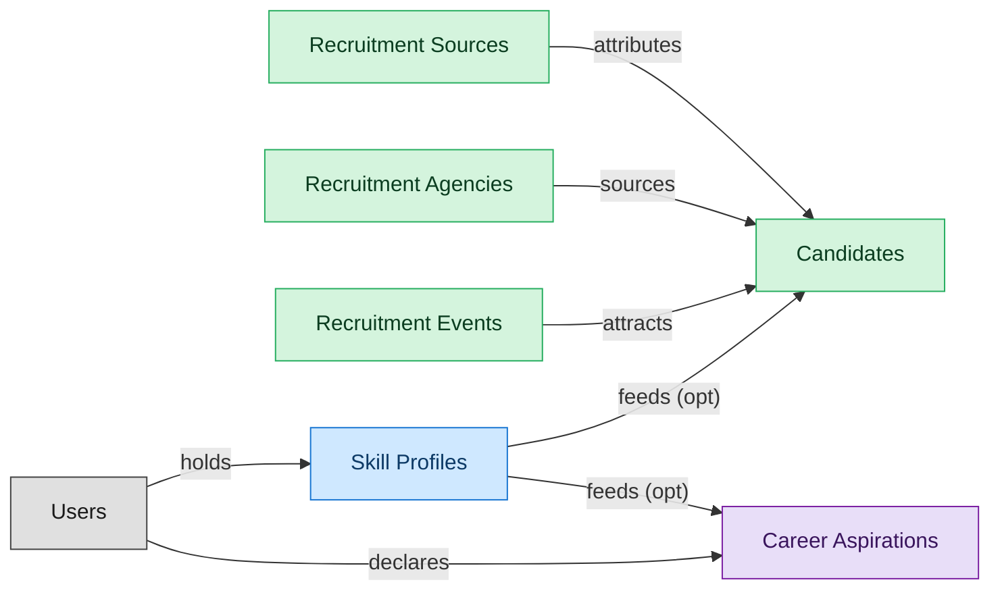

# Candidate CRM

## 1. Overview

The candidate-relationship backbone of an ATS - masters candidates (including the `prospect` lifecycle state), recruitment sources, agencies, and events. Structurally the same shape as standalone candidate-CRM products (Beamery, Avature CRM). Folds the AI-RECRUIT capability (resume parsing, ML matching, screening assistants) since those tools operate on `candidates` and are tightly bound to candidate workflows.

## 2. Entity summary

| Name | Description |
| --- | --- |
| Candidates | Person known to the recruiting org, with or without an active application. Carries contact details, resume, tags, GDPR consent, and source. Distinct from Employee until hired. |
| Recruitment Agencies | Third-party recruiter or staffing firm supplying candidates. Tracks contract terms, contact, performance, and the candidates they have submitted. |
| Recruitment Events | Career fair, on-campus event, hackathon, or meetup used as a sourcing channel. Tracks attendees, captured leads, and event ROI. |
| Recruitment Sources | Channel a candidate came from: job board, referral, agency, sourcing campaign, career event, or inbound. Used for source-of-hire analytics and channel ROI. |
| Skill Profiles | Per-worker collection of skills with self-assessed and validated proficiency levels, derived from completed courses, certifications, performance signals, and inferred peer-comparison. The Workday Skills Cloud central artifact and equivalents (SuccessFactors Skills, Cornerstone Capabilities, Eightfold Talent DNA). |
| Career Aspirations | Worker-declared career interest: target roles, mobility preferences (geographic, functional), aspired timeline. Drives internal-mobility matching. |

## 3. Entities catalog

| # | data_object | role | mastered in | necessity | pattern flags | notes |
| ---: | --- | --- | --- | --- | --- | --- |
| 1 | `candidates` (Candidates) | master | - | required | personal_content | - |
| 2 | `recruitment_agencies` (Recruitment Agencies) | master | - | required | - | - |
| 3 | `recruitment_events` (Recruitment Events) | master | - | required | - | - |
| 4 | `recruitment_sources` (Recruitment Sources) | master | - | required | - | - |
| 5 | `skill_profiles` (Skill Profiles) | contributor | `lms-skills` | required | personal_content | - |
| 6 | `career_aspirations` (Career Aspirations) | consumer | `talent-succession-career` | optional | personal_content | - |

## 4. Aliases and industry synonyms

_(no industry-scoped aliases or non-synonym alias types loaded for this scope; generic synonyms are omitted as common knowledge.)_

## 5. Relationships

### 5.1 Intra-scope edges

| from | verb | to | cardinality | kind | necessity | owner_side | notes |
| --- | --- | --- | --- | --- | --- | --- | --- |
| `skill_profiles` | feeds | `candidates` | one_to_many | reference | optional | source | cross \| cluster A \| LMS \| internal-candidate skill data flows to ATS |
| `skill_profiles` | feeds | `career_aspirations` | one_to_many | reference | optional | source | cross \| cluster A \| LMS \| skill profile drives talent-mobility matching |
| `recruitment_sources` | attributes | `candidates` | one_to_many | reference | required | target | intra \| ATS \| source-of-hire dimension on candidate |
| `recruitment_agencies` | sources | `candidates` | one_to_many | reference | required | target | intra \| ATS \| agency is the channel; candidate persists |
| `recruitment_events` | attracts | `candidates` | one_to_many | reference | required | target | intra \| ATS \| event is the touchpoint; candidate persists |

### 5.2 Built-in edges (`users` and other platform built-ins)

| from | verb | to | cardinality | necessity | owner_side | notes |
| --- | --- | --- | --- | --- | --- | --- |
| `users` | holds | `skill_profiles` | one_to_many | required | source | users \| cluster A \| LMS \| learner identity \| auto-flipped from many_to_one |
| `users` | declares | `career_aspirations` | one_to_many | required | target | The employee whose aspirations these are. |

### 5.3 Cross-scope edges

| from | verb | to | cardinality | necessity | notes |
| --- | --- | --- | --- | --- | --- |
| `employees` | holds | `skill_profiles` | one_to_one | optional | intra \| cluster A \| HCM \| each employee may have a skill profile |
| `job_profiles` | maps_to | `skill_profiles` | many_to_many | optional | intra \| cluster A \| HCM \| competencies expected by job profile |
| `employees` | becomes | `career_aspirations` | one_to_one | optional | cross \| cluster A \| HCM \| new employee triggers talent-profile initialization in Talent-Mgmt |
| `skill_profiles` | updated by | `learner_certifications` | one_to_many | optional | intra \| cluster A \| LMS \| earning a cert refreshes the worker skill profile \| auto-flipped from many_to_one |
| `skill_profiles` | updated by | `course_enrollments` | one_to_many | optional | intra \| cluster A \| LMS \| completion refreshes skill profile \| auto-flipped from many_to_one |
| `job_profiles` | expects | `skill_profiles` | many_to_many | optional | intra \| cluster A \| LMS \| competency expectation by profile |
| `course_enrollments` | updates | `career_aspirations` | one_to_many | optional | cross \| cluster A \| LMS \| completion drives dev-plans / succession |
| `career_aspirations` | informs | `survey_responses` | one_to_many | optional | cross \| cluster A \| EMP-EXP \| negative sentiment triggers flight-risk review in TM \| auto-flipped from many_to_one |
| `candidates` | submits | `job_applications` | one_to_many | required | intra \| ATS \| candidate persists across applications |
| `candidate_referrals` | introduces | `candidates` | one_to_many | required | intra \| ATS \| referral is the introduction event; candidate is durable |
| `talent_pools` | groups | `candidates` | many_to_many | required | intra \| ATS \| pool is a membership shell; candidate lives outside it |
| `candidates` | becomes | `employees` | one_to_one | required | cross \| ATS→HCM \| candidate.hired creates employee record; identity handoff |
| `candidates` | becomes pre-employee | `pre_employees` | one_to_one | required | Candidate identity continues into the pre-employee record; promoted to employees on activation. |
| `succession_plans` | considers | `career_aspirations` | one_to_many | optional | Successor selection respects employee-declared aspirations and mobility preferences. |

## 6. Cross-domain context

### 6.1 Master consumers (other modules / domains that embed this scope's masters)

| data_object | other module / domain | role | necessity | notes |
| --- | --- | --- | --- | --- |
| `candidates` | ATS-BACKGROUND-CHECKS (Background Checks) - ATS | embedded_master | required | - |
| `candidates` | ATS-INTERVIEWS (Interviews) - ATS | embedded_master | required | - |
| `candidates` | ATS-OFFERS (Offers) - ATS | embedded_master | required | - |
| `candidates` | ATS-PRE-EMPLOYEE-RECORD (Pre-Employee Record) - ATS | embedded_master | required | - |
| `candidates` | ATS-RECRUITMENT-PIPELINE (Recruitment Pipeline) - ATS | embedded_master | required | - |
| `candidates` | ATS-REFERRALS (Employee Referrals) - ATS | embedded_master | required | - |
| `candidates` | ATS-TALENT-POOLS (Talent Pools) - ATS | embedded_master | required | - |
| `candidates` | BEN-ENROLLMENT (Enrollment and Life Events) - BEN-ADMIN | consumer | required | - |
| `candidates` | HCM-LIFECYCLE-WORKFLOWS (Employee Lifecycle Workflows) - HCM | consumer | required | - |
| `candidates` | ONB-JOURNEY-MGMT (Onboarding Journey Management) - ONBOARDING | consumer | required | - |
| `recruitment_sources` | PA-WORKFORCE-METRICS (Workforce Metrics) - PA | consumer | required | - |

### 6.2 Outbound handoffs (events this scope publishes)

| source module | target domain | target module | trigger_event | payload | integration | friction | description |
| --- | --- | --- | --- | --- | --- | --- | --- |
| ATS-CANDIDATE-CRM | HCM | HCM-LIFECYCLE-WORKFLOWS | `candidate.hired` | `candidates` | event_stream | high | Hired-candidate event publishes the hiring outcome to HCM, which must create the employee record. Identifier mapping (candidate_id -> employee_id) is the canonical reconciliation gap. |
| ATS-CANDIDATE-CRM | BEN-ADMIN | BEN-ENROLLMENT | `candidate.hired` | `candidates` | event_stream | low | Hired candidate triggers eligibility window in BEN-ADMIN. |
| ATS-CANDIDATE-CRM | PA | PA-WORKFORCE-METRICS | `recruitment_source.attributed` | `recruitment_sources` | batch_sync | low | Source attribution feeds people-analytics quality-of-hire and cost-per-hire models. |
| ATS-CANDIDATE-CRM | ONBOARDING | ONB-JOURNEY-MGMT | `candidate.hired` | `candidates` | event_stream | medium | Hired candidate drives onboarding-plan kickoff with role/location/manager context from ATS payload. |

### 6.3 Inbound handoffs (events this scope reacts to)

| target module | source domain | source module | trigger_event | payload | integration | friction | description |
| --- | --- | --- | --- | --- | --- | --- | --- |
| ATS-CANDIDATE-CRM | TALENT-MGMT | TALENT-SUCCESSION-CAREER | `successor.tagged` | `career_aspirations` | api_call | low | Successors identified in succession_plans surface in ATS as pre-qualified internal candidates for matched requisitions. |
| ATS-CANDIDATE-CRM | LMS | LMS-SKILLS | `skill_profile.updated` | `skill_profiles` | event_stream | medium | Internal-candidate skill data flows into ATS for internal mobility sourcing. |
| ATS-CANDIDATE-CRM | ATS | ATS-REFERRALS | `candidate_referral.submitted` | `candidates` | lifecycle_progression | low | - |

### 6.4 Master providers (modules / domains that own masters this scope embeds)

| data_object | role here | necessity | canonical owner(s) | slice notes |
| --- | --- | --- | --- | --- |
| `skill_profiles` | contributor | required | LMS-SKILLS (LMS) | - |
| `career_aspirations` | consumer | optional | TALENT-SUCCESSION-CAREER (TALENT-MGMT) | - |

## 7. Lifecycle states (per master)

### `candidates` (Candidate)

| order | state_name | initial? | terminal? | requires_permission? | derived gate | description |
| --- | --- | --- | --- | --- | --- | --- |
| 1 | `prospect` | ✓ | - | - | - | Person known to the recruiting org with no active application. |
| 2 | `active` | - | - | - | - | Candidate has at least one open application or is actively engaged. |
| 3 | `hired` | - | ✓ | ✓ | `ats-candidate-crm:hire_candidate` | Candidate accepted an offer and converted to employee. |
| 4 | `do_not_hire` | - | ✓ | ✓ | `ats-candidate-crm:flag_do_not_hire` | Candidate flagged as ineligible for future consideration; gated decision. |
| 5 | `archived` | - | ✓ | - | - | Candidate kept in the database but not active in any pipeline. |

### `recruitment_agencies` (Recruitment Agency)

| order | state_name | initial? | terminal? | requires_permission? | derived gate | description |
| --- | --- | --- | --- | --- | --- | --- |
| 1 | `prospective` | ✓ | - | - | - | Agency under evaluation; contract not yet executed. |
| 2 | `active` | - | - | - | - | Agency has executed agreement and is engaged on one or more requisitions. |
| 3 | `on_hold` | - | - | - | - | Engagement paused (performance review, contractual dispute, hiring freeze). |
| 4 | `terminated` | - | ✓ | - | - | Relationship ended; no further requisitions are routed to this agency. |

### `recruitment_events` (Recruitment Event)

| order | state_name | initial? | terminal? | requires_permission? | derived gate | description |
| --- | --- | --- | --- | --- | --- | --- |
| 1 | `planned` | ✓ | - | - | - | Event scoped and budgeted; date, venue, target audience set; registration not yet open. |
| 2 | `open_for_registration` | - | - | - | - | Registration is accepting attendees; promotion campaigns active. |
| 3 | `held` | - | - | - | - | Event has been executed; attendee lists captured, leads ingested into talent pool. |
| 4 | `closed` | - | ✓ | - | - | Post-event activities complete; cost accounting and source-attribution finalized. |
| 5 | `cancelled` | - | ✓ | - | - | Event called off before it happens; sunk costs recognized, attendees notified. |

## 8. Permissions and business rules (derived)

### 8.1 Permissions

| permission | tier | description | included in `:admin`? |
| --- | --- | --- | --- |
| `ats-candidate-crm:read` | baseline-read | Read access to every entity in the module | ✓ |
| `ats-candidate-crm:manage` | baseline-manage | Edit operational records | ✓ |
| `ats-candidate-crm:admin` | baseline-admin | Edit reference data and inherit every workflow gate below | - |
| `ats-candidate-crm:hire_candidate` | workflow-gate (lifecycle) | Transition `candidates` into state `hired` | ✓ |
| `ats-candidate-crm:flag_do_not_hire` | workflow-gate (lifecycle) | Transition `candidates` into state `do_not_hire` | ✓ |
| `ats-candidate-crm:view_all_candidates` | override (personal_content) | View all `candidates` rows beyond row-scope | ✓ |
| `ats-candidate-crm:manage_all_candidates` | override (personal_content) | Manage all `candidates` rows beyond row-scope | ✓ |

### 8.2 Business rules

| rule_name | data_object | source flag | intent |
| --- | --- | --- | --- |
| `candidate_edit_scope` | `candidates` | has_personal_content | Row-scope by default; override via `ats-candidate-crm:view_all_candidates` / `ats-candidate-crm:manage_all_candidates` |
