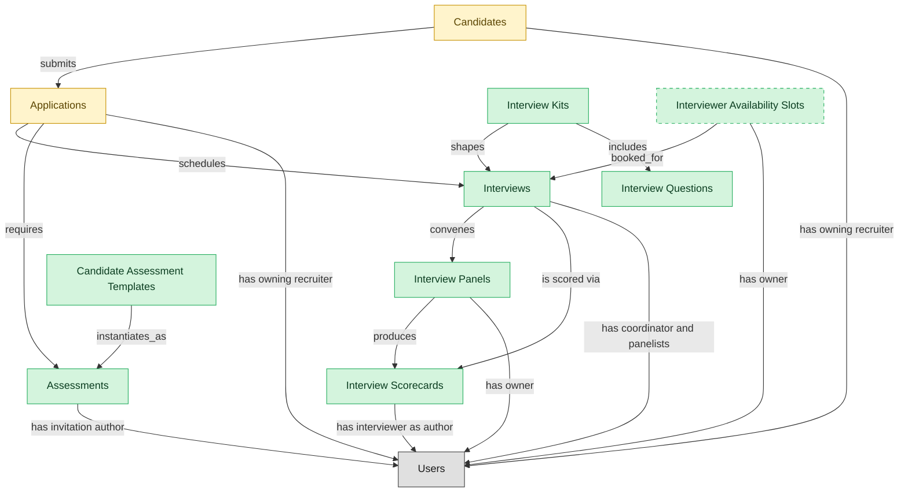

# Candidate Interviews

## 1. Overview

Interview scheduling, panel coordination, scorecards, and structured assessments. Realizes INTERVIEW-MGMT. Realizes the `interviewing` lifecycle state on `job_applications` (state pruned when this module is not installed).

## 2. Entity summary

| Name | data_object | Description |
| --- | --- | --- |
| Assessments | `candidate_assessments` | Skills, cognitive, technical, or personality test results attached to an application, often sourced from an external assessment provider. |
| Candidate Assessment Templates | `candidate_assessment_templates` | Reusable assessment definitions such as coding challenges, work samples, and skills tests, with time limit and scoring rubric, assigned to candidates. |
| Interview Kits | `interview_kits` | Reusable interview templates per role and stage, bundling questions, target competencies, recommended scorecard, and expected duration. |
| Interview Panels | `interview_panels` | Interviewers assigned to a specific interview, with each person's role on the panel and weight on the consolidated scorecard. |
| Interview Questions | `interview_questions` | Reusable interview questions tied to competencies, with question type, suggested follow-ups, and scoring rubric. |
| Interview Scorecards | `interview_scorecards` | Structured interviewer feedback against a rubric: per-competency ratings, written notes, and a hire or no-hire recommendation. |
| Interviewer Availability Slots | `interviewer_availability_slots` | Bookable time windows an interviewer has marked available, with allowed interview types, driving self-serve scheduling. |
| Interviews | `interviews` | Scheduled assessment events between a candidate and one or more interviewers, with time, location, panel, and outcome. |
| Applications | `job_applications` | Candidate submissions against a specific requisition, with pipeline stage, status, source, and full evaluation history. |
| Candidates | `candidates` | People known to the recruiting organization, with or without an active application, carrying contact details, resume, tags, consent, and source. |

## 3. Entities catalog

| # | data_object | canonical code | singular | plural | role | mastered in | mastered label | necessity | personal_content | entity_type | write tier | notes |
| ---: | --- | --- | --- | --- | --- | --- | --- | --- | --- | --- | --- | --- |
| 1 | `candidate_assessments` | `candidate_assessments` | Assessment | Assessments | master | - | - | required | - | operational_workflow | `:manage` | - |
| 2 | `candidate_assessment_templates` | `candidate_assessment_templates` | Candidate Assessment Template | Candidate Assessment Templates | master | - | - | required | - | catalog | `:admin` | - |
| 3 | `interview_kits` | `interview_kits` | Interview Kit | Interview Kits | master | - | - | required | - | catalog | `:admin` | - |
| 4 | `interview_panels` | `interview_panels` | Interview Panel | Interview Panels | master | - | - | required | - | junction | `:manage` | - |
| 5 | `interview_questions` | `interview_questions` | Interview Question | Interview Questions | master | - | - | required | - | catalog | `:admin` | - |
| 6 | `interview_scorecards` | `interview_scorecards` | Interview Scorecard | Interview Scorecards | master | - | - | required | yes | operational_workflow | `:manage` | - |
| 7 | `interviewer_availability_slots` | `interviewer_availability_slots` | Interviewer Availability Slot | Interviewer Availability Slots | master | - | - | optional | - | operational_workflow | `:manage` | - |
| 8 | `interviews` | `interviews` | Interview | Interviews | master | - | - | required | - | operational_workflow | `:manage` | - |
| 9 | `job_applications` | `job_applications` | Application | Applications | embedded_master | `ats-recruitment-pipeline` | Recruitment Pipeline | required | yes | operational_workflow | `:manage` | - |
| 10 | `candidates` | `candidates` | Candidate | Candidates | embedded_master | `ats-candidate-crm` | Candidate CRM | required | yes | operational_workflow | `:manage` | - |

## 4. Aliases and industry synonyms

_(none: no industry-scoped aliases for this scope)_

## 5. Relationships

### 5.1 Intra-scope edges

| from | verb | to | cardinality | kind | necessity | owner_side | delete_mode | fk_format | notes |
| --- | --- | --- | --- | --- | --- | --- | --- | --- | --- |
| `interview_kits` | shapes | `interviews` | one_to_many | reference | optional | source | clear | reference | - |
| `interview_kits` | includes | `interview_questions` | many_to_many | reference | optional | source | clear | reference | - |
| `interviews` | convenes | `interview_panels` | one_to_one | composition | required | source | cascade | parent | - |
| `interview_panels` | produces | `interview_scorecards` | one_to_many | composition | optional | source | cascade | parent | - |
| `candidate_assessment_templates` | instantiates_as | `candidate_assessments` | one_to_many | reference | optional | source | clear | reference | - |
| `interviewer_availability_slots` | booked_for | `interviews` | one_to_one | reference | optional | source | clear | reference | - |
| `candidates` | submits | `job_applications` | one_to_many | reference | required | target | restrict | reference | - |
| `job_applications` | schedules | `interviews` | one_to_many | reference | required | source | restrict | reference | - |
| `interviews` | is scored via | `interview_scorecards` | one_to_many | reference | required | source | restrict | reference | - |
| `job_applications` | requires | `candidate_assessments` | one_to_many | reference | required | source | restrict | reference | - |

### 5.2 Built-in edges (`users` and other platform built-ins)

| from | verb | to | cardinality | necessity | owner_side | delete_mode | fk_format | notes |
| --- | --- | --- | --- | --- | --- | --- | --- | --- |
| `candidates` | has owning recruiter | `users` | many_to_many | optional | source | clear | reference | - |
| `candidate_assessments` | has invitation author | `users` | many_to_many | required | source | restrict | reference | - |
| `interviewer_availability_slots` | has owner | `users` | many_to_many | required | source | restrict | reference | - |
| `interview_panels` | has owner | `users` | many_to_many | optional | source | clear | reference | - |
| `job_applications` | has owning recruiter | `users` | many_to_many | required | source | restrict | reference | - |
| `interviews` | has coordinator and panelists | `users` | many_to_many | required | source | restrict | reference | - |
| `interview_scorecards` | has interviewer as author | `users` | many_to_many | required | source | restrict | reference | - |

### 5.3 Cross-scope edges

#### 5.3a Outbound from this scope's masters and contributors

_Edges this scope drives: the in-scope endpoint has `role` of `master` or `contributor`._

_(none: no outbound cross-scope edges from this scope's masters or contributors)_

#### 5.3b Context edges on embedded shells and consumed entities

_Edges the canonical owner drives, shown for context: the in-scope endpoint has `role` of `embedded_master`, `consumer`, or `derived`._

| from | verb | to | cardinality | necessity | delete_mode | fk_format | notes |
| --- | --- | --- | --- | --- | --- | --- | --- |
| `candidates` | verified_via | `right_to_work_verifications` | one_to_many | optional | none | n/a | - |
| `candidates` | engaged_via | `candidate_engagements` | one_to_many | optional | none | n/a | - |
| `candidates` | attends_via | `recruiting_event_attendances` | one_to_many | required | none (required-if-present) | n/a | - |
| `candidates` | noted_via | `recruiter_interactions` | one_to_many | optional | none | n/a | - |
| `candidates` | consents_via | `candidate_consents` | one_to_many | required | ⚠ audit: required composed child out of scope | n/a | - |
| `candidates` | member_of_via | `talent_pool_memberships` | one_to_many | required | none (required-if-present) | n/a | - |
| `candidates` | discloses_via | `fcra_disclosures` | one_to_many | required | ⚠ audit: required composed child out of scope | n/a | - |
| `job_applications` | transitions_via | `application_stage_transitions` | one_to_many | required | ⚠ audit: required composed child out of scope | n/a | - |
| `job_applications` | answers_via | `application_screening_answers` | one_to_many | optional | none | n/a | - |
| `candidates` | self_identifies_via | `eeo_responses` | one_to_many | optional | none | n/a | - |
| `candidates` | submits_via | `data_subject_requests` | one_to_many | optional | none | n/a | - |
| `candidates` | self_ids_via | `voluntary_self_identifications` | one_to_many | optional | none | n/a | - |
| `candidates` | acknowledges_via | `fcra_summary_of_rights_acknowledgements` | one_to_many | optional | none | n/a | - |
| `job_applications` | disposed_via | `application_dispositions` | one_to_many | optional | none | n/a | - |
| `job_applications` | logged_via | `applicant_flow_records` | one_to_one | required | ⚠ audit: required composed child out of scope | n/a | - |
| `candidates` | documented_via | `candidate_documents` | one_to_many | optional | none | n/a | - |
| `candidates` | annotated_via | `candidate_notes` | one_to_many | optional | none | n/a | - |
| `candidates` | tagged_via | `candidate_tag_assignments` | one_to_many | optional | none | n/a | - |
| `skill_profiles` | feeds | `candidates` | one_to_many | optional | none | n/a | - |
| `job_requisitions` | receives | `job_applications` | one_to_many | required | none (required-if-present) | n/a | - |
| `job_postings` | is applied to via | `job_applications` | one_to_many | required | none (required-if-present) | n/a | - |
| `candidate_referrals` | introduces | `candidates` | one_to_many | required | none (required-if-present) | n/a | - |
| `recruitment_sources` | attributes | `candidates` | one_to_many | required | none (required-if-present) | n/a | - |
| `recruitment_agencies` | sources | `candidates` | one_to_many | required | none (required-if-present) | n/a | - |
| `recruitment_events` | attracts | `candidates` | one_to_many | required | none (required-if-present) | n/a | - |
| `talent_pools` | groups | `candidates` | many_to_many | required | none (required-if-present) | n/a | - |
| `job_applications` | results in | `job_offers` | one_to_many | required | none (required-if-present) | n/a | - |
| `candidates` | becomes | `employees` | one_to_one | required | none (required-if-present) | n/a | - |
| `candidates` | becomes pre-employee | `pre_employees` | one_to_one | required | none (required-if-present) | n/a | - |
| `employees` | applies_as | `candidates` | one_to_many | optional | none | n/a | - |
| `candidates` | corresponds_via | `candidate_emails` | one_to_many | optional | none | n/a | - |
| `candidates` | screened_via | `drug_health_screenings` | one_to_many | optional | none | n/a | - |
| `candidates` | submitted_via | `agency_submissions` | one_to_many | optional | none | n/a | - |

## 6. Cross-domain context

### 6.1 Master consumers (other modules / domains that embed this scope's masters)

| data_object | other module / domain | role | necessity | notes |
| --- | --- | --- | --- | --- |
| `candidate_assessments` | HCM-LIFECYCLE-WORKFLOWS (Employee Lifecycle Workflows) - HCM | consumer | optional | - |
| `candidate_assessments` | TALENT-PERFORMANCE-MGMT (Performance and Goal Management) - TALENT-MGMT | consumer | optional | - |
| `interview_scorecards` | HIRING-STARTER (Hiring Starter) - ATS | embedded_master | optional | - |
| `interviews` | HIRING-STARTER (Hiring Starter) - ATS | embedded_master | required | - |

### 6.2 Outbound handoffs (events this scope publishes)

| source module | target domain | target module | trigger_event | transition | payload | integration | friction | description |
| --- | --- | --- | --- | --- | --- | --- | --- | --- |
| ATS-CANDIDATE-CRM | HCM | HCM-LIFECYCLE-WORKFLOWS | `candidate.hired` | `hired` _(lifecycle)_ | `candidates` | event_stream | high | Hired-candidate event publishes the hiring outcome to HCM, which must create the employee record. Identifier mapping (candidate_id -> employee_id) is the canonical reconciliation gap. |
| ATS-INTERVIEWS | HCM | HCM-LIFECYCLE-WORKFLOWS | `candidate_assessment.failed` | _(lifecycle)_ | `candidate_assessments` | event_stream | low | Failed-assessment outcomes close the candidate's loop in ATS and propagate to HCM only if the candidate is an internal-mobility applicant whose profile should reflect the development gap. |
| ATS-INTERVIEWS | HCM | HCM-LIFECYCLE-WORKFLOWS | `candidate_assessment.passed` | _(lifecycle)_ | `candidate_assessments` | event_stream | medium | Passing an assessment advances the candidate; on eventual hire, HCM uses the assessment result as the first data point for the new-hire skill profile. |
| ATS-RECRUITMENT-PIPELINE | ATS | ATS-TALENT-POOLS | `job_application.rejected` | _(state_change)_ | `job_applications` | lifecycle_progression | low | - |
| ATS-INTERVIEWS | ATS | ATS-RECRUITMENT-PIPELINE | `candidate_assessment.failed` | _(lifecycle)_ | `job_applications` | lifecycle_progression | low | - |
| ATS-INTERVIEWS | ATS | ATS-RECRUITMENT-PIPELINE | `candidate_assessment.passed` | _(lifecycle)_ | `job_applications` | lifecycle_progression | low | - |
| ATS-INTERVIEWS | ATS | ATS-RECRUITMENT-PIPELINE | `interview.completed` | _(lifecycle)_ | `job_applications` | lifecycle_progression | low | - |
| ATS-INTERVIEWS | TALENT-MGMT | TALENT-SUCCESSION-CAREER | `candidate_assessment.passed` | _(lifecycle)_ | `candidate_assessments` | api_call | medium | Completed assessment scores seed the talent-management skill profile for hired candidates and a structured talent pool for non-hires. |
| ATS-CANDIDATE-CRM | BEN-ADMIN | BEN-ENROLLMENT | `candidate.hired` | `hired` _(lifecycle)_ | `candidates` | event_stream | low | Hired candidate triggers eligibility window in BEN-ADMIN. |
| ATS-INTERVIEWS | PA | PA-WORKFORCE-METRICS | `interview_scorecard.submitted` | _(lifecycle)_ | `interview_scorecards` | event_stream | low | - |
| ATS-CANDIDATE-CRM | ONBOARDING | ONB-JOURNEY-MGMT | `candidate.hired` | `hired` _(lifecycle)_ | `candidates` | event_stream | medium | Hired candidate drives onboarding-plan kickoff with role/location/manager context from ATS payload. |

### 6.3 Inbound handoffs (events this scope reacts to)

| target module | source domain | source module | trigger_event | transition | payload | integration | friction | description |
| --- | --- | --- | --- | --- | --- | --- | --- | --- |
| ATS-CANDIDATE-CRM | HCM | HCM-CORE-WORKER | `employee.applied_internally` | `active` → `active` _(signal)_ | `candidates` | api_call | medium | When an employee applies internally, HCM hands the worker context to the applicant tracker, which materializes an internal candidate record from the worker profile. Friction: reconciling the worker identity against the candidate identity space. |
| ATS-RECRUITMENT-PIPELINE | ATS | ATS-TALENT-POOLS | `talent_pool.candidate_activated` | _(state_change)_ | `job_applications` | lifecycle_progression | low | - |
| ATS-CANDIDATE-CRM | ATS | ATS-REFERRALS | `candidate_referral.submitted` | _(lifecycle)_ | `candidates` | lifecycle_progression | low | - |
| ATS-INTERVIEWS | ATS | ATS-RECRUITMENT-PIPELINE | `job_application.advanced` | _(state_change)_ | `interviews` | lifecycle_progression | low | - |

### 6.4 Master providers (modules / domains that own masters this scope embeds)

| data_object | role here | necessity | canonical owner(s) | slice notes |
| --- | --- | --- | --- | --- |
| `candidates` | embedded_master | required | ATS-CANDIDATE-CRM (ATS) | - |
| `job_applications` | embedded_master | required | ATS-RECRUITMENT-PIPELINE (ATS) | - |

## 7. Lifecycle states

### `candidate_assessment_templates` (Candidate Assessment Template)

| order | state_name | initial? | terminal? | requires_permission? | derived gate | description |
| --- | --- | --- | --- | --- | --- | --- |
| 1 | `draft` | ✓ | - | - | - | Template being authored / validated. |
| 2 | `active` | - | - | - | - | Template assignable to candidates. |
| 3 | `retired` | - | ✓ | - | - | Template no longer assignable. |

### `candidate_assessments` (Assessment)

| order | state_name | initial? | terminal? | requires_permission? | derived gate | description |
| --- | --- | --- | --- | --- | --- | --- |
| 1 | `invited` | ✓ | - | - | - | Assessment invitation sent to the candidate by the partner system. |
| 2 | `in_progress` | - | - | - | - | Candidate is actively taking the assessment. |
| 3 | `completed` | - | ✓ | - | - | Candidate finished the assessment and a score/result is recorded. |
| 4 | `expired` | - | ✓ | - | - | Invitation lapsed before the candidate completed the assessment. |
| 5 | `canceled` | - | ✓ | - | - | Assessment withdrawn before completion. |

### `candidates` (Candidate)

_This scope holds `candidates` as **embedded_master**; the canonical state machine is owned by `ATS-CANDIDATE-CRM`._

| order | state_name | initial? | terminal? | requires_permission? | derived gate | description |
| --- | --- | --- | --- | --- | --- | --- |
| 1 | `prospect` | ✓ | - | - | - | Person known to the recruiting org with no active application. |
| 2 | `active` | - | - | - | - | Candidate has at least one open application or is actively engaged. |
| 3 | `hired` | - | ✓ | ✓ | `ats-interviews:hire_candidate` | Candidate accepted an offer and converted to employee. |
| 4 | `do_not_hire` | - | ✓ | ✓ | `ats-interviews:flag_do_not_hire` | Candidate flagged as ineligible for future consideration; gated decision. |
| 5 | `archived` | - | ✓ | - | - | Candidate kept in the database but not active in any pipeline. |

### `interview_kits` (Interview Kit)

| order | state_name | initial? | terminal? | requires_permission? | derived gate | description |
| --- | --- | --- | --- | --- | --- | --- |
| 1 | `draft` | ✓ | - | - | - | Kit being authored. |
| 2 | `active` | - | - | - | - | Kit in use for live interviews. |
| 3 | `archived` | - | ✓ | - | - | Kit retired; no new interviews schedule against it. |

### `interview_panels` (Interview Panel)

| order | state_name | initial? | terminal? | requires_permission? | derived gate | description |
| --- | --- | --- | --- | --- | --- | --- |
| 1 | `forming` | ✓ | - | - | - | Recruiter assembling the panel. |
| 2 | `assembled` | - | - | - | - | All panel members confirmed; interview can proceed. |
| 3 | `completed` | - | ✓ | - | - | Interview held; consolidated debrief done. |
| 4 | `canceled` | - | ✓ | - | - | Panel disbanded before interview. |

### `interview_scorecards` (Interview Scorecard)

| order | state_name | initial? | terminal? | requires_permission? | derived gate | description |
| --- | --- | --- | --- | --- | --- | --- |
| 1 | `draft` | ✓ | - | - | - | Interviewer is filling in ratings and notes against the rubric. |
| 2 | `submitted` | - | ✓ | ✓ | `ats-interviews:submit_scorecard` | Scorecard submitted and locked; hire/no-hire recommendation recorded. |

### `interviewer_availability_slots` (Interviewer Availability Slot)

| order | state_name | initial? | terminal? | requires_permission? | derived gate | description |
| --- | --- | --- | --- | --- | --- | --- |
| 1 | `available` | ✓ | - | - | - | Slot bookable. |
| 2 | `booked` | - | - | - | - | Slot reserved for an interview. |
| 3 | `released` | - | ✓ | - | - | Booking canceled; slot freed. |
| 4 | `past` | - | ✓ | - | - | Slot expired without booking. |

### `interviews` (Interview)

| order | state_name | initial? | terminal? | requires_permission? | derived gate | description |
| --- | --- | --- | --- | --- | --- | --- |
| 1 | `scheduled` | ✓ | - | - | - | Interview booked with candidate, panel, time, and medium. |
| 2 | `confirmed` | - | - | - | - | Candidate and panel confirmed attendance. |
| 3 | `completed` | - | ✓ | - | - | Interview took place; scorecards are being collected. |
| 4 | `no_show` | - | ✓ | - | - | Candidate or panel did not attend; interview did not occur. |
| 5 | `canceled` | - | ✓ | - | - | Interview canceled before it took place. |
| 6 | `rescheduled` | - | ✓ | - | - | Original slot abandoned in favor of a new scheduled interview record. |

### `job_applications` (Application)

_This scope holds `job_applications` as **embedded_master**; the canonical state machine is owned by `ATS-RECRUITMENT-PIPELINE`._

| order | state_name | initial? | terminal? | requires_permission? | derived gate | description |
| --- | --- | --- | --- | --- | --- | --- |
| 1 | `applied` | ✓ | - | - | - | Candidate submitted an application against the requisition. |
| 2 | `screening` | - | - | - | - | Recruiter is reviewing resume and qualifications. |
| 3 | `interviewing` | - | - | - | - | Candidate is progressing through interview loops. |
| 4 | `offer_extended` | - | - | - | - | An offer has been generated and is in flight for this application. |
| 5 | `hired` | - | ✓ | ✓ | `ats-interviews:hire_candidate` | Candidate accepted the offer and was hired; gated transition. |
| 6 | `rejected` | - | ✓ | - | - | Application closed without progression by recruiter or hiring manager. |
| 7 | `withdrawn` | - | ✓ | - | - | Candidate withdrew their application. |

## 8. Permissions and business rules (derived)

### 8.1 Permissions

| permission | tier | description | included in `:admin`? |
| --- | --- | --- | --- |
| `ats-interviews:read` | baseline-read | Read access to every entity in the module | ✓ |
| `ats-interviews:manage` | baseline-manage | Edit operational records | ✓ |
| `ats-interviews:admin` | baseline-admin | Edit reference data and inherit every workflow gate below | - |
| `ats-interviews:hire_candidate` | workflow-gate (lifecycle) | Transition `candidates` into state `hired` | ✓ |
| `ats-interviews:flag_do_not_hire` | workflow-gate (lifecycle) | Transition `candidates` into state `do_not_hire` | ✓ |
| `ats-interviews:submit_scorecard` | workflow-gate (lifecycle) | Transition `interview_scorecards` into state `submitted` | ✓ |
| `ats-interviews:view_all_interview_scorecards` | override (personal_content) | View all `interview_scorecards` rows beyond row-scope | ✓ |
| `ats-interviews:manage_all_interview_scorecards` | override (personal_content) | Manage all `interview_scorecards` rows beyond row-scope | ✓ |
| `ats-interviews:view_all_candidates` | override (personal_content) | View all `candidates` rows beyond row-scope | ✓ |
| `ats-interviews:manage_all_candidates` | override (personal_content) | Manage all `candidates` rows beyond row-scope | ✓ |
| `ats-interviews:view_all_applications` | override (personal_content) | View all `job_applications` rows beyond row-scope | ✓ |
| `ats-interviews:manage_all_applications` | override (personal_content) | Manage all `job_applications` rows beyond row-scope | ✓ |

### 8.2 Business rules

| rule_name | data_object | source flag | intent |
| --- | --- | --- | --- |
| `interview_scorecard_edit_scope` | `interview_scorecards` | has_personal_content | Row-scope by default; override via `ats-interviews:view_all_interview_scorecards` / `ats-interviews:manage_all_interview_scorecards` |
| `candidate_edit_scope` | `candidates` | has_personal_content | Row-scope by default; override via `ats-interviews:view_all_candidates` / `ats-interviews:manage_all_candidates` |
| `application_edit_scope` | `job_applications` | has_personal_content | Row-scope by default; override via `ats-interviews:view_all_applications` / `ats-interviews:manage_all_applications` |

## 9. Roles, RACI, and responsibilities (derived)

_Baseline roles, the permission hierarchy, and RACI realization are DERIVED from this scope's entity-type write tiers + `process_raci`; none of it is stored in the catalog (the deployer provisions it from this blueprint)._

### 9.1 `ATS-INTERVIEWS`

**Baseline roles:**

| role | baseline grant |
| --- | --- |
| `ats-interviews_viewer` | `ats-interviews:read` |
| `ats-interviews_manager` | `ats-interviews:manage` |
| `ats-interviews_admin` | `ats-interviews:admin` |

**Permission hierarchy:**

| permission | includes |
| --- | --- |
| `ats-interviews:admin` | `ats-interviews:manage` |
| `ats-interviews:manage` | `ats-interviews:read` |
| `ats-interviews:admin` | `ats-interviews:hire_candidate` |
| `ats-interviews:admin` | `ats-interviews:flag_do_not_hire` |
| `ats-interviews:admin` | `ats-interviews:submit_scorecard` |
| `ats-interviews:admin` | `ats-interviews:view_all_interview_scorecards` |
| `ats-interviews:admin` | `ats-interviews:manage_all_interview_scorecards` |
| `ats-interviews:admin` | `ats-interviews:view_all_candidates` |
| `ats-interviews:admin` | `ats-interviews:manage_all_candidates` |
| `ats-interviews:admin` | `ats-interviews:view_all_applications` |
| `ats-interviews:admin` | `ats-interviews:manage_all_applications` |

**Processes wired:**

| process_key | process_name | PCF code | PCF ID | level | description |
| --- | --- | --- | --- | --- | --- |
| `hire_candidate` | Hire candidate | 7.2.4.3 | 10465 | 4 | Wrapping up the process for hiring candidates. Agree to all hiring terms and conditions. Have the candidate accept and sign the job offer. |
| `interview_candidates` | Interview candidates | 7.2.3.2 | 10457 | 4 | Assessing the candidates by their performance in the interviews. Conduct HR interview, technical interview, hiring manager interview, etc. Understand the mindset of the candidate, and comprehend his/her personal and professional lives. |

**RACI realization:**

| actor | kind | raci | process_key | realization |
| --- | --- | --- | --- | --- |
| `RECRUITING-RECRUITER` | persona | responsible | `hire_candidate` | grant gates [ats-interviews:hire_candidate, ats-interviews:hire_candidate] + the gated entities' write tier |
| `HIRING-MANAGER` | persona | accountable | `hire_candidate` | approval gate |
| `LEGAL-COMPLIANCE-SPECIALIST` | persona | informed | `hire_candidate` | notification side effect (trigger_event / webhook_receiver) |
| `HIRING-MANAGER` | persona | responsible | `interview_candidates` | grant gates [ats-interviews:submit_scorecard] + the gated entities' write tier |
| `RECRUITING-MANAGER` | persona | accountable | `interview_candidates` | approval gate |
| `RECRUITING-RECRUITER` | persona | consulted | `interview_candidates` | advisory read grant |
| `RECRUITING-COORDINATOR` | persona | informed | `interview_candidates` | notification side effect (trigger_event / webhook_receiver) |

### 9.2 Functional ownership and default grants

| responsibility | business function | default role | default tier |
| --- | --- | --- | --- |
| owner | Recruiting | `admin` | `:admin` |
| contributor | Human Resources | `manage` | `:manage` |
| contributor | Legal | `manage` | `:manage` |
| consumer | Finance | `read` | `:read` |
