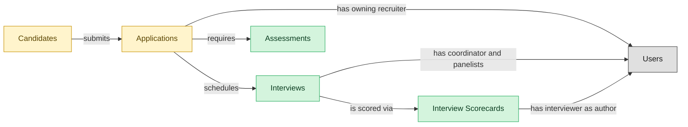

# Interviews

## 1. Overview

Interview scheduling, panel coordination, scorecards, and structured assessments. Realizes INTERVIEW-MGMT. Realizes the `interviewing` lifecycle state on `job_applications` (state pruned when this module is not installed).

## 2. Entity summary

| Name | Description |
| --- | --- |
| Assessments | Skills, cognitive, technical, or personality test result attached to an application. Often sourced from a partner system (HackerRank, Codility, Pymetrics) and referenced here. |
| Interview Scorecards | Structured interviewer feedback against a defined rubric: per-competency ratings, written notes, and a hire/no-hire recommendation. |
| Interviews | Scheduled assessment event between a candidate and one or more interviewers. Carries time, location/medium, panel, interview kit, and outcome. |
| Applications | A candidate's submission against a specific requisition. Carries pipeline stage, status (active / rejected / withdrawn / hired), source, and the full evaluation history. |
| Candidates | Person known to the recruiting org, with or without an active application. Carries contact details, resume, tags, GDPR consent, and source. Distinct from Employee until hired. |

## 3. Entities catalog

| # | data_object | role | mastered in | necessity | pattern flags | notes |
| ---: | --- | --- | --- | --- | --- | --- |
| 1 | `candidate_assessments` (Assessments) | master | - | required | submit_lock | - |
| 2 | `interview_scorecards` (Interview Scorecards) | master | - | required | personal_content, submit_lock | - |
| 3 | `interviews` (Interviews) | master | - | required | - | - |
| 4 | `job_applications` (Applications) | embedded_master | `ats-recruitment-pipeline` | required | personal_content | - |
| 5 | `candidates` (Candidates) | embedded_master | `ats-candidate-crm` | required | personal_content | - |

## 4. Aliases and industry synonyms

_(no industry-scoped aliases or non-synonym alias types loaded for this scope; generic synonyms are omitted as common knowledge.)_

## 5. Relationships

### 5.1 Intra-scope edges

| from | verb | to | cardinality | kind | necessity | owner_side | notes |
| --- | --- | --- | --- | --- | --- | --- | --- |
| `candidates` | submits | `job_applications` | one_to_many | reference | required | target | intra \| ATS \| candidate persists across applications |
| `job_applications` | schedules | `interviews` | one_to_many | reference | required | source | intra \| ATS \| interview belongs to the application's pipeline |
| `interviews` | is scored via | `interview_scorecards` | one_to_many | reference | required | source | intra \| ATS \| scorecards are children of the interview |
| `job_applications` | requires | `candidate_assessments` | one_to_many | reference | required | source | intra \| ATS \| assessment invitation belongs to the app's pipeline |

### 5.2 Built-in edges (`users` and other platform built-ins)

| from | verb | to | cardinality | necessity | owner_side | notes |
| --- | --- | --- | --- | --- | --- | --- |
| `job_applications` | has owning recruiter | `users` | many_to_many | required | source | users \| ATS \| recruiter role on the application |
| `interviews` | has coordinator and panelists | `users` | many_to_many | required | source | users \| ATS \| coordinator + panelist roles on the interview |
| `interview_scorecards` | has interviewer as author | `users` | many_to_many | required | source | users \| ATS \| interviewer is the scorecard author |

### 5.3 Cross-scope edges

| from | verb | to | cardinality | necessity | notes |
| --- | --- | --- | --- | --- | --- |
| `skill_profiles` | feeds | `candidates` | one_to_many | optional | cross \| cluster A \| LMS \| internal-candidate skill data flows to ATS |
| `job_requisitions` | receives | `job_applications` | one_to_many | required | intra \| ATS \| apps target a specific req |
| `job_postings` | is applied to via | `job_applications` | one_to_many | required | intra \| ATS \| app inflow is anchored on a posting |
| `candidate_referrals` | introduces | `candidates` | one_to_many | required | intra \| ATS \| referral is the introduction event; candidate is durable |
| `recruitment_sources` | attributes | `candidates` | one_to_many | required | intra \| ATS \| source-of-hire dimension on candidate |
| `recruitment_agencies` | sources | `candidates` | one_to_many | required | intra \| ATS \| agency is the channel; candidate persists |
| `recruitment_events` | attracts | `candidates` | one_to_many | required | intra \| ATS \| event is the touchpoint; candidate persists |
| `talent_pools` | groups | `candidates` | many_to_many | required | intra \| ATS \| pool is a membership shell; candidate lives outside it |
| `job_applications` | results in | `job_offers` | one_to_many | required | intra \| ATS \| offer is the conversion of the application |
| `candidates` | becomes | `employees` | one_to_one | required | cross \| ATS→HCM \| candidate.hired creates employee record; identity handoff |
| `candidate_assessments` | informs | `risk_assessments` | many_to_many | optional | cross \| ATS→TALENT-MGMT \| assessment.completed contributes to talent risk assessment (analytical) |
| `candidates` | becomes pre-employee | `pre_employees` | one_to_one | required | Candidate identity continues into the pre-employee record; promoted to employees on activation. |

## 6. Cross-domain context

### 6.1 Master consumers (other modules / domains that embed this scope's masters)

| data_object | other module / domain | role | necessity | notes |
| --- | --- | --- | --- | --- |
| `candidate_assessments` | HCM-LIFECYCLE-WORKFLOWS (Employee Lifecycle Workflows) - HCM | consumer | required | - |
| `candidate_assessments` | TALENT-PERFORMANCE-MGMT (Performance and Goal Management) - TALENT-MGMT | consumer | optional | - |

### 6.2 Outbound handoffs (events this scope publishes)

| source module | target domain | target module | trigger_event | payload | integration | friction | description |
| --- | --- | --- | --- | --- | --- | --- | --- |
| ATS-INTERVIEWS | HCM | HCM-LIFECYCLE-WORKFLOWS | `candidate_assessment.failed` | `candidate_assessments` | event_stream | low | Failed-assessment outcomes close the candidate's loop in ATS and propagate to HCM only if the candidate is an internal-mobility applicant whose profile should reflect the development gap. |
| ATS-INTERVIEWS | HCM | HCM-LIFECYCLE-WORKFLOWS | `candidate_assessment.passed` | `candidate_assessments` | event_stream | medium | Passing an assessment advances the candidate; on eventual hire, HCM uses the assessment result as the first data point for the new-hire skill profile. |
| ATS-INTERVIEWS | ATS | ATS-RECRUITMENT-PIPELINE | `interview.completed` | `job_applications` | lifecycle_progression | low | - |
| ATS-INTERVIEWS | ATS | ATS-RECRUITMENT-PIPELINE | `candidate_assessment.passed` | `job_applications` | lifecycle_progression | low | - |
| ATS-INTERVIEWS | ATS | ATS-RECRUITMENT-PIPELINE | `candidate_assessment.failed` | `job_applications` | lifecycle_progression | low | - |
| ATS-INTERVIEWS | TALENT-MGMT | TALENT-SUCCESSION-CAREER | `candidate_assessment.passed` | `candidate_assessments` | api_call | medium | Completed assessment scores seed the talent-management skill profile for hired candidates and a structured talent pool for non-hires. |

### 6.3 Inbound handoffs (events this scope reacts to)

| target module | source domain | source module | trigger_event | payload | integration | friction | description |
| --- | --- | --- | --- | --- | --- | --- | --- |
| ATS-INTERVIEWS | ATS | ATS-RECRUITMENT-PIPELINE | `job_application.advanced` | `interviews` | lifecycle_progression | low | - |

### 6.4 Master providers (modules / domains that own masters this scope embeds)

| data_object | role here | necessity | canonical owner(s) | slice notes |
| --- | --- | --- | --- | --- |
| `candidates` | embedded_master | required | ATS-CANDIDATE-CRM (ATS) | - |
| `job_applications` | embedded_master | required | ATS-RECRUITMENT-PIPELINE (ATS) | - |

## 7. Lifecycle states (per master)

### `candidate_assessments` (Assessment)

| order | state_name | initial? | terminal? | requires_permission? | derived gate | description |
| --- | --- | --- | --- | --- | --- | --- |
| 1 | `invited` | ✓ | - | - | - | Assessment invitation sent to the candidate by the partner system. |
| 2 | `in_progress` | - | - | - | - | Candidate is actively taking the assessment. |
| 3 | `completed` | - | ✓ | - | - | Candidate finished the assessment and a score/result is recorded. |
| 4 | `expired` | - | ✓ | - | - | Invitation lapsed before the candidate completed the assessment. |
| 5 | `cancelled` | - | ✓ | - | - | Assessment withdrawn before completion. |

### `interview_scorecards` (Interview Scorecard)

| order | state_name | initial? | terminal? | requires_permission? | derived gate | description |
| --- | --- | --- | --- | --- | --- | --- |
| 1 | `draft` | ✓ | - | - | - | Interviewer is filling in ratings and notes against the rubric. |
| 2 | `submitted` | - | ✓ | ✓ | `ats-interviews:submitted_interview_scorecard` | Scorecard submitted and locked; hire/no-hire recommendation recorded. |

### `interviews` (Interview)

| order | state_name | initial? | terminal? | requires_permission? | derived gate | description |
| --- | --- | --- | --- | --- | --- | --- |
| 1 | `scheduled` | ✓ | - | - | - | Interview booked with candidate, panel, time, and medium. |
| 2 | `confirmed` | - | - | - | - | Candidate and panel confirmed attendance. |
| 3 | `completed` | - | ✓ | - | - | Interview took place; scorecards are being collected. |
| 4 | `no_show` | - | ✓ | - | - | Candidate or panel did not attend; interview did not occur. |
| 5 | `cancelled` | - | ✓ | - | - | Interview cancelled before it took place. |
| 6 | `rescheduled` | - | ✓ | - | - | Original slot abandoned in favor of a new scheduled interview record. |

### `job_applications` (Application)

| order | state_name | initial? | terminal? | requires_permission? | derived gate | description |
| --- | --- | --- | --- | --- | --- | --- |
| 3 | `interviewing` | - | - | - | - | Candidate is progressing through interview loops. |

## 8. Permissions and business rules (derived)

### 8.1 Permissions

| permission | tier | description | included in `:admin`? |
| --- | --- | --- | --- |
| `ats-interviews:read` | baseline-read | Read access to every entity in the module | ✓ |
| `ats-interviews:manage` | baseline-manage | Edit operational records | ✓ |
| `ats-interviews:admin` | baseline-admin | Edit reference data and inherit every workflow gate below | - |
| `ats-interviews:submitted_interview_scorecard` | workflow-gate (lifecycle) | Transition `interview_scorecards` into state `submitted` | ✓ |
| `ats-interviews:view_all_interview_scorecards` | override (personal_content) | View all `interview_scorecards` rows beyond row-scope | ✓ |
| `ats-interviews:manage_all_interview_scorecards` | override (personal_content) | Manage all `interview_scorecards` rows beyond row-scope | ✓ |
| `ats-interviews:submit_interview_scorecard` | override (submit_lock) | Submit and lock a `interview_scorecards` row (post-submit edits gated) | ✓ |
| `ats-interviews:submit_assessment` | override (submit_lock) | Submit and lock a `candidate_assessments` row (post-submit edits gated) | ✓ |

### 8.2 Business rules

| rule_name | data_object | source flag | intent |
| --- | --- | --- | --- |
| `interview_scorecard_edit_scope` | `interview_scorecards` | has_personal_content | Row-scope by default; override via `ats-interviews:view_all_interview_scorecards` / `ats-interviews:manage_all_interview_scorecards` |
| `submit_restricted_to_interview_scorecard_owner` | `interview_scorecards` | has_submit_lock | Only the row's authoring user can submit; post-submit the row is read-only except via `ats-interviews:manage_all_interview_scorecards` |
| `submit_restricted_to_assessment_owner` | `candidate_assessments` | has_submit_lock | Only the row's authoring user can submit; post-submit the row is read-only except via `ats-interviews:manage_all_assessments` |
