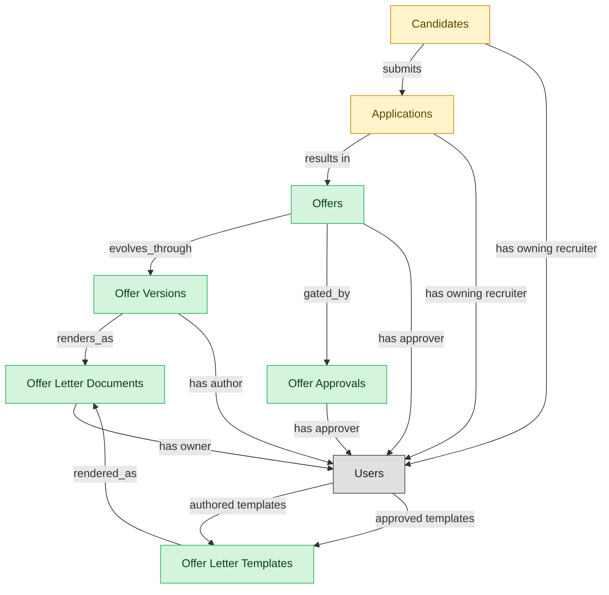

# Offers

## 1. Overview

Offer drafting, approval, extension, signature, and acceptance. Realizes OFFER-MGMT. Realizes the `offer_extended` state on `job_applications`. Requires an external `sign_document` tool, drops module Semantius coverage to ~83%.

## 2. Entity summary

| Name | data_object | Description |
| --- | --- | --- |
| Offer Approvals | `offer_approvals` | Approval steps in the offer-approval chain, triggered when an offer exceeds band, includes non-standard equity, or matches other escalation rules. |
| Offer Letter Documents | `offer_letter_documents` | Generated PDF letters of the offer terms, versioned alongside the structured offer and linked to the e-signature envelope. |
| Offer Letter Templates | `offer_letter_templates` | Reusable offer-letter templates with merge tokens for candidate, role, and pay terms, versioned by jurisdiction and language to render offer letters. |
| Offer Versions | `offer_versions` | Versioned snapshots of a job offer during negotiation, each holding the structured terms and the author of the change, from initial through accepted. |
| Offers | `job_offers` | Formal employment offers extended to candidates, with compensation, start date, terms, approval chain, and status. |
| Applications | `job_applications` | Candidate submissions against a specific requisition, with pipeline stage, status, source, and full evaluation history. |
| Candidates | `candidates` | People known to the recruiting organization, with or without an active application, carrying contact details, resume, tags, consent, and source. |

## 3. Entities catalog

| # | data_object | canonical code | singular | plural | role | mastered in | mastered label | necessity | pattern flags | entity_type | write tier | notes |
| ---: | --- | --- | --- | --- | --- | --- | --- | --- | --- | --- | --- | --- |
| 1 | `offer_approvals` | `offer_approvals` | Offer Approval | Offer Approvals | master | - | - | required | single_approver | operational_workflow | `:manage` | - |
| 2 | `offer_letter_documents` | `offer_letter_documents` | Offer Letter Document | Offer Letter Documents | master | - | - | required | personal_content | operational_workflow | `:manage` | - |
| 3 | `offer_letter_templates` | `offer_letter_templates` | Offer Letter Template | Offer Letter Templates | master | - | - | required | - | catalog | `:admin` | - |
| 4 | `offer_versions` | `offer_versions` | Offer Version | Offer Versions | master | - | - | required | personal_content | operational_workflow | `:manage` | - |
| 5 | `job_offers` | `job_offers` | Offer | Offers | master | - | - | required | personal_content, single_approver | operational_workflow | `:manage` | - |
| 6 | `job_applications` | `job_applications` | Application | Applications | embedded_master | `ats-recruitment-pipeline` | Recruitment Pipeline | required | personal_content | operational_workflow | `:manage` | - |
| 7 | `candidates` | `candidates` | Candidate | Candidates | embedded_master | `ats-candidate-crm` | Candidate CRM | required | personal_content | operational_workflow | `:manage` | - |

## 4. Aliases and industry synonyms

_(none: no industry-scoped aliases for this scope)_

## 5. Relationships

### 5.1 Intra-scope edges

| from | verb | to | cardinality | kind | necessity | owner_side | delete_mode | fk_format | notes |
| --- | --- | --- | --- | --- | --- | --- | --- | --- | --- |
| `job_offers` | evolves_through | `offer_versions` | one_to_many | composition | required | source | cascade | parent | - |
| `job_offers` | gated_by | `offer_approvals` | one_to_many | composition | optional | source | cascade | parent | - |
| `offer_versions` | renders_as | `offer_letter_documents` | one_to_one | composition | required | source | cascade | parent | - |
| `offer_letter_templates` | rendered_as | `offer_letter_documents` | one_to_many | reference | optional | source | clear | reference | - |
| `candidates` | submits | `job_applications` | one_to_many | reference | required | target | restrict | reference | - |
| `job_applications` | results in | `job_offers` | one_to_many | reference | required | source | restrict | reference | - |

### 5.2 Built-in edges (`users` and other platform built-ins)

| from | verb | to | cardinality | necessity | owner_side | delete_mode | fk_format | notes |
| --- | --- | --- | --- | --- | --- | --- | --- | --- |
| `candidates` | has owning recruiter | `users` | many_to_many | optional | source | clear | reference | - |
| `users` | authored templates | `offer_letter_templates` | one_to_many | optional | source | clear | reference | - |
| `users` | approved templates | `offer_letter_templates` | one_to_many | optional | source | clear | reference | - |
| `offer_versions` | has author | `users` | many_to_many | required | source | restrict | reference | - |
| `offer_approvals` | has approver | `users` | many_to_many | required | source | restrict | reference | - |
| `offer_letter_documents` | has owner | `users` | many_to_many | optional | source | clear | reference | - |
| `job_applications` | has owning recruiter | `users` | many_to_many | required | source | restrict | reference | - |
| `job_offers` | has approver | `users` | many_to_many | required | source | restrict | reference | - |

### 5.3 Cross-scope edges

#### 5.3a Outbound from this scope's masters and contributors

_Edges this scope drives: the in-scope endpoint has `role` of `master` or `contributor`._

| from | verb | to | cardinality | necessity | delete_mode | fk_format | notes |
| --- | --- | --- | --- | --- | --- | --- | --- |
| `offer_versions` | proposes | `equity_grants` | one_to_many | optional | none | n/a | - |
| `job_offers` | is contingent on | `background_checks` | one_to_many | required | none (required-if-present) | n/a | - |
| `job_offers` | spawns | `onboarding_journeys` | one_to_one | required | none (required-if-present) | n/a | - |
| `job_offers` | triggers | `benefit_enrollments` | one_to_one | required | none (required-if-present) | n/a | - |
| `job_offers` | seeds | `compensation_statements` | one_to_one | required | none (required-if-present) | n/a | - |
| `job_offers` | spawns pre-employee record | `pre_employees` | one_to_one | required | none (required-if-present) | n/a | - |

#### 5.3b Context edges on embedded shells and consumed entities

_Edges the canonical owner drives, shown for context: the in-scope endpoint has `role` of `embedded_master`, `consumer`, or `derived`._

| from | verb | to | cardinality | necessity | delete_mode | fk_format | notes |
| --- | --- | --- | --- | --- | --- | --- | --- |
| `candidates` | verified_via | `right_to_work_verifications` | one_to_many | optional | none | n/a | - |
| `candidates` | engaged_via | `candidate_engagements` | one_to_many | optional | none | n/a | - |
| `candidates` | attends_via | `recruiting_event_attendances` | one_to_many | required | none (required-if-present) | n/a | - |
| `candidates` | noted_via | `recruiter_interactions` | one_to_many | optional | none | n/a | - |
| `candidates` | consents_via | `candidate_consents` | one_to_many | required | ⚠ audit: required composed child out of scope | n/a | - |
| `candidates` | member_of_via | `talent_pool_memberships` | one_to_many | required | none (required-if-present) | n/a | - |
| `candidates` | discloses_via | `fcra_disclosures` | one_to_many | required | ⚠ audit: required composed child out of scope | n/a | - |
| `job_applications` | transitions_via | `application_stage_transitions` | one_to_many | required | ⚠ audit: required composed child out of scope | n/a | - |
| `job_applications` | answers_via | `application_screening_answers` | one_to_many | optional | none | n/a | - |
| `candidates` | self_identifies_via | `eeo_responses` | one_to_many | optional | none | n/a | - |
| `candidates` | submits_via | `data_subject_requests` | one_to_many | optional | none | n/a | - |
| `candidates` | self_ids_via | `voluntary_self_identifications` | one_to_many | optional | none | n/a | - |
| `candidates` | acknowledges_via | `fcra_summary_of_rights_acknowledgements` | one_to_many | optional | none | n/a | - |
| `job_applications` | disposed_via | `application_dispositions` | one_to_many | optional | none | n/a | - |
| `job_applications` | logged_via | `applicant_flow_records` | one_to_one | required | ⚠ audit: required composed child out of scope | n/a | - |
| `candidates` | documented_via | `candidate_documents` | one_to_many | optional | none | n/a | - |
| `candidates` | annotated_via | `candidate_notes` | one_to_many | optional | none | n/a | - |
| `candidates` | tagged_via | `candidate_tag_assignments` | one_to_many | optional | none | n/a | - |
| `skill_profiles` | feeds | `candidates` | one_to_many | optional | none | n/a | - |
| `job_requisitions` | receives | `job_applications` | one_to_many | required | none (required-if-present) | n/a | - |
| `job_postings` | is applied to via | `job_applications` | one_to_many | required | none (required-if-present) | n/a | - |
| `candidate_referrals` | introduces | `candidates` | one_to_many | required | none (required-if-present) | n/a | - |
| `recruitment_sources` | attributes | `candidates` | one_to_many | required | none (required-if-present) | n/a | - |
| `recruitment_agencies` | sources | `candidates` | one_to_many | required | none (required-if-present) | n/a | - |
| `recruitment_events` | attracts | `candidates` | one_to_many | required | none (required-if-present) | n/a | - |
| `talent_pools` | groups | `candidates` | many_to_many | required | none (required-if-present) | n/a | - |
| `job_applications` | schedules | `interviews` | one_to_many | required | none (required-if-present) | n/a | - |
| `job_applications` | requires | `candidate_assessments` | one_to_many | required | none (required-if-present) | n/a | - |
| `candidates` | becomes | `employees` | one_to_one | required | none (required-if-present) | n/a | - |
| `candidates` | becomes pre-employee | `pre_employees` | one_to_one | required | none (required-if-present) | n/a | - |
| `employees` | applies_as | `candidates` | one_to_many | optional | none | n/a | - |
| `candidates` | corresponds_via | `candidate_emails` | one_to_many | optional | none | n/a | - |
| `candidates` | screened_via | `drug_health_screenings` | one_to_many | optional | none | n/a | - |
| `candidates` | submitted_via | `agency_submissions` | one_to_many | optional | none | n/a | - |

## 6. Cross-domain context

### 6.1 Master consumers (other modules / domains that embed this scope's masters)

| data_object | other module / domain | role | necessity | notes |
| --- | --- | --- | --- | --- |
| `job_offers` | ATS-BACKGROUND-CHECKS (Background Checks) - ATS | embedded_master | required | - |
| `job_offers` | ATS-PRE-EMPLOYEE-RECORD (Pre-Employee Record) - ATS | embedded_master | required | - |
| `job_offers` | COMP-STATEMENTS (Total Rewards Statements) - COMP-MGMT | consumer | required | - |
| `job_offers` | HCM-LIFECYCLE-WORKFLOWS (Employee Lifecycle Workflows) - HCM | consumer | optional | - |
| `job_offers` | HIRING-STARTER (Hiring Starter) - ATS | embedded_master | required | - |

### 6.2 Outbound handoffs (events this scope publishes)

| source module | target domain | target module | trigger_event | transition | payload | integration | friction | description |
| --- | --- | --- | --- | --- | --- | --- | --- | --- |
| ATS-CANDIDATE-CRM | HCM | HCM-LIFECYCLE-WORKFLOWS | `candidate.hired` | `hired` _(lifecycle)_ | `candidates` | event_stream | high | Hired-candidate event publishes the hiring outcome to HCM, which must create the employee record. Identifier mapping (candidate_id -> employee_id) is the canonical reconciliation gap. |
| ATS-OFFERS | HCM | HCM-LIFECYCLE-WORKFLOWS | `job_offer.accepted` | `accepted` _(state_change)_ | `job_offers` | event_stream | medium | Offer acceptance signals firm hiring intent; HCM creates pending-employee record. |
| ATS-RECRUITMENT-PIPELINE | ATS | ATS-TALENT-POOLS | `job_application.rejected` | _(state_change)_ | `job_applications` | lifecycle_progression | low | - |
| ATS-OFFERS | COMP-MGMT | COMP-STATEMENTS | `job_offer.signed` | `signed` _(lifecycle)_ | `job_offers` | event_stream | low | Signed offer establishes the comp baseline; COMP-MGMT incorporates into cycle history. |
| ATS-CANDIDATE-CRM | BEN-ADMIN | BEN-ENROLLMENT | `candidate.hired` | `hired` _(lifecycle)_ | `candidates` | event_stream | low | Hired candidate triggers eligibility window in BEN-ADMIN. |
| ATS-CANDIDATE-CRM | ONBOARDING | ONB-JOURNEY-MGMT | `candidate.hired` | `hired` _(lifecycle)_ | `candidates` | event_stream | medium | Hired candidate drives onboarding-plan kickoff with role/location/manager context from ATS payload. |

### 6.3 Inbound handoffs (events this scope reacts to)

| target module | source domain | source module | trigger_event | transition | payload | integration | friction | description |
| --- | --- | --- | --- | --- | --- | --- | --- | --- |
| ATS-CANDIDATE-CRM | HCM | HCM-CORE-WORKER | `employee.applied_internally` | `active` → `active` _(signal)_ | `candidates` | api_call | medium | When an employee applies internally, HCM hands the worker context to the applicant tracker, which materializes an internal candidate record from the worker profile. Friction: reconciling the worker identity against the candidate identity space. |
| ATS-RECRUITMENT-PIPELINE | ATS | ATS-TALENT-POOLS | `talent_pool.candidate_activated` | _(state_change)_ | `job_applications` | lifecycle_progression | low | - |
| ATS-CANDIDATE-CRM | ATS | ATS-REFERRALS | `candidate_referral.submitted` | _(lifecycle)_ | `candidates` | lifecycle_progression | low | - |
| ATS-OFFERS | ATS | ATS-RECRUITMENT-PIPELINE | `job_application.advanced` | _(state_change)_ | `job_offers` | lifecycle_progression | low | - |
| ATS-RECRUITMENT-PIPELINE | ATS | ATS-INTERVIEWS | `candidate_assessment.failed` | _(lifecycle)_ | `job_applications` | lifecycle_progression | low | - |
| ATS-RECRUITMENT-PIPELINE | ATS | ATS-INTERVIEWS | `candidate_assessment.passed` | _(lifecycle)_ | `job_applications` | lifecycle_progression | low | - |
| ATS-RECRUITMENT-PIPELINE | ATS | ATS-INTERVIEWS | `interview.completed` | _(lifecycle)_ | `job_applications` | lifecycle_progression | low | - |
| ATS-OFFERS | ATS | ATS-BACKGROUND-CHECKS | `background_check.flagged` | _(lifecycle)_ | `job_offers` | lifecycle_progression | medium | - |

### 6.4 Master providers (modules / domains that own masters this scope embeds)

| data_object | role here | necessity | canonical owner(s) | slice notes |
| --- | --- | --- | --- | --- |
| `candidates` | embedded_master | required | ATS-CANDIDATE-CRM (ATS) | - |
| `job_applications` | embedded_master | required | ATS-RECRUITMENT-PIPELINE (ATS) | - |

## 7. Lifecycle states

### `candidates` (Candidate)

_This scope holds `candidates` as **embedded_master**; the canonical state machine is owned by `ATS-CANDIDATE-CRM`._

| order | state_name | initial? | terminal? | requires_permission? | derived gate | description |
| --- | --- | --- | --- | --- | --- | --- |
| 1 | `prospect` | ✓ | - | - | - | Person known to the recruiting org with no active application. |
| 2 | `active` | - | - | - | - | Candidate has at least one open application or is actively engaged. |
| 3 | `hired` | - | ✓ | ✓ | `ats-offers:hire_candidate` | Candidate accepted an offer and converted to employee. |
| 4 | `do_not_hire` | - | ✓ | ✓ | `ats-offers:flag_do_not_hire` | Candidate flagged as ineligible for future consideration; gated decision. |
| 5 | `archived` | - | ✓ | - | - | Candidate kept in the database but not active in any pipeline. |

### `job_applications` (Application)

_This scope holds `job_applications` as **embedded_master**; the canonical state machine is owned by `ATS-RECRUITMENT-PIPELINE`._

| order | state_name | initial? | terminal? | requires_permission? | derived gate | description |
| --- | --- | --- | --- | --- | --- | --- |
| 1 | `applied` | ✓ | - | - | - | Candidate submitted an application against the requisition. |
| 2 | `screening` | - | - | - | - | Recruiter is reviewing resume and qualifications. |
| 3 | `interviewing` | - | - | - | - | Candidate is progressing through interview loops. |
| 4 | `offer_extended` | - | - | - | - | An offer has been generated and is in flight for this application. |
| 5 | `hired` | - | ✓ | ✓ | `ats-offers:hire_candidate` | Candidate accepted the offer and was hired; gated transition. |
| 6 | `rejected` | - | ✓ | - | - | Application closed without progression by recruiter or hiring manager. |
| 7 | `withdrawn` | - | ✓ | - | - | Candidate withdrew their application. |

### `job_offers` (Offer)

| order | state_name | initial? | terminal? | requires_permission? | derived gate | description |
| --- | --- | --- | --- | --- | --- | --- |
| 1 | `draft` | ✓ | - | - | - | Recruiter is composing offer terms and compensation components. |
| 2 | `pending_approval` | - | - | - | - | Offer routed to the designated approver for sign-off. |
| 3 | `approved` | - | - | ✓ | `ats-offers:approve_offer` | Approver signed off; offer is ready to send. |
| 4 | `sent` | - | - | - | - | Offer delivered to the candidate. |
| 5 | `accepted` | - | ✓ | - | - | Candidate accepted the offer. |
| 6 | `declined` | - | ✓ | - | - | Candidate declined the offer. |
| 7 | `rescinded` | - | ✓ | ✓ | `ats-offers:rescind_offer` | Offer withdrawn by the employer after being sent; gated action. |

### `offer_approvals` (Offer Approval)

| order | state_name | initial? | terminal? | requires_permission? | derived gate | description |
| --- | --- | --- | --- | --- | --- | --- |
| 1 | `pending` | ✓ | - | - | - | Approval step awaiting decision. |
| 2 | `approved` | - | ✓ | ✓ | `ats-offers:approve_offer` | Step approved; offer can advance. |
| 3 | `rejected` | - | ✓ | ✓ | `ats-offers:reject_offer` | Step rejected; offer blocked or requires revision. |
| 4 | `escalated` | - | - | - | - | Step escalated to a higher approver. |

### `offer_letter_documents` (Offer Letter Document)

| order | state_name | initial? | terminal? | requires_permission? | derived gate | description |
| --- | --- | --- | --- | --- | --- | --- |
| 1 | `drafted` | ✓ | - | - | - | Letter rendered from template; not yet sent. |
| 2 | `sent` | - | - | - | - | Letter delivered to candidate via e-sign provider. |
| 3 | `signed` | - | ✓ | - | - | Candidate signed; offer accepted. |
| 4 | `voided` | - | ✓ | - | - | Letter voided before signature. |

### `offer_letter_templates` (Offer Letter Template)

| order | state_name | initial? | terminal? | requires_permission? | derived gate | description |
| --- | --- | --- | --- | --- | --- | --- |
| 10 | `draft` | ✓ | - | - | - | Template is being authored; not visible for offer generation. |
| 20 | `in_review` | - | - | - | - | Author has submitted the template for legal or HR-Comp review. |
| 30 | `approved` | - | - | ✓ | `ats-offers:approve_offer_letter_template` | Single approver (legal or HR-Comp) has signed off; ready for activation. |
| 40 | `active` | - | - | - | - | Template is live and available for new offers to render against. |
| 50 | `superseded` | - | - | - | - | A newer version of this template has been activated; this row is retained for historical offers. |
| 60 | `retired` | - | ✓ | ✓ | `ats-offers:retire_offer_letter_template` | Template withdrawn from use; no new offers may render against it. |

### `offer_versions` (Offer Version)

| order | state_name | initial? | terminal? | requires_permission? | derived gate | description |
| --- | --- | --- | --- | --- | --- | --- |
| 1 | `draft` | ✓ | - | - | - | Version being authored; not yet presented. |
| 2 | `presented` | - | - | - | - | Version sent to candidate. |
| 3 | `countered` | - | - | - | - | Candidate countered; this version superseded by a newer one. |
| 4 | `accepted` | - | ✓ | - | - | Version accepted by candidate. |
| 5 | `withdrawn` | - | ✓ | - | - | Version pulled before acceptance. |

## 8. Permissions and business rules (derived)

### 8.1 Permissions

| permission | tier | description | included in `:admin`? |
| --- | --- | --- | --- |
| `ats-offers:read` | baseline-read | Read access to every entity in the module | ✓ |
| `ats-offers:manage` | baseline-manage | Edit operational records | ✓ |
| `ats-offers:admin` | baseline-admin | Edit reference data and inherit every workflow gate below | - |
| `ats-offers:hire_candidate` | workflow-gate (lifecycle) | Transition `candidates` into state `hired` | ✓ |
| `ats-offers:flag_do_not_hire` | workflow-gate (lifecycle) | Transition `candidates` into state `do_not_hire` | ✓ |
| `ats-offers:approve_offer` | workflow-gate (lifecycle) | Transition `job_offers` into state `approved` | ✓ |
| `ats-offers:rescind_offer` | workflow-gate (lifecycle) | Transition `job_offers` into state `rescinded` | ✓ |
| `ats-offers:reject_offer` | workflow-gate (lifecycle) | Transition `offer_approvals` into state `rejected` | ✓ |
| `ats-offers:approve_offer_letter_template` | workflow-gate (lifecycle) | Transition `offer_letter_templates` into state `approved` | ✓ |
| `ats-offers:retire_offer_letter_template` | workflow-gate (lifecycle) | Transition `offer_letter_templates` into state `retired` | ✓ |
| `ats-offers:view_all_offers` | override (personal_content) | View all `job_offers` rows beyond row-scope | ✓ |
| `ats-offers:manage_all_offers` | override (personal_content) | Manage all `job_offers` rows beyond row-scope | ✓ |
| `ats-offers:view_all_candidates` | override (personal_content) | View all `candidates` rows beyond row-scope | ✓ |
| `ats-offers:manage_all_candidates` | override (personal_content) | Manage all `candidates` rows beyond row-scope | ✓ |
| `ats-offers:view_all_applications` | override (personal_content) | View all `job_applications` rows beyond row-scope | ✓ |
| `ats-offers:manage_all_applications` | override (personal_content) | Manage all `job_applications` rows beyond row-scope | ✓ |
| `ats-offers:view_all_offer_versions` | override (personal_content) | View all `offer_versions` rows beyond row-scope | ✓ |
| `ats-offers:manage_all_offer_versions` | override (personal_content) | Manage all `offer_versions` rows beyond row-scope | ✓ |
| `ats-offers:view_all_offer_letter_documents` | override (personal_content) | View all `offer_letter_documents` rows beyond row-scope | ✓ |
| `ats-offers:manage_all_offer_letter_documents` | override (personal_content) | Manage all `offer_letter_documents` rows beyond row-scope | ✓ |

### 8.2 Business rules

| rule_name | data_object | source flag | intent |
| --- | --- | --- | --- |
| `offer_edit_scope` | `job_offers` | has_personal_content | Row-scope by default; override via `ats-offers:view_all_offers` / `ats-offers:manage_all_offers` |
| `approve_offer_requires_approver` | `job_offers` | has_single_approver | Exactly one explicit approver required; uses the module's approval gate (`ats-offers:approve_offer` if surfaced as a lifecycle workflow gate). |
| `candidate_edit_scope` | `candidates` | has_personal_content | Row-scope by default; override via `ats-offers:view_all_candidates` / `ats-offers:manage_all_candidates` |
| `application_edit_scope` | `job_applications` | has_personal_content | Row-scope by default; override via `ats-offers:view_all_applications` / `ats-offers:manage_all_applications` |
| `offer_version_edit_scope` | `offer_versions` | has_personal_content | Row-scope by default; override via `ats-offers:view_all_offer_versions` / `ats-offers:manage_all_offer_versions` |
| `approve_offer_approval_requires_approver` | `offer_approvals` | has_single_approver | Exactly one explicit approver required; uses the module's approval gate (`ats-offers:approve_offer`). |
| `offer_letter_document_edit_scope` | `offer_letter_documents` | has_personal_content | Row-scope by default; override via `ats-offers:view_all_offer_letter_documents` / `ats-offers:manage_all_offer_letter_documents` |

## 9. Roles, RACI, and responsibilities (derived)

_Baseline roles, the permission hierarchy, and RACI realization are DERIVED from this scope's entity-type write tiers + `process_raci`; none of it is stored in the catalog (the deployer provisions it from this blueprint)._

### 9.1 `ATS-OFFERS`

**Baseline roles:**

| role | baseline grant |
| --- | --- |
| `ats-offers_viewer` | `ats-offers:read` |
| `ats-offers_manager` | `ats-offers:manage` |
| `ats-offers_admin` | `ats-offers:admin` |

**Permission hierarchy:**

| permission | includes |
| --- | --- |
| `ats-offers:admin` | `ats-offers:manage` |
| `ats-offers:manage` | `ats-offers:read` |
| `ats-offers:admin` | `ats-offers:hire_candidate` |
| `ats-offers:admin` | `ats-offers:flag_do_not_hire` |
| `ats-offers:admin` | `ats-offers:approve_offer` |
| `ats-offers:admin` | `ats-offers:rescind_offer` |
| `ats-offers:admin` | `ats-offers:reject_offer` |
| `ats-offers:admin` | `ats-offers:approve_offer_letter_template` |
| `ats-offers:admin` | `ats-offers:retire_offer_letter_template` |
| `ats-offers:admin` | `ats-offers:view_all_offers` |
| `ats-offers:admin` | `ats-offers:manage_all_offers` |
| `ats-offers:admin` | `ats-offers:view_all_candidates` |
| `ats-offers:admin` | `ats-offers:manage_all_candidates` |
| `ats-offers:admin` | `ats-offers:view_all_applications` |
| `ats-offers:admin` | `ats-offers:manage_all_applications` |
| `ats-offers:admin` | `ats-offers:view_all_offer_versions` |
| `ats-offers:admin` | `ats-offers:manage_all_offer_versions` |
| `ats-offers:admin` | `ats-offers:view_all_offer_letter_documents` |
| `ats-offers:admin` | `ats-offers:manage_all_offer_letter_documents` |

**Processes wired:**

| process_key | process_name | PCF code | PCF ID | level | description |
| --- | --- | --- | --- | --- | --- |
| `hire_candidate` | Hire candidate | 7.2.4.3 | 10465 | 4 | Wrapping up the process for hiring candidates. Agree to all hiring terms and conditions. Have the candidate accept and sign the job offer. |
| `draw_up_make_offer` | Draw up and make offer | 7.2.4.1 | 10463 | 4 | Compiling job-related information for the selected candidates in order to make up a job. Include information about the job description, reporting relationship, salary, bonus potential, benefits, and vacation allotment. |

**RACI realization:**

| actor | kind | raci | process_key | realization |
| --- | --- | --- | --- | --- |
| `RECRUITING-RECRUITER` | persona | responsible | `hire_candidate` | grant gates [ats-offers:hire_candidate, ats-offers:hire_candidate] + the gated entities' write tier |
| `HIRING-MANAGER` | persona | accountable | `hire_candidate` | approval gate |
| `LEGAL-COMPLIANCE-SPECIALIST` | persona | informed | `hire_candidate` | notification side effect (trigger_event / webhook_receiver) |
| `RECRUITING-RECRUITER` | persona | responsible | `draw_up_make_offer` | grant gates [ats-offers:approve_offer] + the gated entities' write tier |
| `HIRING-MANAGER` | persona | accountable | `draw_up_make_offer` | approval gate |
| `RECRUITING-MANAGER` | persona | consulted | `draw_up_make_offer` | advisory read grant |

### 9.2 Functional ownership and default grants

| responsibility | business function | default role | default tier |
| --- | --- | --- | --- |
| owner | Recruiting | `admin` | `:admin` |
| contributor | Human Resources | `manage` | `:manage` |
| contributor | Legal | `manage` | `:manage` |
| consumer | Finance | `read` | `:read` |
