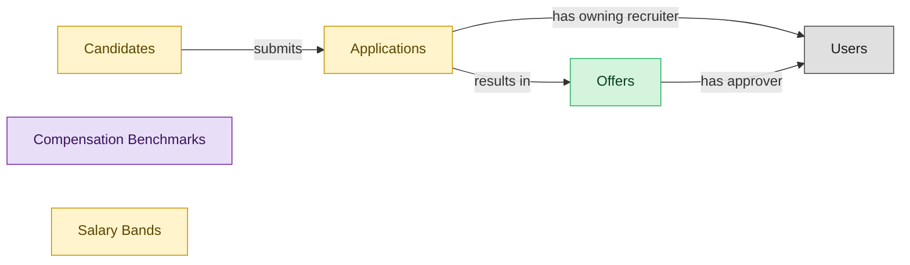

# Offers

## 1. Overview

Offer drafting, approval, extension, signature, and acceptance. Realizes OFFER-MGMT. Realizes the `offer_extended` state on `job_applications`. Requires an external `sign_document` tool - drops module Semantius coverage to ~83%.

## 2. Entity summary

| Name | Description |
| --- | --- |
| Offers | Formal employment offer extended to a candidate. Carries compensation components, start date, terms, approval chain, and status (draft / approved / sent / accepted / declined / rescinded). |
| Applications | A candidate's submission against a specific requisition. Carries pipeline stage, status (active / rejected / withdrawn / hired), source, and the full evaluation history. |
| Candidates | Person known to the recruiting org, with or without an active application. Carries contact details, resume, tags, GDPR consent, and source. Distinct from Employee until hired. |
| Salary Bands | Pay-range structure by grade and geographic zone with minimum, midpoint, maximum, and benchmarking source. Drives offer guidance, merit eligibility, and pay-equity gap analysis. |
| Compensation Benchmarks | Imported market salary data for a job-level-geography combination, sourced from a survey provider (Radford, Mercer, Willis Towers Watson, Payscale). Drives salary_bands maintenance. |

## 3. Entities catalog

| # | data_object | role | mastered in | necessity | pattern flags | notes |
| ---: | --- | --- | --- | --- | --- | --- |
| 1 | `job_offers` (Offers) | master | - | required | personal_content, single_approver | - |
| 2 | `job_applications` (Applications) | embedded_master | `ats-recruitment-pipeline` | required | personal_content | - |
| 3 | `candidates` (Candidates) | embedded_master | `ats-candidate-crm` | required | personal_content | - |
| 4 | `salary_bands` (Salary Bands) | embedded_master | `comp-benchmarking` | optional | - | - |
| 5 | `compensation_benchmarks` (Compensation Benchmarks) | consumer | `comp-benchmarking` | required | - | - |

## 4. Aliases and industry synonyms

_(no industry-scoped aliases or non-synonym alias types loaded for this scope; generic synonyms are omitted as common knowledge.)_

## 5. Relationships

### 5.1 Intra-scope edges

| from | verb | to | cardinality | kind | necessity | owner_side | notes |
| --- | --- | --- | --- | --- | --- | --- | --- |
| `candidates` | submits | `job_applications` | one_to_many | reference | required | target | intra \| ATS \| candidate persists across applications |
| `job_applications` | results in | `job_offers` | one_to_many | reference | required | source | intra \| ATS \| offer is the conversion of the application |

### 5.2 Built-in edges (`users` and other platform built-ins)

| from | verb | to | cardinality | necessity | owner_side | notes |
| --- | --- | --- | --- | --- | --- | --- |
| `job_applications` | has owning recruiter | `users` | many_to_many | required | source | users \| ATS \| recruiter role on the application |
| `job_offers` | has approver | `users` | many_to_many | required | source | users \| ATS \| approver role on offer |

### 5.3 Cross-scope edges

| from | verb | to | cardinality | necessity | notes |
| --- | --- | --- | --- | --- | --- |
| `salary_bands` | anchors | `hcm_positions` | one_to_many | optional | cross \| cluster A \| HCM \| approved position carries grade/band to Comp-Mgmt \| auto-flipped from many_to_one |
| `salary_bands` | bands | `job_profiles` | one_to_many | optional | cross \| cluster A \| HCM \| job-profile-to-salary-band mapping is authoritative \| auto-flipped from many_to_one |
| `skill_profiles` | feeds | `candidates` | one_to_many | optional | cross \| cluster A \| LMS \| internal-candidate skill data flows to ATS |
| `job_requisitions` | receives | `job_applications` | one_to_many | required | intra \| ATS \| apps target a specific req |
| `job_postings` | is applied to via | `job_applications` | one_to_many | required | intra \| ATS \| app inflow is anchored on a posting |
| `candidate_referrals` | introduces | `candidates` | one_to_many | required | intra \| ATS \| referral is the introduction event; candidate is durable |
| `recruitment_sources` | attributes | `candidates` | one_to_many | required | intra \| ATS \| source-of-hire dimension on candidate |
| `recruitment_agencies` | sources | `candidates` | one_to_many | required | intra \| ATS \| agency is the channel; candidate persists |
| `recruitment_events` | attracts | `candidates` | one_to_many | required | intra \| ATS \| event is the touchpoint; candidate persists |
| `talent_pools` | groups | `candidates` | many_to_many | required | intra \| ATS \| pool is a membership shell; candidate lives outside it |
| `job_applications` | schedules | `interviews` | one_to_many | required | intra \| ATS \| interview belongs to the application's pipeline |
| `job_applications` | requires | `candidate_assessments` | one_to_many | required | intra \| ATS \| assessment invitation belongs to the app's pipeline |
| `job_offers` | is contingent on | `background_checks` | one_to_many | required | intra \| ATS \| background check gates offer-to-firm conversion |
| `job_offers` | spawns | `onboarding_journeys` | one_to_one | required | cross \| ATS→ONBOARDING \| offer.accepted creates onboarding journey (high friction) |
| `job_offers` | triggers | `benefit_enrollments` | one_to_one | required | cross \| ATS→BEN-ADMIN \| offer.accepted opens benefit enrollment |
| `job_offers` | seeds | `compensation_statements` | one_to_one | required | cross \| ATS→COMP-MGMT \| offer.signed seeds first compensation statement |
| `candidates` | becomes | `employees` | one_to_one | required | cross \| ATS→HCM \| candidate.hired creates employee record; identity handoff |
| `job_offers` | spawns pre-employee record | `pre_employees` | one_to_one | required | Triggered on job_offer.accepted; the pre-employee record is the post-offer paperwork shell. |
| `candidates` | becomes pre-employee | `pre_employees` | one_to_one | required | Candidate identity continues into the pre-employee record; promoted to employees on activation. |
| `labor_market_benchmarks` | calibrates | `salary_bands` | many_to_many | optional | cross \| SWP→COMP-MGMT \| labor_market_benchmark.refreshed calibrates salary_bands. |

## 6. Cross-domain context

### 6.1 Master consumers (other modules / domains that embed this scope's masters)

| data_object | other module / domain | role | necessity | notes |
| --- | --- | --- | --- | --- |
| `job_offers` | ATS-BACKGROUND-CHECKS (Background Checks) - ATS | embedded_master | required | - |
| `job_offers` | ATS-PRE-EMPLOYEE-RECORD (Pre-Employee Record) - ATS | embedded_master | required | - |
| `job_offers` | COMP-STATEMENTS (Total Rewards Statements) - COMP-MGMT | consumer | required | - |
| `job_offers` | HCM-LIFECYCLE-WORKFLOWS (Employee Lifecycle Workflows) - HCM | consumer | required | - |

### 6.2 Outbound handoffs (events this scope publishes)

| source module | target domain | target module | trigger_event | payload | integration | friction | description |
| --- | --- | --- | --- | --- | --- | --- | --- |
| ATS-OFFERS | HCM | HCM-LIFECYCLE-WORKFLOWS | `job_offer.accepted` | `job_offers` | event_stream | medium | Offer acceptance signals firm hiring intent; HCM creates pending-employee record. |
| ATS-OFFERS | COMP-MGMT | COMP-STATEMENTS | `job_offer.signed` | `job_offers` | event_stream | low | Signed offer establishes the comp baseline; COMP-MGMT incorporates into cycle history. |

### 6.3 Inbound handoffs (events this scope reacts to)

| target module | source domain | source module | trigger_event | payload | integration | friction | description |
| --- | --- | --- | --- | --- | --- | --- | --- |
| ATS-OFFERS | COMP-MGMT | COMP-BENCHMARKING | `compensation_benchmark.refreshed` | `compensation_benchmarks` | batch_sync | low | Updated benchmarks inform offer-range guardrails for recruiters and hiring managers. |
| ATS-OFFERS | ATS | ATS-RECRUITMENT-PIPELINE | `job_application.advanced` | `job_offers` | lifecycle_progression | low | - |
| ATS-OFFERS | ATS | ATS-BACKGROUND-CHECKS | `background_check.flagged` | `job_offers` | lifecycle_progression | medium | - |
| ATS-OFFERS | COMP-MGMT | COMP-BENCHMARKING | `salary_band.updated` | `salary_bands` | event_stream | low | Updated bands flow to ATS offer-generation. |

### 6.4 Master providers (modules / domains that own masters this scope embeds)

| data_object | role here | necessity | canonical owner(s) | slice notes |
| --- | --- | --- | --- | --- |
| `candidates` | embedded_master | required | ATS-CANDIDATE-CRM (ATS) | - |
| `job_applications` | embedded_master | required | ATS-RECRUITMENT-PIPELINE (ATS) | - |
| `salary_bands` | embedded_master | optional | COMP-BENCHMARKING (COMP-MGMT) | - |
| `compensation_benchmarks` | consumer | required | COMP-BENCHMARKING (COMP-MGMT) | - |

## 7. Lifecycle states (per master)

### `job_applications` (Application)

| order | state_name | initial? | terminal? | requires_permission? | derived gate | description |
| --- | --- | --- | --- | --- | --- | --- |
| 4 | `offer_extended` | - | - | - | - | An offer has been generated and is in flight for this application. |

### `job_offers` (Offer)

| order | state_name | initial? | terminal? | requires_permission? | derived gate | description |
| --- | --- | --- | --- | --- | --- | --- |
| 1 | `draft` | ✓ | - | - | - | Recruiter is composing offer terms and compensation components. |
| 2 | `pending_approval` | - | - | - | - | Offer routed to the designated approver for sign-off. |
| 3 | `approved` | - | - | ✓ | `ats-offers:approve_offer` | Approver signed off; offer is ready to send. |
| 4 | `sent` | - | - | - | - | Offer delivered to the candidate. |
| 5 | `accepted` | - | ✓ | - | - | Candidate accepted the offer. |
| 6 | `declined` | - | ✓ | - | - | Candidate declined the offer. |
| 7 | `rescinded` | - | ✓ | ✓ | `ats-offers:rescind_offer` | Offer withdrawn by the employer after being sent; gated action. |

## 8. Permissions and business rules (derived)

### 8.1 Permissions

| permission | tier | description | included in `:admin`? |
| --- | --- | --- | --- |
| `ats-offers:read` | baseline-read | Read access to every entity in the module | ✓ |
| `ats-offers:manage` | baseline-manage | Edit operational records | ✓ |
| `ats-offers:admin` | baseline-admin | Edit reference data and inherit every workflow gate below | - |
| `ats-offers:approve_offer` | workflow-gate (lifecycle) | Transition `job_offers` into state `approved` | ✓ |
| `ats-offers:rescind_offer` | workflow-gate (lifecycle) | Transition `job_offers` into state `rescinded` | ✓ |
| `ats-offers:view_all_offers` | override (personal_content) | View all `job_offers` rows beyond row-scope | ✓ |
| `ats-offers:manage_all_offers` | override (personal_content) | Manage all `job_offers` rows beyond row-scope | ✓ |

### 8.2 Business rules

| rule_name | data_object | source flag | intent |
| --- | --- | --- | --- |
| `offer_edit_scope` | `job_offers` | has_personal_content | Row-scope by default; override via `ats-offers:view_all_offers` / `ats-offers:manage_all_offers` |
| `approve_offer_requires_approver` | `job_offers` | has_single_approver | Exactly one explicit approver required; uses the module's approval gate (`ats-offers:approve_offer` if surfaced as a lifecycle workflow gate). |
