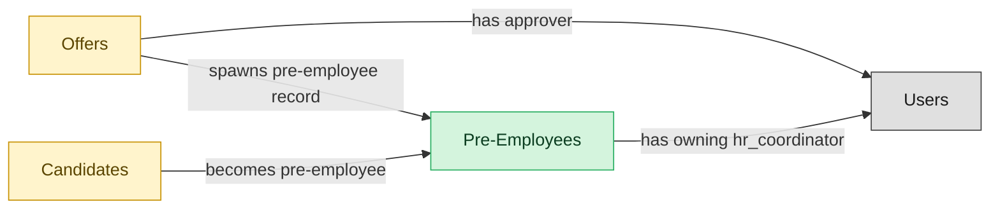

# Pre-Employee Record

## 1. Overview

The bridge between offer-accepted and start-date - ATS owns the pre-employee lifecycle stage (paperwork in flight, pre-boarding tasks open, background check pending). Realizes the `hired` state on `job_applications`. Publishes the `pre_employee.activated` event that hands the canonical reconciliation to HCM-mastered `employees`. Formerly NEW-HIRE-HANDOFF - renamed per §7.1 because HCM canonically masters `employees`.

## 2. Entity summary

| Name | Description |
| --- | --- |
| Pre-Employees | ATS-owned pre-employment record covering the post-offer-acceptance window before the new-hire start date: paperwork in flight, background check pending, pre-boarding tasks open. At start-date the pre-employee row is reconciled into HCM-mastered `employees` (the canonical employee record). HCM owns the canonical employee record; ATS owns the pre-employee lifecycle stage so recruiting and HCM can each move at their own pace. |
| Candidates | Person known to the recruiting org, with or without an active application. Carries contact details, resume, tags, GDPR consent, and source. Distinct from Employee until hired. |
| Offers | Formal employment offer extended to a candidate. Carries compensation components, start date, terms, approval chain, and status (draft / approved / sent / accepted / declined / rescinded). |

## 3. Entities catalog

| # | data_object | role | mastered in | necessity | pattern flags | notes |
| ---: | --- | --- | --- | --- | --- | --- |
| 1 | `pre_employees` (Pre-Employees) | master | - | required | personal_content | - |
| 2 | `candidates` (Candidates) | embedded_master | `ats-candidate-crm` | required | personal_content | - |
| 3 | `job_offers` (Offers) | embedded_master | `ats-offers` | required | personal_content, single_approver | - |

## 4. Aliases and industry synonyms

_(no industry-scoped aliases or non-synonym alias types loaded for this scope; generic synonyms are omitted as common knowledge.)_

## 5. Relationships

### 5.1 Intra-scope edges

| from | verb | to | cardinality | kind | necessity | owner_side | notes |
| --- | --- | --- | --- | --- | --- | --- | --- |
| `job_offers` | spawns pre-employee record | `pre_employees` | one_to_one | reference | required | source | Triggered on job_offer.accepted; the pre-employee record is the post-offer paperwork shell. |
| `candidates` | becomes pre-employee | `pre_employees` | one_to_one | reference | required | source | Candidate identity continues into the pre-employee record; promoted to employees on activation. |

### 5.2 Built-in edges (`users` and other platform built-ins)

| from | verb | to | cardinality | necessity | owner_side | notes |
| --- | --- | --- | --- | --- | --- | --- |
| `job_offers` | has approver | `users` | many_to_many | required | source | users \| ATS \| approver role on offer |
| `pre_employees` | has owning hr_coordinator | `users` | one_to_many | required | source | HR coordinator (Recruiting Coordinator role) drives paperwork completion and activation handoff. |

### 5.3 Cross-scope edges

| from | verb | to | cardinality | necessity | notes |
| --- | --- | --- | --- | --- | --- |
| `skill_profiles` | feeds | `candidates` | one_to_many | optional | cross \| cluster A \| LMS \| internal-candidate skill data flows to ATS |
| `candidates` | submits | `job_applications` | one_to_many | required | intra \| ATS \| candidate persists across applications |
| `candidate_referrals` | introduces | `candidates` | one_to_many | required | intra \| ATS \| referral is the introduction event; candidate is durable |
| `recruitment_sources` | attributes | `candidates` | one_to_many | required | intra \| ATS \| source-of-hire dimension on candidate |
| `recruitment_agencies` | sources | `candidates` | one_to_many | required | intra \| ATS \| agency is the channel; candidate persists |
| `recruitment_events` | attracts | `candidates` | one_to_many | required | intra \| ATS \| event is the touchpoint; candidate persists |
| `talent_pools` | groups | `candidates` | many_to_many | required | intra \| ATS \| pool is a membership shell; candidate lives outside it |
| `job_applications` | results in | `job_offers` | one_to_many | required | intra \| ATS \| offer is the conversion of the application |
| `job_offers` | is contingent on | `background_checks` | one_to_many | required | intra \| ATS \| background check gates offer-to-firm conversion |
| `job_offers` | spawns | `onboarding_journeys` | one_to_one | required | cross \| ATS→ONBOARDING \| offer.accepted creates onboarding journey (high friction) |
| `job_offers` | triggers | `benefit_enrollments` | one_to_one | required | cross \| ATS→BEN-ADMIN \| offer.accepted opens benefit enrollment |
| `job_offers` | seeds | `compensation_statements` | one_to_one | required | cross \| ATS→COMP-MGMT \| offer.signed seeds first compensation statement |
| `candidates` | becomes | `employees` | one_to_one | required | cross \| ATS→HCM \| candidate.hired creates employee record; identity handoff |
| `pre_employees` | promotes to | `employees` | one_to_one | required | cross \| ATS->HCM \| pre_employee.activated converts the pre-hire record into the canonical HCM employee record |

## 6. Cross-domain context

### 6.1 Master consumers (other modules / domains that embed this scope's masters)

| data_object | other module / domain | role | necessity | notes |
| --- | --- | --- | --- | --- |
| `pre_employees` | HCM-LIFECYCLE-WORKFLOWS (Employee Lifecycle Workflows) - HCM | consumer | required | - |

### 6.2 Outbound handoffs (events this scope publishes)

| source module | target domain | target module | trigger_event | payload | integration | friction | description |
| --- | --- | --- | --- | --- | --- | --- | --- |
| ATS-PRE-EMPLOYEE-RECORD | HCM | HCM-LIFECYCLE-WORKFLOWS | `pre_employee.activated` | `pre_employees` | event_stream | medium | Pre-employee activation hands the canonical reconciliation to HCM-mastered `employees`. ATS owns the pre-employee lifecycle stage (paperwork, background check, pre-boarding); at start-date the pre_employee row is reconciled into the HCM employee record. Identifier mapping (pre_employee_id → employee_id) is the canonical reconciliation gap. Replaces / complements the older candidate.hired and job_offer.accepted handoffs by carrying the proper post-acceptance reconciliation milestone. |

### 6.3 Inbound handoffs (events this scope reacts to)

| target module | source domain | source module | trigger_event | payload | integration | friction | description |
| --- | --- | --- | --- | --- | --- | --- | --- |
| ATS-PRE-EMPLOYEE-RECORD | ATS | ATS-OFFERS | `job_offer.accepted` | `pre_employees` | lifecycle_progression | low | - |
| ATS-PRE-EMPLOYEE-RECORD | ATS | ATS-BACKGROUND-CHECKS | `background_check.cleared` | `pre_employees` | lifecycle_progression | low | - |
| ATS-PRE-EMPLOYEE-RECORD | ATS | ATS-OFFERS | `job_offer.rescinded` | `pre_employees` | lifecycle_progression | high | - |

### 6.4 Master providers (modules / domains that own masters this scope embeds)

| data_object | role here | necessity | canonical owner(s) | slice notes |
| --- | --- | --- | --- | --- |
| `candidates` | embedded_master | required | ATS-CANDIDATE-CRM (ATS) | - |
| `job_offers` | embedded_master | required | ATS-OFFERS (ATS) | - |

## 7. Lifecycle states (per master)

### `job_applications` (Application)

| order | state_name | initial? | terminal? | requires_permission? | derived gate | description |
| --- | --- | --- | --- | --- | --- | --- |
| 5 | `hired` | - | ✓ | ✓ | `ats-pre-employee-record:hire_candidate` | Candidate accepted the offer and was hired; gated transition. |

### `pre_employees` (Pre-Employee)

| order | state_name | initial? | terminal? | requires_permission? | derived gate | description |
| --- | --- | --- | --- | --- | --- | --- |
| 1 | `created` | ✓ | - | - | - | Record created when an offer is accepted. Paperwork packet not yet generated. |
| 2 | `paperwork_in_flight` | - | - | - | - | I-9 / W-4 / direct-deposit / banking forms issued; awaiting candidate completion. Background check may run in parallel. |
| 3 | `cleared` | - | - | - | - | All paperwork received and background check completed clear. Ready for HCM activation. |
| 4 | `activated` | - | ✓ | ✓ | `ats-pre-employee-record:activate_pre_employee` | Reconciliation handoff fired to HCM (pre_employee.activated event). Canonical employees row created downstream; ATS record becomes read-only. |
| 5 | `cancelled` | - | ✓ | - | - | Offer rescinded or candidate withdrew before activation. Record retained for audit. |

## 8. Permissions and business rules (derived)

### 8.1 Permissions

| permission | tier | description | included in `:admin`? |
| --- | --- | --- | --- |
| `ats-pre-employee-record:read` | baseline-read | Read access to every entity in the module | ✓ |
| `ats-pre-employee-record:manage` | baseline-manage | Edit operational records | ✓ |
| `ats-pre-employee-record:admin` | baseline-admin | Edit reference data and inherit every workflow gate below | - |
| `ats-pre-employee-record:hire_candidate` | workflow-gate (lifecycle) | Transition `job_applications` into state `hired` | ✓ |
| `ats-pre-employee-record:activate_pre_employee` | workflow-gate (lifecycle) | Transition `pre_employees` into state `activated` | ✓ |
| `ats-pre-employee-record:view_all_pre-employees` | override (personal_content) | View all `pre_employees` rows beyond row-scope | ✓ |
| `ats-pre-employee-record:manage_all_pre-employees` | override (personal_content) | Manage all `pre_employees` rows beyond row-scope | ✓ |

### 8.2 Business rules

| rule_name | data_object | source flag | intent |
| --- | --- | --- | --- |
| `pre-employee_edit_scope` | `pre_employees` | has_personal_content | Row-scope by default; override via `ats-pre-employee-record:view_all_pre-employees` / `ats-pre-employee-record:manage_all_pre-employees` |
