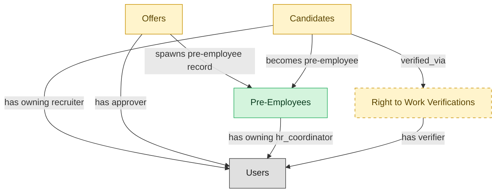

# Pre-Employee Record

## 1. Overview

The bridge between offer-accepted and start-date: ATS owns the pre-employee lifecycle stage (paperwork in flight, pre-boarding tasks open, background check pending). Realizes the `hired` state on `job_applications`. Publishes the `pre_employee.activated` event that hands the canonical reconciliation to HCM-mastered `employees`. Formerly NEW-HIRE-HANDOFF, renamed per §7.1 because HCM canonically masters `employees`.

## 2. Entity summary

| Name | data_object | Description |
| --- | --- | --- |
| Pre-Employees | `pre_employees` | Pre-employment records covering the window between offer acceptance and start date, tracking paperwork, background checks, and pre-boarding tasks. |
| Candidates | `candidates` | People known to the recruiting organization, with or without an active application, carrying contact details, resume, tags, consent, and source. |
| Offers | `job_offers` | Formal employment offers extended to candidates, with compensation, start date, terms, approval chain, and status. |
| Right to Work Verifications | `right_to_work_verifications` | Pre-hire right-to-work verification events, such as the I-9 or E-Verify check, recording method, status, verifier, and outcome under employment-eligibility law. |

## 3. Entities catalog

| # | data_object | canonical code | singular | plural | role | mastered in | mastered label | necessity | personal_content | entity_type | write tier | notes |
| ---: | --- | --- | --- | --- | --- | --- | --- | --- | --- | --- | --- | --- |
| 1 | `pre_employees` | `pre_employees` | Pre-Employee | Pre-Employees | master | - | - | required | yes | operational_workflow | `:manage` | - |
| 2 | `candidates` | `candidates` | Candidate | Candidates | embedded_master | `ats-candidate-crm` | Candidate CRM | required | yes | operational_workflow | `:manage` | - |
| 3 | `job_offers` | `job_offers` | Offer | Offers | embedded_master | `ats-offers` | Job Offers | required | yes | operational_workflow | `:manage` | - |
| 4 | `right_to_work_verifications` | `right_to_work_verifications` | Right to Work Verification | Right to Work Verifications | embedded_master | `bgv-continuous-identity` | Continuous and Identity | optional | yes | operational_workflow | `:manage` | - |

## 4. Aliases and industry synonyms

_(none: no industry-scoped aliases for this scope)_

## 5. Relationships

### 5.1 Intra-scope edges

| from | verb | to | cardinality | kind | necessity | owner_side | delete_mode | fk_format | notes |
| --- | --- | --- | --- | --- | --- | --- | --- | --- | --- |
| `candidates` | verified_via | `right_to_work_verifications` | one_to_many | reference | optional | source | clear | reference | - |
| `job_offers` | spawns pre-employee record | `pre_employees` | one_to_one | reference | required | source | restrict | reference | - |
| `candidates` | becomes pre-employee | `pre_employees` | one_to_one | reference | required | source | restrict | reference | - |

### 5.2 Built-in edges (`users` and other platform built-ins)

| from | verb | to | cardinality | necessity | owner_side | delete_mode | fk_format | notes |
| --- | --- | --- | --- | --- | --- | --- | --- | --- |
| `candidates` | has owning recruiter | `users` | many_to_many | optional | source | clear | reference | - |
| `job_offers` | has approver | `users` | many_to_many | required | source | restrict | reference | - |
| `pre_employees` | has owning hr_coordinator | `users` | one_to_many | required | source | restrict | reference | - |
| `right_to_work_verifications` | has verifier | `users` | many_to_many | optional | source | clear | reference | - |

### 5.3 Cross-scope edges

#### 5.3a Outbound from this scope's masters and contributors

_Edges this scope drives: the in-scope endpoint has `role` of `master` or `contributor`._

| from | verb | to | cardinality | necessity | delete_mode | fk_format | notes |
| --- | --- | --- | --- | --- | --- | --- | --- |
| `pre_employees` | promotes to | `employees` | one_to_one | required | none (required-if-present) | n/a | - |

#### 5.3b Context edges on embedded shells and consumed entities

_Edges the canonical owner drives, shown for context: the in-scope endpoint has `role` of `embedded_master`, `consumer`, or `derived`._

| from | verb | to | cardinality | necessity | delete_mode | fk_format | notes |
| --- | --- | --- | --- | --- | --- | --- | --- |
| `candidates` | engaged_via | `candidate_engagements` | one_to_many | optional | none | n/a | - |
| `candidates` | attends_via | `recruiting_event_attendances` | one_to_many | required | none (required-if-present) | n/a | - |
| `candidates` | noted_via | `recruiter_interactions` | one_to_many | optional | none | n/a | - |
| `candidates` | consents_via | `candidate_consents` | one_to_many | required | ⚠ audit: required composed child out of scope | n/a | - |
| `candidates` | member_of_via | `talent_pool_memberships` | one_to_many | required | none (required-if-present) | n/a | - |
| `candidates` | discloses_via | `fcra_disclosures` | one_to_many | required | ⚠ audit: required composed child out of scope | n/a | - |
| `candidates` | self_identifies_via | `eeo_responses` | one_to_many | optional | none | n/a | - |
| `job_offers` | evolves_through | `offer_versions` | one_to_many | required | ⚠ audit: required composed child out of scope | n/a | - |
| `job_offers` | gated_by | `offer_approvals` | one_to_many | optional | none | n/a | - |
| `candidates` | submits_via | `data_subject_requests` | one_to_many | optional | none | n/a | - |
| `candidates` | self_ids_via | `voluntary_self_identifications` | one_to_many | optional | none | n/a | - |
| `candidates` | acknowledges_via | `fcra_summary_of_rights_acknowledgements` | one_to_many | optional | none | n/a | - |
| `candidates` | documented_via | `candidate_documents` | one_to_many | optional | none | n/a | - |
| `candidates` | annotated_via | `candidate_notes` | one_to_many | optional | none | n/a | - |
| `candidates` | tagged_via | `candidate_tag_assignments` | one_to_many | optional | none | n/a | - |
| `skill_profiles` | feeds | `candidates` | one_to_many | optional | none | n/a | - |
| `candidates` | submits | `job_applications` | one_to_many | required | none (required-if-present) | n/a | - |
| `candidate_referrals` | introduces | `candidates` | one_to_many | required | none (required-if-present) | n/a | - |
| `recruitment_sources` | attributes | `candidates` | one_to_many | required | none (required-if-present) | n/a | - |
| `recruitment_agencies` | sources | `candidates` | one_to_many | required | none (required-if-present) | n/a | - |
| `recruitment_events` | attracts | `candidates` | one_to_many | required | none (required-if-present) | n/a | - |
| `talent_pools` | groups | `candidates` | many_to_many | required | none (required-if-present) | n/a | - |
| `job_applications` | results in | `job_offers` | one_to_many | required | none (required-if-present) | n/a | - |
| `job_offers` | is contingent on | `background_checks` | one_to_many | required | none (required-if-present) | n/a | - |
| `job_offers` | spawns | `onboarding_journeys` | one_to_one | required | none (required-if-present) | n/a | - |
| `job_offers` | triggers | `benefit_enrollments` | one_to_one | required | none (required-if-present) | n/a | - |
| `job_offers` | seeds | `compensation_statements` | one_to_one | required | none (required-if-present) | n/a | - |
| `candidates` | becomes | `employees` | one_to_one | required | none (required-if-present) | n/a | - |
| `employees` | applies_as | `candidates` | one_to_many | optional | none | n/a | - |
| `candidates` | corresponds_via | `candidate_emails` | one_to_many | optional | none | n/a | - |
| `candidates` | screened_via | `drug_health_screenings` | one_to_many | optional | none | n/a | - |
| `candidates` | submitted_via | `agency_submissions` | one_to_many | optional | none | n/a | - |

## 6. Cross-domain context

### 6.1 Master consumers (other modules / domains that embed this scope's masters)

| data_object | other module / domain | role | necessity | notes |
| --- | --- | --- | --- | --- |
| `pre_employees` | HCM-LIFECYCLE-WORKFLOWS (Employee Lifecycle Workflows) - HCM | embedded_master | required | - |

### 6.2 Outbound handoffs (events this scope publishes)

| source module | target domain | target module | trigger_event | transition | payload | integration | friction | description |
| --- | --- | --- | --- | --- | --- | --- | --- | --- |
| ATS-CANDIDATE-CRM | HCM | HCM-LIFECYCLE-WORKFLOWS | `candidate.hired` | `hired` _(lifecycle)_ | `candidates` | event_stream | high | Hired-candidate event publishes the hiring outcome to HCM, which must create the employee record. Identifier mapping (candidate_id -> employee_id) is the canonical reconciliation gap. |
| ATS-OFFERS | HCM | HCM-LIFECYCLE-WORKFLOWS | `job_offer.accepted` | `accepted` _(state_change)_ | `job_offers` | event_stream | medium | Offer acceptance signals firm hiring intent; HCM creates pending-employee record. |
| ATS-PRE-EMPLOYEE-RECORD | HCM | HCM-LIFECYCLE-WORKFLOWS | `pre_employee.activated` | `in_progress` → `activated` _(state_change)_ | `pre_employees` | event_stream | medium | Pre-employee activation hands the canonical reconciliation to HCM-mastered `employees`. ATS owns the pre-employee lifecycle stage (paperwork, background check, pre-boarding); at start-date the pre_employee row is reconciled into the HCM employee record. Identifier mapping (pre_employee_id → employee_id) is the canonical reconciliation gap. Replaces / complements the older candidate.hired and job_offer.accepted handoffs by carrying the proper post-acceptance reconciliation milestone. |
| ATS-OFFERS | COMP-MGMT | COMP-STATEMENTS | `job_offer.signed` | `signed` _(lifecycle)_ | `job_offers` | event_stream | low | Signed offer establishes the comp baseline; COMP-MGMT incorporates into cycle history. |
| ATS-CANDIDATE-CRM | BEN-ADMIN | BEN-ENROLLMENT | `candidate.hired` | `hired` _(lifecycle)_ | `candidates` | event_stream | low | Hired candidate triggers eligibility window in BEN-ADMIN. |
| ATS-CANDIDATE-CRM | ONBOARDING | ONB-JOURNEY-MGMT | `candidate.hired` | `hired` _(lifecycle)_ | `candidates` | event_stream | medium | Hired candidate drives onboarding-plan kickoff with role/location/manager context from ATS payload. |

### 6.3 Inbound handoffs (events this scope reacts to)

| target module | source domain | source module | trigger_event | transition | payload | integration | friction | description |
| --- | --- | --- | --- | --- | --- | --- | --- | --- |
| ATS-CANDIDATE-CRM | HCM | HCM-CORE-WORKER | `employee.applied_internally` | `active` → `active` _(signal)_ | `candidates` | api_call | medium | When an employee applies internally, HCM hands the worker context to the applicant tracker, which materializes an internal candidate record from the worker profile. Friction: reconciling the worker identity against the candidate identity space. |
| ATS-CANDIDATE-CRM | ATS | ATS-REFERRALS | `candidate_referral.submitted` | _(lifecycle)_ | `candidates` | lifecycle_progression | low | - |
| ATS-OFFERS | ATS | ATS-RECRUITMENT-PIPELINE | `job_application.advanced` | _(state_change)_ | `job_offers` | lifecycle_progression | low | - |
| ATS-PRE-EMPLOYEE-RECORD | ATS | ATS-OFFERS | `job_offer.accepted` | `accepted` _(state_change)_ | `pre_employees` | lifecycle_progression | low | - |
| ATS-PRE-EMPLOYEE-RECORD | ATS | ATS-OFFERS | `job_offer.rescinded` | _(state_change)_ | `pre_employees` | lifecycle_progression | high | - |
| ATS-OFFERS | ATS | ATS-BACKGROUND-CHECKS | `background_check.flagged` | _(lifecycle)_ | `job_offers` | lifecycle_progression | medium | - |
| ATS-PRE-EMPLOYEE-RECORD | ATS | ATS-BACKGROUND-CHECKS | `background_check.cleared` | _(lifecycle)_ | `pre_employees` | lifecycle_progression | low | - |

### 6.4 Master providers (modules / domains that own masters this scope embeds)

| data_object | role here | necessity | canonical owner(s) | slice notes |
| --- | --- | --- | --- | --- |
| `candidates` | embedded_master | required | ATS-CANDIDATE-CRM (ATS) | - |
| `job_offers` | embedded_master | required | ATS-OFFERS (ATS) | - |
| `right_to_work_verifications` | embedded_master | optional | BGV-CONTINUOUS-IDENTITY (BGV) | - |

## 7. Lifecycle states

### `candidates` (Candidate)

_This scope holds `candidates` as **embedded_master**; the canonical state machine is owned by `ATS-CANDIDATE-CRM`._

| order | state_name | initial? | terminal? | requires_permission? | derived gate | description |
| --- | --- | --- | --- | --- | --- | --- |
| 1 | `prospect` | ✓ | - | - | - | Person known to the recruiting org with no active application. |
| 2 | `active` | - | - | - | - | Candidate has at least one open application or is actively engaged. |
| 3 | `hired` | - | ✓ | ✓ | `ats-pre-employee-record:hire_candidate` | Candidate accepted an offer and converted to employee. |
| 4 | `do_not_hire` | - | ✓ | ✓ | `ats-pre-employee-record:flag_do_not_hire` | Candidate flagged as ineligible for future consideration; gated decision. |
| 5 | `archived` | - | ✓ | - | - | Candidate kept in the database but not active in any pipeline. |

### `job_offers` (Offer)

_This scope holds `job_offers` as **embedded_master**; the canonical state machine is owned by `ATS-OFFERS`._

| order | state_name | initial? | terminal? | requires_permission? | derived gate | description |
| --- | --- | --- | --- | --- | --- | --- |
| 1 | `draft` | ✓ | - | - | - | Recruiter is composing offer terms and compensation components. |
| 2 | `pending_approval` | - | - | - | - | Offer routed to the designated approver for sign-off. |
| 3 | `approved` | - | - | ✓ | `ats-pre-employee-record:approve_offer` | Approver signed off; offer is ready to send. |
| 4 | `sent` | - | - | - | - | Offer delivered to the candidate. |
| 5 | `accepted` | - | ✓ | - | - | Candidate accepted the offer. |
| 6 | `declined` | - | ✓ | - | - | Candidate declined the offer. |
| 7 | `rescinded` | - | ✓ | ✓ | `ats-pre-employee-record:rescind_offer` | Offer withdrawn by the employer after being sent; gated action. |

### `pre_employees` (Pre-Employee)

| order | state_name | initial? | terminal? | requires_permission? | derived gate | description |
| --- | --- | --- | --- | --- | --- | --- |
| 1 | `created` | ✓ | - | - | - | Record created when an offer is accepted. Paperwork packet not yet generated. |
| 2 | `paperwork_in_flight` | - | - | - | - | I-9 / W-4 / direct-deposit / banking forms issued; awaiting candidate completion. Background check may run in parallel. |
| 3 | `cleared` | - | - | - | - | All paperwork received and background check completed clear. Ready for HCM activation. |
| 4 | `activated` | - | ✓ | ✓ | `ats-pre-employee-record:activate_pre_employee` | Reconciliation handoff fired to HCM (pre_employee.activated event). Canonical employees row created downstream; ATS record becomes read-only. |
| 5 | `canceled` | - | ✓ | - | - | Offer rescinded or candidate withdrew before activation. Record retained for audit. |

### `right_to_work_verifications` (Right to Work Verification)

_This scope holds `right_to_work_verifications` as **embedded_master**; the canonical state machine is owned by `BGV-CONTINUOUS-IDENTITY`._

| order | state_name | initial? | terminal? | requires_permission? | derived gate | description |
| --- | --- | --- | --- | --- | --- | --- |
| 1 | `pending` | ✓ | - | - | - | - |
| 2 | `in_progress` | - | - | - | - | - |
| 3 | `verified` | - | ✓ | ✓ | `ats-pre-employee-record:verify_right_to_work` | - |
| 4 | `tentative_nonconfirmation` | - | - | - | - | - |
| 5 | `final_nonconfirmation` | - | ✓ | - | - | - |
| 6 | `closed` | - | ✓ | - | - | - |

## 8. Permissions and business rules (derived)

### 8.1 Permissions

| permission | tier | description | included in `:admin`? |
| --- | --- | --- | --- |
| `ats-pre-employee-record:read` | baseline-read | Read access to every entity in the module | ✓ |
| `ats-pre-employee-record:manage` | baseline-manage | Edit operational records | ✓ |
| `ats-pre-employee-record:admin` | baseline-admin | Edit reference data and inherit every workflow gate below | - |
| `ats-pre-employee-record:hire_candidate` | workflow-gate (lifecycle) | Transition `candidates` into state `hired` | ✓ |
| `ats-pre-employee-record:flag_do_not_hire` | workflow-gate (lifecycle) | Transition `candidates` into state `do_not_hire` | ✓ |
| `ats-pre-employee-record:approve_offer` | workflow-gate (lifecycle) | Transition `job_offers` into state `approved` | ✓ |
| `ats-pre-employee-record:rescind_offer` | workflow-gate (lifecycle) | Transition `job_offers` into state `rescinded` | ✓ |
| `ats-pre-employee-record:activate_pre_employee` | workflow-gate (lifecycle) | Transition `pre_employees` into state `activated` | ✓ |
| `ats-pre-employee-record:verify_right_to_work` | workflow-gate (lifecycle) | Transition `right_to_work_verifications` into state `verified` | ✓ |
| `ats-pre-employee-record:view_all_pre-employees` | override (personal_content) | View all `pre_employees` rows beyond row-scope | ✓ |
| `ats-pre-employee-record:manage_all_pre-employees` | override (personal_content) | Manage all `pre_employees` rows beyond row-scope | ✓ |
| `ats-pre-employee-record:view_all_candidates` | override (personal_content) | View all `candidates` rows beyond row-scope | ✓ |
| `ats-pre-employee-record:manage_all_candidates` | override (personal_content) | Manage all `candidates` rows beyond row-scope | ✓ |
| `ats-pre-employee-record:view_all_offers` | override (personal_content) | View all `job_offers` rows beyond row-scope | ✓ |
| `ats-pre-employee-record:manage_all_offers` | override (personal_content) | Manage all `job_offers` rows beyond row-scope | ✓ |
| `ats-pre-employee-record:view_all_right_to_work_verifications` | override (personal_content) | View all `right_to_work_verifications` rows beyond row-scope | ✓ |
| `ats-pre-employee-record:manage_all_right_to_work_verifications` | override (personal_content) | Manage all `right_to_work_verifications` rows beyond row-scope | ✓ |

### 8.2 Business rules

| rule_name | data_object | source flag | intent |
| --- | --- | --- | --- |
| `pre-employee_edit_scope` | `pre_employees` | has_personal_content | Row-scope by default; override via `ats-pre-employee-record:view_all_pre-employees` / `ats-pre-employee-record:manage_all_pre-employees` |
| `candidate_edit_scope` | `candidates` | has_personal_content | Row-scope by default; override via `ats-pre-employee-record:view_all_candidates` / `ats-pre-employee-record:manage_all_candidates` |
| `offer_edit_scope` | `job_offers` | has_personal_content | Row-scope by default; override via `ats-pre-employee-record:view_all_offers` / `ats-pre-employee-record:manage_all_offers` |
| `right_to_work_verification_edit_scope` | `right_to_work_verifications` | has_personal_content | Row-scope by default; override via `ats-pre-employee-record:view_all_right_to_work_verifications` / `ats-pre-employee-record:manage_all_right_to_work_verifications` |

## 9. Roles, RACI, and responsibilities (derived)

_Baseline roles, the permission hierarchy, and RACI realization are DERIVED from this scope's entity-type write tiers + `process_raci`; none of it is stored in the catalog (the deployer provisions it from this blueprint)._

### 9.1 `ATS-PRE-EMPLOYEE-RECORD`

**Baseline roles:**

| role | baseline grant |
| --- | --- |
| `ats-pre-employee-record_viewer` | `ats-pre-employee-record:read` |
| `ats-pre-employee-record_manager` | `ats-pre-employee-record:manage` |

**Permission hierarchy:**

| permission | includes |
| --- | --- |
| `ats-pre-employee-record:admin` | `ats-pre-employee-record:manage` |
| `ats-pre-employee-record:manage` | `ats-pre-employee-record:read` |
| `ats-pre-employee-record:admin` | `ats-pre-employee-record:hire_candidate` |
| `ats-pre-employee-record:admin` | `ats-pre-employee-record:flag_do_not_hire` |
| `ats-pre-employee-record:admin` | `ats-pre-employee-record:approve_offer` |
| `ats-pre-employee-record:admin` | `ats-pre-employee-record:rescind_offer` |
| `ats-pre-employee-record:admin` | `ats-pre-employee-record:activate_pre_employee` |
| `ats-pre-employee-record:admin` | `ats-pre-employee-record:verify_right_to_work` |
| `ats-pre-employee-record:admin` | `ats-pre-employee-record:view_all_pre-employees` |
| `ats-pre-employee-record:admin` | `ats-pre-employee-record:manage_all_pre-employees` |
| `ats-pre-employee-record:admin` | `ats-pre-employee-record:view_all_candidates` |
| `ats-pre-employee-record:admin` | `ats-pre-employee-record:manage_all_candidates` |
| `ats-pre-employee-record:admin` | `ats-pre-employee-record:view_all_offers` |
| `ats-pre-employee-record:admin` | `ats-pre-employee-record:manage_all_offers` |
| `ats-pre-employee-record:admin` | `ats-pre-employee-record:view_all_right_to_work_verifications` |
| `ats-pre-employee-record:admin` | `ats-pre-employee-record:manage_all_right_to_work_verifications` |

**Processes wired:**

| process_key | process_name | PCF code | PCF ID | level | description |
| --- | --- | --- | --- | --- | --- |
| `hire_candidate` | Hire candidate | 7.2.4.3 | 10465 | 4 | Wrapping up the process for hiring candidates. Agree to all hiring terms and conditions. Have the candidate accept and sign the job offer. |
| `draw_up_make_offer` | Draw up and make offer | 7.2.4.1 | 10463 | 4 | Compiling job-related information for the selected candidates in order to make up a job. Include information about the job description, reporting relationship, salary, bonus potential, benefits, and vacation allotment. |

**RACI realization:**

| actor | kind | raci | process_key | realization |
| --- | --- | --- | --- | --- |
| `RECRUITING-RECRUITER` | persona | responsible | `hire_candidate` | grant gates [ats-pre-employee-record:hire_candidate] + the gated entities' write tier |
| `HIRING-MANAGER` | persona | accountable | `hire_candidate` | approval gate |
| `LEGAL-COMPLIANCE-SPECIALIST` | persona | informed | `hire_candidate` | notification side effect (trigger_event / webhook_receiver) |
| `RECRUITING-RECRUITER` | persona | responsible | `draw_up_make_offer` | grant gates [ats-pre-employee-record:approve_offer] + the gated entities' write tier |
| `HIRING-MANAGER` | persona | accountable | `draw_up_make_offer` | approval gate |
| `RECRUITING-MANAGER` | persona | consulted | `draw_up_make_offer` | advisory read grant |

### 9.2 Functional ownership and default grants

| responsibility | business function | default role | default tier |
| --- | --- | --- | --- |
| owner | Recruiting | `admin` | `:admin` |
| contributor | Human Resources | `manage` | `:manage` |
| contributor | Legal | `manage` | `:manage` |
| consumer | Finance | `read` | `:read` |
