# Recruitment Pipeline

## 1. Overview

Requisitions → postings → applications with pipeline-stage lifecycle. Realizes REQ-MGMT and CANDIDATE-EXP (application flow slice). Embedded-masters `candidates`, optionally `hcm_positions` and `org_units` for canonical position/org context.

## 2. Entity summary

| Name | data_object | Description |
| --- | --- | --- |
| Applicant Flow Records | `applicant_flow_records` | OFCCP-mandated logs of every internet applicant against a requisition, capturing demographics, expressed interest, qualifications, and disposition for audit. |
| Application Dispositions | `application_dispositions` | Categorized reasons a job application was not selected, driving OFCCP applicant-flow reporting and internal hiring analytics. |
| Application Screening Answers | `application_screening_answers` | Candidate answers to screening questions on a specific job application, used to auto-disqualify on knockout rules. |
| Application Screening Questions | `application_screening_questions` | Custom screening questions attached to a job posting or template, including knockout and qualifying questions with their answer type and rules. |
| Application Stage Transitions | `application_stage_transitions` | Audit-trail records of an application moving between stages, with from-stage, to-stage, actor, timestamp, and reason for cycle-time analytics. |
| Application Stages | `application_stages` | Configured stages in the recruiting pipeline (sourced, applied, screened, onsite, offer, hired) that define a job application's lifecycle. |
| Applications | `job_applications` | Candidate submissions against a specific requisition, with pipeline stage, status, source, and full evaluation history. |
| EEO Responses | `eeo_responses` | Voluntary self-identification submitted by applicants for equal-employment reporting, stored separately from candidate records per regulation. |
| Hiring Team Assignments | `hiring_team_assignments` | Assignments of specific users to recruiter, hiring manager, coordinator, interviewer, and reviewer roles on a single requisition. |
| Job Posting Distributions | `job_posting_distributions` | Syndications of a job posting to external boards, with board name, post and expiry times, cost, and applicant attribution. |
| Job Postings | `job_postings` | Published, candidate-facing versions of a requisition on a career site or job board, one requisition possibly having many postings. |
| Job Requisitions | `job_requisitions` | Approved requests to hire for a specific role, carrying headcount, level, location, hiring manager, recruiter, and status. |
| OFCCP Audit Trails | `ofccp_audit_trails` | Immutable, append-only audit logs of every applicant-flow event for federal contractors, carrying the actor, timestamp, and compliance-relevant fields. |
| Requisition Approvals | `requisition_approvals` | Approval steps that gate opening a job requisition, each recording the approver, decision, timestamp, and rationale. |
| Voluntary Self-Identifications | `voluntary_self_identifications` | Voluntary candidate disclosures of protected-class membership per EEOC and OFCCP requirements, recording the offer or decline-to-answer decision and audit metadata. |
| Candidates | `candidates` | People known to the recruiting organization, with or without an active application, carrying contact details, resume, tags, consent, and source. |
| Job Profiles | `job_profiles` | Canonical role definitions in the job catalog: title, family, level, responsibilities, required skills, pay range, and FLSA class. Many positions share one profile. |
| Locations | `locations` | Physical or organizational locations referenced across the system, used to place and group other records. |
| Org Units | `org_units` | Nodes in the organizational hierarchy such as divisions, departments, and teams, with manager, cost center alignment, geographic scope, and parent-child links. |
| Positions | `hcm_positions` | Approved org slots with role definition, cost center, reporting line, location, and FTE allocation. Each can be open, filled, or eliminated. |

```mermaid
flowchart TD
  classDef master fill:#d4f4dd,stroke:#27ae60,color:#0b3d20;
  classDef embedded_master fill:#fff4cc,stroke:#c79100,color:#5b4500;
  classDef platform_builtin fill:#e0e0e0,stroke:#424242,color:#1a1a1a;
  job_requisitions["Job Requisitions"]
  job_postings["Job Postings"]
  job_applications["Applications"]
  candidates["Candidates"]
  hcm_positions["Positions"]
  org_units["Org Units"]
  locations["Locations"]
  job_profiles["Job Profiles"]
  application_stages["Application Stages"]
  application_stage_transitions["Application Stage Transitions"]
  requisition_approvals["Requisition Approvals"]
  job_posting_distributions["Job Posting Distributions"]
  application_screening_questions["Application Screening Questions"]
  application_screening_answers["Application Screening Answers"]
  eeo_responses["EEO Responses"]
  hiring_team_assignments["Hiring Team Assignments"]
  application_dispositions["Application Dispositions"]
  ofccp_audit_trails["OFCCP Audit Trails"]
  applicant_flow_records["Applicant Flow Records"]
  voluntary_self_identifications["Voluntary Self-Identifications"]
  users["Users"]
  job_requisitions -->|"defines_pipeline"| application_stages
  job_applications -->|"transitions_via"| application_stage_transitions
  application_stages -->|"lands_at"| application_stage_transitions
  job_requisitions -->|"gated_by"| requisition_approvals
  job_postings -->|"syndicates_via"| job_posting_distributions
  job_postings -->|"asks"| application_screening_questions
  job_applications -->|"answers_via"| application_screening_answers
  application_screening_questions -->|"answered_by"| application_screening_answers
  candidates -->|"self_identifies_via"| eeo_responses
  candidates -->|"self_ids_via"| voluntary_self_identifications
  job_applications -->|"disposed_via"| application_dispositions
  job_applications -->|"logged_via"| applicant_flow_records
  job_requisitions -->|"staffed_by"| hiring_team_assignments
  applicant_flow_records -->|"audited_via"| ofccp_audit_trails
  org_units -->|"contains"| hcm_positions
  job_profiles -->|"defines"| hcm_positions
  hcm_positions -->|"spawns"| job_requisitions
  job_profiles -->|"feeds"| job_postings
  job_requisitions -->|"is advertised through"| job_postings
  job_requisitions -->|"receives"| job_applications
  job_postings -->|"is applied to via"| job_applications
  candidates -->|"submits"| job_applications
  org_units -->|"rolls_up_to"| org_units
  locations -->|"rolls_up_to"| locations
  hiring_team_assignments -->|"assigns"| users
  candidates -->|"has owning recruiter"| users
  job_postings -->|"has publisher"| users
  application_stage_transitions -->|"has author"| users
  applicant_flow_records -->|"has owner"| users
  requisition_approvals -->|"has approver"| users
  ofccp_audit_trails -->|"has author"| users
  users -->|"manages"| hcm_positions
  users -->|"leads"| org_units
  users -->|"owns"| job_profiles
  job_requisitions -->|"has recruiter and hiring manager"| users
  job_applications -->|"has owning recruiter"| users
  org_units -->|"has members"| users
  locations -->|"houses"| users
  class job_requisitions master;
  class job_postings master;
  class job_applications master;
  class candidates embedded_master;
  class hcm_positions embedded_master;
  class org_units embedded_master;
  class locations embedded_master;
  class job_profiles embedded_master;
  class application_stages master;
  class application_stage_transitions master;
  class requisition_approvals master;
  class job_posting_distributions master;
  class application_screening_questions master;
  class application_screening_answers master;
  class eeo_responses master;
  class hiring_team_assignments master;
  class application_dispositions master;
  class ofccp_audit_trails master;
  class applicant_flow_records master;
  class voluntary_self_identifications master;
  class users platform_builtin;
  style hcm_positions stroke-dasharray:5 5;
  style org_units stroke-dasharray:5 5;
  style locations stroke-dasharray:5 5;
  style eeo_responses stroke-dasharray:5 5;
  style application_dispositions stroke-dasharray:5 5;
  style ofccp_audit_trails stroke-dasharray:5 5;
  style applicant_flow_records stroke-dasharray:5 5;
  style voluntary_self_identifications stroke-dasharray:5 5;
```

## 3. Entities catalog

| # | data_object | canonical code | singular | plural | role | mastered in | mastered label | necessity | personal_content | entity_type | write tier | notes |
| ---: | --- | --- | --- | --- | --- | --- | --- | --- | --- | --- | --- | --- |
| 1 | `applicant_flow_records` | `applicant_flow_records` | Applicant Flow Record | Applicant Flow Records | master | - | - | optional | yes | operational_workflow | `:manage` | - |
| 2 | `application_dispositions` | `application_dispositions` | Application Disposition | Application Dispositions | master | - | - | optional | - | operational_record | `:manage` | - |
| 3 | `application_screening_answers` | `application_screening_answers` | Application Screening Answer | Application Screening Answers | master | - | - | required | yes | operational_record | `:manage` | - |
| 4 | `application_screening_questions` | `application_screening_questions` | Application Screening Question | Application Screening Questions | master | - | - | required | - | catalog | `:admin` | - |
| 5 | `application_stage_transitions` | `application_stage_transitions` | Application Stage Transition | Application Stage Transitions | master | - | - | required | - | operational_record | `:manage` | - |
| 6 | `application_stages` | `application_stages` | Application Stage | Application Stages | master | - | - | required | - | catalog | `:admin` | - |
| 7 | `job_applications` | `job_applications` | Application | Applications | master | - | - | required | yes | operational_workflow | `:manage` | - |
| 8 | `eeo_responses` | `eeo_responses` | EEO Response | EEO Responses | master | - | - | optional | yes | operational_workflow | `:manage` | - |
| 9 | `hiring_team_assignments` | `hiring_team_assignments` | Hiring Team Assignment | Hiring Team Assignments | master | - | - | required | - | junction | `:manage` | - |
| 10 | `job_posting_distributions` | `job_posting_distributions` | Job Posting Distribution | Job Posting Distributions | master | - | - | required | - | operational_workflow | `:manage` | - |
| 11 | `job_postings` | `job_postings` | Job Posting | Job Postings | master | - | - | required | - | operational_workflow | `:manage` | - |
| 12 | `job_requisitions` | `job_requisitions` | Job Requisition | Job Requisitions | master | - | - | required | - | operational_workflow | `:manage` | - |
| 13 | `ofccp_audit_trails` | `ofccp_audit_trails` | OFCCP Audit Trail | OFCCP Audit Trails | master | - | - | optional | - | operational_record | `:manage` | - |
| 14 | `requisition_approvals` | `requisition_approvals` | Requisition Approval | Requisition Approvals | master | - | - | required | - | operational_workflow | `:manage` | - |
| 15 | `voluntary_self_identifications` | `voluntary_self_identifications` | Voluntary Self-Identification | Voluntary Self-Identifications | master | - | - | optional | yes | operational_record | `:manage` | - |
| 16 | `candidates` | `candidates` | Candidate | Candidates | embedded_master | `ats-candidate-crm` | Candidate CRM | required | yes | operational_workflow | `:manage` | - |
| 17 | `job_profiles` | `job_profiles` | Job Profile | Job Profiles | embedded_master | `hcm-org-positions` | Organization and Position Management | required | - | catalog | `:admin` | - |
| 18 | `locations` | `locations` | Location | Locations | embedded_master | `iwms-location-master` | Location and Property Master | optional | - | catalog | `:admin` | - |
| 19 | `org_units` | `org_units` | Org Unit | Org Units | embedded_master | `hcm-org-positions` | Organization and Position Management | optional | - | operational_workflow | `:manage` | - |
| 20 | `hcm_positions` | `hcm_positions` | Position | Positions | embedded_master | `hcm-org-positions` | Organization and Position Management | optional | - | operational_workflow | `:manage` | - |

## 4. Aliases and industry synonyms

_(none: no industry-scoped aliases for this scope)_

## 5. Relationships

### 5.1 Intra-scope edges

| from | verb | to | cardinality | kind | necessity | owner_side | delete_mode | fk_format | notes |
| --- | --- | --- | --- | --- | --- | --- | --- | --- | --- |
| `job_requisitions` | defines_pipeline | `application_stages` | one_to_many | reference | required | source | restrict | reference | - |
| `job_applications` | transitions_via | `application_stage_transitions` | one_to_many | composition | required | source | cascade | parent | - |
| `application_stages` | lands_at | `application_stage_transitions` | one_to_many | reference | required | target | restrict | reference | - |
| `job_requisitions` | gated_by | `requisition_approvals` | one_to_many | composition | required | source | cascade | parent | - |
| `job_postings` | syndicates_via | `job_posting_distributions` | one_to_many | composition | optional | source | cascade | parent | - |
| `job_postings` | asks | `application_screening_questions` | one_to_many | composition | optional | source | cascade | parent | - |
| `job_applications` | answers_via | `application_screening_answers` | one_to_many | composition | optional | source | cascade | parent | - |
| `application_screening_questions` | answered_by | `application_screening_answers` | one_to_many | reference | required | source | restrict | reference | - |
| `candidates` | self_identifies_via | `eeo_responses` | one_to_many | composition | optional | source | cascade | parent | - |
| `candidates` | self_ids_via | `voluntary_self_identifications` | one_to_many | composition | optional | source | cascade | parent | - |
| `job_applications` | disposed_via | `application_dispositions` | one_to_many | composition | optional | source | cascade | parent | - |
| `job_applications` | logged_via | `applicant_flow_records` | one_to_one | composition | required | source | cascade | parent | - |
| `job_requisitions` | staffed_by | `hiring_team_assignments` | one_to_many | composition | required | source | cascade | parent | - |
| `applicant_flow_records` | audited_via | `ofccp_audit_trails` | one_to_many | composition | required | source | cascade | parent | - |
| `org_units` | contains | `hcm_positions` | one_to_many | reference | required | source | restrict | reference | - |
| `job_profiles` | defines | `hcm_positions` | one_to_many | reference | required | source | restrict | reference | - |
| `hcm_positions` | spawns | `job_requisitions` | one_to_many | reference | optional | source | clear | reference | - |
| `job_profiles` | feeds | `job_postings` | one_to_many | reference | optional | source | clear | reference | - |
| `job_requisitions` | is advertised through | `job_postings` | one_to_many | reference | required | source | restrict | reference | - |
| `job_requisitions` | receives | `job_applications` | one_to_many | reference | required | source | restrict | reference | - |
| `job_postings` | is applied to via | `job_applications` | one_to_many | reference | required | source | restrict | reference | - |
| `candidates` | submits | `job_applications` | one_to_many | reference | required | target | restrict | reference | - |
| `org_units` | rolls_up_to | `org_units` | one_to_many | reference | optional | source | clear | reference | - |
| `locations` | rolls_up_to | `locations` | one_to_many | reference | optional | source | clear | reference | - |

### 5.2 Built-in edges (`users` and other platform built-ins)

| from | verb | to | cardinality | necessity | owner_side | delete_mode | fk_format | notes |
| --- | --- | --- | --- | --- | --- | --- | --- | --- |
| `hiring_team_assignments` | assigns | `users` | many_to_many | required | source | restrict | reference | - |
| `candidates` | has owning recruiter | `users` | many_to_many | optional | source | clear | reference | - |
| `job_postings` | has publisher | `users` | many_to_many | required | source | restrict | reference | - |
| `application_stage_transitions` | has author | `users` | many_to_many | optional | source | clear | reference | - |
| `applicant_flow_records` | has owner | `users` | many_to_many | optional | source | clear | reference | - |
| `requisition_approvals` | has approver | `users` | many_to_many | required | source | restrict | reference | - |
| `ofccp_audit_trails` | has author | `users` | many_to_many | optional | source | clear | reference | - |
| `users` | manages | `hcm_positions` | one_to_many | optional | source | clear | reference | - |
| `users` | leads | `org_units` | one_to_many | optional | source | clear | reference | - |
| `users` | owns | `job_profiles` | one_to_many | optional | source | clear | reference | - |
| `job_requisitions` | has recruiter and hiring manager | `users` | many_to_many | required | source | restrict | reference | - |
| `job_applications` | has owning recruiter | `users` | many_to_many | required | source | restrict | reference | - |
| `org_units` | has members | `users` | one_to_many | optional | target | clear | reference | - |
| `locations` | houses | `users` | one_to_many | optional | target | clear | reference | - |

### 5.3 Cross-scope edges

#### 5.3a Outbound from this scope's masters and contributors

_Edges this scope drives: the in-scope endpoint has `role` of `master` or `contributor`._

| from | verb | to | cardinality | necessity | delete_mode | fk_format | notes |
| --- | --- | --- | --- | --- | --- | --- | --- |
| `job_applications` | schedules | `interviews` | one_to_many | required | none (required-if-present) | n/a | - |
| `job_applications` | requires | `candidate_assessments` | one_to_many | required | none (required-if-present) | n/a | - |
| `job_applications` | results in | `job_offers` | one_to_many | required | none (required-if-present) | n/a | - |
| `job_requisitions` | updates | `position_demand_forecasts` | many_to_many | optional | none | n/a | - |
| `job_requisitions` | feeds | `people_kpis` | many_to_many | optional | none | n/a | - |
| `headcount_plans` | authorizes | `job_requisitions` | one_to_many | required | none (required-if-present) | n/a | - |
| `position_demand_forecasts` | triggers | `job_requisitions` | one_to_many | optional | none | n/a | - |

#### 5.3b Context edges on embedded shells and consumed entities

_Edges the canonical owner drives, shown for context: the in-scope endpoint has `role` of `embedded_master`, `consumer`, or `derived`._

| from | verb | to | cardinality | necessity | delete_mode | fk_format | notes |
| --- | --- | --- | --- | --- | --- | --- | --- |
| `candidates` | verified_via | `right_to_work_verifications` | one_to_many | optional | none | n/a | - |
| `job_profiles` | expects | `competency_models` | one_to_many | optional | none | n/a | - |
| `candidates` | engaged_via | `candidate_engagements` | one_to_many | optional | none | n/a | - |
| `candidates` | attends_via | `recruiting_event_attendances` | one_to_many | required | none (required-if-present) | n/a | - |
| `candidates` | noted_via | `recruiter_interactions` | one_to_many | optional | none | n/a | - |
| `candidates` | consents_via | `candidate_consents` | one_to_many | required | ⚠ audit: required composed child out of scope | n/a | - |
| `candidates` | member_of_via | `talent_pool_memberships` | one_to_many | required | none (required-if-present) | n/a | - |
| `candidates` | discloses_via | `fcra_disclosures` | one_to_many | required | ⚠ audit: required composed child out of scope | n/a | - |
| `candidates` | submits_via | `data_subject_requests` | one_to_many | optional | none | n/a | - |
| `candidates` | acknowledges_via | `fcra_summary_of_rights_acknowledgements` | one_to_many | optional | none | n/a | - |
| `candidates` | documented_via | `candidate_documents` | one_to_many | optional | none | n/a | - |
| `candidates` | annotated_via | `candidate_notes` | one_to_many | optional | none | n/a | - |
| `candidates` | tagged_via | `candidate_tag_assignments` | one_to_many | optional | none | n/a | - |
| `locations` | hosts_desk_bookings | `desk_bookings` | one_to_many | required | none (required-if-present) | n/a | - |
| `locations` | hosts_room_reservations | `room_reservations` | one_to_many | required | none (required-if-present) | n/a | - |
| `locations` | site_of_service_requests | `workplace_service_requests` | one_to_many | required | none (required-if-present) | n/a | - |
| `locations` | measured_by_reports | `space_utilization_reports` | one_to_many | required | none (required-if-present) | n/a | - |
| `locations` | subject_of_feedback | `workplace_experience_feedback` | one_to_many | optional | none | n/a | - |
| `org_units` | groups | `employees` | one_to_many | required | none (required-if-present) | n/a | - |
| `hcm_positions` | is_filled_by | `employees` | one_to_one | optional | none | n/a | - |
| `cost_centers` | funds | `org_units` | one_to_many | required | none (required-if-present) | n/a | - |
| `org_units` | engages | `contingent_workers` | one_to_many | optional | none | n/a | - |
| `org_units` | is_scored_by | `engagement_drivers` | one_to_many | optional | none | n/a | - |
| `org_units` | is_measured_by | `people_kpis` | one_to_many | optional | none | n/a | - |
| `job_profiles` | maps_to | `skill_profiles` | many_to_many | optional | none | n/a | - |
| `org_units` | triggers | `iga_entitlement_definitions` | one_to_many | optional | none | n/a | - |
| `job_profiles` | maps_to | `courses` | many_to_many | optional | none | n/a | - |
| `salary_bands` | anchors | `hcm_positions` | one_to_many | optional | none | n/a | - |
| `salary_bands` | bands | `job_profiles` | one_to_many | optional | none | n/a | - |
| `org_units` | maps_to | `cost_centers` | one_to_one | optional | none | n/a | - |
| `hcm_positions` | requires | `compliance_assignments` | one_to_many | optional | none | n/a | - |
| `job_profiles` | requires | `learning_paths` | many_to_many | optional | none | n/a | - |
| `job_profiles` | expects | `skill_profiles` | many_to_many | optional | none | n/a | - |
| `org_units` | sponsors | `compliance_assignments` | one_to_many | optional | none | n/a | - |
| `skill_profiles` | feeds | `candidates` | one_to_many | optional | none | n/a | - |
| `org_units` | sponsors | `benefit_plans` | many_to_many | optional | none | n/a | - |
| `survey_campaigns` | targets | `org_units` | many_to_many | optional | none | n/a | - |
| `org_units` | owns | `action_plans` | one_to_many | optional | none | n/a | - |
| `candidate_referrals` | introduces | `candidates` | one_to_many | required | none (required-if-present) | n/a | - |
| `recruitment_sources` | attributes | `candidates` | one_to_many | required | none (required-if-present) | n/a | - |
| `recruitment_agencies` | sources | `candidates` | one_to_many | required | none (required-if-present) | n/a | - |
| `recruitment_events` | attracts | `candidates` | one_to_many | required | none (required-if-present) | n/a | - |
| `talent_pools` | groups | `candidates` | many_to_many | required | none (required-if-present) | n/a | - |
| `candidates` | becomes | `employees` | one_to_one | required | none (required-if-present) | n/a | - |
| `candidates` | becomes pre-employee | `pre_employees` | one_to_one | required | none (required-if-present) | n/a | - |
| `employees` | fills | `hcm_positions` | one_to_one | optional | none | n/a | - |
| `workforce_scenarios` | drives | `hcm_positions` | one_to_many | required | none (required-if-present) | n/a | - |
| `org_designs` | proposes | `hcm_positions` | one_to_many | required | none (required-if-present) | n/a | - |
| `employees` | applies_as | `candidates` | one_to_many | optional | none | n/a | - |
| `candidates` | corresponds_via | `candidate_emails` | one_to_many | optional | none | n/a | - |
| `candidates` | screened_via | `drug_health_screenings` | one_to_many | optional | none | n/a | - |
| `candidates` | submitted_via | `agency_submissions` | one_to_many | optional | none | n/a | - |

## 6. Cross-domain context

### 6.1 Master consumers (other modules / domains that embed this scope's masters)

| data_object | other module / domain | role | necessity | notes |
| --- | --- | --- | --- | --- |
| `job_applications` | ATS-INTERVIEWS (Candidate Interviews) - ATS | embedded_master | required | - |
| `job_applications` | ATS-OFFERS (Job Offers) - ATS | embedded_master | required | - |
| `job_applications` | HIRING-STARTER (Hiring Starter) - ATS | embedded_master | required | - |
| `job_postings` | HIRING-STARTER (Hiring Starter) - ATS | embedded_master | required | - |
| `job_postings` | TLNT-INTEL-MOBILITY (Mobility, Succession and Fit) - TLNT-INTEL | consumer | required | - |
| `job_requisitions` | HCM-ORG-POSITIONS (Organization and Position Management) - HCM | consumer | optional | - |
| `job_requisitions` | SWP-DEMAND-FORECAST (Demand Forecast) - SWP | contributor | required | - |
| `job_requisitions` | TLNT-INTEL-MOBILITY (Mobility, Succession and Fit) - TLNT-INTEL | consumer | required | - |

### 6.2 Outbound handoffs (events this scope publishes)

| source module | target domain | target module | trigger_event | transition | payload | integration | friction | description |
| --- | --- | --- | --- | --- | --- | --- | --- | --- |
| HCM-ORG-POSITIONS | IGA | IGA-ACCESS-REQUEST | `org_unit.created` | _(state_change)_ | `org_units` | event_stream | medium | New org unit drives IGA group/role provisioning. Group-name conventions and ownership must be encoded; otherwise orphan groups proliferate. |
| HCM-ORG-POSITIONS | IGA | IGA-ACCESS-REQUEST | `org_unit.disbanded` | _(state_change)_ | `org_units` | event_stream | high | Org-unit disbandment requires IGA group cleanup; orphan-group risk if employees re-assigned slowly. |
| HCM-ORG-POSITIONS | IGA | IGA-ACCESS-REQUEST | `org_unit.merged` | _(state_change)_ | `org_units` | event_stream | high | Org-unit merge consolidates IGA groups: members migrate, entitlements deduplicated, SoD revalidated. Often runs as a batch project rather than event. |
| HCM-ORG-POSITIONS | HCM | HCM-CORE-WORKER | `hcm_position.approved_for_creation` | `approved_for_creation` _(lifecycle)_ | `hcm_positions` | lifecycle_progression | low | Approved position becomes hireable; worker-record module can attach a new employee once the requisition closes. |
| HCM-ORG-POSITIONS | HCM | HCM-CORE-WORKER | `org_unit.disbanded` | _(state_change)_ | `org_units` | lifecycle_progression | high | Disbanded org unit requires every incumbent employee to be re-placed before close; worker-record module blocks the close until reassignment completes. |
| HCM-ORG-POSITIONS | HCM | HCM-CORE-WORKER | `org_unit.merged` | _(state_change)_ | `org_units` | lifecycle_progression | medium | Org-unit consolidation cascades employee re-assignment, manager and dotted-line reassignment, and reporting-line recompute on the worker record. |
| ATS-CANDIDATE-CRM | HCM | HCM-LIFECYCLE-WORKFLOWS | `candidate.hired` | `hired` _(lifecycle)_ | `candidates` | event_stream | high | Hired-candidate event publishes the hiring outcome to HCM, which must create the employee record. Identifier mapping (candidate_id -> employee_id) is the canonical reconciliation gap. |
| ATS-RECRUITMENT-PIPELINE | HCM | HCM-ORG-POSITIONS | `headcount.approved` | `approved` _(state_change)_ | `job_requisitions` | event_stream | low | Headcount approval (often originating from HCM/SWP) confirmed back to HCM; gives ATS green light to source. |
| ATS-RECRUITMENT-PIPELINE | HCM | HCM-ORG-POSITIONS | `requisition.filled` | `filled` _(state_change)_ | `job_requisitions` | event_stream | low | Requisition fill closes headcount slot; HCM headcount-plan updates. |
| ATS-RECRUITMENT-PIPELINE | ATS | ATS-CANDIDATE-CRM | `job_posting.published` | _(state_change)_ | `job_postings` | lifecycle_progression | low | - |
| ATS-RECRUITMENT-PIPELINE | ATS | ATS-TALENT-POOLS | `job_application.rejected` | _(state_change)_ | `job_applications` | lifecycle_progression | low | - |
| HCM-ORG-POSITIONS | COMP-MGMT | COMP-PLANNING | `hcm_position.approved_for_creation` | `approved_for_creation` _(lifecycle)_ | `hcm_positions` | event_stream | low | Approved position carries grade/band, anchoring offer-comp generation. |
| HCM-ORG-POSITIONS | COMP-MGMT | COMP-BENCHMARKING | `job_profile.published` | _(state_change)_ | `job_profiles` | event_stream | low | Job profile links to salary bands; COMP-MGMT mapping authoritative. |
| ATS-CANDIDATE-CRM | BEN-ADMIN | BEN-ENROLLMENT | `candidate.hired` | `hired` _(lifecycle)_ | `candidates` | event_stream | low | Hired candidate triggers eligibility window in BEN-ADMIN. |
| HCM-ORG-POSITIONS | FIN | _(domain-level)_ | `org_unit.created` | _(state_change)_ | `org_units` | api_call | medium | New org unit usually maps to cost-center; ERP-FIN must reflect the structure for budgeting and labor allocation. |
| HCM-ORG-POSITIONS | PSA | PSA-RESOURCE-MGMT | `job_profile.activated` | _(state_change)_ | `job_profiles` | event_stream | low | Job profile activated for production. PSA makes the role assignable on new project_assignments and project_resource_allocations. |
| HCM-ORG-POSITIONS | PSA | PSA-RESOURCE-MGMT | `job_profile.published` | _(state_change)_ | `job_profiles` | event_stream | low | New job profile published. PSA picks up the role definition (competencies, level) as a new shape for skill-based demand modeling and resource_skill_inventories matching. |
| HCM-ORG-POSITIONS | PSA | PSA-RESOURCE-MGMT | `job_profile.retired` | _(state_change)_ | `job_profiles` | event_stream | low | Job profile retired. PSA blocks new assignments to the role and surfaces a migration list for any existing project_assignments still referencing it. |
| HCM-ORG-POSITIONS | PSA | PSA-RESOURCE-MGMT | `job_profile.updated` | _(state_change)_ | `job_profiles` | event_stream | low | Job profile updated (competencies, level, responsibilities). PSA revalidates the resource pool's skill matches and surfaces gaps via existing resource_skill_inventory.gap_identified signal. |
| ATS-CANDIDATE-CRM | ONBOARDING | ONB-JOURNEY-MGMT | `candidate.hired` | `hired` _(lifecycle)_ | `candidates` | event_stream | medium | Hired candidate drives onboarding-plan kickoff with role/location/manager context from ATS payload. |
| ATS-RECRUITMENT-PIPELINE | SWP | SWP-DEMAND-FORECAST | `requisition.filled` | `filled` _(state_change)_ | `job_requisitions` | event_stream | low | Filled requisition feeds SWP actuals-vs-plan reconciliation. |
| HCM-ORG-POSITIONS | SKILLS-MGMT | SKILLS-MGMT-PROFILE | `job_profile.published` | _(state_change)_ | `job_profiles` | event_stream | low | Job profile competencies drive LMS skill-profile expectations and required-training assignments. |

### 6.3 Inbound handoffs (events this scope reacts to)

| target module | source domain | source module | trigger_event | transition | payload | integration | friction | description |
| --- | --- | --- | --- | --- | --- | --- | --- | --- |
| HCM-ORG-POSITIONS | HCM | HCM-CORE-WORKER | `employee.terminated` | `terminated` _(lifecycle)_ | `hcm_positions` | lifecycle_progression | low | Position transitions from filled to open as the incumbent terminates; org-position module recomputes vacancy and span-of-control rollups. |
| ATS-CANDIDATE-CRM | HCM | HCM-CORE-WORKER | `employee.applied_internally` | `active` → `active` _(signal)_ | `candidates` | api_call | medium | When an employee applies internally, HCM hands the worker context to the applicant tracker, which materializes an internal candidate record from the worker profile. Friction: reconciling the worker identity against the candidate identity space. |
| ATS-RECRUITMENT-PIPELINE | HCM | HCM-CORE-WORKER | `employee.terminated` | `terminated` _(lifecycle)_ | `job_requisitions` | api_call | low | Employee termination in HCM optionally triggers backfill requisition consideration in ATS. Low friction when SWP-driven; some orgs auto-open a backfill req on regrettable losses, others route through SWP for approval first. |
| ATS-RECRUITMENT-PIPELINE | HCM | HCM-ORG-POSITIONS | `hcm_position.approved` | _(state_change)_ | `hcm_positions` | api_call | medium | - |
| ATS-RECRUITMENT-PIPELINE | HCM | HCM-ORG-POSITIONS | `hcm_position.approved_for_creation` | `approved_for_creation` _(lifecycle)_ | `hcm_positions` | event_stream | medium | Approved position flows to ATS as the basis for a requisition. Approval state must be in sync to avoid requisitions opened against unapproved positions. |
| ATS-RECRUITMENT-PIPELINE | HCM | HCM-ORG-POSITIONS | `hcm_position.eliminated` | _(state_change)_ | `hcm_positions` | api_call | high | - |
| ATS-RECRUITMENT-PIPELINE | HCM | HCM-ORG-POSITIONS | `hcm_position.filled` | _(state_change)_ | `hcm_positions` | api_call | medium | - |
| ATS-RECRUITMENT-PIPELINE | HCM | HCM-ORG-POSITIONS | `hcm_position.frozen` | _(state_change)_ | `hcm_positions` | api_call | high | - |
| ATS-RECRUITMENT-PIPELINE | HCM | HCM-ORG-POSITIONS | `hcm_position.opened` | _(state_change)_ | `hcm_positions` | api_call | medium | - |
| ATS-RECRUITMENT-PIPELINE | HCM | HCM-ORG-POSITIONS | `job_profile.activated` | _(state_change)_ | `job_profiles` | api_call | low | - |
| ATS-RECRUITMENT-PIPELINE | HCM | HCM-ORG-POSITIONS | `job_profile.approved` | _(state_change)_ | `job_profiles` | api_call | low | - |
| ATS-RECRUITMENT-PIPELINE | HCM | HCM-ORG-POSITIONS | `job_profile.published` | _(state_change)_ | `job_profiles` | event_stream | low | Canonical job profile feeds ATS posting templates and screening criteria. |
| ATS-RECRUITMENT-PIPELINE | HCM | HCM-ORG-POSITIONS | `job_profile.retired` | _(state_change)_ | `job_profiles` | api_call | high | - |
| ATS-RECRUITMENT-PIPELINE | HCM | HCM-ORG-POSITIONS | `job_profile.updated` | _(state_change)_ | `job_profiles` | api_call | medium | - |
| ATS-RECRUITMENT-PIPELINE | HCM | HCM-ORG-POSITIONS | `org_unit.activated` | _(state_change)_ | `org_units` | api_call | low | - |
| ATS-RECRUITMENT-PIPELINE | HCM | HCM-ORG-POSITIONS | `org_unit.closed` | _(state_change)_ | `org_units` | api_call | high | - |
| ATS-RECRUITMENT-PIPELINE | HCM | HCM-ORG-POSITIONS | `org_unit.created` | _(state_change)_ | `org_units` | api_call | medium | - |
| ATS-RECRUITMENT-PIPELINE | HCM | HCM-ORG-POSITIONS | `org_unit.disbanded` | _(state_change)_ | `org_units` | api_call | high | - |
| ATS-RECRUITMENT-PIPELINE | HCM | HCM-ORG-POSITIONS | `org_unit.merged` | _(state_change)_ | `org_units` | api_call | high | - |
| ATS-RECRUITMENT-PIPELINE | HCM | HCM-ORG-POSITIONS | `org_unit.reorganized` | _(state_change)_ | `org_units` | api_call | high | - |
| ATS-RECRUITMENT-PIPELINE | ATS | ATS-CANDIDATE-CRM | `job_application.submitted` | _(lifecycle)_ | `job_applications` | lifecycle_progression | low | - |
| ATS-RECRUITMENT-PIPELINE | ATS | ATS-TALENT-POOLS | `talent_pool.candidate_activated` | _(state_change)_ | `job_applications` | lifecycle_progression | low | - |
| ATS-CANDIDATE-CRM | ATS | ATS-REFERRALS | `candidate_referral.submitted` | _(lifecycle)_ | `candidates` | lifecycle_progression | low | - |
| ATS-RECRUITMENT-PIPELINE | ATS | ATS-INTERVIEWS | `candidate_assessment.failed` | _(lifecycle)_ | `job_applications` | lifecycle_progression | low | - |
| ATS-RECRUITMENT-PIPELINE | ATS | ATS-INTERVIEWS | `candidate_assessment.passed` | _(lifecycle)_ | `job_applications` | lifecycle_progression | low | - |
| ATS-RECRUITMENT-PIPELINE | ATS | ATS-INTERVIEWS | `interview.completed` | _(lifecycle)_ | `job_applications` | lifecycle_progression | low | - |
| ATS-RECRUITMENT-PIPELINE | SWP | SWP-DEMAND-FORECAST | `headcount.approved` | `approved` _(state_change)_ | `job_requisitions` | api_call | high | Approved headcount in SWP authorizes requisition creation in ATS. THIS IS THE CO-MASTER BRIDGE: SWP masters the intent slice (approved position, budget, time window) and ATS masters the execution slice (pipeline, candidates, interviews, offer). High friction because SWP's plan structure (org × geo × level × time) rarely matches ATS's requisition template structure (job code × location × hiring manager × pay range), requiring mapping rules that drift as either side evolves. |

### 6.4 Master providers (modules / domains that own masters this scope embeds)

| data_object | role here | necessity | canonical owner(s) | slice notes |
| --- | --- | --- | --- | --- |
| `candidates` | embedded_master | required | ATS-CANDIDATE-CRM (ATS) | - |
| `hcm_positions` | embedded_master | optional | HCM-ORG-POSITIONS (HCM) | - |
| `job_profiles` | embedded_master | required | HCM-ORG-POSITIONS (HCM) | - |
| `locations` | embedded_master | optional | IWMS-LOCATION-MASTER (IWMS) | - |
| `org_units` | embedded_master | optional | HCM-ORG-POSITIONS (HCM) | - |

## 7. Lifecycle states

### `applicant_flow_records` (Applicant Flow Record)

| order | state_name | initial? | terminal? | requires_permission? | derived gate | description |
| --- | --- | --- | --- | --- | --- | --- |
| 1 | `applied` | ✓ | - | - | - | Initial Internet Applicant capture at application submission. Demographics (voluntary) attached if self-identification was provided. |
| 2 | `under_consideration` | - | - | - | - | Applicant has advanced past initial screening and is in active consideration. Auto-progressed when the linked application advances stages. |
| 3 | `dispositioned` | - | - | ✓ | `ats-recruitment-pipeline:disposition_applicant` | Recruiter codes the OFCCP disposition reason on the applicant (selected, not selected with typed reason, withdrew, etc.). |
| 4 | `archived` | - | ✓ | - | - | Auto-archived per OFCCP retention rules (typically a two-year retention window for federal contractors). |

### `candidates` (Candidate)

_This scope holds `candidates` as **embedded_master**; the canonical state machine is owned by `ATS-CANDIDATE-CRM`._

| order | state_name | initial? | terminal? | requires_permission? | derived gate | description |
| --- | --- | --- | --- | --- | --- | --- |
| 1 | `prospect` | ✓ | - | - | - | Person known to the recruiting org with no active application. |
| 2 | `active` | - | - | - | - | Candidate has at least one open application or is actively engaged. |
| 3 | `hired` | - | ✓ | ✓ | `ats-recruitment-pipeline:hire_candidate` | Candidate accepted an offer and converted to employee. |
| 4 | `do_not_hire` | - | ✓ | ✓ | `ats-recruitment-pipeline:flag_do_not_hire` | Candidate flagged as ineligible for future consideration; gated decision. |
| 5 | `archived` | - | ✓ | - | - | Candidate kept in the database but not active in any pipeline. |

### `eeo_responses` (EEO Response)

| order | state_name | initial? | terminal? | requires_permission? | derived gate | description |
| --- | --- | --- | --- | --- | --- | --- |
| 1 | `offered` | ✓ | - | - | - | Candidate presented with voluntary self-ID form. |
| 2 | `declined` | - | ✓ | - | - | Candidate declined to self-identify (counted as 'not disclosed'). |
| 3 | `submitted` | - | ✓ | - | - | Candidate completed and submitted the form. |

### `hcm_positions` (Position)

_This scope holds `hcm_positions` as **embedded_master**; the canonical state machine is owned by `HCM-ORG-POSITIONS`._

| order | state_name | initial? | terminal? | requires_permission? | derived gate | description |
| --- | --- | --- | --- | --- | --- | --- |
| 1 | `proposed` | ✓ | - | - | - | Position has been designed but not yet approved against the headcount plan. |
| 2 | `approved` | - | - | ✓ | `ats-recruitment-pipeline:approved_position` | Cleared by headcount/finance owner; eligible to spawn a requisition. |
| 3 | `open` | - | - | ✓ | `ats-recruitment-pipeline:open_position` | Approved and actively being recruited against; not yet filled. |
| 4 | `filled` | - | - | ✓ | `ats-recruitment-pipeline:filled_position` | An employee occupies the position. |
| 5 | `frozen` | - | - | ✓ | `ats-recruitment-pipeline:frozen_position` | Temporarily not fillable (hiring freeze, budget hold); retains the slot. |
| 6 | `eliminated` | - | ✓ | ✓ | `ats-recruitment-pipeline:eliminated_position` | Removed from the org structure permanently. |

### `job_applications` (Application)

| order | state_name | initial? | terminal? | requires_permission? | derived gate | description |
| --- | --- | --- | --- | --- | --- | --- |
| 1 | `applied` | ✓ | - | - | - | Candidate submitted an application against the requisition. |
| 2 | `screening` | - | - | - | - | Recruiter is reviewing resume and qualifications. |
| 3 | `interviewing` | - | - | - | - | Candidate is progressing through interview loops. |
| 4 | `offer_extended` | - | - | - | - | An offer has been generated and is in flight for this application. |
| 5 | `hired` | - | ✓ | ✓ | `ats-pre-employee-record:hire_candidate` | Candidate accepted the offer and was hired; gated transition. |
| 6 | `rejected` | - | ✓ | - | - | Application closed without progression by recruiter or hiring manager. |
| 7 | `withdrawn` | - | ✓ | - | - | Candidate withdrew their application. |

### `job_posting_distributions` (Job Posting Distribution)

| order | state_name | initial? | terminal? | requires_permission? | derived gate | description |
| --- | --- | --- | --- | --- | --- | --- |
| 1 | `queued` | ✓ | - | - | - | Distribution scheduled but not yet posted. |
| 2 | `posted` | - | - | - | - | Live on the target board. |
| 3 | `expired` | - | ✓ | - | - | Posting reached its expiry date on the board. |
| 4 | `withdrawn` | - | ✓ | - | - | Posting actively removed before expiry. |

### `job_postings` (Job Posting)

| order | state_name | initial? | terminal? | requires_permission? | derived gate | description |
| --- | --- | --- | --- | --- | --- | --- |
| 1 | `draft` | ✓ | - | - | - | Posting being composed against a requisition for a specific board or region. |
| 2 | `published` | - | - | ✓ | `ats-recruitment-pipeline:publish_posting` | Posting is live on the target channel; gated publish step. |
| 3 | `paused` | - | - | - | - | Posting temporarily hidden from the channel. |
| 4 | `expired` | - | ✓ | - | - | Posting reached its scheduled end date. |
| 5 | `closed` | - | ✓ | - | - | Posting taken down because the requisition is filled or canceled. |

### `job_profiles` (Job Profile)

_This scope holds `job_profiles` as **embedded_master**; the canonical state machine is owned by `HCM-ORG-POSITIONS`._

| order | state_name | initial? | terminal? | requires_permission? | derived gate | description |
| --- | --- | --- | --- | --- | --- | --- |
| 1 | `draft` | ✓ | - | - | - | Profile is being authored or revised; not yet available for position assignment. |
| 2 | `approved` | - | - | ✓ | `ats-recruitment-pipeline:approved_job_profile` | Cleared by the catalog owner; ready to be referenced by positions and postings. |
| 3 | `active` | - | - | ✓ | `ats-recruitment-pipeline:active_job_profile` | In production use; positions and postings can reference it. |
| 4 | `retired` | - | ✓ | ✓ | `ats-recruitment-pipeline:retired_job_profile` | No longer assignable to new positions; historical references preserved. |

### `job_requisitions` (Job Requisition)

| order | state_name | initial? | terminal? | requires_permission? | derived gate | description |
| --- | --- | --- | --- | --- | --- | --- |
| 1 | `draft` | ✓ | - | - | - | Hiring manager is drafting the requisition. |
| 2 | `pending_approval` | - | - | - | - | Requisition routed for headcount and budget approval. |
| 3 | `open` | - | - | ✓ | `ats-recruitment-pipeline:approve_requisition` | Requisition approved and actively recruiting. |
| 4 | `on_hold` | - | - | - | - | Recruiting temporarily paused (budget freeze, scope change). |
| 5 | `filled` | - | ✓ | ✓ | `ats-recruitment-pipeline:close_requisition` | Requisition closed because the role was filled. |
| 6 | `canceled` | - | ✓ | - | - | Requisition closed without a hire. |

### `org_units` (Org Unit)

_This scope holds `org_units` as **embedded_master**; the canonical state machine is owned by `HCM-ORG-POSITIONS`._

| order | state_name | initial? | terminal? | requires_permission? | derived gate | description |
| --- | --- | --- | --- | --- | --- | --- |
| 1 | `draft` | ✓ | - | - | - | Org unit defined as part of a future structure; not yet operational. |
| 2 | `active` | - | - | ✓ | `ats-recruitment-pipeline:active_org_unit` | Operational unit; carries headcount, cost-center linkage, and reporting lines. |
| 3 | `reorganized` | - | ✓ | ✓ | `ats-recruitment-pipeline:reorganized_org_unit` | Unit folded into or replaced by a new structure; references remain for history. |
| 4 | `closed` | - | ✓ | ✓ | `ats-recruitment-pipeline:closed_org_unit` | Unit dissolved; no employees or positions reside in it. |

### `requisition_approvals` (Requisition Approval)

| order | state_name | initial? | terminal? | requires_permission? | derived gate | description |
| --- | --- | --- | --- | --- | --- | --- |
| 1 | `pending` | ✓ | - | - | - | Approval step awaiting decision. |
| 2 | `approved` | - | ✓ | ✓ | `ats-recruitment-pipeline:approve_requisition` | Step approved; requisition advances or opens. |
| 3 | `rejected` | - | ✓ | ✓ | `ats-recruitment-pipeline:reject_requisition` | Step rejected; requisition blocked. |
| 4 | `withdrawn` | - | ✓ | - | - | Request withdrawn by submitter before decision. |

## 8. Permissions and business rules (derived)

### 8.1 Permissions

| permission | tier | description | included in `:admin`? |
| --- | --- | --- | --- |
| `ats-recruitment-pipeline:read` | baseline-read | Read access to every entity in the module | ✓ |
| `ats-recruitment-pipeline:manage` | baseline-manage | Edit operational records | ✓ |
| `ats-recruitment-pipeline:admin` | baseline-admin | Edit reference data and inherit every workflow gate below | - |
| `ats-recruitment-pipeline:approve_requisition` | workflow-gate (lifecycle) | Transition `job_requisitions` into state `open` | ✓ |
| `ats-recruitment-pipeline:close_requisition` | workflow-gate (lifecycle) | Transition `job_requisitions` into state `filled` | ✓ |
| `ats-recruitment-pipeline:publish_posting` | workflow-gate (lifecycle) | Transition `job_postings` into state `published` | ✓ |
| `ats-recruitment-pipeline:hire_candidate` | workflow-gate (lifecycle) | Transition `candidates` into state `hired` | ✓ |
| `ats-recruitment-pipeline:flag_do_not_hire` | workflow-gate (lifecycle) | Transition `candidates` into state `do_not_hire` | ✓ |
| `ats-recruitment-pipeline:approved_position` | workflow-gate (lifecycle) | Transition `hcm_positions` into state `approved` | ✓ |
| `ats-recruitment-pipeline:open_position` | workflow-gate (lifecycle) | Transition `hcm_positions` into state `open` | ✓ |
| `ats-recruitment-pipeline:filled_position` | workflow-gate (lifecycle) | Transition `hcm_positions` into state `filled` | ✓ |
| `ats-recruitment-pipeline:frozen_position` | workflow-gate (lifecycle) | Transition `hcm_positions` into state `frozen` | ✓ |
| `ats-recruitment-pipeline:eliminated_position` | workflow-gate (lifecycle) | Transition `hcm_positions` into state `eliminated` | ✓ |
| `ats-recruitment-pipeline:approved_job_profile` | workflow-gate (lifecycle) | Transition `job_profiles` into state `approved` | ✓ |
| `ats-recruitment-pipeline:active_job_profile` | workflow-gate (lifecycle) | Transition `job_profiles` into state `active` | ✓ |
| `ats-recruitment-pipeline:retired_job_profile` | workflow-gate (lifecycle) | Transition `job_profiles` into state `retired` | ✓ |
| `ats-recruitment-pipeline:active_org_unit` | workflow-gate (lifecycle) | Transition `org_units` into state `active` | ✓ |
| `ats-recruitment-pipeline:reorganized_org_unit` | workflow-gate (lifecycle) | Transition `org_units` into state `reorganized` | ✓ |
| `ats-recruitment-pipeline:closed_org_unit` | workflow-gate (lifecycle) | Transition `org_units` into state `closed` | ✓ |
| `ats-recruitment-pipeline:reject_requisition` | workflow-gate (lifecycle) | Transition `requisition_approvals` into state `rejected` | ✓ |
| `ats-recruitment-pipeline:disposition_applicant` | workflow-gate (lifecycle) | Transition `applicant_flow_records` into state `dispositioned` | ✓ |
| `ats-recruitment-pipeline:view_all_applications` | override (personal_content) | View all `job_applications` rows beyond row-scope | ✓ |
| `ats-recruitment-pipeline:manage_all_applications` | override (personal_content) | Manage all `job_applications` rows beyond row-scope | ✓ |
| `ats-recruitment-pipeline:view_all_candidates` | override (personal_content) | View all `candidates` rows beyond row-scope | ✓ |
| `ats-recruitment-pipeline:manage_all_candidates` | override (personal_content) | Manage all `candidates` rows beyond row-scope | ✓ |
| `ats-recruitment-pipeline:view_all_application_screening_answers` | override (personal_content) | View all `application_screening_answers` rows beyond row-scope | ✓ |
| `ats-recruitment-pipeline:manage_all_application_screening_answers` | override (personal_content) | Manage all `application_screening_answers` rows beyond row-scope | ✓ |
| `ats-recruitment-pipeline:view_all_eeo_responses` | override (personal_content) | View all `eeo_responses` rows beyond row-scope | ✓ |
| `ats-recruitment-pipeline:manage_all_eeo_responses` | override (personal_content) | Manage all `eeo_responses` rows beyond row-scope | ✓ |
| `ats-recruitment-pipeline:view_all_applicant_flow_records` | override (personal_content) | View all `applicant_flow_records` rows beyond row-scope | ✓ |
| `ats-recruitment-pipeline:manage_all_applicant_flow_records` | override (personal_content) | Manage all `applicant_flow_records` rows beyond row-scope | ✓ |
| `ats-recruitment-pipeline:view_all_voluntary_self-identifications` | override (personal_content) | View all `voluntary_self_identifications` rows beyond row-scope | ✓ |
| `ats-recruitment-pipeline:manage_all_voluntary_self-identifications` | override (personal_content) | Manage all `voluntary_self_identifications` rows beyond row-scope | ✓ |

### 8.2 Business rules

| rule_name | data_object | source flag | intent |
| --- | --- | --- | --- |
| `application_edit_scope` | `job_applications` | has_personal_content | Row-scope by default; override via `ats-recruitment-pipeline:view_all_applications` / `ats-recruitment-pipeline:manage_all_applications` |
| `candidate_edit_scope` | `candidates` | has_personal_content | Row-scope by default; override via `ats-recruitment-pipeline:view_all_candidates` / `ats-recruitment-pipeline:manage_all_candidates` |
| `application_screening_answer_edit_scope` | `application_screening_answers` | has_personal_content | Row-scope by default; override via `ats-recruitment-pipeline:view_all_application_screening_answers` / `ats-recruitment-pipeline:manage_all_application_screening_answers` |
| `eeo_response_edit_scope` | `eeo_responses` | has_personal_content | Row-scope by default; override via `ats-recruitment-pipeline:view_all_eeo_responses` / `ats-recruitment-pipeline:manage_all_eeo_responses` |
| `applicant_flow_record_edit_scope` | `applicant_flow_records` | has_personal_content | Row-scope by default; override via `ats-recruitment-pipeline:view_all_applicant_flow_records` / `ats-recruitment-pipeline:manage_all_applicant_flow_records` |
| `voluntary_self-identification_edit_scope` | `voluntary_self_identifications` | has_personal_content | Row-scope by default; override via `ats-recruitment-pipeline:view_all_voluntary_self-identifications` / `ats-recruitment-pipeline:manage_all_voluntary_self-identifications` |

## 9. Roles, RACI, and responsibilities (derived)

_Baseline roles, the permission hierarchy, and RACI realization are DERIVED from this scope's entity-type write tiers + `process_raci`; none of it is stored in the catalog (the deployer provisions it from this blueprint)._

### 9.1 `ATS-RECRUITMENT-PIPELINE`

**Baseline roles:**

| role | baseline grant |
| --- | --- |
| `ats-recruitment-pipeline_viewer` | `ats-recruitment-pipeline:read` |
| `ats-recruitment-pipeline_manager` | `ats-recruitment-pipeline:manage` |
| `ats-recruitment-pipeline_admin` | `ats-recruitment-pipeline:admin` |

**Permission hierarchy:**

| permission | includes |
| --- | --- |
| `ats-recruitment-pipeline:admin` | `ats-recruitment-pipeline:manage` |
| `ats-recruitment-pipeline:manage` | `ats-recruitment-pipeline:read` |
| `ats-recruitment-pipeline:admin` | `ats-recruitment-pipeline:approve_requisition` |
| `ats-recruitment-pipeline:admin` | `ats-recruitment-pipeline:close_requisition` |
| `ats-recruitment-pipeline:admin` | `ats-recruitment-pipeline:publish_posting` |
| `ats-recruitment-pipeline:admin` | `ats-recruitment-pipeline:hire_candidate` |
| `ats-recruitment-pipeline:admin` | `ats-recruitment-pipeline:flag_do_not_hire` |
| `ats-recruitment-pipeline:admin` | `ats-recruitment-pipeline:approved_position` |
| `ats-recruitment-pipeline:admin` | `ats-recruitment-pipeline:open_position` |
| `ats-recruitment-pipeline:admin` | `ats-recruitment-pipeline:filled_position` |
| `ats-recruitment-pipeline:admin` | `ats-recruitment-pipeline:frozen_position` |
| `ats-recruitment-pipeline:admin` | `ats-recruitment-pipeline:eliminated_position` |
| `ats-recruitment-pipeline:admin` | `ats-recruitment-pipeline:approved_job_profile` |
| `ats-recruitment-pipeline:admin` | `ats-recruitment-pipeline:active_job_profile` |
| `ats-recruitment-pipeline:admin` | `ats-recruitment-pipeline:retired_job_profile` |
| `ats-recruitment-pipeline:admin` | `ats-recruitment-pipeline:active_org_unit` |
| `ats-recruitment-pipeline:admin` | `ats-recruitment-pipeline:reorganized_org_unit` |
| `ats-recruitment-pipeline:admin` | `ats-recruitment-pipeline:closed_org_unit` |
| `ats-recruitment-pipeline:admin` | `ats-recruitment-pipeline:reject_requisition` |
| `ats-recruitment-pipeline:admin` | `ats-recruitment-pipeline:disposition_applicant` |
| `ats-recruitment-pipeline:admin` | `ats-recruitment-pipeline:view_all_applications` |
| `ats-recruitment-pipeline:admin` | `ats-recruitment-pipeline:manage_all_applications` |
| `ats-recruitment-pipeline:admin` | `ats-recruitment-pipeline:view_all_candidates` |
| `ats-recruitment-pipeline:admin` | `ats-recruitment-pipeline:manage_all_candidates` |
| `ats-recruitment-pipeline:admin` | `ats-recruitment-pipeline:view_all_application_screening_answers` |
| `ats-recruitment-pipeline:admin` | `ats-recruitment-pipeline:manage_all_application_screening_answers` |
| `ats-recruitment-pipeline:admin` | `ats-recruitment-pipeline:view_all_eeo_responses` |
| `ats-recruitment-pipeline:admin` | `ats-recruitment-pipeline:manage_all_eeo_responses` |
| `ats-recruitment-pipeline:admin` | `ats-recruitment-pipeline:view_all_applicant_flow_records` |
| `ats-recruitment-pipeline:admin` | `ats-recruitment-pipeline:manage_all_applicant_flow_records` |
| `ats-recruitment-pipeline:admin` | `ats-recruitment-pipeline:view_all_voluntary_self-identifications` |
| `ats-recruitment-pipeline:admin` | `ats-recruitment-pipeline:manage_all_voluntary_self-identifications` |

**Processes wired:**

| process_key | process_name | PCF code | PCF ID | level | description |
| --- | --- | --- | --- | --- | --- |
| `manage_employee_requisitions` | Manage employee requisitions | 7.2.1 | 21698 | 3 | Handling the requirements for new employees. Create and open job requisitions by clearly defining the job descriptions. Post these requirements internally and externally, and modify them as appropriate. Manage the dates of the whole requisition process. |
| `recruit_source_candidates` | Recruit/Source candidates | 7.2.2 | 10440 | 3 | Recruiting new candidates for deployment across various functional areas inside the organization. Select methods for sourcing new employees. Manage relationships with third-party agencies. Stage recruitment fairs and drives. Manage employee referral programs. |
| `hire_candidate` | Hire candidate | 7.2.4.3 | 10465 | 4 | Wrapping up the process for hiring candidates. Agree to all hiring terms and conditions. Have the candidate accept and sign the job offer. |
| `create_organizational_design` | Create organizational design | 1.2.5 | 10041 | 3 | Formulating a design for the organization's resources that allow it to meet its objectives. Develop a new framework for molding the organization's various processes into a coherent and seamless whole. |
| `develop_maintain_job` | Develop and maintain job descriptions | 7.1.2.16 | 10447 | 4 | Creating descriptions for job requisitions. Define the normal components of a job description, such as the overall position description with general areas of responsibility listed, essential functions of the job described with a couple of examples of each, required knowledge, skills, abilities, required education and experience, a description of the physical demands, and a description of the work environment. |
| `conduct_organization` | Conduct organization restructuring opportunities | 1.1.5 | 16792 | 3 | Examining the scope and contingencies for restructuring based on market situation and internal realities. Map the market forces over which any and all probabilities can be probed for utility and viability. Once the restructuring options have been analyzed and the due-diligence performed, execute the deal. Consider seeking professional services for assistance in formalizing these opportunities. |

**RACI realization:**

| actor | kind | raci | process_key | realization |
| --- | --- | --- | --- | --- |
| `RECRUITING-RECRUITER` | persona | responsible | `manage_employee_requisitions` | grant gates [ats-recruitment-pipeline:approve_requisition] + the gated entities' write tier |
| `RECRUITING-MANAGER` | persona | accountable | `manage_employee_requisitions` | approval gate |
| `RECRUITING-SOURCER` | persona | responsible | `recruit_source_candidates` | grant gates [ats-recruitment-pipeline:publish_posting] + the gated entities' write tier |
| `RECRUITING-RECRUITER` | persona | responsible | `recruit_source_candidates` | grant gates [ats-recruitment-pipeline:publish_posting] + the gated entities' write tier |
| `RECRUITING-MANAGER` | persona | accountable | `recruit_source_candidates` | approval gate |
| `HIRING-MANAGER` | persona | informed | `recruit_source_candidates` | notification side effect (trigger_event / webhook_receiver) |
| `RECRUITING-RECRUITER` | persona | responsible | `hire_candidate` | grant gates [ats-recruitment-pipeline:hire_candidate, ats-pre-employee-record:hire_candidate] + the gated entities' write tier |
| `HIRING-MANAGER` | persona | accountable | `hire_candidate` | approval gate |
| `LEGAL-COMPLIANCE-SPECIALIST` | persona | informed | `hire_candidate` | notification side effect (trigger_event / webhook_receiver) |
| `HR-ORG-DESIGN-ANALYST` | persona | responsible | `create_organizational_design` | grant gates [ats-recruitment-pipeline:approved_position, ats-recruitment-pipeline:active_org_unit] + the gated entities' write tier |
| `HR-BUSINESS-PARTNER` | persona | accountable | `create_organizational_design` | approval gate |
| `PEOPLE-MANAGER` | persona | consulted | `create_organizational_design` | advisory read grant |
| `HR-HRIS-ADMIN` | persona | informed | `create_organizational_design` | notification side effect (trigger_event / webhook_receiver) |
| `HR-ORG-DESIGN-ANALYST` | persona | responsible | `develop_maintain_job` | grant gates [ats-recruitment-pipeline:approved_job_profile] + the gated entities' write tier |
| `HR-HRIS-ADMIN` | persona | accountable | `develop_maintain_job` | approval gate |
| `HR-BUSINESS-PARTNER` | persona | consulted | `develop_maintain_job` | advisory read grant |
| `HR-ORG-DESIGN-ANALYST` | persona | responsible | `conduct_organization` | grant gates [ats-recruitment-pipeline:reorganized_org_unit] + the gated entities' write tier |
| `HR-BUSINESS-PARTNER` | persona | accountable | `conduct_organization` | approval gate |
| `PEOPLE-MANAGER` | persona | consulted | `conduct_organization` | advisory read grant |

### 9.2 Functional ownership and default grants

| responsibility | business function | default role | default tier |
| --- | --- | --- | --- |
| owner | Recruiting | `admin` | `:admin` |
| contributor | Human Resources | `manage` | `:manage` |
| contributor | Legal | `manage` | `:manage` |
| consumer | Finance | `read` | `:read` |
