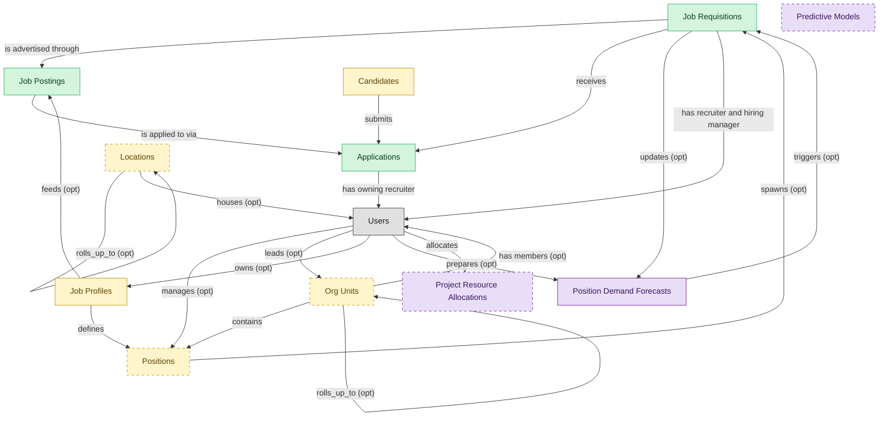

# Recruitment Pipeline

## 1. Overview

Requisitions → postings → applications with pipeline-stage lifecycle. Realizes REQ-MGMT and CANDIDATE-EXP (application flow slice). Embedded-masters `candidates`, optionally `hcm_positions` and `org_units` for canonical position/org context.

## 2. Entity summary

| Name | Description |
| --- | --- |
| Applications | A candidate's submission against a specific requisition. Carries pipeline stage, status (active / rejected / withdrawn / hired), source, and the full evaluation history. |
| Job Postings | Published, candidate-facing version of a requisition on a career site or job board. One requisition can have many postings (per board, language, or region). |
| Job Requisitions | Approved request to hire for a specific role. The master ATS work item, carries headcount, level, location, hiring manager, recruiter, and status (draft / open / on_hold / filled / cancelled). |
| Candidates | Person known to the recruiting org, with or without an active application. Carries contact details, resume, tags, GDPR consent, and source. Distinct from Employee until hired. |
| Job Profiles | Canonical role definition in the job catalog: title, family, level, responsibilities, required skills and competencies, pay range, FLSA classification. Distinct from positions (which are slots referencing a profile). Many positions share a single job profile. |
| Locations | - |
| Org Units | Node in the organizational hierarchy: division, business unit, department, team. Carries manager, cost center alignment, geographic scope, and parent/child relationships. HCM masters the operational hierarchy; EPM contributes the cost-center mapping (which would be Finance-mastered once a Finance/GL domain is loaded). |
| Positions | Approved slot in the org - a 'chair' with role definition, cost center, reporting line, location, and FTE allocation. Distinct from job_profiles (the catalog definition) and from employees (the person filling the slot). A position can be open, filled, or eliminated. SWP designs future positions via org_designs; HCM operationalizes them once approved. |
| Position Demand Forecasts | Projected need for specific roles derived from the capacity model: which positions, when, where, at what level. Feeds the requisition pipeline - approved demand becomes an authorised requisition in ATS via the headcount.approved handoff. |
| Predictive Models | ML / statistical model outputs deployed in PA: flight-risk scores, performance trajectory, internal-mobility likelihood. Carries the model identifier, training window, target metric, and the materialized scores per employee. Consumes employees and employment_events as features. |
| Project Resource Allocations | Forward-looking resource commitment plan (skill, planned utilisation %, effective period) - distinct from executed assignments. |

## 3. Entities catalog

| # | data_object | role | mastered in | necessity | pattern flags | notes |
| ---: | --- | --- | --- | --- | --- | --- |
| 1 | `job_applications` (Applications) | master | - | required | personal_content | - |
| 2 | `job_postings` (Job Postings) | master | - | required | - | - |
| 3 | `job_requisitions` (Job Requisitions) | master | - | required | single_approver | - |
| 4 | `candidates` (Candidates) | embedded_master | `ats-candidate-crm` | required | personal_content | - |
| 5 | `job_profiles` (Job Profiles) | embedded_master | `hcm-org-positions` | required | single_approver | - |
| 6 | `locations` (Locations) | embedded_master | `iwms-location-master` | optional | - | - |
| 7 | `org_units` (Org Units) | embedded_master | `hcm-org-positions` | optional | - | - |
| 8 | `hcm_positions` (Positions) | embedded_master | `hcm-org-positions` | optional | single_approver | - |
| 9 | `position_demand_forecasts` (Position Demand Forecasts) | consumer | `swp-demand-forecast` | required | - | - |
| 10 | `predictive_models` (Predictive Models) | consumer | `pa-predictive-models` | optional | - | - |
| 11 | `project_resource_allocations` (Project Resource Allocations) | consumer | `psa-resource-mgmt` | optional | - | - |

## 4. Aliases and industry synonyms

_(no industry-scoped aliases or non-synonym alias types loaded for this scope; generic synonyms are omitted as common knowledge.)_

## 5. Relationships

### 5.1 Intra-scope edges

| from | verb | to | cardinality | kind | necessity | owner_side | notes |
| --- | --- | --- | --- | --- | --- | --- | --- |
| `org_units` | contains | `hcm_positions` | one_to_many | reference | required | source | - |
| `job_profiles` | defines | `hcm_positions` | one_to_many | reference | required | source | - |
| `hcm_positions` | spawns | `job_requisitions` | one_to_many | reference | optional | source | - |
| `job_profiles` | feeds | `job_postings` | one_to_many | reference | optional | source | - |
| `job_requisitions` | is advertised through | `job_postings` | one_to_many | reference | required | source | - |
| `job_requisitions` | receives | `job_applications` | one_to_many | reference | required | source | - |
| `job_postings` | is applied to via | `job_applications` | one_to_many | reference | required | source | - |
| `candidates` | submits | `job_applications` | one_to_many | reference | required | target | - |
| `job_requisitions` | updates | `position_demand_forecasts` | many_to_many | reference | optional | target | - |
| `org_units` | rolls_up_to | `org_units` | one_to_many | reference | optional | source | - |
| `locations` | rolls_up_to | `locations` | one_to_many | reference | optional | source | - |
| `position_demand_forecasts` | triggers | `job_requisitions` | one_to_many | reference | optional | source | - |

### 5.2 Built-in edges (`users` and other platform built-ins)

| from | verb | to | cardinality | necessity | owner_side | notes |
| --- | --- | --- | --- | --- | --- | --- |
| `users` | manages | `hcm_positions` | one_to_many | optional | source | - |
| `users` | leads | `org_units` | one_to_many | optional | source | - |
| `users` | owns | `job_profiles` | one_to_many | optional | source | - |
| `job_requisitions` | has recruiter and hiring manager | `users` | many_to_many | required | source | - |
| `job_applications` | has owning recruiter | `users` | many_to_many | required | source | - |
| `org_units` | has members | `users` | one_to_many | optional | target | - |
| `locations` | houses | `users` | one_to_many | optional | target | - |
| `users` | prepares | `position_demand_forecasts` | one_to_many | optional | source | - |
| `users` | allocates | `project_resource_allocations` | one_to_many | required | target | - |

### 5.3 Cross-scope edges

| from | verb | to | cardinality | necessity | notes |
| --- | --- | --- | --- | --- | --- |
| `locations` | hosts_desk_bookings | `desk_bookings` | one_to_many | required | - |
| `locations` | hosts_room_reservations | `room_reservations` | one_to_many | required | - |
| `locations` | site_of_service_requests | `workplace_service_requests` | one_to_many | required | - |
| `locations` | measured_by_reports | `space_utilization_reports` | one_to_many | required | - |
| `locations` | subject_of_feedback | `workplace_experience_feedback` | one_to_many | optional | - |
| `org_units` | groups | `employees` | one_to_many | required | - |
| `hcm_positions` | is_filled_by | `employees` | one_to_one | optional | - |
| `cost_centers` | funds | `org_units` | one_to_many | required | - |
| `org_units` | engages | `contingent_workers` | one_to_many | optional | - |
| `org_units` | is_scored_by | `engagement_drivers` | one_to_many | optional | - |
| `org_units` | is_measured_by | `people_kpis` | one_to_many | optional | - |
| `job_profiles` | maps_to | `skill_profiles` | many_to_many | optional | - |
| `org_units` | triggers | `iga_entitlement_definitions` | one_to_many | optional | - |
| `job_profiles` | maps_to | `courses` | many_to_many | optional | - |
| `salary_bands` | anchors | `hcm_positions` | one_to_many | optional | - |
| `salary_bands` | bands | `job_profiles` | one_to_many | optional | - |
| `org_units` | maps_to | `cost_centers` | one_to_one | optional | - |
| `hcm_positions` | requires | `compliance_assignments` | one_to_many | optional | - |
| `job_profiles` | requires | `learning_paths` | many_to_many | optional | - |
| `job_profiles` | expects | `skill_profiles` | many_to_many | optional | - |
| `org_units` | sponsors | `compliance_assignments` | one_to_many | optional | - |
| `skill_profiles` | feeds | `candidates` | one_to_many | optional | - |
| `org_units` | sponsors | `benefit_plans` | many_to_many | optional | - |
| `survey_campaigns` | targets | `org_units` | many_to_many | optional | - |
| `org_units` | owns | `action_plans` | one_to_many | optional | - |
| `candidate_referrals` | introduces | `candidates` | one_to_many | required | - |
| `recruitment_sources` | attributes | `candidates` | one_to_many | required | - |
| `recruitment_agencies` | sources | `candidates` | one_to_many | required | - |
| `recruitment_events` | attracts | `candidates` | one_to_many | required | - |
| `talent_pools` | groups | `candidates` | many_to_many | required | - |
| `job_applications` | schedules | `interviews` | one_to_many | required | - |
| `job_applications` | requires | `candidate_assessments` | one_to_many | required | - |
| `job_applications` | results in | `job_offers` | one_to_many | required | - |
| `candidates` | becomes | `employees` | one_to_one | required | - |
| `job_requisitions` | feeds | `people_kpis` | many_to_many | optional | - |
| `candidates` | becomes pre-employee | `pre_employees` | one_to_one | required | - |
| `employees` | fills | `hcm_positions` | one_to_one | optional | - |
| `headcount_plans` | rolls_up_to | `position_demand_forecasts` | many_to_many | required | - |
| `position_demand_forecasts` | grounds | `skills_gap_analyses` | one_to_many | optional | - |
| `headcount_plans` | authorizes | `job_requisitions` | one_to_many | required | - |
| `workforce_scenarios` | drives | `hcm_positions` | one_to_many | required | - |
| `org_designs` | proposes | `hcm_positions` | one_to_many | required | - |
| `service_projects` | plans_resources_via | `project_resource_allocations` | one_to_many | optional | - |
| `project_resource_allocations` | confirms_into | `project_assignments` | one_to_many | optional | - |

## 6. Cross-domain context

### 6.1 Master consumers (other modules / domains that embed this scope's masters)

| data_object | other module / domain | role | necessity | notes |
| --- | --- | --- | --- | --- |
| `job_applications` | ATS-INTERVIEWS (Interviews) - ATS | embedded_master | required | - |
| `job_applications` | ATS-OFFERS (Offers) - ATS | embedded_master | required | - |
| `job_applications` | HIRING-STARTER (Hiring Starter) - ATS | embedded_master | required | - |
| `job_postings` | HIRING-STARTER (Hiring Starter) - ATS | embedded_master | required | - |
| `job_requisitions` | HCM-ORG-POSITIONS (Organisation and Position Management) - HCM | consumer | required | - |
| `job_requisitions` | SWP-DEMAND-FORECAST (Demand Forecast) - SWP | contributor | required | - |

### 6.2 Outbound handoffs (events this scope publishes)

| source module | target domain | target module | trigger_event | payload | integration | friction | description |
| --- | --- | --- | --- | --- | --- | --- | --- |
| ATS-RECRUITMENT-PIPELINE | HCM | HCM-ORG-POSITIONS | `requisition.filled` | `job_requisitions` | event_stream | low | Requisition fill closes headcount slot; HCM headcount-plan updates. |
| ATS-RECRUITMENT-PIPELINE | HCM | HCM-ORG-POSITIONS | `headcount.approved` | `job_requisitions` | event_stream | low | Headcount approval (often originating from HCM/SWP) confirmed back to HCM; gives ATS green light to source. |
| ATS-RECRUITMENT-PIPELINE | SWP | SWP-DEMAND-FORECAST | `requisition.filled` | `job_requisitions` | event_stream | low | Filled requisition feeds SWP actuals-vs-plan reconciliation. |
| ATS-RECRUITMENT-PIPELINE | SWP | SWP-DEMAND-FORECAST | `requisition.filled` | `position_demand_forecasts` | event_stream | medium | Filled requisitions from ATS decrement open demand in SWP's position forecasts and update plan-vs-actual fill metrics (time-to-fill, fill rate by role/geo). Lower friction than headcount.actuals_updated from HCM because the requisition→forecast mapping is more direct. |

### 6.3 Inbound handoffs (events this scope reacts to)

| target module | source domain | source module | trigger_event | payload | integration | friction | description |
| --- | --- | --- | --- | --- | --- | --- | --- |
| ATS-RECRUITMENT-PIPELINE | HCM | HCM-ORG-POSITIONS | `org_unit.activated` | `org_units` | api_call | low | - |
| ATS-RECRUITMENT-PIPELINE | ATS | ATS-CANDIDATE-CRM | `job_application.submitted` | `job_applications` | lifecycle_progression | low | - |
| ATS-RECRUITMENT-PIPELINE | HCM | HCM-ORG-POSITIONS | `hcm_position.approved_for_creation` | `hcm_positions` | event_stream | medium | Approved position flows to ATS as the basis for a requisition. Approval state must be in sync to avoid requisitions opened against unapproved positions. |
| ATS-RECRUITMENT-PIPELINE | HCM | HCM-ORG-POSITIONS | `job_profile.published` | `job_profiles` | event_stream | low | Canonical job profile feeds ATS posting templates and screening criteria. |
| ATS-RECRUITMENT-PIPELINE | HCM | HCM-ORG-POSITIONS | `hcm_position.opened` | `hcm_positions` | api_call | medium | - |
| ATS-RECRUITMENT-PIPELINE | HCM | HCM-ORG-POSITIONS | `hcm_position.filled` | `hcm_positions` | api_call | medium | - |
| ATS-RECRUITMENT-PIPELINE | HCM | HCM-ORG-POSITIONS | `hcm_position.frozen` | `hcm_positions` | api_call | high | - |
| ATS-RECRUITMENT-PIPELINE | HCM | HCM-ORG-POSITIONS | `hcm_position.eliminated` | `hcm_positions` | api_call | high | - |
| ATS-RECRUITMENT-PIPELINE | HCM | HCM-ORG-POSITIONS | `job_profile.approved` | `job_profiles` | api_call | low | - |
| ATS-RECRUITMENT-PIPELINE | HCM | HCM-ORG-POSITIONS | `job_profile.activated` | `job_profiles` | api_call | low | - |
| ATS-RECRUITMENT-PIPELINE | HCM | HCM-ORG-POSITIONS | `job_profile.retired` | `job_profiles` | api_call | high | - |
| ATS-RECRUITMENT-PIPELINE | HCM | HCM-CORE-WORKER | `employee.terminated` | `job_requisitions` | api_call | low | Employee termination in HCM optionally triggers backfill requisition consideration in ATS. Low friction when SWP-driven; some orgs auto-open a backfill req on regrettable losses, others route through SWP for approval first. |
| ATS-RECRUITMENT-PIPELINE | HCM | HCM-ORG-POSITIONS | `org_unit.reorganized` | `org_units` | api_call | high | - |
| ATS-RECRUITMENT-PIPELINE | HCM | HCM-ORG-POSITIONS | `org_unit.closed` | `org_units` | api_call | high | - |
| ATS-RECRUITMENT-PIPELINE | ATS | ATS-TALENT-POOLS | `talent_pool.candidate_activated` | `job_applications` | lifecycle_progression | low | - |
| ATS-RECRUITMENT-PIPELINE | ATS | ATS-INTERVIEWS | `interview.completed` | `job_applications` | lifecycle_progression | low | - |
| ATS-RECRUITMENT-PIPELINE | ATS | ATS-INTERVIEWS | `candidate_assessment.passed` | `job_applications` | lifecycle_progression | low | - |
| ATS-RECRUITMENT-PIPELINE | ATS | ATS-INTERVIEWS | `candidate_assessment.failed` | `job_applications` | lifecycle_progression | low | - |
| ATS-RECRUITMENT-PIPELINE | PA | PA-PREDICTIVE-MODELS | `predictive_model.scored` | `predictive_models` | api_call | medium | Hire-success and quality-of-hire scores inform ATS sourcing prioritization. |
| ATS-RECRUITMENT-PIPELINE | SWP | SWP-DEMAND-FORECAST | `position_demand_forecast.updated` | `position_demand_forecasts` | event_stream | high | Hiring demand sets ATS requisition-creation expectations. Plan-to-execute gap is a frequent friction source. |
| ATS-RECRUITMENT-PIPELINE | SWP | SWP-DEMAND-FORECAST | `headcount.approved` | `job_requisitions` | api_call | high | Approved headcount in SWP authorises requisition creation in ATS. THIS IS THE CO-MASTER BRIDGE: SWP masters the intent slice (approved position, budget, time window) and ATS masters the execution slice (pipeline, candidates, interviews, offer). High friction because SWP's plan structure (org × geo × level × time) rarely matches ATS's requisition template structure (job code × location × hiring manager × pay range), requiring mapping rules that drift as either side evolves. |
| ATS-RECRUITMENT-PIPELINE | PSA | PSA-RESOURCE-MGMT | `project_resource_allocation.demand_unmet` | `project_resource_allocations` | manual_handoff | high | Unmet allocation demand is the seed for a hiring requisition; the manual handoff between resource manager and recruiter is the dominant pattern. |
| ATS-RECRUITMENT-PIPELINE | HCM | HCM-ORG-POSITIONS | `job_profile.updated` | `job_profiles` | api_call | medium | - |
| ATS-RECRUITMENT-PIPELINE | HCM | HCM-ORG-POSITIONS | `org_unit.created` | `org_units` | api_call | medium | - |
| ATS-RECRUITMENT-PIPELINE | HCM | HCM-ORG-POSITIONS | `org_unit.merged` | `org_units` | api_call | high | - |
| ATS-RECRUITMENT-PIPELINE | HCM | HCM-ORG-POSITIONS | `org_unit.disbanded` | `org_units` | api_call | high | - |
| ATS-RECRUITMENT-PIPELINE | HCM | HCM-ORG-POSITIONS | `hcm_position.approved` | `hcm_positions` | api_call | medium | - |

### 6.4 Master providers (modules / domains that own masters this scope embeds)

| data_object | role here | necessity | canonical owner(s) | slice notes |
| --- | --- | --- | --- | --- |
| `candidates` | embedded_master | required | ATS-CANDIDATE-CRM (ATS) | - |
| `hcm_positions` | embedded_master | optional | HCM-ORG-POSITIONS (HCM) | - |
| `job_profiles` | embedded_master | required | HCM-ORG-POSITIONS (HCM) | - |
| `locations` | embedded_master | optional | IWMS-LOCATION-MASTER (IWMS) | - |
| `org_units` | embedded_master | optional | HCM-ORG-POSITIONS (HCM) | - |
| `position_demand_forecasts` | consumer | required | SWP-DEMAND-FORECAST (SWP) | - |
| `predictive_models` | consumer | optional | PA-PREDICTIVE-MODELS (PA) | - |
| `project_resource_allocations` | consumer | optional | PSA-RESOURCE-MGMT (PSA) | - |

## 7. Lifecycle states (per touched entity)

### `candidates` (Candidate)

_This scope holds `candidates` as **embedded_master**; the canonical state machine is owned by `ATS-CANDIDATE-CRM`._

| order | state_name | initial? | terminal? | requires_permission? | derived gate | description |
| --- | --- | --- | --- | --- | --- | --- |
| 1 | `prospect` | ✓ | - | - | - | Person known to the recruiting org with no active application. |
| 2 | `active` | - | - | - | - | Candidate has at least one open application or is actively engaged. |
| 3 | `hired` | - | ✓ | ✓ | `ats-candidate-crm:hire_candidate` | Candidate accepted an offer and converted to employee. |
| 4 | `do_not_hire` | - | ✓ | ✓ | `ats-candidate-crm:flag_do_not_hire` | Candidate flagged as ineligible for future consideration; gated decision. |
| 5 | `archived` | - | ✓ | - | - | Candidate kept in the database but not active in any pipeline. |

### `hcm_positions` (Position)

_This scope holds `hcm_positions` as **embedded_master**; the canonical state machine is owned by `HCM-ORG-POSITIONS`._

| order | state_name | initial? | terminal? | requires_permission? | derived gate | description |
| --- | --- | --- | --- | --- | --- | --- |
| 1 | `proposed` | ✓ | - | - | - | Position has been designed but not yet approved against the headcount plan. |
| 2 | `approved` | - | - | ✓ | `hcm-org-positions:approved_position` | Cleared by headcount/finance owner; eligible to spawn a requisition. |
| 3 | `open` | - | - | ✓ | `hcm-org-positions:open_position` | Approved and actively being recruited against; not yet filled. |
| 4 | `filled` | - | - | ✓ | `hcm-org-positions:filled_position` | An employee occupies the position. |
| 5 | `frozen` | - | - | ✓ | `hcm-org-positions:frozen_position` | Temporarily not fillable (hiring freeze, budget hold); retains the slot. |
| 6 | `eliminated` | - | ✓ | ✓ | `hcm-org-positions:eliminated_position` | Removed from the org structure permanently. |

### `job_applications` (Application)

| order | state_name | initial? | terminal? | requires_permission? | derived gate | description |
| --- | --- | --- | --- | --- | --- | --- |
| 1 | `applied` | ✓ | - | - | - | Candidate submitted an application against the requisition. |
| 2 | `screening` | - | - | - | - | Recruiter is reviewing resume and qualifications. |
| 3 | `interviewing` | - | - | - | - | Candidate is progressing through interview loops. |
| 4 | `offer_extended` | - | - | - | - | An offer has been generated and is in flight for this application. |
| 5 | `hired` | - | ✓ | ✓ | `ats-pre-employee-record:hire_candidate` | Candidate accepted the offer and was hired; gated transition. |
| 6 | `rejected` | - | ✓ | - | - | Application closed without progression by recruiter or hiring manager. |
| 7 | `withdrawn` | - | ✓ | - | - | Candidate withdrew their application. |

### `job_postings` (Job Posting)

| order | state_name | initial? | terminal? | requires_permission? | derived gate | description |
| --- | --- | --- | --- | --- | --- | --- |
| 1 | `draft` | ✓ | - | - | - | Posting being composed against a requisition for a specific board or region. |
| 2 | `published` | - | - | ✓ | `ats-recruitment-pipeline:publish_posting` | Posting is live on the target channel; gated publish step. |
| 3 | `paused` | - | - | - | - | Posting temporarily hidden from the channel. |
| 4 | `expired` | - | ✓ | - | - | Posting reached its scheduled end date. |
| 5 | `closed` | - | ✓ | - | - | Posting taken down because the requisition is filled or cancelled. |

### `job_profiles` (Job Profile)

_This scope holds `job_profiles` as **embedded_master**; the canonical state machine is owned by `HCM-ORG-POSITIONS`._

| order | state_name | initial? | terminal? | requires_permission? | derived gate | description |
| --- | --- | --- | --- | --- | --- | --- |
| 1 | `draft` | ✓ | - | - | - | Profile is being authored or revised; not yet available for position assignment. |
| 2 | `approved` | - | - | ✓ | `hcm-org-positions:approved_job_profile` | Cleared by the catalog owner; ready to be referenced by positions and postings. |
| 3 | `active` | - | - | ✓ | `hcm-org-positions:active_job_profile` | In production use; positions and postings can reference it. |
| 4 | `retired` | - | ✓ | ✓ | `hcm-org-positions:retired_job_profile` | No longer assignable to new positions; historical references preserved. |

### `job_requisitions` (Job Requisition)

| order | state_name | initial? | terminal? | requires_permission? | derived gate | description |
| --- | --- | --- | --- | --- | --- | --- |
| 1 | `draft` | ✓ | - | - | - | Hiring manager is drafting the requisition. |
| 2 | `pending_approval` | - | - | - | - | Requisition routed for headcount and budget approval. |
| 3 | `open` | - | - | ✓ | `ats-recruitment-pipeline:approve_requisition` | Requisition approved and actively recruiting. |
| 4 | `on_hold` | - | - | - | - | Recruiting temporarily paused (budget freeze, scope change). |
| 5 | `filled` | - | ✓ | ✓ | `ats-recruitment-pipeline:close_requisition` | Requisition closed because the role was filled. |
| 6 | `cancelled` | - | ✓ | - | - | Requisition closed without a hire. |

### `org_units` (Org Unit)

_This scope holds `org_units` as **embedded_master**; the canonical state machine is owned by `HCM-ORG-POSITIONS`._

| order | state_name | initial? | terminal? | requires_permission? | derived gate | description |
| --- | --- | --- | --- | --- | --- | --- |
| 1 | `draft` | ✓ | - | - | - | Org unit defined as part of a future structure; not yet operational. |
| 2 | `active` | - | - | ✓ | `hcm-org-positions:active_org_unit` | Operational unit; carries headcount, cost-center linkage, and reporting lines. |
| 3 | `reorganized` | - | ✓ | ✓ | `hcm-org-positions:reorganized_org_unit` | Unit folded into or replaced by a new structure; references remain for history. |
| 4 | `closed` | - | ✓ | ✓ | `hcm-org-positions:closed_org_unit` | Unit dissolved; no employees or positions reside in it. |

### `project_resource_allocations` (Project Resource Allocation)

_This scope holds `project_resource_allocations` as **consumer**; the canonical state machine is owned by `PSA-RESOURCE-MGMT`._

| order | state_name | initial? | terminal? | requires_permission? | derived gate | description |
| --- | --- | --- | --- | --- | --- | --- |
| 1 | `tentative` | ✓ | - | - | - | Forecast allocation drafted by resource manager; not yet committed. |
| 2 | `committed` | - | - | ✓ | `psa-resource-mgmt:commit_project_resource_allocation` | Allocation firmed up: HCM treats the named hours as booked capacity; CLM links the allocation to the underlying engagement contract. |
| 3 | `fulfilled` | - | ✓ | - | - | Allocation period elapsed and corresponding assignments closed. |
| 4 | `cancelled` | - | ✓ | ✓ | `psa-resource-mgmt:cancel_project_resource_allocation` | Allocation withdrawn before commitment (forecast change, project delayed or descoped). |

## 8. Permissions and business rules (derived)

### 8.1 Permissions

| permission | tier | description | included in `:admin`? |
| --- | --- | --- | --- |
| `ats-recruitment-pipeline:read` | baseline-read | Read access to every entity in the module | ✓ |
| `ats-recruitment-pipeline:manage` | baseline-manage | Edit operational records | ✓ |
| `ats-recruitment-pipeline:admin` | baseline-admin | Edit reference data and inherit every workflow gate below | - |
| `ats-recruitment-pipeline:approve_requisition` | workflow-gate (lifecycle) | Transition `job_requisitions` into state `open` | ✓ |
| `ats-recruitment-pipeline:close_requisition` | workflow-gate (lifecycle) | Transition `job_requisitions` into state `filled` | ✓ |
| `ats-recruitment-pipeline:publish_posting` | workflow-gate (lifecycle) | Transition `job_postings` into state `published` | ✓ |
| `ats-recruitment-pipeline:view_all_applications` | override (personal_content) | View all `job_applications` rows beyond row-scope | ✓ |
| `ats-recruitment-pipeline:manage_all_applications` | override (personal_content) | Manage all `job_applications` rows beyond row-scope | ✓ |

### 8.2 Business rules

| rule_name | data_object | source flag | intent |
| --- | --- | --- | --- |
| `approve_job_requisition_requires_approver` | `job_requisitions` | has_single_approver | Exactly one explicit approver required; uses the module's approval gate (`ats-recruitment-pipeline:approve_job_requisition` if surfaced as a lifecycle workflow gate). |
| `application_edit_scope` | `job_applications` | has_personal_content | Row-scope by default; override via `ats-recruitment-pipeline:view_all_applications` / `ats-recruitment-pipeline:manage_all_applications` |
