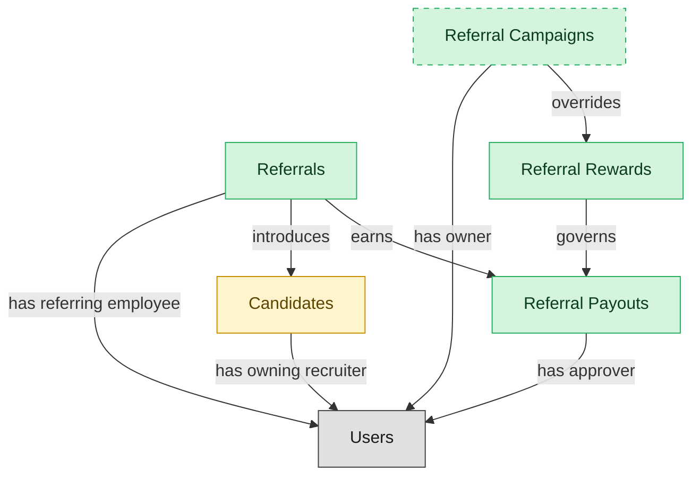

# Employee Referrals

## 1. Overview

Employee-driven candidate sourcing with referral-bonus tracking (`candidate_referrals`). Embedded-masters `candidates`. Cross-domain handoffs to PAYROLL (bonus payout) and EMP-EXP (engagement signal).

## 2. Entity summary

| Name | data_object | Description |
| --- | --- | --- |
| Referral Campaigns | `referral_campaigns` | Time-bounded promotions offering bonus referral rewards, scoping an override to the standard referral payout rules. |
| Referral Payouts | `referral_payouts` | Individual referral payouts triggered when a referred candidate is hired and meets tenure conditions, moving from pending to approved to paid. |
| Referral Rewards | `referral_rewards` | Bounty rules defining the payout amount and conditions for a successful referral, such as a fixed sum paid after the new hire's start. |
| Referrals | `candidate_referrals` | Employee-submitted candidate suggestions linked to a requisition, tracking the referring employee, candidate, status, and any payable bonus. |
| Candidates | `candidates` | People known to the recruiting organization, with or without an active application, carrying contact details, resume, tags, consent, and source. |

## 3. Entities catalog

| # | data_object | canonical code | singular | plural | role | mastered in | mastered label | necessity | pattern flags | entity_type | write tier | notes |
| ---: | --- | --- | --- | --- | --- | --- | --- | --- | --- | --- | --- | --- |
| 1 | `referral_campaigns` | `referral_campaigns` | Referral Campaign | Referral Campaigns | master | - | - | optional | - | operational_workflow | `:manage` | - |
| 2 | `referral_payouts` | `referral_payouts` | Referral Payout | Referral Payouts | master | - | - | required | - | operational_workflow | `:manage` | - |
| 3 | `referral_rewards` | `referral_rewards` | Referral Reward | Referral Rewards | master | - | - | required | - | catalog | `:admin` | - |
| 4 | `candidate_referrals` | `candidate_referrals` | Referral | Referrals | master | - | - | required | - | operational_workflow | `:manage` | - |
| 5 | `candidates` | `candidates` | Candidate | Candidates | embedded_master | `ats-candidate-crm` | Candidate CRM | required | personal_content | operational_workflow | `:manage` | - |

## 4. Aliases and industry synonyms

_(none: no industry-scoped aliases for this scope)_

## 5. Relationships

### 5.1 Intra-scope edges

| from | verb | to | cardinality | kind | necessity | owner_side | delete_mode | fk_format | notes |
| --- | --- | --- | --- | --- | --- | --- | --- | --- | --- |
| `candidate_referrals` | earns | `referral_payouts` | one_to_one | reference | optional | source | clear | reference | - |
| `referral_rewards` | governs | `referral_payouts` | one_to_many | reference | required | source | restrict | reference | - |
| `referral_campaigns` | overrides | `referral_rewards` | one_to_many | reference | optional | source | clear | reference | - |
| `candidate_referrals` | introduces | `candidates` | one_to_many | reference | required | target | restrict | reference | - |

### 5.2 Built-in edges (`users` and other platform built-ins)

| from | verb | to | cardinality | necessity | owner_side | delete_mode | fk_format | notes |
| --- | --- | --- | --- | --- | --- | --- | --- | --- |
| `candidates` | has owning recruiter | `users` | many_to_many | optional | source | clear | reference | - |
| `referral_payouts` | has approver | `users` | many_to_many | optional | source | clear | reference | - |
| `referral_campaigns` | has owner | `users` | many_to_many | optional | source | clear | reference | - |
| `candidate_referrals` | has referring employee | `users` | many_to_many | required | source | restrict | reference | - |

### 5.3 Cross-scope edges

#### 5.3a Outbound from this scope's masters and contributors

_Edges this scope drives: the in-scope endpoint has `role` of `master` or `contributor`._

_(none: no outbound cross-scope edges from this scope's masters or contributors)_

#### 5.3b Context edges on embedded shells and consumed entities

_Edges the canonical owner drives, shown for context: the in-scope endpoint has `role` of `embedded_master`, `consumer`, or `derived`._

| from | verb | to | cardinality | necessity | delete_mode | fk_format | notes |
| --- | --- | --- | --- | --- | --- | --- | --- |
| `candidates` | verified_via | `right_to_work_verifications` | one_to_many | optional | none | n/a | - |
| `candidates` | engaged_via | `candidate_engagements` | one_to_many | optional | none | n/a | - |
| `candidates` | attends_via | `recruiting_event_attendances` | one_to_many | required | none (required-if-present) | n/a | - |
| `candidates` | noted_via | `recruiter_interactions` | one_to_many | optional | none | n/a | - |
| `candidates` | consents_via | `candidate_consents` | one_to_many | required | ⚠ audit: required composed child out of scope | n/a | - |
| `candidates` | member_of_via | `talent_pool_memberships` | one_to_many | required | none (required-if-present) | n/a | - |
| `candidates` | discloses_via | `fcra_disclosures` | one_to_many | required | ⚠ audit: required composed child out of scope | n/a | - |
| `candidates` | self_identifies_via | `eeo_responses` | one_to_many | optional | none | n/a | - |
| `candidates` | submits_via | `data_subject_requests` | one_to_many | optional | none | n/a | - |
| `candidates` | self_ids_via | `voluntary_self_identifications` | one_to_many | optional | none | n/a | - |
| `candidates` | acknowledges_via | `fcra_summary_of_rights_acknowledgements` | one_to_many | optional | none | n/a | - |
| `candidates` | documented_via | `candidate_documents` | one_to_many | optional | none | n/a | - |
| `candidates` | annotated_via | `candidate_notes` | one_to_many | optional | none | n/a | - |
| `candidates` | tagged_via | `candidate_tag_assignments` | one_to_many | optional | none | n/a | - |
| `skill_profiles` | feeds | `candidates` | one_to_many | optional | none | n/a | - |
| `candidates` | submits | `job_applications` | one_to_many | required | none (required-if-present) | n/a | - |
| `recruitment_sources` | attributes | `candidates` | one_to_many | required | none (required-if-present) | n/a | - |
| `recruitment_agencies` | sources | `candidates` | one_to_many | required | none (required-if-present) | n/a | - |
| `recruitment_events` | attracts | `candidates` | one_to_many | required | none (required-if-present) | n/a | - |
| `talent_pools` | groups | `candidates` | many_to_many | required | none (required-if-present) | n/a | - |
| `candidates` | becomes | `employees` | one_to_one | required | none (required-if-present) | n/a | - |
| `candidates` | becomes pre-employee | `pre_employees` | one_to_one | required | none (required-if-present) | n/a | - |
| `employees` | applies_as | `candidates` | one_to_many | optional | none | n/a | - |
| `candidates` | corresponds_via | `candidate_emails` | one_to_many | optional | none | n/a | - |
| `candidates` | screened_via | `drug_health_screenings` | one_to_many | optional | none | n/a | - |
| `candidates` | submitted_via | `agency_submissions` | one_to_many | optional | none | n/a | - |

## 6. Cross-domain context

### 6.1 Master consumers (other modules / domains that embed this scope's masters)

| data_object | other module / domain | role | necessity | notes |
| --- | --- | --- | --- | --- |
| `candidate_referrals` | PAYROLL-EARNINGS-DEDUCTIONS (Earnings, Deductions and Garnishments) - PAYROLL | consumer | required | - |

### 6.2 Outbound handoffs (events this scope publishes)

| source module | target domain | target module | trigger_event | transition | payload | integration | friction | description |
| --- | --- | --- | --- | --- | --- | --- | --- | --- |
| ATS-CANDIDATE-CRM | HCM | HCM-LIFECYCLE-WORKFLOWS | `candidate.hired` | `hired` _(lifecycle)_ | `candidates` | event_stream | high | Hired-candidate event publishes the hiring outcome to HCM, which must create the employee record. Identifier mapping (candidate_id -> employee_id) is the canonical reconciliation gap. |
| ATS-REFERRALS | PAYROLL | PAYROLL-EARNINGS-DEDUCTIONS | `candidate_referral.bonus_earned` | _(state_change)_ | `candidate_referrals` | api_call | medium | Referral-bonus eligibility milestone reached; PAYROLL pays bonus via off-cycle or next regular run. |
| ATS-REFERRALS | ATS | ATS-CANDIDATE-CRM | `candidate_referral.submitted` | _(lifecycle)_ | `candidates` | lifecycle_progression | low | - |
| ATS-CANDIDATE-CRM | BEN-ADMIN | BEN-ENROLLMENT | `candidate.hired` | `hired` _(lifecycle)_ | `candidates` | event_stream | low | Hired candidate triggers eligibility window in BEN-ADMIN. |
| ATS-CANDIDATE-CRM | ONBOARDING | ONB-JOURNEY-MGMT | `candidate.hired` | `hired` _(lifecycle)_ | `candidates` | event_stream | medium | Hired candidate drives onboarding-plan kickoff with role/location/manager context from ATS payload. |

### 6.3 Inbound handoffs (events this scope reacts to)

| target module | source domain | source module | trigger_event | transition | payload | integration | friction | description |
| --- | --- | --- | --- | --- | --- | --- | --- | --- |
| ATS-CANDIDATE-CRM | HCM | HCM-CORE-WORKER | `employee.applied_internally` | `active` → `active` _(signal)_ | `candidates` | api_call | medium | When an employee applies internally, HCM hands the worker context to the applicant tracker, which materializes an internal candidate record from the worker profile. Friction: reconciling the worker identity against the candidate identity space. |

### 6.4 Master providers (modules / domains that own masters this scope embeds)

| data_object | role here | necessity | canonical owner(s) | slice notes |
| --- | --- | --- | --- | --- |
| `candidates` | embedded_master | required | ATS-CANDIDATE-CRM (ATS) | - |

## 7. Lifecycle states

### `candidate_referrals` (Referral)

| order | state_name | initial? | terminal? | requires_permission? | derived gate | description |
| --- | --- | --- | --- | --- | --- | --- |
| 1 | `submitted` | ✓ | - | - | - | Employee submitted a referral candidate against a requisition. |
| 2 | `under_review` | - | - | - | - | Recruiter is evaluating the referred candidate. |
| 3 | `converted` | - | ✓ | - | - | Referral became a job application in the ATS pipeline. |
| 4 | `bonus_payable` | - | - | ✓ | `ats-referrals:pay_referral_bonus` | Hire confirmed; gated step to approve the referral bonus payout. |
| 5 | `bonus_paid` | - | ✓ | - | - | Referral bonus has been issued to the referring employee. |
| 6 | `rejected` | - | ✓ | - | - | Referral not pursued. |

### `candidates` (Candidate)

_This scope holds `candidates` as **embedded_master**; the canonical state machine is owned by `ATS-CANDIDATE-CRM`._

| order | state_name | initial? | terminal? | requires_permission? | derived gate | description |
| --- | --- | --- | --- | --- | --- | --- |
| 1 | `prospect` | ✓ | - | - | - | Person known to the recruiting org with no active application. |
| 2 | `active` | - | - | - | - | Candidate has at least one open application or is actively engaged. |
| 3 | `hired` | - | ✓ | ✓ | `ats-referrals:hire_candidate` | Candidate accepted an offer and converted to employee. |
| 4 | `do_not_hire` | - | ✓ | ✓ | `ats-referrals:flag_do_not_hire` | Candidate flagged as ineligible for future consideration; gated decision. |
| 5 | `archived` | - | ✓ | - | - | Candidate kept in the database but not active in any pipeline. |

### `referral_campaigns` (Referral Campaign)

| order | state_name | initial? | terminal? | requires_permission? | derived gate | description |
| --- | --- | --- | --- | --- | --- | --- |
| 1 | `draft` | ✓ | - | - | - | Campaign being scoped. |
| 2 | `active` | - | - | - | - | Campaign live; referrals submitted during window qualify for override reward. |
| 3 | `ended` | - | ✓ | - | - | Campaign window closed. |

### `referral_payouts` (Referral Payout)

| order | state_name | initial? | terminal? | requires_permission? | derived gate | description |
| --- | --- | --- | --- | --- | --- | --- |
| 1 | `pending` | ✓ | - | - | - | Referral hire confirmed; tenure clock running. |
| 2 | `approved` | - | - | ✓ | `ats-referrals:approve_referral_payout` | Tenure condition met; payout approved by HR/Finance. |
| 3 | `paid` | - | ✓ | - | - | Payout disbursed to referrer. |
| 4 | `clawed_back` | - | ✓ | ✓ | `ats-referrals:clawback_referral_payout` | Referred employee left before tenure clause expired; payout reversed. |
| 5 | `forfeited` | - | ✓ | - | - | Conditions never met (referred candidate not hired, did not start, voided). |

## 8. Permissions and business rules (derived)

### 8.1 Permissions

| permission | tier | description | included in `:admin`? |
| --- | --- | --- | --- |
| `ats-referrals:read` | baseline-read | Read access to every entity in the module | ✓ |
| `ats-referrals:manage` | baseline-manage | Edit operational records | ✓ |
| `ats-referrals:admin` | baseline-admin | Edit reference data and inherit every workflow gate below | - |
| `ats-referrals:hire_candidate` | workflow-gate (lifecycle) | Transition `candidates` into state `hired` | ✓ |
| `ats-referrals:flag_do_not_hire` | workflow-gate (lifecycle) | Transition `candidates` into state `do_not_hire` | ✓ |
| `ats-referrals:pay_referral_bonus` | workflow-gate (lifecycle) | Transition `candidate_referrals` into state `bonus_payable` | ✓ |
| `ats-referrals:approve_referral_payout` | workflow-gate (lifecycle) | Transition `referral_payouts` into state `approved` | ✓ |
| `ats-referrals:clawback_referral_payout` | workflow-gate (lifecycle) | Transition `referral_payouts` into state `clawed_back` | ✓ |
| `ats-referrals:view_all_candidates` | override (personal_content) | View all `candidates` rows beyond row-scope | ✓ |
| `ats-referrals:manage_all_candidates` | override (personal_content) | Manage all `candidates` rows beyond row-scope | ✓ |

### 8.2 Business rules

| rule_name | data_object | source flag | intent |
| --- | --- | --- | --- |
| `candidate_edit_scope` | `candidates` | has_personal_content | Row-scope by default; override via `ats-referrals:view_all_candidates` / `ats-referrals:manage_all_candidates` |

## 9. Roles, RACI, and responsibilities (derived)

_Baseline roles, the permission hierarchy, and RACI realization are DERIVED from this scope's entity-type write tiers + `process_raci`; none of it is stored in the catalog (the deployer provisions it from this blueprint)._

### 9.1 `ATS-REFERRALS`

**Baseline roles:**

| role | baseline grant |
| --- | --- |
| `ats-referrals_viewer` | `ats-referrals:read` |
| `ats-referrals_manager` | `ats-referrals:manage` |
| `ats-referrals_admin` | `ats-referrals:admin` |

**Permission hierarchy:**

| permission | includes |
| --- | --- |
| `ats-referrals:admin` | `ats-referrals:manage` |
| `ats-referrals:manage` | `ats-referrals:read` |
| `ats-referrals:admin` | `ats-referrals:hire_candidate` |
| `ats-referrals:admin` | `ats-referrals:flag_do_not_hire` |
| `ats-referrals:admin` | `ats-referrals:pay_referral_bonus` |
| `ats-referrals:admin` | `ats-referrals:approve_referral_payout` |
| `ats-referrals:admin` | `ats-referrals:clawback_referral_payout` |
| `ats-referrals:admin` | `ats-referrals:view_all_candidates` |
| `ats-referrals:admin` | `ats-referrals:manage_all_candidates` |

**Processes wired:**

| process_key | process_name | PCF code | PCF ID | level | description |
| --- | --- | --- | --- | --- | --- |
| `hire_candidate` | Hire candidate | 7.2.4.3 | 10465 | 4 | Wrapping up the process for hiring candidates. Agree to all hiring terms and conditions. Have the candidate accept and sign the job offer. |
| `manage_employee_referral` | Manage employee referral programs | 7.2.2.5 | 17047 | 4 | Creating and managing a recruiting strategy where current employees are rewarded for referring qualified candidates for employment. |

**RACI realization:**

| actor | kind | raci | process_key | realization |
| --- | --- | --- | --- | --- |
| `RECRUITING-RECRUITER` | persona | responsible | `hire_candidate` | grant gates [ats-referrals:hire_candidate] + the gated entities' write tier |
| `HIRING-MANAGER` | persona | accountable | `hire_candidate` | approval gate |
| `LEGAL-COMPLIANCE-SPECIALIST` | persona | informed | `hire_candidate` | notification side effect (trigger_event / webhook_receiver) |
| `RECRUITING-RECRUITER` | persona | responsible | `manage_employee_referral` | grant gates [ats-referrals:pay_referral_bonus] + the gated entities' write tier |
| `RECRUITING-MANAGER` | persona | accountable | `manage_employee_referral` | approval gate |

### 9.2 Functional ownership and default grants

| responsibility | business function | default role | default tier |
| --- | --- | --- | --- |
| owner | Recruiting | `admin` | `:admin` |
| contributor | Human Resources | `manage` | `:manage` |
| contributor | Legal | `manage` | `:manage` |
| consumer | Finance | `read` | `:read` |
