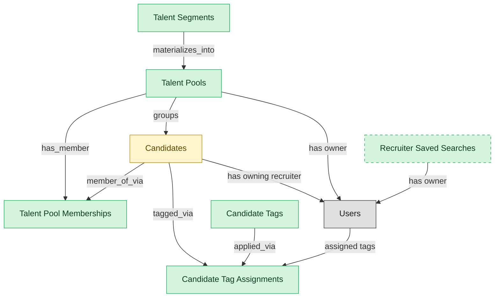

# Talent Pools

## 1. Overview

Curated candidate groupings for nurture and pipeline-building (`talent_pools`). Embedded-masters `candidates`; deployed alone, materializes a thin candidate shell. Mirrors standalone talent-acquisition CRM products.

## 2. Entity summary

| Name | data_object | Description |
| --- | --- | --- |
| Candidate Tag Assignments | `candidate_tag_assignments` | Links between candidates and tags, recording who assigned each tag and when, with optional context. |
| Candidate Tags | `candidate_tags` | Free-form labels applied to candidates to support segmentation, search, and pool inclusion, with name, optional category, and color. |
| Recruiter Saved Searches | `recruiter_saved_searches` | Saved recruiter searches over the candidate database, with the filter expression, last-run time, and alert preferences. |
| Talent Pool Memberships | `talent_pool_memberships` | Links between candidates and talent pools, carrying added date, source, status in the pool, match score, and last engagement. |
| Talent Pools | `talent_pools` | Curated pools of candidates kept warm for future roles, such as past finalists, alumni, and hard-to-fill skill clusters. |
| Talent Segments | `talent_segments` | Rule-based pool definitions over candidates that automatically populate membership from a saved filter. |
| Candidates | `candidates` | People known to the recruiting organization, with or without an active application, carrying contact details, resume, tags, consent, and source. |

## 3. Entities catalog

| # | data_object | canonical code | singular | plural | description | role | mastered in | mastered label | necessity | pattern flags | entity_type | write tier | notes |
| ---: | --- | --- | --- | --- | --- | --- | --- | --- | --- | --- | --- | --- | --- |
| 1 | `candidate_tag_assignments` | `candidate_tag_assignments` | Candidate Tag Assignment | Candidate Tag Assignments | Many-to-many junction between candidates and candidate_tags. Carries assigned_by, assigned_at, and optional context. | master | - | - | required | - | junction | `:admin` | - |
| 2 | `candidate_tags` | `candidate_tags` | Candidate Tag | Candidate Tags | Free-form label applied to a candidate to support segmentation, search, and pool inclusion rules. Distinct from talent pools (curated membership lists). Carries name, optional category, and color. | master | - | - | required | - | catalog | `:admin` | - |
| 3 | `recruiter_saved_searches` | `recruiter_saved_searches` | Recruiter Saved Search | Recruiter Saved Searches | Persisted recruiter boolean query over the candidate database. Carries filter expression, last_run timestamp, alert preferences. | master | - | - | optional | - | catalog | `:admin` | - |
| 4 | `talent_pool_memberships` | `talent_pool_memberships` | Talent Pool Membership | Talent Pool Memberships | Junction between candidates and talent_pools. Carries added timestamp, source, status_in_pool (cold/warm/hot), match score, and last_engagement timestamp. | master | - | - | required | - | junction | `:manage` | - |
| 5 | `talent_pools` | `talent_pools` | Talent Pool | Talent Pools | Curated segment or pipeline of candidates kept warm for future roles (e.g. silver medallists, alumni, target-school grads, hard-to-fill skill clusters). | master | - | - | required | - | operational_workflow | `:manage` | - |
| 6 | `talent_segments` | `talent_segments` | Talent Segment | Talent Segments | Rule-based pool definition (boolean filter over candidates) that materializes membership automatically. Examples: 'Senior PMs in NYC with FinTech experience', 'Engineering alumni who left in the last 2 years'. | master | - | - | required | - | catalog | `:admin` | - |
| 7 | `candidates` | `candidates` | Candidate | Candidates | Person known to the recruiting org, with or without an active application. Carries contact details, resume, tags, GDPR consent, and source. Distinct from Employee until hired. | embedded_master | `ats-candidate-crm` | Candidate CRM | required | personal_content | operational_workflow | `:manage` | - |

## 4. Aliases and industry synonyms

_(none: no industry-scoped aliases for this scope)_

## 5. Relationships

### 5.1 Intra-scope edges

| from | verb | to | cardinality | kind | necessity | owner_side | delete_mode | fk_format | notes |
| --- | --- | --- | --- | --- | --- | --- | --- | --- | --- |
| `talent_pools` | has_member | `talent_pool_memberships` | one_to_many | composition | required | source | cascade | parent | - |
| `candidates` | member_of_via | `talent_pool_memberships` | one_to_many | reference | required | target | restrict | reference | - |
| `talent_segments` | materializes_into | `talent_pools` | one_to_many | reference | optional | source | clear | reference | - |
| `candidates` | tagged_via | `candidate_tag_assignments` | one_to_many | reference | optional | source | clear | reference | - |
| `candidate_tags` | applied_via | `candidate_tag_assignments` | one_to_many | reference | required | source | restrict | reference | - |
| `talent_pools` | groups | `candidates` | many_to_many | reference | required | target | restrict | reference | - |

### 5.2 Built-in edges (`users` and other platform built-ins)

| from | verb | to | cardinality | necessity | owner_side | delete_mode | fk_format | notes |
| --- | --- | --- | --- | --- | --- | --- | --- | --- |
| `candidates` | has owning recruiter | `users` | many_to_many | optional | source | clear | reference | - |
| `talent_pools` | has owner | `users` | many_to_many | required | source | restrict | reference | - |
| `users` | assigned tags | `candidate_tag_assignments` | one_to_many | optional | source | clear | reference | - |
| `recruiter_saved_searches` | has owner | `users` | many_to_many | required | source | restrict | reference | - |

### 5.3 Cross-scope edges

#### 5.3a Outbound from this scope's masters and contributors

_Edges this scope drives: the in-scope endpoint has `role` of `master` or `contributor`._

| from | verb | to | cardinality | necessity | delete_mode | fk_format | notes |
| --- | --- | --- | --- | --- | --- | --- | --- |
| `talent_pools` | targets | `candidate_nurture_campaigns` | many_to_many | optional | none | n/a | - |

#### 5.3b Context edges on embedded shells and consumed entities

_Edges the canonical owner drives, shown for context: the in-scope endpoint has `role` of `embedded_master`, `consumer`, or `derived`._

| from | verb | to | cardinality | necessity | delete_mode | fk_format | notes |
| --- | --- | --- | --- | --- | --- | --- | --- |
| `candidates` | verified_via | `right_to_work_verifications` | one_to_many | optional | none | n/a | - |
| `candidates` | engaged_via | `candidate_engagements` | one_to_many | optional | none | n/a | - |
| `candidates` | attends_via | `recruiting_event_attendances` | one_to_many | required | none (required-if-present) | n/a | - |
| `candidates` | noted_via | `recruiter_interactions` | one_to_many | optional | none | n/a | - |
| `candidates` | consents_via | `candidate_consents` | one_to_many | required | ⚠ audit: required composed child out of scope | n/a | - |
| `candidates` | discloses_via | `fcra_disclosures` | one_to_many | required | ⚠ audit: required composed child out of scope | n/a | - |
| `candidates` | self_identifies_via | `eeo_responses` | one_to_many | optional | none | n/a | - |
| `candidates` | submits_via | `data_subject_requests` | one_to_many | optional | none | n/a | - |
| `candidates` | self_ids_via | `voluntary_self_identifications` | one_to_many | optional | none | n/a | - |
| `candidates` | acknowledges_via | `fcra_summary_of_rights_acknowledgements` | one_to_many | optional | none | n/a | - |
| `candidates` | documented_via | `candidate_documents` | one_to_many | optional | none | n/a | - |
| `candidates` | annotated_via | `candidate_notes` | one_to_many | optional | none | n/a | - |
| `skill_profiles` | feeds | `candidates` | one_to_many | optional | none | n/a | - |
| `candidates` | submits | `job_applications` | one_to_many | required | none (required-if-present) | n/a | - |
| `candidate_referrals` | introduces | `candidates` | one_to_many | required | none (required-if-present) | n/a | - |
| `recruitment_sources` | attributes | `candidates` | one_to_many | required | none (required-if-present) | n/a | - |
| `recruitment_agencies` | sources | `candidates` | one_to_many | required | none (required-if-present) | n/a | - |
| `recruitment_events` | attracts | `candidates` | one_to_many | required | none (required-if-present) | n/a | - |
| `candidates` | becomes | `employees` | one_to_one | required | none (required-if-present) | n/a | - |
| `candidates` | becomes pre-employee | `pre_employees` | one_to_one | required | none (required-if-present) | n/a | - |
| `employees` | applies_as | `candidates` | one_to_many | optional | none | n/a | - |
| `candidates` | corresponds_via | `candidate_emails` | one_to_many | optional | none | n/a | - |
| `candidates` | screened_via | `drug_health_screenings` | one_to_many | optional | none | n/a | - |
| `candidates` | submitted_via | `agency_submissions` | one_to_many | optional | none | n/a | - |

## 6. Cross-domain context

### 6.1 Master consumers (other modules / domains that embed this scope's masters)

| data_object | other module / domain | role | necessity | notes |
| --- | --- | --- | --- | --- |
| `talent_pools` | ATS-CANDIDATE-CRM (Candidate CRM) - ATS | embedded_master | optional | - |

### 6.2 Outbound handoffs (events this scope publishes)

| source module | target domain | target module | trigger_event | transition | payload | integration | friction | description |
| --- | --- | --- | --- | --- | --- | --- | --- | --- |
| ATS-CANDIDATE-CRM | HCM | HCM-LIFECYCLE-WORKFLOWS | `candidate.hired` | `hired` _(lifecycle)_ | `candidates` | event_stream | high | Hired-candidate event publishes the hiring outcome to HCM, which must create the employee record. Identifier mapping (candidate_id -> employee_id) is the canonical reconciliation gap. |
| ATS-TALENT-POOLS | ATS | ATS-CANDIDATE-CRM | `talent_pool.candidate_added` | _(lifecycle)_ | `talent_pools` | lifecycle_progression | low | - |
| ATS-CANDIDATE-CRM | BEN-ADMIN | BEN-ENROLLMENT | `candidate.hired` | `hired` _(lifecycle)_ | `candidates` | event_stream | low | Hired candidate triggers eligibility window in BEN-ADMIN. |
| ATS-CANDIDATE-CRM | ONBOARDING | ONB-JOURNEY-MGMT | `candidate.hired` | `hired` _(lifecycle)_ | `candidates` | event_stream | medium | Hired candidate drives onboarding-plan kickoff with role/location/manager context from ATS payload. |

### 6.3 Inbound handoffs (events this scope reacts to)

| target module | source domain | source module | trigger_event | transition | payload | integration | friction | description |
| --- | --- | --- | --- | --- | --- | --- | --- | --- |
| ATS-CANDIDATE-CRM | HCM | HCM-CORE-WORKER | `employee.applied_internally` | `active` → `active` _(signal)_ | `candidates` | api_call | medium | When an employee applies internally, HCM hands the worker context to the applicant tracker, which materializes an internal candidate record from the worker profile. Friction: reconciling the worker identity against the candidate identity space. |
| ATS-CANDIDATE-CRM | ATS | ATS-REFERRALS | `candidate_referral.submitted` | _(lifecycle)_ | `candidates` | lifecycle_progression | low | - |

### 6.4 Master providers (modules / domains that own masters this scope embeds)

| data_object | role here | necessity | canonical owner(s) | slice notes |
| --- | --- | --- | --- | --- |
| `candidates` | embedded_master | required | ATS-CANDIDATE-CRM (ATS) | - |

## 7. Lifecycle states

### `candidates` (Candidate)

_This scope holds `candidates` as **embedded_master**; the canonical state machine is owned by `ATS-CANDIDATE-CRM`._

| order | state_name | initial? | terminal? | requires_permission? | derived gate | description |
| --- | --- | --- | --- | --- | --- | --- |
| 1 | `prospect` | ✓ | - | - | - | Person known to the recruiting org with no active application. |
| 2 | `active` | - | - | - | - | Candidate has at least one open application or is actively engaged. |
| 3 | `hired` | - | ✓ | ✓ | `ats-talent-pools:hire_candidate` | Candidate accepted an offer and converted to employee. |
| 4 | `do_not_hire` | - | ✓ | ✓ | `ats-talent-pools:flag_do_not_hire` | Candidate flagged as ineligible for future consideration; gated decision. |
| 5 | `archived` | - | ✓ | - | - | Candidate kept in the database but not active in any pipeline. |

### `talent_pool_memberships` (Talent Pool Membership)

| order | state_name | initial? | terminal? | requires_permission? | derived gate | description |
| --- | --- | --- | --- | --- | --- | --- |
| 1 | `cold` | ✓ | - | - | - | In pool, no recent engagement. |
| 2 | `warm` | - | - | - | - | Recent positive engagement (replied, attended event). |
| 3 | `hot` | - | - | - | - | Actively engaged; recruiter is in conversation about a specific role. |
| 4 | `removed` | - | ✓ | - | - | Candidate removed from pool (opt-out, archive, do-not-contact). |

### `talent_pools` (Talent Pool)

| order | state_name | initial? | terminal? | requires_permission? | derived gate | description |
| --- | --- | --- | --- | --- | --- | --- |
| 1 | `active` | ✓ | - | - | - | Pool is open for additions and nurture campaigns. |
| 2 | `paused` | - | - | - | - | Pool nurture is temporarily halted (off-season, budget freeze) but membership is retained. |
| 3 | `archived` | - | ✓ | - | - | Pool is closed; membership is retained for historical attribution but no further outreach occurs. |

### `talent_segments` (Talent Segment)

| order | state_name | initial? | terminal? | requires_permission? | derived gate | description |
| --- | --- | --- | --- | --- | --- | --- |
| 1 | `draft` | ✓ | - | - | - | Segment rule being authored. |
| 2 | `active` | - | - | - | - | Segment live; membership materializes from rule. |
| 3 | `archived` | - | ✓ | - | - | Segment retired; rule no longer evaluated. |

## 8. Permissions and business rules (derived)

### 8.1 Permissions

| permission | tier | description | included in `:admin`? |
| --- | --- | --- | --- |
| `ats-talent-pools:read` | baseline-read | Read access to every entity in the module | ✓ |
| `ats-talent-pools:manage` | baseline-manage | Edit operational records | ✓ |
| `ats-talent-pools:admin` | baseline-admin | Edit reference data and inherit every workflow gate below | - |
| `ats-talent-pools:hire_candidate` | workflow-gate (lifecycle) | Transition `candidates` into state `hired` | ✓ |
| `ats-talent-pools:flag_do_not_hire` | workflow-gate (lifecycle) | Transition `candidates` into state `do_not_hire` | ✓ |
| `ats-talent-pools:view_all_candidates` | override (personal_content) | View all `candidates` rows beyond row-scope | ✓ |
| `ats-talent-pools:manage_all_candidates` | override (personal_content) | Manage all `candidates` rows beyond row-scope | ✓ |

### 8.2 Business rules

| rule_name | data_object | source flag | intent |
| --- | --- | --- | --- |
| `candidate_edit_scope` | `candidates` | has_personal_content | Row-scope by default; override via `ats-talent-pools:view_all_candidates` / `ats-talent-pools:manage_all_candidates` |

## 9. Roles, RACI, and responsibilities (derived)

_Baseline roles, the permission hierarchy, and RACI realization are DERIVED from this scope's entity-type write tiers + `process_raci`; none of it is stored in the catalog (the deployer provisions it from this blueprint)._

### 9.1 `ATS-TALENT-POOLS`

**Baseline roles:**

| role | baseline grant |
| --- | --- |
| `ats-talent-pools_viewer` | `ats-talent-pools:read` |
| `ats-talent-pools_manager` | `ats-talent-pools:manage` |
| `ats-talent-pools_admin` | `ats-talent-pools:admin` |

**Permission hierarchy:**

| permission | includes |
| --- | --- |
| `ats-talent-pools:admin` | `ats-talent-pools:manage` |
| `ats-talent-pools:manage` | `ats-talent-pools:read` |
| `ats-talent-pools:admin` | `ats-talent-pools:hire_candidate` |
| `ats-talent-pools:admin` | `ats-talent-pools:flag_do_not_hire` |
| `ats-talent-pools:admin` | `ats-talent-pools:view_all_candidates` |
| `ats-talent-pools:admin` | `ats-talent-pools:manage_all_candidates` |

**Processes wired:**

| process_key | process_name | PCF code | PCF ID | level | description |
| --- | --- | --- | --- | --- | --- |
| `hire_candidate` | Hire candidate | 7.2.4.3 | 10465 | 4 | Wrapping up the process for hiring candidates. Agree to all hiring terms and conditions. Have the candidate accept and sign the job offer. |

**RACI realization:**

| actor | kind | raci | process_key | realization |
| --- | --- | --- | --- | --- |
| `RECRUITING-RECRUITER` | persona | responsible | `hire_candidate` | grant gates [ats-talent-pools:hire_candidate] + the gated entities' write tier |
| `HIRING-MANAGER` | persona | accountable | `hire_candidate` | approval gate |
| `LEGAL-COMPLIANCE-SPECIALIST` | persona | informed | `hire_candidate` | notification side effect (trigger_event / webhook_receiver) |

### 9.2 Functional ownership and default grants

| responsibility | business function | default role | default tier |
| --- | --- | --- | --- |
| owner | Recruiting | `admin` | `:admin` |
| contributor | Human Resources | `manage` | `:manage` |
| contributor | Legal | `manage` | `:manage` |
| consumer | Finance | `read` | `:read` |
