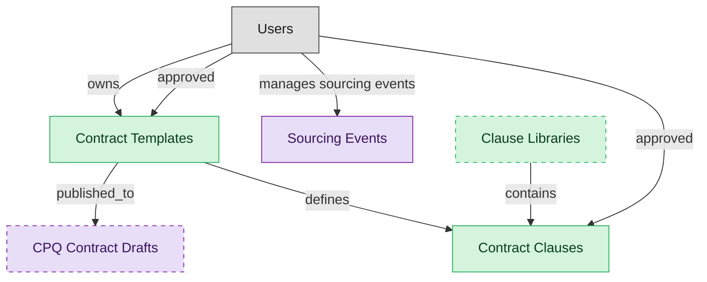

# Contract Authoring

## 1. Overview

Template-driven contract drafting with the approved clause library. Masters contract_templates and contract_clauses; produces draft legal_contracts that flow into CLM-NEGOTIATION. Realizes CLM-CONTRACT-AUTHORING and CLM-CLAUSE-LIBRARY-MGMT.

## 2. Entity summary

| Name | data_object | Description |
| --- | --- | --- |
| Clause Libraries | `clause_libraries` | A versioned, governed collection of approved contract clauses, often organized by jurisdiction or contract type, that authors draw from. |
| Contract Clauses | `contract_clauses` | Reusable clause library: preferred and fallback language for indemnification, IP, termination, SLA, payment terms, data-protection, AI-use, audit rights. Drives consistency in authoring and accelerates negotiation. |
| Contract Templates | `contract_templates` | Pre-approved drafts (NDA, MSA, DPA, SOW, order form) assembled from the clause library, used to author new contracts. Carries versioning, approval state, and risk-tier classification. |
| CPQ Contract Drafts | `contract_drafts` | Approved-quote handoff artifact; precursor to CLM `contracts`. CPQ owns the draft; CLM owns the signed contract + amendments. |
| Sourcing Events | `sourcing_events` | RFx process record: RFI, RFQ, RFP, or reverse auction. Carries scope, supplier list, scorecard / weighting, responses, and the awarded supplier. The pre-contract stage that produces a sourcing decision feeding CLM. |

## 3. Entities catalog

| # | data_object | canonical code | singular | plural | role | mastered in | mastered label | necessity | pattern flags | entity_type | write tier | notes |
| ---: | --- | --- | --- | --- | --- | --- | --- | --- | --- | --- | --- | --- |
| 1 | `clause_libraries` | `clause_libraries` | Clause Library | Clause Libraries | master | - | - | optional | - | catalog | `:admin` | - |
| 2 | `contract_clauses` | `contract_clauses` | Contract Clause | Contract Clauses | master | - | - | required | - | catalog | `:admin` | - |
| 3 | `contract_templates` | `contract_templates` | Contract Template | Contract Templates | master | - | - | required | - | catalog | `:admin` | - |
| 4 | `contract_drafts` | `contract_drafts` | CPQ Contract Draft | CPQ Contract Drafts | consumer | `cpq-approvals-contracts` | Approvals and Contract Drafts | optional | - | operational_workflow | `:manage` | - |
| 5 | `sourcing_events` | `sourcing_events` | Sourcing Event | Sourcing Events | consumer | - | - | required | - | operational_workflow | `:manage` | - |

## 4. Aliases and industry synonyms

_(none: no industry-scoped aliases for this scope)_

## 5. Relationships

### 5.1 Intra-scope edges

| from | verb | to | cardinality | kind | necessity | owner_side | delete_mode | fk_format | notes |
| --- | --- | --- | --- | --- | --- | --- | --- | --- | --- |
| `contract_templates` | defines | `contract_clauses` | one_to_many | composition | optional | source | cascade | parent | - |
| `contract_templates` | published_to | `contract_drafts` | one_to_many | reference | optional | source | clear | reference | - |
| `clause_libraries` | contains | `contract_clauses` | one_to_many | composition | optional | source | cascade | parent | - |

### 5.2 Built-in edges (`users` and other platform built-ins)

| from | verb | to | cardinality | necessity | owner_side | delete_mode | fk_format | notes |
| --- | --- | --- | --- | --- | --- | --- | --- | --- |
| `users` | manages sourcing events | `sourcing_events` | one_to_many | optional | source | clear | reference | - |
| `users` | owns | `contract_templates` | one_to_many | optional | source | clear | reference | - |
| `users` | approved | `contract_templates` | one_to_many | optional | source | clear | reference | - |
| `users` | approved | `contract_clauses` | one_to_many | optional | source | clear | reference | - |

### 5.3 Cross-scope edges

#### 5.3a Outbound from this scope's masters and contributors

_Edges this scope drives: the in-scope endpoint has `role` of `master` or `contributor`._

| from | verb | to | cardinality | necessity | delete_mode | fk_format | notes |
| --- | --- | --- | --- | --- | --- | --- | --- |
| `contract_templates` | seeds | `legal_contracts` | one_to_many | optional | none | n/a | - |
| `legal_contracts` | contains | `contract_clauses` | one_to_many | optional | none | n/a | - |
| `negotiation_playbooks` | defines positions for | `contract_clauses` | one_to_many | optional | none | n/a | - |

#### 5.3b Context edges on embedded shells and consumed entities

_Edges the canonical owner drives, shown for context: the in-scope endpoint has `role` of `embedded_master`, `consumer`, or `derived`._

| from | verb | to | cardinality | necessity | delete_mode | fk_format | notes |
| --- | --- | --- | --- | --- | --- | --- | --- |
| `sourcing_events` | originates | `legal_contracts` | one_to_many | optional | none | n/a | - |
| `contract_drafts` | drafts | `legal_contracts` | one_to_many | optional | none | n/a | - |
| `suppliers` | enables | `sourcing_events` | one_to_many | optional | none | n/a | - |

## 6. Cross-domain context

### 6.1 Master consumers (other modules / domains that embed this scope's masters)

_(none: no other module embeds this scope's masters; the canonical owners do.)_

### 6.2 Outbound handoffs (events this scope publishes)

| source module | target domain | target module | trigger_event | transition | payload | integration | friction | description |
| --- | --- | --- | --- | --- | --- | --- | --- | --- |
| CLM-AUTHORING | CPQ | CPQ-APPROVALS-CONTRACTS | `contract_template.published` | _(state_change)_ | `contract_templates` | api_call | medium | New approved template available to CPQ for contract-draft generation. |

### 6.3 Inbound handoffs (events this scope reacts to)

| target module | source domain | source module | trigger_event | transition | payload | integration | friction | description |
| --- | --- | --- | --- | --- | --- | --- | --- | --- |
| CLM-AUTHORING | CLM | CLM-NEGOTIATION | `contract_clause.flagged` | _(state_change)_ | `contract_clauses` | lifecycle_progression | medium | Clause flagged during negotiation (counterparty pushed back, non-standard language detected, missing protection) is routed back to the authoring/library team for review. Library team decides whether the flag warrants a new approved variant or a clarification on the existing clause. |
| CLM-AUTHORING | S2P | _(domain-level)_ | `sourcing_event.awarded` | _(state_change)_ | `sourcing_events` | event_stream | low | Award triggers contract drafting in CLM with the chosen supplier. |
| CLM-AUTHORING | CPQ | CPQ-APPROVALS-CONTRACTS | `contract_draft.generated` | _(state_change)_ | `contract_drafts` | api_call | medium | CPQ-generated contract draft handed off to CLM for clause assembly and signature routing. Friction when CPQ's term language doesn't match approved CLM templates. |

### 6.4 Master providers (modules / domains that own masters this scope embeds)

| data_object | role here | necessity | canonical owner(s) | slice notes |
| --- | --- | --- | --- | --- |
| `contract_drafts` | consumer | optional | CPQ-APPROVALS-CONTRACTS (CPQ) | - |
| `sourcing_events` | consumer | required | _(no canonical owner recorded)_ | - |

## 7. Lifecycle states

### `contract_clauses` (Contract Clause)

| order | state_name | initial? | terminal? | requires_permission? | derived gate | description |
| --- | --- | --- | --- | --- | --- | --- |
| 10 | `draft` | ✓ | - | - | - | Clause authored but not yet reviewed. Cannot be selected for new contracts. |
| 20 | `in_review` | - | - | - | - | Clause routed to the legal panel for review. |
| 30 | `approved` | - | - | ✓ | `clm-authoring:approve_contract_clause` | Clause approved for use in contract authoring. |
| 40 | `published` | - | - | - | - | Clause available in the library for selection by authors. Locked from edits; supersession requires a new version. |
| 50 | `deprecated` | - | ✓ | ✓ | `clm-authoring:deprecate_contract_clause` | Clause withdrawn from the library; existing contracts retain it but new authoring cannot select it. Terminal. |

### `contract_drafts` (CPQ Contract Draft)

_This scope holds `contract_drafts` as **consumer**; the canonical state machine is owned by `CPQ-APPROVALS-CONTRACTS`._

| order | state_name | initial? | terminal? | requires_permission? | derived gate | description |
| --- | --- | --- | --- | --- | --- | --- |
| 1 | `draft` | ✓ | - | - | - | Draft contract assembled from an approved quote. |
| 2 | `in_review` | - | - | - | - | Legal/desk review of clauses, terms, and exceptions. |
| 3 | `signed` | - | - | - | - | Counter-signatures collected from both parties. |
| 4 | `executed` | - | - | - | - | Contract effective and handed off to CLM/billing. |
| 5 | `expired` | - | ✓ | - | - | Contract term elapsed without renewal. |
| 6 | `terminated` | - | ✓ | - | - | Contract ended early by either party. |

### `contract_templates` (Contract Template)

| order | state_name | initial? | terminal? | requires_permission? | derived gate | description |
| --- | --- | --- | --- | --- | --- | --- |
| 10 | `draft` | ✓ | - | - | - | Template authored but not yet reviewed. Cannot be used for new contracts. |
| 20 | `in_review` | - | - | - | - | Template routed to the legal panel for review. |
| 30 | `approved` | - | - | ✓ | `clm-authoring:approve_contract_template` | Template approved for publication. |
| 40 | `published` | - | - | - | - | Template available in the library; authors can instantiate new contracts from it. Locked from edits. |
| 50 | `deprecated` | - | ✓ | ✓ | `clm-authoring:deprecate_contract_template` | Template withdrawn from the library; existing in-flight drafts retain it but new authoring cannot select it. Terminal. |

### `sourcing_events` (Sourcing Event)

_This scope holds `sourcing_events` as **consumer**; the canonical state machine is owned by _(no canonical master found)_._

| order | state_name | initial? | terminal? | requires_permission? | derived gate | description |
| --- | --- | --- | --- | --- | --- | --- |
| 1 | `draft` | ✓ | - | - | - | Sourcing event being scoped: requirements, supplier list, scorecard weighting. |
| 2 | `published` | - | - | - | - | Event released to invited suppliers; responses can now be collected. |
| 3 | `in_progress` | - | - | - | - | Suppliers are actively submitting responses or bids. |
| 4 | `bidding_closed` | - | - | - | - | Response window has closed; sourcing team is evaluating submissions. |
| 5 | `awarded` | - | ✓ | ✓ | - | Winning supplier selected; outcome feeds CLM contract creation. |
| 6 | `canceled` | - | ✓ | - | - | Event terminated without award. |

## 8. Permissions and business rules (derived)

### 8.1 Permissions

| permission | tier | description | included in `:admin`? |
| --- | --- | --- | --- |
| `clm-authoring:read` | baseline-read | Read access to every entity in the module | ✓ |
| `clm-authoring:manage` | baseline-manage | Edit operational records | ✓ |
| `clm-authoring:admin` | baseline-admin | Edit reference data and inherit every workflow gate below | - |
| `clm-authoring:approve_contract_clause` | workflow-gate (lifecycle) | Transition `contract_clauses` into state `approved` | ✓ |
| `clm-authoring:deprecate_contract_clause` | workflow-gate (lifecycle) | Transition `contract_clauses` into state `deprecated` | ✓ |
| `clm-authoring:approve_contract_template` | workflow-gate (lifecycle) | Transition `contract_templates` into state `approved` | ✓ |
| `clm-authoring:deprecate_contract_template` | workflow-gate (lifecycle) | Transition `contract_templates` into state `deprecated` | ✓ |

### 8.2 Business rules

_(none: no flag-derived business rules)_

## 9. Roles, RACI, and responsibilities (derived)

_Baseline roles, the permission hierarchy, and RACI realization are DERIVED from this scope's entity-type write tiers + `process_raci`; none of it is stored in the catalog (the deployer provisions it from this blueprint)._

### 9.1 `CLM-AUTHORING`

**Baseline roles:**

| role | baseline grant |
| --- | --- |
| `clm-authoring_viewer` | `clm-authoring:read` |
| `clm-authoring_manager` | `clm-authoring:manage` |
| `clm-authoring_admin` | `clm-authoring:admin` |

**Permission hierarchy:**

| permission | includes |
| --- | --- |
| `clm-authoring:admin` | `clm-authoring:manage` |
| `clm-authoring:manage` | `clm-authoring:read` |
| `clm-authoring:admin` | `clm-authoring:approve_contract_clause` |
| `clm-authoring:admin` | `clm-authoring:deprecate_contract_clause` |
| `clm-authoring:admin` | `clm-authoring:approve_contract_template` |
| `clm-authoring:admin` | `clm-authoring:deprecate_contract_template` |

**Processes wired:**

| process_key | process_name | PCF code | PCF ID | level | description |
| --- | --- | --- | --- | --- | --- |
| `provide_legal_advice_counseling` | Provide legal advice/counseling | 12.4.8 | 11051 | 3 | Providing legal advice concerning the substance or procedure of a law in relation to a particular situation. |

**RACI realization:**

| actor | kind | raci | process_key | realization |
| --- | --- | --- | --- | --- |
| `LEGAL-COUNSEL` | persona | responsible | `provide_legal_advice_counseling` | grant gates [clm-authoring:approve_contract_clause, clm-authoring:deprecate_contract_clause, clm-authoring:approve_contract_template, clm-authoring:deprecate_contract_template] + the gated entities' write tier |
| `CONTRACT-OPS-MANAGER` | persona | accountable | `provide_legal_advice_counseling` | approval gate |
| `CONTRACT-OPS-SPECIALIST` | persona | informed | `provide_legal_advice_counseling` | notification side effect (trigger_event / webhook_receiver) |

### 9.2 Functional ownership and default grants

| responsibility | business function | default role | default tier |
| --- | --- | --- | --- |
| owner | Contract Operations | `admin` | `:admin` |
| contributor | Procurement | `manage` | `:manage` |
| contributor | Sales | `manage` | `:manage` |
