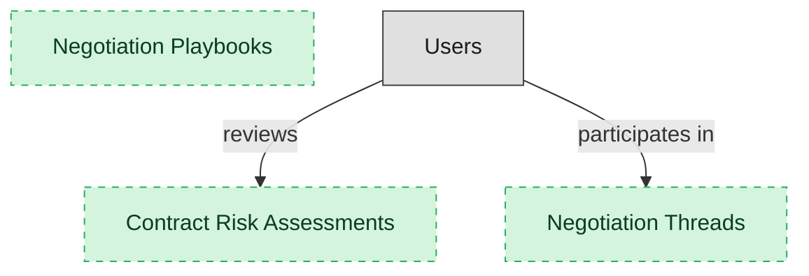

# Negotiation and Redlining

## 1. Overview

Track-changes negotiation with counterparty exchange, version comparison, and clause-risk detection. Consumes legal_contracts and contract_clauses; gates the in_negotiation -> approved lifecycle transition. Requires sign_document for signature workflow; coverage drops below 100% on the sign_document leg.

## 2. Entity summary

| Name | data_object | Description |
| --- | --- | --- |
| Contract Risk Assessments | `contract_risk_assessments` | A structured assessment of the legal or commercial risk in a contract or clause, produced during review and dispositioned by a reviewer. |
| Negotiation Playbooks | `negotiation_playbooks` | A set of negotiation rules and fallback positions that guide how clauses may be redlined and what concessions are pre-approved. |
| Negotiation Threads | `contract_negotiation_threads` | A structured thread of negotiation rounds and counterparty exchanges on a contract, separate from the clauses and the contract itself. |

## 3. Entities catalog

| # | data_object | canonical code | singular | plural | role | mastered in | mastered label | necessity | pattern flags | entity_type | write tier | notes |
| ---: | --- | --- | --- | --- | --- | --- | --- | --- | --- | --- | --- | --- |
| 1 | `contract_risk_assessments` | `contract_risk_assessments` | Contract Risk Assessment | Contract Risk Assessments | master | - | - | optional | - | operational_workflow | `:manage` | - |
| 2 | `negotiation_playbooks` | `negotiation_playbooks` | Negotiation Playbook | Negotiation Playbooks | master | - | - | optional | - | catalog | `:admin` | - |
| 3 | `contract_negotiation_threads` | `contract_negotiation_threads` | Negotiation Thread | Negotiation Threads | master | - | - | optional | - | operational_workflow | `:manage` | - |

## 4. Aliases and industry synonyms

_(none: no industry-scoped aliases for this scope)_

## 5. Relationships

### 5.1 Intra-scope edges

_(none: no relationships with both endpoints inside the scope)_

### 5.2 Built-in edges (`users` and other platform built-ins)

| from | verb | to | cardinality | necessity | owner_side | delete_mode | fk_format | notes |
| --- | --- | --- | --- | --- | --- | --- | --- | --- |
| `users` | reviews | `contract_risk_assessments` | one_to_many | optional | source | clear | reference | - |
| `users` | participates in | `contract_negotiation_threads` | one_to_many | optional | source | clear | reference | - |

### 5.3 Cross-scope edges

#### 5.3a Outbound from this scope's masters and contributors

_Edges this scope drives: the in-scope endpoint has `role` of `master` or `contributor`._

| from | verb | to | cardinality | necessity | delete_mode | fk_format | notes |
| --- | --- | --- | --- | --- | --- | --- | --- |
| `negotiation_playbooks` | defines positions for | `contract_clauses` | one_to_many | optional | none | n/a | - |
| `legal_contracts` | is assessed by | `contract_risk_assessments` | one_to_many | optional | none | n/a | - |
| `legal_contracts` | is negotiated in | `contract_negotiation_threads` | one_to_many | optional | none | n/a | - |

#### 5.3b Context edges on embedded shells and consumed entities

_Edges the canonical owner drives, shown for context: the in-scope endpoint has `role` of `embedded_master`, `consumer`, or `derived`._

_(none: no context cross-scope edges on this scope's embedded shells or consumed entities)_

## 6. Cross-domain context

### 6.1 Master consumers (other modules / domains that embed this scope's masters)

_(none: no other module embeds this scope's masters; the canonical owners do.)_

### 6.2 Outbound handoffs (events this scope publishes)

_(none: no outbound handoffs whose payload is in this scope)_

### 6.3 Inbound handoffs (events this scope reacts to)

_(none: no inbound handoffs whose payload is in this scope)_

### 6.4 Master providers (modules / domains that own masters this scope embeds)

_(none: this scope embeds no masters owned elsewhere; every entity is mastered here)_

## 7. Lifecycle states

### `contract_negotiation_threads` (Negotiation Thread)

| order | state_name | initial? | terminal? | requires_permission? | derived gate | description |
| --- | --- | --- | --- | --- | --- | --- |
| 10 | `open` | ✓ | - | - | - | - |
| 20 | `in_discussion` | - | - | - | - | - |
| 30 | `resolved` | - | ✓ | ✓ | `clm-negotiation:resolved_negotiation_thread` | - |
| 40 | `withdrawn` | - | ✓ | - | - | - |

### `contract_risk_assessments` (Contract Risk Assessment)

| order | state_name | initial? | terminal? | requires_permission? | derived gate | description |
| --- | --- | --- | --- | --- | --- | --- |
| 10 | `flagged` | ✓ | - | - | - | - |
| 20 | `under_review` | - | - | - | - | - |
| 30 | `accepted` | - | ✓ | ✓ | `clm-negotiation:accepted_contract_risk_assessment` | - |
| 40 | `mitigated` | - | ✓ | - | - | - |

## 8. Permissions and business rules (derived)

### 8.1 Permissions

| permission | tier | description | included in `:admin`? |
| --- | --- | --- | --- |
| `clm-negotiation:read` | baseline-read | Read access to every entity in the module | ✓ |
| `clm-negotiation:manage` | baseline-manage | Edit operational records | ✓ |
| `clm-negotiation:admin` | baseline-admin | Edit reference data and inherit every workflow gate below | - |
| `clm-negotiation:accepted_contract_risk_assessment` | workflow-gate (lifecycle) | Transition `contract_risk_assessments` into state `accepted` | ✓ |
| `clm-negotiation:resolved_negotiation_thread` | workflow-gate (lifecycle) | Transition `contract_negotiation_threads` into state `resolved` | ✓ |

### 8.2 Business rules

_(none: no flag-derived business rules)_

## 9. Roles, RACI, and responsibilities (derived)

_Baseline roles, the permission hierarchy, and RACI realization are DERIVED from this scope's entity-type write tiers + `process_raci`; none of it is stored in the catalog (the deployer provisions it from this blueprint)._

### 9.1 `CLM-NEGOTIATION`

**Baseline roles:**

| role | baseline grant |
| --- | --- |
| `clm-negotiation_viewer` | `clm-negotiation:read` |
| `clm-negotiation_manager` | `clm-negotiation:manage` |
| `clm-negotiation_admin` | `clm-negotiation:admin` |

**Permission hierarchy:**

| permission | includes |
| --- | --- |
| `clm-negotiation:admin` | `clm-negotiation:manage` |
| `clm-negotiation:manage` | `clm-negotiation:read` |
| `clm-negotiation:admin` | `clm-negotiation:accepted_contract_risk_assessment` |
| `clm-negotiation:admin` | `clm-negotiation:resolved_negotiation_thread` |

**RACI realization:**

_(none: no process_raci assignments wired to this module's gated processes yet)_

### 9.2 Functional ownership and default grants

| responsibility | business function | default role | default tier |
| --- | --- | --- | --- |
| owner | Contract Operations | `admin` | `:admin` |
| contributor | Procurement | `manage` | `:manage` |
| contributor | Sales | `manage` | `:manage` |
