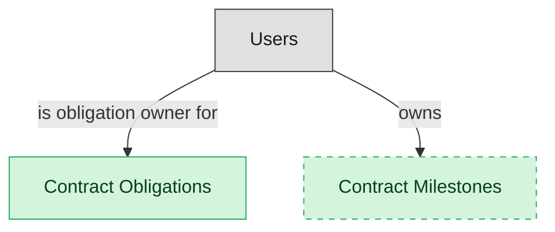

# Obligation Management

## 1. Overview

Register, tracking, and alerting for contract obligations (deliverables, SLA milestones, payment terms). Masters contract_obligations. Publishes obligation.due and obligation.breached events that fan out to OP-RES / GRC.

## 2. Entity summary

| Name | data_object | Description |
| --- | --- | --- |
| Contract Milestones | `contract_milestones` | Date-driven checkpoints in a contract, such as a delivery or review date, distinct from a deliverable obligation. |
| Contract Obligations | `contract_obligations` | Specific commitments extracted from a contract, such as performance, payment, delivery, or reporting, each with an owner and due date. |

## 3. Entities catalog

| # | data_object | canonical code | singular | plural | description | role | mastered in | mastered label | necessity | pattern flags | entity_type | write tier | notes |
| ---: | --- | --- | --- | --- | --- | --- | --- | --- | --- | --- | --- | --- | --- |
| 1 | `contract_milestones` | `contract_milestones` | Contract Milestone | Contract Milestones | A date-driven checkpoint in a contract (for example a delivery date or review date), distinct from a deliverable obligation. | master | - | - | optional | - | operational_workflow | `:manage` | - |
| 2 | `contract_obligations` | `contract_obligations` | Contract Obligation | Contract Obligations | Specific performance, payment, delivery, reporting, or compliance commitment extracted from a contract - each with its own owner, due date, and status. Post-signature obligation tracking is where contracts deliver (or fail to deliver) value. | master | - | - | required | - | operational_workflow | `:manage` | - |

## 4. Aliases and industry synonyms

_(none: no industry-scoped aliases for this scope)_

## 5. Relationships

### 5.1 Intra-scope edges

_(none: no relationships with both endpoints inside the scope)_

### 5.2 Built-in edges (`users` and other platform built-ins)

| from | verb | to | cardinality | necessity | owner_side | delete_mode | fk_format | notes |
| --- | --- | --- | --- | --- | --- | --- | --- | --- |
| `users` | is obligation owner for | `contract_obligations` | one_to_many | optional | source | clear | reference | - |
| `users` | owns | `contract_milestones` | one_to_many | optional | source | clear | reference | - |

### 5.3 Cross-scope edges

#### 5.3a Outbound from this scope's masters and contributors

_Edges this scope drives: the in-scope endpoint has `role` of `master` or `contributor`._

| from | verb | to | cardinality | necessity | delete_mode | fk_format | notes |
| --- | --- | --- | --- | --- | --- | --- | --- |
| `legal_contracts` | imposes | `contract_obligations` | one_to_many | required | ⚠ audit: required composed child out of scope | n/a | - |
| `contract_obligations` | breaches_into | `audit_issues` | one_to_many | optional | none | n/a | - |
| `contract_obligations` | alerts | `customer_cases` | one_to_many | optional | none | n/a | - |
| `project_billing_milestones` | updates | `contract_obligations` | one_to_many | optional | none | n/a | - |
| `legal_contracts` | has milestone | `contract_milestones` | one_to_many | optional | none | n/a | - |

#### 5.3b Context edges on embedded shells and consumed entities

_Edges the canonical owner drives, shown for context: the in-scope endpoint has `role` of `embedded_master`, `consumer`, or `derived`._

_(none: no context cross-scope edges on this scope's embedded shells or consumed entities)_

## 6. Cross-domain context

### 6.1 Master consumers (other modules / domains that embed this scope's masters)

_(none: no other module embeds this scope's masters; the canonical owners do.)_

### 6.2 Outbound handoffs (events this scope publishes)

| source module | target domain | target module | trigger_event | transition | payload | integration | friction | description |
| --- | --- | --- | --- | --- | --- | --- | --- | --- |
| CLM-OBLIGATION-MGMT | GRC | _(domain-level)_ | `contract_obligation.breached` | _(state_change)_ | `contract_obligations` | manual_handoff | high | Obligation breach creates a GRC issue. Often handled manually; structured breach data is rare. |
| CLM-OBLIGATION-MGMT | CSM | _(domain-level)_ | `contract_obligation.due` | _(lifecycle)_ | `contract_obligations` | event_stream | medium | Upcoming SLA or deliverable obligation alerted to CSM. |

### 6.3 Inbound handoffs (events this scope reacts to)

_(none: no inbound handoffs whose payload is in this scope)_

### 6.4 Master providers (modules / domains that own masters this scope embeds)

_(none: this scope embeds no masters owned elsewhere; every entity is mastered here)_

## 7. Lifecycle states

### `contract_milestones` (Contract Milestone)

| order | state_name | initial? | terminal? | requires_permission? | derived gate | description |
| --- | --- | --- | --- | --- | --- | --- |
| 10 | `pending` | ✓ | - | - | - | - |
| 20 | `reached` | - | ✓ | ✓ | `clm-obligation-mgmt:reached_contract_milestone` | - |
| 30 | `missed` | - | ✓ | - | - | - |

### `contract_obligations` (Contract Obligation)

| order | state_name | initial? | terminal? | requires_permission? | derived gate | description |
| --- | --- | --- | --- | --- | --- | --- |
| 10 | `open` | ✓ | - | - | - | Obligation extracted/created and registered. Awaiting work or due date. |
| 20 | `in_progress` | - | - | - | - | Obligation owner has acknowledged and is actively delivering against the obligation. |
| 30 | `due` | - | - | - | - | Due date has passed without closure. Alerts have been raised to the obligation owner; escalation pending. |
| 40 | `satisfied` | - | ✓ | ✓ | `clm-obligation-mgmt:close_contract_obligation` | Obligation has been fully delivered and accepted. Terminal positive outcome. |
| 50 | `breached` | - | ✓ | ✓ | `clm-obligation-mgmt:mark_obligation_breached` | Obligation has been formally declared breached. Triggers contract-level remedies. Terminal negative outcome. |
| 60 | `waived` | - | ✓ | ✓ | `clm-obligation-mgmt:waive_contract_obligation` | Obligation formally waived (counterparty release or internal forgiveness). Terminal. |

## 8. Permissions and business rules (derived)

### 8.1 Permissions

| permission | tier | description | included in `:admin`? |
| --- | --- | --- | --- |
| `clm-obligation-mgmt:read` | baseline-read | Read access to every entity in the module | ✓ |
| `clm-obligation-mgmt:manage` | baseline-manage | Edit operational records | ✓ |
| `clm-obligation-mgmt:admin` | baseline-admin | Edit reference data and inherit every workflow gate below | - |
| `clm-obligation-mgmt:close_contract_obligation` | workflow-gate (lifecycle) | Transition `contract_obligations` into state `satisfied` | ✓ |
| `clm-obligation-mgmt:mark_obligation_breached` | workflow-gate (lifecycle) | Transition `contract_obligations` into state `breached` | ✓ |
| `clm-obligation-mgmt:waive_contract_obligation` | workflow-gate (lifecycle) | Transition `contract_obligations` into state `waived` | ✓ |
| `clm-obligation-mgmt:reached_contract_milestone` | workflow-gate (lifecycle) | Transition `contract_milestones` into state `reached` | ✓ |

### 8.2 Business rules

_(none: no flag-derived business rules)_

## 9. Roles, RACI, and responsibilities (derived)

_Baseline roles, the permission hierarchy, and RACI realization are DERIVED from this scope's entity-type write tiers + `process_raci`; none of it is stored in the catalog (the deployer provisions it from this blueprint)._

### 9.1 `CLM-OBLIGATION-MGMT`

**Baseline roles:**

| role | baseline grant |
| --- | --- |
| `clm-obligation-mgmt_viewer` | `clm-obligation-mgmt:read` |
| `clm-obligation-mgmt_manager` | `clm-obligation-mgmt:manage` |

**Permission hierarchy:**

| permission | includes |
| --- | --- |
| `clm-obligation-mgmt:admin` | `clm-obligation-mgmt:manage` |
| `clm-obligation-mgmt:manage` | `clm-obligation-mgmt:read` |
| `clm-obligation-mgmt:admin` | `clm-obligation-mgmt:close_contract_obligation` |
| `clm-obligation-mgmt:admin` | `clm-obligation-mgmt:mark_obligation_breached` |
| `clm-obligation-mgmt:admin` | `clm-obligation-mgmt:waive_contract_obligation` |
| `clm-obligation-mgmt:admin` | `clm-obligation-mgmt:reached_contract_milestone` |

**Processes wired:**

| process_key | process_name | PCF code | PCF ID | level | description |
| --- | --- | --- | --- | --- | --- |
| `evaluate_enterprise_regulatory` | Evaluate enterprise regulatory and compliance obligations | 8.3.3.1 | 20722 | 4 | Evaluation of dynamic, strategic, and integrated approach to manage regulatory requirements and compliance obligations. |

**RACI realization:**

| actor | kind | raci | process_key | realization |
| --- | --- | --- | --- | --- |
| `CONTRACT-OPS-SPECIALIST` | persona | responsible | `evaluate_enterprise_regulatory` | grant gates [clm-obligation-mgmt:close_contract_obligation, clm-obligation-mgmt:mark_obligation_breached, clm-obligation-mgmt:waive_contract_obligation] + the gated entities' write tier |
| `CONTRACT-OPS-MANAGER` | persona | accountable | `evaluate_enterprise_regulatory` | approval gate |
| `LEGAL-COUNSEL` | persona | informed | `evaluate_enterprise_regulatory` | notification side effect (trigger_event / webhook_receiver) |

### 9.2 Functional ownership and default grants

| responsibility | business function | default role | default tier |
| --- | --- | --- | --- |
| owner | Contract Operations | `admin` | `:admin` |
| contributor | Procurement | `manage` | `:manage` |
| contributor | Sales | `manage` | `:manage` |
