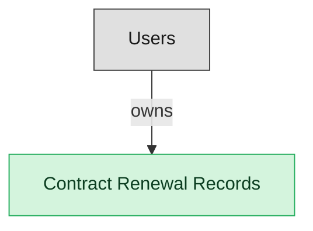

# Renewal Management

## 1. Overview

Date-based renewal alerting, auto-renewal-clause detection, and renewal execution. Consumes legal_contracts; publishes renewal.30_day_warning and legal_contract.renewed. Distinct from amendments which run through CLM-REPOSITORY.

## 2. Entity summary

| Name | data_object | Description |
| --- | --- | --- |
| Contract Renewal Records | `contract_renewal_records` | Records of a single renewal of an existing contract, capturing the renewed term, pricing, and outcome. |

## 3. Entities catalog

| # | data_object | canonical code | singular | plural | description | role | mastered in | mastered label | necessity | pattern flags | entity_type | write tier | notes |
| ---: | --- | --- | --- | --- | --- | --- | --- | --- | --- | --- | --- | --- | --- |
| 1 | `contract_renewal_records` | `contract_renewal_records` | Contract Renewal Record | Contract Renewal Records | A record of a single renewal of an existing contract, capturing the renewed term, pricing, and outcome distinct from the original agreement. | master | - | - | required | submit_lock | operational_workflow | `:manage` | - |

## 4. Aliases and industry synonyms

_(none: no industry-scoped aliases for this scope)_

## 5. Relationships

### 5.1 Intra-scope edges

_(none: no relationships with both endpoints inside the scope)_

### 5.2 Built-in edges (`users` and other platform built-ins)

| from | verb | to | cardinality | necessity | owner_side | delete_mode | fk_format | notes |
| --- | --- | --- | --- | --- | --- | --- | --- | --- |
| `users` | owns | `contract_renewal_records` | one_to_many | optional | source | clear | reference | - |

### 5.3 Cross-scope edges

#### 5.3a Outbound from this scope's masters and contributors

_Edges this scope drives: the in-scope endpoint has `role` of `master` or `contributor`._

| from | verb | to | cardinality | necessity | delete_mode | fk_format | notes |
| --- | --- | --- | --- | --- | --- | --- | --- |
| `legal_contracts` | is renewed by | `contract_renewal_records` | one_to_many | optional | none | n/a | - |

#### 5.3b Context edges on embedded shells and consumed entities

_Edges the canonical owner drives, shown for context: the in-scope endpoint has `role` of `embedded_master`, `consumer`, or `derived`._

_(none: no context cross-scope edges on this scope's embedded shells or consumed entities)_

## 6. Cross-domain context

### 6.1 Master consumers (other modules / domains that embed this scope's masters)

_(none: no other module embeds this scope's masters; the canonical owners do.)_

### 6.2 Outbound handoffs (events this scope publishes)

_(none: no outbound handoffs whose payload is in this scope)_

### 6.3 Inbound handoffs (events this scope reacts to)

_(none: no inbound handoffs whose payload is in this scope)_

### 6.4 Master providers (modules / domains that own masters this scope embeds)

_(none: this scope embeds no masters owned elsewhere; every entity is mastered here)_

## 7. Lifecycle states

### `contract_renewal_records` (Contract Renewal Record)

| order | state_name | initial? | terminal? | requires_permission? | derived gate | description |
| --- | --- | --- | --- | --- | --- | --- |
| 10 | `pending` | ✓ | - | - | - | - |
| 20 | `in_progress` | - | - | - | - | - |
| 30 | `renewed` | - | ✓ | ✓ | `clm-renewal:renewed_contract_renewal_record` | - |
| 40 | `lapsed` | - | ✓ | - | - | - |

## 8. Permissions and business rules (derived)

### 8.1 Permissions

| permission | tier | description | included in `:admin`? |
| --- | --- | --- | --- |
| `clm-renewal:read` | baseline-read | Read access to every entity in the module | ✓ |
| `clm-renewal:manage` | baseline-manage | Edit operational records | ✓ |
| `clm-renewal:admin` | baseline-admin | Edit reference data and inherit every workflow gate below | - |
| `clm-renewal:renewed_contract_renewal_record` | workflow-gate (lifecycle) | Transition `contract_renewal_records` into state `renewed` | ✓ |
| `clm-renewal:submit_contract_renewal_record` | override (submit_lock) | Submit and lock a `contract_renewal_records` row (post-submit edits gated) | ✓ |

### 8.2 Business rules

| rule_name | data_object | source flag | intent |
| --- | --- | --- | --- |
| `submit_restricted_to_contract_renewal_record_owner` | `contract_renewal_records` | has_submit_lock | Only the row's authoring user can submit; post-submit the row is read-only except via `clm-renewal:manage_all_contract_renewal_records` |

## 9. Roles, RACI, and responsibilities (derived)

_Baseline roles, the permission hierarchy, and RACI realization are DERIVED from this scope's entity-type write tiers + `process_raci`; none of it is stored in the catalog (the deployer provisions it from this blueprint)._

### 9.1 `CLM-RENEWAL`

**Baseline roles:**

| role | baseline grant |
| --- | --- |
| `clm-renewal_viewer` | `clm-renewal:read` |
| `clm-renewal_manager` | `clm-renewal:manage` |

**Permission hierarchy:**

| permission | includes |
| --- | --- |
| `clm-renewal:admin` | `clm-renewal:manage` |
| `clm-renewal:manage` | `clm-renewal:read` |
| `clm-renewal:admin` | `clm-renewal:renewed_contract_renewal_record` |
| `clm-renewal:admin` | `clm-renewal:submit_contract_renewal_record` |

**RACI realization:**

_(none: no process_raci assignments wired to this module's gated processes yet)_

### 9.2 Functional ownership and default grants

| responsibility | business function | default role | default tier |
| --- | --- | --- | --- |
| owner | Contract Operations | `admin` | `:admin` |
| contributor | Procurement | `manage` | `:manage` |
| contributor | Sales | `manage` | `:manage` |
