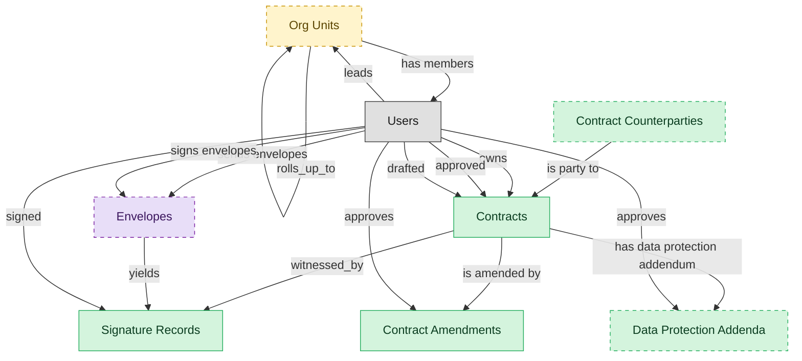

# Contract Repository

## 1. Overview

Executed-contract index. Masters legal_contracts (post-signature) and signature_records. Contributes terms to saas_subscriptions and software_licenses (the buyer-side records that consume contract terms). The system of record for the active, expired, renewed, and terminated lifecycle states.

## 2. Entity summary

| Name | data_object | Description |
| --- | --- | --- |
| Contract Amendments | `contract_amendments` | Formal changes to the terms of an executed contract, each tracked with its own approval and signature trail. |
| Contract Counterparties | `contract_counterparties` | External parties to a contract, held separately because a counterparty may not be a CRM account or supplier and may sign many contracts. |
| Contracts | `legal_contracts` | Contracts with counterparties or suppliers, covering type, value, key dates, governing law, and lifecycle from draft to terminated. |
| Data Protection Addenda | `data_protection_addenda` | Data processing addenda attached to contracts that govern how personal data is handled, each with its own approval and renewal cycle. |
| Signature Records | `signature_records` | E-signature envelopes with signing audit trail, IP addresses, provider references, and the signed document, one contract may have many. |
| Org Units | `org_units` | Nodes in the organizational hierarchy such as divisions, departments, and teams, with manager, cost center alignment, geographic scope, and parent-child links. |
| Envelopes | `envelopes` | E-signature transactions wrapping one or more signature requests against a document, tracked from created through completed, declined, or voided. |

## 3. Entities catalog

| # | data_object | canonical code | singular | plural | description | role | mastered in | mastered label | necessity | pattern flags | entity_type | write tier | notes |
| ---: | --- | --- | --- | --- | --- | --- | --- | --- | --- | --- | --- | --- | --- |
| 1 | `contract_amendments` | `contract_amendments` | Contract Amendment | Contract Amendments | A formal change to the terms of an executed contract, tracked as its own record with an approval and signature trail. | master | - | - | required | submit_lock | operational_workflow | `:manage` | - |
| 2 | `contract_counterparties` | `contract_counterparties` | Contract Counterparty | Contract Counterparties | The external party to a contract, held as its own record because a counterparty is not always a CRM account or supplier and may sign many contracts. | master | - | - | optional | personal_content | operational_record | `:manage` | - |
| 3 | `legal_contracts` | `legal_contracts` | Contract | Contracts | Canonical contract record: counterparty / supplier, contract type (MSA, SOW, NDA, DPA, subscription, lease), effective and expiry dates, total value, governing law, status (draft, in-negotiation, signed, active, expired, terminated). The most multi-mastered SaaS-related object - CLM owns the document, S2P and SMP contribute context. | master | - | - | required | personal_content, submit_lock | operational_workflow | `:manage` | - |
| 4 | `data_protection_addenda` | `data_protection_addenda` | Data Protection Addendum | Data Protection Addenda | A data processing addendum attached to a contract that governs how personal data is handled, with its own approval and renewal cycle. | master | - | - | optional | personal_content, submit_lock | operational_workflow | `:manage` | - |
| 5 | `signature_records` | `signature_records` | Signature Record | Signature Records | E-signature envelope: signing audit trail, IP addresses, external e-signature provider envelope and document reference IDs, and the signed PDF artifact. Distinct from contracts, one contract may have many signature events (counterpart, amendment, renewal). | master | - | - | required | personal_content, submit_lock | operational_workflow | `:manage` | - |
| 6 | `org_units` | `org_units` | Org Unit | Org Units | Node in the organizational hierarchy: division, business unit, department, team. Carries manager, cost center alignment, geographic scope, and parent/child relationships. HCM masters the operational hierarchy; EPM contributes the cost-center mapping (which would be Finance-mastered once a Finance/GL domain is loaded). | embedded_master | `hcm-org-positions` | Organization and Position Management | optional | - | operational_workflow | `:manage` | - |
| 7 | `envelopes` | `envelopes` | Envelope | Envelopes | An e-signature transaction wrapping one or more signature requests against a contract or document. Lifecycle: created → sent → in_progress → completed (or declined / voided / expired). Distinct from CLM's signature_records (the legal-side authoritative record of signed agreements); ESIGN's envelopes capture the e-sign-platform lifecycle while CLM consumes the completed result. | consumer | - | - | optional | submit_lock | operational_workflow | `:manage` | - |

## 4. Aliases and industry synonyms

_(none: no industry-scoped aliases for this scope)_

## 5. Relationships

### 5.1 Intra-scope edges

| from | verb | to | cardinality | kind | necessity | owner_side | delete_mode | fk_format | notes |
| --- | --- | --- | --- | --- | --- | --- | --- | --- | --- |
| `legal_contracts` | witnessed_by | `signature_records` | one_to_many | composition | required | source | cascade | parent | - |
| `envelopes` | yields | `signature_records` | one_to_many | reference | optional | source | clear | reference | - |
| `org_units` | rolls_up_to | `org_units` | one_to_many | reference | optional | source | clear | reference | - |
| `legal_contracts` | is amended by | `contract_amendments` | one_to_many | composition | optional | source | cascade | parent | - |
| `contract_counterparties` | is party to | `legal_contracts` | one_to_many | reference | optional | source | clear | reference | - |
| `legal_contracts` | has data protection addendum | `data_protection_addenda` | one_to_many | composition | optional | source | cascade | parent | - |

### 5.2 Built-in edges (`users` and other platform built-ins)

| from | verb | to | cardinality | necessity | owner_side | delete_mode | fk_format | notes |
| --- | --- | --- | --- | --- | --- | --- | --- | --- |
| `users` | sends envelopes | `envelopes` | one_to_many | optional | source | clear | reference | - |
| `users` | signs envelopes | `envelopes` | one_to_many | optional | source | clear | reference | - |
| `users` | owns | `legal_contracts` | one_to_many | optional | source | clear | reference | - |
| `users` | approved | `legal_contracts` | one_to_many | optional | source | clear | reference | - |
| `users` | drafted | `legal_contracts` | one_to_many | optional | source | clear | reference | - |
| `users` | signed | `signature_records` | one_to_many | optional | source | clear | reference | - |
| `users` | leads | `org_units` | one_to_many | optional | source | clear | reference | - |
| `org_units` | has members | `users` | one_to_many | optional | target | clear | reference | - |
| `users` | approves | `contract_amendments` | one_to_many | optional | source | clear | reference | - |
| `users` | approves | `data_protection_addenda` | one_to_many | optional | source | clear | reference | - |

### 5.3 Cross-scope edges

#### 5.3a Outbound from this scope's masters and contributors

_Edges this scope drives: the in-scope endpoint has `role` of `master` or `contributor`._

| from | verb | to | cardinality | necessity | delete_mode | fk_format | notes |
| --- | --- | --- | --- | --- | --- | --- | --- |
| `in_house_legal_matters` | references | `legal_contracts` | many_to_many | optional | none | n/a | - |
| `legal_contracts` | governs | `customer_entitlements` | one_to_many | optional | none | n/a | - |
| `legal_contracts` | backs | `customer_subscriptions` | one_to_many | optional | none | n/a | - |
| `contract_templates` | seeds | `legal_contracts` | one_to_many | optional | none | n/a | - |
| `legal_contracts` | contains | `contract_clauses` | one_to_many | optional | none | n/a | - |
| `legal_contracts` | imposes | `contract_obligations` | one_to_many | required | ⚠ audit: required composed child out of scope | n/a | - |
| `legal_contracts` | activates | `saas_subscriptions` | one_to_many | optional | none | n/a | - |
| `legal_contracts` | activates | `software_licenses` | one_to_many | optional | none | n/a | - |
| `sourcing_events` | originates | `legal_contracts` | one_to_many | optional | none | n/a | - |
| `legal_contracts` | triggers_creation_of | `purchase_orders` | one_to_many | optional | none | n/a | - |
| `legal_contracts` | triggers_review_in | `purchase_requisitions` | one_to_many | optional | none | n/a | - |
| `legal_contracts` | propagates_terms_to | `invoice_matches` | one_to_many | optional | none | n/a | - |
| `legal_contracts` | feeds_revrec_in | `revenue_recognition_records` | one_to_many | optional | none | n/a | - |
| `legal_contracts` | seeds | `service_projects` | one_to_many | optional | none | n/a | - |
| `legal_contracts` | renewal_warns | `crm_opportunities` | one_to_many | optional | none | n/a | - |
| `legal_contracts` | renewal_warns | `saas_subscriptions` | one_to_many | optional | none | n/a | - |
| `legal_contracts` | renewed_into | `customer_subscriptions` | one_to_many | optional | none | n/a | - |
| `legal_contracts` | seeds | `agency_jobs` | one_to_many | optional | none | n/a | - |
| `crm_opportunities` | drafts | `legal_contracts` | one_to_many | optional | none | n/a | - |
| `sales_quotes` | drafts | `legal_contracts` | one_to_many | optional | none | n/a | - |
| `contract_drafts` | drafts | `legal_contracts` | one_to_many | optional | none | n/a | - |
| `quote_discounts` | flows into | `legal_contracts` | one_to_many | optional | none | n/a | - |
| `commercial_leases` | flows into | `legal_contracts` | one_to_many | optional | none | n/a | - |
| `engagement_letters` | flows into | `legal_contracts` | one_to_many | optional | none | n/a | - |
| `legal_contracts` | is renewed by | `contract_renewal_records` | one_to_many | optional | none | n/a | - |
| `legal_contracts` | is assessed by | `contract_risk_assessments` | one_to_many | optional | none | n/a | - |
| `legal_contracts` | has milestone | `contract_milestones` | one_to_many | optional | none | n/a | - |
| `legal_contracts` | is negotiated in | `contract_negotiation_threads` | one_to_many | optional | none | n/a | - |

#### 5.3b Context edges on embedded shells and consumed entities

_Edges the canonical owner drives, shown for context: the in-scope endpoint has `role` of `embedded_master`, `consumer`, or `derived`._

| from | verb | to | cardinality | necessity | delete_mode | fk_format | notes |
| --- | --- | --- | --- | --- | --- | --- | --- |
| `org_units` | groups | `employees` | one_to_many | required | none (required-if-present) | n/a | - |
| `org_units` | contains | `hcm_positions` | one_to_many | required | none (required-if-present) | n/a | - |
| `cost_centers` | funds | `org_units` | one_to_many | required | none (required-if-present) | n/a | - |
| `org_units` | engages | `contingent_workers` | one_to_many | optional | none | n/a | - |
| `org_units` | is_scored_by | `engagement_drivers` | one_to_many | optional | none | n/a | - |
| `org_units` | is_measured_by | `people_kpis` | one_to_many | optional | none | n/a | - |
| `org_units` | triggers | `iga_entitlement_definitions` | one_to_many | optional | none | n/a | - |
| `org_units` | maps_to | `cost_centers` | one_to_one | optional | none | n/a | - |
| `org_units` | sponsors | `compliance_assignments` | one_to_many | optional | none | n/a | - |
| `org_units` | sponsors | `benefit_plans` | many_to_many | optional | none | n/a | - |
| `survey_campaigns` | targets | `org_units` | many_to_many | optional | none | n/a | - |
| `org_units` | owns | `action_plans` | one_to_many | optional | none | n/a | - |

## 6. Cross-domain context

### 6.1 Master consumers (other modules / domains that embed this scope's masters)

| data_object | other module / domain | role | necessity | notes |
| --- | --- | --- | --- | --- |
| `legal_contracts` | AGENCY-MGMT-JOB-TRAFFIC (Job and Traffic Management) - AGENCY-MGMT | consumer | required | - |
| `legal_contracts` | CRM-PIPELINE-MGT (Opportunity and Pipeline Management) - CRM | consumer | optional | - |
| `legal_contracts` | CSM-ENTITLEMENTS (Entitlements and SLA Management) - CSM | contributor | required | - |
| `legal_contracts` | PSA-PROJECT-DELIVERY (Project Delivery) - PSA | consumer | required | - |
| `legal_contracts` | REAL-ESTATE-AGENT (Real Estate Agent (solo / small firm bundle)) - REAL-ESTATE-AGENT | embedded_master | required | - |
| `legal_contracts` | SAM-ENTITLEMENT-MGMT (Entitlement Reconciliation and Renewal) - SAM | embedded_master | optional | - |
| `legal_contracts` | SMP-RENEWAL-VENDOR (SMP Renewal and Vendor Management) - SMP | embedded_master | optional | - |
| `signature_records` | LMS-COMPLIANCE-TRAINING (Compliance Training) - LMS | embedded_master | required | - |
| `signature_records` | TRAINING-RECORDS-STARTER (Training Records (Compliance Documentation Starter)) - LMS | embedded_master | required | - |

### 6.2 Outbound handoffs (events this scope publishes)

| source module | target domain | target module | trigger_event | transition | payload | integration | friction | description |
| --- | --- | --- | --- | --- | --- | --- | --- | --- |
| CLM-REPOSITORY | CLM | CLM-OBLIGATION-MGMT | `legal_contract.signed` | `signed` _(lifecycle)_ | `legal_contracts` | lifecycle_progression | low | - |
| CLM-REPOSITORY | CLM | CLM-RENEWAL | `legal_contract.active` | _(state_change)_ | `legal_contracts` | lifecycle_progression | low | - |
| CLM-REPOSITORY | S2P | _(domain-level)_ | `legal_contract.expired` | `active` → `expired` _(lifecycle)_ | `legal_contracts` | batch_sync | medium | Expired contracts trigger procurement renewal-decision workflow. Failure modes: auto-renewal clauses missed; silent expiry of long-tail contracts. |
| CLM-REPOSITORY | AP-AUTO | _(domain-level)_ | `legal_contract.amended` | `amended` _(state_change)_ | `legal_contracts` | api_call | medium | Contract amendments propagate to AP-AUTO: updated payment terms, discount schedule, GL coding. Failure modes: retroactive amendments require recalculating already-paid invoices. |
| HCM-ORG-POSITIONS | IGA | IGA-ACCESS-REQUEST | `org_unit.created` | _(state_change)_ | `org_units` | event_stream | medium | New org unit drives IGA group/role provisioning. Group-name conventions and ownership must be encoded; otherwise orphan groups proliferate. |
| HCM-ORG-POSITIONS | IGA | IGA-ACCESS-REQUEST | `org_unit.disbanded` | _(state_change)_ | `org_units` | event_stream | high | Org-unit disbandment requires IGA group cleanup; orphan-group risk if employees re-assigned slowly. |
| HCM-ORG-POSITIONS | IGA | IGA-ACCESS-REQUEST | `org_unit.merged` | _(state_change)_ | `org_units` | event_stream | high | Org-unit merge consolidates IGA groups: members migrate, entitlements deduplicated, SoD revalidated. Often runs as a batch project rather than event. |
| HCM-ORG-POSITIONS | HCM | HCM-CORE-WORKER | `org_unit.disbanded` | _(state_change)_ | `org_units` | lifecycle_progression | high | Disbanded org unit requires every incumbent employee to be re-placed before close; worker-record module blocks the close until reassignment completes. |
| HCM-ORG-POSITIONS | HCM | HCM-CORE-WORKER | `org_unit.merged` | _(state_change)_ | `org_units` | lifecycle_progression | medium | Org-unit consolidation cascades employee re-assignment, manager and dotted-line reassignment, and reporting-line recompute on the worker record. |
| HCM-ORG-POSITIONS | ATS | ATS-RECRUITMENT-PIPELINE | `org_unit.activated` | _(state_change)_ | `org_units` | api_call | low | - |
| HCM-ORG-POSITIONS | ATS | ATS-RECRUITMENT-PIPELINE | `org_unit.closed` | _(state_change)_ | `org_units` | api_call | high | - |
| HCM-ORG-POSITIONS | ATS | ATS-RECRUITMENT-PIPELINE | `org_unit.created` | _(state_change)_ | `org_units` | api_call | medium | - |
| HCM-ORG-POSITIONS | ATS | ATS-RECRUITMENT-PIPELINE | `org_unit.disbanded` | _(state_change)_ | `org_units` | api_call | high | - |
| HCM-ORG-POSITIONS | ATS | ATS-RECRUITMENT-PIPELINE | `org_unit.merged` | _(state_change)_ | `org_units` | api_call | high | - |
| HCM-ORG-POSITIONS | ATS | ATS-RECRUITMENT-PIPELINE | `org_unit.reorganized` | _(state_change)_ | `org_units` | api_call | high | - |
| CLM-REPOSITORY | FIN | _(domain-level)_ | `legal_contract.signed` | `signed` _(lifecycle)_ | `legal_contracts` | api_call | medium | Signed contract feeds ERP-FIN payment terms and rev-rec rules. Friction in extracting structured terms from contract text. |
| HCM-ORG-POSITIONS | FIN | _(domain-level)_ | `org_unit.created` | _(state_change)_ | `org_units` | api_call | medium | New org unit usually maps to cost-center; ERP-FIN must reflect the structure for budgeting and labor allocation. |
| CLM-REPOSITORY | PSA | PSA-PROJECT-DELIVERY | `legal_contract.signed` | `signed` _(lifecycle)_ | `legal_contracts` | api_call | medium | Signed SOW seeds PSA project scope, billing terms, and milestone schedule. Deviations between contract terms and operational project structure require manual reconciliation. |
| CLM-REPOSITORY | SUB-MGMT | _(domain-level)_ | `legal_contract.signed` | `signed` _(lifecycle)_ | `legal_contracts` | api_call | medium | Signed contract triggers SUB-MGMT to activate the subscription record. |

### 6.3 Inbound handoffs (events this scope reacts to)

| target module | source domain | source module | trigger_event | transition | payload | integration | friction | description |
| --- | --- | --- | --- | --- | --- | --- | --- | --- |
| CLM-REPOSITORY | CLM | CLM-NEGOTIATION | `legal_contract.approved` | _(state_change)_ | `legal_contracts` | lifecycle_progression | low | - |
| CLM-REPOSITORY | CLM | CLM-NEGOTIATION | `signature_record.completed` | _(state_change)_ | `signature_records` | lifecycle_progression | low | Signature envelope completion in negotiation hands the executed envelope to the repository for persistence. Intra-domain lifecycle progression; the signed document gets indexed and the linked legal_contract transitions out_for_signature -> signed. |
| CLM-REPOSITORY | CLM | CLM-RENEWAL | `legal_contract.renewed` | _(state_change)_ | `legal_contracts` | lifecycle_progression | low | - |
| CLM-REPOSITORY | S2P | _(domain-level)_ | `sourcing.contract_drafted` | _(state_change)_ | `legal_contracts` | api_call | medium | Sourcing decision in S2P hands off to CLM to author the contract. Friction sits in clause selection, redline coordination with the counterparty, and the legal-review loop with LSD. |
| CLM-REPOSITORY | CPQ | CPQ-QUOTE-BUILDER | `quote.accepted` | `accepted` _(state_change)_ | `legal_contracts` | api_call | medium | Accepted quote hands off to CLM for contract authoring - pulls in clause language, populates the agreed terms, routes for signature. |
| CLM-REPOSITORY | SMP | SMP-RENEWAL-VENDOR | `renewal.30_day_warning` | _(threshold)_ | `legal_contracts` | api_call | low | SMP's renewal-watch surfaces a 30-day expiry warning to CLM so the contract document workflow (amendment, renegotiation) can start in time. |
| CLM-REPOSITORY | ESIGN | _(domain-level)_ | `envelope.completed` | `in_progress` → `completed` _(lifecycle)_ | `envelopes` | api_call | low | Completed e-signature envelopes flow into CLM as authoritative signature_records. Failure modes: identity-of-signer verification gaps; multi-party-signing edge cases. |
| CLM-REPOSITORY | AGENCY-MGMT | AGENCY-MGMT-JOB-TRAFFIC | `estimate.approved` | `pending` → `approved` _(lifecycle)_ | `legal_contracts` | api_call | medium | Client-approved estimate must be converted into a signed SOW in CLM before delivery can start. Includes line-item scope, billing terms, deliverable schedule, and approval routing. |

### 6.4 Master providers (modules / domains that own masters this scope embeds)

| data_object | role here | necessity | canonical owner(s) | slice notes |
| --- | --- | --- | --- | --- |
| `org_units` | embedded_master | optional | HCM-ORG-POSITIONS (HCM) | - |
| `envelopes` | consumer | optional | _(no canonical owner recorded)_ | - |

## 7. Lifecycle states

### `contract_amendments` (Contract Amendment)

| order | state_name | initial? | terminal? | requires_permission? | derived gate | description |
| --- | --- | --- | --- | --- | --- | --- |
| 10 | `drafting` | ✓ | - | - | - | - |
| 20 | `in_review` | - | - | - | - | - |
| 30 | `approved` | - | - | ✓ | `clm-repository:approved_contract_amendment` | - |
| 40 | `executed` | - | ✓ | ✓ | `clm-repository:executed_contract_amendment` | - |

### `data_protection_addenda` (Data Protection Addendum)

| order | state_name | initial? | terminal? | requires_permission? | derived gate | description |
| --- | --- | --- | --- | --- | --- | --- |
| 10 | `drafting` | ✓ | - | - | - | - |
| 20 | `active` | - | - | ✓ | `clm-repository:active_data_protection_addendum` | - |
| 30 | `expired` | - | ✓ | - | - | - |

### `envelopes` (Envelope)

_This scope holds `envelopes` as **consumer**; the canonical state machine is owned by _(no canonical master found)_._

| order | state_name | initial? | terminal? | requires_permission? | derived gate | description |
| --- | --- | --- | --- | --- | --- | --- |
| 1 | `draft` | ✓ | - | - | - | Envelope being assembled with documents, recipients, and signature fields. |
| 2 | `sent` | - | - | ✓ | - | Envelope dispatched to recipients; contents locked from further edits. |
| 3 | `delivered` | - | - | - | - | First recipient has opened the envelope; signing has not yet begun. |
| 4 | `partially_signed` | - | - | - | - | One or more, but not all, required signers have completed signing. |
| 5 | `completed` | - | ✓ | - | - | All required signers have signed; envelope is the authoritative signed artifact. |
| 6 | `declined` | - | ✓ | - | - | A signer declined to sign; envelope cannot complete. |
| 7 | `voided` | - | ✓ | ✓ | - | Sender voided the envelope before completion. |
| 8 | `expired` | - | ✓ | - | - | Envelope passed its signing deadline without completion. |

### `legal_contracts` (Contract)

| order | state_name | initial? | terminal? | requires_permission? | derived gate | description |
| --- | --- | --- | --- | --- | --- | --- |
| 10 | `draft` | ✓ | - | - | - | Initial draft created in CLM-AUTHORING from a template, or received via inbound handoff from CPQ/sourcing. |
| 20 | `in_review` | - | - | - | - | Draft has been routed for internal review prior to counterparty exchange. |
| 30 | `in_negotiation` | - | - | - | - | Active counterparty negotiation with track-changes / redline exchange. |
| 40 | `approved` | - | - | ✓ | `clm-negotiation:approve_legal_contract` | Final negotiated text approved by all internal stakeholders; ready for signature. |
| 50 | `out_for_signature` | - | - | - | - | Signature envelope dispatched to all required signers. |
| 60 | `signed` | - | - | ✓ | `clm-repository:execute_legal_contract` | All signers have signed; contract is fully executed. |
| 70 | `active` | - | - | - | - | Effective date has passed; contract is in force. Default post-signature state. |
| 75 | `amended` | - | - | ✓ | `clm-repository:amend_legal_contract` | An amendment has been executed against this contract. Amendment is a separate record; this contract row reflects the amended terms going forward. |
| 80 | `expired` | - | ✓ | - | - | End date passed without renewal or termination. Terminal state. |
| 90 | `terminated` | - | ✓ | ✓ | `clm-repository:terminate_legal_contract` | Contract terminated before end date (by mutual consent, breach, or for-cause). Terminal state. |
| 100 | `renewed` | - | ✓ | ✓ | `clm-renewal:renew_legal_contract` | Renewed via a new contract record (or extended via amendment). The renewal is a separate record; this row is terminal. |

### `org_units` (Org Unit)

_This scope holds `org_units` as **embedded_master**; the canonical state machine is owned by `HCM-ORG-POSITIONS`._

| order | state_name | initial? | terminal? | requires_permission? | derived gate | description |
| --- | --- | --- | --- | --- | --- | --- |
| 1 | `draft` | ✓ | - | - | - | Org unit defined as part of a future structure; not yet operational. |
| 2 | `active` | - | - | ✓ | `clm-repository:active_org_unit` | Operational unit; carries headcount, cost-center linkage, and reporting lines. |
| 3 | `reorganized` | - | ✓ | ✓ | `clm-repository:reorganized_org_unit` | Unit folded into or replaced by a new structure; references remain for history. |
| 4 | `closed` | - | ✓ | ✓ | `clm-repository:closed_org_unit` | Unit dissolved; no employees or positions reside in it. |

### `signature_records` (Signature Record)

| order | state_name | initial? | terminal? | requires_permission? | derived gate | description |
| --- | --- | --- | --- | --- | --- | --- |
| 10 | `pending` | ✓ | - | - | - | Signature envelope created but not yet dispatched. |
| 20 | `sent` | - | - | - | - | Envelope dispatched to first signer(s); awaiting first signature. |
| 30 | `in_progress` | - | - | - | - | One or more signers have signed; others remain. |
| 40 | `completed` | - | ✓ | - | - | All required signers have signed. The signed contract document is persisted. Terminal positive outcome. |
| 50 | `declined` | - | ✓ | - | - | A signer declined to sign. Envelope is terminal; a new envelope can be created if negotiation re-opens. |
| 60 | `voided` | - | ✓ | ✓ | `clm-repository:void_signature_record` | Sender voided the envelope before all signers completed. Terminal. |

## 8. Permissions and business rules (derived)

### 8.1 Permissions

| permission | tier | description | included in `:admin`? |
| --- | --- | --- | --- |
| `clm-repository:read` | baseline-read | Read access to every entity in the module | ✓ |
| `clm-repository:manage` | baseline-manage | Edit operational records | ✓ |
| `clm-repository:admin` | baseline-admin | Edit reference data and inherit every workflow gate below | - |
| `clm-repository:active_org_unit` | workflow-gate (lifecycle) | Transition `org_units` into state `active` | ✓ |
| `clm-repository:reorganized_org_unit` | workflow-gate (lifecycle) | Transition `org_units` into state `reorganized` | ✓ |
| `clm-repository:closed_org_unit` | workflow-gate (lifecycle) | Transition `org_units` into state `closed` | ✓ |
| `clm-repository:execute_legal_contract` | workflow-gate (lifecycle) | Transition `legal_contracts` into state `signed` | ✓ |
| `clm-repository:amend_legal_contract` | workflow-gate (lifecycle) | Transition `legal_contracts` into state `amended` | ✓ |
| `clm-repository:terminate_legal_contract` | workflow-gate (lifecycle) | Transition `legal_contracts` into state `terminated` | ✓ |
| `clm-repository:void_signature_record` | workflow-gate (lifecycle) | Transition `signature_records` into state `voided` | ✓ |
| `clm-repository:approved_contract_amendment` | workflow-gate (lifecycle) | Transition `contract_amendments` into state `approved` | ✓ |
| `clm-repository:executed_contract_amendment` | workflow-gate (lifecycle) | Transition `contract_amendments` into state `executed` | ✓ |
| `clm-repository:active_data_protection_addendum` | workflow-gate (lifecycle) | Transition `data_protection_addenda` into state `active` | ✓ |
| `clm-repository:view_all_contracts` | override (personal_content) | View all `legal_contracts` rows beyond row-scope | ✓ |
| `clm-repository:manage_all_contracts` | override (personal_content) | Manage all `legal_contracts` rows beyond row-scope | ✓ |
| `clm-repository:submit_contract` | override (submit_lock) | Submit and lock a `legal_contracts` row (post-submit edits gated) | ✓ |
| `clm-repository:view_all_signature_records` | override (personal_content) | View all `signature_records` rows beyond row-scope | ✓ |
| `clm-repository:manage_all_signature_records` | override (personal_content) | Manage all `signature_records` rows beyond row-scope | ✓ |
| `clm-repository:submit_signature_record` | override (submit_lock) | Submit and lock a `signature_records` row (post-submit edits gated) | ✓ |
| `clm-repository:submit_contract_amendment` | override (submit_lock) | Submit and lock a `contract_amendments` row (post-submit edits gated) | ✓ |
| `clm-repository:view_all_contract_counterparties` | override (personal_content) | View all `contract_counterparties` rows beyond row-scope | ✓ |
| `clm-repository:manage_all_contract_counterparties` | override (personal_content) | Manage all `contract_counterparties` rows beyond row-scope | ✓ |
| `clm-repository:view_all_data_protection_addenda` | override (personal_content) | View all `data_protection_addenda` rows beyond row-scope | ✓ |
| `clm-repository:manage_all_data_protection_addenda` | override (personal_content) | Manage all `data_protection_addenda` rows beyond row-scope | ✓ |
| `clm-repository:submit_data_protection_addendum` | override (submit_lock) | Submit and lock a `data_protection_addenda` row (post-submit edits gated) | ✓ |

### 8.2 Business rules

| rule_name | data_object | source flag | intent |
| --- | --- | --- | --- |
| `contract_edit_scope` | `legal_contracts` | has_personal_content | Row-scope by default; override via `clm-repository:view_all_contracts` / `clm-repository:manage_all_contracts` |
| `submit_restricted_to_contract_owner` | `legal_contracts` | has_submit_lock | Only the row's authoring user can submit; post-submit the row is read-only except via `clm-repository:manage_all_contracts` |
| `signature_record_edit_scope` | `signature_records` | has_personal_content | Row-scope by default; override via `clm-repository:view_all_signature_records` / `clm-repository:manage_all_signature_records` |
| `submit_restricted_to_signature_record_owner` | `signature_records` | has_submit_lock | Only the row's authoring user can submit; post-submit the row is read-only except via `clm-repository:manage_all_signature_records` |
| `submit_restricted_to_contract_amendment_owner` | `contract_amendments` | has_submit_lock | Only the row's authoring user can submit; post-submit the row is read-only except via `clm-repository:manage_all_contract_amendments` |
| `contract_counterparty_edit_scope` | `contract_counterparties` | has_personal_content | Row-scope by default; override via `clm-repository:view_all_contract_counterparties` / `clm-repository:manage_all_contract_counterparties` |
| `data_protection_addendum_edit_scope` | `data_protection_addenda` | has_personal_content | Row-scope by default; override via `clm-repository:view_all_data_protection_addenda` / `clm-repository:manage_all_data_protection_addenda` |
| `submit_restricted_to_data_protection_addendum_owner` | `data_protection_addenda` | has_submit_lock | Only the row's authoring user can submit; post-submit the row is read-only except via `clm-repository:manage_all_data_protection_addenda` |

## 9. Roles, RACI, and responsibilities (derived)

_Baseline roles, the permission hierarchy, and RACI realization are DERIVED from this scope's entity-type write tiers + `process_raci`; none of it is stored in the catalog (the deployer provisions it from this blueprint)._

### 9.1 `CLM-REPOSITORY`

**Baseline roles:**

| role | baseline grant |
| --- | --- |
| `clm-repository_viewer` | `clm-repository:read` |
| `clm-repository_manager` | `clm-repository:manage` |

**Permission hierarchy:**

| permission | includes |
| --- | --- |
| `clm-repository:admin` | `clm-repository:manage` |
| `clm-repository:manage` | `clm-repository:read` |
| `clm-repository:admin` | `clm-repository:active_org_unit` |
| `clm-repository:admin` | `clm-repository:reorganized_org_unit` |
| `clm-repository:admin` | `clm-repository:closed_org_unit` |
| `clm-repository:admin` | `clm-repository:execute_legal_contract` |
| `clm-repository:admin` | `clm-repository:amend_legal_contract` |
| `clm-repository:admin` | `clm-repository:terminate_legal_contract` |
| `clm-repository:admin` | `clm-repository:void_signature_record` |
| `clm-repository:admin` | `clm-repository:approved_contract_amendment` |
| `clm-repository:admin` | `clm-repository:executed_contract_amendment` |
| `clm-repository:admin` | `clm-repository:active_data_protection_addendum` |
| `clm-repository:admin` | `clm-repository:view_all_contracts` |
| `clm-repository:admin` | `clm-repository:manage_all_contracts` |
| `clm-repository:admin` | `clm-repository:submit_contract` |
| `clm-repository:admin` | `clm-repository:view_all_signature_records` |
| `clm-repository:admin` | `clm-repository:manage_all_signature_records` |
| `clm-repository:admin` | `clm-repository:submit_signature_record` |
| `clm-repository:admin` | `clm-repository:submit_contract_amendment` |
| `clm-repository:admin` | `clm-repository:view_all_contract_counterparties` |
| `clm-repository:admin` | `clm-repository:manage_all_contract_counterparties` |
| `clm-repository:admin` | `clm-repository:view_all_data_protection_addenda` |
| `clm-repository:admin` | `clm-repository:manage_all_data_protection_addenda` |
| `clm-repository:admin` | `clm-repository:submit_data_protection_addendum` |

**Processes wired:**

| process_key | process_name | PCF code | PCF ID | level | description |
| --- | --- | --- | --- | --- | --- |
| `create_organizational_design` | Create organizational design | 1.2.5 | 10041 | 3 | Formulating a design for the organization's resources that allow it to meet its objectives. Develop a new framework for molding the organization's various processes into a coherent and seamless whole. |
| `conduct_organization` | Conduct organization restructuring opportunities | 1.1.5 | 16792 | 3 | Examining the scope and contingencies for restructuring based on market situation and internal realities. Map the market forces over which any and all probabilities can be probed for utility and viability. Once the restructuring options have been analyzed and the due-diligence performed, execute the deal. Consider seeking professional services for assistance in formalizing these opportunities. |
| `negotiate_document_agreements` | Negotiate and document agreements/contracts | 12.4.9 | 11052 | 3 | Negotiating terms to reach a final draft of a contract that is acceptable to all parties. |
| `manage_contracts` | Manage contracts | 4.2.3.4 | 10291 | 4 | Keeping contracts up-to-date with routine evaluation. Maintain order and discipline with the contracts in order to avoid any loss of information and mishaps. |

**RACI realization:**

| actor | kind | raci | process_key | realization |
| --- | --- | --- | --- | --- |
| `HR-ORG-DESIGN-ANALYST` | persona | responsible | `create_organizational_design` | grant gates [clm-repository:active_org_unit] + the gated entities' write tier |
| `HR-BUSINESS-PARTNER` | persona | accountable | `create_organizational_design` | approval gate |
| `PEOPLE-MANAGER` | persona | consulted | `create_organizational_design` | advisory read grant |
| `HR-HRIS-ADMIN` | persona | informed | `create_organizational_design` | notification side effect (trigger_event / webhook_receiver) |
| `HR-ORG-DESIGN-ANALYST` | persona | responsible | `conduct_organization` | grant gates [clm-repository:reorganized_org_unit] + the gated entities' write tier |
| `HR-BUSINESS-PARTNER` | persona | accountable | `conduct_organization` | approval gate |
| `PEOPLE-MANAGER` | persona | consulted | `conduct_organization` | advisory read grant |
| `LEGAL-COUNSEL` | persona | responsible | `negotiate_document_agreements` | grant gates [clm-negotiation:approve_legal_contract] + the gated entities' write tier |
| `CONTRACT-OPS-MANAGER` | persona | accountable | `negotiate_document_agreements` | approval gate |
| `PROCUREMENT-CONTRACT-LIAISON` | persona | consulted | `negotiate_document_agreements` | advisory read grant |
| `CONTRACT-OPS-SPECIALIST` | persona | informed | `negotiate_document_agreements` | notification side effect (trigger_event / webhook_receiver) |
| `CONTRACT-OPS-SPECIALIST` | persona | responsible | `manage_contracts` | grant gates [clm-repository:execute_legal_contract, clm-repository:terminate_legal_contract, clm-renewal:renew_legal_contract, clm-repository:void_signature_record] + the gated entities' write tier |
| `CONTRACT-OPS-MANAGER` | persona | accountable | `manage_contracts` | approval gate |
| `LEGAL-COUNSEL` | persona | consulted | `manage_contracts` | advisory read grant |

### 9.2 Functional ownership and default grants

| responsibility | business function | default role | default tier |
| --- | --- | --- | --- |
| owner | Contract Operations | `admin` | `:admin` |
| contributor | Procurement | `manage` | `:manage` |
| contributor | Sales | `manage` | `:manage` |
