# Core Worker Record

## 1. Overview

Core worker record: identity, employment lifecycle, contracts, and effective-dated employment events. The system-of-record layer for every employee.

## 2. Entity summary

| Name | data_object | Description |
| --- | --- | --- |
| Emergency Contacts | `emergency_contacts` | People to contact in an emergency for a worker, with priority order and relationship. Holds personal data on third parties. |
| Employee Dependents | `employee_dependents` | Spouses, children, and other dependents of a worker, used by benefits administration for eligibility and beneficiary designation. |
| Employees | `employees` | Canonical records of people currently or formerly employed, carrying identity, employment metadata, and links to position, manager, and org unit. |
| Employment Contracts | `employment_contracts` | Contractual terms of employment: contract type, start and end dates, jurisdiction, working hours, notice period, and references to the signed document. |
| Employment Events | `employment_events` | Lifecycle events for an employee, such as hire, promotion, transfer, leave, comp change, and termination. The audit history of an employment. |
| National IDs | `national_ids` | Government-issued identity numbers for a worker, such as social security or national insurance numbers, held with restricted access and validity dates. |
| Work Eligibility Documents | `work_eligibility_documents` | Right-to-work evidence for a worker such as a visa or work permit, effective-dated with a tracked expiry, jurisdiction-conditional and access-restricted. |
| Worker Addresses | `worker_addresses` | Home, work, and mailing addresses for a worker, effective-dated and typed by purpose, supporting multi-jurisdiction formats. |
| Locations | `locations` | Physical or organizational locations referenced across the system, used to place and group other records. |
| Cost Centers | `cost_centers` | Organizational units for cost allocation, with code, manager, hierarchy, and currency, driving variance and departmental reporting. |
| Contingent Workers | `contingent_workers` | Non-employee resources such as contractors, agency staff, consultants, and interns, with supplier, role, rate, and end date. |
| MDM Source Records | `source_records` | Raw records pulled from source systems before match and merge, preserving origin and source identifier for lineage. |
| Onboarding Document Collections | `onboarding_document_collections` | Paperwork collected from a new hire during onboarding, such as tax and eligibility forms, with signature state and e-signature envelope references. |
| Pay Slips | `pay_slips` | Per-employee per-cycle gross-to-net pay statements, showing earnings, deductions, contributions, withholdings, net pay, and year-to-date totals. |
| People KPIs | `people_kpis` | Calculated workforce metrics such as time-to-fill, attrition, retention, and cost-per-hire, derived from HR, recruiting, learning, and payroll event streams. |
| Project Assignments | `project_assignments` | Allocations of a worker to a project, with role, bill rate, cost rate, planned hours, and period, driving utilization and availability reporting. |
| Project Resource Allocations | `project_resource_allocations` | Forward-looking plans committing resources to projects, with skill, planned utilization, and effective period, distinct from executed assignments. |
| Resource Skill Inventories | `resource_skill_inventories` | Inventories of skills and competencies across the resource base, with proficiency levels, used to forecast utilization. |
| Users | `users` | Platform users referenced as assignees, authors, approvers, and creators across records. |

```mermaid
flowchart TD
  classDef master fill:#d4f4dd,stroke:#27ae60,color:#0b3d20;
  classDef embedded_master fill:#fff4cc,stroke:#c79100,color:#5b4500;
  classDef contributor fill:#cfe8ff,stroke:#1976d2,color:#0d3a66;
  classDef consumer fill:#e8def8,stroke:#7b1fa2,color:#3a155d;
  locations["Locations"]
  cost_centers["Cost Centers"]
  onboarding_document_collections["Onboarding Document Collections"]
  employees["Employees"]
  employment_contracts["Employment Contracts"]
  employment_events["Employment Events"]
  contingent_workers["Contingent Workers"]
  people_kpis["People KPIs"]
  users["Users"]
  project_assignments["Project Assignments"]
  project_resource_allocations["Project Resource Allocations"]
  resource_skill_inventories["Resource Skill Inventories"]
  emergency_contacts["Emergency Contacts"]
  work_eligibility_documents["Work Eligibility Documents"]
  national_ids["National IDs"]
  worker_addresses["Worker Addresses"]
  employee_dependents["Employee Dependents"]
  pay_slips["Pay Slips"]
  source_records["MDM Source Records"]
  employees -->|"finalized by"| onboarding_document_collections
  users -->|"receives pay slips"| pay_slips
  contingent_workers -->|"converts_to"| employees
  users -->|"publishes"| people_kpis
  employees -->|"signs"| employment_contracts
  employees -->|"generates"| employment_events
  employees -->|"is_linked_to"| users
  users -->|"approves"| employment_contracts
  users -->|"records"| employment_events
  users -->|"owns"| cost_centers
  users -->|"sponsors"| contingent_workers
  employment_events -->|"feeds"| people_kpis
  users -->|"approves"| onboarding_document_collections
  users -->|"manages"| contingent_workers
  contingent_workers -->|"reviewed_against"| employees
  locations -->|"rolls_up_to"| locations
  locations -->|"houses"| users
  project_assignments -->|"requires_skills_from"| resource_skill_inventories
  project_resource_allocations -->|"confirms_into"| project_assignments
  users -->|"staffed_on"| project_assignments
  users -->|"has_skill_profile"| resource_skill_inventories
  users -->|"allocates"| project_resource_allocations
  employees -->|"has"| emergency_contacts
  employees -->|"has"| work_eligibility_documents
  employees -->|"has"| national_ids
  employees -->|"has"| worker_addresses
  users -->|"verifies"| work_eligibility_documents
  employees -->|"has"| employee_dependents
  class locations embedded_master;
  class cost_centers contributor;
  class onboarding_document_collections consumer;
  class employees master;
  class employment_contracts master;
  class employment_events master;
  class contingent_workers consumer;
  class people_kpis consumer;
  class users consumer;
  class project_assignments consumer;
  class project_resource_allocations consumer;
  class resource_skill_inventories consumer;
  class emergency_contacts master;
  class work_eligibility_documents master;
  class national_ids master;
  class worker_addresses master;
  class employee_dependents master;
  class pay_slips consumer;
  class source_records consumer;
  style locations stroke-dasharray:5 5;
  style cost_centers stroke-dasharray:5 5;
  style onboarding_document_collections stroke-dasharray:5 5;
  style contingent_workers stroke-dasharray:5 5;
  style people_kpis stroke-dasharray:5 5;
  style project_assignments stroke-dasharray:5 5;
  style project_resource_allocations stroke-dasharray:5 5;
  style resource_skill_inventories stroke-dasharray:5 5;
  style emergency_contacts stroke-dasharray:5 5;
  style work_eligibility_documents stroke-dasharray:5 5;
  style national_ids stroke-dasharray:5 5;
  style worker_addresses stroke-dasharray:5 5;
  style employee_dependents stroke-dasharray:5 5;
  style pay_slips stroke-dasharray:5 5;
  style source_records stroke-dasharray:5 5;
```

## 3. Entities catalog

| # | data_object | canonical code | singular | plural | role | mastered in | mastered label | necessity | pattern flags | entity_type | write tier | notes |
| ---: | --- | --- | --- | --- | --- | --- | --- | --- | --- | --- | --- | --- |
| 1 | `emergency_contacts` | `emergency_contacts` | Emergency Contact | Emergency Contacts | master | - | - | optional | personal_content | operational_record | `:manage` | - |
| 2 | `employee_dependents` | `employee_dependents` | Employee Dependent | Employee Dependents | master | - | - | optional | personal_content | operational_record | `:manage` | - |
| 3 | `employees` | `employees` | Employee | Employees | master | - | - | required | personal_content | operational_workflow | `:manage` | - |
| 4 | `employment_contracts` | `employment_contracts` | Employment Contract | Employment Contracts | master | - | - | required | personal_content, submit_lock, single_approver | operational_workflow | `:manage` | - |
| 5 | `employment_events` | `employment_events` | Employment Event | Employment Events | master | - | - | required | personal_content, submit_lock, single_approver | operational_workflow | `:manage` | - |
| 6 | `national_ids` | `national_ids` | National ID | National IDs | master | - | - | optional | personal_content | operational_record | `:manage` | - |
| 7 | `work_eligibility_documents` | `work_eligibility_documents` | Work Eligibility Document | Work Eligibility Documents | master | - | - | optional | personal_content | operational_workflow | `:manage` | - |
| 8 | `worker_addresses` | `worker_addresses` | Worker Address | Worker Addresses | master | - | - | optional | personal_content | operational_record | `:manage` | - |
| 9 | `locations` | `locations` | Location | Locations | embedded_master | `iwms-location-master` | Location and Property Master | optional | - | catalog | `:admin` | - |
| 10 | `cost_centers` | `cost_centers` | Cost Center | Cost Centers | contributor | `fin-gl-close` | General Ledger and Close | optional | - | catalog | `:admin` | - |
| 11 | `contingent_workers` | `contingent_workers` | Contingent Worker | Contingent Workers | consumer | `cwm-worker-sourcing` | Worker Sourcing and Supplier Management | optional | personal_content | operational_workflow | `:manage` | - |
| 12 | `source_records` | `source_records` | MDM Source Record | MDM Source Records | consumer | - | - | optional | - | operational_workflow | `:manage` | - |
| 13 | `onboarding_document_collections` | `onboarding_document_collections` | Onboarding Document Collection | Onboarding Document Collections | consumer | `onb-document-intake` | Onboarding Document Intake | optional | personal_content, submit_lock, single_approver | operational_workflow | `:manage` | - |
| 14 | `pay_slips` | `pay_slips` | Pay Slip | Pay Slips | consumer | `payroll-employee-pay-statements` | Pay Slips and Self-Service Statements | optional | personal_content | operational_workflow | `:manage` | - |
| 15 | `people_kpis` | `people_kpis` | People KPI | People KPIs | consumer | `pa-workforce-metrics` | Workforce Metrics | optional | - | computed | read-only | - |
| 16 | `project_assignments` | `project_assignments` | Project Assignment | Project Assignments | consumer | `psa-resource-mgmt` | Resource Management | optional | - | operational_workflow | `:manage` | - |
| 17 | `project_resource_allocations` | `project_resource_allocations` | Project Resource Allocation | Project Resource Allocations | consumer | `psa-resource-mgmt` | Resource Management | optional | - | operational_workflow | `:manage` | - |
| 18 | `resource_skill_inventories` | `resource_skill_inventories` | Resource Skill Inventory | Resource Skill Inventories | consumer | `psa-resource-mgmt` | Resource Management | optional | - | catalog | `:admin` | - |
| 19 | `users` | `users` | User | Users | consumer | _(platform built-in)_ | _(platform built-in)_ | required | - | operational_record | `:manage` | - |

## 4. Aliases and industry synonyms

_(none: no industry-scoped aliases for this scope)_

## 5. Relationships

### 5.1 Intra-scope edges

| from | verb | to | cardinality | kind | necessity | owner_side | delete_mode | fk_format | notes |
| --- | --- | --- | --- | --- | --- | --- | --- | --- | --- |
| `employees` | finalized by | `onboarding_document_collections` | one_to_many | reference | optional | source | clear | reference | - |
| `contingent_workers` | converts_to | `employees` | one_to_one | reference | optional | source | clear | reference | - |
| `employees` | signs | `employment_contracts` | one_to_many | composition | required | source | cascade | parent | - |
| `employees` | generates | `employment_events` | one_to_many | composition | required | source | cascade | parent | - |
| `employment_events` | feeds | `people_kpis` | one_to_many | reference | optional | source | clear | reference | - |
| `contingent_workers` | reviewed_against | `employees` | one_to_one | reference | optional | target | clear | reference | - |
| `locations` | rolls_up_to | `locations` | one_to_many | reference | optional | source | clear | reference | - |
| `project_assignments` | requires_skills_from | `resource_skill_inventories` | many_to_many | reference | optional | source | clear | reference | - |
| `project_resource_allocations` | confirms_into | `project_assignments` | one_to_many | reference | optional | source | clear | reference | - |
| `employees` | has | `emergency_contacts` | one_to_many | composition | required | source | cascade | parent | - |
| `employees` | has | `work_eligibility_documents` | one_to_many | composition | required | source | cascade | parent | - |
| `employees` | has | `national_ids` | one_to_many | composition | required | source | cascade | parent | - |
| `employees` | has | `worker_addresses` | one_to_many | composition | required | source | cascade | parent | - |
| `employees` | has | `employee_dependents` | one_to_many | composition | required | source | cascade | parent | - |

### 5.2 Built-in edges (`users` and other platform built-ins)

| from | verb | to | cardinality | necessity | owner_side | delete_mode | fk_format | notes |
| --- | --- | --- | --- | --- | --- | --- | --- | --- |
| `users` | receives pay slips | `pay_slips` | one_to_many | optional | source | clear | reference | - |
| `users` | publishes | `people_kpis` | many_to_many | optional | target | clear | reference | - |
| `employees` | is_linked_to | `users` | one_to_one | optional | target | clear | reference | - |
| `users` | approves | `employment_contracts` | one_to_many | optional | source | clear | reference | - |
| `users` | records | `employment_events` | one_to_many | optional | source | clear | reference | - |
| `users` | owns | `cost_centers` | one_to_many | optional | source | clear | reference | - |
| `users` | sponsors | `contingent_workers` | one_to_many | optional | source | clear | reference | - |
| `users` | approves | `onboarding_document_collections` | one_to_many | optional | source | clear | reference | - |
| `users` | manages | `contingent_workers` | one_to_many | optional | source | clear | reference | - |
| `locations` | houses | `users` | one_to_many | optional | target | clear | reference | - |
| `users` | staffed_on | `project_assignments` | one_to_many | required | target | restrict | reference | - |
| `users` | has_skill_profile | `resource_skill_inventories` | one_to_many | required | target | restrict | reference | - |
| `users` | allocates | `project_resource_allocations` | one_to_many | required | target | restrict | reference | - |
| `users` | verifies | `work_eligibility_documents` | one_to_many | optional | source | clear | reference | - |

### 5.3 Cross-scope edges

#### 5.3a Outbound from this scope's masters and contributors

_Edges this scope drives: the in-scope endpoint has `role` of `master` or `contributor`._

| from | verb | to | cardinality | necessity | delete_mode | fk_format | notes |
| --- | --- | --- | --- | --- | --- | --- | --- |
| `employees` | triggers | `iga_provisioning_events` | one_to_many | optional | none | n/a | - |
| `pre_employees` | promotes to | `employees` | one_to_one | required | none (required-if-present) | n/a | - |
| `legal_holds` | identifies_custodians_from | `employees` | many_to_many | optional | none | n/a | - |
| `legal_advice_records` | references | `employees` | many_to_many | optional | none | n/a | - |
| `employees` | is host for | `host_assignments` | one_to_many | required | none (required-if-present) | n/a | - |
| `merit_recommendations` | applies to | `employees` | one_to_one | optional | none | n/a | - |
| `equity_grants` | granted to | `employees` | one_to_one | optional | none | n/a | - |
| `compensation_statements` | issued to | `employees` | one_to_one | optional | none | n/a | - |
| `employees` | requests | `absence_requests` | one_to_many | optional | none | n/a | - |
| `org_units` | groups | `employees` | one_to_many | required | none (required-if-present) | n/a | - |
| `hcm_positions` | is_filled_by | `employees` | one_to_one | optional | none | n/a | - |
| `cost_centers` | funds | `org_units` | one_to_many | required | none (required-if-present) | n/a | - |
| `employees` | triggers | `asset_lifecycle_events` | one_to_many | optional | none | n/a | - |
| `employees` | holds | `skill_profiles` | one_to_one | optional | none | n/a | - |
| `employees` | triggers | `service_requests` | one_to_many | optional | none | n/a | - |
| `employment_events` | triggers | `iga_provisioning_events` | one_to_many | optional | none | n/a | - |
| `employment_contracts` | triggers | `iga_provisioning_events` | one_to_many | optional | none | n/a | - |
| `employees` | triggers | `pay_runs` | one_to_many | optional | none | n/a | - |
| `employment_events` | feeds | `pay_runs` | one_to_many | optional | none | n/a | - |
| `employment_contracts` | feeds | `pay_runs` | one_to_many | optional | none | n/a | - |
| `employees` | enrolls_in | `course_enrollments` | one_to_many | optional | none | n/a | - |
| `employees` | becomes | `career_aspirations` | one_to_one | optional | none | n/a | - |
| `employees` | becomes | `work_shifts` | one_to_many | optional | none | n/a | - |
| `employees` | becomes | `compensation_statements` | one_to_one | optional | none | n/a | - |
| `employees` | triggers | `benefit_enrollments` | one_to_many | optional | none | n/a | - |
| `employment_events` | triggers | `benefit_enrollments` | one_to_many | optional | none | n/a | - |
| `org_units` | maps_to | `cost_centers` | one_to_one | optional | none | n/a | - |
| `employees` | triggers | `corporate_cards` | one_to_many | optional | none | n/a | - |
| `employees` | spawns | `onboarding_journeys` | one_to_one | optional | none | n/a | - |
| `employees` | spawns | `hr_cases` | one_to_many | optional | none | n/a | - |
| `employees` | feeds | `headcount_plans` | one_to_many | optional | none | n/a | - |
| `employees` | feeds | `agency_time_entries` | one_to_many | optional | none | n/a | - |
| `employees` | onboarded by | `onboarding_journeys` | one_to_many | required | none (required-if-present) | n/a | - |
| `cost_centers` | funds | `course_enrollments` | one_to_many | optional | none | n/a | - |
| `employees` | reflects | `learning_records` | one_to_many | optional | none | n/a | - |
| `employees` | reflected on | `compliance_assignments` | one_to_many | optional | none | n/a | - |
| `employees` | declares | `life_events` | one_to_many | optional | none | n/a | - |
| `employees` | updated by | `life_events` | one_to_many | optional | none | n/a | - |
| `employees` | submits | `survey_responses` | one_to_many | optional | none | n/a | - |
| `employees` | flagged on | `engagement_drivers` | one_to_many | optional | none | n/a | - |
| `employees` | reflected on | `engagement_drivers` | one_to_many | optional | none | n/a | - |
| `employees` | raises | `hr_cases` | one_to_many | required | none (required-if-present) | n/a | - |
| `employees` | updated by | `hr_cases` | one_to_many | optional | none | n/a | - |
| `case_categories` | drives | `employees` | one_to_many | optional | none | n/a | - |
| `store_audits` | triggers | `employment_events` | one_to_many | optional | none | n/a | - |
| `candidates` | becomes | `employees` | one_to_one | required | none (required-if-present) | n/a | - |
| `employees` | fills | `hcm_positions` | one_to_one | optional | none | n/a | - |
| `employees` | learns_via | `course_enrollments` | one_to_many | required | none (required-if-present) | n/a | - |
| `employees` | enrolls_in | `benefit_enrollments` | one_to_many | required | none (required-if-present) | n/a | - |
| `survey_campaigns` | targets | `employees` | many_to_many | optional | none | n/a | - |
| `employees` | has | `worker_change_requests` | one_to_many | required | none (required-if-present) | n/a | - |
| `employees` | applies_as | `candidates` | one_to_many | optional | none | n/a | - |
| `employees` | is the worker behind | `traveler_profiles` | one_to_one | optional | none | n/a | - |
| `exit_risk_assessments` | assesses | `employees` | one_to_one | optional | none | n/a | - |
| `insider_risk_cases` | concerns | `employees` | one_to_many | optional | none | n/a | - |
| `frontline_recognitions` | recognizes | `employees` | one_to_many | required | none (required-if-present) | n/a | - |
| `advocate_profiles` | represents | `employees` | one_to_one | required | none (required-if-present) | n/a | - |

#### 5.3b Context edges on embedded shells and consumed entities

_Edges the canonical owner drives, shown for context: the in-scope endpoint has `role` of `embedded_master`, `consumer`, or `derived`._

| from | verb | to | cardinality | necessity | delete_mode | fk_format | notes |
| --- | --- | --- | --- | --- | --- | --- | --- |
| `pay_runs` | produces | `pay_slips` | one_to_many | required | none (required-if-present) | n/a | - |
| `earning_codes` | contributes_to | `pay_slips` | many_to_many | required | none (required-if-present) | n/a | - |
| `deduction_codes` | contributes_to | `pay_slips` | many_to_many | required | none (required-if-present) | n/a | - |
| `pay_slips` | evidences | `payroll_journal_entries` | one_to_one | optional | none | n/a | - |
| `locations` | hosts_desk_bookings | `desk_bookings` | one_to_many | required | none (required-if-present) | n/a | - |
| `locations` | hosts_room_reservations | `room_reservations` | one_to_many | required | none (required-if-present) | n/a | - |
| `locations` | site_of_service_requests | `workplace_service_requests` | one_to_many | required | none (required-if-present) | n/a | - |
| `locations` | measured_by_reports | `space_utilization_reports` | one_to_many | required | none (required-if-present) | n/a | - |
| `locations` | subject_of_feedback | `workplace_experience_feedback` | one_to_many | optional | none | n/a | - |
| `org_units` | engages | `contingent_workers` | one_to_many | optional | none | n/a | - |
| `org_units` | is_measured_by | `people_kpis` | one_to_many | optional | none | n/a | - |
| `onboarding_journeys` | collects | `onboarding_document_collections` | one_to_many | optional | none | n/a | - |
| `pay_runs` | finalized by | `onboarding_document_collections` | one_to_many | optional | none | n/a | - |
| `learning_records` | feeds | `people_kpis` | one_to_many | optional | none | n/a | - |
| `engagement_drivers` | feeds | `people_kpis` | one_to_many | optional | none | n/a | - |
| `survey_responses` | feeds | `people_kpis` | one_to_many | optional | none | n/a | - |
| `staffing_suppliers` | provides | `contingent_workers` | one_to_many | required | none (required-if-present) | n/a | - |
| `contingent_workers` | submits | `contingent_timesheets` | one_to_many | required | none (required-if-present) | n/a | - |
| `contingent_workers` | executes | `pm_work_orders` | one_to_many | optional | none | n/a | - |
| `job_requisitions` | feeds | `people_kpis` | many_to_many | optional | none | n/a | - |
| `service_projects` | staffs | `project_assignments` | one_to_many | required | ⚠ audit: required composed child out of scope | n/a | - |
| `service_projects` | plans_resources_via | `project_resource_allocations` | one_to_many | optional | none | n/a | - |
| `project_tasks` | performed_by | `project_assignments` | many_to_many | optional | none | n/a | - |

## 6. Cross-domain context

### 6.1 Master consumers (other modules / domains that embed this scope's masters)

| data_object | other module / domain | role | necessity | notes |
| --- | --- | --- | --- | --- |
| `employees` | AGENCY-MGMT-JOB-TRAFFIC (Job and Traffic Management) - AGENCY-MGMT | consumer | required | - |
| `employees` | BEN-ACA-COMPLIANCE (ACA Compliance Reporting) - BEN-ADMIN | consumer | required | - |
| `employees` | BEN-ENROLLMENT (Enrollment and Life Events) - BEN-ADMIN | embedded_master | required | - |
| `employees` | COMP-BENCHMARKING (Benchmarking and Pay Equity) - COMP-MGMT | embedded_master | required | - |
| `employees` | COMP-INCENTIVES (Incentives and Equity Plans) - COMP-MGMT | embedded_master | required | - |
| `employees` | COMP-PLANNING (Compensation Planning Cycles) - COMP-MGMT | embedded_master | required | - |
| `employees` | COMP-STATEMENTS (Total Rewards Statements) - COMP-MGMT | embedded_master | required | - |
| `employees` | DLP-ENFORCEMENT-RUNTIME (Egress Enforcement and Incident Response) - DLP | consumer | required | - |
| `employees` | EMP-ADVOCACY-CONTENT-DISTRIBUTION (Advocacy Content Distribution) - EMP-ADVOCACY | consumer | required | - |
| `employees` | EMP-EXP-ACTION-PLANNING (Action Planning) - EMP-EXP | embedded_master | required | - |
| `employees` | EMP-EXP-CONTINUOUS-LISTEN (Continuous Listening) - EMP-EXP | embedded_master | required | - |
| `employees` | FLEET-MGMT-DRIVER-OPS (Driver Operations) - FLEET-MGMT | contributor | required | - |
| `employees` | FRONTLINE-COMMS-BROADCAST-ENGAGEMENT (Broadcast and Engagement) - FRONTLINE-COMMS | consumer | required | - |
| `employees` | FRONTLINE-COMMS-TASK-EXECUTION (Task and Shift Execution) - FRONTLINE-COMMS | consumer | required | - |
| `employees` | HCM-LIFECYCLE-WORKFLOWS (Employee Lifecycle Workflows) - HCM | consumer | required | - |
| `employees` | HRSD-CASE-MGMT (HR Case Management) - HRSD | embedded_master | required | - |
| `employees` | HRSD-EMPLOYEE-PORTAL (Employee Self-Service Portal) - HRSD | embedded_master | required | - |
| `employees` | IGA-ACCESS-CERTIFICATION (IGA Access Certification) - IGA | consumer | required | - |
| `employees` | IGA-ACCESS-REQUEST (IGA Access Request) - IGA | consumer | required | - |
| `employees` | IGA-AUTO-PROVISIONING (IGA Automated Provisioning) - IGA | consumer | required | - |
| `employees` | IGA-SOD-MGMT (IGA Segregation of Duties Management) - IGA | consumer | required | - |
| `employees` | INSIDER-RISK-INVESTIGATION-CASE-MGMT (Investigation and Case Management) - INSIDER-RISK | consumer | optional | - |
| `employees` | INSIDER-RISK-MONITORING-DETECTION (Monitoring and Detection) - INSIDER-RISK | consumer | optional | - |
| `employees` | IWMS-DESK-RESERVATION (Desk Reservation and Workplace Experience) - IWMS | consumer | optional | - |
| `employees` | IWMS-ROOM-RESERVATION (Meeting Room Reservation) - IWMS | consumer | optional | - |
| `employees` | LMS-AUTOMATION (Learning Automation) - LMS | embedded_master | required | - |
| `employees` | LMS-COMPLIANCE-TRAINING (Compliance Training) - LMS | embedded_master | required | - |
| `employees` | LMS-COURSE-DELIVERY (Course Delivery) - LMS | embedded_master | required | - |
| `employees` | LMS-CREDENTIALS (Credentials, Badges and Continuing Education) - LMS | embedded_master | required | - |
| `employees` | LMS-CT-GDPR (Learner Data Privacy) - LMS | embedded_master | required | - |
| `employees` | LMS-ILT-DELIVERY (Instructor-Led and Virtual-Instructor-Led Training) - LMS | embedded_master | required | - |
| `employees` | LMS-PATHS (Learning Paths) - LMS | embedded_master | required | - |
| `employees` | ONB-DOCUMENT-INTAKE (Onboarding Document Intake) - ONBOARDING | embedded_master | required | - |
| `employees` | ONB-JOURNEY-MGMT (Onboarding Journey Management) - ONBOARDING | embedded_master | required | - |
| `employees` | ONB-WELCOME-EXPERIENCE (Onboarding Welcome Experience) - ONBOARDING | embedded_master | required | - |
| `employees` | PA-DEI-ANALYTICS (DEI Analytics) - PA | derived | required | - |
| `employees` | PA-ENGAGEMENT-SURVEYS (Engagement Surveys) - PA | derived | required | - |
| `employees` | PA-PREDICTIVE-MODELS (Predictive Models) - PA | derived | required | - |
| `employees` | PA-WORKFORCE-METRICS (Workforce Metrics) - PA | derived | required | - |
| `employees` | PAYROLL-EARNINGS-DEDUCTIONS (Earnings, Deductions and Garnishments) - PAYROLL | embedded_master | required | - |
| `employees` | PAYROLL-EMPLOYEE-PAY-STATEMENTS (Pay Slips and Self-Service Statements) - PAYROLL | embedded_master | required | - |
| `employees` | PAYROLL-RUN (Payroll Run Execution) - PAYROLL | embedded_master | required | - |
| `employees` | PAYROLL-TAX-COMPLIANCE (Statutory Tax Compliance) - PAYROLL | embedded_master | required | - |
| `employees` | PSA-PROJECT-DELIVERY (Project Delivery) - PSA | consumer | required | - |
| `employees` | PSA-RESOURCE-MGMT (Resource Management) - PSA | consumer | required | - |
| `employees` | REAL-EST-SPACE-OPS (Space Optimization and Occupancy) - REAL-EST | consumer | required | - |
| `employees` | SEM-OPERATING-RHYTHM (Operating Rhythm) - SEM | consumer | optional | - |
| `employees` | SKILLS-MGMT-PROFILE (Worker Skill Profiles and Assessments) - SKILLS-MGMT | embedded_master | required | - |
| `employees` | SWP-COST-PROJECTIONS (Cost Projections) - SWP | consumer | required | - |
| `employees` | SWP-DEMAND-FORECAST (Demand Forecast) - SWP | consumer | required | - |
| `employees` | SWP-SUPPLY-PLANNING (Supply Planning) - SWP | consumer | required | - |
| `employees` | TALENT-CONTINUOUS-FEEDBACK (Continuous Feedback and Recognition) - TALENT-MGMT | embedded_master | required | - |
| `employees` | TALENT-PERFORMANCE-MGMT (Performance and Goal Management) - TALENT-MGMT | embedded_master | required | - |
| `employees` | TALENT-SUCCESSION-CAREER (Succession and Career Planning) - TALENT-MGMT | embedded_master | required | - |
| `employees` | TLNT-INTEL-INSIGHTS (Workforce Skills Insights) - TLNT-INTEL | embedded_master | required | - |
| `employees` | TLNT-INTEL-MARKETPLACE (Talent Marketplace) - TLNT-INTEL | embedded_master | required | - |
| `employees` | TLNT-INTEL-MOBILITY (Mobility, Succession and Fit) - TLNT-INTEL | embedded_master | required | - |
| `employees` | TRAVEL-MGMT-DUTY-OF-CARE (Duty of Care and Traveler Risk) - TRAVEL-MGMT | embedded_master | optional | - |
| `employees` | TRAVEL-MGMT-PROFILE-POLICY (Traveler Profiles and Travel Policy) - TRAVEL-MGMT | embedded_master | optional | - |
| `employees` | WFM-ABSENCE (Absence and Leave) - WFM | embedded_master | required | - |
| `employees` | WFM-SCHEDULING (Workforce Scheduling) - WFM | embedded_master | required | - |
| `employees` | WFM-TIME-ATTENDANCE (Time and Attendance) - WFM | embedded_master | required | - |
| `employment_contracts` | COMP-PLANNING (Compensation Planning Cycles) - COMP-MGMT | consumer | required | COMP-PLANNING consumes employment_contracts: contract is the foundation for comp planning (base, bonus eligibility, equity grants). |
| `employment_contracts` | IGA-AUTO-PROVISIONING (IGA Automated Provisioning) - IGA | consumer | optional | Contract-end events auto-trigger access revocation via provisioning. |
| `employment_contracts` | PAYROLL-EARNINGS-DEDUCTIONS (Earnings, Deductions and Garnishments) - PAYROLL | consumer | required | PAYROLL-EARNINGS-DEDUCTIONS consumes employment_contracts: contract terms drive earnings rates, deductions, and garnishment setup. |
| `employment_events` | BEN-ENROLLMENT (Enrollment and Life Events) - BEN-ADMIN | consumer | required | BEN-ENROLLMENT consumes employment_events: life-events (hire/marriage/birth/termination signaled via employment_event.recorded) trigger enrollment windows. |
| `employment_events` | HCM-LIFECYCLE-WORKFLOWS (Employee Lifecycle Workflows) - HCM | consumer | required | - |
| `employment_events` | IGA-ACCESS-REQUEST (IGA Access Request) - IGA | consumer | optional | Mover events (promotion, transfer, role change) trigger access-review requests in IGA. |
| `employment_events` | PA-PREDICTIVE-MODELS (Predictive Models) - PA | derived | required | - |
| `employment_events` | PA-WORKFORCE-METRICS (Workforce Metrics) - PA | derived | required | - |
| `employment_events` | PAYROLL-RUN (Payroll Run Execution) - PAYROLL | consumer | required | PAYROLL-RUN consumes employment_events to react to hire/promote/terminate transitions for next-cycle pay. |

### 6.2 Outbound handoffs (events this scope publishes)

| source module | target domain | target module | trigger_event | transition | payload | integration | friction | description |
| --- | --- | --- | --- | --- | --- | --- | --- | --- |
| HCM-CORE-WORKER | HRSD | HRSD-CASE-MGMT | `employee.terminated` | `terminated` _(lifecycle)_ | `employees` | event_stream | medium | Termination kicks off offboarding case (exit interview, knowledge transfer, paperwork). Multiple downstream HRSD tasks created. |
| HCM-CORE-WORKER | IGA | IGA-ACCESS-REQUEST | `employee.created` | `created` _(lifecycle)_ | `employees` | api_call | high | New employee in HCM triggers directory account creation and birthright-role assignment in IGA. High friction because role-to-entitlement mappings drift per business unit, and IGA frequently needs additional context (cost center, manager, location) that arrives later in the journey. Same trigger event as the HCM → Onboarding and HCM → Payroll handoffs. |
| HCM-CORE-WORKER | IGA | IGA-ACCESS-REQUEST | `employee.promoted` | _(lifecycle)_ | `employees` | event_stream | high | Promotion (mover event) requires entitlement re-evaluation: add new role access, revoke prior-role access. SoD risk window during transition. |
| HCM-CORE-WORKER | IGA | IGA-ACCESS-REQUEST | `employee.terminated` | `terminated` _(lifecycle)_ | `employees` | api_call | high | Termination in HCM must immediately revoke identity access in IGA: disable account, remove group memberships, terminate app-level entitlements. Failure modes: contractor terminations not flowing (different HCM table); rehires confuse the de-provisioning idempotency; access lingers after termination is the canonical audit finding. |
| HCM-CORE-WORKER | IGA | IGA-ACCESS-REQUEST | `employment_event.recorded` | `recorded` _(signal)_ | `employment_events` | event_stream | high | Transfer, leave-start, leave-return, and FTE changes all require IGA re-evaluation. Mover events are the highest-volume IGA workload. |
| HCM-CORE-WORKER | IGA | IGA-AUTO-PROVISIONING | `employment_contract.expired` | _(state_change)_ | `employment_contracts` | event_stream | high | Contractor/fixed-term contract expiry must trigger access deprovisioning. Often missed when the term-end is silently extended without IGA notification. |
| HCM-CORE-WORKER | HCM | HCM-LIFECYCLE-WORKFLOWS | `employee.created` | `created` _(lifecycle)_ | `employees` | lifecycle_progression | low | New worker record surfaces in self-service: manager dashboard, new-hire welcome surface, lifecycle task inbox. In-process state read; no message bus. |
| HCM-CORE-WORKER | HCM | HCM-LIFECYCLE-WORKFLOWS | `employee.terminated` | `terminated` _(lifecycle)_ | `employees` | lifecycle_progression | low | Termination drives the offboarding self-service flow: exit-interview prompt, equipment-return task, knowledge-handoff surfaces in the lifecycle workflow module. |
| HCM-CORE-WORKER | HCM | HCM-LIFECYCLE-WORKFLOWS | `employment_event.recorded` | `recorded` _(signal)_ | `employment_events` | lifecycle_progression | low | Posted employment event (transfer, FTE change, leave, promotion) surfaces on employee and manager dashboards and feeds lifecycle approval routing. |
| HCM-CORE-WORKER | PAYROLL | PAYROLL-RUN | `employee.created` | `created` _(lifecycle)_ | `employees` | api_call | medium | New employee in HCM triggers comp profile activation in Payroll: gross-to-net rules selected by jurisdiction, deductions initialised, bank account and tax setup collected via Onboarding flow. Same trigger event as the HCM → Onboarding handoff; both subscribe to the employee.created event. |
| HCM-CORE-WORKER | PAYROLL | PAYROLL-RUN | `employee.promoted` | _(lifecycle)_ | `employees` | event_stream | medium | Promotion typically includes salary change. Effective-dated change must flow to PAYROLL with retroactive handling. |
| HCM-CORE-WORKER | PAYROLL | PAYROLL-RUN | `employee.terminated` | `terminated` _(lifecycle)_ | `employees` | event_stream | high | Termination drives final pay (severance, accrued PTO payout, prorated bonus). Cross-vendor stack when HCM and PAYROLL are different vendors; retro-adjustments are common. |
| HCM-CORE-WORKER | PAYROLL | PAYROLL-RUN | `employment_event.recorded` | `recorded` _(signal)_ | `employment_events` | event_stream | medium | Any employment-change event (transfer, FTE change, leave) needs PAYROLL processing for proration and effective dating. |
| HCM-CORE-WORKER | PAYROLL | PAYROLL-EARNINGS-DEDUCTIONS | `employment_contract.executed` | _(state_change)_ | `employment_contracts` | event_stream | medium | New contract terms (salary, allowances, currency, country) must be processed by PAYROLL with effective date alignment. |
| HCM-CORE-WORKER | PAYROLL | PAYROLL-EARNINGS-DEDUCTIONS | `employment_contract.expired` | _(state_change)_ | `employment_contracts` | event_stream | medium | Contract expiry stops compensation; final-pay processing similar to termination. |
| HCM-CORE-WORKER | LMS | LMS-COURSE-DELIVERY | `employee.created` | `created` _(lifecycle)_ | `employees` | event_stream | low | New-hire creation provisions required-training assignments (compliance, role-based). Drives day-one and 30-day learning workflows. |
| HCM-CORE-WORKER | TALENT-MGMT | TALENT-PERFORMANCE-MGMT | `employee.created` | `created` _(lifecycle)_ | `employees` | api_call | low | New employee triggers talent-profile initialisation in Talent Management: career aspirations, mobility preferences, skills profile stubs. Same employee.created trigger as Onboarding / Payroll / IGA handoffs. |
| HCM-CORE-WORKER | TALENT-MGMT | TALENT-PERFORMANCE-MGMT | `employee.promoted` | _(lifecycle)_ | `employees` | event_stream | low | Promotion updates succession-plan slots and 9-box placement context. |
| HCM-CORE-WORKER | WFM | _(domain-level)_ | `employee.created` | `created` _(lifecycle)_ | `employees` | event_stream | low | New employee provisioned in HCM becomes a schedulable resource in WFM - identity, position, base FTE. Mid-shift onboarding and badge-binding are typical edge cases. |
| HCM-CORE-WORKER | COMP-MGMT | COMP-PLANNING | `employee.created` | `created` _(lifecycle)_ | `employees` | event_stream | low | New-hire creation provides compensation basis. Bands and grades attach via job profile. |
| HCM-CORE-WORKER | COMP-MGMT | COMP-PLANNING | `employee.promoted` | _(lifecycle)_ | `employees` | event_stream | low | Promotion event triggers off-cycle compensation review (eligibility, band placement, increase recommendation) in COMP-MGMT. |
| HCM-CORE-WORKER | COMP-MGMT | COMP-PLANNING | `employment_contract.executed` | _(state_change)_ | `employment_contracts` | event_stream | low | Executed contract carries comp basis; COMP-MGMT links compensation statement and ongoing-cycle eligibility. |
| HCM-CORE-WORKER | BEN-ADMIN | BEN-ENROLLMENT | `employee.created` | `created` _(lifecycle)_ | `employees` | event_stream | medium | New-hire creation seeds benefits eligibility (waiting periods, default elections). Drives carrier feed setup at end of new-hire window. |
| HCM-CORE-WORKER | BEN-ADMIN | BEN-ENROLLMENT | `employee.terminated` | `terminated` _(lifecycle)_ | `employees` | event_stream | high | Termination triggers benefits termination, COBRA / equivalent notices, and dependent coverage decisions. Late notifications cause coverage gaps. |
| HCM-CORE-WORKER | BEN-ADMIN | BEN-ENROLLMENT | `employment_event.recorded` | `recorded` _(signal)_ | `employment_events` | event_stream | medium | Status changes (FTE, leave) impact benefits eligibility. Carrier feeds may need refresh. |
| HCM-CORE-WORKER | PA | PA-WORKFORCE-METRICS | `employment_event.recorded` | `recorded` _(signal)_ | `employment_events` | event_stream | low | HCM publishes employment events (hire, promotion, transfer, leave, termination) onto a stream that PA consumes to refresh KPIs (tenure, time-in-level, mobility rate, attrition). Low friction because PA tools tend to be designed around this exact ingestion pattern. |
| HCM-CORE-WORKER | EXPENSE | _(domain-level)_ | `employee.terminated` | `terminated` _(lifecycle)_ | `employees` | event_stream | medium | Termination triggers EXPENSE corporate-card deactivation and outstanding-report close-out. |
| HCM-CORE-WORKER | PSA | PSA-PROJECT-DELIVERY | `employee.terminated` | `terminated` _(lifecycle)_ | `employees` | event_stream | medium | Terminated employee may be the assignee on open project_tasks. PROJECT-DELIVERY needs to surface affected tasks for reassignment or completion handover. |
| HCM-CORE-WORKER | PSA | PSA-RESOURCE-MGMT | `attrition_risk.high` | _(state_change)_ | `employees` | event_stream | high | ML attrition score crosses high threshold. PSA resource managers may proactively rebalance assignments away from at-risk consultants on critical engagements. High friction: probabilistic→deterministic pattern (score requires judgment call), false-positive volume can swamp the staffing queue. |
| HCM-CORE-WORKER | PSA | PSA-RESOURCE-MGMT | `employee.created` | `created` _(lifecycle)_ | `employees` | event_stream | low | New consultant hired. PSA resource pool adds the employee as available capacity; skill inventory record is seeded for downstream certifications. |
| HCM-CORE-WORKER | PSA | PSA-RESOURCE-MGMT | `employee.promoted` | _(lifecycle)_ | `employees` | event_stream | low | Consultant promoted (level / job profile change). PSA reevaluates billable rate band and skill inventory; existing project_assignments may need rate revision. |
| HCM-CORE-WORKER | PSA | PSA-RESOURCE-MGMT | `employee.terminated` | `terminated` _(lifecycle)_ | `employees` | event_stream | medium | Consultant terminated. PSA must release any active project_assignments, return capacity to bench and re-allocate forecast. Medium friction: leaver-event timing varies (immediate vs notice period) and active assignments may need urgent rebalancing. |

### 6.3 Inbound handoffs (events this scope reacts to)

| target module | source domain | source module | trigger_event | transition | payload | integration | friction | description |
| --- | --- | --- | --- | --- | --- | --- | --- | --- |
| HCM-CORE-WORKER | PAYROLL | PAYROLL-EMPLOYEE-PAY-STATEMENTS | `pay_cycle.closed` | `closed` _(state_change)_ | `pay_slips` | event_stream | low | Pay slips published; HCM employee-self-service reflects. |
| HCM-CORE-WORKER | PAYROLL | PAYROLL-EMPLOYEE-PAY-STATEMENTS | `pay_slip.published` | `published` _(state_change)_ | `pay_slips` | event_stream | low | Pay slip published: HCM worker record refreshes YTD earnings, taxes, and deductions for self-service display and downstream comp analytics. |
| HCM-CORE-WORKER | ATS | ATS-CANDIDATE-CRM | `candidate.hired` | `hired` _(lifecycle)_ | `employees` | event_stream | medium | Candidate-to-employee conversion: hired candidate from ATS triggers employee-record creation in HCM. Field mapping (candidate → employee) is rarely perfect; missing fields (legal name spelling, work-eligibility detail, tax IDs) get collected in the Onboarding journey and back-filled into HCM. |
| HCM-CORE-WORKER | COMP-MGMT | COMP-PLANNING | `merit_cycle.approved` | `approved` _(state_change)_ | `employees` | event_stream | low | Cycle-close pay-rate changes post to the worker record (base salary, bonus target, equity guideline). |
| HCM-CORE-WORKER | EMP-EXP | EMP-EXP-CONTINUOUS-LISTEN | `attrition_risk.high` | _(state_change)_ | `employees` | api_call | high | Attrition-risk inference from engagement signals surfaces to managers via HCM dashboards. Probabilistic-signal → deterministic-action pattern: a risk score is not a directive; intervention is gated by manager judgment, data-privacy rules (anonymity floor), and DEI-bias concerns. |
| HCM-CORE-WORKER | PA | PA-WORKFORCE-METRICS | `people_kpi.snapshot_published` | _(lifecycle)_ | `people_kpis` | batch_sync | low | Refreshed people-KPI snapshot lands; HCM dashboards and workforce scorecards re-render against the new period. |
| HCM-CORE-WORKER | PA | PA-PREDICTIVE-MODELS | `attrition_risk.high` | _(state_change)_ | `employees` | event_stream | high | Flight-risk score flagged on employee; HR-business-partner motion required. Probabilistic-signal-to-deterministic-action friction shape; false-positive volume drives mistrust. |
| HCM-CORE-WORKER | CWM | CWM-WORKER-SOURCING | `worker.tenure_threshold` | _(threshold)_ | `contingent_workers` | manual_handoff | high | Contingent worker crossing co-employment-risk tenure threshold (typically 18-24 months) must be reclassified, off-boarded, or converted. Cross-vendor stack with same logical entity: VMS and HCM rarely share identity; the watch-list is built by exception report and processed manually. |
| HCM-CORE-WORKER | PSA | PSA-RESOURCE-MGMT | `project_assignment.confirmed` | _(state_change)_ | `project_assignments` | event_stream | medium | Confirmed assignments decrement available capacity in HCM and link the consultant's calendar to the engagement. Friction stems from PSA and HCM frequently being separate vendors with different resource models. |
| HCM-CORE-WORKER | PSA | PSA-RESOURCE-MGMT | `project_resource_allocation.committed` | _(state_change)_ | `project_resource_allocations` | event_stream | medium | Committed allocations book named hours in HCM's capacity view, locking the resource against other demand. |
| HCM-CORE-WORKER | PSA | PSA-RESOURCE-MGMT | `resource_skill_inventory.updated` | _(state_change)_ | `resource_skill_inventories` | api_call | medium | Updated skill inventory enriches the HCM talent profile so non-billable internal moves and career planning use the same skill graph. |
| HCM-CORE-WORKER | MDM | _(domain-level)_ | `employee_golden_record.created` | `active` _(lifecycle)_ | `employees` | api_call | medium | Resolved identity → HCM links operational HR record. |
| HCM-CORE-WORKER | MDM | _(domain-level)_ | `source_record.merged_to_golden` | _(lifecycle)_ | `source_records` | event_stream | medium | Employee record merge updates HCM canonical employee identity used downstream by payroll and IGA. |
| HCM-CORE-WORKER | ONBOARDING | ONB-DOCUMENT-INTAKE | `onboarding_document_collection.completed` | _(state_change)_ | `onboarding_document_collections` | event_stream | low | All new-hire docs collected; HCM finalizes the employee record. |

### 6.4 Master providers (modules / domains that own masters this scope embeds)

| data_object | role here | necessity | canonical owner(s) | slice notes |
| --- | --- | --- | --- | --- |
| `locations` | embedded_master | optional | IWMS-LOCATION-MASTER (IWMS) | - |
| `cost_centers` | contributor | optional | FIN-GL-CLOSE (FIN) | - |
| `contingent_workers` | consumer | optional | CWM-WORKER-SOURCING (CWM) | - |
| `onboarding_document_collections` | consumer | optional | ONB-DOCUMENT-INTAKE (ONBOARDING) | - |
| `pay_slips` | consumer | optional | PAYROLL-EMPLOYEE-PAY-STATEMENTS (PAYROLL) | - |
| `people_kpis` | consumer | optional | PA-WORKFORCE-METRICS (PA) | - |
| `project_assignments` | consumer | optional | PSA-RESOURCE-MGMT (PSA) | - |
| `project_resource_allocations` | consumer | optional | PSA-RESOURCE-MGMT (PSA) | - |
| `resource_skill_inventories` | consumer | optional | PSA-RESOURCE-MGMT (PSA) | - |
| `source_records` | consumer | optional | _(no canonical owner recorded)_ | - |
| `users` | consumer | required | _(platform built-in)_ | - |

## 7. Lifecycle states

### `contingent_workers` (Contingent Worker)

_This scope holds `contingent_workers` as **consumer**; the canonical state machine is owned by `CWM-WORKER-SOURCING`._

| order | state_name | initial? | terminal? | requires_permission? | derived gate | description |
| --- | --- | --- | --- | --- | --- | --- |
| 10 | `active` | ✓ | - | - | - | - |
| 20 | `on_assignment` | - | - | ✓ | `cwm-worker-sourcing:assign_worker` | - |
| 30 | `tenure_threshold_reached` | - | - | - | - | - |
| 40 | `terminated` | - | ✓ | ✓ | `cwm-worker-sourcing:terminate_worker` | - |

### `employees` (Employee)

| order | state_name | initial? | terminal? | requires_permission? | derived gate | description |
| --- | --- | --- | --- | --- | --- | --- |
| 1 | `draft` | ✓ | - | - | - | Pre-hire stub created during requisition or onboarding handoff; not yet a worker of record. |
| 2 | `active` | - | - | ✓ | `hcm-core-worker:active_employee` | Worker is currently employed and appears in headcount, payroll eligibility, and directory feeds. |
| 3 | `on_leave` | - | - | ✓ | `hcm-core-worker:on_leave_employee` | Employee is on approved leave (parental, medical, sabbatical); active record but suppressed from some downstream feeds. |
| 4 | `suspended` | - | - | ✓ | `hcm-core-worker:suspended_employee` | Employment temporarily halted (investigation, disciplinary); pay and access may be paused. |
| 5 | `terminated` | - | ✓ | ✓ | `hcm-core-worker:terminated_employee` | Employment ended (voluntary or involuntary); final pay processed, access deprovisioned. |

### `employment_contracts` (Employment Contract)

| order | state_name | initial? | terminal? | requires_permission? | derived gate | description |
| --- | --- | --- | --- | --- | --- | --- |
| 1 | `draft` | ✓ | - | - | - | Contract is being authored; terms still editable by HR or hiring manager. |
| 2 | `submitted` | - | - | ✓ | `hcm-core-worker:submitted_employment_contract` | Locked for review; sent to legal/HR approver for sign-off. |
| 3 | `approved` | - | - | ✓ | `hcm-core-worker:approved_employment_contract` | Cleared for execution; ready to be sent to candidate/employee for signature. |
| 4 | `signed` | - | - | ✓ | `hcm-core-worker:signed_employment_contract` | Both parties have signed; contract is in force. |
| 5 | `terminated` | - | ✓ | ✓ | `hcm-core-worker:terminated_employment_contract` | Contract ended (resignation, dismissal, expiry of fixed term, mutual release). |
| 6 | `superseded` | - | ✓ | ✓ | `hcm-core-worker:superseded_employment_contract` | Replaced by a newer contract (promotion, role change, addendum supplanting prior terms). |

### `employment_events` (Employment Event)

| order | state_name | initial? | terminal? | requires_permission? | derived gate | description |
| --- | --- | --- | --- | --- | --- | --- |
| 1 | `draft` | ✓ | - | - | - | Event is being prepared (effective date, reason code, new values); editable. |
| 2 | `submitted` | - | - | ✓ | `hcm-core-worker:submitted_employment_event` | Locked and routed to the configured approver for the event type. |
| 3 | `approved` | - | - | ✓ | `hcm-core-worker:approved_employment_event` | Approver has signed off; event ready to post to the employee record. |
| 4 | `posted` | - | ✓ | ✓ | `hcm-core-worker:posted_employment_event` | Event applied to the worker record; downstream feeds (payroll, IGA, PA) notified. |
| 5 | `rejected` | - | ✓ | ✓ | `hcm-core-worker:rejected_employment_event` | Approver declined; event will not post. Author may clone and re-draft. |
| 6 | `reversed` | - | ✓ | ✓ | `hcm-core-worker:reversed_employment_event` | Posted event was reversed by a compensating event after the fact. |

### `onboarding_document_collections` (Onboarding Document Collection)

_This scope holds `onboarding_document_collections` as **consumer**; the canonical state machine is owned by `ONB-DOCUMENT-INTAKE`._

| order | state_name | initial? | terminal? | requires_permission? | derived gate | description |
| --- | --- | --- | --- | --- | --- | --- |
| 1 | `pending` | ✓ | - | - | - | Required forms identified for the journey; awaiting new-hire input. |
| 2 | `in_progress` | - | - | - | - | New hire is filling out and signing forms. |
| 3 | `submitted` | - | - | ✓ | `onb-document-intake:submitted_onboarding_document_collection` | Packet submitted by the new hire; locked and routed to HR/compliance. |
| 4 | `approved` | - | - | ✓ | `onb-document-intake:approved_onboarding_document_collection` | HR/compliance accepted the packet; downstream activations can proceed. |
| 5 | `rejected` | - | - | ✓ | `onb-document-intake:rejected_onboarding_document_collection` | Approver flagged missing or invalid forms; new hire must remediate. |
| 6 | `archived` | - | ✓ | ✓ | `onb-document-intake:archived_onboarding_document_collection` | Stored for retention; no further changes permitted. |

### `pay_slips` (Pay Slip)

_This scope holds `pay_slips` as **consumer**; the canonical state machine is owned by `PAYROLL-EMPLOYEE-PAY-STATEMENTS`._

| order | state_name | initial? | terminal? | requires_permission? | derived gate | description |
| --- | --- | --- | --- | --- | --- | --- |
| 1 | `generated` | ✓ | - | - | - | Slip produced by the pay run engine; not yet visible to the worker. |
| 2 | `published` | - | - | ✓ | `payroll-employee-pay-statements:published_pay_slip` | Released to the worker portal; legally retained per jurisdiction. |
| 3 | `amended` | - | - | ✓ | `payroll-employee-pay-statements:amended_pay_slip` | Superseded by a corrected slip following an off-cycle or retro adjustment. |
| 4 | `archived` | - | ✓ | ✓ | `payroll-employee-pay-statements:archived_pay_slip` | Moved to long-term retention storage after the statutory retention window. |

### `project_assignments` (Project Assignment)

_This scope holds `project_assignments` as **consumer**; the canonical state machine is owned by `PSA-RESOURCE-MGMT`._

| order | state_name | initial? | terminal? | requires_permission? | derived gate | description |
| --- | --- | --- | --- | --- | --- | --- |
| 1 | `proposed` | ✓ | - | - | - | Resource manager has nominated a consultant for a role on the project; awaiting confirmation. |
| 2 | `confirmed` | - | - | ✓ | `psa-resource-mgmt:confirm_project_assignment` | Resource committed to the project at a stated allocation; HCM capacity decremented; WORK-MGMT seat created. |
| 3 | `active` | - | - | - | - | Resource is actively delivering on the assignment; hours flowing through time entries. |
| 4 | `released` | - | ✓ | ✓ | `psa-resource-mgmt:release_project_assignment` | Resource has rolled off (planned end, early release, scope change). Capacity returned to HCM bench. |

### `project_resource_allocations` (Project Resource Allocation)

_This scope holds `project_resource_allocations` as **consumer**; the canonical state machine is owned by `PSA-RESOURCE-MGMT`._

| order | state_name | initial? | terminal? | requires_permission? | derived gate | description |
| --- | --- | --- | --- | --- | --- | --- |
| 1 | `tentative` | ✓ | - | - | - | Forecast allocation drafted by resource manager; not yet committed. |
| 2 | `committed` | - | - | ✓ | `psa-resource-mgmt:commit_project_resource_allocation` | Allocation firmed up: HCM treats the named hours as booked capacity; CLM links the allocation to the underlying engagement contract. |
| 3 | `fulfilled` | - | ✓ | - | - | Allocation period elapsed and corresponding assignments closed. |
| 4 | `canceled` | - | ✓ | ✓ | `psa-resource-mgmt:cancel_project_resource_allocation` | Allocation withdrawn before commitment (forecast change, project delayed or descoped). |

### `work_eligibility_documents` (Work Eligibility Document)

| order | state_name | initial? | terminal? | requires_permission? | derived gate | description |
| --- | --- | --- | --- | --- | --- | --- |
| 1 | `pending_verification` | ✓ | - | - | - | - |
| 2 | `verified` | - | - | ✓ | `hcm-core-worker:verified_work_eligibility_document` | - |
| 3 | `expired` | - | ✓ | - | - | - |
| 4 | `rejected` | - | ✓ | - | - | - |

## 8. Permissions and business rules (derived)

### 8.1 Permissions

| permission | tier | description | included in `:admin`? |
| --- | --- | --- | --- |
| `hcm-core-worker:read` | baseline-read | Read access to every entity in the module | ✓ |
| `hcm-core-worker:manage` | baseline-manage | Edit operational records | ✓ |
| `hcm-core-worker:admin` | baseline-admin | Edit reference data and inherit every workflow gate below | - |
| `hcm-core-worker:active_employee` | workflow-gate (lifecycle) | Transition `employees` into state `active` | ✓ |
| `hcm-core-worker:on_leave_employee` | workflow-gate (lifecycle) | Transition `employees` into state `on_leave` | ✓ |
| `hcm-core-worker:suspended_employee` | workflow-gate (lifecycle) | Transition `employees` into state `suspended` | ✓ |
| `hcm-core-worker:terminated_employee` | workflow-gate (lifecycle) | Transition `employees` into state `terminated` | ✓ |
| `hcm-core-worker:submitted_employment_contract` | workflow-gate (lifecycle) | Transition `employment_contracts` into state `submitted` | ✓ |
| `hcm-core-worker:approved_employment_contract` | workflow-gate (lifecycle) | Transition `employment_contracts` into state `approved` | ✓ |
| `hcm-core-worker:signed_employment_contract` | workflow-gate (lifecycle) | Transition `employment_contracts` into state `signed` | ✓ |
| `hcm-core-worker:terminated_employment_contract` | workflow-gate (lifecycle) | Transition `employment_contracts` into state `terminated` | ✓ |
| `hcm-core-worker:superseded_employment_contract` | workflow-gate (lifecycle) | Transition `employment_contracts` into state `superseded` | ✓ |
| `hcm-core-worker:submitted_employment_event` | workflow-gate (lifecycle) | Transition `employment_events` into state `submitted` | ✓ |
| `hcm-core-worker:approved_employment_event` | workflow-gate (lifecycle) | Transition `employment_events` into state `approved` | ✓ |
| `hcm-core-worker:posted_employment_event` | workflow-gate (lifecycle) | Transition `employment_events` into state `posted` | ✓ |
| `hcm-core-worker:rejected_employment_event` | workflow-gate (lifecycle) | Transition `employment_events` into state `rejected` | ✓ |
| `hcm-core-worker:reversed_employment_event` | workflow-gate (lifecycle) | Transition `employment_events` into state `reversed` | ✓ |
| `hcm-core-worker:verified_work_eligibility_document` | workflow-gate (lifecycle) | Transition `work_eligibility_documents` into state `verified` | ✓ |
| `hcm-core-worker:view_all_employees` | override (personal_content) | View all `employees` rows beyond row-scope | ✓ |
| `hcm-core-worker:manage_all_employees` | override (personal_content) | Manage all `employees` rows beyond row-scope | ✓ |
| `hcm-core-worker:view_all_employment_contracts` | override (personal_content) | View all `employment_contracts` rows beyond row-scope | ✓ |
| `hcm-core-worker:manage_all_employment_contracts` | override (personal_content) | Manage all `employment_contracts` rows beyond row-scope | ✓ |
| `hcm-core-worker:submit_employment_contract` | override (submit_lock) | Submit and lock a `employment_contracts` row (post-submit edits gated) | ✓ |
| `hcm-core-worker:view_all_employment_events` | override (personal_content) | View all `employment_events` rows beyond row-scope | ✓ |
| `hcm-core-worker:manage_all_employment_events` | override (personal_content) | Manage all `employment_events` rows beyond row-scope | ✓ |
| `hcm-core-worker:submit_employment_event` | override (submit_lock) | Submit and lock a `employment_events` row (post-submit edits gated) | ✓ |
| `hcm-core-worker:view_all_emergency_contacts` | override (personal_content) | View all `emergency_contacts` rows beyond row-scope | ✓ |
| `hcm-core-worker:manage_all_emergency_contacts` | override (personal_content) | Manage all `emergency_contacts` rows beyond row-scope | ✓ |
| `hcm-core-worker:view_all_work_eligibility_documents` | override (personal_content) | View all `work_eligibility_documents` rows beyond row-scope | ✓ |
| `hcm-core-worker:manage_all_work_eligibility_documents` | override (personal_content) | Manage all `work_eligibility_documents` rows beyond row-scope | ✓ |
| `hcm-core-worker:view_all_national_ids` | override (personal_content) | View all `national_ids` rows beyond row-scope | ✓ |
| `hcm-core-worker:manage_all_national_ids` | override (personal_content) | Manage all `national_ids` rows beyond row-scope | ✓ |
| `hcm-core-worker:view_all_worker_addresses` | override (personal_content) | View all `worker_addresses` rows beyond row-scope | ✓ |
| `hcm-core-worker:manage_all_worker_addresses` | override (personal_content) | Manage all `worker_addresses` rows beyond row-scope | ✓ |
| `hcm-core-worker:view_all_employee_dependents` | override (personal_content) | View all `employee_dependents` rows beyond row-scope | ✓ |
| `hcm-core-worker:manage_all_employee_dependents` | override (personal_content) | Manage all `employee_dependents` rows beyond row-scope | ✓ |

### 8.2 Business rules

| rule_name | data_object | source flag | intent |
| --- | --- | --- | --- |
| `employee_edit_scope` | `employees` | has_personal_content | Row-scope by default; override via `hcm-core-worker:view_all_employees` / `hcm-core-worker:manage_all_employees` |
| `employment_contract_edit_scope` | `employment_contracts` | has_personal_content | Row-scope by default; override via `hcm-core-worker:view_all_employment_contracts` / `hcm-core-worker:manage_all_employment_contracts` |
| `submit_restricted_to_employment_contract_owner` | `employment_contracts` | has_submit_lock | Only the row's authoring user can submit; post-submit the row is read-only except via `hcm-core-worker:manage_all_employment_contracts` |
| `approve_employment_contract_requires_approver` | `employment_contracts` | has_single_approver | Exactly one explicit approver required; uses the module's approval gate (`hcm-core-worker:approved_employment_contract`). |
| `employment_event_edit_scope` | `employment_events` | has_personal_content | Row-scope by default; override via `hcm-core-worker:view_all_employment_events` / `hcm-core-worker:manage_all_employment_events` |
| `submit_restricted_to_employment_event_owner` | `employment_events` | has_submit_lock | Only the row's authoring user can submit; post-submit the row is read-only except via `hcm-core-worker:manage_all_employment_events` |
| `approve_employment_event_requires_approver` | `employment_events` | has_single_approver | Exactly one explicit approver required; uses the module's approval gate (`hcm-core-worker:approved_employment_event`). |
| `emergency_contact_edit_scope` | `emergency_contacts` | has_personal_content | Row-scope by default; override via `hcm-core-worker:view_all_emergency_contacts` / `hcm-core-worker:manage_all_emergency_contacts` |
| `work_eligibility_document_edit_scope` | `work_eligibility_documents` | has_personal_content | Row-scope by default; override via `hcm-core-worker:view_all_work_eligibility_documents` / `hcm-core-worker:manage_all_work_eligibility_documents` |
| `national_id_edit_scope` | `national_ids` | has_personal_content | Row-scope by default; override via `hcm-core-worker:view_all_national_ids` / `hcm-core-worker:manage_all_national_ids` |
| `worker_address_edit_scope` | `worker_addresses` | has_personal_content | Row-scope by default; override via `hcm-core-worker:view_all_worker_addresses` / `hcm-core-worker:manage_all_worker_addresses` |
| `employee_dependent_edit_scope` | `employee_dependents` | has_personal_content | Row-scope by default; override via `hcm-core-worker:view_all_employee_dependents` / `hcm-core-worker:manage_all_employee_dependents` |

## 9. Roles, RACI, and responsibilities (derived)

_Baseline roles, the permission hierarchy, and RACI realization are DERIVED from this scope's entity-type write tiers + `process_raci`; none of it is stored in the catalog (the deployer provisions it from this blueprint)._

### 9.1 `HCM-CORE-WORKER`

**Baseline roles:**

| role | baseline grant |
| --- | --- |
| `hcm-core-worker_viewer` | `hcm-core-worker:read` |
| `hcm-core-worker_manager` | `hcm-core-worker:manage` |

**Permission hierarchy:**

| permission | includes |
| --- | --- |
| `hcm-core-worker:admin` | `hcm-core-worker:manage` |
| `hcm-core-worker:manage` | `hcm-core-worker:read` |
| `hcm-core-worker:admin` | `hcm-core-worker:active_employee` |
| `hcm-core-worker:admin` | `hcm-core-worker:on_leave_employee` |
| `hcm-core-worker:admin` | `hcm-core-worker:suspended_employee` |
| `hcm-core-worker:admin` | `hcm-core-worker:terminated_employee` |
| `hcm-core-worker:admin` | `hcm-core-worker:submitted_employment_contract` |
| `hcm-core-worker:admin` | `hcm-core-worker:approved_employment_contract` |
| `hcm-core-worker:admin` | `hcm-core-worker:signed_employment_contract` |
| `hcm-core-worker:admin` | `hcm-core-worker:terminated_employment_contract` |
| `hcm-core-worker:admin` | `hcm-core-worker:superseded_employment_contract` |
| `hcm-core-worker:admin` | `hcm-core-worker:submitted_employment_event` |
| `hcm-core-worker:admin` | `hcm-core-worker:approved_employment_event` |
| `hcm-core-worker:admin` | `hcm-core-worker:posted_employment_event` |
| `hcm-core-worker:admin` | `hcm-core-worker:rejected_employment_event` |
| `hcm-core-worker:admin` | `hcm-core-worker:reversed_employment_event` |
| `hcm-core-worker:admin` | `hcm-core-worker:verified_work_eligibility_document` |
| `hcm-core-worker:admin` | `hcm-core-worker:view_all_employees` |
| `hcm-core-worker:admin` | `hcm-core-worker:manage_all_employees` |
| `hcm-core-worker:admin` | `hcm-core-worker:view_all_employment_contracts` |
| `hcm-core-worker:admin` | `hcm-core-worker:manage_all_employment_contracts` |
| `hcm-core-worker:admin` | `hcm-core-worker:submit_employment_contract` |
| `hcm-core-worker:admin` | `hcm-core-worker:view_all_employment_events` |
| `hcm-core-worker:admin` | `hcm-core-worker:manage_all_employment_events` |
| `hcm-core-worker:admin` | `hcm-core-worker:submit_employment_event` |
| `hcm-core-worker:admin` | `hcm-core-worker:view_all_emergency_contacts` |
| `hcm-core-worker:admin` | `hcm-core-worker:manage_all_emergency_contacts` |
| `hcm-core-worker:admin` | `hcm-core-worker:view_all_work_eligibility_documents` |
| `hcm-core-worker:admin` | `hcm-core-worker:manage_all_work_eligibility_documents` |
| `hcm-core-worker:admin` | `hcm-core-worker:view_all_national_ids` |
| `hcm-core-worker:admin` | `hcm-core-worker:manage_all_national_ids` |
| `hcm-core-worker:admin` | `hcm-core-worker:view_all_worker_addresses` |
| `hcm-core-worker:admin` | `hcm-core-worker:manage_all_worker_addresses` |
| `hcm-core-worker:admin` | `hcm-core-worker:view_all_employee_dependents` |
| `hcm-core-worker:admin` | `hcm-core-worker:manage_all_employee_dependents` |

**Processes wired:**

| process_key | process_name | PCF code | PCF ID | level | description |
| --- | --- | --- | --- | --- | --- |
| `manage_maintain_employee_data` | Manage and maintain employee data | 7.7.3 | 10524 | 3 | Capturing and updating employee information and data and information on the employees. |
| `manage_leave_absence` | Manage leave of absence | 7.6.2.2 | 10515 | 4 | Managing the period of time that an employee must be away from their primary job, while maintaining the status of employee (i.e., paid and unpaid leave of absence but not vacations, holidays, hiatuses, sabbaticals, and work-from-home programs). |
| `manage_separation` | Manage separation | 7.6.2 | 10513 | 3 | Managing the process of employee separation, including leaves of absence, resignations, discharges, and layoffs. Inform the employee of the termination. Complete paperwork for continuation of benefits. Enter employment status change into system. |
| `relocate_employees_manage` | Relocate employees and manage assignments | 7.6.3 | 17055 | 3 | Managing the relocation of employees in order to carry out assignments. Manage internal business processes to transfer employees, their families, and/or entire departments of a business to a new location. |

**RACI realization:**

| actor | kind | raci | process_key | realization |
| --- | --- | --- | --- | --- |
| `HR-PEOPLE-OPS-SPECIALIST` | persona | responsible | `manage_maintain_employee_data` | grant gates [hcm-core-worker:active_employee, hcm-core-worker:approved_employment_contract, hcm-core-worker:signed_employment_contract] + the gated entities' write tier |
| `HR-BUSINESS-PARTNER` | persona | accountable | `manage_maintain_employee_data` | approval gate |
| `HR-HRIS-ADMIN` | persona | consulted | `manage_maintain_employee_data` | advisory read grant |
| `PEOPLE-MANAGER` | persona | informed | `manage_maintain_employee_data` | notification side effect (trigger_event / webhook_receiver) |
| `HR-PEOPLE-OPS-SPECIALIST` | persona | responsible | `manage_leave_absence` | grant gates [hcm-core-worker:on_leave_employee] + the gated entities' write tier |
| `PEOPLE-MANAGER` | persona | accountable | `manage_leave_absence` | approval gate |
| `HR-BUSINESS-PARTNER` | persona | consulted | `manage_leave_absence` | blocking consultation state |
| `HR-HRIS-ADMIN` | persona | informed | `manage_leave_absence` | notification side effect (trigger_event / webhook_receiver) |
| `HR-PEOPLE-OPS-SPECIALIST` | persona | responsible | `manage_separation` | grant gates [hcm-core-worker:terminated_employee] + the gated entities' write tier |
| `HR-BUSINESS-PARTNER` | persona | accountable | `manage_separation` | approval gate |
| `PEOPLE-MANAGER` | persona | consulted | `manage_separation` | advisory read grant |
| `HR-HRIS-ADMIN` | persona | informed | `manage_separation` | notification side effect (trigger_event / webhook_receiver) |
| `HR-PEOPLE-OPS-SPECIALIST` | persona | responsible | `relocate_employees_manage` | grant gates [hcm-core-worker:approved_employment_event] + the gated entities' write tier |
| `PEOPLE-MANAGER` | persona | accountable | `relocate_employees_manage` | approval gate |
| `HR-BUSINESS-PARTNER` | persona | consulted | `relocate_employees_manage` | advisory read grant |
| `HR-HRIS-ADMIN` | persona | informed | `relocate_employees_manage` | notification side effect (trigger_event / webhook_receiver) |

### 9.2 Functional ownership and default grants

| responsibility | business function | default role | default tier |
| --- | --- | --- | --- |
| owner | Human Resources | `admin` | `:admin` |
| contributor | Finance | `manage` | `:manage` |
| contributor | IT Operations | `manage` | `:manage` |
| contributor | Legal | `manage` | `:manage` |
| contributor | Payroll | `manage` | `:manage` |
| consumer | Executive | `read` | `:read` |
| consumer | Governance, Risk and Compliance | `read` | `:read` |
