# Employee Lifecycle Workflows

## 1. Overview

Employee and manager self-service portal coordinating cross-domain lifecycle: onboarding intake from ATS, lifecycle change requests, leave/absence visibility, and offboarding handoffs to ITSM/IGA/PAYROLL. Workflow surface on top of HCM-CORE-WORKER and HCM-ORG-POSITIONS, no masters of its own.

## 2. Entity summary

| Name | data_object | Description |
| --- | --- | --- |
| Worker Change Requests | `worker_change_requests` | Self-service requests by an employee or manager to change worker data, routed through approval before committing to the worker record. |
| Pre-Employees | `pre_employees` | Pre-employment records covering the window between offer acceptance and start date, tracking paperwork, background checks, and pre-boarding tasks. |
| Asset Lifecycle Events | `asset_lifecycle_events` | Cross-cutting lifecycle log for hardware, software, and SaaS assets: procurement, deployment, transfer, retirement, and disposal. |
| Absence Balances | `absence_balances` | Per-worker running balances for a leave type: accrued, taken, scheduled, and available, reset each accrual cycle. |
| Absence Requests | `absence_requests` | Worker requests for time away (vacation, sick, parental, bereavement, jury duty), carrying eligibility, approval chain, and accrual deduction. |
| Assessments | `candidate_assessments` | Skills, cognitive, technical, or personality test results attached to an application, often sourced from an external assessment provider. |
| Candidates | `candidates` | People known to the recruiting organization, with or without an active application, carrying contact details, resume, tags, consent, and source. |
| Compensation Plans | `compensation_plans` | Total-rewards package definitions per role, level, and location, covering base, bonus target, equity, and allowances. |
| Compliance Training Assignments | `compliance_assignments` | Mandatory training assignments tied to a regulation, role, location, or hire event, with due dates and escalation policy. |
| Course Completions | `course_completions` | Terminal completion records per learner per course version, marking the course as finished. |
| Employees | `employees` | Canonical records of people currently or formerly employed, carrying identity, employment metadata, and links to position, manager, and org unit. |
| Employment Events | `employment_events` | Lifecycle events for an employee, such as hire, promotion, transfer, leave, comp change, and termination. The audit history of an employment. |
| Engagement Drivers | `engagement_drivers` | Calculated driver scores, such as growth, recognition, and leadership, at a team, department, or segment level. |
| HR Cases | `hr_cases` | Employee inquiries and service requests routed to HR operations, such as pay questions, benefits changes, leave requests, and complaints. |
| Learning Records | `learning_records` | Granular completion events for a course or activity (actor, verb, object, result, timestamp) feeding skill profiles and certifications. |
| Legal Holds | `legal_holds` | Litigation preservation notices, with matter reference, affected record types, custodian scope, and issued and lifting dates, enforced across data systems. |
| Life Events | `life_events` | Qualifying life events such as marriage, birth, adoption, or coverage loss that open a mid-year benefits enrollment window. |
| Merit Recommendations | `merit_recommendations` | Per-employee proposed merit increases, bonuses, and equity refreshes for a cycle, with calibration adjustments and final approval. |
| Offers | `job_offers` | Formal employment offers extended to candidates, with compensation, start date, terms, approval chain, and status. |
| Performance Goals | `performance_goals` | Individual performance goals with owner, period, metric, weight, and status, aligned to organizational objectives and reviewed within performance cycles. |
| Skill Profiles | `skill_profiles` | Per-worker collections of skills with self-assessed and validated proficiency, derived from courses, certifications, and performance signals. |
| Succession Plans | `succession_plans` | Bench plans for critical positions, listing identified successors, readiness ratings, development plans, and risk of loss. |
| Workforce Segments | `workforce_segments` | Named workforce cohort definitions used for analysis and intervention, such as high-potential, flight-risk, top-performer, and early-career. |

```mermaid
flowchart TD
  classDef master fill:#d4f4dd,stroke:#27ae60,color:#0b3d20;
  classDef embedded_master fill:#fff4cc,stroke:#c79100,color:#5b4500;
  classDef contributor fill:#cfe8ff,stroke:#1976d2,color:#0d3a66;
  classDef consumer fill:#e8def8,stroke:#7b1fa2,color:#3a155d;
  classDef platform_builtin fill:#e0e0e0,stroke:#424242,color:#1a1a1a;
  pre_employees["Pre-Employees"]
  candidates["Candidates"]
  candidate_assessments["Assessments"]
  job_offers["Offers"]
  employees["Employees"]
  employment_events["Employment Events"]
  absence_requests["Absence Requests"]
  skill_profiles["Skill Profiles"]
  engagement_drivers["Engagement Drivers"]
  asset_lifecycle_events["Asset Lifecycle Events"]
  worker_change_requests["Worker Change Requests"]
  life_events["Life Events"]
  merit_recommendations["Merit Recommendations"]
  absence_balances["Absence Balances"]
  learning_records["Learning Records"]
  succession_plans["Succession Plans"]
  performance_goals["Performance Goals"]
  workforce_segments["Workforce Segments"]
  hr_cases["HR Cases"]
  compliance_assignments["Compliance Training Assignments"]
  compensation_plans["Compensation Plans"]
  course_completions["Course Completions"]
  legal_holds["Legal Holds"]
  users["Users"]
  pre_employees -->|"promotes to"| employees
  legal_holds -->|"identifies_custodians_from"| employees
  merit_recommendations -->|"applies to"| employees
  employees -->|"requests"| absence_requests
  employees -->|"generates"| employment_events
  employees -->|"triggers"| asset_lifecycle_events
  employees -->|"holds"| skill_profiles
  employees -->|"spawns"| hr_cases
  employees -->|"reflects"| learning_records
  employees -->|"reflected on"| compliance_assignments
  skill_profiles -->|"feeds"| candidates
  employees -->|"declares"| life_events
  employees -->|"updated by"| life_events
  employees -->|"flagged on"| engagement_drivers
  employees -->|"reflected on"| engagement_drivers
  employees -->|"raises"| hr_cases
  employees -->|"updated by"| hr_cases
  candidates -->|"becomes"| employees
  job_offers -->|"spawns pre-employee record"| pre_employees
  candidates -->|"becomes pre-employee"| pre_employees
  employees -->|"has"| worker_change_requests
  employees -->|"applies_as"| candidates
  users -->|"logged events"| asset_lifecycle_events
  users -->|"issued hold"| legal_holds
  users -->|"owns"| hr_cases
  life_events -->|"submitted by"| users
  life_events -->|"approved by"| users
  life_events -->|"processed by"| users
  candidates -->|"has owning recruiter"| users
  candidate_assessments -->|"has invitation author"| users
  users -->|"completes"| course_completions
  users -->|"owns"| compensation_plans
  users -->|"approves"| compensation_plans
  users -->|"submits"| merit_recommendations
  users -->|"approves"| merit_recommendations
  users -->|"authors"| workforce_segments
  users -->|"tracks_balance_for"| absence_balances
  users -->|"requests"| absence_requests
  employees -->|"is_linked_to"| users
  users -->|"records"| employment_events
  users -->|"approves"| absence_requests
  users -->|"assigned"| asset_lifecycle_events
  users -->|"earns"| learning_records
  users -->|"must complete"| compliance_assignments
  users -->|"owns"| compliance_assignments
  users -->|"holds"| skill_profiles
  users -->|"declares"| life_events
  users -->|"approves"| life_events
  users -->|"owns"| engagement_drivers
  users -->|"raises"| hr_cases
  users -->|"works on"| hr_cases
  users -->|"approves"| hr_cases
  job_offers -->|"has approver"| users
  pre_employees -->|"has owning hr_coordinator"| users
  users -->|"owns"| performance_goals
  users -->|"is_incumbent_in"| succession_plans
  users -->|"is_successor_in"| succession_plans
  users -->|"requests"| worker_change_requests
  class pre_employees embedded_master;
  class candidates consumer;
  class candidate_assessments consumer;
  class job_offers consumer;
  class employees consumer;
  class employment_events consumer;
  class absence_requests consumer;
  class skill_profiles consumer;
  class engagement_drivers consumer;
  class asset_lifecycle_events contributor;
  class worker_change_requests master;
  class life_events consumer;
  class merit_recommendations consumer;
  class absence_balances consumer;
  class learning_records consumer;
  class succession_plans consumer;
  class performance_goals consumer;
  class workforce_segments consumer;
  class hr_cases consumer;
  class compliance_assignments consumer;
  class compensation_plans consumer;
  class course_completions consumer;
  class legal_holds consumer;
  class users platform_builtin;
  style candidates stroke-dasharray:5 5;
  style candidate_assessments stroke-dasharray:5 5;
  style job_offers stroke-dasharray:5 5;
  style absence_requests stroke-dasharray:5 5;
  style skill_profiles stroke-dasharray:5 5;
  style engagement_drivers stroke-dasharray:5 5;
  style asset_lifecycle_events stroke-dasharray:5 5;
  style life_events stroke-dasharray:5 5;
  style merit_recommendations stroke-dasharray:5 5;
  style absence_balances stroke-dasharray:5 5;
  style learning_records stroke-dasharray:5 5;
  style succession_plans stroke-dasharray:5 5;
  style performance_goals stroke-dasharray:5 5;
  style workforce_segments stroke-dasharray:5 5;
  style hr_cases stroke-dasharray:5 5;
  style compliance_assignments stroke-dasharray:5 5;
  style compensation_plans stroke-dasharray:5 5;
  style course_completions stroke-dasharray:5 5;
  style legal_holds stroke-dasharray:5 5;
```

## 3. Entities catalog

| # | data_object | canonical code | singular | plural | role | mastered in | mastered label | necessity | personal_content | entity_type | write tier | notes |
| ---: | --- | --- | --- | --- | --- | --- | --- | --- | --- | --- | --- | --- |
| 1 | `worker_change_requests` | `worker_change_requests` | Worker Change Request | Worker Change Requests | master | - | - | required | yes | operational_workflow | `:manage` | - |
| 2 | `pre_employees` | `pre_employees` | Pre-Employee | Pre-Employees | embedded_master | `ats-pre-employee-record` | Pre-Employee Record | required | yes | operational_workflow | `:manage` | - |
| 3 | `asset_lifecycle_events` | `asset_lifecycle_events` | Asset Lifecycle Event | Asset Lifecycle Events | contributor | `itam-lifecycle` | Unified Asset Lifecycle Log | optional | - | operational_record | `:manage` | - |
| 4 | `absence_balances` | `absence_balances` | Absence Balance | Absence Balances | consumer | `wfm-absence` | Absence and Leave | optional | - | computed | read-only | - |
| 5 | `absence_requests` | `absence_requests` | Absence Request | Absence Requests | consumer | `wfm-absence` | Absence and Leave | optional | - | operational_workflow | `:manage` | - |
| 6 | `candidate_assessments` | `candidate_assessments` | Assessment | Assessments | consumer | `ats-interviews` | Candidate Interviews | optional | - | operational_workflow | `:manage` | - |
| 7 | `candidates` | `candidates` | Candidate | Candidates | consumer | `ats-candidate-crm` | Candidate CRM | optional | yes | operational_workflow | `:manage` | - |
| 8 | `compensation_plans` | `compensation_plans` | Compensation Plan | Compensation Plans | consumer | `comp-planning` | Compensation Planning Cycles | optional | - | operational_workflow | `:manage` | - |
| 9 | `compliance_assignments` | `compliance_assignments` | Compliance Training Assignment | Compliance Training Assignments | consumer | `lms-compliance-training` | Compliance Training | optional | yes | operational_workflow | `:manage` | - |
| 10 | `course_completions` | `course_completions` | Course Completion | Course Completions | consumer | `lms-course-delivery` | Course Delivery | optional | yes | operational_record | `:manage` | - |
| 11 | `employees` | `employees` | Employee | Employees | consumer | `hcm-core-worker` | Core Worker Record | required | yes | operational_workflow | `:manage` | - |
| 12 | `employment_events` | `employment_events` | Employment Event | Employment Events | consumer | `hcm-core-worker` | Core Worker Record | required | yes | operational_workflow | `:manage` | - |
| 13 | `engagement_drivers` | `engagement_drivers` | Engagement Driver | Engagement Drivers | consumer | `emp-exp-continuous-listen` | Continuous Listening | optional | - | computed | read-only | - |
| 14 | `hr_cases` | `hr_cases` | HR Case | HR Cases | consumer | `hrsd-case-mgmt` | HR Case Management | optional | yes | operational_workflow | `:manage` | - |
| 15 | `learning_records` | `learning_records` | Learning Record | Learning Records | consumer | `lms-course-delivery` | Course Delivery | optional | yes | operational_record | `:manage` | - |
| 16 | `legal_holds` | `legal_holds` | Legal Hold | Legal Holds | consumer | `lsd-legal-hold` | Legal Hold and eDiscovery | optional | - | operational_workflow | `:manage` | - |
| 17 | `life_events` | `life_events` | Life Event | Life Events | consumer | `ben-enrollment` | Enrollment and Life Events | optional | yes | operational_workflow | `:manage` | - |
| 18 | `merit_recommendations` | `merit_recommendations` | Merit Recommendation | Merit Recommendations | consumer | `comp-planning` | Compensation Planning Cycles | optional | yes | operational_workflow | `:manage` | - |
| 19 | `job_offers` | `job_offers` | Offer | Offers | consumer | `ats-offers` | Job Offers | optional | yes | operational_workflow | `:manage` | - |
| 20 | `performance_goals` | `performance_goals` | Performance Goal | Performance Goals | consumer | `talent-performance-mgmt` | Performance and Goal Management | optional | yes | operational_workflow | `:manage` | - |
| 21 | `skill_profiles` | `skill_profiles` | Skill Profile | Skill Profiles | consumer | `skills-mgmt-profile` | Worker Skill Profiles and Assessments | optional | yes | operational_workflow | `:manage` | - |
| 22 | `succession_plans` | `succession_plans` | Succession Plan | Succession Plans | consumer | `talent-succession-career` | Succession and Career Planning | optional | yes | operational_workflow | `:manage` | - |
| 23 | `workforce_segments` | `workforce_segments` | Workforce Segment | Workforce Segments | consumer | `pa-workforce-metrics` | Workforce Metrics | optional | - | computed | read-only | - |

## 4. Aliases and industry synonyms

_(none: no industry-scoped aliases for this scope)_

## 5. Relationships

### 5.1 Intra-scope edges

| from | verb | to | cardinality | kind | necessity | owner_side | delete_mode | fk_format | notes |
| --- | --- | --- | --- | --- | --- | --- | --- | --- | --- |
| `pre_employees` | promotes to | `employees` | one_to_one | reference | required | source | restrict | reference | - |
| `legal_holds` | identifies_custodians_from | `employees` | many_to_many | reference | optional | source | clear | reference | - |
| `merit_recommendations` | applies to | `employees` | one_to_one | reference | optional | source | clear | reference | - |
| `employees` | requests | `absence_requests` | one_to_many | reference | optional | source | clear | reference | - |
| `employees` | generates | `employment_events` | one_to_many | composition | required | source | cascade | parent | - |
| `employees` | triggers | `asset_lifecycle_events` | one_to_many | reference | optional | source | clear | reference | - |
| `employees` | holds | `skill_profiles` | one_to_one | reference | optional | source | clear | reference | - |
| `employees` | spawns | `hr_cases` | one_to_many | reference | optional | source | clear | reference | - |
| `employees` | reflects | `learning_records` | one_to_many | reference | optional | source | clear | reference | - |
| `employees` | reflected on | `compliance_assignments` | one_to_many | reference | optional | source | clear | reference | - |
| `skill_profiles` | feeds | `candidates` | one_to_many | reference | optional | source | clear | reference | - |
| `employees` | declares | `life_events` | one_to_many | reference | optional | source | clear | reference | - |
| `employees` | updated by | `life_events` | one_to_many | reference | optional | source | clear | reference | - |
| `employees` | flagged on | `engagement_drivers` | one_to_many | reference | optional | source | clear | reference | - |
| `employees` | reflected on | `engagement_drivers` | one_to_many | reference | optional | source | clear | reference | - |
| `employees` | raises | `hr_cases` | one_to_many | reference | required | source | restrict | reference | - |
| `employees` | updated by | `hr_cases` | one_to_many | reference | optional | source | clear | reference | - |
| `candidates` | becomes | `employees` | one_to_one | reference | required | source | restrict | reference | - |
| `job_offers` | spawns pre-employee record | `pre_employees` | one_to_one | reference | required | source | restrict | reference | - |
| `candidates` | becomes pre-employee | `pre_employees` | one_to_one | reference | required | source | restrict | reference | - |
| `employees` | has | `worker_change_requests` | one_to_many | reference | required | source | restrict | reference | - |
| `employees` | applies_as | `candidates` | one_to_many | reference | optional | source | clear | reference | - |

### 5.2 Built-in edges (`users` and other platform built-ins)

| from | verb | to | cardinality | necessity | owner_side | delete_mode | fk_format | notes |
| --- | --- | --- | --- | --- | --- | --- | --- | --- |
| `users` | logged events | `asset_lifecycle_events` | one_to_many | optional | source | clear | reference | - |
| `users` | issued hold | `legal_holds` | one_to_many | required | source | restrict | reference | - |
| `users` | owns | `hr_cases` | one_to_many | optional | source | clear | reference | - |
| `life_events` | submitted by | `users` | many_to_many | optional | source | clear | reference | - |
| `life_events` | approved by | `users` | many_to_many | optional | source | clear | reference | - |
| `life_events` | processed by | `users` | many_to_many | optional | source | clear | reference | - |
| `candidates` | has owning recruiter | `users` | many_to_many | optional | source | clear | reference | - |
| `candidate_assessments` | has invitation author | `users` | many_to_many | required | source | restrict | reference | - |
| `users` | completes | `course_completions` | one_to_many | required | source | restrict | reference | - |
| `users` | owns | `compensation_plans` | one_to_many | required | source | restrict | reference | - |
| `users` | approves | `compensation_plans` | one_to_many | optional | source | clear | reference | - |
| `users` | submits | `merit_recommendations` | one_to_many | required | source | restrict | reference | - |
| `users` | approves | `merit_recommendations` | one_to_many | optional | source | clear | reference | - |
| `users` | authors | `workforce_segments` | many_to_many | optional | target | clear | reference | - |
| `users` | tracks_balance_for | `absence_balances` | one_to_many | required | source | restrict | reference | - |
| `users` | requests | `absence_requests` | one_to_many | required | source | restrict | reference | - |
| `employees` | is_linked_to | `users` | one_to_one | optional | target | clear | reference | - |
| `users` | records | `employment_events` | one_to_many | optional | source | clear | reference | - |
| `users` | approves | `absence_requests` | one_to_many | optional | source | clear | reference | - |
| `users` | assigned | `asset_lifecycle_events` | one_to_many | optional | source | clear | reference | - |
| `users` | earns | `learning_records` | one_to_many | required | source | restrict | reference | - |
| `users` | must complete | `compliance_assignments` | one_to_many | required | source | restrict | reference | - |
| `users` | owns | `compliance_assignments` | one_to_many | optional | source | clear | reference | - |
| `users` | holds | `skill_profiles` | one_to_many | required | source | restrict | reference | - |
| `users` | declares | `life_events` | one_to_many | required | source | restrict | reference | - |
| `users` | approves | `life_events` | one_to_many | optional | source | clear | reference | - |
| `users` | owns | `engagement_drivers` | one_to_many | optional | source | clear | reference | - |
| `users` | raises | `hr_cases` | one_to_many | required | source | restrict | reference | - |
| `users` | works on | `hr_cases` | one_to_many | optional | source | clear | reference | - |
| `users` | approves | `hr_cases` | one_to_many | optional | source | clear | reference | - |
| `job_offers` | has approver | `users` | many_to_many | required | source | restrict | reference | - |
| `pre_employees` | has owning hr_coordinator | `users` | one_to_many | required | source | restrict | reference | - |
| `users` | owns | `performance_goals` | one_to_many | required | target | restrict | reference | - |
| `users` | is_incumbent_in | `succession_plans` | one_to_many | optional | target | clear | reference | - |
| `users` | is_successor_in | `succession_plans` | many_to_many | required | target | restrict | reference | - |
| `users` | requests | `worker_change_requests` | one_to_many | required | source | restrict | reference | - |

### 5.3 Cross-scope edges

#### 5.3a Outbound from this scope's masters and contributors

_Edges this scope drives: the in-scope endpoint has `role` of `master` or `contributor`._

| from | verb | to | cardinality | necessity | delete_mode | fk_format | notes |
| --- | --- | --- | --- | --- | --- | --- | --- |
| `fixed_assets` | impacted by lifecycle | `asset_lifecycle_events` | one_to_many | optional | none | n/a | - |
| `technology_platforms` | registers_as | `asset_lifecycle_events` | one_to_many | optional | none | n/a | - |
| `asset_contracts` | governs | `asset_lifecycle_events` | one_to_many | optional | none | n/a | - |
| `saas_applications` | lifecycle events for | `asset_lifecycle_events` | one_to_many | optional | none | n/a | - |
| `asset_lifecycle_events` | hands_off_to | `hardware_disposal_records` | one_to_one | optional | none | n/a | - |
| `fixed_assets` | updated by lifecycle | `asset_lifecycle_events` | one_to_many | optional | none | n/a | - |
| `onboarding_tasks` | triggers | `asset_lifecycle_events` | one_to_many | optional | none | n/a | - |
| `hardware_assets` | delivered by | `asset_lifecycle_events` | one_to_many | optional | none | n/a | - |
| `service_changes` | generates | `asset_lifecycle_events` | one_to_many | optional | none | n/a | - |

#### 5.3b Context edges on embedded shells and consumed entities

_Edges the canonical owner drives, shown for context: the in-scope endpoint has `role` of `embedded_master`, `consumer`, or `derived`._

| from | verb | to | cardinality | necessity | delete_mode | fk_format | notes |
| --- | --- | --- | --- | --- | --- | --- | --- |
| `employees` | triggers | `iga_provisioning_events` | one_to_many | optional | none | n/a | - |
| `employees` | finalized by | `onboarding_document_collections` | one_to_many | optional | none | n/a | - |
| `in_house_legal_matters` | places | `legal_holds` | one_to_many | optional | none | n/a | - |
| `legal_holds` | preserves | `ediscovery_requests` | one_to_many | optional | none | n/a | - |
| `legal_holds` | evidences | `audit_engagements` | many_to_many | optional | none | n/a | - |
| `legal_advice_records` | references | `employees` | many_to_many | optional | none | n/a | - |
| `legal_holds` | freezes | `content_documents` | one_to_many | optional | none | n/a | - |
| `employees` | is host for | `host_assignments` | one_to_many | required | none (required-if-present) | n/a | - |
| `candidates` | verified_via | `right_to_work_verifications` | one_to_many | optional | none | n/a | - |
| `skill_profiles` | updated by | `skill_assessments` | one_to_many | optional | none | n/a | - |
| `skill_profiles` | updated by | `skill_endorsements` | one_to_many | optional | none | n/a | - |
| `skill_profiles` | updated by | `skill_inference_runs` | one_to_many | optional | none | n/a | - |
| `skill_profiles` | assessed against | `competency_models` | many_to_many | optional | none | n/a | - |
| `skill_profiles` | compared via | `fit_scores` | one_to_many | required | none (required-if-present) | n/a | - |
| `skill_profiles` | feeds | `mobility_recommendations` | one_to_many | required | none (required-if-present) | n/a | - |
| `candidates` | engaged_via | `candidate_engagements` | one_to_many | optional | none | n/a | - |
| `candidates` | attends_via | `recruiting_event_attendances` | one_to_many | required | none (required-if-present) | n/a | - |
| `candidates` | noted_via | `recruiter_interactions` | one_to_many | optional | none | n/a | - |
| `candidates` | consents_via | `candidate_consents` | one_to_many | required | ⚠ audit: required composed child out of scope | n/a | - |
| `candidates` | member_of_via | `talent_pool_memberships` | one_to_many | required | none (required-if-present) | n/a | - |
| `candidates` | discloses_via | `fcra_disclosures` | one_to_many | required | ⚠ audit: required composed child out of scope | n/a | - |
| `candidates` | self_identifies_via | `eeo_responses` | one_to_many | optional | none | n/a | - |
| `candidate_assessment_templates` | instantiates_as | `candidate_assessments` | one_to_many | optional | none | n/a | - |
| `job_offers` | evolves_through | `offer_versions` | one_to_many | required | ⚠ audit: required composed child out of scope | n/a | - |
| `job_offers` | gated_by | `offer_approvals` | one_to_many | optional | none | n/a | - |
| `candidates` | submits_via | `data_subject_requests` | one_to_many | optional | none | n/a | - |
| `candidates` | self_ids_via | `voluntary_self_identifications` | one_to_many | optional | none | n/a | - |
| `candidates` | acknowledges_via | `fcra_summary_of_rights_acknowledgements` | one_to_many | optional | none | n/a | - |
| `course_completions` | records_completion_of | `course_versions` | one_to_many | required | none (required-if-present) | n/a | - |
| `course_enrollments` | yields | `course_completions` | one_to_many | optional | none | n/a | - |
| `compliance_training_campaigns` | generates | `compliance_assignments` | one_to_many | required | ⚠ audit: required composed child out of scope | n/a | - |
| `compliance_assignments` | evidences | `compliance_audit_records` | one_to_many | optional | none | n/a | - |
| `compliance_assignments` | acknowledged_via | `harassment_training_acknowledgements` | one_to_many | optional | none | n/a | - |
| `compliance_assignments` | produces | `fda_part11_audit_trails` | one_to_many | optional | none | n/a | - |
| `automated_enrollment_rules` | creates | `compliance_assignments` | one_to_many | optional | none | n/a | - |
| `compliance_assignments` | escalates_via | `manager_nudges` | one_to_many | optional | none | n/a | - |
| `contingent_workers` | converts_to | `employees` | one_to_one | optional | none | n/a | - |
| `candidates` | documented_via | `candidate_documents` | one_to_many | optional | none | n/a | - |
| `candidates` | annotated_via | `candidate_notes` | one_to_many | optional | none | n/a | - |
| `candidates` | tagged_via | `candidate_tag_assignments` | one_to_many | optional | none | n/a | - |
| `knowledge_base_articles` | resolves | `hr_cases` | many_to_many | optional | none | n/a | - |
| `merit_cycles` | contains | `merit_recommendations` | one_to_many | required | ⚠ audit: required composed child out of scope | n/a | - |
| `compensation_plans` | seeds | `merit_cycles` | one_to_many | required | none (required-if-present) | n/a | - |
| `compensation_statements` | composes | `merit_recommendations` | one_to_many | optional | none | n/a | - |
| `compensation_plans` | includes | `salary_bands` | many_to_many | optional | none | n/a | - |
| `equity_grants` | granted to | `employees` | one_to_one | optional | none | n/a | - |
| `compensation_statements` | issued to | `employees` | one_to_one | optional | none | n/a | - |
| `org_units` | groups | `employees` | one_to_many | required | none (required-if-present) | n/a | - |
| `hcm_positions` | is_filled_by | `employees` | one_to_one | optional | none | n/a | - |
| `employees` | signs | `employment_contracts` | one_to_many | required | ⚠ audit: required composed child out of scope | n/a | - |
| `org_units` | is_scored_by | `engagement_drivers` | one_to_many | optional | none | n/a | - |
| `job_profiles` | maps_to | `skill_profiles` | many_to_many | optional | none | n/a | - |
| `employees` | triggers | `service_requests` | one_to_many | optional | none | n/a | - |
| `employment_events` | triggers | `iga_provisioning_events` | one_to_many | optional | none | n/a | - |
| `employees` | triggers | `pay_runs` | one_to_many | optional | none | n/a | - |
| `employment_events` | feeds | `pay_runs` | one_to_many | optional | none | n/a | - |
| `employees` | enrolls_in | `course_enrollments` | one_to_many | optional | none | n/a | - |
| `employees` | becomes | `career_aspirations` | one_to_one | optional | none | n/a | - |
| `employees` | becomes | `work_shifts` | one_to_many | optional | none | n/a | - |
| `employees` | becomes | `compensation_statements` | one_to_one | optional | none | n/a | - |
| `employees` | triggers | `benefit_enrollments` | one_to_many | optional | none | n/a | - |
| `employment_events` | triggers | `benefit_enrollments` | one_to_many | optional | none | n/a | - |
| `employment_events` | feeds | `people_kpis` | one_to_many | optional | none | n/a | - |
| `employees` | triggers | `corporate_cards` | one_to_many | optional | none | n/a | - |
| `employees` | spawns | `onboarding_journeys` | one_to_one | optional | none | n/a | - |
| `employees` | feeds | `headcount_plans` | one_to_many | optional | none | n/a | - |
| `employees` | feeds | `agency_time_entries` | one_to_many | optional | none | n/a | - |
| `employees` | onboarded by | `onboarding_journeys` | one_to_many | required | none (required-if-present) | n/a | - |
| `onboarding_tasks` | spawns | `hr_cases` | one_to_many | optional | none | n/a | - |
| `course_enrollments` | produces | `learning_records` | one_to_many | required | ⚠ audit: required composed child out of scope | n/a | - |
| `courses` | fulfills | `compliance_assignments` | one_to_many | optional | none | n/a | - |
| `skill_profiles` | updated by | `learner_certifications` | one_to_many | optional | none | n/a | - |
| `skill_profiles` | updated by | `course_enrollments` | one_to_many | optional | none | n/a | - |
| `hcm_positions` | requires | `compliance_assignments` | one_to_many | optional | none | n/a | - |
| `job_profiles` | expects | `skill_profiles` | many_to_many | optional | none | n/a | - |
| `org_units` | sponsors | `compliance_assignments` | one_to_many | optional | none | n/a | - |
| `compliance_obligations` | tracked by | `compliance_assignments` | one_to_many | optional | none | n/a | - |
| `compliance_assignments` | triggers | `iga_provisioning_events` | one_to_many | optional | none | n/a | - |
| `skill_profiles` | feeds | `career_aspirations` | one_to_many | optional | none | n/a | - |
| `learning_records` | feeds | `people_kpis` | one_to_many | optional | none | n/a | - |
| `life_events` | drives | `benefit_enrollments` | one_to_many | optional | none | n/a | - |
| `carrier_feeds` | spawns | `hr_cases` | one_to_many | optional | none | n/a | - |
| `life_events` | adjusts | `pay_runs` | one_to_many | optional | none | n/a | - |
| `survey_responses` | scores | `engagement_drivers` | many_to_many | optional | none | n/a | - |
| `engagement_drivers` | triggers | `action_plans` | one_to_many | optional | none | n/a | - |
| `employees` | submits | `survey_responses` | one_to_many | optional | none | n/a | - |
| `engagement_drivers` | feeds | `people_kpis` | one_to_many | optional | none | n/a | - |
| `case_categories` | classifies | `hr_cases` | one_to_many | required | none (required-if-present) | n/a | - |
| `hr_cases` | references | `knowledge_articles` | many_to_many | optional | none | n/a | - |
| `hr_cases` | spawns | `service_requests` | one_to_many | optional | none | n/a | - |
| `hr_cases` | spawns | `iga_access_requests` | one_to_many | optional | none | n/a | - |
| `case_categories` | drives | `employees` | one_to_many | optional | none | n/a | - |
| `contingent_workers` | reviewed_against | `employees` | one_to_one | optional | none | n/a | - |
| `content_documents` | triggers | `legal_holds` | one_to_many | optional | none | n/a | - |
| `store_audits` | triggers | `employment_events` | one_to_many | optional | none | n/a | - |
| `candidates` | submits | `job_applications` | one_to_many | required | none (required-if-present) | n/a | - |
| `candidate_referrals` | introduces | `candidates` | one_to_many | required | none (required-if-present) | n/a | - |
| `recruitment_sources` | attributes | `candidates` | one_to_many | required | none (required-if-present) | n/a | - |
| `recruitment_agencies` | sources | `candidates` | one_to_many | required | none (required-if-present) | n/a | - |
| `recruitment_events` | attracts | `candidates` | one_to_many | required | none (required-if-present) | n/a | - |
| `talent_pools` | groups | `candidates` | many_to_many | required | none (required-if-present) | n/a | - |
| `job_applications` | requires | `candidate_assessments` | one_to_many | required | none (required-if-present) | n/a | - |
| `job_applications` | results in | `job_offers` | one_to_many | required | none (required-if-present) | n/a | - |
| `job_offers` | is contingent on | `background_checks` | one_to_many | required | none (required-if-present) | n/a | - |
| `job_offers` | spawns | `onboarding_journeys` | one_to_one | required | none (required-if-present) | n/a | - |
| `job_offers` | triggers | `benefit_enrollments` | one_to_one | required | none (required-if-present) | n/a | - |
| `job_offers` | seeds | `compensation_statements` | one_to_one | required | none (required-if-present) | n/a | - |
| `employees` | fills | `hcm_positions` | one_to_one | optional | none | n/a | - |
| `employees` | learns_via | `course_enrollments` | one_to_many | required | none (required-if-present) | n/a | - |
| `employees` | enrolls_in | `benefit_enrollments` | one_to_many | required | none (required-if-present) | n/a | - |
| `survey_campaigns` | targets | `employees` | many_to_many | optional | none | n/a | - |
| `performance_reviews` | evaluates | `performance_goals` | one_to_many | optional | none | n/a | - |
| `succession_plans` | considers | `nine_box_placements` | one_to_many | optional | none | n/a | - |
| `succession_plans` | considers | `career_aspirations` | one_to_many | optional | none | n/a | - |
| `performance_goals` | aligns_to | `okr_objectives` | many_to_many | optional | none | n/a | - |
| `employees` | has | `emergency_contacts` | one_to_many | required | ⚠ audit: required composed child out of scope | n/a | - |
| `employees` | has | `work_eligibility_documents` | one_to_many | required | ⚠ audit: required composed child out of scope | n/a | - |
| `employees` | has | `national_ids` | one_to_many | required | ⚠ audit: required composed child out of scope | n/a | - |
| `employees` | has | `worker_addresses` | one_to_many | required | ⚠ audit: required composed child out of scope | n/a | - |
| `employees` | has | `employee_dependents` | one_to_many | required | ⚠ audit: required composed child out of scope | n/a | - |
| `candidates` | corresponds_via | `candidate_emails` | one_to_many | optional | none | n/a | - |
| `candidates` | screened_via | `drug_health_screenings` | one_to_many | optional | none | n/a | - |
| `employees` | is the worker behind | `traveler_profiles` | one_to_one | optional | none | n/a | - |
| `exit_risk_assessments` | assesses | `employees` | one_to_one | optional | none | n/a | - |
| `insider_risk_cases` | concerns | `employees` | one_to_many | optional | none | n/a | - |
| `frontline_recognitions` | recognizes | `employees` | one_to_many | required | none (required-if-present) | n/a | - |
| `advocate_profiles` | represents | `employees` | one_to_one | required | none (required-if-present) | n/a | - |
| `candidates` | submitted_via | `agency_submissions` | one_to_many | optional | none | n/a | - |
| `time_off_policies` | governs | `absence_balances` | one_to_many | required | none (required-if-present) | n/a | - |
| `time_off_policies` | governs | `absence_requests` | one_to_many | required | none (required-if-present) | n/a | - |

## 6. Cross-domain context

### 6.1 Master consumers (other modules / domains that embed this scope's masters)

_(none: no other module embeds this scope's masters; the canonical owners do.)_

### 6.2 Outbound handoffs (events this scope publishes)

_(none: no outbound handoffs whose payload is in this scope)_

### 6.3 Inbound handoffs (events this scope reacts to)

| target module | source domain | source module | trigger_event | transition | payload | integration | friction | description |
| --- | --- | --- | --- | --- | --- | --- | --- | --- |
| HCM-LIFECYCLE-WORKFLOWS | HRSD | HRSD-CASE-MGMT | `hr_case.access_required` | _(state_change)_ | `hr_cases` | event_stream | medium | HR cases involving data changes flow back to HCM for authoritative updates. |
| HCM-LIFECYCLE-WORKFLOWS | LSD | LSD-LEGAL-HOLD | `legal_hold.issued` | _(lifecycle)_ | `legal_holds` | api_call | medium | Custodian identification for legal holds depends on current HCM employee status and reporting relationships. |
| HCM-LIFECYCLE-WORKFLOWS | HCM | HCM-CORE-WORKER | `employee.created` | `created` _(lifecycle)_ | `employees` | lifecycle_progression | low | New worker record surfaces in self-service: manager dashboard, new-hire welcome surface, lifecycle task inbox. In-process state read; no message bus. |
| HCM-LIFECYCLE-WORKFLOWS | HCM | HCM-CORE-WORKER | `employee.terminated` | `terminated` _(lifecycle)_ | `employees` | lifecycle_progression | low | Termination drives the offboarding self-service flow: exit-interview prompt, equipment-return task, knowledge-handoff surfaces in the lifecycle workflow module. |
| HCM-LIFECYCLE-WORKFLOWS | HCM | HCM-CORE-WORKER | `employment_event.recorded` | `recorded` _(signal)_ | `employment_events` | lifecycle_progression | low | Posted employment event (transfer, FTE change, leave, promotion) surfaces on employee and manager dashboards and feeds lifecycle approval routing. |
| HCM-LIFECYCLE-WORKFLOWS | ATS | ATS-CANDIDATE-CRM | `candidate.hired` | `hired` _(lifecycle)_ | `candidates` | event_stream | high | Hired-candidate event publishes the hiring outcome to HCM, which must create the employee record. Identifier mapping (candidate_id -> employee_id) is the canonical reconciliation gap. |
| HCM-LIFECYCLE-WORKFLOWS | ATS | ATS-INTERVIEWS | `candidate_assessment.failed` | _(lifecycle)_ | `candidate_assessments` | event_stream | low | Failed-assessment outcomes close the candidate's loop in ATS and propagate to HCM only if the candidate is an internal-mobility applicant whose profile should reflect the development gap. |
| HCM-LIFECYCLE-WORKFLOWS | ATS | ATS-INTERVIEWS | `candidate_assessment.passed` | _(lifecycle)_ | `candidate_assessments` | event_stream | medium | Passing an assessment advances the candidate; on eventual hire, HCM uses the assessment result as the first data point for the new-hire skill profile. |
| HCM-LIFECYCLE-WORKFLOWS | ATS | ATS-OFFERS | `job_offer.accepted` | `accepted` _(state_change)_ | `job_offers` | event_stream | medium | Offer acceptance signals firm hiring intent; HCM creates pending-employee record. |
| HCM-LIFECYCLE-WORKFLOWS | ATS | ATS-PRE-EMPLOYEE-RECORD | `pre_employee.activated` | `in_progress` → `activated` _(state_change)_ | `pre_employees` | event_stream | medium | Pre-employee activation hands the canonical reconciliation to HCM-mastered `employees`. ATS owns the pre-employee lifecycle stage (paperwork, background check, pre-boarding); at start-date the pre_employee row is reconciled into the HCM employee record. Identifier mapping (pre_employee_id → employee_id) is the canonical reconciliation gap. Replaces / complements the older candidate.hired and job_offer.accepted handoffs by carrying the proper post-acceptance reconciliation milestone. |
| HCM-LIFECYCLE-WORKFLOWS | LMS | LMS-COURSE-DELIVERY | `course_completion.recorded` | _(lifecycle)_ | `course_completions` | event_stream | low | - |
| HCM-LIFECYCLE-WORKFLOWS | LMS | LMS-COURSE-DELIVERY | `learning_record.posted` | _(lifecycle)_ | `learning_records` | event_stream | low | Authoritative learning transcript visible in HCM employee record. |
| HCM-LIFECYCLE-WORKFLOWS | LMS | LMS-COMPLIANCE-TRAINING | `compliance_assignment.due` | _(threshold)_ | `compliance_assignments` | event_stream | medium | Compliance assignment due-date nudges to HCM-mastered manager/employee record. HCM surfaces the impending obligation on the employee profile and routes a reminder to the line manager. |
| HCM-LIFECYCLE-WORKFLOWS | TALENT-MGMT | TALENT-PERFORMANCE-MGMT | `performance_goal.completed` | _(state_change)_ | `performance_goals` | event_stream | low | Completed goal updates HCM performance history. |
| HCM-LIFECYCLE-WORKFLOWS | TALENT-MGMT | TALENT-SUCCESSION-CAREER | `high_potential.identified` | `identified` _(signal)_ | `workforce_segments` | event_stream | low | Hi-Po identification visible to HR-business-partner workflows in HCM. |
| HCM-LIFECYCLE-WORKFLOWS | TALENT-MGMT | TALENT-SUCCESSION-CAREER | `succession_plan.published` | _(state_change)_ | `succession_plans` | event_stream | low | Succession plan visible on employee/role records in HCM. |
| HCM-LIFECYCLE-WORKFLOWS | WFM | _(domain-level)_ | `absence.approved` | `approved` _(state_change)_ | `absence_requests` | event_stream | medium | Approved absence_requests update PTO balances in HCM; tenure-based accruals and country-specific carry-over rules apply (US PTO, UK statutory, German Urlaub, French Congés Payés). |
| HCM-LIFECYCLE-WORKFLOWS | WFM | _(domain-level)_ | `absence_balance.recalculated` | _(signal)_ | `absence_balances` | event_stream | low | Updated balances visible in HCM employee self-service. |
| HCM-LIFECYCLE-WORKFLOWS | COMP-MGMT | COMP-PLANNING | `compensation_plan.published` | _(state_change)_ | `compensation_plans` | event_stream | low | New compensation plan structure becomes the effective-comp basis on worker records in HCM. |
| HCM-LIFECYCLE-WORKFLOWS | COMP-MGMT | COMP-PLANNING | `merit_cycle.approved` | `approved` _(state_change)_ | `merit_recommendations` | event_stream | medium | Approved merit changes update employee compensation in HCM with effective dates. |
| HCM-LIFECYCLE-WORKFLOWS | BEN-ADMIN | BEN-ENROLLMENT | `life_event.approved` | _(state_change)_ | `life_events` | event_stream | low | Approved life event may update HCM dependents and emergency contacts. |
| HCM-LIFECYCLE-WORKFLOWS | EMP-EXP | EMP-EXP-CONTINUOUS-LISTEN | `survey.cycle_closed` | _(state_change)_ | `engagement_drivers` | event_stream | low | Engagement survey results visible to HR-business-partners and managers in HCM. |
| ATS-PRE-EMPLOYEE-RECORD | ATS | ATS-OFFERS | `job_offer.accepted` | `accepted` _(state_change)_ | `pre_employees` | lifecycle_progression | low | - |
| ATS-PRE-EMPLOYEE-RECORD | ATS | ATS-OFFERS | `job_offer.rescinded` | _(state_change)_ | `pre_employees` | lifecycle_progression | high | - |
| ATS-PRE-EMPLOYEE-RECORD | ATS | ATS-BACKGROUND-CHECKS | `background_check.cleared` | _(lifecycle)_ | `pre_employees` | lifecycle_progression | low | - |

### 6.4 Master providers (modules / domains that own masters this scope embeds)

| data_object | role here | necessity | canonical owner(s) | slice notes |
| --- | --- | --- | --- | --- |
| `pre_employees` | embedded_master | required | ATS-PRE-EMPLOYEE-RECORD (ATS) | - |
| `asset_lifecycle_events` | contributor | optional | ITAM-LIFECYCLE (ITAM) | - |
| `absence_balances` | consumer | optional | WFM-ABSENCE (WFM) | - |
| `absence_requests` | consumer | optional | WFM-ABSENCE (WFM) | - |
| `candidate_assessments` | consumer | optional | ATS-INTERVIEWS (ATS) | - |
| `candidates` | consumer | optional | ATS-CANDIDATE-CRM (ATS) | - |
| `compensation_plans` | consumer | optional | COMP-PLANNING (COMP-MGMT) | - |
| `compliance_assignments` | consumer | optional | LMS-COMPLIANCE-TRAINING (LMS) | - |
| `course_completions` | consumer | optional | LMS-COURSE-DELIVERY (LMS) | - |
| `employees` | consumer | required | HCM-CORE-WORKER (HCM) | - |
| `employment_events` | consumer | required | HCM-CORE-WORKER (HCM) | - |
| `engagement_drivers` | consumer | optional | EMP-EXP-CONTINUOUS-LISTEN (EMP-EXP) | - |
| `hr_cases` | consumer | optional | HRSD-CASE-MGMT (HRSD) | - |
| `job_offers` | consumer | optional | ATS-OFFERS (ATS) | - |
| `learning_records` | consumer | optional | LMS-COURSE-DELIVERY (LMS) | - |
| `legal_holds` | consumer | optional | LSD-LEGAL-HOLD (LSD) | - |
| `life_events` | consumer | optional | BEN-ENROLLMENT (BEN-ADMIN) | - |
| `merit_recommendations` | consumer | optional | COMP-PLANNING (COMP-MGMT) | - |
| `performance_goals` | consumer | optional | TALENT-PERFORMANCE-MGMT (TALENT-MGMT) | - |
| `skill_profiles` | consumer | optional | SKILLS-MGMT-PROFILE (SKILLS-MGMT) | - |
| `succession_plans` | consumer | optional | TALENT-SUCCESSION-CAREER (TALENT-MGMT) | - |
| `workforce_segments` | consumer | optional | PA-WORKFORCE-METRICS (PA) | - |

## 7. Lifecycle states

### `absence_requests` (Absence Request)

_This scope holds `absence_requests` as **consumer**; the canonical state machine is owned by `WFM-ABSENCE`._

| order | state_name | initial? | terminal? | requires_permission? | derived gate | description |
| --- | --- | --- | --- | --- | --- | --- |
| 10 | `draft` | ✓ | - | - | - | Worker is preparing the absence request; not yet submitted for approval. |
| 20 | `submitted` | - | - | - | - | Worker submits the request; policy eligibility and accrual availability are checked before it reaches the approver. |
| 30 | `approved` | - | - | ✓ | `wfm-absence:approve_absence_request` | Manager approves the request; the accrual deduction is scheduled. Publishes absence.approved. |
| 40 | `rejected` | - | ✓ | ✓ | `wfm-absence:reject_absence_request` | Manager rejects the request; no accrual is deducted. |
| 50 | `canceled` | - | ✓ | - | - | Worker withdraws the request before the absence is taken. |
| 60 | `taken` | - | ✓ | - | - | The approved absence occurred and the accrual deduction posted; the request is closed. |

### `candidate_assessments` (Assessment)

_This scope holds `candidate_assessments` as **consumer**; the canonical state machine is owned by `ATS-INTERVIEWS`._

| order | state_name | initial? | terminal? | requires_permission? | derived gate | description |
| --- | --- | --- | --- | --- | --- | --- |
| 1 | `invited` | ✓ | - | - | - | Assessment invitation sent to the candidate by the partner system. |
| 2 | `in_progress` | - | - | - | - | Candidate is actively taking the assessment. |
| 3 | `completed` | - | ✓ | - | - | Candidate finished the assessment and a score/result is recorded. |
| 4 | `expired` | - | ✓ | - | - | Invitation lapsed before the candidate completed the assessment. |
| 5 | `canceled` | - | ✓ | - | - | Assessment withdrawn before completion. |

### `candidates` (Candidate)

_This scope holds `candidates` as **consumer**; the canonical state machine is owned by `ATS-CANDIDATE-CRM`._

| order | state_name | initial? | terminal? | requires_permission? | derived gate | description |
| --- | --- | --- | --- | --- | --- | --- |
| 1 | `prospect` | ✓ | - | - | - | Person known to the recruiting org with no active application. |
| 2 | `active` | - | - | - | - | Candidate has at least one open application or is actively engaged. |
| 3 | `hired` | - | ✓ | ✓ | `ats-candidate-crm:hire_candidate` | Candidate accepted an offer and converted to employee. |
| 4 | `do_not_hire` | - | ✓ | ✓ | `ats-candidate-crm:flag_do_not_hire` | Candidate flagged as ineligible for future consideration; gated decision. |
| 5 | `archived` | - | ✓ | - | - | Candidate kept in the database but not active in any pipeline. |

### `compensation_plans` (Compensation Plan)

_This scope holds `compensation_plans` as **consumer**; the canonical state machine is owned by `COMP-PLANNING`._

| order | state_name | initial? | terminal? | requires_permission? | derived gate | description |
| --- | --- | --- | --- | --- | --- | --- |
| 1 | `draft` | ✓ | - | - | - | Plan being designed by total-rewards team. |
| 2 | `active` | - | - | ✓ | `comp-planning:activate` | Plan published and assignable to roles, levels, and locations. |
| 3 | `archived` | - | ✓ | ✓ | `comp-planning:archive` | Plan retired from new assignments and kept for historical reference. |

### `compliance_assignments` (Compliance Training Assignment)

_This scope holds `compliance_assignments` as **consumer**; the canonical state machine is owned by `LMS-COMPLIANCE-TRAINING`._

| order | state_name | initial? | terminal? | requires_permission? | derived gate | description |
| --- | --- | --- | --- | --- | --- | --- |
| 1 | `assigned` | ✓ | - | - | - | Mandatory training assignment created for a learner with due date. |
| 2 | `in_progress` | - | - | - | - | Learner has started the underlying course or activity. |
| 3 | `completed` | - | ✓ | ✓ | `lms-compliance-training:complete` | Learner finished the assignment within the due window. |
| 4 | `overdue` | - | - | - | - | Due date passed without completion and escalation policy engaged. |
| 5 | `waived` | - | ✓ | ✓ | `lms-compliance-training:waive` | Assignment formally waived by compliance owner with audit reason. |
| 6 | `expired` | - | ✓ | ✓ | `lms-compliance-training:expire` | Assignment closed unmet at the regulatory deadline. |

### `course_completions` (Course Completion)

_This scope holds `course_completions` as **consumer**; the canonical state machine is owned by `LMS-COURSE-DELIVERY`._

| order | state_name | initial? | terminal? | requires_permission? | derived gate | description |
| --- | --- | --- | --- | --- | --- | --- |
| 1 | `recorded` | ✓ | - | - | - | - |
| 2 | `validated` | - | - | ✓ | `lms-course-delivery:validate` | - |
| 3 | `voided` | - | ✓ | ✓ | `lms-course-delivery:void` | - |

### `employees` (Employee)

_This scope holds `employees` as **consumer**; the canonical state machine is owned by `HCM-CORE-WORKER`._

| order | state_name | initial? | terminal? | requires_permission? | derived gate | description |
| --- | --- | --- | --- | --- | --- | --- |
| 1 | `draft` | ✓ | - | - | - | Pre-hire stub created during requisition or onboarding handoff; not yet a worker of record. |
| 2 | `active` | - | - | ✓ | `hcm-core-worker:active_employee` | Worker is currently employed and appears in headcount, payroll eligibility, and directory feeds. |
| 3 | `on_leave` | - | - | ✓ | `hcm-core-worker:on_leave_employee` | Employee is on approved leave (parental, medical, sabbatical); active record but suppressed from some downstream feeds. |
| 4 | `suspended` | - | - | ✓ | `hcm-core-worker:suspended_employee` | Employment temporarily halted (investigation, disciplinary); pay and access may be paused. |
| 5 | `terminated` | - | ✓ | ✓ | `hcm-core-worker:terminated_employee` | Employment ended (voluntary or involuntary); final pay processed, access deprovisioned. |

### `employment_events` (Employment Event)

_This scope holds `employment_events` as **consumer**; the canonical state machine is owned by `HCM-CORE-WORKER`._

| order | state_name | initial? | terminal? | requires_permission? | derived gate | description |
| --- | --- | --- | --- | --- | --- | --- |
| 1 | `draft` | ✓ | - | - | - | Event is being prepared (effective date, reason code, new values); editable. |
| 2 | `submitted` | - | - | ✓ | `hcm-core-worker:submitted_employment_event` | Locked and routed to the configured approver for the event type. |
| 3 | `approved` | - | - | ✓ | `hcm-core-worker:approved_employment_event` | Approver has signed off; event ready to post to the employee record. |
| 4 | `posted` | - | ✓ | ✓ | `hcm-core-worker:posted_employment_event` | Event applied to the worker record; downstream feeds (payroll, IGA, PA) notified. |
| 5 | `rejected` | - | ✓ | ✓ | `hcm-core-worker:rejected_employment_event` | Approver declined; event will not post. Author may clone and re-draft. |
| 6 | `reversed` | - | ✓ | ✓ | `hcm-core-worker:reversed_employment_event` | Posted event was reversed by a compensating event after the fact. |

### `hr_cases` (HR Case)

_This scope holds `hr_cases` as **consumer**; the canonical state machine is owned by `HRSD-CASE-MGMT`._

| order | state_name | initial? | terminal? | requires_permission? | derived gate | description |
| --- | --- | --- | --- | --- | --- | --- |
| 1 | `intake` | ✓ | - | - | - | Case has been submitted via the self-service portal or another intake channel; awaiting triage by AI classification or HR agent. |
| 2 | `triaged` | - | - | ✓ | `hrsd-case-mgmt:triage_hr_case` | Case has been categorized and prioritized; ready for assignment to an HR agent or HRBP. |
| 3 | `assigned` | - | - | ✓ | `hrsd-case-mgmt:assign_hr_case` | Case is assigned to a named HR agent or HRBP owner. The owner is responsible for resolution within the case SLA. |
| 4 | `in_progress` | - | - | - | - | The owner is actively working the case (researching, requesting info from the employee, consulting policy). |
| 5 | `pending_approval` | - | - | ✓ | `hrsd-case-mgmt:approve_hr_case` | Case resolution requires a sign-off from manager, HRBP, legal, or compliance (policy exception, accommodation, sensitive ER outcome). |
| 6 | `resolved` | - | - | ✓ | `hrsd-case-mgmt:resolve_hr_case` | Owner has answered the employee's request or completed the workflow. Case enters the close-out review window. |
| 7 | `closed` | - | ✓ | - | - | Case is closed. Auto-closes after the SLA-defined review window if the employee does not respond or reopen. |
| 8 | `reopened` | - | - | ✓ | `hrsd-case-mgmt:reopen_hr_case` | A closed case has been reopened by the employee, owner, or HRBP for additional work. Returns to in_progress on next update. |

### `job_offers` (Offer)

_This scope holds `job_offers` as **consumer**; the canonical state machine is owned by `ATS-OFFERS`._

| order | state_name | initial? | terminal? | requires_permission? | derived gate | description |
| --- | --- | --- | --- | --- | --- | --- |
| 1 | `draft` | ✓ | - | - | - | Recruiter is composing offer terms and compensation components. |
| 2 | `pending_approval` | - | - | - | - | Offer routed to the designated approver for sign-off. |
| 3 | `approved` | - | - | ✓ | `ats-offers:approve_offer` | Approver signed off; offer is ready to send. |
| 4 | `sent` | - | - | - | - | Offer delivered to the candidate. |
| 5 | `accepted` | - | ✓ | - | - | Candidate accepted the offer. |
| 6 | `declined` | - | ✓ | - | - | Candidate declined the offer. |
| 7 | `rescinded` | - | ✓ | ✓ | `ats-offers:rescind_offer` | Offer withdrawn by the employer after being sent; gated action. |

### `learning_records` (Learning Record)

_This scope holds `learning_records` as **consumer**; the canonical state machine is owned by `LMS-COURSE-DELIVERY`._

| order | state_name | initial? | terminal? | requires_permission? | derived gate | description |
| --- | --- | --- | --- | --- | --- | --- |
| 1 | `recorded` | ✓ | - | - | - | Statement captured from the content runtime or external source. |
| 2 | `validated` | - | ✓ | ✓ | `lms-course-delivery:validate` | Record validated against schema and posted to the learner transcript. |
| 3 | `voided` | - | ✓ | ✓ | `lms-course-delivery:void` | Record voided due to data error, duplicate, or content reset. |

### `legal_holds` (Legal Hold)

_This scope holds `legal_holds` as **consumer**; the canonical state machine is owned by `LSD-LEGAL-HOLD`._

| order | state_name | initial? | terminal? | requires_permission? | derived gate | description |
| --- | --- | --- | --- | --- | --- | --- |
| 1 | `drafted` | ✓ | - | - | - | Hold notice drafted. |
| 2 | `issued` | - | - | ✓ | `lsd-legal-hold:issue_hold` | Hold issued to custodians. |
| 3 | `acknowledged` | - | - | - | - | Custodians have acknowledged the hold. |
| 4 | `released` | - | ✓ | ✓ | `lsd-legal-hold:release_hold` | Hold released; preservation duty ends. |

### `life_events` (Life Event)

_This scope holds `life_events` as **consumer**; the canonical state machine is owned by `BEN-ENROLLMENT`._

| order | state_name | initial? | terminal? | requires_permission? | derived gate | description |
| --- | --- | --- | --- | --- | --- | --- |
| 1 | `declared` | ✓ | - | - | - | Employee declared the qualifying event in the portal. |
| 2 | `submitted` | - | - | ✓ | `ben-enrollment:submit` | Event submitted with supporting documents and locked for review. |
| 3 | `approved` | - | - | ✓ | `ben-enrollment:approve` | Benefits administrator confirmed eligibility and opened the change window. |
| 4 | `processed` | - | ✓ | ✓ | `ben-enrollment:process` | Resulting enrollment changes captured and pushed to carriers and payroll. |
| 5 | `rejected` | - | ✓ | ✓ | `ben-enrollment:reject` | Event declined due to ineligibility or missing documentation. |

### `merit_recommendations` (Merit Recommendation)

_This scope holds `merit_recommendations` as **consumer**; the canonical state machine is owned by `COMP-PLANNING`._

| order | state_name | initial? | terminal? | requires_permission? | derived gate | description |
| --- | --- | --- | --- | --- | --- | --- |
| 1 | `draft` | ✓ | - | - | - | Manager entering proposed merit, bonus, and equity refresh amounts. |
| 2 | `submitted` | - | - | ✓ | `comp-planning:submit` | Recommendation submitted and locked for review and calibration. |
| 3 | `approved` | - | - | ✓ | `comp-planning:approve` | Next-level or comp-committee approver signs off on the recommendation. |
| 4 | `finalized` | - | ✓ | ✓ | `comp-planning:finalize` | Approved amounts posted as the effective pay-rate change to payroll. |
| 5 | `rejected` | - | ✓ | ✓ | `comp-planning:reject` | Recommendation declined and returned for revision or cycle close. |

### `performance_goals` (Performance Goal)

_This scope holds `performance_goals` as **consumer**; the canonical state machine is owned by `TALENT-PERFORMANCE-MGMT`._

| order | state_name | initial? | terminal? | requires_permission? | derived gate | description |
| --- | --- | --- | --- | --- | --- | --- |
| 1 | `drafted` | ✓ | - | - | - | Goal authored by employee or manager. |
| 2 | `approved` | - | - | ✓ | `talent-performance-mgmt:approve_performance_goal` | Manager approves the goal; it becomes part of the cycle. |
| 3 | `in_progress` | - | - | - | - | Goal is being worked. |
| 4 | `completed` | - | - | ✓ | `talent-performance-mgmt:complete_performance_goal` | Outcome recorded; counts toward review rating. |
| 5 | `canceled` | - | ✓ | ✓ | `talent-performance-mgmt:cancel_performance_goal` | Goal abandoned (role change, priority shift, etc.). |

### `pre_employees` (Pre-Employee)

_This scope holds `pre_employees` as **embedded_master**; the canonical state machine is owned by `ATS-PRE-EMPLOYEE-RECORD`._

| order | state_name | initial? | terminal? | requires_permission? | derived gate | description |
| --- | --- | --- | --- | --- | --- | --- |
| 1 | `created` | ✓ | - | - | - | Record created when an offer is accepted. Paperwork packet not yet generated. |
| 2 | `paperwork_in_flight` | - | - | - | - | I-9 / W-4 / direct-deposit / banking forms issued; awaiting candidate completion. Background check may run in parallel. |
| 3 | `cleared` | - | - | - | - | All paperwork received and background check completed clear. Ready for HCM activation. |
| 4 | `activated` | - | ✓ | ✓ | `hcm-lifecycle-workflows:activate_pre_employee` | Reconciliation handoff fired to HCM (pre_employee.activated event). Canonical employees row created downstream; ATS record becomes read-only. |
| 5 | `canceled` | - | ✓ | - | - | Offer rescinded or candidate withdrew before activation. Record retained for audit. |

### `skill_profiles` (Skill Profile)

_This scope holds `skill_profiles` as **consumer**; the canonical state machine is owned by `SKILLS-MGMT-PROFILE`._

| order | state_name | initial? | terminal? | requires_permission? | derived gate | description |
| --- | --- | --- | --- | --- | --- | --- |
| 1 | `initialized` | ✓ | - | - | - | Profile seeded for the worker from role and prior signals. |
| 2 | `self_assessed` | - | - | - | - | Worker has captured self-assessed proficiency levels. |
| 3 | `validated` | - | - | ✓ | `skills-mgmt-profile:validate` | Manager or skills owner validated proficiency entries. |
| 4 | `inactive` | - | ✓ | ✓ | `skills-mgmt-profile:deactivate` | Profile retired (worker exit or role-change reset). |

### `succession_plans` (Succession Plan)

_This scope holds `succession_plans` as **consumer**; the canonical state machine is owned by `TALENT-SUCCESSION-CAREER`._

| order | state_name | initial? | terminal? | requires_permission? | derived gate | description |
| --- | --- | --- | --- | --- | --- | --- |
| 1 | `draft` | ✓ | - | - | - | Succession plan authored for a critical role. |
| 2 | `reviewed` | - | - | ✓ | `talent-succession-career:review_succession_plan` | Plan reviewed by leadership / talent council. |
| 3 | `published` | - | - | ✓ | `talent-succession-career:publish_succession_plan` | Plan published; successors visible to HR-business-partner workflows. |
| 4 | `archived` | - | ✓ | ✓ | `talent-succession-career:archive_succession_plan` | Superseded by a newer plan (annual refresh, role change, incumbent change). |

### `worker_change_requests` (Worker Change Request)

| order | state_name | initial? | terminal? | requires_permission? | derived gate | description |
| --- | --- | --- | --- | --- | --- | --- |
| 1 | `draft` | ✓ | - | - | - | - |
| 2 | `submitted` | - | - | - | - | - |
| 3 | `approved` | - | - | ✓ | `hcm-lifecycle-workflows:approved_worker_change_request` | - |
| 4 | `applied` | - | ✓ | - | - | - |
| 5 | `rejected` | - | ✓ | - | - | - |

## 8. Permissions and business rules (derived)

### 8.1 Permissions

| permission | tier | description | included in `:admin`? |
| --- | --- | --- | --- |
| `hcm-lifecycle-workflows:read` | baseline-read | Read access to every entity in the module | ✓ |
| `hcm-lifecycle-workflows:manage` | baseline-manage | Edit operational records | ✓ |
| `hcm-lifecycle-workflows:admin` | baseline-admin | Edit reference data and inherit every workflow gate below | - |
| `hcm-lifecycle-workflows:activate_pre_employee` | workflow-gate (lifecycle) | Transition `pre_employees` into state `activated` | ✓ |
| `hcm-lifecycle-workflows:approved_worker_change_request` | workflow-gate (lifecycle) | Transition `worker_change_requests` into state `approved` | ✓ |
| `hcm-lifecycle-workflows:view_all_pre-employees` | override (personal_content) | View all `pre_employees` rows beyond row-scope | ✓ |
| `hcm-lifecycle-workflows:manage_all_pre-employees` | override (personal_content) | Manage all `pre_employees` rows beyond row-scope | ✓ |
| `hcm-lifecycle-workflows:view_all_worker_change_requests` | override (personal_content) | View all `worker_change_requests` rows beyond row-scope | ✓ |
| `hcm-lifecycle-workflows:manage_all_worker_change_requests` | override (personal_content) | Manage all `worker_change_requests` rows beyond row-scope | ✓ |

### 8.2 Business rules

| rule_name | data_object | source flag | intent |
| --- | --- | --- | --- |
| `pre-employee_edit_scope` | `pre_employees` | has_personal_content | Row-scope by default; override via `hcm-lifecycle-workflows:view_all_pre-employees` / `hcm-lifecycle-workflows:manage_all_pre-employees` |
| `worker_change_request_edit_scope` | `worker_change_requests` | has_personal_content | Row-scope by default; override via `hcm-lifecycle-workflows:view_all_worker_change_requests` / `hcm-lifecycle-workflows:manage_all_worker_change_requests` |

## 9. Roles, RACI, and responsibilities (derived)

_Baseline roles, the permission hierarchy, and RACI realization are DERIVED from this scope's entity-type write tiers + `process_raci`; none of it is stored in the catalog (the deployer provisions it from this blueprint)._

### 9.1 `HCM-LIFECYCLE-WORKFLOWS`

**Baseline roles:**

| role | baseline grant |
| --- | --- |
| `hcm-lifecycle-workflows_viewer` | `hcm-lifecycle-workflows:read` |
| `hcm-lifecycle-workflows_manager` | `hcm-lifecycle-workflows:manage` |

**Permission hierarchy:**

| permission | includes |
| --- | --- |
| `hcm-lifecycle-workflows:admin` | `hcm-lifecycle-workflows:manage` |
| `hcm-lifecycle-workflows:manage` | `hcm-lifecycle-workflows:read` |
| `hcm-lifecycle-workflows:admin` | `hcm-lifecycle-workflows:activate_pre_employee` |
| `hcm-lifecycle-workflows:admin` | `hcm-lifecycle-workflows:approved_worker_change_request` |
| `hcm-lifecycle-workflows:admin` | `hcm-lifecycle-workflows:view_all_pre-employees` |
| `hcm-lifecycle-workflows:admin` | `hcm-lifecycle-workflows:manage_all_pre-employees` |
| `hcm-lifecycle-workflows:admin` | `hcm-lifecycle-workflows:view_all_worker_change_requests` |
| `hcm-lifecycle-workflows:admin` | `hcm-lifecycle-workflows:manage_all_worker_change_requests` |

**Processes wired:**

| process_key | process_name | PCF code | PCF ID | level | description |
| --- | --- | --- | --- | --- | --- |
| `manage_maintain_employee_data` | Manage and maintain employee data | 7.7.3 | 10524 | 3 | Capturing and updating employee information and data and information on the employees. |

**RACI realization:**

| actor | kind | raci | process_key | realization |
| --- | --- | --- | --- | --- |
| `HR-PEOPLE-OPS-SPECIALIST` | persona | responsible | `manage_maintain_employee_data` | grant gates [hcm-lifecycle-workflows:approved_worker_change_request] + the gated entities' write tier |
| `HR-BUSINESS-PARTNER` | persona | accountable | `manage_maintain_employee_data` | approval gate |
| `HR-HRIS-ADMIN` | persona | consulted | `manage_maintain_employee_data` | advisory read grant |
| `PEOPLE-MANAGER` | persona | informed | `manage_maintain_employee_data` | notification side effect (trigger_event / webhook_receiver) |

### 9.2 Functional ownership and default grants

| responsibility | business function | default role | default tier |
| --- | --- | --- | --- |
| owner | Human Resources | `admin` | `:admin` |
| contributor | Finance | `manage` | `:manage` |
| contributor | IT Operations | `manage` | `:manage` |
| contributor | Legal | `manage` | `:manage` |
| contributor | Payroll | `manage` | `:manage` |
| consumer | Executive | `read` | `:read` |
| consumer | Governance, Risk and Compliance | `read` | `:read` |
