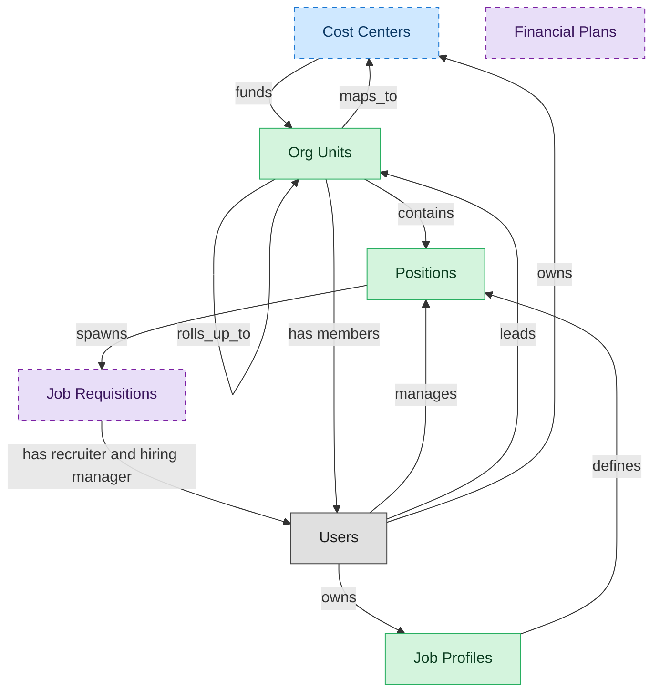

# Organization and Position Management

## 1. Overview

Organization design: org units, positions, and job profiles. Effective-dated org structure with position approval workflow, job-profile authority, and the hierarchical backbone every downstream HR system reads. Foundation for workforce planning and span-of-control analytics.

## 2. Entity summary

| Name | data_object | Description |
| --- | --- | --- |
| Job Profiles | `job_profiles` | Canonical role definitions in the job catalog: title, family, level, responsibilities, required skills, pay range, and FLSA class. Many positions share one profile. |
| Org Units | `org_units` | Nodes in the organizational hierarchy such as divisions, departments, and teams, with manager, cost center alignment, geographic scope, and parent-child links. |
| Positions | `hcm_positions` | Approved org slots with role definition, cost center, reporting line, location, and FTE allocation. Each can be open, filled, or eliminated. |
| Cost Centers | `cost_centers` | Organizational units for cost allocation, with code, manager, hierarchy, and currency, driving variance and departmental reporting. |
| Financial Plans | `financial_plans` | Umbrella records for financial planning artifacts: annual budget, rolling forecast, and long-range plan, with period, version, and approval state. |
| Job Requisitions | `job_requisitions` | Approved requests to hire for a specific role, carrying headcount, level, location, hiring manager, recruiter, and status. |

## 3. Entities catalog

| # | data_object | canonical code | singular | plural | role | mastered in | mastered label | necessity | personal_content | entity_type | write tier | notes |
| ---: | --- | --- | --- | --- | --- | --- | --- | --- | --- | --- | --- | --- |
| 1 | `job_profiles` | `job_profiles` | Job Profile | Job Profiles | master | - | - | required | - | catalog | `:admin` | - |
| 2 | `org_units` | `org_units` | Org Unit | Org Units | master | - | - | required | - | operational_workflow | `:manage` | - |
| 3 | `hcm_positions` | `hcm_positions` | Position | Positions | master | - | - | required | - | operational_workflow | `:manage` | - |
| 4 | `cost_centers` | `cost_centers` | Cost Center | Cost Centers | contributor | `fin-gl-close` | General Ledger and Close | optional | - | catalog | `:admin` | - |
| 5 | `financial_plans` | `financial_plans` | Financial Plan | Financial Plans | consumer | `epm-plan-budget` | Planning and Budgeting | optional | - | operational_workflow | `:manage` | - |
| 6 | `job_requisitions` | `job_requisitions` | Job Requisition | Job Requisitions | consumer | `ats-recruitment-pipeline` | Recruitment Pipeline | optional | - | operational_workflow | `:manage` | - |

## 4. Aliases and industry synonyms

_(none: no industry-scoped aliases for this scope)_

## 5. Relationships

### 5.1 Intra-scope edges

| from | verb | to | cardinality | kind | necessity | owner_side | delete_mode | fk_format | notes |
| --- | --- | --- | --- | --- | --- | --- | --- | --- | --- |
| `org_units` | contains | `hcm_positions` | one_to_many | reference | required | source | restrict | reference | - |
| `job_profiles` | defines | `hcm_positions` | one_to_many | reference | required | source | restrict | reference | - |
| `cost_centers` | funds | `org_units` | one_to_many | reference | required | source | restrict | reference | - |
| `hcm_positions` | spawns | `job_requisitions` | one_to_many | reference | optional | source | clear | reference | - |
| `org_units` | maps_to | `cost_centers` | one_to_one | reference | optional | source | clear | reference | - |
| `org_units` | rolls_up_to | `org_units` | one_to_many | reference | optional | source | clear | reference | - |

### 5.2 Built-in edges (`users` and other platform built-ins)

| from | verb | to | cardinality | necessity | owner_side | delete_mode | fk_format | notes |
| --- | --- | --- | --- | --- | --- | --- | --- | --- |
| `users` | manages | `hcm_positions` | one_to_many | optional | source | clear | reference | - |
| `users` | leads | `org_units` | one_to_many | optional | source | clear | reference | - |
| `users` | owns | `job_profiles` | one_to_many | optional | source | clear | reference | - |
| `users` | owns | `cost_centers` | one_to_many | optional | source | clear | reference | - |
| `job_requisitions` | has recruiter and hiring manager | `users` | many_to_many | required | source | restrict | reference | - |
| `org_units` | has members | `users` | one_to_many | optional | target | clear | reference | - |

### 5.3 Cross-scope edges

#### 5.3a Outbound from this scope's masters and contributors

_Edges this scope drives: the in-scope endpoint has `role` of `master` or `contributor`._

| from | verb | to | cardinality | necessity | delete_mode | fk_format | notes |
| --- | --- | --- | --- | --- | --- | --- | --- |
| `job_profiles` | expects | `competency_models` | one_to_many | optional | none | n/a | - |
| `org_units` | groups | `employees` | one_to_many | required | none (required-if-present) | n/a | - |
| `hcm_positions` | is_filled_by | `employees` | one_to_one | optional | none | n/a | - |
| `org_units` | engages | `contingent_workers` | one_to_many | optional | none | n/a | - |
| `org_units` | is_scored_by | `engagement_drivers` | one_to_many | optional | none | n/a | - |
| `org_units` | is_measured_by | `people_kpis` | one_to_many | optional | none | n/a | - |
| `job_profiles` | maps_to | `skill_profiles` | many_to_many | optional | none | n/a | - |
| `org_units` | triggers | `iga_entitlement_definitions` | one_to_many | optional | none | n/a | - |
| `job_profiles` | feeds | `job_postings` | one_to_many | optional | none | n/a | - |
| `job_profiles` | maps_to | `courses` | many_to_many | optional | none | n/a | - |
| `salary_bands` | anchors | `hcm_positions` | one_to_many | optional | none | n/a | - |
| `salary_bands` | bands | `job_profiles` | one_to_many | optional | none | n/a | - |
| `hcm_positions` | requires | `compliance_assignments` | one_to_many | optional | none | n/a | - |
| `job_profiles` | requires | `learning_paths` | many_to_many | optional | none | n/a | - |
| `job_profiles` | expects | `skill_profiles` | many_to_many | optional | none | n/a | - |
| `org_units` | sponsors | `compliance_assignments` | one_to_many | optional | none | n/a | - |
| `cost_centers` | funds | `course_enrollments` | one_to_many | optional | none | n/a | - |
| `org_units` | sponsors | `benefit_plans` | many_to_many | optional | none | n/a | - |
| `survey_campaigns` | targets | `org_units` | many_to_many | optional | none | n/a | - |
| `org_units` | owns | `action_plans` | one_to_many | optional | none | n/a | - |
| `employees` | fills | `hcm_positions` | one_to_one | optional | none | n/a | - |
| `workforce_scenarios` | drives | `hcm_positions` | one_to_many | required | none (required-if-present) | n/a | - |
| `org_designs` | proposes | `hcm_positions` | one_to_many | required | none (required-if-present) | n/a | - |

#### 5.3b Context edges on embedded shells and consumed entities

_Edges the canonical owner drives, shown for context: the in-scope endpoint has `role` of `embedded_master`, `consumer`, or `derived`._

| from | verb | to | cardinality | necessity | delete_mode | fk_format | notes |
| --- | --- | --- | --- | --- | --- | --- | --- |
| `job_requisitions` | defines_pipeline | `application_stages` | one_to_many | required | none (required-if-present) | n/a | - |
| `job_requisitions` | gated_by | `requisition_approvals` | one_to_many | required | ⚠ audit: required composed child out of scope | n/a | - |
| `job_requisitions` | staffed_by | `hiring_team_assignments` | one_to_many | required | ⚠ audit: required composed child out of scope | n/a | - |
| `job_requisitions` | is advertised through | `job_postings` | one_to_many | required | none (required-if-present) | n/a | - |
| `job_requisitions` | receives | `job_applications` | one_to_many | required | none (required-if-present) | n/a | - |
| `job_requisitions` | updates | `position_demand_forecasts` | many_to_many | optional | none | n/a | - |
| `job_requisitions` | feeds | `people_kpis` | many_to_many | optional | none | n/a | - |
| `workforce_cost_projections` | feeds | `financial_plans` | one_to_many | required | none (required-if-present) | n/a | - |
| `headcount_plans` | authorizes | `job_requisitions` | one_to_many | required | none (required-if-present) | n/a | - |
| `position_demand_forecasts` | triggers | `job_requisitions` | one_to_many | optional | none | n/a | - |
| `dc_capacity_plans` | informs | `financial_plans` | one_to_many | optional | none | n/a | - |
| `financial_plans` | includes | `financial_budgets` | one_to_many | required | ⚠ audit: required composed child out of scope | n/a | - |
| `financial_plans` | includes | `financial_forecasts` | one_to_many | optional | none | n/a | - |
| `financial_plans` | explores_via | `financial_scenarios` | one_to_many | optional | none | n/a | - |

## 6. Cross-domain context

### 6.1 Master consumers (other modules / domains that embed this scope's masters)

| data_object | other module / domain | role | necessity | notes |
| --- | --- | --- | --- | --- |
| `hcm_positions` | ATS-RECRUITMENT-PIPELINE (Recruitment Pipeline) - ATS | embedded_master | optional | - |
| `hcm_positions` | COMP-BENCHMARKING (Benchmarking and Pay Equity) - COMP-MGMT | embedded_master | optional | - |
| `hcm_positions` | COMP-INCENTIVES (Incentives and Equity Plans) - COMP-MGMT | embedded_master | required | - |
| `hcm_positions` | COMP-PLANNING (Compensation Planning Cycles) - COMP-MGMT | embedded_master | required | - |
| `hcm_positions` | LMS-COMPLIANCE-TRAINING (Compliance Training) - LMS | embedded_master | optional | - |
| `hcm_positions` | LMS-COURSE-DELIVERY (Course Delivery) - LMS | embedded_master | optional | - |
| `hcm_positions` | LMS-PATHS (Learning Paths) - LMS | embedded_master | optional | - |
| `hcm_positions` | ONB-JOURNEY-MGMT (Onboarding Journey Management) - ONBOARDING | embedded_master | required | - |
| `hcm_positions` | PA-DEI-ANALYTICS (DEI Analytics) - PA | consumer | required | - |
| `hcm_positions` | PA-PREDICTIVE-MODELS (Predictive Models) - PA | consumer | required | - |
| `hcm_positions` | PA-WORKFORCE-METRICS (Workforce Metrics) - PA | consumer | required | - |
| `hcm_positions` | PAYROLL-RUN (Payroll Run Execution) - PAYROLL | embedded_master | required | - |
| `hcm_positions` | SWP-COST-PROJECTIONS (Cost Projections) - SWP | consumer | required | - |
| `hcm_positions` | SWP-DEMAND-FORECAST (Demand Forecast) - SWP | consumer | required | - |
| `hcm_positions` | SWP-SUPPLY-PLANNING (Supply Planning) - SWP | consumer | required | - |
| `hcm_positions` | TALENT-SUCCESSION-CAREER (Succession and Career Planning) - TALENT-MGMT | embedded_master | required | - |
| `hcm_positions` | WFM-SCHEDULING (Workforce Scheduling) - WFM | embedded_master | required | - |
| `hcm_positions` | WFM-TIME-ATTENDANCE (Time and Attendance) - WFM | embedded_master | required | - |
| `job_profiles` | ATS-RECRUITMENT-PIPELINE (Recruitment Pipeline) - ATS | embedded_master | required | - |
| `job_profiles` | COMP-BENCHMARKING (Benchmarking and Pay Equity) - COMP-MGMT | embedded_master | required | - |
| `job_profiles` | COMP-INCENTIVES (Incentives and Equity Plans) - COMP-MGMT | embedded_master | required | - |
| `job_profiles` | COMP-PLANNING (Compensation Planning Cycles) - COMP-MGMT | embedded_master | required | - |
| `job_profiles` | LMS-PATHS (Learning Paths) - LMS | embedded_master | optional | - |
| `job_profiles` | PSA-PROJECT-DELIVERY (Project Delivery) - PSA | consumer | required | - |
| `job_profiles` | PSA-RESOURCE-MGMT (Resource Management) - PSA | consumer | required | - |
| `job_profiles` | SKILLS-MGMT-TAXONOMY (Skill Taxonomy and Competency Models) - SKILLS-MGMT | embedded_master | required | - |
| `job_profiles` | SWP-DEMAND-FORECAST (Demand Forecast) - SWP | consumer | required | - |
| `job_profiles` | SWP-SCENARIO-MODELING (Scenario Modeling) - SWP | consumer | required | - |
| `job_profiles` | SWP-SUPPLY-PLANNING (Supply Planning) - SWP | consumer | required | - |
| `job_profiles` | TALENT-SUCCESSION-CAREER (Succession and Career Planning) - TALENT-MGMT | contributor | optional | - |
| `job_profiles` | TLNT-INTEL-MOBILITY (Mobility, Succession and Fit) - TLNT-INTEL | consumer | required | - |
| `job_profiles` | WFM-SCHEDULING (Workforce Scheduling) - WFM | embedded_master | required | - |
| `org_units` | ATS-RECRUITMENT-PIPELINE (Recruitment Pipeline) - ATS | embedded_master | optional | - |
| `org_units` | BEN-ENROLLMENT (Enrollment and Life Events) - BEN-ADMIN | embedded_master | optional | - |
| `org_units` | BEN-PLAN-DESIGN (Plan Design and Enrollment Setup) - BEN-ADMIN | embedded_master | optional | - |
| `org_units` | CLM-REPOSITORY (Contract Repository) - CLM | embedded_master | optional | - |
| `org_units` | CMDB-CORE (CMDB Core Repository) - CMDB | embedded_master | optional | - |
| `org_units` | COMP-BENCHMARKING (Benchmarking and Pay Equity) - COMP-MGMT | embedded_master | optional | - |
| `org_units` | COMP-INCENTIVES (Incentives and Equity Plans) - COMP-MGMT | embedded_master | optional | - |
| `org_units` | COMP-PLANNING (Compensation Planning Cycles) - COMP-MGMT | embedded_master | optional | - |
| `org_units` | COMP-STATEMENTS (Total Rewards Statements) - COMP-MGMT | embedded_master | optional | - |
| `org_units` | CSM-CASE-MGMT (Case Management) - CSM | embedded_master | optional | - |
| `org_units` | EMP-EXP-ACTION-PLANNING (Action Planning) - EMP-EXP | embedded_master | optional | - |
| `org_units` | EMP-EXP-CONTINUOUS-LISTEN (Continuous Listening) - EMP-EXP | embedded_master | optional | - |
| `org_units` | EPM-PLAN-BUDGET (Planning and Budgeting) - EPM | contributor | required | - |
| `org_units` | EXPENSE-CAPTURE-AND-REPORTING (Expense Capture and Reporting) - EXPENSE | embedded_master | required | - |
| `org_units` | FLEET-MAINT-WORK-ORDER (Vehicle Work Order Management) - FLEET-MAINT | embedded_master | optional | - |
| `org_units` | IGA-ACCESS-REQUEST (IGA Access Request) - IGA | embedded_master | required | - |
| `org_units` | IGA-ENTITLEMENT-CATALOG (IGA Entitlement Catalog) - IGA | embedded_master | required | - |
| `org_units` | ITAM-LIFECYCLE (Unified Asset Lifecycle Log) - ITAM | embedded_master | optional | - |
| `org_units` | ITSM-AGENT-WORKSPACE (Service Agent Workspace and Reporting) - ITSM | embedded_master | optional | - |
| `org_units` | ITSM-CHANGE-MGMT (Change and Release Management) - ITSM | embedded_master | optional | - |
| `org_units` | ITSM-INCIDENT-MGMT (Incident Management) - ITSM | embedded_master | optional | - |
| `org_units` | ITSM-PROBLEM-MGMT (Problem Management) - ITSM | embedded_master | optional | - |
| `org_units` | ITSM-SERVICE-REQUEST (Service Request Fulfillment) - ITSM | embedded_master | optional | - |
| `org_units` | ITSM-SLA-MGMT (SLA and Chargeback Management) - ITSM | embedded_master | optional | - |
| `org_units` | IWMS-SPACE-ANALYTICS (Space Utilization and Occupancy Analytics) - IWMS | embedded_master | optional | - |
| `org_units` | IWMS-WORKPLACE-SERVICE-DESK (Workplace Service Requests) - IWMS | embedded_master | optional | - |
| `org_units` | LMS-COMPLIANCE-TRAINING (Compliance Training) - LMS | embedded_master | optional | - |
| `org_units` | LMS-COURSE-DELIVERY (Course Delivery) - LMS | embedded_master | optional | - |
| `org_units` | LMS-ILT-DELIVERY (Instructor-Led and Virtual-Instructor-Led Training) - LMS | embedded_master | optional | - |
| `org_units` | LMS-PATHS (Learning Paths) - LMS | embedded_master | optional | - |
| `org_units` | ONB-JOURNEY-MGMT (Onboarding Journey Management) - ONBOARDING | embedded_master | optional | - |
| `org_units` | ONB-WELCOME-EXPERIENCE (Onboarding Welcome Experience) - ONBOARDING | embedded_master | optional | - |
| `org_units` | PA-DEI-ANALYTICS (DEI Analytics) - PA | consumer | optional | - |
| `org_units` | PA-PREDICTIVE-MODELS (Predictive Models) - PA | consumer | optional | - |
| `org_units` | PA-WORKFORCE-METRICS (Workforce Metrics) - PA | consumer | optional | - |
| `org_units` | PAYROLL-RUN (Payroll Run Execution) - PAYROLL | embedded_master | optional | - |
| `org_units` | SAM-CATALOG-DISCOVERY (Software Catalog and Installation Discovery) - SAM | embedded_master | required | - |
| `org_units` | SEM-STRATEGY-DEFINITION (Strategy Definition) - SEM | consumer | optional | - |
| `org_units` | SMP-RENEWAL-VENDOR (SMP Renewal and Vendor Management) - SMP | embedded_master | optional | - |
| `org_units` | SWP-DEMAND-FORECAST (Demand Forecast) - SWP | consumer | optional | - |
| `org_units` | SWP-SCENARIO-MODELING (Scenario Modeling) - SWP | consumer | optional | - |
| `org_units` | SWP-SUPPLY-PLANNING (Supply Planning) - SWP | consumer | optional | - |
| `org_units` | TALENT-PERFORMANCE-MGMT (Performance and Goal Management) - TALENT-MGMT | embedded_master | optional | - |
| `org_units` | TALENT-SUCCESSION-CAREER (Succession and Career Planning) - TALENT-MGMT | embedded_master | optional | - |
| `org_units` | VULN-MGMT-DETECT (Scanning and Detection) - VULN-MGMT | embedded_master | optional | - |
| `org_units` | VULN-MGMT-REMEDIATE (Remediation and Governance) - VULN-MGMT | embedded_master | optional | - |
| `org_units` | VULN-MGMT-RISK (Prioritization and Risk) - VULN-MGMT | embedded_master | optional | - |
| `org_units` | WFM-ABSENCE (Absence and Leave) - WFM | embedded_master | required | - |
| `org_units` | WFM-SCHEDULING (Workforce Scheduling) - WFM | embedded_master | required | - |
| `org_units` | WFM-TIME-ATTENDANCE (Time and Attendance) - WFM | embedded_master | required | - |

### 6.2 Outbound handoffs (events this scope publishes)

| source module | target domain | target module | trigger_event | transition | payload | integration | friction | description |
| --- | --- | --- | --- | --- | --- | --- | --- | --- |
| HCM-ORG-POSITIONS | IGA | IGA-ACCESS-REQUEST | `org_unit.created` | _(state_change)_ | `org_units` | event_stream | medium | New org unit drives IGA group/role provisioning. Group-name conventions and ownership must be encoded; otherwise orphan groups proliferate. |
| HCM-ORG-POSITIONS | IGA | IGA-ACCESS-REQUEST | `org_unit.disbanded` | _(state_change)_ | `org_units` | event_stream | high | Org-unit disbandment requires IGA group cleanup; orphan-group risk if employees re-assigned slowly. |
| HCM-ORG-POSITIONS | IGA | IGA-ACCESS-REQUEST | `org_unit.merged` | _(state_change)_ | `org_units` | event_stream | high | Org-unit merge consolidates IGA groups: members migrate, entitlements deduplicated, SoD revalidated. Often runs as a batch project rather than event. |
| HCM-ORG-POSITIONS | HCM | HCM-CORE-WORKER | `hcm_position.approved_for_creation` | `approved_for_creation` _(lifecycle)_ | `hcm_positions` | lifecycle_progression | low | Approved position becomes hireable; worker-record module can attach a new employee once the requisition closes. |
| HCM-ORG-POSITIONS | HCM | HCM-CORE-WORKER | `org_unit.disbanded` | _(state_change)_ | `org_units` | lifecycle_progression | high | Disbanded org unit requires every incumbent employee to be re-placed before close; worker-record module blocks the close until reassignment completes. |
| HCM-ORG-POSITIONS | HCM | HCM-CORE-WORKER | `org_unit.merged` | _(state_change)_ | `org_units` | lifecycle_progression | medium | Org-unit consolidation cascades employee re-assignment, manager and dotted-line reassignment, and reporting-line recompute on the worker record. |
| HCM-ORG-POSITIONS | ATS | ATS-RECRUITMENT-PIPELINE | `hcm_position.approved` | _(state_change)_ | `hcm_positions` | api_call | medium | - |
| HCM-ORG-POSITIONS | ATS | ATS-RECRUITMENT-PIPELINE | `hcm_position.approved_for_creation` | `approved_for_creation` _(lifecycle)_ | `hcm_positions` | event_stream | medium | Approved position flows to ATS as the basis for a requisition. Approval state must be in sync to avoid requisitions opened against unapproved positions. |
| HCM-ORG-POSITIONS | ATS | ATS-RECRUITMENT-PIPELINE | `hcm_position.eliminated` | _(state_change)_ | `hcm_positions` | api_call | high | - |
| HCM-ORG-POSITIONS | ATS | ATS-RECRUITMENT-PIPELINE | `hcm_position.filled` | _(state_change)_ | `hcm_positions` | api_call | medium | - |
| HCM-ORG-POSITIONS | ATS | ATS-RECRUITMENT-PIPELINE | `hcm_position.frozen` | _(state_change)_ | `hcm_positions` | api_call | high | - |
| HCM-ORG-POSITIONS | ATS | ATS-RECRUITMENT-PIPELINE | `hcm_position.opened` | _(state_change)_ | `hcm_positions` | api_call | medium | - |
| HCM-ORG-POSITIONS | ATS | ATS-RECRUITMENT-PIPELINE | `job_profile.activated` | _(state_change)_ | `job_profiles` | api_call | low | - |
| HCM-ORG-POSITIONS | ATS | ATS-RECRUITMENT-PIPELINE | `job_profile.approved` | _(state_change)_ | `job_profiles` | api_call | low | - |
| HCM-ORG-POSITIONS | ATS | ATS-RECRUITMENT-PIPELINE | `job_profile.published` | _(state_change)_ | `job_profiles` | event_stream | low | Canonical job profile feeds ATS posting templates and screening criteria. |
| HCM-ORG-POSITIONS | ATS | ATS-RECRUITMENT-PIPELINE | `job_profile.retired` | _(state_change)_ | `job_profiles` | api_call | high | - |
| HCM-ORG-POSITIONS | ATS | ATS-RECRUITMENT-PIPELINE | `job_profile.updated` | _(state_change)_ | `job_profiles` | api_call | medium | - |
| HCM-ORG-POSITIONS | ATS | ATS-RECRUITMENT-PIPELINE | `org_unit.activated` | _(state_change)_ | `org_units` | api_call | low | - |
| HCM-ORG-POSITIONS | ATS | ATS-RECRUITMENT-PIPELINE | `org_unit.closed` | _(state_change)_ | `org_units` | api_call | high | - |
| HCM-ORG-POSITIONS | ATS | ATS-RECRUITMENT-PIPELINE | `org_unit.created` | _(state_change)_ | `org_units` | api_call | medium | - |
| HCM-ORG-POSITIONS | ATS | ATS-RECRUITMENT-PIPELINE | `org_unit.disbanded` | _(state_change)_ | `org_units` | api_call | high | - |
| HCM-ORG-POSITIONS | ATS | ATS-RECRUITMENT-PIPELINE | `org_unit.merged` | _(state_change)_ | `org_units` | api_call | high | - |
| HCM-ORG-POSITIONS | ATS | ATS-RECRUITMENT-PIPELINE | `org_unit.reorganized` | _(state_change)_ | `org_units` | api_call | high | - |
| HCM-ORG-POSITIONS | COMP-MGMT | COMP-PLANNING | `hcm_position.approved_for_creation` | `approved_for_creation` _(lifecycle)_ | `hcm_positions` | event_stream | low | Approved position carries grade/band, anchoring offer-comp generation. |
| HCM-ORG-POSITIONS | COMP-MGMT | COMP-BENCHMARKING | `job_profile.published` | _(state_change)_ | `job_profiles` | event_stream | low | Job profile links to salary bands; COMP-MGMT mapping authoritative. |
| HCM-ORG-POSITIONS | FIN | _(domain-level)_ | `org_unit.created` | _(state_change)_ | `org_units` | api_call | medium | New org unit usually maps to cost-center; ERP-FIN must reflect the structure for budgeting and labor allocation. |
| HCM-ORG-POSITIONS | PSA | PSA-RESOURCE-MGMT | `job_profile.activated` | _(state_change)_ | `job_profiles` | event_stream | low | Job profile activated for production. PSA makes the role assignable on new project_assignments and project_resource_allocations. |
| HCM-ORG-POSITIONS | PSA | PSA-RESOURCE-MGMT | `job_profile.published` | _(state_change)_ | `job_profiles` | event_stream | low | New job profile published. PSA picks up the role definition (competencies, level) as a new shape for skill-based demand modeling and resource_skill_inventories matching. |
| HCM-ORG-POSITIONS | PSA | PSA-RESOURCE-MGMT | `job_profile.retired` | _(state_change)_ | `job_profiles` | event_stream | low | Job profile retired. PSA blocks new assignments to the role and surfaces a migration list for any existing project_assignments still referencing it. |
| HCM-ORG-POSITIONS | PSA | PSA-RESOURCE-MGMT | `job_profile.updated` | _(state_change)_ | `job_profiles` | event_stream | low | Job profile updated (competencies, level, responsibilities). PSA revalidates the resource pool's skill matches and surfaces gaps via existing resource_skill_inventory.gap_identified signal. |
| HCM-ORG-POSITIONS | SKILLS-MGMT | SKILLS-MGMT-PROFILE | `job_profile.published` | _(state_change)_ | `job_profiles` | event_stream | low | Job profile competencies drive LMS skill-profile expectations and required-training assignments. |

### 6.3 Inbound handoffs (events this scope reacts to)

| target module | source domain | source module | trigger_event | transition | payload | integration | friction | description |
| --- | --- | --- | --- | --- | --- | --- | --- | --- |
| HCM-ORG-POSITIONS | HCM | HCM-CORE-WORKER | `employee.terminated` | `terminated` _(lifecycle)_ | `hcm_positions` | lifecycle_progression | low | Position transitions from filled to open as the incumbent terminates; org-position module recomputes vacancy and span-of-control rollups. |
| HCM-ORG-POSITIONS | ATS | ATS-RECRUITMENT-PIPELINE | `headcount.approved` | `approved` _(state_change)_ | `job_requisitions` | event_stream | low | Headcount approval (often originating from HCM/SWP) confirmed back to HCM; gives ATS green light to source. |
| HCM-ORG-POSITIONS | ATS | ATS-RECRUITMENT-PIPELINE | `requisition.filled` | `filled` _(state_change)_ | `job_requisitions` | event_stream | low | Requisition fill closes headcount slot; HCM headcount-plan updates. |
| HCM-ORG-POSITIONS | EPM | EPM-PLAN-BUDGET | `financial_plan.approved` | `approved` _(state_change)_ | `financial_plans` | batch_sync | medium | Approved plans set headcount budgets visible in HCM and SWP. |

### 6.4 Master providers (modules / domains that own masters this scope embeds)

| data_object | role here | necessity | canonical owner(s) | slice notes |
| --- | --- | --- | --- | --- |
| `cost_centers` | contributor | optional | FIN-GL-CLOSE (FIN) | - |
| `financial_plans` | consumer | optional | EPM-PLAN-BUDGET (EPM) | - |
| `job_requisitions` | consumer | optional | ATS-RECRUITMENT-PIPELINE (ATS) | - |

## 7. Lifecycle states

### `financial_plans` (Financial Plan)

_This scope holds `financial_plans` as **consumer**; the canonical state machine is owned by `EPM-PLAN-BUDGET`._

| order | state_name | initial? | terminal? | requires_permission? | derived gate | description |
| --- | --- | --- | --- | --- | --- | --- |
| 10 | `draft` | ✓ | - | - | - | Plan is being built: planning period, version, and component line-item budgets, forecasts, and variances assembled. |
| 20 | `under_review` | - | - | - | - | Submitted to finance leadership for review against targets and prior versions. |
| 30 | `approved` | - | - | ✓ | `epm-plan-budget:approve_financial_plan` | Leadership approves the version; budget envelope and owner confirmed. Publishes financial_plan.approved. |
| 40 | `published` | - | - | ✓ | `epm-plan-budget:publish_financial_plan` | Baselined and distributed to budget owners; the version is locked as the plan of record. Publishes financial_plan.published. |
| 50 | `closed` | - | ✓ | - | - | Planning period closed; the plan is retired or superseded by the next planning cycle. |

### `hcm_positions` (Position)

| order | state_name | initial? | terminal? | requires_permission? | derived gate | description |
| --- | --- | --- | --- | --- | --- | --- |
| 1 | `proposed` | ✓ | - | - | - | Position has been designed but not yet approved against the headcount plan. |
| 2 | `approved` | - | - | ✓ | `hcm-org-positions:approved_position` | Cleared by headcount/finance owner; eligible to spawn a requisition. |
| 3 | `open` | - | - | ✓ | `hcm-org-positions:open_position` | Approved and actively being recruited against; not yet filled. |
| 4 | `filled` | - | - | ✓ | `hcm-org-positions:filled_position` | An employee occupies the position. |
| 5 | `frozen` | - | - | ✓ | `hcm-org-positions:frozen_position` | Temporarily not fillable (hiring freeze, budget hold); retains the slot. |
| 6 | `eliminated` | - | ✓ | ✓ | `hcm-org-positions:eliminated_position` | Removed from the org structure permanently. |

### `job_profiles` (Job Profile)

| order | state_name | initial? | terminal? | requires_permission? | derived gate | description |
| --- | --- | --- | --- | --- | --- | --- |
| 1 | `draft` | ✓ | - | - | - | Profile is being authored or revised; not yet available for position assignment. |
| 2 | `approved` | - | - | ✓ | `hcm-org-positions:approved_job_profile` | Cleared by the catalog owner; ready to be referenced by positions and postings. |
| 3 | `active` | - | - | ✓ | `hcm-org-positions:active_job_profile` | In production use; positions and postings can reference it. |
| 4 | `retired` | - | ✓ | ✓ | `hcm-org-positions:retired_job_profile` | No longer assignable to new positions; historical references preserved. |

### `job_requisitions` (Job Requisition)

_This scope holds `job_requisitions` as **consumer**; the canonical state machine is owned by `ATS-RECRUITMENT-PIPELINE`._

| order | state_name | initial? | terminal? | requires_permission? | derived gate | description |
| --- | --- | --- | --- | --- | --- | --- |
| 1 | `draft` | ✓ | - | - | - | Hiring manager is drafting the requisition. |
| 2 | `pending_approval` | - | - | - | - | Requisition routed for headcount and budget approval. |
| 3 | `open` | - | - | ✓ | `ats-recruitment-pipeline:approve_requisition` | Requisition approved and actively recruiting. |
| 4 | `on_hold` | - | - | - | - | Recruiting temporarily paused (budget freeze, scope change). |
| 5 | `filled` | - | ✓ | ✓ | `ats-recruitment-pipeline:close_requisition` | Requisition closed because the role was filled. |
| 6 | `canceled` | - | ✓ | - | - | Requisition closed without a hire. |

### `org_units` (Org Unit)

| order | state_name | initial? | terminal? | requires_permission? | derived gate | description |
| --- | --- | --- | --- | --- | --- | --- |
| 1 | `draft` | ✓ | - | - | - | Org unit defined as part of a future structure; not yet operational. |
| 2 | `active` | - | - | ✓ | `hcm-org-positions:active_org_unit` | Operational unit; carries headcount, cost-center linkage, and reporting lines. |
| 3 | `reorganized` | - | ✓ | ✓ | `hcm-org-positions:reorganized_org_unit` | Unit folded into or replaced by a new structure; references remain for history. |
| 4 | `closed` | - | ✓ | ✓ | `hcm-org-positions:closed_org_unit` | Unit dissolved; no employees or positions reside in it. |

## 8. Permissions and business rules (derived)

### 8.1 Permissions

| permission | tier | description | included in `:admin`? |
| --- | --- | --- | --- |
| `hcm-org-positions:read` | baseline-read | Read access to every entity in the module | ✓ |
| `hcm-org-positions:manage` | baseline-manage | Edit operational records | ✓ |
| `hcm-org-positions:admin` | baseline-admin | Edit reference data and inherit every workflow gate below | - |
| `hcm-org-positions:approved_position` | workflow-gate (lifecycle) | Transition `hcm_positions` into state `approved` | ✓ |
| `hcm-org-positions:open_position` | workflow-gate (lifecycle) | Transition `hcm_positions` into state `open` | ✓ |
| `hcm-org-positions:filled_position` | workflow-gate (lifecycle) | Transition `hcm_positions` into state `filled` | ✓ |
| `hcm-org-positions:frozen_position` | workflow-gate (lifecycle) | Transition `hcm_positions` into state `frozen` | ✓ |
| `hcm-org-positions:eliminated_position` | workflow-gate (lifecycle) | Transition `hcm_positions` into state `eliminated` | ✓ |
| `hcm-org-positions:approved_job_profile` | workflow-gate (lifecycle) | Transition `job_profiles` into state `approved` | ✓ |
| `hcm-org-positions:active_job_profile` | workflow-gate (lifecycle) | Transition `job_profiles` into state `active` | ✓ |
| `hcm-org-positions:retired_job_profile` | workflow-gate (lifecycle) | Transition `job_profiles` into state `retired` | ✓ |
| `hcm-org-positions:active_org_unit` | workflow-gate (lifecycle) | Transition `org_units` into state `active` | ✓ |
| `hcm-org-positions:reorganized_org_unit` | workflow-gate (lifecycle) | Transition `org_units` into state `reorganized` | ✓ |
| `hcm-org-positions:closed_org_unit` | workflow-gate (lifecycle) | Transition `org_units` into state `closed` | ✓ |

### 8.2 Business rules

_(none: no flag-derived business rules)_

## 9. Roles, RACI, and responsibilities (derived)

_Baseline roles, the permission hierarchy, and RACI realization are DERIVED from this scope's entity-type write tiers + `process_raci`; none of it is stored in the catalog (the deployer provisions it from this blueprint)._

### 9.1 `HCM-ORG-POSITIONS`

**Baseline roles:**

| role | baseline grant |
| --- | --- |
| `hcm-org-positions_viewer` | `hcm-org-positions:read` |
| `hcm-org-positions_manager` | `hcm-org-positions:manage` |
| `hcm-org-positions_admin` | `hcm-org-positions:admin` |

**Permission hierarchy:**

| permission | includes |
| --- | --- |
| `hcm-org-positions:admin` | `hcm-org-positions:manage` |
| `hcm-org-positions:manage` | `hcm-org-positions:read` |
| `hcm-org-positions:admin` | `hcm-org-positions:approved_position` |
| `hcm-org-positions:admin` | `hcm-org-positions:open_position` |
| `hcm-org-positions:admin` | `hcm-org-positions:filled_position` |
| `hcm-org-positions:admin` | `hcm-org-positions:frozen_position` |
| `hcm-org-positions:admin` | `hcm-org-positions:eliminated_position` |
| `hcm-org-positions:admin` | `hcm-org-positions:approved_job_profile` |
| `hcm-org-positions:admin` | `hcm-org-positions:active_job_profile` |
| `hcm-org-positions:admin` | `hcm-org-positions:retired_job_profile` |
| `hcm-org-positions:admin` | `hcm-org-positions:active_org_unit` |
| `hcm-org-positions:admin` | `hcm-org-positions:reorganized_org_unit` |
| `hcm-org-positions:admin` | `hcm-org-positions:closed_org_unit` |

**Processes wired:**

| process_key | process_name | PCF code | PCF ID | level | description |
| --- | --- | --- | --- | --- | --- |
| `create_organizational_design` | Create organizational design | 1.2.5 | 10041 | 3 | Formulating a design for the organization's resources that allow it to meet its objectives. Develop a new framework for molding the organization's various processes into a coherent and seamless whole. |
| `develop_maintain_job` | Develop and maintain job descriptions | 7.1.2.16 | 10447 | 4 | Creating descriptions for job requisitions. Define the normal components of a job description, such as the overall position description with general areas of responsibility listed, essential functions of the job described with a couple of examples of each, required knowledge, skills, abilities, required education and experience, a description of the physical demands, and a description of the work environment. |
| `conduct_organization` | Conduct organization restructuring opportunities | 1.1.5 | 16792 | 3 | Examining the scope and contingencies for restructuring based on market situation and internal realities. Map the market forces over which any and all probabilities can be probed for utility and viability. Once the restructuring options have been analyzed and the due-diligence performed, execute the deal. Consider seeking professional services for assistance in formalizing these opportunities. |

**RACI realization:**

| actor | kind | raci | process_key | realization |
| --- | --- | --- | --- | --- |
| `HR-ORG-DESIGN-ANALYST` | persona | responsible | `create_organizational_design` | grant gates [hcm-org-positions:approved_position, hcm-org-positions:active_org_unit] + the gated entities' write tier |
| `HR-BUSINESS-PARTNER` | persona | accountable | `create_organizational_design` | approval gate |
| `PEOPLE-MANAGER` | persona | consulted | `create_organizational_design` | advisory read grant |
| `HR-HRIS-ADMIN` | persona | informed | `create_organizational_design` | notification side effect (trigger_event / webhook_receiver) |
| `HR-ORG-DESIGN-ANALYST` | persona | responsible | `develop_maintain_job` | grant gates [hcm-org-positions:approved_job_profile] + the gated entities' write tier |
| `HR-HRIS-ADMIN` | persona | accountable | `develop_maintain_job` | approval gate |
| `HR-BUSINESS-PARTNER` | persona | consulted | `develop_maintain_job` | advisory read grant |
| `HR-ORG-DESIGN-ANALYST` | persona | responsible | `conduct_organization` | grant gates [hcm-org-positions:reorganized_org_unit] + the gated entities' write tier |
| `HR-BUSINESS-PARTNER` | persona | accountable | `conduct_organization` | approval gate |
| `PEOPLE-MANAGER` | persona | consulted | `conduct_organization` | advisory read grant |

### 9.2 Functional ownership and default grants

| responsibility | business function | default role | default tier |
| --- | --- | --- | --- |
| owner | Human Resources | `admin` | `:admin` |
| contributor | Finance | `manage` | `:manage` |
| contributor | IT Operations | `manage` | `:manage` |
| contributor | Legal | `manage` | `:manage` |
| contributor | Payroll | `manage` | `:manage` |
| consumer | Executive | `read` | `:read` |
| consumer | Governance, Risk and Compliance | `read` | `:read` |
