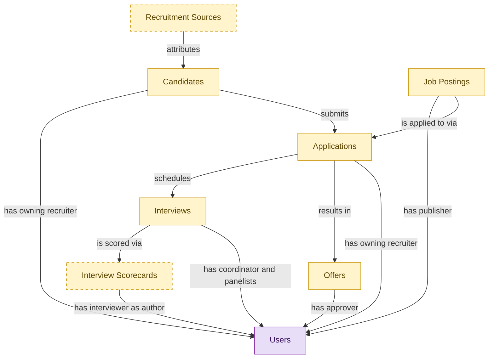

# Hiring Starter

## 1. Overview

Entry-tier deployable for a basic hiring workflow: post jobs, capture applications, run interviews, generate offers. Embeds the canonical masters from the full ATS modules and inherits their lifecycle states. Ships three baseline permissions and one system skill; no workflow gates, no requisition approvals, no background-check orchestration, no pre-employee reconciliation. Upgrades to the full ATS surface without tenant data migration via the embedded-master demotion path.

## 2. Entity summary

| Name | data_object | Description |
| --- | --- | --- |
| Applications | `job_applications` | A candidate's submission against a specific requisition. Carries pipeline stage, status (active / rejected / withdrawn / hired), source, and the full evaluation history. |
| Candidates | `candidates` | Person known to the recruiting org, with or without an active application. Carries contact details, resume, tags, GDPR consent, and source. Distinct from Employee until hired. |
| Interview Scorecards | `interview_scorecards` | Structured interviewer feedback against a defined rubric: per-competency ratings, written notes, and a hire/no-hire recommendation. |
| Interviews | `interviews` | Scheduled assessment event between a candidate and one or more interviewers. Carries time, location/medium, panel, interview kit, and outcome. |
| Job Postings | `job_postings` | Published, candidate-facing version of a requisition on a career site or job board. One requisition can have many postings (per board, language, or region). |
| Offers | `job_offers` | Formal employment offer extended to a candidate. Carries compensation components, start date, terms, approval chain, and status (draft / approved / sent / accepted / declined / rescinded). |
| Recruitment Sources | `recruitment_sources` | Channel a candidate came from: job board, referral, agency, sourcing campaign, career event, or inbound. Used for source-of-hire analytics and channel ROI. |
| Users | `users` | Semantius platform-owned user table. Referenced from domain `data_objects` via `data_object_relationships` for assignee / author / approver / creator edges. Not surfaced in domain-level analytics (Signal 1/2 ignore `kind='platform_builtin'`). |

## 3. Entities catalog

| # | data_object | canonical code | singular | plural | role | mastered in | mastered label | necessity | pattern flags | entity_type | write tier | notes |
| ---: | --- | --- | --- | --- | --- | --- | --- | --- | --- | --- | --- | --- |
| 1 | `job_applications` | `job_applications` | Application | Applications | embedded_master | `ats-recruitment-pipeline` | Recruitment Pipeline | required | personal_content | operational_workflow | `:manage` | - |
| 2 | `candidates` | `candidates` | Candidate | Candidates | embedded_master | `ats-candidate-crm` | Candidate CRM | required | personal_content | operational_workflow | `:manage` | - |
| 3 | `interview_scorecards` | `interview_scorecards` | Interview Scorecard | Interview Scorecards | embedded_master | `ats-interviews` | Interviews | optional | personal_content, submit_lock | operational_workflow | `:manage` | - |
| 4 | `interviews` | `interviews` | Interview | Interviews | embedded_master | `ats-interviews` | Interviews | required | - | operational_workflow | `:manage` | - |
| 5 | `job_postings` | `job_postings` | Job Posting | Job Postings | embedded_master | `ats-recruitment-pipeline` | Recruitment Pipeline | required | - | operational_workflow | `:manage` | - |
| 6 | `job_offers` | `job_offers` | Offer | Offers | embedded_master | `ats-offers` | Offers | required | personal_content, single_approver | operational_workflow | `:manage` | - |
| 7 | `recruitment_sources` | `recruitment_sources` | Recruitment Source | Recruitment Sources | embedded_master | `ats-candidate-crm` | Candidate CRM | optional | - | catalog | `:admin` | - |
| 8 | `users` | `users` | User | Users | consumer | _(platform built-in)_ | _(platform built-in)_ | required | - | operational_record | `:manage` | - |

## 4. Aliases and industry synonyms

_(none: no industry-scoped aliases for this scope)_

## 5. Relationships

### 5.1 Intra-scope edges

| from | verb | to | cardinality | kind | necessity | owner_side | delete_mode | fk_format | notes |
| --- | --- | --- | --- | --- | --- | --- | --- | --- | --- |
| `job_postings` | is applied to via | `job_applications` | one_to_many | reference | required | source | restrict | reference | - |
| `candidates` | submits | `job_applications` | one_to_many | reference | required | target | restrict | reference | - |
| `recruitment_sources` | attributes | `candidates` | one_to_many | reference | required | target | restrict | reference | - |
| `job_applications` | schedules | `interviews` | one_to_many | reference | required | source | restrict | reference | - |
| `interviews` | is scored via | `interview_scorecards` | one_to_many | reference | required | source | restrict | reference | - |
| `job_applications` | results in | `job_offers` | one_to_many | reference | required | source | restrict | reference | - |

### 5.2 Built-in edges (`users` and other platform built-ins)

| from | verb | to | cardinality | necessity | owner_side | delete_mode | fk_format | notes |
| --- | --- | --- | --- | --- | --- | --- | --- | --- |
| `candidates` | has owning recruiter | `users` | many_to_many | optional | source | clear | reference | - |
| `job_postings` | has publisher | `users` | many_to_many | required | source | restrict | reference | - |
| `job_applications` | has owning recruiter | `users` | many_to_many | required | source | restrict | reference | - |
| `interviews` | has coordinator and panelists | `users` | many_to_many | required | source | restrict | reference | - |
| `interview_scorecards` | has interviewer as author | `users` | many_to_many | required | source | restrict | reference | - |
| `job_offers` | has approver | `users` | many_to_many | required | source | restrict | reference | - |

### 5.3 Cross-scope edges

#### 5.3a Outbound from this scope's masters and contributors

_Edges this scope drives: the in-scope endpoint has `role` of `master` or `contributor`._

_(none: no outbound cross-scope edges from this scope's masters or contributors)_

#### 5.3b Context edges on embedded shells and consumed entities

_Edges the canonical owner drives, shown for context: the in-scope endpoint has `role` of `embedded_master`, `consumer`, or `derived`._

| from | verb | to | cardinality | necessity | delete_mode | fk_format | notes |
| --- | --- | --- | --- | --- | --- | --- | --- |
| `candidates` | verified_via | `right_to_work_verifications` | one_to_many | optional | none | n/a | - |
| `candidates` | engaged_via | `candidate_engagements` | one_to_many | optional | none | n/a | - |
| `candidates` | attends_via | `recruiting_event_attendances` | one_to_many | required | none (required-if-present) | n/a | - |
| `candidates` | noted_via | `recruiter_interactions` | one_to_many | optional | none | n/a | - |
| `candidates` | consents_via | `candidate_consents` | one_to_many | required | ⚠ audit: required composed child out of scope | n/a | - |
| `candidates` | member_of_via | `talent_pool_memberships` | one_to_many | required | none (required-if-present) | n/a | - |
| `candidates` | discloses_via | `fcra_disclosures` | one_to_many | required | ⚠ audit: required composed child out of scope | n/a | - |
| `job_applications` | transitions_via | `application_stage_transitions` | one_to_many | required | ⚠ audit: required composed child out of scope | n/a | - |
| `job_postings` | syndicates_via | `job_posting_distributions` | one_to_many | optional | none | n/a | - |
| `job_postings` | asks | `application_screening_questions` | one_to_many | optional | none | n/a | - |
| `job_applications` | answers_via | `application_screening_answers` | one_to_many | optional | none | n/a | - |
| `candidates` | self_identifies_via | `eeo_responses` | one_to_many | optional | none | n/a | - |
| `interview_kits` | shapes | `interviews` | one_to_many | optional | none | n/a | - |
| `interviews` | convenes | `interview_panels` | one_to_one | required | ⚠ audit: required composed child out of scope | n/a | - |
| `interview_panels` | produces | `interview_scorecards` | one_to_many | optional | none | n/a | - |
| `interviewer_availability_slots` | booked_for | `interviews` | one_to_one | optional | none | n/a | - |
| `job_offers` | evolves_through | `offer_versions` | one_to_many | required | ⚠ audit: required composed child out of scope | n/a | - |
| `job_offers` | gated_by | `offer_approvals` | one_to_many | optional | none | n/a | - |
| `candidates` | submits_via | `data_subject_requests` | one_to_many | optional | none | n/a | - |
| `candidates` | self_ids_via | `voluntary_self_identifications` | one_to_many | optional | none | n/a | - |
| `candidates` | acknowledges_via | `fcra_summary_of_rights_acknowledgements` | one_to_many | optional | none | n/a | - |
| `job_applications` | disposed_via | `application_dispositions` | one_to_many | optional | none | n/a | - |
| `job_applications` | logged_via | `applicant_flow_records` | one_to_one | required | ⚠ audit: required composed child out of scope | n/a | - |
| `candidates` | documented_via | `candidate_documents` | one_to_many | optional | none | n/a | - |
| `candidates` | annotated_via | `candidate_notes` | one_to_many | optional | none | n/a | - |
| `candidates` | tagged_via | `candidate_tag_assignments` | one_to_many | optional | none | n/a | - |
| `job_profiles` | feeds | `job_postings` | one_to_many | optional | none | n/a | - |
| `skill_profiles` | feeds | `candidates` | one_to_many | optional | none | n/a | - |
| `job_requisitions` | is advertised through | `job_postings` | one_to_many | required | none (required-if-present) | n/a | - |
| `job_requisitions` | receives | `job_applications` | one_to_many | required | none (required-if-present) | n/a | - |
| `candidate_referrals` | introduces | `candidates` | one_to_many | required | none (required-if-present) | n/a | - |
| `recruitment_agencies` | sources | `candidates` | one_to_many | required | none (required-if-present) | n/a | - |
| `recruitment_events` | attracts | `candidates` | one_to_many | required | none (required-if-present) | n/a | - |
| `talent_pools` | groups | `candidates` | many_to_many | required | none (required-if-present) | n/a | - |
| `job_applications` | requires | `candidate_assessments` | one_to_many | required | none (required-if-present) | n/a | - |
| `job_offers` | is contingent on | `background_checks` | one_to_many | required | none (required-if-present) | n/a | - |
| `job_offers` | spawns | `onboarding_journeys` | one_to_one | required | none (required-if-present) | n/a | - |
| `job_offers` | triggers | `benefit_enrollments` | one_to_one | required | none (required-if-present) | n/a | - |
| `job_offers` | seeds | `compensation_statements` | one_to_one | required | none (required-if-present) | n/a | - |
| `candidates` | becomes | `employees` | one_to_one | required | none (required-if-present) | n/a | - |
| `job_offers` | spawns pre-employee record | `pre_employees` | one_to_one | required | none (required-if-present) | n/a | - |
| `candidates` | becomes pre-employee | `pre_employees` | one_to_one | required | none (required-if-present) | n/a | - |
| `employees` | applies_as | `candidates` | one_to_many | optional | none | n/a | - |
| `candidates` | corresponds_via | `candidate_emails` | one_to_many | optional | none | n/a | - |
| `candidates` | screened_via | `drug_health_screenings` | one_to_many | optional | none | n/a | - |
| `candidates` | submitted_via | `agency_submissions` | one_to_many | optional | none | n/a | - |

## 6. Cross-domain context

### 6.1 Master consumers (other modules / domains that embed this scope's masters)

_(none: no other module embeds this scope's masters; the canonical owners do.)_

### 6.2 Outbound handoffs (events this scope publishes)

| source module | target domain | target module | trigger_event | transition | payload | integration | friction | description |
| --- | --- | --- | --- | --- | --- | --- | --- | --- |
| ATS-CANDIDATE-CRM | HCM | HCM-LIFECYCLE-WORKFLOWS | `candidate.hired` | `hired` _(lifecycle)_ | `candidates` | event_stream | high | Hired-candidate event publishes the hiring outcome to HCM, which must create the employee record. Identifier mapping (candidate_id -> employee_id) is the canonical reconciliation gap. |
| ATS-OFFERS | HCM | HCM-LIFECYCLE-WORKFLOWS | `job_offer.accepted` | `accepted` _(state_change)_ | `job_offers` | event_stream | medium | Offer acceptance signals firm hiring intent; HCM creates pending-employee record. |
| ATS-RECRUITMENT-PIPELINE | ATS | ATS-TALENT-POOLS | `job_application.rejected` | _(state_change)_ | `job_applications` | lifecycle_progression | low | - |
| ATS-OFFERS | COMP-MGMT | COMP-STATEMENTS | `job_offer.signed` | `signed` _(lifecycle)_ | `job_offers` | event_stream | low | Signed offer establishes the comp baseline; COMP-MGMT incorporates into cycle history. |
| ATS-CANDIDATE-CRM | BEN-ADMIN | BEN-ENROLLMENT | `candidate.hired` | `hired` _(lifecycle)_ | `candidates` | event_stream | low | Hired candidate triggers eligibility window in BEN-ADMIN. |
| ATS-CANDIDATE-CRM | PA | PA-WORKFORCE-METRICS | `recruitment_source.attributed` | _(lifecycle)_ | `recruitment_sources` | batch_sync | low | Source attribution feeds people-analytics quality-of-hire and cost-per-hire models. |
| ATS-INTERVIEWS | PA | PA-WORKFORCE-METRICS | `interview_scorecard.submitted` | _(lifecycle)_ | `interview_scorecards` | event_stream | low | - |
| ATS-CANDIDATE-CRM | ONBOARDING | ONB-JOURNEY-MGMT | `candidate.hired` | `hired` _(lifecycle)_ | `candidates` | event_stream | medium | Hired candidate drives onboarding-plan kickoff with role/location/manager context from ATS payload. |

### 6.3 Inbound handoffs (events this scope reacts to)

| target module | source domain | source module | trigger_event | transition | payload | integration | friction | description |
| --- | --- | --- | --- | --- | --- | --- | --- | --- |
| ATS-CANDIDATE-CRM | HCM | HCM-CORE-WORKER | `employee.applied_internally` | `active` → `active` _(signal)_ | `candidates` | api_call | medium | When an employee applies internally, HCM hands the worker context to the applicant tracker, which materializes an internal candidate record from the worker profile. Friction: reconciling the worker identity against the candidate identity space. |
| ATS-RECRUITMENT-PIPELINE | ATS | ATS-TALENT-POOLS | `talent_pool.candidate_activated` | _(state_change)_ | `job_applications` | lifecycle_progression | low | - |
| ATS-CANDIDATE-CRM | ATS | ATS-REFERRALS | `candidate_referral.submitted` | _(lifecycle)_ | `candidates` | lifecycle_progression | low | - |
| ATS-OFFERS | ATS | ATS-BACKGROUND-CHECKS | `background_check.flagged` | _(lifecycle)_ | `job_offers` | lifecycle_progression | medium | - |

### 6.4 Master providers (modules / domains that own masters this scope embeds)

| data_object | role here | necessity | canonical owner(s) | slice notes |
| --- | --- | --- | --- | --- |
| `candidates` | embedded_master | required | ATS-CANDIDATE-CRM (ATS) | - |
| `interview_scorecards` | embedded_master | optional | ATS-INTERVIEWS (ATS) | - |
| `interviews` | embedded_master | required | ATS-INTERVIEWS (ATS) | - |
| `job_applications` | embedded_master | required | ATS-RECRUITMENT-PIPELINE (ATS) | - |
| `job_offers` | embedded_master | required | ATS-OFFERS (ATS) | - |
| `job_postings` | embedded_master | required | ATS-RECRUITMENT-PIPELINE (ATS) | - |
| `recruitment_sources` | embedded_master | optional | ATS-CANDIDATE-CRM (ATS) | - |
| `users` | consumer | required | _(platform built-in)_ | - |

## 7. Lifecycle states

### `candidates` (Candidate)

_This scope holds `candidates` as **embedded_master**; the canonical state machine is owned by `ATS-CANDIDATE-CRM`._

| order | state_name | initial? | terminal? | requires_permission? | derived gate | description |
| --- | --- | --- | --- | --- | --- | --- |
| 1 | `prospect` | ✓ | - | - | - | Person known to the recruiting org with no active application. |
| 2 | `active` | - | - | - | - | Candidate has at least one open application or is actively engaged. |
| 3 | `hired` | - | ✓ | ✓ | `hiring-starter:hire_candidate` | Candidate accepted an offer and converted to employee. |
| 4 | `do_not_hire` | - | ✓ | ✓ | `hiring-starter:flag_do_not_hire` | Candidate flagged as ineligible for future consideration; gated decision. |
| 5 | `archived` | - | ✓ | - | - | Candidate kept in the database but not active in any pipeline. |

### `interview_scorecards` (Interview Scorecard)

_This scope holds `interview_scorecards` as **embedded_master**; the canonical state machine is owned by `ATS-INTERVIEWS`._

| order | state_name | initial? | terminal? | requires_permission? | derived gate | description |
| --- | --- | --- | --- | --- | --- | --- |
| 1 | `draft` | ✓ | - | - | - | Interviewer is filling in ratings and notes against the rubric. |
| 2 | `submitted` | - | ✓ | ✓ | `hiring-starter:submit_scorecard` | Scorecard submitted and locked; hire/no-hire recommendation recorded. |

### `interviews` (Interview)

_This scope holds `interviews` as **embedded_master**; the canonical state machine is owned by `ATS-INTERVIEWS`._

| order | state_name | initial? | terminal? | requires_permission? | derived gate | description |
| --- | --- | --- | --- | --- | --- | --- |
| 1 | `scheduled` | ✓ | - | - | - | Interview booked with candidate, panel, time, and medium. |
| 2 | `confirmed` | - | - | - | - | Candidate and panel confirmed attendance. |
| 3 | `completed` | - | ✓ | - | - | Interview took place; scorecards are being collected. |
| 4 | `no_show` | - | ✓ | - | - | Candidate or panel did not attend; interview did not occur. |
| 5 | `canceled` | - | ✓ | - | - | Interview canceled before it took place. |
| 6 | `rescheduled` | - | ✓ | - | - | Original slot abandoned in favor of a new scheduled interview record. |

### `job_applications` (Application)

_This scope holds `job_applications` as **embedded_master**; the canonical state machine is owned by `ATS-RECRUITMENT-PIPELINE`._

| order | state_name | initial? | terminal? | requires_permission? | derived gate | description |
| --- | --- | --- | --- | --- | --- | --- |
| 1 | `applied` | ✓ | - | - | - | Candidate submitted an application against the requisition. |
| 2 | `screening` | - | - | - | - | Recruiter is reviewing resume and qualifications. |
| 3 | `interviewing` | - | - | - | - | Candidate is progressing through interview loops. |
| 4 | `offer_extended` | - | - | - | - | An offer has been generated and is in flight for this application. |
| 5 | `hired` | - | ✓ | ✓ | `hiring-starter:hire_candidate` | Candidate accepted the offer and was hired; gated transition. |
| 6 | `rejected` | - | ✓ | - | - | Application closed without progression by recruiter or hiring manager. |
| 7 | `withdrawn` | - | ✓ | - | - | Candidate withdrew their application. |

### `job_offers` (Offer)

_This scope holds `job_offers` as **embedded_master**; the canonical state machine is owned by `ATS-OFFERS`._

| order | state_name | initial? | terminal? | requires_permission? | derived gate | description |
| --- | --- | --- | --- | --- | --- | --- |
| 1 | `draft` | ✓ | - | - | - | Recruiter is composing offer terms and compensation components. |
| 2 | `pending_approval` | - | - | - | - | Offer routed to the designated approver for sign-off. |
| 3 | `approved` | - | - | ✓ | `hiring-starter:approve_offer` | Approver signed off; offer is ready to send. |
| 4 | `sent` | - | - | - | - | Offer delivered to the candidate. |
| 5 | `accepted` | - | ✓ | - | - | Candidate accepted the offer. |
| 6 | `declined` | - | ✓ | - | - | Candidate declined the offer. |
| 7 | `rescinded` | - | ✓ | ✓ | `hiring-starter:rescind_offer` | Offer withdrawn by the employer after being sent; gated action. |

### `job_postings` (Job Posting)

_This scope holds `job_postings` as **embedded_master**; the canonical state machine is owned by `ATS-RECRUITMENT-PIPELINE`._

| order | state_name | initial? | terminal? | requires_permission? | derived gate | description |
| --- | --- | --- | --- | --- | --- | --- |
| 1 | `draft` | ✓ | - | - | - | Posting being composed against a requisition for a specific board or region. |
| 2 | `published` | - | - | ✓ | `hiring-starter:publish_posting` | Posting is live on the target channel; gated publish step. |
| 3 | `paused` | - | - | - | - | Posting temporarily hidden from the channel. |
| 4 | `expired` | - | ✓ | - | - | Posting reached its scheduled end date. |
| 5 | `closed` | - | ✓ | - | - | Posting taken down because the requisition is filled or canceled. |

## 8. Permissions and business rules (derived)

### 8.1 Permissions

| permission | tier | description | included in `:admin`? |
| --- | --- | --- | --- |
| `hiring-starter:read` | baseline-read | Read access to every entity in the module | ✓ |
| `hiring-starter:manage` | baseline-manage | Edit operational records | ✓ |
| `hiring-starter:admin` | baseline-admin | Edit reference data and inherit every workflow gate below | - |
| `hiring-starter:publish_posting` | workflow-gate (lifecycle) | Transition `job_postings` into state `published` | ✓ |
| `hiring-starter:hire_candidate` | workflow-gate (lifecycle) | Transition `candidates` into state `hired` | ✓ |
| `hiring-starter:flag_do_not_hire` | workflow-gate (lifecycle) | Transition `candidates` into state `do_not_hire` | ✓ |
| `hiring-starter:submit_scorecard` | workflow-gate (lifecycle) | Transition `interview_scorecards` into state `submitted` | ✓ |
| `hiring-starter:approve_offer` | workflow-gate (lifecycle) | Transition `job_offers` into state `approved` | ✓ |
| `hiring-starter:rescind_offer` | workflow-gate (lifecycle) | Transition `job_offers` into state `rescinded` | ✓ |
| `hiring-starter:view_all_candidates` | override (personal_content) | View all `candidates` rows beyond row-scope | ✓ |
| `hiring-starter:manage_all_candidates` | override (personal_content) | Manage all `candidates` rows beyond row-scope | ✓ |
| `hiring-starter:view_all_applications` | override (personal_content) | View all `job_applications` rows beyond row-scope | ✓ |
| `hiring-starter:manage_all_applications` | override (personal_content) | Manage all `job_applications` rows beyond row-scope | ✓ |
| `hiring-starter:view_all_interview_scorecards` | override (personal_content) | View all `interview_scorecards` rows beyond row-scope | ✓ |
| `hiring-starter:manage_all_interview_scorecards` | override (personal_content) | Manage all `interview_scorecards` rows beyond row-scope | ✓ |
| `hiring-starter:submit_interview_scorecard` | override (submit_lock) | Submit and lock a `interview_scorecards` row (post-submit edits gated) | ✓ |
| `hiring-starter:view_all_offers` | override (personal_content) | View all `job_offers` rows beyond row-scope | ✓ |
| `hiring-starter:manage_all_offers` | override (personal_content) | Manage all `job_offers` rows beyond row-scope | ✓ |

### 8.2 Business rules

| rule_name | data_object | source flag | intent |
| --- | --- | --- | --- |
| `candidate_edit_scope` | `candidates` | has_personal_content | Row-scope by default; override via `hiring-starter:view_all_candidates` / `hiring-starter:manage_all_candidates` |
| `application_edit_scope` | `job_applications` | has_personal_content | Row-scope by default; override via `hiring-starter:view_all_applications` / `hiring-starter:manage_all_applications` |
| `interview_scorecard_edit_scope` | `interview_scorecards` | has_personal_content | Row-scope by default; override via `hiring-starter:view_all_interview_scorecards` / `hiring-starter:manage_all_interview_scorecards` |
| `submit_restricted_to_interview_scorecard_owner` | `interview_scorecards` | has_submit_lock | Only the row's authoring user can submit; post-submit the row is read-only except via `hiring-starter:manage_all_interview_scorecards` |
| `offer_edit_scope` | `job_offers` | has_personal_content | Row-scope by default; override via `hiring-starter:view_all_offers` / `hiring-starter:manage_all_offers` |
| `approve_offer_requires_approver` | `job_offers` | has_single_approver | Exactly one explicit approver required; uses the module's approval gate (`hiring-starter:approve_offer` if surfaced as a lifecycle workflow gate). |

## 9. Roles, RACI, and responsibilities (derived)

_Baseline roles, the permission hierarchy, and RACI realization are DERIVED from this scope's entity-type write tiers + `process_raci`; none of it is stored in the catalog (the deployer provisions it from this blueprint)._

### 9.1 `HIRING-STARTER`

**Baseline roles:**

| role | baseline grant |
| --- | --- |
| `hiring-starter_viewer` | `hiring-starter:read` |
| `hiring-starter_manager` | `hiring-starter:manage` |

**Permission hierarchy:**

| permission | includes |
| --- | --- |
| `hiring-starter:admin` | `hiring-starter:manage` |
| `hiring-starter:manage` | `hiring-starter:read` |
| `hiring-starter:admin` | `hiring-starter:publish_posting` |
| `hiring-starter:admin` | `hiring-starter:hire_candidate` |
| `hiring-starter:admin` | `hiring-starter:flag_do_not_hire` |
| `hiring-starter:admin` | `hiring-starter:submit_scorecard` |
| `hiring-starter:admin` | `hiring-starter:approve_offer` |
| `hiring-starter:admin` | `hiring-starter:rescind_offer` |
| `hiring-starter:admin` | `hiring-starter:view_all_candidates` |
| `hiring-starter:admin` | `hiring-starter:manage_all_candidates` |
| `hiring-starter:admin` | `hiring-starter:view_all_applications` |
| `hiring-starter:admin` | `hiring-starter:manage_all_applications` |
| `hiring-starter:admin` | `hiring-starter:view_all_interview_scorecards` |
| `hiring-starter:admin` | `hiring-starter:manage_all_interview_scorecards` |
| `hiring-starter:admin` | `hiring-starter:submit_interview_scorecard` |
| `hiring-starter:admin` | `hiring-starter:view_all_offers` |
| `hiring-starter:admin` | `hiring-starter:manage_all_offers` |

**Processes wired:**

| process_key | process_name | PCF code | PCF ID | level | description |
| --- | --- | --- | --- | --- | --- |
| `recruit_source_candidates` | Recruit/Source candidates | 7.2.2 | 10440 | 3 | Recruiting new candidates for deployment across various functional areas inside the organization. Select methods for sourcing new employees. Manage relationships with third-party agencies. Stage recruitment fairs and drives. Manage employee referral programs. |
| `hire_candidate` | Hire candidate | 7.2.4.3 | 10465 | 4 | Wrapping up the process for hiring candidates. Agree to all hiring terms and conditions. Have the candidate accept and sign the job offer. |
| `interview_candidates` | Interview candidates | 7.2.3.2 | 10457 | 4 | Assessing the candidates by their performance in the interviews. Conduct HR interview, technical interview, hiring manager interview, etc. Understand the mindset of the candidate, and comprehend his/her personal and professional lives. |
| `draw_up_make_offer` | Draw up and make offer | 7.2.4.1 | 10463 | 4 | Compiling job-related information for the selected candidates in order to make up a job. Include information about the job description, reporting relationship, salary, bonus potential, benefits, and vacation allotment. |

**RACI realization:**

| actor | kind | raci | process_key | realization |
| --- | --- | --- | --- | --- |
| `RECRUITING-SOURCER` | persona | responsible | `recruit_source_candidates` | grant gates [hiring-starter:publish_posting] + the gated entities' write tier |
| `RECRUITING-RECRUITER` | persona | responsible | `recruit_source_candidates` | grant gates [hiring-starter:publish_posting] + the gated entities' write tier |
| `RECRUITING-MANAGER` | persona | accountable | `recruit_source_candidates` | approval gate |
| `HIRING-MANAGER` | persona | informed | `recruit_source_candidates` | notification side effect (trigger_event / webhook_receiver) |
| `RECRUITING-RECRUITER` | persona | responsible | `hire_candidate` | grant gates [hiring-starter:hire_candidate, hiring-starter:hire_candidate] + the gated entities' write tier |
| `HIRING-MANAGER` | persona | accountable | `hire_candidate` | approval gate |
| `LEGAL-COMPLIANCE-SPECIALIST` | persona | informed | `hire_candidate` | notification side effect (trigger_event / webhook_receiver) |
| `HIRING-MANAGER` | persona | responsible | `interview_candidates` | grant gates [hiring-starter:submit_scorecard] + the gated entities' write tier |
| `RECRUITING-MANAGER` | persona | accountable | `interview_candidates` | approval gate |
| `RECRUITING-RECRUITER` | persona | consulted | `interview_candidates` | advisory read grant |
| `RECRUITING-COORDINATOR` | persona | informed | `interview_candidates` | notification side effect (trigger_event / webhook_receiver) |
| `RECRUITING-RECRUITER` | persona | responsible | `draw_up_make_offer` | grant gates [hiring-starter:approve_offer] + the gated entities' write tier |
| `HIRING-MANAGER` | persona | accountable | `draw_up_make_offer` | approval gate |
| `RECRUITING-MANAGER` | persona | consulted | `draw_up_make_offer` | advisory read grant |

### 9.2 Functional ownership and default grants

| responsibility | business function | default role | default tier |
| --- | --- | --- | --- |
| owner | Recruiting | `admin` | `:admin` |
| contributor | Human Resources | `manage` | `:manage` |
| contributor | Legal | `manage` | `:manage` |
| consumer | Finance | `read` | `:read` |
