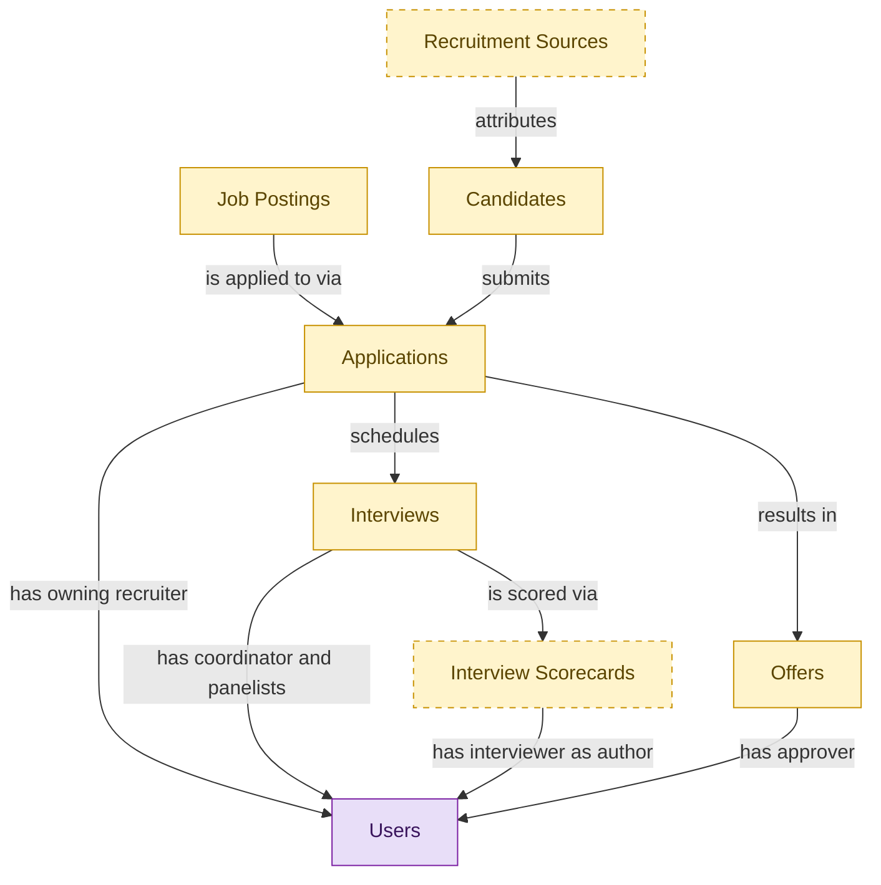

# Hiring Starter

## 1. Overview

Entry-tier deployable for a basic hiring workflow: post jobs, capture applications, run interviews, generate offers. Embeds the canonical masters from the full ATS modules and inherits their lifecycle states. Ships three baseline permissions and one system skill; no workflow gates, no requisition approvals, no background-check orchestration, no pre-employee reconciliation. Upgrades to the full ATS surface without tenant data migration via the embedded-master demotion path.

## 2. Entity summary

| Name | Description |
| --- | --- |
| Applications | A candidate's submission against a specific requisition. Carries pipeline stage, status (active / rejected / withdrawn / hired), source, and the full evaluation history. |
| Candidates | Person known to the recruiting org, with or without an active application. Carries contact details, resume, tags, GDPR consent, and source. Distinct from Employee until hired. |
| Interview Scorecards | Structured interviewer feedback against a defined rubric: per-competency ratings, written notes, and a hire/no-hire recommendation. |
| Interviews | Scheduled assessment event between a candidate and one or more interviewers. Carries time, location/medium, panel, interview kit, and outcome. |
| Job Postings | Published, candidate-facing version of a requisition on a career site or job board. One requisition can have many postings (per board, language, or region). |
| Offers | Formal employment offer extended to a candidate. Carries compensation components, start date, terms, approval chain, and status (draft / approved / sent / accepted / declined / rescinded). |
| Recruitment Sources | Channel a candidate came from: job board, referral, agency, sourcing campaign, career event, or inbound. Used for source-of-hire analytics and channel ROI. |
| Users | Semantius platform-owned user table. Referenced from domain `data_objects` via `data_object_relationships` for assignee / author / approver / creator edges. Not surfaced in domain-level analytics (Signal 1/2 ignore `kind='platform_builtin'`). |

## 3. Entities catalog

| # | data_object | role | mastered in | necessity | pattern flags | notes |
| ---: | --- | --- | --- | --- | --- | --- |
| 1 | `job_applications` (Applications) | embedded_master | `ats-recruitment-pipeline` | required | personal_content | - |
| 2 | `candidates` (Candidates) | embedded_master | `ats-candidate-crm` | required | personal_content | - |
| 3 | `interview_scorecards` (Interview Scorecards) | embedded_master | `ats-interviews` | optional | personal_content, submit_lock | - |
| 4 | `interviews` (Interviews) | embedded_master | `ats-interviews` | required | - | - |
| 5 | `job_postings` (Job Postings) | embedded_master | `ats-recruitment-pipeline` | required | - | - |
| 6 | `job_offers` (Offers) | embedded_master | `ats-offers` | required | personal_content, single_approver | - |
| 7 | `recruitment_sources` (Recruitment Sources) | embedded_master | `ats-candidate-crm` | optional | - | - |
| 8 | `users` (Users) | consumer | _(platform built-in)_ | required | - | - |

## 4. Aliases and industry synonyms

_(no industry-scoped aliases or non-synonym alias types loaded for this scope; generic synonyms are omitted as common knowledge.)_

## 5. Relationships

### 5.1 Intra-scope edges

| from | verb | to | cardinality | kind | necessity | owner_side | notes |
| --- | --- | --- | --- | --- | --- | --- | --- |
| `job_postings` | is applied to via | `job_applications` | one_to_many | reference | required | source | - |
| `candidates` | submits | `job_applications` | one_to_many | reference | required | target | - |
| `recruitment_sources` | attributes | `candidates` | one_to_many | reference | required | target | - |
| `job_applications` | schedules | `interviews` | one_to_many | reference | required | source | - |
| `interviews` | is scored via | `interview_scorecards` | one_to_many | reference | required | source | - |
| `job_applications` | results in | `job_offers` | one_to_many | reference | required | source | - |

### 5.2 Built-in edges (`users` and other platform built-ins)

| from | verb | to | cardinality | necessity | owner_side | notes |
| --- | --- | --- | --- | --- | --- | --- |
| `users` | logged events | `asset_lifecycle_events` | one_to_many | optional | source | - |
| `users` | owned applications | `enterprise_applications` | one_to_many | optional | source | - |
| `users` | owned platforms | `technology_platforms` | one_to_many | optional | source | - |
| `users` | owned interfaces | `application_interfaces` | one_to_many | optional | source | - |
| `users` | owned capability maps | `business_capability_maps` | one_to_many | optional | source | - |
| `users` | authored scores | `application_value_scores` | one_to_many | optional | source | - |
| `users` | authored assessments | `technology_fit_assessments` | one_to_many | optional | source | - |
| `users` | recorded costs | `application_costs` | one_to_many | optional | source | - |
| `users` | owned CIs | `configuration_items` | one_to_many | optional | source | - |
| `users` | owned classes | `ci_classes` | one_to_many | optional | source | - |
| `users` | authored baselines | `ci_baselines` | one_to_many | optional | source | - |
| `users` | owned service maps | `service_maps` | one_to_many | optional | source | - |
| `users` | created relationships | `ci_relationships` | one_to_many | optional | source | - |
| `users` | assigned hardware | `hardware_assets` | one_to_many | optional | source | - |
| `users` | custodian of assets | `hardware_assets` | one_to_many | optional | source | - |
| `users` | recorded disposals | `hardware_disposal_records` | one_to_many | optional | source | - |
| `users` | manages warranties | `hardware_warranties` | one_to_many | optional | source | - |
| `users` | manages stock | `spare_parts_inventory` | one_to_many | optional | source | - |
| `users` | curates models | `hardware_models` | one_to_many | optional | source | - |
| `users` | owned contracts | `asset_contracts` | one_to_many | optional | source | - |
| `users` | owned channels | `chat_channels` | one_to_many | optional | source | - |
| `users` | created channels | `chat_channels` | one_to_many | required | source | - |
| `users` | posted messages | `chat_messages` | one_to_many | required | source | - |
| `users` | started threads | `chat_threads` | one_to_many | required | source | - |
| `users` | channel memberships | `channel_members` | one_to_many | required | source | - |
| `users` | started huddles | `chat_huddles` | one_to_many | required | source | - |
| `users` | uploaded attachments | `chat_message_attachments` | one_to_many | optional | source | - |
| `users` | shared files | `channel_file_shares` | one_to_many | optional | source | - |
| `users` | issued invitations | `external_guest_invitations` | one_to_many | required | source | - |
| `users` | owns audit plan | `audit_plans` | one_to_many | required | source | - |
| `users` | leads engagement | `audit_engagements` | one_to_many | required | source | - |
| `users` | owns | `courses` | one_to_many | optional | source | - |
| `users` | owns finding | `audit_findings` | one_to_many | optional | source | - |
| `users` | approves recommendation | `audit_recommendations` | one_to_many | optional | source | - |
| `users` | signs report | `audit_reports` | one_to_many | required | source | - |
| `users` | performs control test | `control_tests` | one_to_many | required | source | - |
| `users` | owns follow-up | `follow_up_actions` | one_to_many | required | source | - |
| `users` | authored | `work_papers` | one_to_many | required | source | - |
| `users` | curates | `learning_paths` | one_to_many | optional | source | - |
| `users` | owns | `benefit_plans` | one_to_many | optional | source | - |
| `users` | submitted intake | `legal_intake_requests` | one_to_many | required | source | - |
| `users` | leads matter | `in_house_legal_matters` | one_to_many | required | source | - |
| `users` | authored advice | `legal_advice_records` | one_to_many | required | source | - |
| `users` | owns docket | `legal_case_dockets` | one_to_many | required | source | - |
| `users` | issued hold | `legal_holds` | one_to_many | required | source | - |
| `users` | runs discovery | `ediscovery_requests` | one_to_many | required | source | - |
| `users` | approves engagement | `outside_counsel_engagements` | one_to_many | required | source | - |
| `users` | responds to inquiry | `regulatory_inquiries` | one_to_many | required | source | - |
| `users` | approves | `butcher_orders` | one_to_many | required | target | - |
| `users` | owns plan | `test_plans` | one_to_many | required | source | - |
| `users` | authored case | `test_cases` | one_to_many | required | source | - |
| `users` | executed run | `test_runs` | one_to_many | optional | source | - |
| `users` | owns defect | `test_defects` | one_to_many | optional | source | - |
| `users` | maintains script | `automation_scripts` | one_to_many | required | source | - |
| `users` | owns suite | `test_suites` | one_to_many | optional | source | - |
| `users` | administers environment | `test_environments` | one_to_many | optional | source | - |
| `users` | mapped trace | `requirements_to_test_traceability` | one_to_many | optional | source | - |
| `users` | owns | `hr_cases` | one_to_many | optional | source | - |
| `users` | hosts visitor | `host_assignments` | one_to_many | required | source | - |
| `users` | created registration | `visitor_registrations` | one_to_many | optional | source | - |
| `users` | processed check-in | `visitor_check_ins` | one_to_many | optional | source | - |
| `users` | reviewed screening | `visitor_watchlist_screenings` | one_to_many | optional | source | - |
| `users` | owns evacuation roster | `visitor_evacuation_lists` | one_to_many | optional | source | - |
| `users` | administers audit log | `visitor_audit_logs` | one_to_many | optional | source | - |
| `users` | printed badge | `visitor_badges` | one_to_many | optional | source | - |
| `users` | witnessed nda | `visitor_nda_acknowledgements` | one_to_many | optional | source | - |
| `users` | is assignee for | `customer_cases` | one_to_many | optional | source | - |
| `users` | created | `customer_cases` | one_to_many | optional | source | - |
| `users` | owns | `customer_entitlements` | one_to_many | optional | source | - |
| `users` | submitted | `csat_responses` | one_to_many | optional | source | - |
| `users` | authored | `knowledge_articles` | one_to_many | optional | source | - |
| `users` | approved | `knowledge_articles` | one_to_many | optional | source | - |
| `users` | authors | `pim_products` | one_to_many | required | source | PIM author / content editor of the product record. |
| `users` | approves | `pim_products` | one_to_many | optional | source | Merchandiser who gates publish. |
| `users` | uploads | `pim_digital_assets` | one_to_many | required | source | DAM contributor who uploaded the asset. |
| `users` | approves | `pim_digital_assets` | one_to_many | optional | source | Brand / rights reviewer who clears the asset. |
| `users` | translates | `pim_translations` | one_to_many | optional | source | Human translator or post-edit reviewer. |
| `users` | initiates | `pim_syndication_jobs` | one_to_many | optional | source | Admin / merchandising-ops user who launched the publish run (where not auto-triggered). |
| `users` | is_assigned_to_tickets | `msp_tickets` | one_to_many | optional | target | - |
| `users` | opens_tickets | `msp_tickets` | one_to_many | optional | target | - |
| `users` | logs_time_entries | `msp_time_entries` | one_to_many | required | target | - |
| `users` | approves_time_entries | `msp_time_entries` | one_to_many | optional | target | - |
| `users` | manages_contracts | `msp_contracts` | one_to_many | optional | target | - |
| `users` | issues_invoices | `msp_invoices` | one_to_many | optional | target | - |
| `users` | owns_clients | `msp_clients` | one_to_many | optional | target | - |
| `users` | leads_as_attorney | `legal_matters` | one_to_many | required | target | - |
| `users` | supervises | `legal_matters` | one_to_many | optional | target | - |
| `users` | bills_as_partner | `legal_matters` | one_to_many | required | target | - |
| `users` | requests | `conflict_checks` | one_to_many | required | target | - |
| `users` | reviews_as_partner | `conflict_checks` | one_to_many | optional | target | - |
| `users` | drafts | `engagement_letters` | one_to_many | required | target | - |
| `users` | signs_as_partner | `engagement_letters` | one_to_many | required | target | - |
| `users` | manages_as_bookkeeper | `trust_accounts` | one_to_many | required | target | - |
| `users` | files | `external_court_filings` | one_to_many | required | target | - |
| `users` | prepares | `client_invoices` | one_to_many | required | target | - |
| `users` | approves_as_partner | `client_invoices` | one_to_many | required | target | - |
| `users` | logs_as_timekeeper | `time_entries` | one_to_many | required | target | - |
| `real_estate_listings` | has listing agent | `users` | many_to_many | required | source | - |
| `tour_appointments` | has showing agent | `users` | many_to_many | required | source | - |
| `real_estate_transactions` | has listing-side agent | `users` | many_to_many | required | source | - |
| `real_estate_transactions` | has buyer-side agent | `users` | many_to_many | optional | source | - |
| `disclosure_documents` | has preparer | `users` | many_to_many | required | source | - |
| `commission_splits` | has recipient agent | `users` | many_to_many | required | source | - |
| `commission_splits` | has approving broker | `users` | many_to_many | required | source | - |
| `users` | requests | `iga_access_requests` | one_to_many | required | source | - |
| `users` | approves | `iga_access_requests` | one_to_many | optional | source | - |
| `users` | reviews | `iga_access_certifications` | one_to_many | required | source | - |
| `users` | owns | `iga_entitlement_definitions` | one_to_many | optional | source | - |
| `users` | implicated_in | `iga_sod_violations` | one_to_many | required | source | - |
| `users` | targeted_by | `iga_provisioning_events` | one_to_many | required | target | - |
| `users` | owns | `customers` | one_to_many | optional | source | - |
| `users` | authored | `content_entries` | one_to_many | required | source | - |
| `users` | manages release | `content_releases` | one_to_many | optional | source | - |
| `users` | maintains schema | `content_types` | one_to_many | optional | source | - |
| `users` | maintains workflow | `editorial_workflows` | one_to_many | optional | source | - |
| `users` | administers | `content_environments` | one_to_many | optional | source | - |
| `users` | curates locale | `content_locales` | one_to_many | optional | source | - |
| `users` | uploaded | `digital_assets` | one_to_many | required | source | - |
| `users` | owns | `legal_contracts` | one_to_many | optional | source | - |
| `users` | approved | `legal_contracts` | one_to_many | optional | source | - |
| `users` | drafted | `legal_contracts` | one_to_many | optional | source | - |
| `users` | owns | `contract_templates` | one_to_many | optional | source | - |
| `users` | approved | `contract_templates` | one_to_many | optional | source | - |
| `users` | is obligation owner for | `contract_obligations` | one_to_many | optional | source | - |
| `users` | signed | `signature_records` | one_to_many | optional | source | - |
| `users` | approved | `contract_clauses` | one_to_many | optional | source | - |
| `users` | reviews | `performance_reviews` | one_to_many | required | target | - |
| `users` | organizes_room_reservations | `room_reservations` | one_to_many | required | target | - |
| `users` | designs | `org_designs` | one_to_many | optional | source | - |
| `users` | books_desks | `desk_bookings` | one_to_many | required | target | - |
| `users` | requests_workplace_services | `workplace_service_requests` | one_to_many | required | target | - |
| `users` | assigned_to_workplace_services | `workplace_service_requests` | one_to_many | optional | target | - |
| `users` | authors_workplace_feedback | `workplace_experience_feedback` | one_to_many | required | target | - |
| `users` | owns | `customers` | one_to_many | required | source | - |
| `users` | packs | `csa_share_packs` | one_to_many | optional | target | - |
| `users` | requests | `absence_requests` | one_to_many | required | source | - |
| `users` | places | `butcher_orders` | one_to_many | required | target | - |
| `users` | publishes | `harvest_forecasts` | one_to_many | required | target | - |
| `employees` | is_linked_to | `users` | one_to_one | optional | target | - |
| `users` | manages | `hcm_positions` | one_to_many | optional | source | - |
| `users` | leads | `org_units` | one_to_many | optional | source | - |
| `users` | approves | `employment_contracts` | one_to_many | optional | source | - |
| `users` | records | `employment_events` | one_to_many | optional | source | - |
| `users` | approves | `absence_requests` | one_to_many | optional | source | - |
| `users` | assigned | `asset_lifecycle_events` | one_to_many | optional | source | - |
| `users` | owns | `job_profiles` | one_to_many | optional | source | - |
| `users` | owns | `cost_centers` | one_to_many | optional | source | - |
| `users` | sponsors | `contingent_workers` | one_to_many | optional | source | - |
| `users` | onboards | `onboarding_journeys` | one_to_many | required | source | - |
| `users` | owns | `onboarding_journeys` | one_to_many | optional | source | - |
| `users` | performs | `onboarding_tasks` | one_to_many | optional | source | - |
| `users` | created | `onboarding_tasks` | one_to_many | optional | source | - |
| `users` | mentors | `buddy_assignments` | one_to_many | required | source | - |
| `users` | maintains | `onboarding_plans` | one_to_many | optional | source | - |
| `users` | sends | `welcome_communications` | one_to_many | optional | source | - |
| `users` | approves | `onboarding_document_collections` | one_to_many | optional | source | - |
| `users` | manages | `onboarding_cohorts` | one_to_many | optional | source | - |
| `users` | authors | `courses` | one_to_many | optional | source | - |
| `users` | enrolls in | `course_enrollments` | one_to_many | required | source | - |
| `users` | assigns | `course_enrollments` | one_to_many | optional | source | - |
| `users` | earns | `learning_records` | one_to_many | required | source | - |
| `users` | must complete | `compliance_assignments` | one_to_many | required | source | - |
| `users` | owns | `compliance_assignments` | one_to_many | optional | source | - |
| `users` | holds | `learner_certifications` | one_to_many | required | source | - |
| `users` | holds | `skill_profiles` | one_to_many | required | source | - |
| `users` | enrolls | `benefit_enrollments` | one_to_many | required | source | - |
| `users` | approves | `benefit_enrollments` | one_to_many | optional | source | - |
| `users` | declares | `life_events` | one_to_many | required | source | - |
| `users` | approves | `life_events` | one_to_many | optional | source | - |
| `users` | manages | `benefit_open_enrollments` | one_to_many | optional | source | - |
| `users` | manages | `benefit_carriers` | one_to_many | optional | source | - |
| `users` | monitors | `carrier_feeds` | one_to_many | optional | source | - |
| `users` | declares | `benefit_dependents` | one_to_many | required | source | - |
| `users` | owns | `survey_campaigns` | one_to_many | required | source | - |
| `users` | creates | `survey_campaigns` | one_to_many | optional | source | - |
| `users` | submits | `survey_responses` | one_to_many | optional | source | - |
| `users` | owns | `action_plans` | one_to_many | required | source | - |
| `action_plans` | is_assigned_to | `users` | many_to_many | optional | target | - |
| `users` | authors | `pulse_questions` | one_to_many | optional | source | - |
| `users` | owns | `engagement_drivers` | one_to_many | optional | source | - |
| `users` | raises | `hr_cases` | one_to_many | required | source | - |
| `users` | works on | `hr_cases` | one_to_many | optional | source | - |
| `users` | approves | `hr_cases` | one_to_many | optional | source | - |
| `users` | manages | `case_categories` | one_to_many | optional | source | - |
| `users` | authors | `knowledge_articles` | one_to_many | optional | source | - |
| `users` | requests | `service_requests` | one_to_many | required | source | - |
| `users` | fulfills | `service_requests` | one_to_many | optional | source | - |
| `users` | assigned incidents | `service_incidents` | one_to_many | optional | source | - |
| `users` | reported incidents | `service_incidents` | one_to_many | required | source | - |
| `users` | assigned requests | `service_requests` | one_to_many | optional | source | - |
| `users` | submitted requests | `service_requests` | one_to_many | required | source | - |
| `users` | owned problems | `service_problems` | one_to_many | optional | source | - |
| `users` | owned changes | `service_changes` | one_to_many | optional | source | - |
| `service_changes` | is_approved_by | `users` | many_to_many | optional | target | - |
| `users` | authored articles | `knowledge_articles` | one_to_many | required | source | - |
| `users` | owned catalog items | `service_catalog_items` | one_to_many | optional | source | - |
| `users` | owned SLAs | `service_slas` | one_to_many | optional | source | - |
| `users` | owns | `staffing_suppliers` | one_to_many | optional | source | - |
| `users` | manages | `contingent_workers` | one_to_many | optional | source | - |
| `users` | approves | `contingent_timesheets` | one_to_many | optional | source | - |
| `users` | approves | `contingent_invoices` | one_to_many | optional | source | - |
| `users` | dispatches | `pm_work_orders` | one_to_many | optional | source | - |
| `users` | approves | `rate_cards` | one_to_many | optional | source | - |
| `users` | owns | `suppliers` | one_to_many | optional | source | - |
| `users` | runs | `supplier_onboardings` | one_to_many | optional | source | - |
| `users` | approves | `supplier_onboardings` | one_to_many | optional | source | - |
| `users` | approves | `supplier_qualifications` | one_to_many | optional | source | - |
| `users` | authors | `supplier_risk_assessments` | one_to_many | optional | source | - |
| `users` | approves | `supplier_risk_assessments` | one_to_many | optional | source | - |
| `users` | owns | `supplier_scorecards` | one_to_many | optional | source | - |
| `users` | uploads | `supplier_certifications` | one_to_many | optional | source | - |
| `users` | authored | `content_documents` | one_to_many | required | source | - |
| `users` | owns | `content_documents` | one_to_many | optional | source | - |
| `users` | owns | `document_folders` | one_to_many | optional | source | - |
| `users` | revised | `document_versions` | one_to_many | required | source | - |
| `users` | stewards | `document_classifications` | one_to_many | optional | source | - |
| `users` | maintains | `records_retention_policies` | one_to_many | optional | source | - |
| `users` | edits | `content_entries` | one_to_many | optional | source | - |
| `users` | performs | `eam_work_orders` | one_to_many | optional | source | - |
| `users` | raised | `eam_work_orders` | one_to_many | required | source | - |
| `users` | owns asset | `industrial_assets` | one_to_many | optional | source | - |
| `users` | maintains schedule | `equipment_pm_schedules` | one_to_many | optional | source | - |
| `users` | owns | `digital_assets` | one_to_many | optional | source | - |
| `users` | approves | `digital_assets` | one_to_many | optional | source | - |
| `users` | owns device | `medical_devices` | one_to_many | optional | source | - |
| `users` | performed maintenance | `device_maintenance_logs` | one_to_many | required | source | - |
| `users` | performed calibration | `device_calibration_records` | one_to_many | required | source | - |
| `users` | operated cycle | `sterilization_cycles` | one_to_many | required | source | - |
| `users` | reported incident | `device_incident_reports` | one_to_many | required | source | - |
| `users` | manages recall | `device_recalls` | one_to_many | optional | source | - |
| `users` | assigned work orders | `clinical_engineering_work_orders` | one_to_many | optional | source | - |
| `users` | opened work orders | `clinical_engineering_work_orders` | one_to_many | required | source | - |
| `users` | assigned applications | `permit_applications` | one_to_many | optional | source | - |
| `users` | submitted applications | `permit_applications` | one_to_many | required | source | - |
| `users` | owns license | `license_records` | one_to_many | optional | source | - |
| `users` | processes renewals | `license_renewals` | one_to_many | optional | source | - |
| `users` | assigned inspections | `permit_inspections` | one_to_many | required | source | - |
| `users` | issued violations | `code_violations` | one_to_many | required | source | - |
| `users` | assessed fees | `regulatory_fees` | one_to_many | optional | source | - |
| `users` | assigned tasks | `store_tasks` | one_to_many | optional | source | - |
| `users` | created tasks | `store_tasks` | one_to_many | required | source | - |
| `users` | assigned checklists | `store_associate_checklists` | one_to_many | optional | source | - |
| `users` | publishes schedules | `retail_labour_schedules` | one_to_many | required | source | - |
| `users` | conducted audits | `store_audits` | one_to_many | required | source | - |
| `users` | verified planogram | `planogram_compliance_records` | one_to_many | required | source | - |
| `users` | submitted mystery shop | `mystery_shopper_records` | one_to_many | required | source | - |
| `users` | submitted reports | `expense_reports` | one_to_many | required | source | - |
| `users` | approved reports | `expense_reports` | one_to_many | optional | source | - |
| `users` | created lines | `expense_lines` | one_to_many | required | source | - |
| `users` | holds cards | `corporate_cards` | one_to_many | required | source | - |
| `users` | charged transactions | `card_transactions` | one_to_many | optional | source | - |
| `users` | booked travel | `travel_bookings` | one_to_many | required | source | - |
| `users` | approved travel | `travel_bookings` | one_to_many | optional | source | - |
| `users` | owns policy | `expense_policies` | one_to_many | optional | source | - |
| `users` | assigned items | `work_items` | one_to_many | optional | source | - |
| `users` | created items | `work_items` | one_to_many | required | source | - |
| `users` | owns projects | `work_projects` | one_to_many | required | source | - |
| `users` | owns OKR | `okr_objectives` | one_to_many | required | source | - |
| `users` | authored automations | `work_automations` | one_to_many | required | source | - |
| `job_requisitions` | has recruiter and hiring manager | `users` | many_to_many | required | source | - |
| `job_applications` | has owning recruiter | `users` | many_to_many | required | source | - |
| `interviews` | has coordinator and panelists | `users` | many_to_many | required | source | - |
| `interview_scorecards` | has interviewer as author | `users` | many_to_many | required | source | - |
| `job_offers` | has approver | `users` | many_to_many | required | source | - |
| `candidate_referrals` | has referring employee | `users` | many_to_many | required | source | - |
| `users` | leads | `vc_deals` | one_to_many | optional | target | - |
| `users` | sponsors | `vc_deals` | one_to_many | optional | target | - |
| `users` | authors | `investment_memos` | one_to_many | optional | target | - |
| `users` | owns | `relationship_records` | one_to_many | optional | target | - |
| `users` | manages | `funds` | one_to_many | optional | target | - |
| `users` | signs | `lp_commitments` | one_to_many | optional | target | - |
| `users` | approves | `capital_calls` | one_to_many | optional | target | - |
| `users` | approves | `fund_distributions` | one_to_many | optional | target | - |
| `users` | observes | `portfolio_companies` | one_to_many | optional | target | - |
| `users` | computes | `portco_valuations` | one_to_many | optional | target | - |
| `users` | administers | `cap_tables` | one_to_many | optional | target | - |
| `users` | signs off | `valuations_409a` | one_to_many | optional | target | - |
| `users` | models | `exit_scenarios` | one_to_many | optional | target | - |
| `users` | executes | `secondary_transactions` | one_to_many | optional | target | - |
| `users` | holds | `employee_equity_accounts` | one_to_many | optional | target | - |
| `users` | forms | `fund_formations` | one_to_many | optional | target | - |
| `users` | organizes | `spvs` | one_to_many | optional | target | - |
| `pre_employees` | has owning hr_coordinator | `users` | one_to_many | required | source | - |
| `users` | owns | `saas_applications` | one_to_many | required | target | - |
| `users` | granted | `saas_app_assignments` | one_to_many | required | target | - |
| `users` | generates | `saas_usage_metrics` | one_to_many | required | target | - |
| `users` | manages | `saas_subscriptions` | one_to_many | required | target | - |
| `users` | triggered | `shadow_it_apps` | one_to_many | optional | target | - |
| `users` | owns | `crm_leads` | one_to_many | required | source | - |
| `users` | owns | `crm_opportunities` | one_to_many | required | source | - |
| `users` | owns | `crm_contacts` | one_to_many | optional | source | - |
| `users` | creates | `sales_activities` | one_to_many | required | source | - |
| `users` | authors | `feedback_records` | one_to_many | required | target | - |
| `users` | receives | `feedback_records` | one_to_many | required | target | - |
| `users` | is_reviewed_in | `performance_reviews` | one_to_many | required | target | - |
| `users` | owns | `performance_goals` | one_to_many | required | target | - |
| `users` | calibrates_in | `talent_calibrations` | many_to_many | required | target | - |
| `users` | is_incumbent_in | `succession_plans` | one_to_many | optional | target | - |
| `users` | is_successor_in | `succession_plans` | many_to_many | required | target | - |
| `users` | is_placed_in | `nine_box_placements` | one_to_many | required | target | - |
| `users` | declares | `career_aspirations` | one_to_many | required | target | - |
| `inv_stock_movements` | recorded_by | `users` | one_to_many | required | target | - |
| `inv_stock_transfers` | requested_by | `users` | one_to_many | required | target | - |
| `inv_stock_transfers` | approved_by | `users` | one_to_many | optional | target | - |
| `inv_cycle_counts` | counted_by | `users` | one_to_many | required | target | - |
| `inv_cycle_counts` | variance_approved_by | `users` | one_to_many | required | target | - |
| `inv_reorder_rules` | owned_by | `users` | one_to_many | optional | target | - |
| `org_units` | has members | `users` | one_to_many | optional | target | - |
| `locations` | houses | `users` | one_to_many | optional | target | - |
| `users` | originates | `engineering_change_orders` | one_to_many | required | source | - |
| `users` | approves | `engineering_change_orders` | many_to_many | required | source | - |
| `users` | owns | `engineering_parts` | one_to_many | required | source | - |
| `users` | checks_out | `cad_models` | one_to_many | optional | source | - |
| `users` | releases | `cad_drawings` | one_to_many | required | source | - |
| `users` | authors | `engineering_requirements` | one_to_many | required | source | - |
| `users` | approves_compliance | `product_compliance_declarations` | one_to_many | required | source | - |
| `users` | approves | `workforce_plans` | one_to_many | optional | source | - |
| `users` | sponsors | `headcount_plans` | one_to_many | optional | source | - |
| `users` | prepares | `position_demand_forecasts` | one_to_many | optional | source | - |
| `users` | prepares | `skills_gap_analyses` | one_to_many | optional | source | - |
| `users` | authors | `workforce_scenarios` | one_to_many | optional | source | - |
| `users` | owns | `workforce_cost_projections` | one_to_many | optional | source | - |
| `users` | owns_application | `enterprise_applications` | one_to_many | required | source | - |
| `users` | owns_technology_platform | `technology_platforms` | one_to_many | required | source | - |
| `users` | owns_application_interface | `application_interfaces` | one_to_many | optional | source | - |
| `users` | owns_business_capability_map | `business_capability_maps` | one_to_many | optional | source | - |
| `users` | assesses_technology_fit | `technology_fit_assessments` | one_to_many | required | source | - |
| `users` | evaluates_application_value | `application_value_scores` | one_to_many | optional | source | - |
| `strategy_maps` | owned_by | `users` | one_to_many | required | source | - |
| `operating_reviews` | facilitated_by | `users` | one_to_many | required | source | - |
| `operating_reviews` | attended_by | `users` | many_to_many | optional | source | - |
| `strategy_decisions` | decided_by | `users` | one_to_many | required | source | - |
| `users` | project_manager_of | `service_projects` | one_to_many | required | target | - |
| `users` | assigned_to | `project_tasks` | many_to_many | optional | target | - |
| `users` | staffed_on | `project_assignments` | one_to_many | required | target | - |
| `users` | approves | `project_billing_milestones` | one_to_many | required | target | - |
| `users` | has_skill_profile | `resource_skill_inventories` | one_to_many | required | target | - |
| `users` | allocates | `project_resource_allocations` | one_to_many | required | target | - |
| `users` | owns | `csa_memberships` | one_to_many | required | target | - |
| `users` | rings | `farmers_market_sales` | one_to_many | required | target | - |
| `users` | places | `wholesale_orders` | one_to_many | required | target | - |
| `users` | confirms | `wholesale_orders` | one_to_many | required | target | - |
| `users` | drives | `delivery_routes` | one_to_many | required | target | - |
| `users` | administers | `farm_storefronts` | one_to_many | required | target | - |
| `users` | hosts | `pickup_locations` | one_to_many | optional | target | - |

### 5.3 Cross-scope edges

| from | verb | to | cardinality | necessity | notes |
| --- | --- | --- | --- | --- | --- |
| `job_profiles` | feeds | `job_postings` | one_to_many | optional | - |
| `skill_profiles` | feeds | `candidates` | one_to_many | optional | - |
| `job_requisitions` | is advertised through | `job_postings` | one_to_many | required | - |
| `job_requisitions` | receives | `job_applications` | one_to_many | required | - |
| `candidate_referrals` | introduces | `candidates` | one_to_many | required | - |
| `recruitment_agencies` | sources | `candidates` | one_to_many | required | - |
| `recruitment_events` | attracts | `candidates` | one_to_many | required | - |
| `talent_pools` | groups | `candidates` | many_to_many | required | - |
| `job_applications` | requires | `candidate_assessments` | one_to_many | required | - |
| `job_offers` | is contingent on | `background_checks` | one_to_many | required | - |
| `job_offers` | spawns | `onboarding_journeys` | one_to_one | required | - |
| `job_offers` | triggers | `benefit_enrollments` | one_to_one | required | - |
| `job_offers` | seeds | `compensation_statements` | one_to_one | required | - |
| `candidates` | becomes | `employees` | one_to_one | required | - |
| `job_offers` | spawns pre-employee record | `pre_employees` | one_to_one | required | - |
| `candidates` | becomes pre-employee | `pre_employees` | one_to_one | required | - |

## 6. Cross-domain context

### 6.1 Master consumers (other modules / domains that embed this scope's masters)

### 6.2 Outbound handoffs (events this scope publishes)

_(no outbound `handoffs` whose payload is in this scope.)_

### 6.3 Inbound handoffs (events this scope reacts to)

_(no inbound `handoffs` whose payload is in this scope.)_

### 6.4 Master providers (modules / domains that own masters this scope embeds)

| data_object | role here | necessity | canonical owner(s) | slice notes |
| --- | --- | --- | --- | --- |
| `candidates` | embedded_master | required | ATS-CANDIDATE-CRM (ATS) | - |
| `interview_scorecards` | embedded_master | optional | ATS-INTERVIEWS (ATS) | - |
| `interviews` | embedded_master | required | ATS-INTERVIEWS (ATS) | - |
| `job_applications` | embedded_master | required | ATS-RECRUITMENT-PIPELINE (ATS) | - |
| `job_offers` | embedded_master | required | ATS-OFFERS (ATS) | - |
| `job_postings` | embedded_master | required | ATS-RECRUITMENT-PIPELINE (ATS) | - |
| `recruitment_sources` | embedded_master | optional | ATS-CANDIDATE-CRM (ATS) | - |
| `users` | consumer | required | _(platform built-in)_ | - |

## 7. Lifecycle states (per touched entity)

### `candidates` (Candidate)

_This scope holds `candidates` as **embedded_master**; the canonical state machine is owned by `ATS-CANDIDATE-CRM`._

| order | state_name | initial? | terminal? | requires_permission? | derived gate | description |
| --- | --- | --- | --- | --- | --- | --- |
| 1 | `prospect` | ✓ | - | - | - | Person known to the recruiting org with no active application. |
| 2 | `active` | - | - | - | - | Candidate has at least one open application or is actively engaged. |
| 3 | `hired` | - | ✓ | ✓ | `ats-candidate-crm:hire_candidate` | Candidate accepted an offer and converted to employee. |
| 4 | `do_not_hire` | - | ✓ | ✓ | `ats-candidate-crm:flag_do_not_hire` | Candidate flagged as ineligible for future consideration; gated decision. |
| 5 | `archived` | - | ✓ | - | - | Candidate kept in the database but not active in any pipeline. |

### `interview_scorecards` (Interview Scorecard)

_This scope holds `interview_scorecards` as **embedded_master**; the canonical state machine is owned by `ATS-INTERVIEWS`._

| order | state_name | initial? | terminal? | requires_permission? | derived gate | description |
| --- | --- | --- | --- | --- | --- | --- |
| 1 | `draft` | ✓ | - | - | - | Interviewer is filling in ratings and notes against the rubric. |
| 2 | `submitted` | - | ✓ | ✓ | `ats-interviews:submitted_interview_scorecard` | Scorecard submitted and locked; hire/no-hire recommendation recorded. |

### `interviews` (Interview)

_This scope holds `interviews` as **embedded_master**; the canonical state machine is owned by `ATS-INTERVIEWS`._

| order | state_name | initial? | terminal? | requires_permission? | derived gate | description |
| --- | --- | --- | --- | --- | --- | --- |
| 1 | `scheduled` | ✓ | - | - | - | Interview booked with candidate, panel, time, and medium. |
| 2 | `confirmed` | - | - | - | - | Candidate and panel confirmed attendance. |
| 3 | `completed` | - | ✓ | - | - | Interview took place; scorecards are being collected. |
| 4 | `no_show` | - | ✓ | - | - | Candidate or panel did not attend; interview did not occur. |
| 5 | `cancelled` | - | ✓ | - | - | Interview cancelled before it took place. |
| 6 | `rescheduled` | - | ✓ | - | - | Original slot abandoned in favor of a new scheduled interview record. |

### `job_applications` (Application)

_This scope holds `job_applications` as **embedded_master**; the canonical state machine is owned by `ATS-RECRUITMENT-PIPELINE`._

| order | state_name | initial? | terminal? | requires_permission? | derived gate | description |
| --- | --- | --- | --- | --- | --- | --- |
| 1 | `applied` | ✓ | - | - | - | Candidate submitted an application against the requisition. |
| 2 | `screening` | - | - | - | - | Recruiter is reviewing resume and qualifications. |
| 3 | `interviewing` | - | - | - | - | Candidate is progressing through interview loops. |
| 4 | `offer_extended` | - | - | - | - | An offer has been generated and is in flight for this application. |
| 5 | `hired` | - | ✓ | ✓ | `ats-pre-employee-record:hire_candidate` | Candidate accepted the offer and was hired; gated transition. |
| 6 | `rejected` | - | ✓ | - | - | Application closed without progression by recruiter or hiring manager. |
| 7 | `withdrawn` | - | ✓ | - | - | Candidate withdrew their application. |

### `job_offers` (Offer)

_This scope holds `job_offers` as **embedded_master**; the canonical state machine is owned by `ATS-OFFERS`._

| order | state_name | initial? | terminal? | requires_permission? | derived gate | description |
| --- | --- | --- | --- | --- | --- | --- |
| 1 | `draft` | ✓ | - | - | - | Recruiter is composing offer terms and compensation components. |
| 2 | `pending_approval` | - | - | - | - | Offer routed to the designated approver for sign-off. |
| 3 | `approved` | - | - | ✓ | `ats-offers:approve_offer` | Approver signed off; offer is ready to send. |
| 4 | `sent` | - | - | - | - | Offer delivered to the candidate. |
| 5 | `accepted` | - | ✓ | - | - | Candidate accepted the offer. |
| 6 | `declined` | - | ✓ | - | - | Candidate declined the offer. |
| 7 | `rescinded` | - | ✓ | ✓ | `ats-offers:rescind_offer` | Offer withdrawn by the employer after being sent; gated action. |

### `job_postings` (Job Posting)

_This scope holds `job_postings` as **embedded_master**; the canonical state machine is owned by `ATS-RECRUITMENT-PIPELINE`._

| order | state_name | initial? | terminal? | requires_permission? | derived gate | description |
| --- | --- | --- | --- | --- | --- | --- |
| 1 | `draft` | ✓ | - | - | - | Posting being composed against a requisition for a specific board or region. |
| 2 | `published` | - | - | ✓ | `ats-recruitment-pipeline:publish_posting` | Posting is live on the target channel; gated publish step. |
| 3 | `paused` | - | - | - | - | Posting temporarily hidden from the channel. |
| 4 | `expired` | - | ✓ | - | - | Posting reached its scheduled end date. |
| 5 | `closed` | - | ✓ | - | - | Posting taken down because the requisition is filled or cancelled. |

## 8. Permissions and business rules (derived)

### 8.1 Permissions

| permission | tier | description | included in `:admin`? |
| --- | --- | --- | --- |
| `hiring-starter:read` | baseline-read | Read access to every entity in the module | ✓ |
| `hiring-starter:manage` | baseline-manage | Edit operational records | ✓ |
| `hiring-starter:admin` | baseline-admin | Edit reference data and inherit every workflow gate below | - |

### 8.2 Business rules

_(no flag-derived business rules.)_
