# HR Case Management

## 1. Overview

Core HR case management surface: HR cases, case taxonomy, triage, approval routing, and AI-assisted classification. Masters hr_cases and case_categories. The execution backbone of any HRSD deployment.

## 2. Entity summary

| Name | data_object | Description |
| --- | --- | --- |
| HR Case Categories | `case_categories` | Taxonomy of HR ask types (Pay, Benefits, Leave, Policy, Time, Compensation, Performance, Employee Relations, Compliance). Drives routing, SLA, knowledge-article lookup, and trend analytics. |
| HR Cases | `hr_cases` | Employee inquiry or service request routed to HR Operations (pay question, benefits change, policy clarification, leave request, complaint). The HRSD analog of ITSM service_requests, scoped to HR-owned workflows. |
| Employees | `employees` | Canonical record of a person currently or formerly employed by the organization. Carries identity (legal name, contact, IDs), employment metadata (start date, end date, employment type, country), and pointers to position, job profile, org unit, manager, and life-event history. The most multi-mastered data object in the catalog: HCM masters the core HR slice, Payroll masters the comp/withholding slice, and IGA masters the identity/access slice. Onboarding, PA, and Talent Management consume or contribute. |
| Background Checks | `background_checks` | External verification result for a candidate (criminal, employment history, education, credit, identity). Status and findings typically returned by an external screening provider. |
| Carrier Feeds | `carrier_feeds` | Outbound integration to a benefit_carrier (EDI 834 enrollment, 820 remittance, custom API, file_drop). Mostly weekly batch; failures cause coverage discrepancies between HR system of record and carrier of record. |
| Compensation Statements | `compensation_statements` | Personalized total-rewards letter delivered to a worker showing the value of base, bonus, equity, benefits, and perks. Generated on hire, merit cycle close, and annually. |
| Compliance Training Assignments | `compliance_assignments` | Mandatory training assignment tied to a regulation, role, location, or hire-event (anti-harassment, AML, GDPR, OSHA, HIPAA). Carries due date, escalation policy, audit log. |
| Engagement Surveys | `engagement_surveys` | Employee engagement, pulse, and sentiment survey responses. Mastered by PA (or by a specialized engagement-platform when used). Drives segment-level engagement scoring and intervention triggers. |
| Garnishment Orders | `garnishment_orders` | Court-ordered or agency-issued instruction to withhold from an employee's wages (child support, tax levy, bankruptcy, student loan, creditor). Carries priority, ceiling, remit-to instructions, and lifecycle (active, released, exhausted). |
| IGA Access Requests | `iga_access_requests` | User-initiated access request + approval workflow within an IGA platform. |
| Knowledge Articles | `knowledge_articles` | KB content backing both self-service portals and agent-assist tooling. Lifecycle: draft → review → published → retired. Quality and freshness are the silent ITSM KPIs that drive deflection rate. |
| Knowledge Base Articles | `knowledge_base_articles` | Authored, versioned content unit. The KMS standalone-market master, distinct from ITSM/CSM/HRSD/LSD bundled `knowledge_articles` (which are platform-embedded). Lifecycle: draft → published → archived. |
| Onboarding Tasks | `onboarding_tasks` | Discrete to-do within a journey: sign I-9, attend orientation, complete compliance training, meet buddy, receive laptop. Carries assignee (new hire / manager / IT / facilities / HR), due date, completion state, evidence, and task type (form / training / meeting / provisioning / acknowledgment). Many tasks are local; a subset triggers cross-domain handoffs into ITSM, IWMS, Payroll, LMS, IGA, or HRSD. |
| Policy Attestations | `policy_attestations` | Record that a user read, understood, and acknowledged a policy; timestamp, version, medium, completion evidence. |
| Shifts | `work_shifts` | A scheduled work block assigned to a worker: start, end, position, location, break plan, premium pay flags. The atomic scheduling unit. |

```mermaid
flowchart TD
  classDef master fill:#d4f4dd,stroke:#27ae60,color:#0b3d20;
  classDef embedded_master fill:#fff4cc,stroke:#c79100,color:#5b4500;
  classDef consumer fill:#e8def8,stroke:#7b1fa2,color:#3a155d;
  classDef platform_builtin fill:#e0e0e0,stroke:#424242,color:#1a1a1a;
  background_checks["Background Checks"]
  compensation_statements["Compensation Statements"]
  work_shifts["Shifts"]
  onboarding_tasks["Onboarding Tasks"]
  knowledge_base_articles["Knowledge Base Articles"]
  hr_cases["HR Cases"]
  case_categories["HR Case Categories"]
  knowledge_articles["Knowledge Articles"]
  employees["Employees"]
  policy_attestations["Policy Attestations"]
  carrier_feeds["Carrier Feeds"]
  iga_access_requests["IGA Access Requests"]
  garnishment_orders["Garnishment Orders"]
  compliance_assignments["Compliance Training Assignments"]
  engagement_surveys["Engagement Surveys"]
  users["Users"]
  knowledge_articles -->|"publishes_to"| knowledge_base_articles
  knowledge_base_articles -->|"resolves"| hr_cases
  knowledge_base_articles -->|"sources"| knowledge_articles
  compensation_statements -->|"issued to"| employees
  employees -->|"becomes"| work_shifts
  employees -->|"becomes"| compensation_statements
  employees -->|"spawns"| hr_cases
  onboarding_tasks -->|"spawns"| hr_cases
  onboarding_tasks -->|"spawns"| iga_access_requests
  employees -->|"reflected on"| compliance_assignments
  carrier_feeds -->|"spawns"| hr_cases
  case_categories -->|"classifies"| hr_cases
  employees -->|"raises"| hr_cases
  hr_cases -->|"references"| knowledge_articles
  case_categories -->|"parent_of"| case_categories
  hr_cases -->|"spawns"| iga_access_requests
  employees -->|"updated by"| hr_cases
  case_categories -->|"drives"| knowledge_base_articles
  case_categories -->|"drives"| employees
  users -->|"owns"| hr_cases
  users -->|"authored"| knowledge_articles
  users -->|"approved"| knowledge_articles
  carrier_feeds -->|"transmitted by"| users
  carrier_feeds -->|"owned by"| users
  users -->|"processes garnishment orders"| garnishment_orders
  users -->|"requests"| iga_access_requests
  users -->|"approves"| iga_access_requests
  background_checks -->|"has requester"| users
  users -->|"authors"| knowledge_base_articles
  users -->|"owns"| knowledge_base_articles
  users -->|"assigned_to_shift"| work_shifts
  users -->|"receives"| compensation_statements
  users -->|"launches"| engagement_surveys
  users -->|"attests to policies"| policy_attestations
  policy_attestations -->|"has attester"| users
  employees -->|"is_linked_to"| users
  users -->|"performs"| onboarding_tasks
  users -->|"created"| onboarding_tasks
  users -->|"must complete"| compliance_assignments
  users -->|"owns"| compliance_assignments
  users -->|"monitors"| carrier_feeds
  users -->|"raises"| hr_cases
  users -->|"works on"| hr_cases
  users -->|"approves"| hr_cases
  users -->|"manages"| case_categories
  users -->|"authors"| knowledge_articles
  users -->|"authored articles"| knowledge_articles
  class background_checks consumer;
  class compensation_statements consumer;
  class work_shifts consumer;
  class onboarding_tasks consumer;
  class knowledge_base_articles consumer;
  class hr_cases master;
  class case_categories master;
  class knowledge_articles consumer;
  class employees embedded_master;
  class policy_attestations consumer;
  class carrier_feeds consumer;
  class iga_access_requests consumer;
  class garnishment_orders consumer;
  class compliance_assignments consumer;
  class engagement_surveys consumer;
  class users platform_builtin;
  style background_checks stroke-dasharray:5 5;
  style compensation_statements stroke-dasharray:5 5;
  style work_shifts stroke-dasharray:5 5;
  style onboarding_tasks stroke-dasharray:5 5;
  style knowledge_base_articles stroke-dasharray:5 5;
  style knowledge_articles stroke-dasharray:5 5;
  style policy_attestations stroke-dasharray:5 5;
  style carrier_feeds stroke-dasharray:5 5;
  style iga_access_requests stroke-dasharray:5 5;
  style garnishment_orders stroke-dasharray:5 5;
  style compliance_assignments stroke-dasharray:5 5;
  style engagement_surveys stroke-dasharray:5 5;
```

## 3. Entities catalog

| # | data_object | canonical code | singular | plural | role | mastered in | mastered label | necessity | pattern flags | entity_type | write tier | notes |
| ---: | --- | --- | --- | --- | --- | --- | --- | --- | --- | --- | --- | --- |
| 1 | `case_categories` | `case_categories` | HR Case Category | HR Case Categories | master | - | - | required | - | catalog | `:admin` | - |
| 2 | `hr_cases` | `hr_cases` | HR Case | HR Cases | master | - | - | required | personal_content, submit_lock, single_approver | operational_workflow | `:manage` | - |
| 3 | `employees` | `employees` | Employee | Employees | embedded_master | `hcm-core-worker` | Core Worker Record | required | personal_content | operational_workflow | `:manage` | - |
| 4 | `background_checks` | `background_checks` | Background Check | Background Checks | consumer | `ats-background-checks` | Background Checks | optional | personal_content, submit_lock | operational_workflow | `:manage` | - |
| 5 | `carrier_feeds` | `carrier_feeds` | Carrier Feed | Carrier Feeds | consumer | `ben-carrier-integ` | Carrier Connectivity | optional | - | operational_workflow | `:manage` | - |
| 6 | `compensation_statements` | `compensation_statements` | Compensation Statement | Compensation Statements | consumer | `comp-statements` | Total Rewards Statements | optional | personal_content | operational_workflow | `:manage` | - |
| 7 | `compliance_assignments` | `compliance_assignments` | Compliance Training Assignment | Compliance Training Assignments | consumer | `lms-compliance-training` | Compliance Training | optional | personal_content | operational_workflow | `:manage` | - |
| 8 | `engagement_surveys` | `engagement_surveys` | Engagement Survey | Engagement Surveys | consumer | `pa-engagement-surveys` | Engagement Surveys | optional | - | operational_workflow | `:manage` | - |
| 9 | `garnishment_orders` | `garnishment_orders` | Garnishment Order | Garnishment Orders | consumer | `payroll-earnings-deductions` | Earnings, Deductions and Garnishments | optional | - | operational_workflow | `:manage` | - |
| 10 | `iga_access_requests` | `iga_access_requests` | IGA Access Request | IGA Access Requests | consumer | `iga-access-request` | IGA Access Request | optional | submit_lock, single_approver | operational_workflow | `:manage` | - |
| 11 | `knowledge_articles` | `knowledge_articles` | Knowledge Article | Knowledge Articles | consumer | `itsm-knowledge` | Knowledge Management | optional | submit_lock | operational_workflow | `:manage` | - |
| 12 | `knowledge_base_articles` | `knowledge_base_articles` | Knowledge Base Article | Knowledge Base Articles | consumer | - | - | optional | submit_lock | operational_workflow | `:manage` | - |
| 13 | `onboarding_tasks` | `onboarding_tasks` | Onboarding Task | Onboarding Tasks | consumer | `onb-journey-mgmt` | Onboarding Journey Management | optional | personal_content | operational_workflow | `:manage` | - |
| 14 | `policy_attestations` | `policy_attestations` | Policy Attestation | Policy Attestations | consumer | - | - | optional | - | operational_workflow | `:manage` | - |
| 15 | `work_shifts` | `work_shifts` | Shift | Shifts | consumer | `wfm-scheduling` | Workforce Scheduling | optional | - | operational_record | `:manage` | - |

## 4. Aliases and industry synonyms

_(none: no industry-scoped aliases for this scope)_

## 5. Relationships

### 5.1 Intra-scope edges

| from | verb | to | cardinality | kind | necessity | owner_side | delete_mode | fk_format | notes |
| --- | --- | --- | --- | --- | --- | --- | --- | --- | --- |
| `knowledge_articles` | publishes_to | `knowledge_base_articles` | one_to_one | reference | optional | target | clear | reference | - |
| `knowledge_base_articles` | resolves | `hr_cases` | many_to_many | reference | optional | source | clear | reference | - |
| `knowledge_base_articles` | sources | `knowledge_articles` | one_to_many | reference | optional | source | clear | reference | - |
| `compensation_statements` | issued to | `employees` | one_to_one | reference | optional | source | clear | reference | - |
| `employees` | becomes | `work_shifts` | one_to_many | reference | optional | source | clear | reference | - |
| `employees` | becomes | `compensation_statements` | one_to_one | reference | optional | source | clear | reference | - |
| `employees` | spawns | `hr_cases` | one_to_many | reference | optional | source | clear | reference | - |
| `onboarding_tasks` | spawns | `hr_cases` | one_to_many | reference | optional | source | clear | reference | - |
| `onboarding_tasks` | spawns | `iga_access_requests` | one_to_many | reference | optional | source | clear | reference | - |
| `employees` | reflected on | `compliance_assignments` | one_to_many | reference | optional | source | clear | reference | - |
| `carrier_feeds` | spawns | `hr_cases` | one_to_many | reference | optional | source | clear | reference | - |
| `case_categories` | classifies | `hr_cases` | one_to_many | reference | required | source | restrict | reference | - |
| `employees` | raises | `hr_cases` | one_to_many | reference | required | source | restrict | reference | - |
| `hr_cases` | references | `knowledge_articles` | many_to_many | association | optional | source | clear | reference | - |
| `case_categories` | parent_of | `case_categories` | one_to_many | reference | optional | source | clear | reference | - |
| `hr_cases` | spawns | `iga_access_requests` | one_to_many | reference | optional | source | clear | reference | - |
| `employees` | updated by | `hr_cases` | one_to_many | reference | optional | source | clear | reference | - |
| `case_categories` | drives | `knowledge_base_articles` | one_to_many | reference | optional | source | clear | reference | - |
| `case_categories` | drives | `employees` | one_to_many | reference | optional | source | clear | reference | - |

### 5.2 Built-in edges (`users` and other platform built-ins)

| from | verb | to | cardinality | necessity | owner_side | delete_mode | fk_format | notes |
| --- | --- | --- | --- | --- | --- | --- | --- | --- |
| `users` | owns | `hr_cases` | one_to_many | optional | source | clear | reference | - |
| `users` | authored | `knowledge_articles` | one_to_many | optional | source | clear | reference | - |
| `users` | approved | `knowledge_articles` | one_to_many | optional | source | clear | reference | - |
| `carrier_feeds` | transmitted by | `users` | many_to_many | optional | source | clear | reference | - |
| `carrier_feeds` | owned by | `users` | many_to_many | optional | source | clear | reference | - |
| `users` | processes garnishment orders | `garnishment_orders` | one_to_many | optional | source | clear | reference | - |
| `users` | requests | `iga_access_requests` | one_to_many | required | source | restrict | reference | - |
| `users` | approves | `iga_access_requests` | one_to_many | optional | source | clear | reference | - |
| `background_checks` | has requester | `users` | many_to_many | required | source | restrict | reference | - |
| `users` | authors | `knowledge_base_articles` | one_to_many | required | target | restrict | reference | - |
| `users` | owns | `knowledge_base_articles` | one_to_many | optional | target | clear | reference | - |
| `users` | assigned_to_shift | `work_shifts` | one_to_many | required | source | restrict | reference | - |
| `users` | receives | `compensation_statements` | one_to_many | required | source | restrict | reference | - |
| `users` | launches | `engagement_surveys` | many_to_many | optional | target | clear | reference | - |
| `users` | attests to policies | `policy_attestations` | one_to_many | optional | source | clear | reference | - |
| `policy_attestations` | has attester | `users` | many_to_many | required | source | restrict | reference | - |
| `employees` | is_linked_to | `users` | one_to_one | optional | target | clear | reference | - |
| `users` | performs | `onboarding_tasks` | one_to_many | optional | source | clear | reference | - |
| `users` | created | `onboarding_tasks` | one_to_many | optional | source | clear | reference | - |
| `users` | must complete | `compliance_assignments` | one_to_many | required | source | restrict | reference | - |
| `users` | owns | `compliance_assignments` | one_to_many | optional | source | clear | reference | - |
| `users` | monitors | `carrier_feeds` | one_to_many | optional | source | clear | reference | - |
| `users` | raises | `hr_cases` | one_to_many | required | source | restrict | reference | - |
| `users` | works on | `hr_cases` | one_to_many | optional | source | clear | reference | - |
| `users` | approves | `hr_cases` | one_to_many | optional | source | clear | reference | - |
| `users` | manages | `case_categories` | one_to_many | optional | source | clear | reference | - |
| `users` | authors | `knowledge_articles` | one_to_many | optional | source | clear | reference | - |
| `users` | authored articles | `knowledge_articles` | one_to_many | required | source | restrict | reference | - |

### 5.3 Cross-scope edges

#### 5.3a Outbound from this scope's masters and contributors

_Edges this scope drives: the in-scope endpoint has `role` of `master` or `contributor`._

| from | verb | to | cardinality | necessity | delete_mode | fk_format | notes |
| --- | --- | --- | --- | --- | --- | --- | --- |
| `hr_cases` | spawns | `service_requests` | one_to_many | optional | none | n/a | - |

#### 5.3b Context edges on embedded shells and consumed entities

_Edges the canonical owner drives, shown for context: the in-scope endpoint has `role` of `embedded_master`, `consumer`, or `derived`._

| from | verb | to | cardinality | necessity | delete_mode | fk_format | notes |
| --- | --- | --- | --- | --- | --- | --- | --- |
| `employees` | triggers | `iga_provisioning_events` | one_to_many | optional | none | n/a | - |
| `external_guest_invitations` | requires | `iga_access_requests` | one_to_one | optional | none | n/a | - |
| `employees` | finalized by | `onboarding_document_collections` | one_to_many | optional | none | n/a | - |
| `pre_employees` | promotes to | `employees` | one_to_one | required | none (required-if-present) | n/a | - |
| `legal_holds` | identifies_custodians_from | `employees` | many_to_many | optional | none | n/a | - |
| `legal_advice_records` | references | `employees` | many_to_many | optional | none | n/a | - |
| `employees` | is host for | `host_assignments` | one_to_many | required | none (required-if-present) | n/a | - |
| `customer_cases` | references | `knowledge_articles` | many_to_many | optional | none | n/a | - |
| `iga_access_requests` | targets | `iga_entitlement_definitions` | many_to_many | required | none (required-if-present) | n/a | - |
| `iga_access_requests` | spawns | `iga_provisioning_events` | one_to_many | optional | none | n/a | - |
| `iga_access_requests` | may_trigger | `iga_sod_violations` | one_to_many | optional | none | n/a | - |
| `background_checks` | contains | `background_check_components` | one_to_many | required | ⚠ audit: required composed child out of scope | n/a | - |
| `background_check_packages` | shapes | `background_checks` | one_to_many | required | none (required-if-present) | n/a | - |
| `background_checks` | adjudicated_via | `background_check_adjudications` | one_to_one | required | none (required-if-present) | n/a | - |
| `background_checks` | triggers_pre_notice | `pre_adverse_action_notices` | one_to_many | optional | none | n/a | - |
| `background_checks` | gated_by | `fcra_summary_of_rights_acknowledgements` | one_to_one | required | none (required-if-present) | n/a | - |
| `compliance_training_campaigns` | generates | `compliance_assignments` | one_to_many | required | ⚠ audit: required composed child out of scope | n/a | - |
| `compliance_assignments` | evidences | `compliance_audit_records` | one_to_many | optional | none | n/a | - |
| `compliance_assignments` | acknowledged_via | `harassment_training_acknowledgements` | one_to_many | optional | none | n/a | - |
| `compliance_assignments` | produces | `fda_part11_audit_trails` | one_to_many | optional | none | n/a | - |
| `automated_enrollment_rules` | creates | `compliance_assignments` | one_to_many | optional | none | n/a | - |
| `compliance_assignments` | escalates_via | `manager_nudges` | one_to_many | optional | none | n/a | - |
| `contingent_workers` | converts_to | `employees` | one_to_one | optional | none | n/a | - |
| `knowledge_base_articles` | classified_under | `knowledge_categories` | one_to_many | optional | none | n/a | - |
| `knowledge_base_articles` | has_revisions | `article_revisions` | one_to_many | required | ⚠ audit: required composed child out of scope | n/a | - |
| `knowledge_base_articles` | receives | `article_feedback` | one_to_many | optional | none | n/a | - |
| `knowledge_base_articles` | appears_in | `knowledge_collections` | many_to_many | optional | none | n/a | - |
| `knowledge_search_queries` | resolved_by | `knowledge_base_articles` | many_to_many | optional | none | n/a | - |
| `knowledge_base_articles` | resolves | `customer_cases` | many_to_many | optional | none | n/a | - |
| `knowledge_base_articles` | trains | `conversation_flows` | many_to_many | optional | none | n/a | - |
| `compensation_statements` | composes | `merit_recommendations` | one_to_many | optional | none | n/a | - |
| `compensation_statements` | composes | `equity_grants` | one_to_many | optional | none | n/a | - |
| `intent_definitions` | informs | `knowledge_articles` | one_to_many | optional | none | n/a | - |
| `garnishment_orders` | deducts_via | `pay_runs` | one_to_many | required | none (required-if-present) | n/a | - |
| `merit_recommendations` | applies to | `employees` | one_to_one | optional | none | n/a | - |
| `equity_grants` | granted to | `employees` | one_to_one | optional | none | n/a | - |
| `employees` | requests | `absence_requests` | one_to_many | optional | none | n/a | - |
| `org_units` | groups | `employees` | one_to_many | required | none (required-if-present) | n/a | - |
| `hcm_positions` | is_filled_by | `employees` | one_to_one | optional | none | n/a | - |
| `employees` | signs | `employment_contracts` | one_to_many | required | ⚠ audit: required composed child out of scope | n/a | - |
| `employees` | generates | `employment_events` | one_to_many | required | ⚠ audit: required composed child out of scope | n/a | - |
| `employees` | triggers | `asset_lifecycle_events` | one_to_many | optional | none | n/a | - |
| `employees` | holds | `skill_profiles` | one_to_one | optional | none | n/a | - |
| `employees` | triggers | `service_requests` | one_to_many | optional | none | n/a | - |
| `employees` | triggers | `pay_runs` | one_to_many | optional | none | n/a | - |
| `employees` | enrolls_in | `course_enrollments` | one_to_many | optional | none | n/a | - |
| `employees` | becomes | `career_aspirations` | one_to_one | optional | none | n/a | - |
| `employees` | triggers | `benefit_enrollments` | one_to_many | optional | none | n/a | - |
| `employees` | triggers | `corporate_cards` | one_to_many | optional | none | n/a | - |
| `employees` | spawns | `onboarding_journeys` | one_to_one | optional | none | n/a | - |
| `employees` | feeds | `headcount_plans` | one_to_many | optional | none | n/a | - |
| `employees` | feeds | `agency_time_entries` | one_to_many | optional | none | n/a | - |
| `onboarding_stages` | contains | `onboarding_tasks` | one_to_many | required | ⚠ audit: required composed child out of scope | n/a | - |
| `employees` | onboarded by | `onboarding_journeys` | one_to_many | required | none (required-if-present) | n/a | - |
| `onboarding_tasks` | emits | `service_requests` | one_to_many | optional | none | n/a | - |
| `onboarding_tasks` | triggers | `asset_lifecycle_events` | one_to_many | optional | none | n/a | - |
| `onboarding_tasks` | emits | `service_incidents` | one_to_many | optional | none | n/a | - |
| `onboarding_tasks` | emits | `workplace_service_requests` | one_to_many | optional | none | n/a | - |
| `onboarding_tasks` | spawns | `course_enrollments` | one_to_many | optional | none | n/a | - |
| `courses` | fulfills | `compliance_assignments` | one_to_many | optional | none | n/a | - |
| `hcm_positions` | requires | `compliance_assignments` | one_to_many | optional | none | n/a | - |
| `org_units` | sponsors | `compliance_assignments` | one_to_many | optional | none | n/a | - |
| `compliance_obligations` | tracked by | `compliance_assignments` | one_to_many | optional | none | n/a | - |
| `compliance_assignments` | triggers | `iga_provisioning_events` | one_to_many | optional | none | n/a | - |
| `employees` | reflects | `learning_records` | one_to_many | optional | none | n/a | - |
| `benefit_carriers` | receives | `carrier_feeds` | one_to_many | required | ⚠ audit: required composed child out of scope | n/a | - |
| `employees` | declares | `life_events` | one_to_many | optional | none | n/a | - |
| `employees` | updated by | `life_events` | one_to_many | optional | none | n/a | - |
| `carrier_feeds` | posts_to | `journal_entries` | one_to_many | optional | none | n/a | - |
| `employees` | submits | `survey_responses` | one_to_many | optional | none | n/a | - |
| `employees` | flagged on | `engagement_drivers` | one_to_many | optional | none | n/a | - |
| `employees` | reflected on | `engagement_drivers` | one_to_many | optional | none | n/a | - |
| `service_problems` | documented_in | `knowledge_articles` | one_to_many | optional | none | n/a | - |
| `service_incidents` | resolved_with | `knowledge_articles` | many_to_many | optional | none | n/a | - |
| `contingent_workers` | reviewed_against | `employees` | one_to_one | optional | none | n/a | - |
| `document_versions` | mirrors_to | `knowledge_base_articles` | one_to_many | optional | none | n/a | - |
| `content_documents` | realigns | `iga_access_requests` | one_to_many | optional | none | n/a | - |
| `retail_labour_schedules` | materializes_as | `work_shifts` | one_to_many | required | none (required-if-present) | n/a | - |
| `store_associate_checklists` | escalates_to | `work_shifts` | one_to_many | optional | none | n/a | - |
| `job_offers` | is contingent on | `background_checks` | one_to_many | required | none (required-if-present) | n/a | - |
| `job_offers` | seeds | `compensation_statements` | one_to_one | required | none (required-if-present) | n/a | - |
| `candidates` | becomes | `employees` | one_to_one | required | none (required-if-present) | n/a | - |
| `employees` | fills | `hcm_positions` | one_to_one | optional | none | n/a | - |
| `employees` | learns_via | `course_enrollments` | one_to_many | required | none (required-if-present) | n/a | - |
| `employees` | enrolls_in | `benefit_enrollments` | one_to_many | required | none (required-if-present) | n/a | - |
| `survey_campaigns` | targets | `employees` | many_to_many | optional | none | n/a | - |
| `employees` | has | `emergency_contacts` | one_to_many | required | ⚠ audit: required composed child out of scope | n/a | - |
| `employees` | has | `work_eligibility_documents` | one_to_many | required | ⚠ audit: required composed child out of scope | n/a | - |
| `employees` | has | `national_ids` | one_to_many | required | ⚠ audit: required composed child out of scope | n/a | - |
| `employees` | has | `worker_addresses` | one_to_many | required | ⚠ audit: required composed child out of scope | n/a | - |
| `employees` | has | `employee_dependents` | one_to_many | required | ⚠ audit: required composed child out of scope | n/a | - |
| `employees` | has | `worker_change_requests` | one_to_many | required | none (required-if-present) | n/a | - |
| `employees` | applies_as | `candidates` | one_to_many | optional | none | n/a | - |
| `employees` | is the worker behind | `traveler_profiles` | one_to_one | optional | none | n/a | - |
| `exit_risk_assessments` | assesses | `employees` | one_to_one | optional | none | n/a | - |
| `insider_risk_cases` | concerns | `employees` | one_to_many | optional | none | n/a | - |
| `frontline_recognitions` | recognizes | `employees` | one_to_many | required | none (required-if-present) | n/a | - |
| `shift_swap_requests` | concerns | `work_shifts` | one_to_many | required | none (required-if-present) | n/a | - |
| `advocate_profiles` | represents | `employees` | one_to_one | required | none (required-if-present) | n/a | - |
| `work_schedules` | includes | `work_shifts` | one_to_many | required | ⚠ audit: required composed child out of scope | n/a | - |
| `work_shifts` | has | `time_entries` | one_to_many | optional | none | n/a | - |

## 6. Cross-domain context

### 6.1 Master consumers (other modules / domains that embed this scope's masters)

| data_object | other module / domain | role | necessity | notes |
| --- | --- | --- | --- | --- |
| `case_categories` | HRSD-KNOWLEDGE (HR Knowledge) - HRSD | consumer | optional | - |
| `hr_cases` | BEN-ENROLLMENT (Enrollment and Life Events) - BEN-ADMIN | consumer | required | BEN-ENROLLMENT consumes hr_cases when HRSD escalates a benefits question (escalated_to_benefits). Receiving side of handoff 1119. |
| `hr_cases` | HCM-LIFECYCLE-WORKFLOWS (Employee Lifecycle Workflows) - HCM | consumer | optional | - |
| `hr_cases` | HRSD-EMPLOYEE-PORTAL (Employee Self-Service Portal) - HRSD | embedded_master | required | - |
| `hr_cases` | IGA-ACCESS-REQUEST (IGA Access Request) - IGA | consumer | optional | HRSD cases of type 'access-required' escalate to IGA for access-request creation. |

### 6.2 Outbound handoffs (events this scope publishes)

| source module | target domain | target module | trigger_event | transition | payload | integration | friction | description |
| --- | --- | --- | --- | --- | --- | --- | --- | --- |
| HRSD-CASE-MGMT | HRSD | HRSD-KNOWLEDGE | `case_category.updated` | _(state_change)_ | `case_categories` | lifecycle_progression | low | Case taxonomy updates re-categorize the HR knowledge base so deflection and agent-assist suggestions stay aligned with the routing model. |
| HRSD-CASE-MGMT | HRSD | HRSD-KNOWLEDGE | `hr_case.resolved` | `open` → `resolved` _(lifecycle)_ | `hr_cases` | lifecycle_progression | low | Case resolution feeds the HR-knowledge improvement loop. Resolution notes and root-cause tags drive article authoring and refinement. |
| HRSD-CASE-MGMT | KMS | _(domain-level)_ | `case_category.updated` | _(state_change)_ | `case_categories` | event_stream | low | Case-category taxonomy changes drive KMS knowledge-base remapping. |
| HRSD-CASE-MGMT | KMS | _(domain-level)_ | `hr_case.resolved` | `open` → `resolved` _(lifecycle)_ | `hr_cases` | event_stream | low | Case resolution feeds the knowledge-base authoring loop: KMS receives resolution signal to suggest new articles, update existing ones, or improve deflection. |
| HRSD-CASE-MGMT | IGA | IGA-ACCESS-REQUEST | `hr_case.access_required` | _(state_change)_ | `hr_cases` | api_call | high | HR cases requiring app or system access (e.g. role change, special-project access) escalate to IGA. Identity-reconciliation pattern: HR case context (employee_id, role, department) must map to IGA identity-graph keys; cross-vendor stacks lack canonical resolver. |
| HCM-CORE-WORKER | IGA | IGA-ACCESS-REQUEST | `employee.created` | `created` _(lifecycle)_ | `employees` | api_call | high | New employee in HCM triggers directory account creation and birthright-role assignment in IGA. High friction because role-to-entitlement mappings drift per business unit, and IGA frequently needs additional context (cost center, manager, location) that arrives later in the journey. Same trigger event as the HCM → Onboarding and HCM → Payroll handoffs. |
| HCM-CORE-WORKER | IGA | IGA-ACCESS-REQUEST | `employee.promoted` | _(lifecycle)_ | `employees` | event_stream | high | Promotion (mover event) requires entitlement re-evaluation: add new role access, revoke prior-role access. SoD risk window during transition. |
| HCM-CORE-WORKER | IGA | IGA-ACCESS-REQUEST | `employee.terminated` | `terminated` _(lifecycle)_ | `employees` | api_call | high | Termination in HCM must immediately revoke identity access in IGA: disable account, remove group memberships, terminate app-level entitlements. Failure modes: contractor terminations not flowing (different HCM table); rehires confuse the de-provisioning idempotency; access lingers after termination is the canonical audit finding. |
| HRSD-CASE-MGMT | HCM | _(domain-level)_ | `case_category.updated` | _(state_change)_ | `case_categories` | event_stream | low | Taxonomy changes affect HCM employee-portal self-service routing. |
| HRSD-CASE-MGMT | HCM | HCM-LIFECYCLE-WORKFLOWS | `hr_case.access_required` | _(state_change)_ | `hr_cases` | event_stream | medium | HR cases involving data changes flow back to HCM for authoritative updates. |
| HCM-CORE-WORKER | HCM | HCM-LIFECYCLE-WORKFLOWS | `employee.created` | `created` _(lifecycle)_ | `employees` | lifecycle_progression | low | New worker record surfaces in self-service: manager dashboard, new-hire welcome surface, lifecycle task inbox. In-process state read; no message bus. |
| HCM-CORE-WORKER | HCM | HCM-LIFECYCLE-WORKFLOWS | `employee.terminated` | `terminated` _(lifecycle)_ | `employees` | lifecycle_progression | low | Termination drives the offboarding self-service flow: exit-interview prompt, equipment-return task, knowledge-handoff surfaces in the lifecycle workflow module. |
| HRSD-CASE-MGMT | PAYROLL | PAYROLL-RUN | `hr_case.escalated_to_payroll` | `escalated` _(state_change)_ | `hr_cases` | api_call | medium | HR-case escalation to Payroll Operations. Payroll-related HR cases (off-cycle pay, W-2 reissue, garnishment questions) require Payroll Ops to take the next action; medium friction because PAYROLL and HRSD are usually different vendor stacks. |
| HCM-CORE-WORKER | PAYROLL | PAYROLL-RUN | `employee.created` | `created` _(lifecycle)_ | `employees` | api_call | medium | New employee in HCM triggers comp profile activation in Payroll: gross-to-net rules selected by jurisdiction, deductions initialised, bank account and tax setup collected via Onboarding flow. Same trigger event as the HCM → Onboarding handoff; both subscribe to the employee.created event. |
| HCM-CORE-WORKER | PAYROLL | PAYROLL-RUN | `employee.promoted` | _(lifecycle)_ | `employees` | event_stream | medium | Promotion typically includes salary change. Effective-dated change must flow to PAYROLL with retroactive handling. |
| HCM-CORE-WORKER | PAYROLL | PAYROLL-RUN | `employee.terminated` | `terminated` _(lifecycle)_ | `employees` | event_stream | high | Termination drives final pay (severance, accrued PTO payout, prorated bonus). Cross-vendor stack when HCM and PAYROLL are different vendors; retro-adjustments are common. |
| HRSD-CASE-MGMT | LMS | _(domain-level)_ | `case_category.updated` | _(state_change)_ | `case_categories` | event_stream | low | Case taxonomy update propagates to LMS so compliance-assignment categories and HR-case categories stay aligned for training-targeting and remediation-routing logic. |
| HCM-CORE-WORKER | LMS | LMS-COURSE-DELIVERY | `employee.created` | `created` _(lifecycle)_ | `employees` | event_stream | low | New-hire creation provisions required-training assignments (compliance, role-based). Drives day-one and 30-day learning workflows. |
| HCM-CORE-WORKER | TALENT-MGMT | TALENT-PERFORMANCE-MGMT | `employee.created` | `created` _(lifecycle)_ | `employees` | api_call | low | New employee triggers talent-profile initialisation in Talent Management: career aspirations, mobility preferences, skills profile stubs. Same employee.created trigger as Onboarding / Payroll / IGA handoffs. |
| HCM-CORE-WORKER | TALENT-MGMT | TALENT-PERFORMANCE-MGMT | `employee.promoted` | _(lifecycle)_ | `employees` | event_stream | low | Promotion updates succession-plan slots and 9-box placement context. |
| HCM-CORE-WORKER | WFM | _(domain-level)_ | `employee.created` | `created` _(lifecycle)_ | `employees` | event_stream | low | New employee provisioned in HCM becomes a schedulable resource in WFM - identity, position, base FTE. Mid-shift onboarding and badge-binding are typical edge cases. |
| HCM-CORE-WORKER | COMP-MGMT | COMP-PLANNING | `employee.created` | `created` _(lifecycle)_ | `employees` | event_stream | low | New-hire creation provides compensation basis. Bands and grades attach via job profile. |
| HCM-CORE-WORKER | COMP-MGMT | COMP-PLANNING | `employee.promoted` | _(lifecycle)_ | `employees` | event_stream | low | Promotion event triggers off-cycle compensation review (eligibility, band placement, increase recommendation) in COMP-MGMT. |
| HRSD-CASE-MGMT | BEN-ADMIN | BEN-ENROLLMENT | `hr_case.escalated_to_benefits` | `escalated` _(state_change)_ | `hr_cases` | api_call | medium | HR-case escalation to Benefits Administration. Benefits enrollment, qualifying-event updates, and carrier disputes route to BEN-ADMIN. Medium friction: vendor split is common (HRSD vs. dedicated BEN-ADMIN). |
| HCM-CORE-WORKER | BEN-ADMIN | BEN-ENROLLMENT | `employee.created` | `created` _(lifecycle)_ | `employees` | event_stream | medium | New-hire creation seeds benefits eligibility (waiting periods, default elections). Drives carrier feed setup at end of new-hire window. |
| HCM-CORE-WORKER | BEN-ADMIN | BEN-ENROLLMENT | `employee.terminated` | `terminated` _(lifecycle)_ | `employees` | event_stream | high | Termination triggers benefits termination, COBRA / equivalent notices, and dependent coverage decisions. Late notifications cause coverage gaps. |
| HCM-CORE-WORKER | EXPENSE | _(domain-level)_ | `employee.terminated` | `terminated` _(lifecycle)_ | `employees` | event_stream | medium | Termination triggers EXPENSE corporate-card deactivation and outstanding-report close-out. |
| HCM-CORE-WORKER | PSA | PSA-PROJECT-DELIVERY | `employee.terminated` | `terminated` _(lifecycle)_ | `employees` | event_stream | medium | Terminated employee may be the assignee on open project_tasks. PROJECT-DELIVERY needs to surface affected tasks for reassignment or completion handover. |
| HCM-CORE-WORKER | PSA | PSA-RESOURCE-MGMT | `attrition_risk.high` | _(state_change)_ | `employees` | event_stream | high | ML attrition score crosses high threshold. PSA resource managers may proactively rebalance assignments away from at-risk consultants on critical engagements. High friction: probabilistic→deterministic pattern (score requires judgment call), false-positive volume can swamp the staffing queue. |
| HCM-CORE-WORKER | PSA | PSA-RESOURCE-MGMT | `employee.created` | `created` _(lifecycle)_ | `employees` | event_stream | low | New consultant hired. PSA resource pool adds the employee as available capacity; skill inventory record is seeded for downstream certifications. |
| HCM-CORE-WORKER | PSA | PSA-RESOURCE-MGMT | `employee.promoted` | _(lifecycle)_ | `employees` | event_stream | low | Consultant promoted (level / job profile change). PSA reevaluates billable rate band and skill inventory; existing project_assignments may need rate revision. |
| HCM-CORE-WORKER | PSA | PSA-RESOURCE-MGMT | `employee.terminated` | `terminated` _(lifecycle)_ | `employees` | event_stream | medium | Consultant terminated. PSA must release any active project_assignments, return capacity to bench and re-allocate forecast. Medium friction: leaver-event timing varies (immediate vs notice period) and active assignments may need urgent rebalancing. |

### 6.3 Inbound handoffs (events this scope reacts to)

| target module | source domain | source module | trigger_event | transition | payload | integration | friction | description |
| --- | --- | --- | --- | --- | --- | --- | --- | --- |
| HRSD-CASE-MGMT | GRC | _(domain-level)_ | `compliance_policy.updated` | `published` → `republished` _(state_change)_ | `policy_attestations` | manual_handoff | high | Policy update (leave, harassment) → HRSD exception handling; no standardized machine-readable payload. |
| HRSD-CASE-MGMT | HRSD | HRSD-EMPLOYEE-PORTAL | `hr_case.intake_submitted` | `submitted` _(lifecycle)_ | `hr_cases` | lifecycle_progression | low | Portal intake submission progresses into the case-management workflow. In-process state transition, same vendor stack, no message moves. |
| HRSD-CASE-MGMT | KMS | _(domain-level)_ | `knowledge_base_article.published` | _(lifecycle)_ | `knowledge_base_articles` | event_stream | low | HR service delivery picks up new HR knowledge articles for employee self-service. |
| HRSD-CASE-MGMT | IGA | IGA-ACCESS-REQUEST | `iga_access_request.submitted` | _(state_change)_ | `iga_access_requests` | event_stream | low | Access-related HR questions can spawn HRSD cases for context. |
| HRSD-CASE-MGMT | HCM | HCM-CORE-WORKER | `employee.terminated` | `terminated` _(lifecycle)_ | `employees` | event_stream | medium | Termination kicks off offboarding case (exit interview, knowledge transfer, paperwork). Multiple downstream HRSD tasks created. |
| HRSD-CASE-MGMT | PAYROLL | PAYROLL-EARNINGS-DEDUCTIONS | `garnishment_order.received` | _(lifecycle)_ | `garnishment_orders` | manual_handoff | medium | Confidential garnishment case opened in HRSD; sensitive PII routing required. |
| HRSD-CASE-MGMT | ATS | ATS-BACKGROUND-CHECKS | `background_check.flagged` | _(lifecycle)_ | `background_checks` | manual_handoff | high | Adverse-action workflow requires HR-legal review; manual escalation common. Friction shape: alert/escalation without feedback loop. |
| HRSD-CASE-MGMT | LMS | LMS-COMPLIANCE-TRAINING | `compliance_assignment.due` | _(threshold)_ | `compliance_assignments` | api_call | medium | HR Service Delivery opens (or updates) an employee-facing case/task with the impending obligation, deadline, and link to the assigned course. Failure mode: when an HRSD platform isn't deployed, the nudge falls back to direct email and the in-tool reminder. |
| HRSD-CASE-MGMT | WFM | _(domain-level)_ | `work_shift.no_show` | _(signal)_ | `work_shifts` | event_stream | medium | No-show triggers HRSD case for attendance follow-up. |
| HRSD-CASE-MGMT | COMP-MGMT | COMP-STATEMENTS | `compensation_statement.issued` | _(state_change)_ | `compensation_statements` | event_stream | low | Statement issuance creates predictable spike of worker questions; HRSD pre-stages KB and case intake. |
| HRSD-CASE-MGMT | BEN-ADMIN | BEN-CARRIER-INTEG | `carrier_feed.reconciled` | _(state_change)_ | `carrier_feeds` | manual_handoff | high | Carrier reconciliation exceptions become HR-cases for impacted employees. Alert-without-feedback-loop friction shape. |
| HRSD-CASE-MGMT | PA | PA-ENGAGEMENT-SURVEYS | `engagement.declining` | _(signal)_ | `engagement_surveys` | api_call | medium | Sustained low-engagement signal opens an HR case for manager outreach and follow-up. |
| HRSD-CASE-MGMT | ONBOARDING | ONB-JOURNEY-MGMT | `task.escalation_required` | _(state_change)_ | `onboarding_tasks` | api_call | medium | When an onboarding task is blocked, overdue, or contested (missing document, declined accommodation, pre-boarding question), an HR case is opened in HRSD. HRSD masters the case lifecycle; the case-resolution event flows back to unblock the task. Friction comes from inconsistent case-routing taxonomies between Onboarding and HRSD. |
| HCM-CORE-WORKER | ATS | ATS-CANDIDATE-CRM | `candidate.hired` | `hired` _(lifecycle)_ | `employees` | event_stream | medium | Candidate-to-employee conversion: hired candidate from ATS triggers employee-record creation in HCM. Field mapping (candidate → employee) is rarely perfect; missing fields (legal name spelling, work-eligibility detail, tax IDs) get collected in the Onboarding journey and back-filled into HCM. |
| HCM-CORE-WORKER | COMP-MGMT | COMP-PLANNING | `merit_cycle.approved` | `approved` _(state_change)_ | `employees` | event_stream | low | Cycle-close pay-rate changes post to the worker record (base salary, bonus target, equity guideline). |
| HCM-CORE-WORKER | EMP-EXP | EMP-EXP-CONTINUOUS-LISTEN | `attrition_risk.high` | _(state_change)_ | `employees` | api_call | high | Attrition-risk inference from engagement signals surfaces to managers via HCM dashboards. Probabilistic-signal → deterministic-action pattern: a risk score is not a directive; intervention is gated by manager judgment, data-privacy rules (anonymity floor), and DEI-bias concerns. |
| HCM-CORE-WORKER | PA | PA-PREDICTIVE-MODELS | `attrition_risk.high` | _(state_change)_ | `employees` | event_stream | high | Flight-risk score flagged on employee; HR-business-partner motion required. Probabilistic-signal-to-deterministic-action friction shape; false-positive volume drives mistrust. |
| HCM-CORE-WORKER | MDM | _(domain-level)_ | `employee_golden_record.created` | `active` _(lifecycle)_ | `employees` | api_call | medium | Resolved identity → HCM links operational HR record. |

### 6.4 Master providers (modules / domains that own masters this scope embeds)

| data_object | role here | necessity | canonical owner(s) | slice notes |
| --- | --- | --- | --- | --- |
| `employees` | embedded_master | required | HCM-CORE-WORKER (HCM) | - |
| `background_checks` | consumer | optional | ATS-BACKGROUND-CHECKS (ATS) | - |
| `carrier_feeds` | consumer | optional | BEN-CARRIER-INTEG (BEN-ADMIN) | - |
| `compensation_statements` | consumer | optional | COMP-STATEMENTS (COMP-MGMT) | - |
| `compliance_assignments` | consumer | optional | LMS-COMPLIANCE-TRAINING (LMS) | - |
| `engagement_surveys` | consumer | optional | PA-ENGAGEMENT-SURVEYS (PA) | - |
| `garnishment_orders` | consumer | optional | PAYROLL-EARNINGS-DEDUCTIONS (PAYROLL) | - |
| `iga_access_requests` | consumer | optional | IGA-ACCESS-REQUEST (IGA) | - |
| `knowledge_articles` | consumer | optional | ITSM-KNOWLEDGE (ITSM) | - |
| `knowledge_base_articles` | consumer | optional | _(no canonical owner recorded)_ | - |
| `onboarding_tasks` | consumer | optional | ONB-JOURNEY-MGMT (ONBOARDING) | - |
| `policy_attestations` | consumer | optional | _(no canonical owner recorded)_ | - |
| `work_shifts` | consumer | optional | WFM-SCHEDULING (WFM) | - |

## 7. Lifecycle states

### `background_checks` (Background Check)

_This scope holds `background_checks` as **consumer**; the canonical state machine is owned by `ATS-BACKGROUND-CHECKS`._

| order | state_name | initial? | terminal? | requires_permission? | derived gate | description |
| --- | --- | --- | --- | --- | --- | --- |
| 1 | `requested` | ✓ | - | - | - | Check ordered from the provider for a candidate. |
| 2 | `in_progress` | - | - | - | - | Provider is running verification (criminal, employment, education, identity). |
| 3 | `completed_clear` | - | ✓ | ✓ | `ats-background-checks:clear_background_check` | Provider returned a clear result; no adverse findings. |
| 4 | `completed_consider` | - | ✓ | ✓ | `ats-background-checks:adjudicate_background_check` | Provider returned adverse findings; gated review required before adjudication. |
| 5 | `canceled` | - | ✓ | - | - | Check withdrawn before the provider returned a result. |

### `carrier_feeds` (Carrier Feed)

_This scope holds `carrier_feeds` as **consumer**; the canonical state machine is owned by `BEN-CARRIER-INTEG`._

| order | state_name | initial? | terminal? | requires_permission? | derived gate | description |
| --- | --- | --- | --- | --- | --- | --- |
| 1 | `scheduled` | ✓ | - | - | - | Feed run scheduled per cadence or triggered by an event. |
| 2 | `generating` | - | - | - | - | Outbound file or API payload being assembled. |
| 3 | `transmitted` | - | - | ✓ | `ben-carrier-integ:transmit` | Feed delivered to the carrier endpoint (EDI, SFTP, API). |
| 4 | `acknowledged` | - | ✓ | - | - | Carrier returned a positive acknowledgment for the payload. |
| 5 | `failed` | - | ✓ | ✓ | `ben-carrier-integ:fail` | Feed transmission or carrier processing failed and requires remediation. |

### `compensation_statements` (Compensation Statement)

_This scope holds `compensation_statements` as **consumer**; the canonical state machine is owned by `COMP-STATEMENTS`._

| order | state_name | initial? | terminal? | requires_permission? | derived gate | description |
| --- | --- | --- | --- | --- | --- | --- |
| 1 | `draft` | ✓ | - | - | - | Statement generated but not yet released to the worker. |
| 2 | `generated` | - | - | ✓ | `comp-statements:generate` | Statement fully assembled with current totals and ready for delivery. |
| 3 | `delivered` | - | - | ✓ | `comp-statements:deliver` | Statement released to the worker through the rewards portal or email. |
| 4 | `acknowledged` | - | ✓ | - | - | Worker has viewed or acknowledged the statement. |

### `compliance_assignments` (Compliance Training Assignment)

_This scope holds `compliance_assignments` as **consumer**; the canonical state machine is owned by `LMS-COMPLIANCE-TRAINING`._

| order | state_name | initial? | terminal? | requires_permission? | derived gate | description |
| --- | --- | --- | --- | --- | --- | --- |
| 1 | `assigned` | ✓ | - | - | - | Mandatory training assignment created for a learner with due date. |
| 2 | `in_progress` | - | - | - | - | Learner has started the underlying course or activity. |
| 3 | `completed` | - | ✓ | ✓ | `lms-compliance-training:complete` | Learner finished the assignment within the due window. |
| 4 | `overdue` | - | - | - | - | Due date passed without completion and escalation policy engaged. |
| 5 | `waived` | - | ✓ | ✓ | `lms-compliance-training:waive` | Assignment formally waived by compliance owner with audit reason. |
| 6 | `expired` | - | ✓ | ✓ | `lms-compliance-training:expire` | Assignment closed unmet at the regulatory deadline. |

### `employees` (Employee)

_This scope holds `employees` as **embedded_master**; the canonical state machine is owned by `HCM-CORE-WORKER`._

| order | state_name | initial? | terminal? | requires_permission? | derived gate | description |
| --- | --- | --- | --- | --- | --- | --- |
| 1 | `draft` | ✓ | - | - | - | Pre-hire stub created during requisition or onboarding handoff; not yet a worker of record. |
| 2 | `active` | - | - | ✓ | `hrsd-case-mgmt:active_employee` | Worker is currently employed and appears in headcount, payroll eligibility, and directory feeds. |
| 3 | `on_leave` | - | - | ✓ | `hrsd-case-mgmt:on_leave_employee` | Employee is on approved leave (parental, medical, sabbatical); active record but suppressed from some downstream feeds. |
| 4 | `suspended` | - | - | ✓ | `hrsd-case-mgmt:suspended_employee` | Employment temporarily halted (investigation, disciplinary); pay and access may be paused. |
| 5 | `terminated` | - | ✓ | ✓ | `hrsd-case-mgmt:terminated_employee` | Employment ended (voluntary or involuntary); final pay processed, access deprovisioned. |

### `garnishment_orders` (Garnishment Order)

_This scope holds `garnishment_orders` as **consumer**; the canonical state machine is owned by `PAYROLL-EARNINGS-DEDUCTIONS`._

| order | state_name | initial? | terminal? | requires_permission? | derived gate | description |
| --- | --- | --- | --- | --- | --- | --- |
| 1 | `received` | ✓ | - | - | - | Order received from court or agency; pending payroll setup. |
| 2 | `active` | - | - | ✓ | `payroll-earnings-deductions:active_garnishment_order` | Order is in force; withholdings are being applied in pay runs. |
| 3 | `suspended` | - | - | ✓ | `payroll-earnings-deductions:suspended_garnishment_order` | Temporarily paused (employee on leave, dispute, statutory hold). |
| 4 | `released` | - | ✓ | ✓ | `payroll-earnings-deductions:released_garnishment_order` | Order released by the issuing authority; no further withholdings. |
| 5 | `exhausted` | - | ✓ | ✓ | `payroll-earnings-deductions:exhausted_garnishment_order` | Ceiling reached or judgment satisfied; order is closed. |

### `hr_cases` (HR Case)

| order | state_name | initial? | terminal? | requires_permission? | derived gate | description |
| --- | --- | --- | --- | --- | --- | --- |
| 1 | `intake` | ✓ | - | - | - | Case has been submitted via the self-service portal or another intake channel; awaiting triage by AI classification or HR agent. |
| 2 | `triaged` | - | - | ✓ | `hrsd-case-mgmt:triage_hr_case` | Case has been categorized and prioritized; ready for assignment to an HR agent or HRBP. |
| 3 | `assigned` | - | - | ✓ | `hrsd-case-mgmt:assign_hr_case` | Case is assigned to a named HR agent or HRBP owner. The owner is responsible for resolution within the case SLA. |
| 4 | `in_progress` | - | - | - | - | The owner is actively working the case (researching, requesting info from the employee, consulting policy). |
| 5 | `pending_approval` | - | - | ✓ | `hrsd-case-mgmt:approve_hr_case` | Case resolution requires a sign-off from manager, HRBP, legal, or compliance (policy exception, accommodation, sensitive ER outcome). |
| 6 | `resolved` | - | - | ✓ | `hrsd-case-mgmt:resolve_hr_case` | Owner has answered the employee's request or completed the workflow. Case enters the close-out review window. |
| 7 | `closed` | - | ✓ | - | - | Case is closed. Auto-closes after the SLA-defined review window if the employee does not respond or reopen. |
| 8 | `reopened` | - | - | ✓ | `hrsd-case-mgmt:reopen_hr_case` | A closed case has been reopened by the employee, owner, or HRBP for additional work. Returns to in_progress on next update. |

### `iga_access_requests` (IGA Access Request)

_This scope holds `iga_access_requests` as **consumer**; the canonical state machine is owned by `IGA-ACCESS-REQUEST`._

| order | state_name | initial? | terminal? | requires_permission? | derived gate | description |
| --- | --- | --- | --- | --- | --- | --- |
| 10 | `draft` | ✓ | - | - | - | Requester is composing the request; not yet submitted. |
| 20 | `submitted` | - | - | - | - | Request submitted; SoD pre-check evaluating. |
| 25 | `sod_pre_check_failed` | - | - | ✓ | `iga-access-request:override_sod_violation` | SoD pre-check flagged a toxic combination; requires elevated approver override or scope adjustment. |
| 30 | `pending_approval` | - | - | - | - | Routed to one or more approvers. |
| 40 | `approved` | - | - | ✓ | `iga-access-request:approve_access_request` | All required approvers approved; queued for provisioning. |
| 50 | `provisioning` | - | - | - | - | Connector framework executing entitlement grants in downstream systems. |
| 60 | `completed` | - | ✓ | - | - | All grants confirmed; request closed. |
| 70 | `rejected` | - | ✓ | ✓ | `iga-access-request:reject_access_request` | Denied by an approver. |
| 80 | `canceled` | - | ✓ | - | - | Requester or admin canceled before completion. |

### `knowledge_articles` (Knowledge Article)

_This scope holds `knowledge_articles` as **consumer**; the canonical state machine is owned by `ITSM-KNOWLEDGE`._

| order | state_name | initial? | terminal? | requires_permission? | derived gate | description |
| --- | --- | --- | --- | --- | --- | --- |
| 1 | `draft` | ✓ | - | - | - | Author is drafting the article; freely editable. |
| 2 | `in_review` | - | - | - | - | Submitted for editorial/SME review; body locked from free edits. |
| 3 | `published` | - | - | ✓ | `itsm-knowledge:publish_article` | Article is live and visible to consumers. |
| 4 | `retired` | - | ✓ | - | - | Article withdrawn from circulation; retained for audit. |

### `knowledge_base_articles` (Knowledge Base Article)

_This scope holds `knowledge_base_articles` as **consumer**; the canonical state machine is owned by _(no canonical master found)_._

| order | state_name | initial? | terminal? | requires_permission? | derived gate | description |
| --- | --- | --- | --- | --- | --- | --- |
| 1 | `draft` | ✓ | - | - | - | Author is drafting the article; freely editable. |
| 2 | `in_review` | - | - | - | - | Submitted for editorial/SME review; body locked from free edits. |
| 3 | `published` | - | - | ✓ | - | Article is live and visible to consumers. |
| 4 | `retired` | - | ✓ | - | - | Article withdrawn from circulation; retained for audit. |

### `onboarding_tasks` (Onboarding Task)

_This scope holds `onboarding_tasks` as **consumer**; the canonical state machine is owned by `ONB-JOURNEY-MGMT`._

| order | state_name | initial? | terminal? | requires_permission? | derived gate | description |
| --- | --- | --- | --- | --- | --- | --- |
| 1 | `pending` | ✓ | - | - | - | Task assigned; due date set; not yet started. |
| 2 | `in_progress` | - | - | - | - | Assignee has started work or partial evidence captured. |
| 3 | `completed` | - | ✓ | ✓ | `onb-journey-mgmt:completed_onboarding_task` | Task done; evidence (form, acknowledgment, signature, ticket id) captured. |
| 4 | `skipped` | - | ✓ | ✓ | `onb-journey-mgmt:skipped_onboarding_task` | Task waived by manager/HR for this journey. |
| 5 | `canceled` | - | ✓ | ✓ | `onb-journey-mgmt:canceled_onboarding_task` | Task voided (journey canceled, prerequisite removed). |

## 8. Permissions and business rules (derived)

### 8.1 Permissions

| permission | tier | description | included in `:admin`? |
| --- | --- | --- | --- |
| `hrsd-case-mgmt:read` | baseline-read | Read access to every entity in the module | ✓ |
| `hrsd-case-mgmt:manage` | baseline-manage | Edit operational records | ✓ |
| `hrsd-case-mgmt:admin` | baseline-admin | Edit reference data and inherit every workflow gate below | - |
| `hrsd-case-mgmt:active_employee` | workflow-gate (lifecycle) | Transition `employees` into state `active` | ✓ |
| `hrsd-case-mgmt:on_leave_employee` | workflow-gate (lifecycle) | Transition `employees` into state `on_leave` | ✓ |
| `hrsd-case-mgmt:suspended_employee` | workflow-gate (lifecycle) | Transition `employees` into state `suspended` | ✓ |
| `hrsd-case-mgmt:terminated_employee` | workflow-gate (lifecycle) | Transition `employees` into state `terminated` | ✓ |
| `hrsd-case-mgmt:triage_hr_case` | workflow-gate (lifecycle) | Transition `hr_cases` into state `triaged` | ✓ |
| `hrsd-case-mgmt:assign_hr_case` | workflow-gate (lifecycle) | Transition `hr_cases` into state `assigned` | ✓ |
| `hrsd-case-mgmt:approve_hr_case` | workflow-gate (lifecycle) | Transition `hr_cases` into state `pending_approval` | ✓ |
| `hrsd-case-mgmt:resolve_hr_case` | workflow-gate (lifecycle) | Transition `hr_cases` into state `resolved` | ✓ |
| `hrsd-case-mgmt:reopen_hr_case` | workflow-gate (lifecycle) | Transition `hr_cases` into state `reopened` | ✓ |
| `hrsd-case-mgmt:view_all_hr_cases` | override (personal_content) | View all `hr_cases` rows beyond row-scope | ✓ |
| `hrsd-case-mgmt:manage_all_hr_cases` | override (personal_content) | Manage all `hr_cases` rows beyond row-scope | ✓ |
| `hrsd-case-mgmt:submit_hr_case` | override (submit_lock) | Submit and lock a `hr_cases` row (post-submit edits gated) | ✓ |
| `hrsd-case-mgmt:view_all_employees` | override (personal_content) | View all `employees` rows beyond row-scope | ✓ |
| `hrsd-case-mgmt:manage_all_employees` | override (personal_content) | Manage all `employees` rows beyond row-scope | ✓ |

### 8.2 Business rules

| rule_name | data_object | source flag | intent |
| --- | --- | --- | --- |
| `hr_case_edit_scope` | `hr_cases` | has_personal_content | Row-scope by default; override via `hrsd-case-mgmt:view_all_hr_cases` / `hrsd-case-mgmt:manage_all_hr_cases` |
| `submit_restricted_to_hr_case_owner` | `hr_cases` | has_submit_lock | Only the row's authoring user can submit; post-submit the row is read-only except via `hrsd-case-mgmt:manage_all_hr_cases` |
| `approve_hr_case_requires_approver` | `hr_cases` | has_single_approver | Exactly one explicit approver required; uses the module's approval gate (`hrsd-case-mgmt:approve_hr_case` if surfaced as a lifecycle workflow gate). |
| `employee_edit_scope` | `employees` | has_personal_content | Row-scope by default; override via `hrsd-case-mgmt:view_all_employees` / `hrsd-case-mgmt:manage_all_employees` |

## 9. Roles, RACI, and responsibilities (derived)

_Baseline roles, the permission hierarchy, and RACI realization are DERIVED from this scope's entity-type write tiers + `process_raci`; none of it is stored in the catalog (the deployer provisions it from this blueprint)._

### 9.1 `HRSD-CASE-MGMT`

**Baseline roles:**

| role | baseline grant |
| --- | --- |
| `hrsd-case-mgmt_viewer` | `hrsd-case-mgmt:read` |
| `hrsd-case-mgmt_manager` | `hrsd-case-mgmt:manage` |
| `hrsd-case-mgmt_admin` | `hrsd-case-mgmt:admin` |

**Permission hierarchy:**

| permission | includes |
| --- | --- |
| `hrsd-case-mgmt:admin` | `hrsd-case-mgmt:manage` |
| `hrsd-case-mgmt:manage` | `hrsd-case-mgmt:read` |
| `hrsd-case-mgmt:admin` | `hrsd-case-mgmt:active_employee` |
| `hrsd-case-mgmt:admin` | `hrsd-case-mgmt:on_leave_employee` |
| `hrsd-case-mgmt:admin` | `hrsd-case-mgmt:suspended_employee` |
| `hrsd-case-mgmt:admin` | `hrsd-case-mgmt:terminated_employee` |
| `hrsd-case-mgmt:admin` | `hrsd-case-mgmt:triage_hr_case` |
| `hrsd-case-mgmt:admin` | `hrsd-case-mgmt:assign_hr_case` |
| `hrsd-case-mgmt:admin` | `hrsd-case-mgmt:approve_hr_case` |
| `hrsd-case-mgmt:admin` | `hrsd-case-mgmt:resolve_hr_case` |
| `hrsd-case-mgmt:admin` | `hrsd-case-mgmt:reopen_hr_case` |
| `hrsd-case-mgmt:admin` | `hrsd-case-mgmt:view_all_hr_cases` |
| `hrsd-case-mgmt:admin` | `hrsd-case-mgmt:manage_all_hr_cases` |
| `hrsd-case-mgmt:admin` | `hrsd-case-mgmt:submit_hr_case` |
| `hrsd-case-mgmt:admin` | `hrsd-case-mgmt:view_all_employees` |
| `hrsd-case-mgmt:admin` | `hrsd-case-mgmt:manage_all_employees` |

**Processes wired:**

| process_key | process_name | PCF code | PCF ID | level | description |
| --- | --- | --- | --- | --- | --- |
| `manage_maintain_employee_data` | Manage and maintain employee data | 7.7.3 | 10524 | 3 | Capturing and updating employee information and data and information on the employees. |
| `manage_leave_absence` | Manage leave of absence | 7.6.2.2 | 10515 | 4 | Managing the period of time that an employee must be away from their primary job, while maintaining the status of employee (i.e., paid and unpaid leave of absence but not vacations, holidays, hiatuses, sabbaticals, and work-from-home programs). |
| `manage_separation` | Manage separation | 7.6.2 | 10513 | 3 | Managing the process of employee separation, including leaves of absence, resignations, discharges, and layoffs. Inform the employee of the termination. Complete paperwork for continuation of benefits. Enter employment status change into system. |
| `manage_employee_inquiry_process` | Manage employee inquiry process | 7.7.2 | 10523 | 3 | Handling instances where an employee believes that he/she has been inappropriately treated or he/she desires clarification. Encourage employees to inquire when needed. Record and clarify the issues for which the enquiry has been made. |

**RACI realization:**

| actor | kind | raci | process_key | realization |
| --- | --- | --- | --- | --- |
| `HR-PEOPLE-OPS-SPECIALIST` | persona | responsible | `manage_maintain_employee_data` | grant gates [hrsd-case-mgmt:active_employee] + the gated entities' write tier |
| `HR-BUSINESS-PARTNER` | persona | accountable | `manage_maintain_employee_data` | approval gate |
| `HR-HRIS-ADMIN` | persona | consulted | `manage_maintain_employee_data` | advisory read grant |
| `PEOPLE-MANAGER` | persona | informed | `manage_maintain_employee_data` | notification side effect (trigger_event / webhook_receiver) |
| `HR-PEOPLE-OPS-SPECIALIST` | persona | responsible | `manage_leave_absence` | grant gates [hrsd-case-mgmt:on_leave_employee] + the gated entities' write tier |
| `PEOPLE-MANAGER` | persona | accountable | `manage_leave_absence` | approval gate |
| `HR-BUSINESS-PARTNER` | persona | consulted | `manage_leave_absence` | blocking consultation state |
| `HR-HRIS-ADMIN` | persona | informed | `manage_leave_absence` | notification side effect (trigger_event / webhook_receiver) |
| `HR-PEOPLE-OPS-SPECIALIST` | persona | responsible | `manage_separation` | grant gates [hrsd-case-mgmt:terminated_employee] + the gated entities' write tier |
| `HR-BUSINESS-PARTNER` | persona | accountable | `manage_separation` | approval gate |
| `PEOPLE-MANAGER` | persona | consulted | `manage_separation` | advisory read grant |
| `HR-HRIS-ADMIN` | persona | informed | `manage_separation` | notification side effect (trigger_event / webhook_receiver) |
| `HRSD-CASE-AGENT` | persona | responsible | `manage_employee_inquiry_process` | grant gates [hrsd-case-mgmt:triage_hr_case, hrsd-case-mgmt:assign_hr_case, hrsd-case-mgmt:approve_hr_case, hrsd-case-mgmt:resolve_hr_case, hrsd-case-mgmt:reopen_hr_case] + the gated entities' write tier |
| `HRSD-SERVICE-MANAGER` | persona | accountable | `manage_employee_inquiry_process` | approval gate |
| `HRSD-KNOWLEDGE-MANAGER` | persona | informed | `manage_employee_inquiry_process` | notification side effect (trigger_event / webhook_receiver) |

### 9.2 Functional ownership and default grants

| responsibility | business function | default role | default tier |
| --- | --- | --- | --- |
| owner | HR Service Delivery | `admin` | `:admin` |
| contributor | IT Operations | `manage` | `:manage` |
