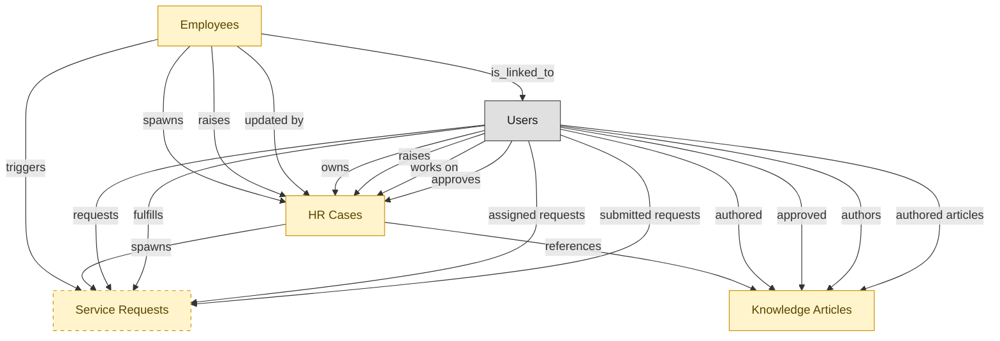

# Employee Self-Service Portal

## 1. Overview

Employee self-service intake surface: catalog browse, request submission, knowledge search, and case status. Workflow layer on top of HRSD-CASE-MGMT, no masters of its own. Hands intake off to case-mgmt and can route IT-flavored requests through to ITSM.

## 2. Entity summary

| Name | data_object | Description |
| --- | --- | --- |
| Employees | `employees` | Canonical record of a person currently or formerly employed by the organization. Carries identity (legal name, contact, IDs), employment metadata (start date, end date, employment type, country), and pointers to position, job profile, org unit, manager, and life-event history. The most multi-mastered data object in the catalog: HCM masters the core HR slice, Payroll masters the comp/withholding slice, and IGA masters the identity/access slice. Onboarding, PA, and Talent Management consume or contribute. |
| HR Cases | `hr_cases` | Employee inquiry or service request routed to HR Operations (pay question, benefits change, policy clarification, leave request, complaint). The HRSD analog of ITSM service_requests, scoped to HR-owned workflows. |
| Knowledge Articles | `knowledge_articles` | KB content backing both self-service portals and agent-assist tooling. Lifecycle: draft → review → published → retired. Quality and freshness are the silent ITSM KPIs that drive deflection rate. |
| Service Requests | `service_requests` | Planned, catalog-driven request: access, hardware, software, information. Distinct from incidents - incidents are reactive, service requests are proactive. The fulfillment for many requests crosses domains (provisioning ↔ IGA, asset assignment ↔ ITAM, HR exception ↔ HRSD). |

## 3. Entities catalog

| # | data_object | canonical code | singular | plural | role | mastered in | mastered label | necessity | pattern flags | entity_type | write tier | notes |
| ---: | --- | --- | --- | --- | --- | --- | --- | --- | --- | --- | --- | --- |
| 1 | `employees` | `employees` | Employee | Employees | embedded_master | `hcm-core-worker` | Core Worker Record | required | personal_content | operational_workflow | `:manage` | - |
| 2 | `hr_cases` | `hr_cases` | HR Case | HR Cases | embedded_master | `hrsd-case-mgmt` | HR Case Management | required | personal_content, submit_lock, single_approver | operational_workflow | `:manage` | - |
| 3 | `knowledge_articles` | `knowledge_articles` | Knowledge Article | Knowledge Articles | embedded_master | `itsm-knowledge` | Knowledge Management | required | submit_lock | operational_workflow | `:manage` | - |
| 4 | `service_requests` | `service_requests` | Service Request | Service Requests | embedded_master | `itsm-service-request` | Service Request Fulfillment | optional | single_approver | operational_workflow | `:manage` | - |

## 4. Aliases and industry synonyms

_(none: no industry-scoped aliases for this scope)_

## 5. Relationships

### 5.1 Intra-scope edges

| from | verb | to | cardinality | kind | necessity | owner_side | delete_mode | fk_format | notes |
| --- | --- | --- | --- | --- | --- | --- | --- | --- | --- |
| `employees` | triggers | `service_requests` | one_to_many | reference | optional | source | clear | reference | - |
| `employees` | spawns | `hr_cases` | one_to_many | reference | optional | source | clear | reference | - |
| `employees` | raises | `hr_cases` | one_to_many | reference | required | source | restrict | reference | - |
| `hr_cases` | references | `knowledge_articles` | many_to_many | association | optional | source | clear | reference | - |
| `hr_cases` | spawns | `service_requests` | one_to_many | reference | optional | source | clear | reference | - |
| `employees` | updated by | `hr_cases` | one_to_many | reference | optional | source | clear | reference | - |

### 5.2 Built-in edges (`users` and other platform built-ins)

| from | verb | to | cardinality | necessity | owner_side | delete_mode | fk_format | notes |
| --- | --- | --- | --- | --- | --- | --- | --- | --- |
| `users` | owns | `hr_cases` | one_to_many | optional | source | clear | reference | - |
| `users` | authored | `knowledge_articles` | one_to_many | optional | source | clear | reference | - |
| `users` | approved | `knowledge_articles` | one_to_many | optional | source | clear | reference | - |
| `employees` | is_linked_to | `users` | one_to_one | optional | target | clear | reference | - |
| `users` | raises | `hr_cases` | one_to_many | required | source | restrict | reference | - |
| `users` | works on | `hr_cases` | one_to_many | optional | source | clear | reference | - |
| `users` | approves | `hr_cases` | one_to_many | optional | source | clear | reference | - |
| `users` | authors | `knowledge_articles` | one_to_many | optional | source | clear | reference | - |
| `users` | requests | `service_requests` | one_to_many | required | source | restrict | reference | - |
| `users` | fulfills | `service_requests` | one_to_many | optional | source | clear | reference | - |
| `users` | assigned requests | `service_requests` | one_to_many | optional | source | clear | reference | - |
| `users` | submitted requests | `service_requests` | one_to_many | required | source | restrict | reference | - |
| `users` | authored articles | `knowledge_articles` | one_to_many | required | source | restrict | reference | - |

### 5.3 Cross-scope edges

#### 5.3a Outbound from this scope's masters and contributors

_Edges this scope drives: the in-scope endpoint has `role` of `master` or `contributor`._

_(none: no outbound cross-scope edges from this scope's masters or contributors)_

#### 5.3b Context edges on embedded shells and consumed entities

_Edges the canonical owner drives, shown for context: the in-scope endpoint has `role` of `embedded_master`, `consumer`, or `derived`._

| from | verb | to | cardinality | necessity | delete_mode | fk_format | notes |
| --- | --- | --- | --- | --- | --- | --- | --- |
| `knowledge_articles` | publishes_to | `knowledge_base_articles` | one_to_one | optional | none | n/a | - |
| `employees` | triggers | `iga_provisioning_events` | one_to_many | optional | none | n/a | - |
| `employees` | finalized by | `onboarding_document_collections` | one_to_many | optional | none | n/a | - |
| `audit_engagements` | triggers | `service_requests` | one_to_many | optional | none | n/a | - |
| `pre_employees` | promotes to | `employees` | one_to_one | required | none (required-if-present) | n/a | - |
| `legal_holds` | identifies_custodians_from | `employees` | many_to_many | optional | none | n/a | - |
| `legal_advice_records` | references | `employees` | many_to_many | optional | none | n/a | - |
| `employees` | is host for | `host_assignments` | one_to_many | required | none (required-if-present) | n/a | - |
| `customer_cases` | references | `knowledge_articles` | many_to_many | optional | none | n/a | - |
| `service_catalog_items` | spawns | `service_requests` | one_to_many | optional | none | n/a | - |
| `contingent_workers` | converts_to | `employees` | one_to_one | optional | none | n/a | - |
| `knowledge_base_articles` | resolves | `hr_cases` | many_to_many | optional | none | n/a | - |
| `knowledge_base_articles` | sources | `knowledge_articles` | one_to_many | optional | none | n/a | - |
| `intent_definitions` | informs | `knowledge_articles` | one_to_many | optional | none | n/a | - |
| `merit_recommendations` | applies to | `employees` | one_to_one | optional | none | n/a | - |
| `equity_grants` | granted to | `employees` | one_to_one | optional | none | n/a | - |
| `compensation_statements` | issued to | `employees` | one_to_one | optional | none | n/a | - |
| `employees` | requests | `absence_requests` | one_to_many | optional | none | n/a | - |
| `org_units` | groups | `employees` | one_to_many | required | none (required-if-present) | n/a | - |
| `hcm_positions` | is_filled_by | `employees` | one_to_one | optional | none | n/a | - |
| `employees` | signs | `employment_contracts` | one_to_many | required | ⚠ audit: required composed child out of scope | n/a | - |
| `employees` | generates | `employment_events` | one_to_many | required | ⚠ audit: required composed child out of scope | n/a | - |
| `employees` | triggers | `asset_lifecycle_events` | one_to_many | optional | none | n/a | - |
| `employees` | holds | `skill_profiles` | one_to_one | optional | none | n/a | - |
| `employees` | triggers | `pay_runs` | one_to_many | optional | none | n/a | - |
| `employees` | enrolls_in | `course_enrollments` | one_to_many | optional | none | n/a | - |
| `employees` | becomes | `career_aspirations` | one_to_one | optional | none | n/a | - |
| `employees` | becomes | `work_shifts` | one_to_many | optional | none | n/a | - |
| `employees` | becomes | `compensation_statements` | one_to_one | optional | none | n/a | - |
| `employees` | triggers | `benefit_enrollments` | one_to_many | optional | none | n/a | - |
| `employees` | triggers | `corporate_cards` | one_to_many | optional | none | n/a | - |
| `employees` | spawns | `onboarding_journeys` | one_to_one | optional | none | n/a | - |
| `employees` | feeds | `headcount_plans` | one_to_many | optional | none | n/a | - |
| `employees` | feeds | `agency_time_entries` | one_to_many | optional | none | n/a | - |
| `employees` | onboarded by | `onboarding_journeys` | one_to_many | required | none (required-if-present) | n/a | - |
| `onboarding_tasks` | emits | `service_requests` | one_to_many | optional | none | n/a | - |
| `onboarding_tasks` | spawns | `hr_cases` | one_to_many | optional | none | n/a | - |
| `employees` | reflects | `learning_records` | one_to_many | optional | none | n/a | - |
| `employees` | reflected on | `compliance_assignments` | one_to_many | optional | none | n/a | - |
| `employees` | declares | `life_events` | one_to_many | optional | none | n/a | - |
| `carrier_feeds` | spawns | `hr_cases` | one_to_many | optional | none | n/a | - |
| `employees` | updated by | `life_events` | one_to_many | optional | none | n/a | - |
| `employees` | submits | `survey_responses` | one_to_many | optional | none | n/a | - |
| `employees` | flagged on | `engagement_drivers` | one_to_many | optional | none | n/a | - |
| `employees` | reflected on | `engagement_drivers` | one_to_many | optional | none | n/a | - |
| `case_categories` | classifies | `hr_cases` | one_to_many | required | none (required-if-present) | n/a | - |
| `service_requests` | routes_to | `service_incidents` | one_to_many | optional | none | n/a | - |
| `hr_cases` | spawns | `iga_access_requests` | one_to_many | optional | none | n/a | - |
| `case_categories` | drives | `employees` | one_to_many | optional | none | n/a | - |
| `service_requests` | triggers | `service_incidents` | one_to_many | optional | none | n/a | - |
| `service_slas` | governs request | `service_requests` | one_to_many | required | none (required-if-present) | n/a | - |
| `service_problems` | documented_in | `knowledge_articles` | one_to_many | optional | none | n/a | - |
| `service_incidents` | resolved_with | `knowledge_articles` | many_to_many | optional | none | n/a | - |
| `contingent_workers` | reviewed_against | `employees` | one_to_one | optional | none | n/a | - |
| `clinical_engineering_work_orders` | surfaces_in | `service_requests` | one_to_one | optional | none | n/a | - |
| `device_calibration_records` | schedules_in | `service_requests` | one_to_many | optional | none | n/a | - |
| `work_items` | mirrors_to | `service_requests` | one_to_one | optional | none | n/a | - |
| `work_automations` | propagates_to | `service_requests` | many_to_many | optional | none | n/a | - |
| `candidates` | becomes | `employees` | one_to_one | required | none (required-if-present) | n/a | - |
| `employees` | fills | `hcm_positions` | one_to_one | optional | none | n/a | - |
| `employees` | learns_via | `course_enrollments` | one_to_many | required | none (required-if-present) | n/a | - |
| `employees` | enrolls_in | `benefit_enrollments` | one_to_many | required | none (required-if-present) | n/a | - |
| `survey_campaigns` | targets | `employees` | many_to_many | optional | none | n/a | - |
| `employees` | has | `emergency_contacts` | one_to_many | required | ⚠ audit: required composed child out of scope | n/a | - |
| `employees` | has | `work_eligibility_documents` | one_to_many | required | ⚠ audit: required composed child out of scope | n/a | - |
| `employees` | has | `national_ids` | one_to_many | required | ⚠ audit: required composed child out of scope | n/a | - |
| `employees` | has | `worker_addresses` | one_to_many | required | ⚠ audit: required composed child out of scope | n/a | - |
| `employees` | has | `employee_dependents` | one_to_many | required | ⚠ audit: required composed child out of scope | n/a | - |
| `employees` | has | `worker_change_requests` | one_to_many | required | none (required-if-present) | n/a | - |
| `employees` | applies_as | `candidates` | one_to_many | optional | none | n/a | - |
| `employees` | is the worker behind | `traveler_profiles` | one_to_one | optional | none | n/a | - |
| `exit_risk_assessments` | assesses | `employees` | one_to_one | optional | none | n/a | - |
| `insider_risk_cases` | concerns | `employees` | one_to_many | optional | none | n/a | - |
| `frontline_recognitions` | recognizes | `employees` | one_to_many | required | none (required-if-present) | n/a | - |
| `advocate_profiles` | represents | `employees` | one_to_one | required | none (required-if-present) | n/a | - |

## 6. Cross-domain context

### 6.1 Master consumers (other modules / domains that embed this scope's masters)

_(none: no other module embeds this scope's masters; the canonical owners do.)_

### 6.2 Outbound handoffs (events this scope publishes)

| source module | target domain | target module | trigger_event | transition | payload | integration | friction | description |
| --- | --- | --- | --- | --- | --- | --- | --- | --- |
| HRSD-EMPLOYEE-PORTAL | ITSM | ITSM-SERVICE-REQUEST | `case.it_assistance_required` | _(state_change)_ | `service_requests` | api_call | medium | HR case that needs IT action (lost laptop replacement, app access for a new role, account lockout) routes a service request into ITSM. Friction sits in the case-to-SR field mapping and status synchronization back to HRSD. |
| HRSD-CASE-MGMT | HRSD | HRSD-KNOWLEDGE | `hr_case.resolved` | `open` → `resolved` _(lifecycle)_ | `hr_cases` | lifecycle_progression | low | Case resolution feeds the HR-knowledge improvement loop. Resolution notes and root-cause tags drive article authoring and refinement. |
| HRSD-EMPLOYEE-PORTAL | HRSD | HRSD-CASE-MGMT | `hr_case.intake_submitted` | `submitted` _(lifecycle)_ | `hr_cases` | lifecycle_progression | low | Portal intake submission progresses into the case-management workflow. In-process state transition, same vendor stack, no message moves. |
| ITSM-KNOWLEDGE | KMS | _(domain-level)_ | `knowledge_article.published` | _(state_change)_ | `knowledge_articles` | api_call | medium | Published ITSM knowledge articles sync to the broader KMS knowledge base. |
| HRSD-CASE-MGMT | KMS | _(domain-level)_ | `hr_case.resolved` | `open` → `resolved` _(lifecycle)_ | `hr_cases` | event_stream | low | Case resolution feeds the knowledge-base authoring loop: KMS receives resolution signal to suggest new articles, update existing ones, or improve deflection. |
| HRSD-CASE-MGMT | IGA | IGA-ACCESS-REQUEST | `hr_case.access_required` | _(state_change)_ | `hr_cases` | api_call | high | HR cases requiring app or system access (e.g. role change, special-project access) escalate to IGA. Identity-reconciliation pattern: HR case context (employee_id, role, department) must map to IGA identity-graph keys; cross-vendor stacks lack canonical resolver. |
| HCM-CORE-WORKER | IGA | IGA-ACCESS-REQUEST | `employee.created` | `created` _(lifecycle)_ | `employees` | api_call | high | New employee in HCM triggers directory account creation and birthright-role assignment in IGA. High friction because role-to-entitlement mappings drift per business unit, and IGA frequently needs additional context (cost center, manager, location) that arrives later in the journey. Same trigger event as the HCM → Onboarding and HCM → Payroll handoffs. |
| HCM-CORE-WORKER | IGA | IGA-ACCESS-REQUEST | `employee.promoted` | _(lifecycle)_ | `employees` | event_stream | high | Promotion (mover event) requires entitlement re-evaluation: add new role access, revoke prior-role access. SoD risk window during transition. |
| HCM-CORE-WORKER | IGA | IGA-ACCESS-REQUEST | `employee.terminated` | `terminated` _(lifecycle)_ | `employees` | api_call | high | Termination in HCM must immediately revoke identity access in IGA: disable account, remove group memberships, terminate app-level entitlements. Failure modes: contractor terminations not flowing (different HCM table); rehires confuse the de-provisioning idempotency; access lingers after termination is the canonical audit finding. |
| HRSD-CASE-MGMT | HCM | HCM-LIFECYCLE-WORKFLOWS | `hr_case.access_required` | _(state_change)_ | `hr_cases` | event_stream | medium | HR cases involving data changes flow back to HCM for authoritative updates. |
| HCM-CORE-WORKER | HCM | HCM-LIFECYCLE-WORKFLOWS | `employee.created` | `created` _(lifecycle)_ | `employees` | lifecycle_progression | low | New worker record surfaces in self-service: manager dashboard, new-hire welcome surface, lifecycle task inbox. In-process state read; no message bus. |
| HCM-CORE-WORKER | HCM | HCM-LIFECYCLE-WORKFLOWS | `employee.terminated` | `terminated` _(lifecycle)_ | `employees` | lifecycle_progression | low | Termination drives the offboarding self-service flow: exit-interview prompt, equipment-return task, knowledge-handoff surfaces in the lifecycle workflow module. |
| HRSD-CASE-MGMT | PAYROLL | PAYROLL-RUN | `hr_case.escalated_to_payroll` | `escalated` _(state_change)_ | `hr_cases` | api_call | medium | HR-case escalation to Payroll Operations. Payroll-related HR cases (off-cycle pay, W-2 reissue, garnishment questions) require Payroll Ops to take the next action; medium friction because PAYROLL and HRSD are usually different vendor stacks. |
| HCM-CORE-WORKER | PAYROLL | PAYROLL-RUN | `employee.created` | `created` _(lifecycle)_ | `employees` | api_call | medium | New employee in HCM triggers comp profile activation in Payroll: gross-to-net rules selected by jurisdiction, deductions initialised, bank account and tax setup collected via Onboarding flow. Same trigger event as the HCM → Onboarding handoff; both subscribe to the employee.created event. |
| HCM-CORE-WORKER | PAYROLL | PAYROLL-RUN | `employee.promoted` | _(lifecycle)_ | `employees` | event_stream | medium | Promotion typically includes salary change. Effective-dated change must flow to PAYROLL with retroactive handling. |
| HCM-CORE-WORKER | PAYROLL | PAYROLL-RUN | `employee.terminated` | `terminated` _(lifecycle)_ | `employees` | event_stream | high | Termination drives final pay (severance, accrued PTO payout, prorated bonus). Cross-vendor stack when HCM and PAYROLL are different vendors; retro-adjustments are common. |
| HCM-CORE-WORKER | LMS | LMS-COURSE-DELIVERY | `employee.created` | `created` _(lifecycle)_ | `employees` | event_stream | low | New-hire creation provisions required-training assignments (compliance, role-based). Drives day-one and 30-day learning workflows. |
| HCM-CORE-WORKER | TALENT-MGMT | TALENT-PERFORMANCE-MGMT | `employee.created` | `created` _(lifecycle)_ | `employees` | api_call | low | New employee triggers talent-profile initialisation in Talent Management: career aspirations, mobility preferences, skills profile stubs. Same employee.created trigger as Onboarding / Payroll / IGA handoffs. |
| HCM-CORE-WORKER | TALENT-MGMT | TALENT-PERFORMANCE-MGMT | `employee.promoted` | _(lifecycle)_ | `employees` | event_stream | low | Promotion updates succession-plan slots and 9-box placement context. |
| HCM-CORE-WORKER | WFM | _(domain-level)_ | `employee.created` | `created` _(lifecycle)_ | `employees` | event_stream | low | New employee provisioned in HCM becomes a schedulable resource in WFM - identity, position, base FTE. Mid-shift onboarding and badge-binding are typical edge cases. |
| HCM-CORE-WORKER | COMP-MGMT | COMP-PLANNING | `employee.created` | `created` _(lifecycle)_ | `employees` | event_stream | low | New-hire creation provides compensation basis. Bands and grades attach via job profile. |
| HCM-CORE-WORKER | COMP-MGMT | COMP-PLANNING | `employee.promoted` | _(lifecycle)_ | `employees` | event_stream | low | Promotion event triggers off-cycle compensation review (eligibility, band placement, increase recommendation) in COMP-MGMT. |
| HRSD-CASE-MGMT | BEN-ADMIN | BEN-ENROLLMENT | `hr_case.escalated_to_benefits` | `escalated` _(state_change)_ | `hr_cases` | api_call | medium | HR-case escalation to Benefits Administration. Benefits enrollment, qualifying-event updates, and carrier disputes route to BEN-ADMIN. Medium friction: vendor split is common (HRSD vs. dedicated BEN-ADMIN). |
| HCM-CORE-WORKER | BEN-ADMIN | BEN-ENROLLMENT | `employee.created` | `created` _(lifecycle)_ | `employees` | event_stream | medium | New-hire creation seeds benefits eligibility (waiting periods, default elections). Drives carrier feed setup at end of new-hire window. |
| HCM-CORE-WORKER | BEN-ADMIN | BEN-ENROLLMENT | `employee.terminated` | `terminated` _(lifecycle)_ | `employees` | event_stream | high | Termination triggers benefits termination, COBRA / equivalent notices, and dependent coverage decisions. Late notifications cause coverage gaps. |
| HCM-CORE-WORKER | EXPENSE | _(domain-level)_ | `employee.terminated` | `terminated` _(lifecycle)_ | `employees` | event_stream | medium | Termination triggers EXPENSE corporate-card deactivation and outstanding-report close-out. |
| HCM-CORE-WORKER | PSA | PSA-PROJECT-DELIVERY | `employee.terminated` | `terminated` _(lifecycle)_ | `employees` | event_stream | medium | Terminated employee may be the assignee on open project_tasks. PROJECT-DELIVERY needs to surface affected tasks for reassignment or completion handover. |
| HCM-CORE-WORKER | PSA | PSA-RESOURCE-MGMT | `attrition_risk.high` | _(state_change)_ | `employees` | event_stream | high | ML attrition score crosses high threshold. PSA resource managers may proactively rebalance assignments away from at-risk consultants on critical engagements. High friction: probabilistic→deterministic pattern (score requires judgment call), false-positive volume can swamp the staffing queue. |
| HCM-CORE-WORKER | PSA | PSA-RESOURCE-MGMT | `employee.created` | `created` _(lifecycle)_ | `employees` | event_stream | low | New consultant hired. PSA resource pool adds the employee as available capacity; skill inventory record is seeded for downstream certifications. |
| HCM-CORE-WORKER | PSA | PSA-RESOURCE-MGMT | `employee.promoted` | _(lifecycle)_ | `employees` | event_stream | low | Consultant promoted (level / job profile change). PSA reevaluates billable rate band and skill inventory; existing project_assignments may need rate revision. |
| HCM-CORE-WORKER | PSA | PSA-RESOURCE-MGMT | `employee.terminated` | `terminated` _(lifecycle)_ | `employees` | event_stream | medium | Consultant terminated. PSA must release any active project_assignments, return capacity to bench and re-allocate forecast. Medium friction: leaver-event timing varies (immediate vs notice period) and active assignments may need urgent rebalancing. |

### 6.3 Inbound handoffs (events this scope reacts to)

| target module | source domain | source module | trigger_event | transition | payload | integration | friction | description |
| --- | --- | --- | --- | --- | --- | --- | --- | --- |
| ITSM-SERVICE-REQUEST | SAM | _(domain-level)_ | `license.expiry_warning` | _(threshold)_ | `service_requests` | api_call | low | Upcoming license expiry creates a renewal-action service request in ITSM. Low friction because the trigger is calendar-based and well-defined; routing to the right owner is the only nuance. |
| ITSM-SERVICE-REQUEST | SAM | _(domain-level)_ | `license_audit.required` | _(state_change)_ | `service_requests` | api_call | medium | Vendor-initiated audit or proactive internal review triggers an audit workflow service request. Friction sits in evidence collection across SAM + CLM + S2P data. |
| HCM-CORE-WORKER | ATS | ATS-CANDIDATE-CRM | `candidate.hired` | `hired` _(lifecycle)_ | `employees` | event_stream | medium | Candidate-to-employee conversion: hired candidate from ATS triggers employee-record creation in HCM. Field mapping (candidate → employee) is rarely perfect; missing fields (legal name spelling, work-eligibility detail, tax IDs) get collected in the Onboarding journey and back-filled into HCM. |
| HCM-CORE-WORKER | COMP-MGMT | COMP-PLANNING | `merit_cycle.approved` | `approved` _(state_change)_ | `employees` | event_stream | low | Cycle-close pay-rate changes post to the worker record (base salary, bonus target, equity guideline). |
| HCM-CORE-WORKER | EMP-EXP | EMP-EXP-CONTINUOUS-LISTEN | `attrition_risk.high` | _(state_change)_ | `employees` | api_call | high | Attrition-risk inference from engagement signals surfaces to managers via HCM dashboards. Probabilistic-signal → deterministic-action pattern: a risk score is not a directive; intervention is gated by manager judgment, data-privacy rules (anonymity floor), and DEI-bias concerns. |
| HCM-CORE-WORKER | PA | PA-PREDICTIVE-MODELS | `attrition_risk.high` | _(state_change)_ | `employees` | event_stream | high | Flight-risk score flagged on employee; HR-business-partner motion required. Probabilistic-signal-to-deterministic-action friction shape; false-positive volume drives mistrust. |
| HCM-CORE-WORKER | MDM | _(domain-level)_ | `employee_golden_record.created` | `active` _(lifecycle)_ | `employees` | api_call | medium | Resolved identity → HCM links operational HR record. |

### 6.4 Master providers (modules / domains that own masters this scope embeds)

| data_object | role here | necessity | canonical owner(s) | slice notes |
| --- | --- | --- | --- | --- |
| `employees` | embedded_master | required | HCM-CORE-WORKER (HCM) | - |
| `hr_cases` | embedded_master | required | HRSD-CASE-MGMT (HRSD) | - |
| `knowledge_articles` | embedded_master | required | ITSM-KNOWLEDGE (ITSM) | - |
| `service_requests` | embedded_master | optional | ITSM-SERVICE-REQUEST (ITSM) | - |

## 7. Lifecycle states

### `employees` (Employee)

_This scope holds `employees` as **embedded_master**; the canonical state machine is owned by `HCM-CORE-WORKER`._

| order | state_name | initial? | terminal? | requires_permission? | derived gate | description |
| --- | --- | --- | --- | --- | --- | --- |
| 1 | `draft` | ✓ | - | - | - | Pre-hire stub created during requisition or onboarding handoff; not yet a worker of record. |
| 2 | `active` | - | - | ✓ | `hrsd-employee-portal:active_employee` | Worker is currently employed and appears in headcount, payroll eligibility, and directory feeds. |
| 3 | `on_leave` | - | - | ✓ | `hrsd-employee-portal:on_leave_employee` | Employee is on approved leave (parental, medical, sabbatical); active record but suppressed from some downstream feeds. |
| 4 | `suspended` | - | - | ✓ | `hrsd-employee-portal:suspended_employee` | Employment temporarily halted (investigation, disciplinary); pay and access may be paused. |
| 5 | `terminated` | - | ✓ | ✓ | `hrsd-employee-portal:terminated_employee` | Employment ended (voluntary or involuntary); final pay processed, access deprovisioned. |

### `hr_cases` (HR Case)

_This scope holds `hr_cases` as **embedded_master**; the canonical state machine is owned by `HRSD-CASE-MGMT`._

| order | state_name | initial? | terminal? | requires_permission? | derived gate | description |
| --- | --- | --- | --- | --- | --- | --- |
| 1 | `intake` | ✓ | - | - | - | Case has been submitted via the self-service portal or another intake channel; awaiting triage by AI classification or HR agent. |
| 2 | `triaged` | - | - | ✓ | `hrsd-employee-portal:triage_hr_case` | Case has been categorized and prioritized; ready for assignment to an HR agent or HRBP. |
| 3 | `assigned` | - | - | ✓ | `hrsd-employee-portal:assign_hr_case` | Case is assigned to a named HR agent or HRBP owner. The owner is responsible for resolution within the case SLA. |
| 4 | `in_progress` | - | - | - | - | The owner is actively working the case (researching, requesting info from the employee, consulting policy). |
| 5 | `pending_approval` | - | - | ✓ | `hrsd-employee-portal:approve_hr_case` | Case resolution requires a sign-off from manager, HRBP, legal, or compliance (policy exception, accommodation, sensitive ER outcome). |
| 6 | `resolved` | - | - | ✓ | `hrsd-employee-portal:resolve_hr_case` | Owner has answered the employee's request or completed the workflow. Case enters the close-out review window. |
| 7 | `closed` | - | ✓ | - | - | Case is closed. Auto-closes after the SLA-defined review window if the employee does not respond or reopen. |
| 8 | `reopened` | - | - | ✓ | `hrsd-employee-portal:reopen_hr_case` | A closed case has been reopened by the employee, owner, or HRBP for additional work. Returns to in_progress on next update. |

### `knowledge_articles` (Knowledge Article)

_This scope holds `knowledge_articles` as **embedded_master**; the canonical state machine is owned by `ITSM-KNOWLEDGE`._

| order | state_name | initial? | terminal? | requires_permission? | derived gate | description |
| --- | --- | --- | --- | --- | --- | --- |
| 1 | `draft` | ✓ | - | - | - | Author is drafting the article; freely editable. |
| 2 | `in_review` | - | - | - | - | Submitted for editorial/SME review; body locked from free edits. |
| 3 | `published` | - | - | ✓ | `hrsd-employee-portal:publish_article` | Article is live and visible to consumers. |
| 4 | `retired` | - | ✓ | - | - | Article withdrawn from circulation; retained for audit. |

### `service_requests` (Service Request)

_This scope holds `service_requests` as **embedded_master**; the canonical state machine is owned by `ITSM-SERVICE-REQUEST`._

| order | state_name | initial? | terminal? | requires_permission? | derived gate | description |
| --- | --- | --- | --- | --- | --- | --- |
| 1 | `submitted` | ✓ | - | - | - | Requester has submitted the catalog request. |
| 2 | `approved` | - | - | ✓ | `hrsd-employee-portal:approved_service_request` | Approver has authorized fulfillment. |
| 3 | `fulfilling` | - | - | - | - | Fulfillment team is provisioning or executing the request. |
| 4 | `fulfilled` | - | - | - | - | Item or access has been delivered to the requester. |
| 5 | `closed` | - | ✓ | - | - | Request archived after requester confirmation. |
| 6 | `canceled` | - | ✓ | - | - | Request withdrawn or rejected before fulfillment. |

## 8. Permissions and business rules (derived)

### 8.1 Permissions

| permission | tier | description | included in `:admin`? |
| --- | --- | --- | --- |
| `hrsd-employee-portal:read` | baseline-read | Read access to every entity in the module | ✓ |
| `hrsd-employee-portal:manage` | baseline-manage | Edit operational records | ✓ |
| `hrsd-employee-portal:admin` | baseline-admin | Edit reference data and inherit every workflow gate below | - |
| `hrsd-employee-portal:active_employee` | workflow-gate (lifecycle) | Transition `employees` into state `active` | ✓ |
| `hrsd-employee-portal:on_leave_employee` | workflow-gate (lifecycle) | Transition `employees` into state `on_leave` | ✓ |
| `hrsd-employee-portal:suspended_employee` | workflow-gate (lifecycle) | Transition `employees` into state `suspended` | ✓ |
| `hrsd-employee-portal:terminated_employee` | workflow-gate (lifecycle) | Transition `employees` into state `terminated` | ✓ |
| `hrsd-employee-portal:approved_service_request` | workflow-gate (lifecycle) | Transition `service_requests` into state `approved` | ✓ |
| `hrsd-employee-portal:publish_article` | workflow-gate (lifecycle) | Transition `knowledge_articles` into state `published` | ✓ |
| `hrsd-employee-portal:triage_hr_case` | workflow-gate (lifecycle) | Transition `hr_cases` into state `triaged` | ✓ |
| `hrsd-employee-portal:assign_hr_case` | workflow-gate (lifecycle) | Transition `hr_cases` into state `assigned` | ✓ |
| `hrsd-employee-portal:approve_hr_case` | workflow-gate (lifecycle) | Transition `hr_cases` into state `pending_approval` | ✓ |
| `hrsd-employee-portal:resolve_hr_case` | workflow-gate (lifecycle) | Transition `hr_cases` into state `resolved` | ✓ |
| `hrsd-employee-portal:reopen_hr_case` | workflow-gate (lifecycle) | Transition `hr_cases` into state `reopened` | ✓ |
| `hrsd-employee-portal:view_all_employees` | override (personal_content) | View all `employees` rows beyond row-scope | ✓ |
| `hrsd-employee-portal:manage_all_employees` | override (personal_content) | Manage all `employees` rows beyond row-scope | ✓ |
| `hrsd-employee-portal:submit_knowledge_article` | override (submit_lock) | Submit and lock a `knowledge_articles` row (post-submit edits gated) | ✓ |
| `hrsd-employee-portal:view_all_hr_cases` | override (personal_content) | View all `hr_cases` rows beyond row-scope | ✓ |
| `hrsd-employee-portal:manage_all_hr_cases` | override (personal_content) | Manage all `hr_cases` rows beyond row-scope | ✓ |
| `hrsd-employee-portal:submit_hr_case` | override (submit_lock) | Submit and lock a `hr_cases` row (post-submit edits gated) | ✓ |

### 8.2 Business rules

| rule_name | data_object | source flag | intent |
| --- | --- | --- | --- |
| `employee_edit_scope` | `employees` | has_personal_content | Row-scope by default; override via `hrsd-employee-portal:view_all_employees` / `hrsd-employee-portal:manage_all_employees` |
| `submit_restricted_to_knowledge_article_owner` | `knowledge_articles` | has_submit_lock | Only the row's authoring user can submit; post-submit the row is read-only except via `hrsd-employee-portal:manage_all_knowledge_articles` |
| `hr_case_edit_scope` | `hr_cases` | has_personal_content | Row-scope by default; override via `hrsd-employee-portal:view_all_hr_cases` / `hrsd-employee-portal:manage_all_hr_cases` |
| `submit_restricted_to_hr_case_owner` | `hr_cases` | has_submit_lock | Only the row's authoring user can submit; post-submit the row is read-only except via `hrsd-employee-portal:manage_all_hr_cases` |
| `approve_hr_case_requires_approver` | `hr_cases` | has_single_approver | Exactly one explicit approver required; uses the module's approval gate (`hrsd-employee-portal:approve_hr_case` if surfaced as a lifecycle workflow gate). |
| `approve_service_request_requires_approver` | `service_requests` | has_single_approver | Exactly one explicit approver required; uses the module's approval gate (`hrsd-employee-portal:approved_service_request`). |

## 9. Roles, RACI, and responsibilities (derived)

_Baseline roles, the permission hierarchy, and RACI realization are DERIVED from this scope's entity-type write tiers + `process_raci`; none of it is stored in the catalog (the deployer provisions it from this blueprint)._

### 9.1 `HRSD-EMPLOYEE-PORTAL`

**Baseline roles:**

| role | baseline grant |
| --- | --- |
| `hrsd-employee-portal_viewer` | `hrsd-employee-portal:read` |
| `hrsd-employee-portal_manager` | `hrsd-employee-portal:manage` |

**Permission hierarchy:**

| permission | includes |
| --- | --- |
| `hrsd-employee-portal:admin` | `hrsd-employee-portal:manage` |
| `hrsd-employee-portal:manage` | `hrsd-employee-portal:read` |
| `hrsd-employee-portal:admin` | `hrsd-employee-portal:active_employee` |
| `hrsd-employee-portal:admin` | `hrsd-employee-portal:on_leave_employee` |
| `hrsd-employee-portal:admin` | `hrsd-employee-portal:suspended_employee` |
| `hrsd-employee-portal:admin` | `hrsd-employee-portal:terminated_employee` |
| `hrsd-employee-portal:admin` | `hrsd-employee-portal:approved_service_request` |
| `hrsd-employee-portal:admin` | `hrsd-employee-portal:publish_article` |
| `hrsd-employee-portal:admin` | `hrsd-employee-portal:triage_hr_case` |
| `hrsd-employee-portal:admin` | `hrsd-employee-portal:assign_hr_case` |
| `hrsd-employee-portal:admin` | `hrsd-employee-portal:approve_hr_case` |
| `hrsd-employee-portal:admin` | `hrsd-employee-portal:resolve_hr_case` |
| `hrsd-employee-portal:admin` | `hrsd-employee-portal:reopen_hr_case` |
| `hrsd-employee-portal:admin` | `hrsd-employee-portal:view_all_employees` |
| `hrsd-employee-portal:admin` | `hrsd-employee-portal:manage_all_employees` |
| `hrsd-employee-portal:admin` | `hrsd-employee-portal:submit_knowledge_article` |
| `hrsd-employee-portal:admin` | `hrsd-employee-portal:view_all_hr_cases` |
| `hrsd-employee-portal:admin` | `hrsd-employee-portal:manage_all_hr_cases` |
| `hrsd-employee-portal:admin` | `hrsd-employee-portal:submit_hr_case` |

**Processes wired:**

| process_key | process_name | PCF code | PCF ID | level | description |
| --- | --- | --- | --- | --- | --- |
| `manage_maintain_employee_data` | Manage and maintain employee data | 7.7.3 | 10524 | 3 | Capturing and updating employee information and data and information on the employees. |
| `manage_leave_absence` | Manage leave of absence | 7.6.2.2 | 10515 | 4 | Managing the period of time that an employee must be away from their primary job, while maintaining the status of employee (i.e., paid and unpaid leave of absence but not vacations, holidays, hiatuses, sabbaticals, and work-from-home programs). |
| `manage_separation` | Manage separation | 7.6.2 | 10513 | 3 | Managing the process of employee separation, including leaves of absence, resignations, discharges, and layoffs. Inform the employee of the termination. Complete paperwork for continuation of benefits. Enter employment status change into system. |
| `manage_employee_inquiry_process` | Manage employee inquiry process | 7.7.2 | 10523 | 3 | Handling instances where an employee believes that he/she has been inappropriately treated or he/she desires clarification. Encourage employees to inquire when needed. Record and clarify the issues for which the enquiry has been made. |

**RACI realization:**

| actor | kind | raci | process_key | realization |
| --- | --- | --- | --- | --- |
| `HR-PEOPLE-OPS-SPECIALIST` | persona | responsible | `manage_maintain_employee_data` | grant gates [hrsd-employee-portal:active_employee] + the gated entities' write tier |
| `HR-BUSINESS-PARTNER` | persona | accountable | `manage_maintain_employee_data` | approval gate |
| `HR-HRIS-ADMIN` | persona | consulted | `manage_maintain_employee_data` | advisory read grant |
| `PEOPLE-MANAGER` | persona | informed | `manage_maintain_employee_data` | notification side effect (trigger_event / webhook_receiver) |
| `HR-PEOPLE-OPS-SPECIALIST` | persona | responsible | `manage_leave_absence` | grant gates [hrsd-employee-portal:on_leave_employee] + the gated entities' write tier |
| `PEOPLE-MANAGER` | persona | accountable | `manage_leave_absence` | approval gate |
| `HR-BUSINESS-PARTNER` | persona | consulted | `manage_leave_absence` | blocking consultation state |
| `HR-HRIS-ADMIN` | persona | informed | `manage_leave_absence` | notification side effect (trigger_event / webhook_receiver) |
| `HR-PEOPLE-OPS-SPECIALIST` | persona | responsible | `manage_separation` | grant gates [hrsd-employee-portal:terminated_employee] + the gated entities' write tier |
| `HR-BUSINESS-PARTNER` | persona | accountable | `manage_separation` | approval gate |
| `PEOPLE-MANAGER` | persona | consulted | `manage_separation` | advisory read grant |
| `HR-HRIS-ADMIN` | persona | informed | `manage_separation` | notification side effect (trigger_event / webhook_receiver) |
| `HRSD-CASE-AGENT` | persona | responsible | `manage_employee_inquiry_process` | grant gates [hrsd-employee-portal:triage_hr_case, hrsd-employee-portal:assign_hr_case, hrsd-employee-portal:approve_hr_case, hrsd-employee-portal:resolve_hr_case, hrsd-employee-portal:reopen_hr_case] + the gated entities' write tier |
| `HRSD-SERVICE-MANAGER` | persona | accountable | `manage_employee_inquiry_process` | approval gate |
| `HRSD-KNOWLEDGE-MANAGER` | persona | informed | `manage_employee_inquiry_process` | notification side effect (trigger_event / webhook_receiver) |

### 9.2 Functional ownership and default grants

| responsibility | business function | default role | default tier |
| --- | --- | --- | --- |
| owner | HR Service Delivery | `admin` | `:admin` |
| contributor | IT Operations | `manage` | `:manage` |
