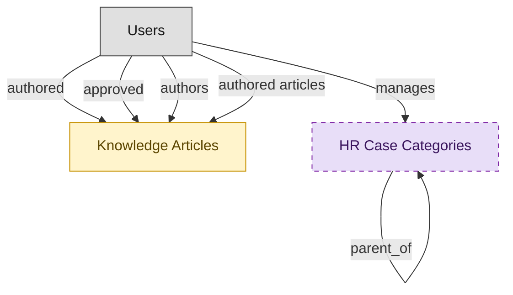

# HR Knowledge

## 1. Overview

HR knowledge surface: HR-audience articles, FAQs, and policy explainers. Consumes the cross-cutting knowledge_articles entity (mastered by ITSM/KMS) and feeds back authoring suggestions when cases are resolved.

## 2. Entity summary

| Name | data_object | Description |
| --- | --- | --- |
| Knowledge Articles | `knowledge_articles` | Knowledge-base articles backing self-service portals and agent-assist tools, moving through draft, review, published, and retired. |
| HR Case Categories | `case_categories` | Taxonomy of HR request types such as pay, benefits, leave, and policy, driving routing, SLAs, knowledge lookup, and trend analytics. |

## 3. Entities catalog

| # | data_object | canonical code | singular | plural | role | mastered in | mastered label | necessity | personal_content | entity_type | write tier | notes |
| ---: | --- | --- | --- | --- | --- | --- | --- | --- | --- | --- | --- | --- |
| 1 | `knowledge_articles` | `knowledge_articles` | Knowledge Article | Knowledge Articles | embedded_master | `itsm-knowledge` | IT Knowledge Management | required | - | operational_workflow | `:manage` | - |
| 2 | `case_categories` | `case_categories` | HR Case Category | HR Case Categories | consumer | `hrsd-case-mgmt` | HR Case Management | optional | - | catalog | `:admin` | - |

## 4. Aliases and industry synonyms

_(none: no industry-scoped aliases for this scope)_

## 5. Relationships

### 5.1 Intra-scope edges

| from | verb | to | cardinality | kind | necessity | owner_side | delete_mode | fk_format | notes |
| --- | --- | --- | --- | --- | --- | --- | --- | --- | --- |
| `case_categories` | parent_of | `case_categories` | one_to_many | reference | optional | source | clear | reference | - |

### 5.2 Built-in edges (`users` and other platform built-ins)

| from | verb | to | cardinality | necessity | owner_side | delete_mode | fk_format | notes |
| --- | --- | --- | --- | --- | --- | --- | --- | --- |
| `users` | authored | `knowledge_articles` | one_to_many | optional | source | clear | reference | - |
| `users` | approved | `knowledge_articles` | one_to_many | optional | source | clear | reference | - |
| `users` | manages | `case_categories` | one_to_many | optional | source | clear | reference | - |
| `users` | authors | `knowledge_articles` | one_to_many | optional | source | clear | reference | - |
| `users` | authored articles | `knowledge_articles` | one_to_many | required | source | restrict | reference | - |

### 5.3 Cross-scope edges

#### 5.3a Outbound from this scope's masters and contributors

_Edges this scope drives: the in-scope endpoint has `role` of `master` or `contributor`._

_(none: no outbound cross-scope edges from this scope's masters or contributors)_

#### 5.3b Context edges on embedded shells and consumed entities

_Edges the canonical owner drives, shown for context: the in-scope endpoint has `role` of `embedded_master`, `consumer`, or `derived`._

| from | verb | to | cardinality | necessity | delete_mode | fk_format | notes |
| --- | --- | --- | --- | --- | --- | --- | --- |
| `knowledge_articles` | publishes_to | `knowledge_base_articles` | one_to_one | optional | none | n/a | - |
| `customer_cases` | references | `knowledge_articles` | many_to_many | optional | none | n/a | - |
| `knowledge_base_articles` | sources | `knowledge_articles` | one_to_many | optional | none | n/a | - |
| `intent_definitions` | informs | `knowledge_articles` | one_to_many | optional | none | n/a | - |
| `case_categories` | classifies | `hr_cases` | one_to_many | required | none (required-if-present) | n/a | - |
| `hr_cases` | references | `knowledge_articles` | many_to_many | optional | none | n/a | - |
| `case_categories` | drives | `knowledge_base_articles` | one_to_many | optional | none | n/a | - |
| `case_categories` | drives | `employees` | one_to_many | optional | none | n/a | - |
| `service_problems` | documented_in | `knowledge_articles` | one_to_many | optional | none | n/a | - |
| `service_incidents` | resolved_with | `knowledge_articles` | many_to_many | optional | none | n/a | - |

## 6. Cross-domain context

### 6.1 Master consumers (other modules / domains that embed this scope's masters)

_(none: no other module embeds this scope's masters; the canonical owners do.)_

### 6.2 Outbound handoffs (events this scope publishes)

| source module | target domain | target module | trigger_event | transition | payload | integration | friction | description |
| --- | --- | --- | --- | --- | --- | --- | --- | --- |
| ITSM-KNOWLEDGE | KMS | _(domain-level)_ | `knowledge_article.published` | _(state_change)_ | `knowledge_articles` | api_call | medium | Published ITSM knowledge articles sync to the broader KMS knowledge base. |

### 6.3 Inbound handoffs (events this scope reacts to)

| target module | source domain | source module | trigger_event | transition | payload | integration | friction | description |
| --- | --- | --- | --- | --- | --- | --- | --- | --- |
| HRSD-KNOWLEDGE | HRSD | HRSD-CASE-MGMT | `case_category.updated` | _(state_change)_ | `case_categories` | lifecycle_progression | low | Case taxonomy updates re-categorize the HR knowledge base so deflection and agent-assist suggestions stay aligned with the routing model. |

### 6.4 Master providers (modules / domains that own masters this scope embeds)

| data_object | role here | necessity | canonical owner(s) | slice notes |
| --- | --- | --- | --- | --- |
| `knowledge_articles` | embedded_master | required | ITSM-KNOWLEDGE (ITSM) | - |
| `case_categories` | consumer | optional | HRSD-CASE-MGMT (HRSD) | - |

## 7. Lifecycle states

### `knowledge_articles` (Knowledge Article)

_This scope holds `knowledge_articles` as **embedded_master**; the canonical state machine is owned by `ITSM-KNOWLEDGE`._

| order | state_name | initial? | terminal? | requires_permission? | derived gate | description |
| --- | --- | --- | --- | --- | --- | --- |
| 1 | `draft` | ✓ | - | - | - | Author is drafting the article; freely editable. |
| 2 | `in_review` | - | - | - | - | Submitted for editorial/SME review; body locked from free edits. |
| 3 | `published` | - | - | ✓ | `hrsd-knowledge:publish_article` | Article is live and visible to consumers. |
| 4 | `retired` | - | ✓ | - | - | Article withdrawn from circulation; retained for audit. |

## 8. Permissions and business rules (derived)

### 8.1 Permissions

| permission | tier | description | included in `:admin`? |
| --- | --- | --- | --- |
| `hrsd-knowledge:read` | baseline-read | Read access to every entity in the module | ✓ |
| `hrsd-knowledge:manage` | baseline-manage | Edit operational records | ✓ |
| `hrsd-knowledge:admin` | baseline-admin | Edit reference data and inherit every workflow gate below | - |
| `hrsd-knowledge:publish_article` | workflow-gate (lifecycle) | Transition `knowledge_articles` into state `published` | ✓ |

### 8.2 Business rules

_(none: no flag-derived business rules)_

## 9. Roles, RACI, and responsibilities (derived)

_Baseline roles, the permission hierarchy, and RACI realization are DERIVED from this scope's entity-type write tiers + `process_raci`; none of it is stored in the catalog (the deployer provisions it from this blueprint)._

### 9.1 `HRSD-KNOWLEDGE`

**Baseline roles:**

| role | baseline grant |
| --- | --- |
| `hrsd-knowledge_viewer` | `hrsd-knowledge:read` |
| `hrsd-knowledge_manager` | `hrsd-knowledge:manage` |

**Permission hierarchy:**

| permission | includes |
| --- | --- |
| `hrsd-knowledge:admin` | `hrsd-knowledge:manage` |
| `hrsd-knowledge:manage` | `hrsd-knowledge:read` |
| `hrsd-knowledge:admin` | `hrsd-knowledge:publish_article` |

**RACI realization:**

_(none: no process_raci assignments wired to this module's gated processes yet)_

### 9.2 Functional ownership and default grants

| responsibility | business function | default role | default tier |
| --- | --- | --- | --- |
| owner | HR Service Delivery | `admin` | `:admin` |
| contributor | IT Operations | `manage` | `:manage` |
