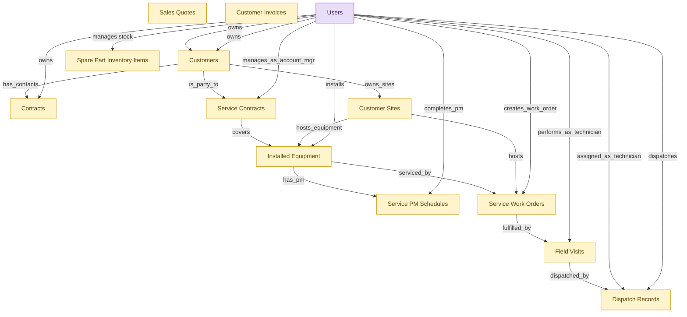

# HVAC Service Management (small-org starter)

## 1. Overview

Small-shop persona bundle for HVAC service businesses (5-30 technicians). Single-install deployable covering customer accounts and contacts (CRM), service dispatch and field execution (FSM-DISPATCH-OPS), installed equipment register and PM cadence (FSM-INSTALLED-BASE), recurring maintenance agreements (FSM-SERVICE-CONTRACTS), quote-to-invoice (CPQ + SUB-MGMT), and parts inventory (HAM). Larger organizations deploy the full modules and skip the starter.

## 2. Entity summary

| Name | data_object | Description |
| --- | --- | --- |
| Contacts | `crm_contacts` | People at customer or prospect organizations, carrying title, contact details, decision-maker flag, preferred channel, and opt-in state. |
| Customer Invoices | `customer_invoices` | Seller-issued invoices billed to customers, with line items, tax, payment terms, due date, and status from draft to paid or written off. |
| Customer Sites | `customer_sites` | Physical service locations belonging to a customer, where one customer can have many sites across properties or chains. |
| Customers | `customers` | Canonical records of customers, whether business accounts or end consumers, carrying identity, segmentation, lifecycle stage, and account hierarchy. |
| Dispatch Records | `dispatch_records` | Assignments of a work order to a specific technician at a specific time, capturing dispatch decisions, route output, and dispatcher overrides. |
| Field Visits | `field_visits` | Scheduled or completed on-site visits by a field technician, capturing arrival, work performed, parts used, customer signature, and outcome. |
| Installed Equipment | `installed_equipment` | Customer-owned equipment that the service organization installs and maintains, with identity, placement, and lifecycle state, covered by work orders and contracts. |
| Sales Quotes | `sales_quotes` | Versioned, numbered quote documents with dates, validity, currency, terms, pricing, and status from draft to accepted or lost. |
| Service Contracts | `service_contracts` | Service contracts that carry service-level commitments such as response times, parts coverage, and call-out fees. |
| Service PM Schedules | `service_pm_schedules` | Recurring preventive-maintenance plans for installed equipment, defining cadence, due date, grace window, and overdue escalation. |
| Service Work Orders | `service_work_orders` | Customer-facing service jobs fulfilled by field visits, distinct from preventive-maintenance work orders. |
| Spare Part Inventory Items | `spare_parts_inventory` | Stockroom counts and procurement of replacement hardware components not yet deployed as assets. |
| Users | `users` | Platform users referenced as assignees, authors, approvers, and creators across records. |

## 3. Entities catalog

| # | data_object | canonical code | singular | plural | role | mastered in | mastered label | necessity | personal_content | entity_type | write tier | notes |
| ---: | --- | --- | --- | --- | --- | --- | --- | --- | --- | --- | --- | --- |
| 1 | `crm_contacts` | `crm_contacts` | Contact | Contacts | embedded_master | `crm-acct-mgt` | Account and Contact Management | required | yes | operational_record | `:manage` | - |
| 2 | `customer_invoices` | `customer_invoices` | Customer Invoice | Customer Invoices | embedded_master | `sub-mgmt-billing` | Recurring Billing and Dunning | required | - | operational_workflow | `:manage` | - |
| 3 | `customer_sites` | `customer_sites` | Customer Site | Customer Sites | embedded_master | `fsm-installed-base` | Installed Equipment and Preventive Maintenance | required | - | operational_workflow | `:manage` | - |
| 4 | `customers` | `customers` | Customer | Customers | embedded_master | `crm-acct-mgt` | Account and Contact Management | required | yes | operational_workflow | `:manage` | - |
| 5 | `dispatch_records` | `dispatch_records` | Dispatch Record | Dispatch Records | embedded_master | `fsm-dispatch-ops` | Field Service Dispatch Operations | required | - | operational_workflow | `:manage` | - |
| 6 | `field_visits` | `field_visits` | Field Visit | Field Visits | embedded_master | `fsm-mobile-tech` | Mobile Technician | required | yes | operational_workflow | `:manage` | - |
| 7 | `installed_equipment` | `installed_equipment` | Installed Equipment Unit | Installed Equipment | embedded_master | `fsm-installed-base` | Installed Equipment and Preventive Maintenance | required | - | operational_workflow | `:manage` | - |
| 8 | `sales_quotes` | `sales_quotes` | Sales Quote | Sales Quotes | embedded_master | `cpq-quote-builder` | Quote Construction and Discounting | required | - | operational_workflow | `:manage` | - |
| 9 | `service_contracts` | `service_contracts` | Service Contract | Service Contracts | embedded_master | `fsm-service-contracts` | Service Contracts and SLAs | required | - | operational_workflow | `:manage` | - |
| 10 | `service_pm_schedules` | `service_pm_schedules` | Service PM Schedule | Service PM Schedules | embedded_master | `fsm-installed-base` | Installed Equipment and Preventive Maintenance | required | - | operational_workflow | `:manage` | - |
| 11 | `service_work_orders` | `service_work_orders` | Service Work Order | Service Work Orders | embedded_master | `fsm-dispatch-ops` | Field Service Dispatch Operations | required | - | operational_workflow | `:manage` | - |
| 12 | `spare_parts_inventory` | `spare_parts_inventory` | Spare Part Inventory Item | Spare Part Inventory Items | embedded_master | `ham-warranty-parts` | Warranty, Disposal, and Spare Parts | required | - | operational_record | `:manage` | - |
| 13 | `users` | `users` | User | Users | consumer | _(platform built-in)_ | _(platform built-in)_ | required | - | operational_record | `:manage` | - |

## 4. Aliases and industry synonyms

_(none: no industry-scoped aliases for this scope)_

## 5. Relationships

### 5.1 Intra-scope edges

| from | verb | to | cardinality | kind | necessity | owner_side | delete_mode | fk_format | notes |
| --- | --- | --- | --- | --- | --- | --- | --- | --- | --- |
| `service_work_orders` | fulfilled_by | `field_visits` | one_to_many | composition | required | source | cascade | parent | - |
| `field_visits` | dispatched_by | `dispatch_records` | one_to_one | reference | required | source | restrict | reference | - |
| `installed_equipment` | serviced_by | `service_work_orders` | one_to_many | reference | optional | target | clear | reference | - |
| `customer_sites` | hosts | `service_work_orders` | one_to_many | reference | required | target | restrict | reference | - |
| `service_contracts` | covers | `installed_equipment` | one_to_many | association | optional | source | clear | reference | - |
| `installed_equipment` | has_pm | `service_pm_schedules` | one_to_many | reference | required | target | restrict | reference | - |
| `customer_sites` | hosts_equipment | `installed_equipment` | one_to_many | reference | required | target | restrict | reference | - |
| `customers` | owns_sites | `customer_sites` | one_to_many | reference | required | target | restrict | reference | - |
| `customers` | is_party_to | `service_contracts` | one_to_many | reference | required | target | restrict | reference | - |
| `customers` | has_contacts | `crm_contacts` | one_to_many | reference | optional | source | clear | reference | - |

### 5.2 Built-in edges (`users` and other platform built-ins)

| from | verb | to | cardinality | necessity | owner_side | delete_mode | fk_format | notes |
| --- | --- | --- | --- | --- | --- | --- | --- | --- |
| `users` | manages stock | `spare_parts_inventory` | one_to_many | optional | source | clear | reference | - |
| `users` | performs_as_technician | `field_visits` | one_to_many | required | target | restrict | reference | - |
| `users` | assigned_as_technician | `dispatch_records` | one_to_many | required | target | restrict | reference | - |
| `users` | dispatches | `dispatch_records` | one_to_many | required | target | restrict | reference | - |
| `users` | creates_work_order | `service_work_orders` | one_to_many | required | target | restrict | reference | - |
| `users` | manages_as_account_mgr | `service_contracts` | one_to_many | optional | target | clear | reference | - |
| `users` | installs | `installed_equipment` | one_to_many | optional | target | clear | reference | - |
| `users` | completes_pm | `service_pm_schedules` | one_to_many | optional | target | clear | reference | - |
| `users` | owns | `customers` | one_to_many | optional | source | clear | reference | - |
| `users` | owns | `customers` | one_to_many | required | source | restrict | reference | - |
| `users` | owns | `crm_contacts` | one_to_many | optional | source | clear | reference | - |

### 5.3 Cross-scope edges

#### 5.3a Outbound from this scope's masters and contributors

_Edges this scope drives: the in-scope endpoint has `role` of `master` or `contributor`._

_(none: no outbound cross-scope edges from this scope's masters or contributors)_

#### 5.3b Context edges on embedded shells and consumed entities

_Edges the canonical owner drives, shown for context: the in-scope endpoint has `role` of `embedded_master`, `consumer`, or `derived`._

| from | verb | to | cardinality | necessity | delete_mode | fk_format | notes |
| --- | --- | --- | --- | --- | --- | --- | --- |
| `hardware_assets` | served_by | `spare_parts_inventory` | many_to_many | optional | none | n/a | - |
| `spare_parts_inventory` | requisitions | `purchase_requisitions` | one_to_many | optional | none | n/a | - |
| `customers` | raises | `customer_cases` | one_to_many | required | none (required-if-present) | n/a | - |
| `customers` | holds | `customer_entitlements` | one_to_many | optional | none | n/a | - |
| `customers` | subscribes_to | `customer_subscriptions` | one_to_many | optional | none | n/a | - |
| `customers` | flags_churn_risk_on | `crm_opportunities` | one_to_many | optional | none | n/a | - |
| `customer_subscriptions` | adjusts dunning for | `customers` | one_to_many | optional | none | n/a | - |
| `customer_invoices` | opens | `customer_cases` | one_to_many | optional | none | n/a | - |
| `service_work_orders` | opens | `customer_cases` | one_to_many | optional | none | n/a | - |
| `dispatch_records` | opens | `customer_cases` | one_to_many | optional | none | n/a | - |
| `field_visits` | opens | `customer_cases` | one_to_many | optional | none | n/a | - |
| `hardware_models` | stocks | `spare_parts_inventory` | one_to_many | optional | none | n/a | - |
| `msp_contracts` | drives engagement | `customers` | one_to_many | optional | none | n/a | - |
| `customer_golden_records` | resolves to | `customers` | one_to_many | optional | none | n/a | - |
| `customers` | feedback_routed_from | `customer_feedback_items` | one_to_many | optional | none | n/a | - |
| `customers` | impacted_by | `product_features` | many_to_many | optional | none | n/a | - |
| `customers` | impacted_by | `product_releases` | many_to_many | optional | none | n/a | - |
| `customers` | tracked_by | `product_metrics` | many_to_many | optional | none | n/a | - |
| `customers` | monitored_in | `beta_programs` | many_to_many | optional | none | n/a | - |
| `customers` | places | `wholesale_orders` | one_to_many | required | none (required-if-present) | n/a | - |
| `customers` | places | `butcher_orders` | one_to_many | required | none (required-if-present) | n/a | - |
| `delivery_routes` | serves | `customers` | many_to_many | required | none (required-if-present) | n/a | - |
| `sales_quotes` | drafts | `legal_contracts` | one_to_many | optional | none | n/a | - |
| `customers` | has_opportunities | `crm_opportunities` | one_to_many | required | none (required-if-present) | n/a | - |
| `customers` | converted_from_lead | `crm_leads` | one_to_many | optional | none | n/a | - |
| `crm_contacts` | converted_from_lead | `crm_leads` | one_to_many | optional | none | n/a | - |
| `crm_opportunities` | involves_contacts | `crm_contacts` | many_to_many | optional | none | n/a | - |
| `customers` | has_activities | `sales_activities` | one_to_many | optional | none | n/a | - |
| `crm_contacts` | has_activities | `sales_activities` | one_to_many | optional | none | n/a | - |
| `cad_drawings` | shared_with | `customers` | many_to_many | optional | none | n/a | - |
| `customers` | subscribes via | `csa_memberships` | one_to_many | required | none (required-if-present) | n/a | - |
| `customers` | buys at | `farmers_market_sales` | one_to_many | optional | none | n/a | - |
| `contact_records` | enriches | `crm_contacts` | one_to_many | optional | none | n/a | - |
| `ad_conversion_events` | converts | `customers` | one_to_many | optional | none | n/a | - |
| `activity_bookings` | is booked by | `customers` | many_to_many | required | none (required-if-present) | n/a | - |

## 6. Cross-domain context

### 6.1 Master consumers (other modules / domains that embed this scope's masters)

_(none: no other module embeds this scope's masters; the canonical owners do.)_

### 6.2 Outbound handoffs (events this scope publishes)

| source module | target domain | target module | trigger_event | transition | payload | integration | friction | description |
| --- | --- | --- | --- | --- | --- | --- | --- | --- |
| HAM-WARRANTY-PARTS | S2P | _(domain-level)_ | `spare_parts_inventory.low_threshold` | _(threshold)_ | `spare_parts_inventory` | api_call | medium | Low spare-parts levels trigger S2P replenishment requisitions. |
| FSM-DISPATCH-OPS | CSM | _(domain-level)_ | `dispatch.failed` | `scheduled` → `failed` _(state_change)_ | `dispatch_records` | api_call | high | Failed dispatch must reach CSM for customer rescheduling comm. Failure modes: failure detection lag; rescheduling SLA breached before CSM is informed. |
| FSM-DISPATCH-OPS | CSM | _(domain-level)_ | `service_work_order.completed` | _(state_change)_ | `service_work_orders` | event_stream | low | Field service completion triggers customer satisfaction survey. |
| FSM-MOBILE-TECH | CSM | _(domain-level)_ | `work_order.completed` | `in_progress` → `completed` _(lifecycle)_ | `field_visits` | api_call | medium | Completed field visits trigger CSM customer-satisfaction outreach and billing kickoff. Failure modes: technician sign-off lag; partial completion edge cases. |
| SUB-MGMT-BILLING | CSM | _(domain-level)_ | `customer_invoice.past_due` | _(state_change)_ | `customer_invoices` | event_stream | medium | Past-due invoice triggers CSM outreach to prevent involuntary churn. |
| FSM-INSTALLED-BASE | EAM | _(domain-level)_ | `installed_equipment.decommissioned` | `active` → `decommissioned` _(lifecycle)_ | `installed_equipment` | api_call | medium | Customer-side equipment decommissioned; EAM-side asset retirement workflow updates the partner-mastered asset record. |
| FSM-DISPATCH-OPS | FIN | _(domain-level)_ | `service_work_order.completed` | _(state_change)_ | `service_work_orders` | event_stream | low | Billable hours and materials post to revenue GL. |
| CPQ-QUOTE-BUILDER | FIN | _(domain-level)_ | `sales_quote.approved` | _(state_change)_ | `sales_quotes` | api_call | medium | Approved quote with revenue-recognition implications feeds ERP-FIN forecast and rev-rec rules engine. |
| SUB-MGMT-BILLING | FIN | _(domain-level)_ | `customer_invoice.issued` | _(state_change)_ | `customer_invoices` | batch_sync | medium | Issued customer invoices feed AR sub-ledger in ERP-FIN. Friction during rev-rec implementations (ASC 606). |
| CPQ-QUOTE-BUILDER | CRM | CRM-PIPELINE-MGT | `sales_quote.accepted_by_buyer` | _(signal)_ | `sales_quotes` | api_call | low | Quote acceptance advances the linked opportunity to closed-won pending signature. |
| CRM-ACCT-MGT | MA | MA-CAMPAIGN-AUTHORING | `crm_contact.synced` | `synced` _(signal)_ | `crm_contacts` | batch_sync | medium | Contact updates in CRM (new contact, status change, opt-in change, account ownership) sync to MA so audience lists and campaigns stay current. Batch-sync is the typical pattern - real-time would be ideal but most stacks accept hourly or daily latency here. |
| SUB-MGMT-BILLING | B2C-COMM | B2C-COMM-ORDER-CAPTURE | `customer_invoice.issued` | _(state_change)_ | `customer_invoices` | api_call | low | Issued invoice surfaces in the customer portal. |
| CRM-ACCT-MGT | CPQ | CPQ-PRODUCT-CATALOG | `account.tier_changed` | _(state_change)_ | `customers` | event_stream | medium | Account tier change cascades to CPQ for price-list assignment. |
| CPQ-QUOTE-BUILDER | SUB-MGMT | _(domain-level)_ | `sales_quote.accepted_by_buyer` | _(signal)_ | `sales_quotes` | api_call | medium | Accepted quote with subscription terms triggers SUB-MGMT to provision the subscription record. |
| CRM-ACCT-MGT | SALES-PERF | _(domain-level)_ | `account.tier_changed` | _(state_change)_ | `customers` | api_call | medium | Account tier changes trigger territory or quota realignment. Failure modes: mid-quarter changes invalidate existing assignments; commission impact is retroactive. |
| FSM-DISPATCH-OPS | FLEET-MGMT | _(domain-level)_ | `service_work_order.assigned` | _(state_change)_ | `service_work_orders` | event_stream | low | Service dispatch optimizes technician vehicle routing. |
| CRM-ACCT-MGT | FARMER-DIRECT-SALES | FDS-CSA-MGMT | `account_health.declined` | _(threshold)_ | `customers` | api_call | medium | - |
| CRM-ACCT-MGT | FARMER-DIRECT-SALES | FDS-CSA-MGMT | `customer.churn_confirmed` | `at_risk` → `churned` _(lifecycle)_ | `customers` | event_stream | high | - |
| CRM-ACCT-MGT | FARMER-DIRECT-SALES | FDS-CSA-MGMT | `customer.signed_up` | `signed_up` _(lifecycle)_ | `customers` | event_stream | low | - |
| CRM-ACCT-MGT | FARMER-DIRECT-SALES | FDS-CSA-MGMT | `health_score.declined` | _(threshold)_ | `customers` | api_call | medium | - |
| CRM-ACCT-MGT | FARMER-DIRECT-SALES | FDS-WHOLESALE | `account.tier_changed` | _(state_change)_ | `customers` | api_call | medium | - |

### 6.3 Inbound handoffs (events this scope reacts to)

| target module | source domain | source module | trigger_event | transition | payload | integration | friction | description |
| --- | --- | --- | --- | --- | --- | --- | --- | --- |
| CRM-ACCT-MGT | CSM | _(domain-level)_ | `case.critical_health_drop` | _(threshold)_ | `customers` | api_call | high | Cluster of critical cases or sustained low CSAT triggers an account-health-drop signal back to CRM, surfacing as a churn-risk flag on the account. High friction because the threshold definition is org-specific and the CRM-side account-health field rarely has good UX for the alert. |
| CRM-ACCT-MGT | CSM | _(domain-level)_ | `health_score.declined` | _(threshold)_ | `customers` | event_stream | medium | Declining health score surfaces churn risk to CRM for sales-rep awareness during renewal. |
| CRM-ACCT-MGT | CSM | _(domain-level)_ | `subscription.expansion_requested` | _(signal)_ | `customers` | manual_handoff | medium | CSM-identified expansion creates a CRM opportunity. Often a manual handoff with poor close-the-loop visibility. |
| CRM-ACCT-MGT | CRM | CRM-LEAD-MGT | `crm_lead.converted` | _(lifecycle)_ | `customers` | lifecycle_progression | low | - |
| CRM-ACCT-MGT | CRM | CRM-LEAD-MGT | `crm_lead.converted` | _(lifecycle)_ | `crm_contacts` | lifecycle_progression | low | - |
| CRM-ACCT-MGT | CRM | CRM-PIPELINE-MGT | `crm_opportunity.closed_won` | _(state_change)_ | `customers` | lifecycle_progression | low | - |
| CRM-ACCT-MGT | B2C-COMM | B2C-COMM-ORDER-CAPTURE | `customer.signed_up` | `signed_up` _(lifecycle)_ | `customers` | event_stream | low | Storefront signup creates the canonical customer record in CRM. Low friction in B2C-native integrated stacks; medium in stitched-together stacks. |
| CRM-ACCT-MGT | CDP | CDP-UNIFIED-PROFILE | `profile.lifecycle_changed` | _(signal)_ | `customers` | event_stream | medium | CDP-detected lifecycle stage change (new → engaged → loyal → at-risk → churned) updates the customer record in CRM. Friction comes from CDP's lifecycle model not matching CRM's account-status taxonomy. |
| CRM-ACCT-MGT | MDM | _(domain-level)_ | `customer_golden_record.created` | `active` _(lifecycle)_ | `customers` | api_call | medium | Resolved golden ID + merged attributes; CRM links operational record. |
| CRM-ACCT-MGT | SUB-MGMT | SUB-MGMT-SUBSCRIPTIONS | `subscription.activated` | `activated` _(lifecycle)_ | `customers` | event_stream | low | Subscription activation marks the account as an active customer in CRM, updates ARR rollups, and unlocks customer-success workflows. Low friction when same-vendor stack; medium when CRM and billing are separate. |
| CRM-ACCT-MGT | SMM | _(domain-level)_ | `social_engagement.recorded` | `recorded` _(signal)_ | `customers` | batch_sync | medium | Social engagement enriches CRM contact records. Friction in identity-resolution across handles. |
| CRM-ACCT-MGT | FARMER-DIRECT-SALES | FDS-CSA-MGMT | `csa_membership.activated` | `draft` → `active` _(lifecycle)_ | `customers` | api_call | low | CSA membership activation creates or enriches the underlying CRM-mastered customer record with membership status, share preferences, and pickup location. |
| SUB-MGMT-BILLING | SUB-MGMT | SUB-MGMT-SUBSCRIPTIONS | `subscription.activated` | `activated` _(lifecycle)_ | `customer_invoices` | lifecycle_progression | low | Activating a subscription triggers the first invoice so billing begins as soon as the customer is live. |
| SUB-MGMT-BILLING | SUB-MGMT | SUB-MGMT-SUBSCRIPTIONS | `subscription.renewal_required` | _(threshold)_ | `customer_invoices` | lifecycle_progression | low | A renewal coming due triggers the recurring invoice run so the next billing period is invoiced on time. |

### 6.4 Master providers (modules / domains that own masters this scope embeds)

| data_object | role here | necessity | canonical owner(s) | slice notes |
| --- | --- | --- | --- | --- |
| `crm_contacts` | embedded_master | required | CRM-ACCT-MGT (CRM) | - |
| `customer_invoices` | embedded_master | required | SUB-MGMT-BILLING (SUB-MGMT) | - |
| `customer_sites` | embedded_master | required | FSM-INSTALLED-BASE (FSM) | - |
| `customers` | embedded_master | required | CRM-ACCT-MGT (CRM) | - |
| `dispatch_records` | embedded_master | required | FSM-DISPATCH-OPS (FSM) | - |
| `field_visits` | embedded_master | required | FSM-MOBILE-TECH (FSM) | - |
| `installed_equipment` | embedded_master | required | FSM-INSTALLED-BASE (FSM) | - |
| `sales_quotes` | embedded_master | required | CPQ-QUOTE-BUILDER (CPQ) | - |
| `service_contracts` | embedded_master | required | FSM-SERVICE-CONTRACTS (FSM) | - |
| `service_pm_schedules` | embedded_master | required | FSM-INSTALLED-BASE (FSM) | - |
| `service_work_orders` | embedded_master | required | FSM-DISPATCH-OPS (FSM) | - |
| `spare_parts_inventory` | embedded_master | required | HAM-WARRANTY-PARTS (HAM) | - |
| `users` | consumer | required | _(platform built-in)_ | - |

## 7. Lifecycle states

### `crm_contacts` (Contact)

_This scope holds `crm_contacts` as **embedded_master**; the canonical state machine is owned by `CRM-ACCT-MGT`._

| order | state_name | initial? | terminal? | requires_permission? | derived gate | description |
| --- | --- | --- | --- | --- | --- | --- |
| 1 | `active` | ✓ | - | - | - | Contact is current and reachable. |
| 2 | `inactive` | - | - | - | - | Contact is no longer engaged but record retained. |
| 3 | `unsubscribed` | - | ✓ | - | - | Contact has opted out of all channels. |

### `customer_invoices` (Customer Invoice)

_This scope holds `customer_invoices` as **embedded_master**; the canonical state machine is owned by `SUB-MGMT-BILLING`._

| order | state_name | initial? | terminal? | requires_permission? | derived gate | description |
| --- | --- | --- | --- | --- | --- | --- |
| 1 | `draft` | ✓ | - | - | - | Invoice assembled but not yet issued to the customer. |
| 2 | `issued` | - | - | ✓ | `hvac-svc-mgmt:issue_invoice` | Invoice finalized and delivered to the customer (AR open). |
| 3 | `paid` | - | ✓ | - | - | Invoice settled in full. |
| 4 | `overdue` | - | - | - | - | Due date elapsed without payment; dunning may trigger. |
| 5 | `written_off` | - | ✓ | - | - | Invoice deemed uncollectible and removed from AR. |
| 6 | `voided` | - | ✓ | - | - | Invoice canceled before settlement (correction/reissue). |

### `customer_sites` (Customer Site)

_This scope holds `customer_sites` as **embedded_master**; the canonical state machine is owned by `FSM-INSTALLED-BASE`._

| order | state_name | initial? | terminal? | requires_permission? | derived gate | description |
| --- | --- | --- | --- | --- | --- | --- |
| 1 | `prospect` | ✓ | - | - | - | Site captured during sales/quote phase; no service has been performed yet. |
| 2 | `active` | - | - | - | - | Site is in service; one or more installed_equipment units or active work orders exist. |
| 3 | `inactive` | - | - | - | - | Site temporarily not serviced (seasonal closure, customer pause). Equipment remains on file. |
| 4 | `terminated` | - | ✓ | ✓ | `hvac-svc-mgmt:terminate_site` | Site removed from service (sold, demolished, customer churn). Triggers contract and PM termination. |

### `customers` (Customer)

_This scope holds `customers` as **embedded_master**; the canonical state machine is owned by `CRM-ACCT-MGT`._

| order | state_name | initial? | terminal? | requires_permission? | derived gate | description |
| --- | --- | --- | --- | --- | --- | --- |
| 1 | `prospect` | ✓ | - | - | - | Pre-customer account being courted by sales. |
| 2 | `active` | - | - | - | - | Customer is engaged and in good standing. |
| 3 | `inactive` | - | - | - | - | Customer is dormant but not churned. |
| 4 | `past_due` | - | - | - | - | Customer carries an overdue invoice or failed payment. |
| 5 | `canceled` | - | - | - | - | Customer ended all subscriptions; no active billing. |
| 6 | `churned` | - | ✓ | - | - | Customer has terminated the relationship. |

### `dispatch_records` (Dispatch Record)

_This scope holds `dispatch_records` as **embedded_master**; the canonical state machine is owned by `FSM-DISPATCH-OPS`._

| order | state_name | initial? | terminal? | requires_permission? | derived gate | description |
| --- | --- | --- | --- | --- | --- | --- |
| 1 | `pending` | ✓ | - | - | - | Dispatch assignment created, awaiting technician acceptance. |
| 2 | `dispatched` | - | - | - | - | Technician has been notified and accepted the assignment. |
| 3 | `en_route` | - | - | - | - | Technician is traveling to the customer site. |
| 4 | `on_site` | - | - | - | - | Technician has arrived at the customer site. |
| 5 | `returned` | - | ✓ | - | - | Technician has departed the site; dispatch closed. |

### `field_visits` (Field Visit)

_This scope holds `field_visits` as **embedded_master**; the canonical state machine is owned by `FSM-MOBILE-TECH`._

| order | state_name | initial? | terminal? | requires_permission? | derived gate | description |
| --- | --- | --- | --- | --- | --- | --- |
| 1 | `scheduled` | ✓ | - | - | - | Visit is booked on the technician's calendar. |
| 2 | `in_progress` | - | - | - | - | Technician has started the visit on-site. |
| 3 | `completed` | - | ✓ | - | - | Visit finished; work performed and signed off. |
| 4 | `no_show` | - | ✓ | - | - | Visit could not be performed because customer or technician was absent. |

### `installed_equipment` (Installed Equipment Unit)

_This scope holds `installed_equipment` as **embedded_master**; the canonical state machine is owned by `FSM-INSTALLED-BASE`._

| order | state_name | initial? | terminal? | requires_permission? | derived gate | description |
| --- | --- | --- | --- | --- | --- | --- |
| 1 | `pending_install` | ✓ | - | - | - | Unit purchased and tracked; physical installation not yet performed. |
| 2 | `active` | - | - | ✓ | `hvac-svc-mgmt:activate_equipment` | Unit installed and operational. Eligible for PM schedules and reactive work orders. |
| 3 | `service_due` | - | - | - | - | PM cycle is due or reactive issue is open. Cleared when the work order completes. |
| 4 | `out_of_service` | - | - | ✓ | `hvac-svc-mgmt:mark_out_of_service` | Unit is non-operational pending repair. PM schedules paused; reactive work orders still allowed. |
| 5 | `decommissioned` | - | ✓ | ✓ | `hvac-svc-mgmt:decommission_equipment` | Unit permanently removed from service. Triggers contract coverage termination and PM schedule cancellation. |
| 6 | `replaced` | - | ✓ | ✓ | `hvac-svc-mgmt:replace_equipment` | Unit physically replaced by a new installed_equipment record. The replacement carries forward warranty and contract coverage. |

### `sales_quotes` (Sales Quote)

_This scope holds `sales_quotes` as **embedded_master**; the canonical state machine is owned by `CPQ-QUOTE-BUILDER`._

| order | state_name | initial? | terminal? | requires_permission? | derived gate | description |
| --- | --- | --- | --- | --- | --- | --- |
| 1 | `draft` | ✓ | - | - | - | Quote being assembled and priced by the sales rep. |
| 2 | `submitted_for_approval` | - | - | ✓ | - | Quote locked and routed to the deal-desk approver. |
| 3 | `approved` | - | - | ✓ | - | Approver authorizes the quote for presentation to the customer. |
| 4 | `presented` | - | - | - | - | Quote delivered to the customer for decision. |
| 5 | `accepted` | - | ✓ | - | - | Customer accepted the quote; flows to contract draft. |
| 6 | `declined` | - | ✓ | - | - | Customer declined the quote. |
| 7 | `expired` | - | ✓ | - | - | Quote validity window elapsed without a decision. |

### `service_contracts` (Service Contract)

_This scope holds `service_contracts` as **embedded_master**; the canonical state machine is owned by `FSM-SERVICE-CONTRACTS`._

| order | state_name | initial? | terminal? | requires_permission? | derived gate | description |
| --- | --- | --- | --- | --- | --- | --- |
| 1 | `draft` | ✓ | - | - | - | Contract is being drafted and not yet binding. |
| 2 | `active` | - | - | ✓ | `hvac-svc-mgmt:activate_service_contract` | Contract is in force and SLAs apply. |
| 3 | `expired` | - | ✓ | - | - | Contract term has ended without renewal. |
| 4 | `renewed` | - | ✓ | - | - | Contract has been renewed; superseded by a new term. |

### `service_pm_schedules` (Service PM Schedule)

_This scope holds `service_pm_schedules` as **embedded_master**; the canonical state machine is owned by `FSM-INSTALLED-BASE`._

| order | state_name | initial? | terminal? | requires_permission? | derived gate | description |
| --- | --- | --- | --- | --- | --- | --- |
| 1 | `scheduled` | ✓ | - | - | - | Future PM cycle scheduled. No action required yet. |
| 2 | `due` | - | - | - | - | Cycle has reached its due date. Triggers proactive work-order generation. |
| 3 | `in_grace` | - | - | - | - | Cycle past due date but inside the grace window; auto-escalates to overdue on grace expiry. |
| 4 | `overdue` | - | - | ✓ | `hvac-svc-mgmt:escalate_overdue` | Cycle past grace; alert sent to account manager. Triggers a high-priority service work order if one is not already open. |
| 5 | `completed` | - | ✓ | ✓ | `hvac-svc-mgmt:complete_pm` | Cycle satisfied by a closed work order. Triggers the next cycle to be scheduled. |
| 6 | `skipped` | - | ✓ | ✓ | `hvac-svc-mgmt:skip_pm` | Cycle deliberately skipped (customer refused service, equipment decommissioned mid-cycle, contract lapsed). |

### `service_work_orders` (Service Work Order)

_This scope holds `service_work_orders` as **embedded_master**; the canonical state machine is owned by `FSM-DISPATCH-OPS`._

| order | state_name | initial? | terminal? | requires_permission? | derived gate | description |
| --- | --- | --- | --- | --- | --- | --- |
| 1 | `created` | ✓ | - | - | - | Work order logged, awaiting scheduling. |
| 2 | `scheduled` | - | - | - | - | Work order placed on the dispatch schedule. |
| 3 | `dispatched` | - | - | - | - | Technician has been assigned and notified. |
| 4 | `in_progress` | - | - | - | - | Technician is actively performing the work. |
| 5 | `completed` | - | - | ✓ | `hvac-svc-mgmt:complete_service_work_order` | All work performed and signed off by the customer. |
| 6 | `invoiced` | - | - | - | - | Work order has been billed to the customer. |
| 7 | `closed` | - | ✓ | - | - | Work order finalized; no further action required. |
| 8 | `canceled` | - | ✓ | ✓ | `hvac-svc-mgmt:cancel_service_work_order` | Work order canceled before completion. |

## 8. Permissions and business rules (derived)

### 8.1 Permissions

| permission | tier | description | included in `:admin`? |
| --- | --- | --- | --- |
| `hvac-svc-mgmt:read` | baseline-read | Read access to every entity in the module | ✓ |
| `hvac-svc-mgmt:manage` | baseline-manage | Edit operational records | ✓ |
| `hvac-svc-mgmt:admin` | baseline-admin | Edit reference data and inherit every workflow gate below | - |
| `hvac-svc-mgmt:issue_invoice` | workflow-gate (lifecycle) | Transition `customer_invoices` into state `issued` | ✓ |
| `hvac-svc-mgmt:complete_service_work_order` | workflow-gate (lifecycle) | Transition `service_work_orders` into state `completed` | ✓ |
| `hvac-svc-mgmt:cancel_service_work_order` | workflow-gate (lifecycle) | Transition `service_work_orders` into state `canceled` | ✓ |
| `hvac-svc-mgmt:activate_service_contract` | workflow-gate (lifecycle) | Transition `service_contracts` into state `active` | ✓ |
| `hvac-svc-mgmt:activate_equipment` | workflow-gate (lifecycle) | Transition `installed_equipment` into state `active` | ✓ |
| `hvac-svc-mgmt:mark_out_of_service` | workflow-gate (lifecycle) | Transition `installed_equipment` into state `out_of_service` | ✓ |
| `hvac-svc-mgmt:decommission_equipment` | workflow-gate (lifecycle) | Transition `installed_equipment` into state `decommissioned` | ✓ |
| `hvac-svc-mgmt:replace_equipment` | workflow-gate (lifecycle) | Transition `installed_equipment` into state `replaced` | ✓ |
| `hvac-svc-mgmt:escalate_overdue` | workflow-gate (lifecycle) | Transition `service_pm_schedules` into state `overdue` | ✓ |
| `hvac-svc-mgmt:complete_pm` | workflow-gate (lifecycle) | Transition `service_pm_schedules` into state `completed` | ✓ |
| `hvac-svc-mgmt:skip_pm` | workflow-gate (lifecycle) | Transition `service_pm_schedules` into state `skipped` | ✓ |
| `hvac-svc-mgmt:terminate_site` | workflow-gate (lifecycle) | Transition `customer_sites` into state `terminated` | ✓ |
| `hvac-svc-mgmt:view_all_customers` | override (personal_content) | View all `customers` rows beyond row-scope | ✓ |
| `hvac-svc-mgmt:manage_all_customers` | override (personal_content) | Manage all `customers` rows beyond row-scope | ✓ |
| `hvac-svc-mgmt:view_all_contacts` | override (personal_content) | View all `crm_contacts` rows beyond row-scope | ✓ |
| `hvac-svc-mgmt:manage_all_contacts` | override (personal_content) | Manage all `crm_contacts` rows beyond row-scope | ✓ |
| `hvac-svc-mgmt:view_all_field_visits` | override (personal_content) | View all `field_visits` rows beyond row-scope | ✓ |
| `hvac-svc-mgmt:manage_all_field_visits` | override (personal_content) | Manage all `field_visits` rows beyond row-scope | ✓ |

### 8.2 Business rules

| rule_name | data_object | source flag | intent |
| --- | --- | --- | --- |
| `customer_edit_scope` | `customers` | has_personal_content | Row-scope by default; override via `hvac-svc-mgmt:view_all_customers` / `hvac-svc-mgmt:manage_all_customers` |
| `contact_edit_scope` | `crm_contacts` | has_personal_content | Row-scope by default; override via `hvac-svc-mgmt:view_all_contacts` / `hvac-svc-mgmt:manage_all_contacts` |
| `field_visit_edit_scope` | `field_visits` | has_personal_content | Row-scope by default; override via `hvac-svc-mgmt:view_all_field_visits` / `hvac-svc-mgmt:manage_all_field_visits` |

## 9. Roles, RACI, and responsibilities (derived)

_Baseline roles, the permission hierarchy, and RACI realization are DERIVED from this scope's entity-type write tiers + `process_raci`; none of it is stored in the catalog (the deployer provisions it from this blueprint)._

### 9.1 `HVAC-SVC-MGMT`

**Baseline roles:**

| role | baseline grant |
| --- | --- |
| `hvac-svc-mgmt_viewer` | `hvac-svc-mgmt:read` |
| `hvac-svc-mgmt_manager` | `hvac-svc-mgmt:manage` |

**Permission hierarchy:**

| permission | includes |
| --- | --- |
| `hvac-svc-mgmt:admin` | `hvac-svc-mgmt:manage` |
| `hvac-svc-mgmt:manage` | `hvac-svc-mgmt:read` |
| `hvac-svc-mgmt:admin` | `hvac-svc-mgmt:issue_invoice` |
| `hvac-svc-mgmt:admin` | `hvac-svc-mgmt:complete_service_work_order` |
| `hvac-svc-mgmt:admin` | `hvac-svc-mgmt:cancel_service_work_order` |
| `hvac-svc-mgmt:admin` | `hvac-svc-mgmt:activate_service_contract` |
| `hvac-svc-mgmt:admin` | `hvac-svc-mgmt:activate_equipment` |
| `hvac-svc-mgmt:admin` | `hvac-svc-mgmt:mark_out_of_service` |
| `hvac-svc-mgmt:admin` | `hvac-svc-mgmt:decommission_equipment` |
| `hvac-svc-mgmt:admin` | `hvac-svc-mgmt:replace_equipment` |
| `hvac-svc-mgmt:admin` | `hvac-svc-mgmt:escalate_overdue` |
| `hvac-svc-mgmt:admin` | `hvac-svc-mgmt:complete_pm` |
| `hvac-svc-mgmt:admin` | `hvac-svc-mgmt:skip_pm` |
| `hvac-svc-mgmt:admin` | `hvac-svc-mgmt:terminate_site` |
| `hvac-svc-mgmt:admin` | `hvac-svc-mgmt:view_all_customers` |
| `hvac-svc-mgmt:admin` | `hvac-svc-mgmt:manage_all_customers` |
| `hvac-svc-mgmt:admin` | `hvac-svc-mgmt:view_all_contacts` |
| `hvac-svc-mgmt:admin` | `hvac-svc-mgmt:manage_all_contacts` |
| `hvac-svc-mgmt:admin` | `hvac-svc-mgmt:view_all_field_visits` |
| `hvac-svc-mgmt:admin` | `hvac-svc-mgmt:manage_all_field_visits` |

**RACI realization:**

_(none: no process_raci assignments wired to this module's gated processes yet)_

### 9.2 Functional ownership and default grants

_(none: no business_function_domains rows for this scope's domain)_
