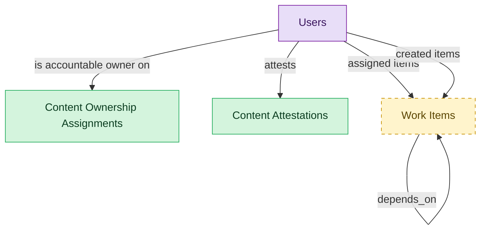

# Ownership, Lifecycle and Planning

## 1. Overview

Accountable ownership assignments, recertification attestations, and the improvement backlog.

## 2. Entity summary

| Name | data_object | Description |
| --- | --- | --- |
| Content Attestations | `intranet_content_attestations` | Recertification records where an owner confirms content is current or flags it stale for remediation or archival. |
| Content Ownership Assignments | `intranet_content_ownership_assignments` | Assignments of an accountable owner and backup to a content record, with the review cadence the owner must keep. |
| Work Items | `work_items` | Atomic tasks, items, or cards in a work-management tool, with owner, due date, status, priority, dependencies, subtasks, attachments, and comments. |
| Users | `users` | Platform users referenced as assignees, authors, approvers, and creators across records. |

## 3. Entities catalog

| # | data_object | canonical code | singular | plural | description | role | mastered in | mastered label | necessity | pattern flags | entity_type | write tier | notes |
| ---: | --- | --- | --- | --- | --- | --- | --- | --- | --- | --- | --- | --- | --- |
| 1 | `intranet_content_attestations` | `intranet_content_attestations` | Content Attestation | Content Attestations | A recertification record: an owner attests that a piece of content is current, or flags it stale for remediation or archival. | master | - | - | required | single_approver | operational_workflow | `:manage` | - |
| 2 | `intranet_content_ownership_assignments` | `intranet_content_ownership_assignments` | Content Ownership Assignment | Content Ownership Assignments | Assignment of an accountable owner and backup to an inventory record, with the review cadence the owner is responsible for. | master | - | - | required | - | junction | `:manage` | - |
| 3 | `work_items` | `work_items` | Work Item | Work Items | Atomic primitive in a work-management platform: task / item / card with owner, due date, status, priority, dependencies, subtasks, attachments, and comments. Same shape regardless of platform-specific terminology (task, item, row, card). | embedded_master | `work-mgmt-task-exec` | Task and Project Execution | optional | - | operational_workflow | `:manage` | - |
| 4 | `users` | `users` | User | Users | Semantius platform-owned user table. Referenced from domain `data_objects` via `data_object_relationships` for assignee / author / approver / creator edges. Not surfaced in domain-level analytics (Signal 1/2 ignore `kind='platform_builtin'`). | consumer | _(platform built-in)_ | _(platform built-in)_ | required | - | operational_record | `:manage` | - |

## 4. Aliases and industry synonyms

_(none: no industry-scoped aliases for this scope)_

## 5. Relationships

### 5.1 Intra-scope edges

| from | verb | to | cardinality | kind | necessity | owner_side | delete_mode | fk_format | notes |
| --- | --- | --- | --- | --- | --- | --- | --- | --- | --- |
| `work_items` | depends_on | `work_items` | many_to_many | association | optional | source | clear | reference | - |

### 5.2 Built-in edges (`users` and other platform built-ins)

| from | verb | to | cardinality | necessity | owner_side | delete_mode | fk_format | notes |
| --- | --- | --- | --- | --- | --- | --- | --- | --- |
| `users` | assigned items | `work_items` | one_to_many | optional | source | clear | reference | - |
| `users` | created items | `work_items` | one_to_many | required | source | restrict | reference | - |
| `users` | is accountable owner on | `intranet_content_ownership_assignments` | one_to_many | required | source | restrict | reference | - |
| `users` | attests | `intranet_content_attestations` | one_to_many | required | source | restrict | reference | - |

### 5.3 Cross-scope edges

#### 5.3a Outbound from this scope's masters and contributors

_Edges this scope drives: the in-scope endpoint has `role` of `master` or `contributor`._

| from | verb | to | cardinality | necessity | delete_mode | fk_format | notes |
| --- | --- | --- | --- | --- | --- | --- | --- |
| `intranet_content_inventory_records` | is governed by | `intranet_content_ownership_assignments` | one_to_many | optional | none | n/a | - |
| `intranet_content_inventory_records` | is attested by | `intranet_content_attestations` | one_to_many | optional | none | n/a | - |

#### 5.3b Context edges on embedded shells and consumed entities

_Edges the canonical owner drives, shown for context: the in-scope endpoint has `role` of `embedded_master`, `consumer`, or `derived`._

| from | verb | to | cardinality | necessity | delete_mode | fk_format | notes |
| --- | --- | --- | --- | --- | --- | --- | --- |
| `test_defects` | spawns | `work_items` | one_to_many | optional | none | n/a | - |
| `work_dependencies` | blocks | `work_items` | many_to_many | required | none (required-if-present) | n/a | - |
| `work_approval_chains` | gates | `work_items` | many_to_many | optional | none | n/a | - |
| `work_user_workloads` | rolls_up | `work_items` | many_to_many | required | none (required-if-present) | n/a | - |
| `work_custom_field_values` | set_on | `work_items` | one_to_many | required | ⚠ audit: required composed child out of scope | n/a | - |
| `work_items` | placed_in | `work_sections` | one_to_many | optional | none | n/a | - |
| `work_task_templates` | seeds_item | `work_items` | one_to_many | optional | none | n/a | - |
| `work_item_tags` | tagged_on | `work_items` | one_to_many | required | ⚠ audit: required composed child out of scope | n/a | - |
| `work_item_comments` | belongs_to | `work_items` | one_to_many | required | ⚠ audit: required composed child out of scope | n/a | - |
| `work_item_attachments` | belongs_to | `work_items` | one_to_many | required | ⚠ audit: required composed child out of scope | n/a | - |
| `work_form_submissions` | converts_to | `work_items` | one_to_many | optional | none | n/a | - |
| `action_plans` | spawns | `work_items` | one_to_many | optional | none | n/a | - |
| `work_projects` | contains | `work_items` | one_to_many | required | ⚠ audit: required composed child out of scope | n/a | - |
| `okr_objectives` | tracked_by | `work_items` | one_to_many | optional | none | n/a | - |
| `work_automations` | drives | `work_items` | one_to_many | optional | none | n/a | - |
| `work_items` | mirrors_to | `service_requests` | one_to_one | optional | none | n/a | - |
| `strategic_initiatives` | portfolio rollup from | `work_items` | one_to_many | optional | none | n/a | - |
| `intranet_content_inventory_records` | spawns improvement | `work_items` | one_to_many | optional | none | n/a | - |
| `marketing_plan_lines` | is delivered by | `work_items` | one_to_many | optional | none | n/a | - |
| `proofing_sessions` | belongs_to | `work_items` | one_to_many | required | ⚠ audit: required composed child out of scope | n/a | - |
| `work_time_entries` | logged_against | `work_items` | one_to_many | required | ⚠ audit: required composed child out of scope | n/a | - |
| `work_goal_links` | links | `work_items` | one_to_many | required | none (required-if-present) | n/a | - |
| `work_statuses` | is_status_of | `work_items` | one_to_many | optional | none | n/a | - |
| `work_status_updates` | records_change_on | `work_items` | one_to_many | required | ⚠ audit: required composed child out of scope | n/a | - |

## 6. Cross-domain context

### 6.1 Master consumers (other modules / domains that embed this scope's masters)

_(none: no other module embeds this scope's masters; the canonical owners do.)_

### 6.2 Outbound handoffs (events this scope publishes)

| source module | target domain | target module | trigger_event | transition | payload | integration | friction | description |
| --- | --- | --- | --- | --- | --- | --- | --- | --- |
| WORK-MGMT-TASK-EXEC | SPM | _(domain-level)_ | `work_item.completed` | `in_progress` → `done` _(lifecycle)_ | `work_items` | batch_sync | medium | Work-management platforms publish task-completion data to portfolio dashboards in SPM tools. The portfolio rollup powers strategy-to-execution dashboards and OKR progress (via okr_objectives.key_results linking down to work_items). Nightly sync is the common pattern; richer real-time integrations exist but are vendor-specific. |
| WORK-MGMT-TASK-EXEC | PSA | PSA-PROJECT-DELIVERY | `work_item.completed` | `in_progress` → `done` _(lifecycle)_ | `work_items` | api_call | low | When WM is the work tracker for a PSA-managed delivery, work_item completion closes the loop on PSA-side time / utilization accounting. Pairs with the existing PSA -> WM project_task.completed inbound for the bidirectional sync pattern. |
| WORK-MGMT-TASK-EXEC | PROD-MGMT | PM-ROADMAP-DELIVERY | `work_item.completed` | `in_progress` → `done` _(lifecycle)_ | `work_items` | api_call | medium | WM work_item completion updates PROD-MGMT roadmap progress when items are linked to feature_requests or product_releases. Most product-mgmt tools (Aha, Productboard, Roadmunk) integrate via this signal but each integration is bespoke - friction is the mapping between work_item id and roadmap_item id. |
| WORK-MGMT-TASK-EXEC | WORK-MGMT | WORK-MGMT-GOALS-OKR | `work_item.completed` | `in_progress` → `done` _(lifecycle)_ | `work_items` | lifecycle_progression | low | Terminal completion of a work item is the strongest progress signal - drives KR closure recalculation and triggers KR-fully-met evaluations on linked objectives. |
| WORK-MGMT-TASK-EXEC | WORK-MGMT | WORK-MGMT-GOALS-OKR | `work_item.status_changed` | `any` → `any` _(lifecycle)_ | `work_items` | lifecycle_progression | low | Work item status change triggers KR progress recalculation in GOALS-OKR for any objective that has linked the item to a key result. In-process FK + state read; no message moves. |
| INTGOV-GOVERNANCE | WORK-MGMT | WORK-MGMT-TASK-EXEC | `intranet_content_attestation.flagged_stale` | `pending` → `flagged_stale` _(state_change)_ | `work_items` | api_call | medium | When content is flagged stale during recertification, an improvement work item is created in Work Management for remediation. |

### 6.3 Inbound handoffs (events this scope reacts to)

| target module | source domain | source module | trigger_event | transition | payload | integration | friction | description |
| --- | --- | --- | --- | --- | --- | --- | --- | --- |
| WORK-MGMT-TASK-EXEC | WORK-MGMT | WORK-MGMT-INTAKE | `work_form_submission.converted` | `triaged` → `converted` _(lifecycle)_ | `work_items` | lifecycle_progression | low | A converted intake form submission spawns a work item in the task-execution module under the routed project. |
| WORK-MGMT-TASK-EXEC | MRM | MRM-PLANNING | `marketing_plan_line.scheduled` | `scheduled` _(state_change)_ | `work_items` | api_call | medium | When a plan line is scheduled on the marketing calendar, the delivery work is handed to work-management as tasks and projects. Payload: the work item that delivers the plan line. |
| INTGOV-GOVERNANCE | INTRANET-GOV | INTGOV-INVENTORY | `intranet_content_inventory_record.registered` | `registered` _(lifecycle)_ | `intranet_content_ownership_assignments` | lifecycle_progression | low | When content is registered in the inventory, the governance module opens an ownership assignment so the item gets an accountable owner. |

### 6.4 Master providers (modules / domains that own masters this scope embeds)

| data_object | role here | necessity | canonical owner(s) | slice notes |
| --- | --- | --- | --- | --- |
| `work_items` | embedded_master | optional | WORK-MGMT-TASK-EXEC (WORK-MGMT) | - |
| `users` | consumer | required | _(platform built-in)_ | - |

## 7. Lifecycle states

### `intranet_content_attestations` (Content Attestation)

| order | state_name | initial? | terminal? | requires_permission? | derived gate | description |
| --- | --- | --- | --- | --- | --- | --- |
| 1 | `pending` | ✓ | - | - | - | - |
| 2 | `attested_current` | - | - | ✓ | `intgov-governance:attest` | - |
| 3 | `flagged_stale` | - | - | ✓ | `intgov-governance:flag_stale` | - |
| 4 | `remediated` | - | - | - | - | - |
| 5 | `archived` | - | ✓ | ✓ | `intgov-governance:archive` | - |

### `work_items` (Work Item)

_This scope holds `work_items` as **embedded_master**; the canonical state machine is owned by `WORK-MGMT-TASK-EXEC`._

| order | state_name | initial? | terminal? | requires_permission? | derived gate | description |
| --- | --- | --- | --- | --- | --- | --- |
| 1 | `open` | ✓ | - | - | - | - |
| 2 | `in_progress` | - | - | - | - | - |
| 3 | `blocked` | - | - | - | - | - |
| 4 | `done` | - | ✓ | - | - | - |
| 5 | `canceled` | - | ✓ | ✓ | `intgov-governance:cancel_work_item` | - |

## 8. Permissions and business rules (derived)

### 8.1 Permissions

| permission | tier | description | included in `:admin`? |
| --- | --- | --- | --- |
| `intgov-governance:read` | baseline-read | Read access to every entity in the module | ✓ |
| `intgov-governance:manage` | baseline-manage | Edit operational records | ✓ |
| `intgov-governance:admin` | baseline-admin | Edit reference data and inherit every workflow gate below | - |
| `intgov-governance:cancel_work_item` | workflow-gate (lifecycle) | Transition `work_items` into state `canceled` | ✓ |
| `intgov-governance:attest` | workflow-gate (lifecycle) | Transition `intranet_content_attestations` into state `attested_current` | ✓ |
| `intgov-governance:flag_stale` | workflow-gate (lifecycle) | Transition `intranet_content_attestations` into state `flagged_stale` | ✓ |
| `intgov-governance:archive` | workflow-gate (lifecycle) | Transition `intranet_content_attestations` into state `archived` | ✓ |

### 8.2 Business rules

| rule_name | data_object | source flag | intent |
| --- | --- | --- | --- |
| `approve_content_attestation_requires_approver` | `intranet_content_attestations` | has_single_approver | Exactly one explicit approver required; uses the module's approval gate (`intgov-governance:approve_content_attestation` if surfaced as a lifecycle workflow gate). |

## 9. Roles, RACI, and responsibilities (derived)

_Baseline roles, the permission hierarchy, and RACI realization are DERIVED from this scope's entity-type write tiers + `process_raci`; none of it is stored in the catalog (the deployer provisions it from this blueprint)._

### 9.1 `INTGOV-GOVERNANCE`

**Baseline roles:**

| role | baseline grant |
| --- | --- |
| `intgov-governance_viewer` | `intgov-governance:read` |
| `intgov-governance_manager` | `intgov-governance:manage` |

**Permission hierarchy:**

| permission | includes |
| --- | --- |
| `intgov-governance:admin` | `intgov-governance:manage` |
| `intgov-governance:manage` | `intgov-governance:read` |
| `intgov-governance:admin` | `intgov-governance:cancel_work_item` |
| `intgov-governance:admin` | `intgov-governance:attest` |
| `intgov-governance:admin` | `intgov-governance:flag_stale` |
| `intgov-governance:admin` | `intgov-governance:archive` |

**Processes wired:**

| process_key | process_name | PCF code | PCF ID | level | description |
| --- | --- | --- | --- | --- | --- |
| `manage_projects` | Manage projects | 13.2.3 | 16410 | 3 | Establishing the scope of the projects. Create plans for implementing the projects. Initiate projects. Review and report project performance to management. Close projects. |
| - | Recertify Intranet Content | CUSTOM-INTRANET-GOV-RECERT | - | 1 | Periodic recertification of intranet content: owners attest that content is current, or flag it stale for remediation or archival, keeping the intranet free of ghost-town content. |

**RACI realization:**

| actor | kind | raci | process_key | realization |
| --- | --- | --- | --- | --- |
| `OPERATIONS-WORK-CONTRIBUTOR` | persona | responsible | `manage_projects` | grant gates [intgov-governance:cancel_work_item] + the gated entities' write tier |
| `OPERATIONS-WORK-PROGRAM-LEAD` | persona | accountable | `manage_projects` | approval gate |
| `CONTENT-OWNER` | persona | responsible | - | grant gates [intgov-governance:attest, intgov-governance:flag_stale, intgov-governance:archive] + the gated entities' write tier |
| `DIGITAL-WORKPLACE-GOV-LEAD` | persona | accountable | - | approval gate |
| `ITOPS-INTRANET-ADMIN` | persona | consulted | - | advisory read grant |

### 9.2 Functional ownership and default grants

| responsibility | business function | default role | default tier |
| --- | --- | --- | --- |
| owner | Human Resources | `admin` | `:admin` |
| owner | IT Operations | `admin` | `:admin` |
| contributor | Marketing Communications | `manage` | `:manage` |
| consumer | Executive | `read` | `:read` |
