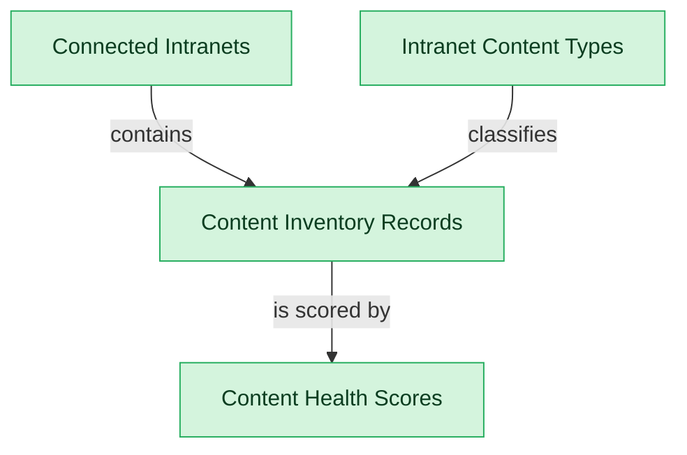

# Inventory and Sources

## 1. Overview

Connector registry, cross-platform content inventory, content-type policy, and health scoring.

## 2. Entity summary

| Name | data_object | Description |
| --- | --- | --- |
| Connected Intranets | `connected_intranets` | A source intranet platform under governance (the connector target): platform type, base URL, auth, crawl schedule, and status. |
| Content Health Scores | `intranet_content_health_scores` | Derived freshness, quality, accessibility, and ownership-coverage score per inventory record. |
| Content Inventory Records | `intranet_content_inventory_records` | A discovered or registered piece of intranet content (page, hub, space, library, form) across connected intranets, with source, type, last-modified, owner, and governance status. |
| Intranet Content Types | `intranet_content_types` | A governed content-type definition (policy, news post, hub, library, form, FAQ) carrying its default review cadence, criticality, and retention rule. |

## 3. Entities catalog

| # | data_object | canonical code | singular | plural | role | mastered in | mastered label | necessity | pattern flags | entity_type | write tier | notes |
| ---: | --- | --- | --- | --- | --- | --- | --- | --- | --- | --- | --- | --- |
| 1 | `connected_intranets` | `connected_intranets` | Connected Intranet | Connected Intranets | master | - | - | required | - | catalog | `:admin` | - |
| 2 | `intranet_content_health_scores` | `intranet_content_health_scores` | Content Health Score | Content Health Scores | master | - | - | required | - | computed | read-only | - |
| 3 | `intranet_content_inventory_records` | `intranet_content_inventory_records` | Content Inventory Record | Content Inventory Records | master | - | - | required | - | operational_record | `:manage` | - |
| 4 | `intranet_content_types` | `intranet_content_types` | Intranet Content Type | Intranet Content Types | master | - | - | required | - | catalog | `:admin` | - |

## 4. Aliases and industry synonyms

_(none: no industry-scoped aliases for this scope)_

## 5. Relationships

### 5.1 Intra-scope edges

| from | verb | to | cardinality | kind | necessity | owner_side | delete_mode | fk_format | notes |
| --- | --- | --- | --- | --- | --- | --- | --- | --- | --- |
| `connected_intranets` | contains | `intranet_content_inventory_records` | one_to_many | composition | required | source | cascade | parent | - |
| `intranet_content_types` | classifies | `intranet_content_inventory_records` | one_to_many | reference | required | source | restrict | reference | - |
| `intranet_content_inventory_records` | is scored by | `intranet_content_health_scores` | one_to_one | composition | optional | source | cascade | parent | - |

### 5.2 Built-in edges (`users` and other platform built-ins)

_(none: no relationships against platform built-ins)_

### 5.3 Cross-scope edges

#### 5.3a Outbound from this scope's masters and contributors

_Edges this scope drives: the in-scope endpoint has `role` of `master` or `contributor`._

| from | verb | to | cardinality | necessity | delete_mode | fk_format | notes |
| --- | --- | --- | --- | --- | --- | --- | --- |
| `intranet_content_inventory_records` | is governed by | `intranet_content_ownership_assignments` | one_to_many | optional | none | n/a | - |
| `intranet_content_inventory_records` | is attested by | `intranet_content_attestations` | one_to_many | optional | none | n/a | - |
| `intranet_content_inventory_records` | spawns improvement | `work_items` | one_to_many | optional | none | n/a | - |

#### 5.3b Context edges on embedded shells and consumed entities

_Edges the canonical owner drives, shown for context: the in-scope endpoint has `role` of `embedded_master`, `consumer`, or `derived`._

_(none: no context cross-scope edges on this scope's embedded shells or consumed entities)_

## 6. Cross-domain context

### 6.1 Master consumers (other modules / domains that embed this scope's masters)

_(none: no other module embeds this scope's masters; the canonical owners do.)_

### 6.2 Outbound handoffs (events this scope publishes)

_(none: no outbound handoffs whose payload is in this scope)_

### 6.3 Inbound handoffs (events this scope reacts to)

_(none: no inbound handoffs whose payload is in this scope)_

### 6.4 Master providers (modules / domains that own masters this scope embeds)

_(none: this scope embeds no masters owned elsewhere; every entity is mastered here)_

## 7. Lifecycle states

_(none: no lifecycle states for the entities in this scope)_
## 8. Permissions and business rules (derived)

### 8.1 Permissions

| permission | tier | description | included in `:admin`? |
| --- | --- | --- | --- |
| `intgov-inventory:read` | baseline-read | Read access to every entity in the module | ✓ |
| `intgov-inventory:manage` | baseline-manage | Edit operational records | ✓ |
| `intgov-inventory:admin` | baseline-admin | Edit reference data and inherit every workflow gate below | - |

### 8.2 Business rules

_(none: no flag-derived business rules)_

## 9. Roles, RACI, and responsibilities (derived)

_Baseline roles, the permission hierarchy, and RACI realization are DERIVED from this scope's entity-type write tiers + `process_raci`; none of it is stored in the catalog (the deployer provisions it from this blueprint)._

### 9.1 `INTGOV-INVENTORY`

**Baseline roles:**

| role | baseline grant |
| --- | --- |
| `intgov-inventory_viewer` | `intgov-inventory:read` |
| `intgov-inventory_manager` | `intgov-inventory:manage` |
| `intgov-inventory_admin` | `intgov-inventory:admin` |

**Permission hierarchy:**

| permission | includes |
| --- | --- |
| `intgov-inventory:admin` | `intgov-inventory:manage` |
| `intgov-inventory:manage` | `intgov-inventory:read` |

**RACI realization:**

_(none: no process_raci assignments wired to this module's gated processes yet)_

### 9.2 Functional ownership and default grants

| responsibility | business function | default role | default tier |
| --- | --- | --- | --- |
| owner | Human Resources | `admin` | `:admin` |
| owner | IT Operations | `admin` | `:admin` |
| contributor | Marketing Communications | `manage` | `:manage` |
| consumer | Executive | `read` | `:read` |
