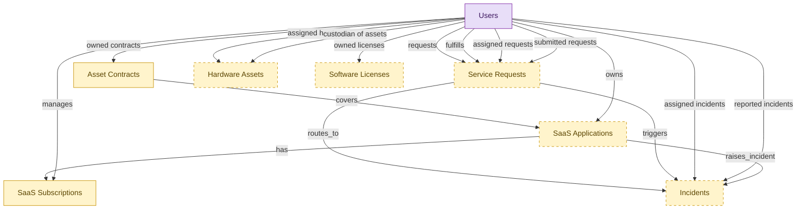

# IT Operations Starter

## 1. Overview

Cross-domain starter kit for small and mid-sized IT teams. Embeds lightweight shells of the records a small IT shop manages: the helpdesk (optional), the hardware register, the SaaS application and renewal tracker, and the contract register. The renewal/contract spine (asset_contracts + saas_subscriptions) is required; hardware, SaaS apps, helpdesk, and on-prem licenses are optional. domain_id NULL; hosts ITSM, HAM, SMP, ITAM, SAM. Replaces the helpdesk-plus-spreadsheets reality; budget stays in the general ledger.

## 2. Entity summary

| Name | data_object | Description |
| --- | --- | --- |
| Asset Contracts | `asset_contracts` | Lease, maintenance, support, or warranty contracts governing an asset or pool of assets, indexed on the asset side. |
| Hardware Assets | `hardware_assets` | Physical IT assets such as laptops, servers, network gear, and peripherals, with serial number, asset tag, current user or location, and lifecycle state. |
| Incidents | `service_incidents` | Unplanned service interruptions or quality reductions, with severity, priority, category, assignee, and affected components. |
| SaaS Applications | `saas_applications` | SaaS applications in the company portfolio, with vendor, category, criticality, owner, and whether each is sanctioned or shadow IT. |
| SaaS Subscriptions | `saas_subscriptions` | Contractual subscriptions for SaaS apps: plan tier, seat count, recurring cost, billing cadence, renewal date, and owner. |
| Service Requests | `service_requests` | Planned, catalog-driven requests for access, hardware, software, or information, distinct from reactive incidents. |
| Software Licenses | `software_licenses` | License entitlements granting the right to use a software title, with vendor, purchased count, license model, term, and renewal date. |
| Users | `users` | Platform users referenced as assignees, authors, approvers, and creators across records. |

## Additional Requirements Specification

Cost fields on the embedded shells. For the standalone renewal-and-cost view to resolve, two embedded masters each need a flat cost figure plus a currency code:

- `asset_contracts`: a flat `renewal_cost` (or `annual_value`) numeric field.
- `saas_subscriptions`: a flat `annual_spend` (or MRR/ARR) numeric field.

Coexistence: these flat fields are a standalone-only denormalization. They are not needed when the full asset-management and SaaS-management modules are already installed (those carry cost on their own spend entities); when such a full module is added later, the flat field must be deduplicated and reconciled against the canonical source so cost is not double-counted.

## 3. Entities catalog

| # | data_object | canonical code | singular | plural | role | mastered in | mastered label | necessity | personal_content | entity_type | write tier | notes |
| ---: | --- | --- | --- | --- | --- | --- | --- | --- | --- | --- | --- | --- |
| 1 | `asset_contracts` | `asset_contracts` | Asset Contract | Asset Contracts | embedded_master | `itam-contracts` | Cross-Asset Contract Management | required | - | operational_workflow | `:manage` | - |
| 2 | `hardware_assets` | `hardware_assets` | Hardware Asset | Hardware Assets | embedded_master | `ham-asset-registry` | Hardware Asset Registry | optional | - | operational_workflow | `:manage` | - |
| 3 | `service_incidents` | `service_incidents` | Incident | Incidents | embedded_master | `itsm-incident-mgmt` | Incident Management | optional | yes | operational_workflow | `:manage` | - |
| 4 | `saas_applications` | `saas_applications` | SaaS Application | SaaS Applications | embedded_master | `smp-discovery` | SMP Discovery and Catalog | optional | - | operational_workflow | `:manage` | - |
| 5 | `saas_subscriptions` | `saas_subscriptions` | SaaS Subscription | SaaS Subscriptions | embedded_master | `smp-renewal-vendor` | SMP Renewal and Vendor Management | required | - | operational_workflow | `:manage` | - |
| 6 | `service_requests` | `service_requests` | Service Request | Service Requests | embedded_master | `itsm-service-request` | Service Request Fulfillment | optional | - | operational_workflow | `:manage` | - |
| 7 | `software_licenses` | `software_licenses` | Software License | Software Licenses | embedded_master | `sam-entitlement-mgmt` | Entitlement Reconciliation and Renewal | optional | - | operational_workflow | `:manage` | - |
| 8 | `users` | `users` | User | Users | consumer | _(platform built-in)_ | _(platform built-in)_ | required | - | operational_record | `:manage` | - |

## 4. Aliases and industry synonyms

_(none: no industry-scoped aliases for this scope)_

## 5. Relationships

### 5.1 Intra-scope edges

| from | verb | to | cardinality | kind | necessity | owner_side | delete_mode | fk_format | notes |
| --- | --- | --- | --- | --- | --- | --- | --- | --- | --- |
| `asset_contracts` | covers | `saas_applications` | many_to_many | reference | optional | target | clear | reference | - |
| `service_requests` | routes_to | `service_incidents` | one_to_many | reference | optional | source | clear | reference | - |
| `service_requests` | triggers | `service_incidents` | one_to_many | reference | optional | target | clear | reference | - |
| `saas_applications` | has | `saas_subscriptions` | one_to_many | reference | optional | source | clear | reference | - |
| `saas_applications` | raises_incident | `service_incidents` | one_to_many | reference | optional | source | clear | reference | - |

### 5.2 Built-in edges (`users` and other platform built-ins)

| from | verb | to | cardinality | necessity | owner_side | delete_mode | fk_format | notes |
| --- | --- | --- | --- | --- | --- | --- | --- | --- |
| `users` | assigned hardware | `hardware_assets` | one_to_many | optional | source | clear | reference | - |
| `users` | custodian of assets | `hardware_assets` | one_to_many | optional | source | clear | reference | - |
| `users` | owned contracts | `asset_contracts` | one_to_many | optional | source | clear | reference | - |
| `users` | owned licenses | `software_licenses` | one_to_many | optional | source | clear | reference | - |
| `users` | requests | `service_requests` | one_to_many | required | source | restrict | reference | - |
| `users` | fulfills | `service_requests` | one_to_many | optional | source | clear | reference | - |
| `users` | assigned incidents | `service_incidents` | one_to_many | optional | source | clear | reference | - |
| `users` | reported incidents | `service_incidents` | one_to_many | required | source | restrict | reference | - |
| `users` | assigned requests | `service_requests` | one_to_many | optional | source | clear | reference | - |
| `users` | submitted requests | `service_requests` | one_to_many | required | source | restrict | reference | - |
| `users` | owns | `saas_applications` | one_to_many | required | target | restrict | reference | - |
| `users` | manages | `saas_subscriptions` | one_to_many | required | target | restrict | reference | - |

### 5.3 Cross-scope edges

#### 5.3a Outbound from this scope's masters and contributors

_Edges this scope drives: the in-scope endpoint has `role` of `master` or `contributor`._

_(none: no outbound cross-scope edges from this scope's masters or contributors)_

#### 5.3b Context edges on embedded shells and consumed entities

_Edges the canonical owner drives, shown for context: the in-scope endpoint has `role` of `embedded_master`, `consumer`, or `derived`._

| from | verb | to | cardinality | necessity | delete_mode | fk_format | notes |
| --- | --- | --- | --- | --- | --- | --- | --- |
| `service_incidents` | triggers | `remediation_plans` | one_to_many | optional | none | n/a | - |
| `enterprise_applications` | aliased_as | `saas_applications` | one_to_one | optional | none | n/a | - |
| `application_interfaces` | raises | `service_incidents` | one_to_many | optional | none | n/a | - |
| `configuration_items` | backed_by | `hardware_assets` | one_to_one | optional | none | n/a | - |
| `configuration_items` | triggers | `service_incidents` | one_to_many | optional | none | n/a | - |
| `service_maps` | refreshes | `service_incidents` | many_to_many | optional | none | n/a | - |
| `ci_baselines` | triggers | `service_incidents` | one_to_many | optional | none | n/a | - |
| `hardware_models` | instantiated_as | `hardware_assets` | one_to_many | required | none (required-if-present) | n/a | - |
| `hardware_assets` | covered_by | `hardware_warranties` | one_to_many | optional | none | n/a | - |
| `hardware_assets` | disposed_via | `hardware_disposal_records` | one_to_one | optional | none | n/a | - |
| `hardware_assets` | served_by | `spare_parts_inventory` | many_to_many | optional | none | n/a | - |
| `hardware_assets` | triggers | `rmm_agents` | one_to_one | optional | none | n/a | - |
| `asset_contracts` | governs | `asset_lifecycle_events` | one_to_many | optional | none | n/a | - |
| `saas_applications` | lifecycle events for | `asset_lifecycle_events` | one_to_many | optional | none | n/a | - |
| `asset_contracts` | fulfilled_by | `purchase_orders` | one_to_many | optional | none | n/a | - |
| `asset_contracts` | feeds | `compliance_risks` | one_to_many | optional | none | n/a | - |
| `asset_contracts` | accrues_in | `journal_entries` | one_to_many | optional | none | n/a | - |
| `chat_threads` | escalates_to | `service_incidents` | one_to_many | optional | none | n/a | - |
| `control_tests` | escalates_to | `service_incidents` | one_to_many | optional | none | n/a | - |
| `audit_engagements` | triggers | `service_requests` | one_to_many | optional | none | n/a | - |
| `service_catalog_items` | spawns | `service_requests` | one_to_many | optional | none | n/a | - |
| `hardware_assets` | represented_as | `configuration_items` | one_to_one | optional | none | n/a | - |
| `test_defects` | escalates_to | `service_incidents` | one_to_many | optional | none | n/a | - |
| `saas_applications` | entitles_to | `iga_user_entitlements` | one_to_many | required | none (required-if-present) | n/a | - |
| `saas_applications` | owns | `smp_app_owners` | many_to_many | required | none (required-if-present) | n/a | - |
| `saas_applications` | integrates_with | `smp_app_integrations` | one_to_many | required | none (required-if-present) | n/a | - |
| `saas_applications` | publishes | `smp_app_catalog_listings` | one_to_one | required | none (required-if-present) | n/a | - |
| `saas_applications` | raised_for | `smp_alerts` | one_to_many | optional | none | n/a | - |
| `saas_applications` | tracks_stage | `smp_app_lifecycle_stages` | one_to_one | required | none (required-if-present) | n/a | - |
| `saas_applications` | recommends_for_app | `smp_optimization_recommendations` | one_to_many | optional | none | n/a | - |
| `saas_subscriptions` | recommends_for_sub | `smp_optimization_recommendations` | one_to_many | optional | none | n/a | - |
| `saas_applications` | benchmarks_for | `smp_app_benchmarks` | one_to_many | required | none (required-if-present) | n/a | - |
| `saas_subscriptions` | tasks_for | `smp_renewal_tasks` | one_to_many | required | none (required-if-present) | n/a | - |
| `saas_subscriptions` | engagement_for | `smp_renewal_engagements` | one_to_many | required | none (required-if-present) | n/a | - |
| `saas_subscriptions` | allocates | `smp_spend_allocations` | one_to_many | required | none (required-if-present) | n/a | - |
| `saas_applications` | assesses_app | `smp_vendor_risk_assessments` | one_to_many | required | none (required-if-present) | n/a | - |
| `saas_applications` | automates_app | `smp_automation_workflows` | one_to_many | optional | none | n/a | - |
| `lcap_apps` | opens | `service_incidents` | many_to_many | optional | none | n/a | - |
| `legal_contracts` | activates | `saas_subscriptions` | one_to_many | optional | none | n/a | - |
| `legal_contracts` | activates | `software_licenses` | one_to_many | optional | none | n/a | - |
| `dlp_incidents` | informs_security_incident | `service_incidents` | one_to_many | optional | none | n/a | - |
| `legal_contracts` | renewal_warns | `saas_subscriptions` | one_to_many | optional | none | n/a | - |
| `employees` | triggers | `service_requests` | one_to_many | optional | none | n/a | - |
| `onboarding_tasks` | emits | `service_requests` | one_to_many | optional | none | n/a | - |
| `hardware_assets` | delivered by | `asset_lifecycle_events` | one_to_many | optional | none | n/a | - |
| `onboarding_tasks` | emits | `service_incidents` | one_to_many | optional | none | n/a | - |
| `hr_cases` | spawns | `service_requests` | one_to_many | optional | none | n/a | - |
| `service_problems` | is investigated by | `service_incidents` | one_to_many | optional | none | n/a | - |
| `service_incidents` | references | `configuration_items` | many_to_many | optional | none | n/a | - |
| `service_slas` | governs incident | `service_incidents` | one_to_many | required | none (required-if-present) | n/a | - |
| `service_slas` | governs request | `service_requests` | one_to_many | required | none (required-if-present) | n/a | - |
| `service_incidents` | resolved_with | `knowledge_articles` | many_to_many | optional | none | n/a | - |
| `service_incidents` | correlates_to | `monitoring_alerts` | many_to_many | optional | none | n/a | - |
| `service_incidents` | correlates_to | `error_groups` | many_to_many | optional | none | n/a | - |
| `eam_work_orders` | escalates_to | `service_incidents` | one_to_many | optional | none | n/a | - |
| `clinical_engineering_work_orders` | surfaces_in | `service_requests` | one_to_one | optional | none | n/a | - |
| `device_calibration_records` | schedules_in | `service_requests` | one_to_many | optional | none | n/a | - |
| `saas_subscriptions` | charged to subscription | `expense_lines` | one_to_many | optional | none | n/a | - |
| `work_items` | mirrors_to | `service_requests` | one_to_one | optional | none | n/a | - |
| `work_automations` | propagates_to | `service_requests` | many_to_many | optional | none | n/a | - |
| `saas_applications` | measured_by | `saas_usage_metrics` | one_to_many | required | ⚠ audit: required composed child out of scope | n/a | - |
| `saas_applications` | assigned_via | `smp_license_seat_assignments` | one_to_many | required | ⚠ audit: required composed child out of scope | n/a | - |
| `saas_subscriptions` | grants | `smp_license_seat_assignments` | one_to_many | optional | none | n/a | - |
| `shadow_it_apps` | promotes_to | `saas_applications` | one_to_one | optional | none | n/a | - |
| `event_correlations` | triggers | `service_incidents` | one_to_many | optional | none | n/a | - |
| `root_cause_analyses` | annotates | `service_incidents` | one_to_many | optional | none | n/a | - |
| `incident_predictions` | forecasts | `service_incidents` | one_to_many | optional | none | n/a | - |
| `dc_cabinets` | raises | `service_incidents` | one_to_many | optional | none | n/a | - |
| `dc_power_distribution_units` | raises | `service_incidents` | one_to_many | optional | none | n/a | - |
| `dc_uninterruptible_power_supplies` | raises | `service_incidents` | one_to_many | optional | none | n/a | - |
| `dc_cooling_units` | raises | `service_incidents` | one_to_many | optional | none | n/a | - |
| `saas_applications` | is registered as | `enterprise_applications` | one_to_one | optional | none | n/a | - |
| `enterprise_applications` | is delivered via | `saas_subscriptions` | one_to_many | optional | none | n/a | - |
| `endpoint_experience_scores` | triggers | `service_incidents` | one_to_many | optional | none | n/a | - |

## 6. Cross-domain context

### 6.1 Master consumers (other modules / domains that embed this scope's masters)

_(none: no other module embeds this scope's masters; the canonical owners do.)_

### 6.2 Outbound handoffs (events this scope publishes)

| source module | target domain | target module | trigger_event | transition | payload | integration | friction | description |
| --- | --- | --- | --- | --- | --- | --- | --- | --- |
| ITAM-CONTRACTS | ITAM | ITAM-LIFECYCLE | `asset_contract.activated` | `draft` → `active` _(state_change)_ | `asset_contracts` | lifecycle_progression | low | - |
| ITAM-CONTRACTS | ITAM | ITAM-LIFECYCLE | `asset_contract.expired` | _(state_change)_ | `asset_contracts` | lifecycle_progression | low | - |
| ITAM-CONTRACTS | ITAM | ITAM-LIFECYCLE | `asset_contract.renewed` | _(state_change)_ | `asset_contracts` | lifecycle_progression | low | - |
| ITAM-CONTRACTS | GRC | _(domain-level)_ | `asset_contract.expired` | _(state_change)_ | `asset_contracts` | event_stream | medium | Expired support contracts feed GRC risk register. |
| SMP-DISCOVERY | IGA | IGA-ENTITLEMENT-CATALOG | `saas_application.discovered` | _(lifecycle)_ | `saas_applications` | event_stream | medium | Newly discovered SaaS apps surface to IGA for shadow-IT visibility and access governance. |
| SMP-DISCOVERY | IGA | IGA-ENTITLEMENT-CATALOG | `saas_application.sanctioned` | _(lifecycle)_ | `saas_applications` | api_call | low | Sanctioned SaaS apps are wired into IGA provisioning catalog. |
| SMP-DISCOVERY | FINOPS | _(domain-level)_ | `saas_application.sanctioned` | _(lifecycle)_ | `saas_applications` | event_stream | medium | Sanctioned SaaS apps come under FINOPS spend tracking. |
| ITAM-CONTRACTS | FIN | _(domain-level)_ | `asset_contract.renewed` | _(state_change)_ | `asset_contracts` | event_stream | medium | Renewed ITAM contracts update ERP-FIN accruals and PO commitments. |

### 6.3 Inbound handoffs (events this scope reacts to)

| target module | source domain | source module | trigger_event | transition | payload | integration | friction | description |
| --- | --- | --- | --- | --- | --- | --- | --- | --- |
| ITSM-INCIDENT-MGMT | ITOM | ITOM-INFRA-MON | `monitoring_event.alert_triggered` | _(signal)_ | `service_incidents` | event_stream | high | Monitoring/alerting events from ITOM auto-create incidents in ITSM when severity and correlation rules match. High friction in practice - alert storms create incident floods, correlation rules drift, and dedupe logic between systems is rarely good enough. The classic 'NOC-floods-the-helpdesk' problem. |
| ITSM-INCIDENT-MGMT | DISCOVERY | _(domain-level)_ | `discovery_scan.failed` | _(state_change)_ | `service_incidents` | api_call | medium | Failed DISCOVERY scans open ITSM tickets for the discovery owner. |
| ITSM-INCIDENT-MGMT | DISCOVERY | _(domain-level)_ | `discovery_source.disconnected` | _(state_change)_ | `service_incidents` | api_call | medium | DISCOVERY source outages auto-ticket ITSM to restore visibility. |
| ITSM-INCIDENT-MGMT | AIOPS | AIOPS-EVENT-CORRELATION | `correlation.identified` | `identified` _(signal)_ | `service_incidents` | event_stream | high | A correlated alert cluster surfaces as ONE incident in ITSM instead of N. The defining noise-reduction promise of AIOps - and the hardest integration to land cleanly, because suppressing the underlying alerts requires bidirectional state with ITOM, and ITSM needs to expose the correlated-events bundle as evidence on the incident. |
| ITSM-INCIDENT-MGMT | AIOPS | AIOPS-PREDICTIVE-INTELLIGENCE | `incident_prediction.high_confidence` | _(signal)_ | `service_incidents` | event_stream | low | Predicted incidents auto-open proactive ITSM tickets ahead of impact. |
| ITSM-INCIDENT-MGMT | AIOPS | AIOPS-PREDICTIVE-INTELLIGENCE | `root_cause_analysis.published` | _(state_change)_ | `service_incidents` | event_stream | low | AIOPS RCA conclusion lands on the linked ITSM incident/problem as resolution context. |
| ITSM-INCIDENT-MGMT | OBS | _(domain-level)_ | `log_entry.error_pattern_matched` | _(signal)_ | `service_incidents` | api_call | medium | Critical log patterns auto-open ITSM tickets for technician triage. |
| ITSM-INCIDENT-MGMT | OBS | _(domain-level)_ | `slo.breached` | `breached` _(state_change)_ | `service_incidents` | event_stream | high | SLO breach (error budget exhausted, burn-rate spike) creates an incident in ITSM. High friction in practice, the routing from an OBS-side SLO-breach event to a correctly assigned ITSM incident is rarely turnkey, especially when the SLO-owning team and the incident-handling team differ. |
| ITSM-INCIDENT-MGMT | TEST-MGMT | _(domain-level)_ | `test_defect.created` | _(lifecycle)_ | `service_incidents` | api_call | medium | Customer-impacting defects in production-pathing tests escalate to ITSM tickets. |
| ITSM-INCIDENT-MGMT | APM | APM-PORTFOLIO-REGISTRY | `application_interface.broken` | `active` → `broken` _(state_change)_ | `service_incidents` | event_stream | high | Integration failure escalates to incident; detection lag; true-positive rate varies. |
| ITSM-INCIDENT-MGMT | GRC | _(domain-level)_ | `control.failed` | `untested` → `fail` _(state_change)_ | `service_incidents` | api_call | high | Failed IT control → ITSM ticket; no feedback when ITSM closes ticket on GRC SLA. |
| ITSM-INCIDENT-MGMT | GRC | _(domain-level)_ | `remediation_plan.created` | _(lifecycle)_ | `service_incidents` | event_stream | medium | Remediation ticket created in ITSM. |
| ITSM-INCIDENT-MGMT | AUDIT | _(domain-level)_ | `audit_engagement.completed` | `in_progress` → `completed` _(lifecycle)_ | `service_incidents` | manual_handoff | high | IT audit outcomes trigger ITSM actions; requires human interpretation of scope/findings. |
| ITSM-SERVICE-REQUEST | HRSD | HRSD-EMPLOYEE-PORTAL | `case.it_assistance_required` | _(state_change)_ | `service_requests` | api_call | medium | HR case that needs IT action (lost laptop replacement, app access for a new role, account lockout) routes a service request into ITSM. Friction sits in the case-to-SR field mapping and status synchronization back to HRSD. |
| ITSM-INCIDENT-MGMT | IGA | IGA-ACCESS-REQUEST | `iga_access_request.approved` | _(state_change)_ | `service_incidents` | api_call | medium | Approved access requests with manual-fulfillment steps route to ITSM. |
| ITSM-INCIDENT-MGMT | IGA | IGA-AUTO-PROVISIONING | `iga_provisioning_event.completed` | _(state_change)_ | `service_incidents` | event_stream | medium | Provisioning event drives ITSM fulfillment-task closure where access tickets exist. |
| ITSM-INCIDENT-MGMT | IGA | IGA-AUTO-PROVISIONING | `iga_provisioning_event.failed` | _(state_change)_ | `service_incidents` | api_call | high | Failed provisioning becomes ITSM incident/request for manual completion. Alert-without-feedback-loop friction shape. |
| ITSM-INCIDENT-MGMT | IPAAS | _(domain-level)_ | `integration_run.failed` | _(lifecycle)_ | `service_incidents` | api_call | high | iPaaS run failures often surface as ITSM tickets - the failed integration usually has business impact (missed orders, stalled provisioning). |
| ITSM-INCIDENT-MGMT | LCAP | LCAP-VISUAL-COMPOSITION | `lcap_app.deployment_failed` | _(signal)_ | `service_incidents` | api_call | medium | Deployment failure opens incident for platform team. |
| ITSM-INCIDENT-MGMT | RPA | _(domain-level)_ | `rpa_bot_credentials.expiring` | _(threshold)_ | `service_incidents` | api_call | medium | Expiring bot credentials open a service request for IT rotation. |
| ITSM-INCIDENT-MGMT | RPA | _(domain-level)_ | `rpa_execution.failed` | _(state_change)_ | `service_incidents` | api_call | high | Bot execution failure opens incident for bot owner; target system change often the root cause. |
| ITSM-INCIDENT-MGMT | TELCO-BSS | _(domain-level)_ | `network_inventory.updated` | _(state_change)_ | `service_incidents` | batch_sync | low | Network inventory updates sync to ITSM CMDB-adjacent inventory. |
| ITSM-INCIDENT-MGMT | TELCO-BSS | _(domain-level)_ | `service_provisioning.failed` | _(state_change)_ | `service_incidents` | event_stream | high | Provisioning failures escalate to ITSM for network/IT diagnosis. |
| ITSM-INCIDENT-MGMT | TELCO-BSS | _(domain-level)_ | `service_trouble_ticket.opened` | _(state_change)_ | `service_incidents` | event_stream | medium | Telco trouble ticket routes to ITSM for network ops resolution. |
| ITSM-INCIDENT-MGMT | HC-PATIENT | _(domain-level)_ | `clinical_order.placed` | _(lifecycle)_ | `service_incidents` | api_call | low | Order routing relies on ITSM-managed integration with lab/imaging systems. |
| ITSM-INCIDENT-MGMT | MFG-OPS | _(domain-level)_ | `shop_floor_case.opened` | _(lifecycle)_ | `service_incidents` | api_call | medium | Shop-floor case with IT/MES root cause is routed to ITSM for incident management. |
| ITSM-INCIDENT-MGMT | UTIL-OPS | _(domain-level)_ | `utility_asset.failed` | _(state_change)_ | `service_incidents` | api_call | medium | Failure of IT-dependent grid/SCADA asset raises an ITSM incident for dependent technology stack. |
| ITSM-INCIDENT-MGMT | CLIN-DEV | _(domain-level)_ | `clinical_engineering_work_order.opened` | _(lifecycle)_ | `service_incidents` | api_call | medium | Clinical engineering work order surfaces in ITSM when shared with IT for connected-device support. |
| ITSM-INCIDENT-MGMT | CLIN-DEV | _(domain-level)_ | `device_calibration.due` | _(threshold)_ | `service_incidents` | batch_sync | low | Calibration scheduling visible to ITSM when biomed device is shared infrastructure. |
| ITSM-SERVICE-REQUEST | SAM | _(domain-level)_ | `license.expiry_warning` | _(threshold)_ | `service_requests` | api_call | low | Upcoming license expiry creates a renewal-action service request in ITSM. Low friction because the trigger is calendar-based and well-defined; routing to the right owner is the only nuance. |
| ITSM-SERVICE-REQUEST | SAM | _(domain-level)_ | `license_audit.required` | _(state_change)_ | `service_requests` | api_call | medium | Vendor-initiated audit or proactive internal review triggers an audit workflow service request. Friction sits in evidence collection across SAM + CLM + S2P data. |
| ITSM-INCIDENT-MGMT | EAM | _(domain-level)_ | `eam_work_order.created` | - | `service_incidents` | event_stream | medium | Critical equipment failures escalated to IT incidents. |
| ITSM-SERVICE-REQUEST | HCM | HCM-CORE-WORKER | `employee.terminated` | `terminated` _(lifecycle)_ | `service_requests` | api_call | medium | Termination in HCM creates a fan-out of offboarding service requests in ITSM: workspace cleanup, mail-forwarding setup, equipment-return tracking, exit-interview scheduling. Failure modes: template tasks for new role types missing; tasks created against wrong assignee groups when org changed shortly before termination. |
| ITSM-INCIDENT-MGMT | BI | _(domain-level)_ | `bi_report.failed` | _(state_change)_ | `service_incidents` | api_call | medium | Scheduled report failure files an ITSM ticket for the BI platform team to investigate. |
| ITSM-INCIDENT-MGMT | WSC | WSC-CHANNELS-CONVERSATIONS | `chat_thread.escalated_to_ticket` | _(state_change)_ | `service_incidents` | api_call | low | WSC IT-support threads are converted into ITSM tickets so the SLA clock starts and the transcript becomes incident context. |
| ITSM-INCIDENT-MGMT | APP-PAAS | _(domain-level)_ | `paas_deployment.failed` | _(state_change)_ | `service_incidents` | api_call | medium | Failed deployments raise incidents in ITSM for triage. |
| ITSM-INCIDENT-MGMT | VSDP | _(domain-level)_ | `software_deployment.failed` | _(state_change)_ | `service_incidents` | api_call | medium | Failed deployments raise incidents for change-management and operations triage. |
| ITSM-INCIDENT-MGMT | KUBE-PLAT | _(domain-level)_ | `container_workload.degraded` | _(state_change)_ | `service_incidents` | api_call | medium | Persistent workload degradation creates ITSM incidents for platform-team triage. |
| ITSM-INCIDENT-MGMT | NPMD | _(domain-level)_ | `network_interface.down` | _(state_change)_ | `service_incidents` | api_call | low | Interface-down events auto-create ITSM tickets for the responsible team. |
| ITSM-INCIDENT-MGMT | NPMD | _(domain-level)_ | `network_performance_alert.raised` | _(lifecycle)_ | `service_incidents` | api_call | medium | NPMD performance alerts auto-open ITSM network tickets. |
| ITSM-INCIDENT-MGMT | DEM | _(domain-level)_ | `endpoint_experience_score.degraded` | _(state_change)_ | `service_incidents` | event_stream | medium | Degraded DEM endpoint experience opens proactive ITSM tickets for the user. |
| ITSM-INCIDENT-MGMT | DCIM | DCIM-ASSET-SPACE | `dc_cabinet.environmental_alert` | _(threshold)_ | `service_incidents` | api_call | medium | DCIM cabinet environmental alerts auto-create facility ITSM tickets. |
| ITSM-INCIDENT-MGMT | DCIM | DCIM-POWER-ENV | `dc_cooling_unit.failure` | _(state_change)_ | `service_incidents` | event_stream | high | DCIM cooling failures trigger emergency ITSM workflow. |
| ITSM-INCIDENT-MGMT | DCIM | DCIM-POWER-ENV | `dc_power_distribution_unit.failure` | _(state_change)_ | `service_incidents` | event_stream | high | DCIM PDU failures trigger ITSM major-incident workflow. |
| ITSM-INCIDENT-MGMT | DCIM | DCIM-POWER-ENV | `dc_uninterruptible_power_supply.failover` | _(state_change)_ | `service_incidents` | event_stream | high | DCIM UPS failovers escalate to ITSM major-incident workflow. |
| ITSM-INCIDENT-MGMT | UEM | UEM-DEVICE-LIFECYCLE | `enrolled_device.enrolled` | _(state_change)_ | `service_incidents` | event_stream | low | Newly enrolled UEM devices auto-link to onboarding ITSM tickets. |
| ITSM-INCIDENT-MGMT | UEM | UEM-CONFIG-APPS | `device_configuration_profile.drift_detected` | _(state_change)_ | `service_incidents` | api_call | medium | UEM configuration drift opens ITSM remediation tickets. |
| ITSM-INCIDENT-MGMT | UEM | UEM-COMPLIANCE-POSTURE | `device_compliance_result.non_compliant` | _(state_change)_ | `service_incidents` | api_call | medium | Non-compliant UEM devices auto-ticket ITSM for remediation. |
| ITSM-INCIDENT-MGMT | DI | _(domain-level)_ | `pipeline_run.failed` | _(state_change)_ | `service_incidents` | api_call | high | Pipeline failure opens incident for the data-platform on-call. |
| ITSM-INCIDENT-MGMT | DQ | _(domain-level)_ | `dq_scorecard.breached` | `compliant` → `non_compliant` _(threshold)_ | `service_incidents` | api_call | medium | Scorecard SLA breach → ITSM escalation ticket. |
| ITSM-INCIDENT-MGMT | DQ | _(domain-level)_ | `dq_sla_definition.breached` | _(threshold)_ | `service_incidents` | api_call | high | Data SLA breach creates incident for the producing pipeline's owning team. |
| ITSM-INCIDENT-MGMT | DQ | _(domain-level)_ | `quality_rule.breach` | `active` → `breached` _(state_change)_ | `service_incidents` | event_stream | medium | Severity ≥ HIGH or breach > SLA threshold → ITSM incident. Dedup on (asset_id, rule_id). |
| ITSM-INCIDENT-MGMT | DATA-AI-PLAT | DATA-AI-PLAT-ML | `ml_model.drift_detected` | _(signal)_ | `service_incidents` | event_stream | high | Drift detected on production model; ITSM incident created for MLOps team to triage retraining. |
| ITSM-INCIDENT-MGMT | DATA-AI-PLAT | DATA-AI-PLAT-ML | `ml_model.evaluation_failed` | _(state_change)_ | `service_incidents` | api_call | medium | Failed evaluation creates an incident for MLOps; deployment blocked until remediated. |
| ITSM-INCIDENT-MGMT | RMM | RMM-MONITORING | `monitoring_alert.threshold_breached` | _(threshold)_ | `service_incidents` | api_call | high | RMM agent telemetry breaches a monitoring policy threshold and the alert is forwarded to ITSM to auto-create an incident with affected endpoint, telemetry snapshot, and severity. Failure modes: alert-to-ticket bridges across different vendors break on auth/throttling/schema drift; threshold rules drift between systems; duplicate-alert suppression in one tool doesn't propagate to the other; closing the incident rarely closes the originating alert. |
| ITSM-INCIDENT-MGMT | RMM | RMM-AUTOMATION | `automation_script.failed` | _(state_change)_ | `service_incidents` | api_call | low | Failed RMM script executions auto-create ITSM tickets. |
| ITSM-INCIDENT-MGMT | REMOTE-ACCESS | REMOTE-ACCESS-SESSION | `remote_session.ended` | _(state_change)_ | `service_incidents` | event_stream | low | Completed remote sessions append worklog and timer to the linked ITSM ticket. |
| ITSM-INCIDENT-MGMT | REMOTE-ACCESS | REMOTE-ACCESS-SESSION | `support_session.completed` | `completed` _(state_change)_ | `service_incidents` | api_call | medium | Completed remote session writes a session summary (duration, technician, actions taken, recording link) back to the originating ITSM incident as a work-note. Failure modes: ticket-id correlation is brittle when session was launched outside the ticket flow; recording links break when retention policy expires before the ticket closes. |
| ITSM-INCIDENT-MGMT | NCDB | _(domain-level)_ | `nocode_automation.failed` | _(signal)_ | `service_incidents` | api_call | medium | Automation failure that the citizen owner cannot resolve escalates to IT support. |
| ITSM-INCIDENT-MGMT | WORK-MGMT | WORK-MGMT-TASK-EXEC | `work_automation.triggered` | _(signal)_ | `service_incidents` | event_stream | low | Work-item automations linked to IT tickets propagate status changes to ITSM. |
| ITSM-INCIDENT-MGMT | WORK-MGMT | WORK-MGMT-TASK-EXEC | `work_item.status_changed` | `any` → `any` _(lifecycle)_ | `service_incidents` | api_call | high | Cross-functional WORK-MGMT items intersect with IT support requests: a marketing project task ('IT-provision new SaaS') needs to be linked to an ITSM request, with status mirrored both ways. Bidirectional sync is bespoke; off-the-shelf WORK-MGMT-to-ITSM connectors exist but require careful per-team configuration. |
| ITSM-INCIDENT-MGMT | DLP | DLP-ENFORCEMENT-RUNTIME | `dlp_incident.blocked` | `confirmed` → `blocked` _(state_change)_ | `service_incidents` | event_stream | medium | DLP block creates security incident in ITSM. |
| ITSM-INCIDENT-MGMT | FLEET-MAINT | _(domain-level)_ | `maintenance_defect.reported` | - | `service_incidents` | event_stream | medium | In-vehicle IT defects escalated to IT tickets. |
| HAM-ASSET-REGISTRY | DISCOVERY | _(domain-level)_ | `device.discovered` | `discovered` _(signal)_ | `hardware_assets` | event_stream | low | Auto-discovered devices (laptops, network gear, servers) flow to HAM as new hardware_assets candidates. Low friction when the discovery and HAM tool are same-vendor; medium when separate. Manual reconciliation needed for devices behind NAT or off-network. |
| HAM-ASSET-REGISTRY | RMM | RMM-AGENT-MGMT | `hardware_endpoint.discovered` | `discovered` _(signal)_ | `hardware_assets` | batch_sync | medium | RMM agent installation on a new endpoint syncs hardware specs (CPU, RAM, disk, serial, BIOS) to the HAM asset register. Failure modes: identity reconciliation across RMM agent-id, HAM asset-tag, and CMDB CI-id is unreliable; VMs and ephemeral cloud instances create churn in HAM that doesn't map to a physical lifecycle. |
| SMP-RENEWAL-VENDOR | APM | APM-PORTFOLIO-REGISTRY | `application.lifecycle_state_changed` | `any` → `any` _(state_change)_ | `saas_subscriptions` | api_call | high | When APM marks an application for elimination or retirement (TIME 'Eliminate'), SMP cancels the corresponding SaaS subscription(s) to stop the spend and triggers deprovisioning. High friction: the portfolio-level decision must reconcile to the specific SaaS subscription(s) to cancel, and the cancellation must complete or the org keeps paying for a retired app. |
| SMP-RENEWAL-VENDOR | CLM | CLM-REPOSITORY | `legal_contract.renewed` | _(state_change)_ | `saas_subscriptions` | api_call | low | Renewed SaaS contract in CLM updates the corresponding subscription in SMP with new term, new seat count, new pricing. |
| SMP-RENEWAL-VENDOR | S2P | _(domain-level)_ | `po.saas_subscription_created` | _(state_change)_ | `saas_subscriptions` | event_stream | medium | PO for a SaaS subscription creates the corresponding subscription record in SMP. Friction sits in matching the PO line items to a known SaaS app in the SMP catalog; new vendors require manual creation. |

### 6.4 Master providers (modules / domains that own masters this scope embeds)

| data_object | role here | necessity | canonical owner(s) | slice notes |
| --- | --- | --- | --- | --- |
| `asset_contracts` | embedded_master | required | ITAM-CONTRACTS (ITAM) | - |
| `hardware_assets` | embedded_master | optional | HAM-ASSET-REGISTRY (HAM) | - |
| `saas_applications` | embedded_master | optional | SMP-DISCOVERY (SMP) | - |
| `saas_subscriptions` | embedded_master | required | SMP-RENEWAL-VENDOR (SMP) | - |
| `service_incidents` | embedded_master | optional | ITSM-INCIDENT-MGMT (ITSM) | - |
| `service_requests` | embedded_master | optional | ITSM-SERVICE-REQUEST (ITSM) | - |
| `software_licenses` | embedded_master | optional | SAM-ENTITLEMENT-MGMT (SAM) | - |
| `users` | consumer | required | _(platform built-in)_ | - |

## 7. Lifecycle states

### `asset_contracts` (Asset Contract)

_This scope holds `asset_contracts` as **embedded_master**; the canonical state machine is owned by `ITAM-CONTRACTS`._

| order | state_name | initial? | terminal? | requires_permission? | derived gate | description |
| --- | --- | --- | --- | --- | --- | --- |
| 1 | `draft` | ✓ | - | - | - | Contract record being entered into the ITAM index. |
| 2 | `active` | - | - | ✓ | `it-ops-starter:activate_contract` | Contract is in force and covering the linked assets. |
| 3 | `expiring` | - | - | - | - | Contract within the renewal window; action required. |
| 4 | `expired` | - | ✓ | - | - | Contract term ended without renewal. |
| 5 | `terminated` | - | ✓ | ✓ | `it-ops-starter:terminate_contract` | Contract ended early by either party. |

### `saas_applications` (SaaS Application)

_This scope holds `saas_applications` as **embedded_master**; the canonical state machine is owned by `SMP-DISCOVERY`._

| order | state_name | initial? | terminal? | requires_permission? | derived gate | description |
| --- | --- | --- | --- | --- | --- | --- |
| 10 | `discovered` | ✓ | - | - | - | App detected via SSO logs, expense data, or browser plugin. Not yet reviewed by IT. |
| 20 | `triaged` | - | - | - | - | App has been reviewed by IT but no sanction decision recorded yet. |
| 30 | `sanctioned` | - | - | ✓ | `it-ops-starter:sanction_application` | App is officially supported; IGA provisioning, FINOPS spend tracking, and ITAM registration activated. |
| 40 | `deprecated` | - | - | ✓ | `it-ops-starter:deprecate_application` | Slated for replacement or removal; no new assignments allowed; existing users on read-only or sunset path. |
| 50 | `deprovisioned` | - | ✓ | ✓ | `it-ops-starter:deprovision_application` | App removed tenant-wide. ITSM closes related tickets; IGA revokes access; FINOPS terminates spend. |

### `saas_subscriptions` (SaaS Subscription)

_This scope holds `saas_subscriptions` as **embedded_master**; the canonical state machine is owned by `SMP-RENEWAL-VENDOR`._

| order | state_name | initial? | terminal? | requires_permission? | derived gate | description |
| --- | --- | --- | --- | --- | --- | --- |
| 10 | `draft` | ✓ | - | - | - | Subscription record created during procurement; terms not yet finalized. |
| 20 | `active` | - | - | - | - | Contract executed; license consumption underway. |
| 30 | `renewing` | - | - | ✓ | `it-ops-starter:initiate_renewal` | Within the renewal window (typically 90 days pre-expiry). Quantity and tier negotiation in progress. |
| 40 | `renewed` | - | ✓ | ✓ | `it-ops-starter:approve_renewal` | Renewal executed; a new active term started. |
| 50 | `canceled` | - | ✓ | ✓ | `it-ops-starter:cancel_subscription` | Subscription terminated; deprovisioning workflow triggered. |

### `service_incidents` (Incident)

_This scope holds `service_incidents` as **embedded_master**; the canonical state machine is owned by `ITSM-INCIDENT-MGMT`._

| order | state_name | initial? | terminal? | requires_permission? | derived gate | description |
| --- | --- | --- | --- | --- | --- | --- |
| 1 | `new` | ✓ | - | - | - | Incident has been logged; not yet triaged or routed. |
| 2 | `assigned` | - | - | - | - | Triaged and assigned to a support group or agent. |
| 3 | `in_progress` | - | - | - | - | Assignee is actively diagnosing or working the incident. |
| 4 | `resolved` | - | - | ✓ | `it-ops-starter:resolved_incident` | Workaround or fix delivered; awaiting reporter confirmation. |
| 5 | `closed` | - | ✓ | ✓ | `it-ops-starter:closed_incident` | Resolution confirmed; incident archived and SLA clock stopped. |
| 6 | `canceled` | - | ✓ | - | - | Incident withdrawn (duplicate, invalid, raised in error). |

### `service_requests` (Service Request)

_This scope holds `service_requests` as **embedded_master**; the canonical state machine is owned by `ITSM-SERVICE-REQUEST`._

| order | state_name | initial? | terminal? | requires_permission? | derived gate | description |
| --- | --- | --- | --- | --- | --- | --- |
| 1 | `submitted` | ✓ | - | - | - | Requester has submitted the catalog request. |
| 2 | `approved` | - | - | ✓ | `it-ops-starter:approved_service_request` | Approver has authorized fulfillment. |
| 3 | `fulfilling` | - | - | - | - | Fulfillment team is provisioning or executing the request. |
| 4 | `fulfilled` | - | - | - | - | Item or access has been delivered to the requester. |
| 5 | `closed` | - | ✓ | - | - | Request archived after requester confirmation. |
| 6 | `canceled` | - | ✓ | - | - | Request withdrawn or rejected before fulfillment. |

## 8. Permissions and business rules (derived)

### 8.1 Permissions

| permission | tier | description | included in `:admin`? |
| --- | --- | --- | --- |
| `it-ops-starter:read` | baseline-read | Read access to every entity in the module | ✓ |
| `it-ops-starter:manage` | baseline-manage | Edit operational records | ✓ |
| `it-ops-starter:admin` | baseline-admin | Edit reference data and inherit every workflow gate below | - |
| `it-ops-starter:resolved_incident` | workflow-gate (lifecycle) | Transition `service_incidents` into state `resolved` | ✓ |
| `it-ops-starter:closed_incident` | workflow-gate (lifecycle) | Transition `service_incidents` into state `closed` | ✓ |
| `it-ops-starter:approved_service_request` | workflow-gate (lifecycle) | Transition `service_requests` into state `approved` | ✓ |
| `it-ops-starter:activate_contract` | workflow-gate (lifecycle) | Transition `asset_contracts` into state `active` | ✓ |
| `it-ops-starter:terminate_contract` | workflow-gate (lifecycle) | Transition `asset_contracts` into state `terminated` | ✓ |
| `it-ops-starter:sanction_application` | workflow-gate (lifecycle) | Transition `saas_applications` into state `sanctioned` | ✓ |
| `it-ops-starter:deprecate_application` | workflow-gate (lifecycle) | Transition `saas_applications` into state `deprecated` | ✓ |
| `it-ops-starter:deprovision_application` | workflow-gate (lifecycle) | Transition `saas_applications` into state `deprovisioned` | ✓ |
| `it-ops-starter:initiate_renewal` | workflow-gate (lifecycle) | Transition `saas_subscriptions` into state `renewing` | ✓ |
| `it-ops-starter:approve_renewal` | workflow-gate (lifecycle) | Transition `saas_subscriptions` into state `renewed` | ✓ |
| `it-ops-starter:cancel_subscription` | workflow-gate (lifecycle) | Transition `saas_subscriptions` into state `canceled` | ✓ |
| `it-ops-starter:view_all_incidents` | override (personal_content) | View all `service_incidents` rows beyond row-scope | ✓ |
| `it-ops-starter:manage_all_incidents` | override (personal_content) | Manage all `service_incidents` rows beyond row-scope | ✓ |

### 8.2 Business rules

| rule_name | data_object | source flag | intent |
| --- | --- | --- | --- |
| `incident_edit_scope` | `service_incidents` | has_personal_content | Row-scope by default; override via `it-ops-starter:view_all_incidents` / `it-ops-starter:manage_all_incidents` |

## 9. Roles, RACI, and responsibilities (derived)

_Baseline roles, the permission hierarchy, and RACI realization are DERIVED from this scope's entity-type write tiers + `process_raci`; none of it is stored in the catalog (the deployer provisions it from this blueprint)._

### 9.1 `IT-OPS-STARTER`

**Baseline roles:**

| role | baseline grant |
| --- | --- |
| `it-ops-starter_viewer` | `it-ops-starter:read` |
| `it-ops-starter_manager` | `it-ops-starter:manage` |

**Permission hierarchy:**

| permission | includes |
| --- | --- |
| `it-ops-starter:admin` | `it-ops-starter:manage` |
| `it-ops-starter:manage` | `it-ops-starter:read` |
| `it-ops-starter:admin` | `it-ops-starter:resolved_incident` |
| `it-ops-starter:admin` | `it-ops-starter:closed_incident` |
| `it-ops-starter:admin` | `it-ops-starter:approved_service_request` |
| `it-ops-starter:admin` | `it-ops-starter:activate_contract` |
| `it-ops-starter:admin` | `it-ops-starter:terminate_contract` |
| `it-ops-starter:admin` | `it-ops-starter:sanction_application` |
| `it-ops-starter:admin` | `it-ops-starter:deprecate_application` |
| `it-ops-starter:admin` | `it-ops-starter:deprovision_application` |
| `it-ops-starter:admin` | `it-ops-starter:initiate_renewal` |
| `it-ops-starter:admin` | `it-ops-starter:approve_renewal` |
| `it-ops-starter:admin` | `it-ops-starter:cancel_subscription` |
| `it-ops-starter:admin` | `it-ops-starter:view_all_incidents` |
| `it-ops-starter:admin` | `it-ops-starter:manage_all_incidents` |

**Processes wired:**

| process_key | process_name | PCF code | PCF ID | level | description |
| --- | --- | --- | --- | --- | --- |
| `manage_it_portfolio_strategy` | Manage IT portfolio strategy | 8.2.2 | 20660 | 3 | Strategy for systematic management of IT investments, projects, and activities. Analyze and examine the value of the IT portfolio and allocate resources based on business objectives. |
| `manage_it_user_identity` | Manage IT user identity and authorization | 8.3.8 | 20756 | 3 | The process of identifying, authenticating, and authorizing IT users to have access to applications, systems, IT components, or networks by associating user rights and restrictions with established identities. |
| `manage_demand_products` | Manage demand for products | 4.1.2 | 10222 | 3 | Forecasting demand for products using secondary research and customer feedback. Refine these forecasts. Inspect the approach used in creating forecasts, and determine its accuracy. |

**RACI realization:**

| actor | kind | raci | process_key | realization |
| --- | --- | --- | --- | --- |
| `ITAM-SAAS-PORTFOLIO-MANAGER` | persona | responsible | `manage_it_portfolio_strategy` | grant gates [it-ops-starter:sanction_application, it-ops-starter:deprecate_application] + the gated entities' write tier |
| `ITAM-SAAS-PORTFOLIO-MANAGER` | persona | accountable | `manage_it_portfolio_strategy` | approval gate |
| `IT-SAAS-ADMIN` | persona | responsible | `manage_it_user_identity` | grant gates [it-ops-starter:deprovision_application] + the gated entities' write tier |
| `IT-SAAS-ADMIN` | persona | accountable | `manage_it_user_identity` | approval gate |
| `PROCUREMENT-SAAS-RENEWAL-OWNER` | persona | responsible | `manage_demand_products` | grant gates [it-ops-starter:initiate_renewal, it-ops-starter:approve_renewal, it-ops-starter:cancel_subscription] + the gated entities' write tier |
| `PROCUREMENT-SAAS-RENEWAL-OWNER` | persona | accountable | `manage_demand_products` | approval gate |

### 9.2 Functional ownership and default grants

_(none: no business_function_domains rows for this scope's domain)_
