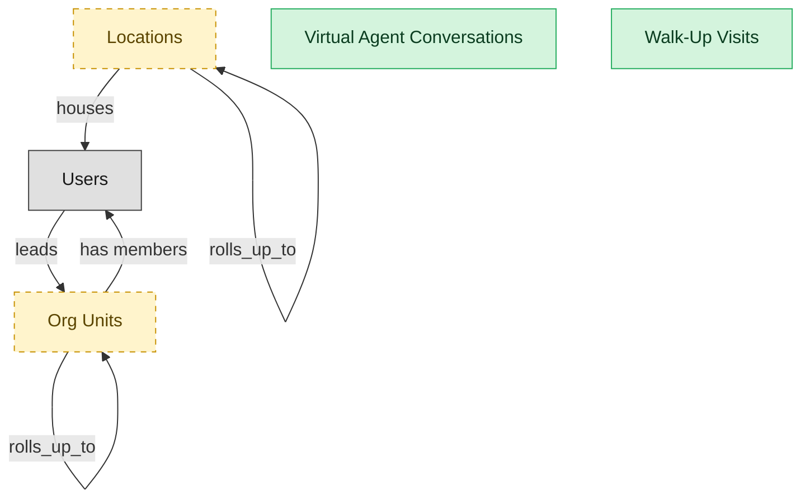

# Service Agent Workspace and Reporting

## 1. Overview

Unified agent experience: workspace, walk-up support, virtual agent / conversational ITSM, and continuous-improvement reporting.

## 2. Entity summary

| Name | data_object | Description |
| --- | --- | --- |
| Virtual Agent Conversations | `virtual_agent_conversations` | Chatbot and virtual-agent conversation transcripts, capturing the turn-by-turn exchange, resolved intent, any escalation to a human, and the ticket produced. |
| Walk-Up Visits | `walkup_visits` | Walk-up or onsite check-in records, capturing the visitor, reason, queue position, estimated service time, and outcome. |
| Locations | `locations` | Physical or organizational locations referenced across the system, used to place and group other records. |
| Org Units | `org_units` | Nodes in the organizational hierarchy such as divisions, departments, and teams, with manager, cost center alignment, geographic scope, and parent-child links. |

## 3. Entities catalog

| # | data_object | canonical code | singular | plural | role | mastered in | mastered label | necessity | personal_content | entity_type | write tier | notes |
| ---: | --- | --- | --- | --- | --- | --- | --- | --- | --- | --- | --- | --- |
| 1 | `virtual_agent_conversations` | `virtual_agent_conversations` | Virtual Agent Conversation | Virtual Agent Conversations | master | - | - | required | - | operational_record | `:manage` | - |
| 2 | `walkup_visits` | `walkup_visits` | Walk-Up Visit | Walk-Up Visits | master | - | - | required | - | operational_workflow | `:manage` | - |
| 3 | `locations` | `locations` | Location | Locations | embedded_master | `iwms-location-master` | Location and Property Master | optional | - | catalog | `:admin` | - |
| 4 | `org_units` | `org_units` | Org Unit | Org Units | embedded_master | `hcm-org-positions` | Organization and Position Management | optional | - | operational_workflow | `:manage` | - |

## 4. Aliases and industry synonyms

_(none: no industry-scoped aliases for this scope)_

## 5. Relationships

### 5.1 Intra-scope edges

| from | verb | to | cardinality | kind | necessity | owner_side | delete_mode | fk_format | notes |
| --- | --- | --- | --- | --- | --- | --- | --- | --- | --- |
| `org_units` | rolls_up_to | `org_units` | one_to_many | reference | optional | source | clear | reference | - |
| `locations` | rolls_up_to | `locations` | one_to_many | reference | optional | source | clear | reference | - |

### 5.2 Built-in edges (`users` and other platform built-ins)

| from | verb | to | cardinality | necessity | owner_side | delete_mode | fk_format | notes |
| --- | --- | --- | --- | --- | --- | --- | --- | --- |
| `users` | leads | `org_units` | one_to_many | optional | source | clear | reference | - |
| `org_units` | has members | `users` | one_to_many | optional | target | clear | reference | - |
| `locations` | houses | `users` | one_to_many | optional | target | clear | reference | - |

### 5.3 Cross-scope edges

#### 5.3a Outbound from this scope's masters and contributors

_Edges this scope drives: the in-scope endpoint has `role` of `master` or `contributor`._

_(none: no outbound cross-scope edges from this scope's masters or contributors)_

#### 5.3b Context edges on embedded shells and consumed entities

_Edges the canonical owner drives, shown for context: the in-scope endpoint has `role` of `embedded_master`, `consumer`, or `derived`._

| from | verb | to | cardinality | necessity | delete_mode | fk_format | notes |
| --- | --- | --- | --- | --- | --- | --- | --- |
| `locations` | hosts_desk_bookings | `desk_bookings` | one_to_many | required | none (required-if-present) | n/a | - |
| `locations` | hosts_room_reservations | `room_reservations` | one_to_many | required | none (required-if-present) | n/a | - |
| `locations` | site_of_service_requests | `workplace_service_requests` | one_to_many | required | none (required-if-present) | n/a | - |
| `locations` | measured_by_reports | `space_utilization_reports` | one_to_many | required | none (required-if-present) | n/a | - |
| `locations` | subject_of_feedback | `workplace_experience_feedback` | one_to_many | optional | none | n/a | - |
| `org_units` | groups | `employees` | one_to_many | required | none (required-if-present) | n/a | - |
| `org_units` | contains | `hcm_positions` | one_to_many | required | none (required-if-present) | n/a | - |
| `cost_centers` | funds | `org_units` | one_to_many | required | none (required-if-present) | n/a | - |
| `org_units` | engages | `contingent_workers` | one_to_many | optional | none | n/a | - |
| `org_units` | is_scored_by | `engagement_drivers` | one_to_many | optional | none | n/a | - |
| `org_units` | is_measured_by | `people_kpis` | one_to_many | optional | none | n/a | - |
| `org_units` | triggers | `iga_entitlement_definitions` | one_to_many | optional | none | n/a | - |
| `org_units` | maps_to | `cost_centers` | one_to_one | optional | none | n/a | - |
| `org_units` | sponsors | `compliance_assignments` | one_to_many | optional | none | n/a | - |
| `org_units` | sponsors | `benefit_plans` | many_to_many | optional | none | n/a | - |
| `survey_campaigns` | targets | `org_units` | many_to_many | optional | none | n/a | - |
| `org_units` | owns | `action_plans` | one_to_many | optional | none | n/a | - |

## 6. Cross-domain context

### 6.1 Master consumers (other modules / domains that embed this scope's masters)

_(none: no other module embeds this scope's masters; the canonical owners do.)_

### 6.2 Outbound handoffs (events this scope publishes)

| source module | target domain | target module | trigger_event | transition | payload | integration | friction | description |
| --- | --- | --- | --- | --- | --- | --- | --- | --- |
| HCM-ORG-POSITIONS | IGA | IGA-ACCESS-REQUEST | `org_unit.created` | _(state_change)_ | `org_units` | event_stream | medium | New org unit drives IGA group/role provisioning. Group-name conventions and ownership must be encoded; otherwise orphan groups proliferate. |
| HCM-ORG-POSITIONS | IGA | IGA-ACCESS-REQUEST | `org_unit.disbanded` | _(state_change)_ | `org_units` | event_stream | high | Org-unit disbandment requires IGA group cleanup; orphan-group risk if employees re-assigned slowly. |
| HCM-ORG-POSITIONS | IGA | IGA-ACCESS-REQUEST | `org_unit.merged` | _(state_change)_ | `org_units` | event_stream | high | Org-unit merge consolidates IGA groups: members migrate, entitlements deduplicated, SoD revalidated. Often runs as a batch project rather than event. |
| HCM-ORG-POSITIONS | HCM | HCM-CORE-WORKER | `org_unit.disbanded` | _(state_change)_ | `org_units` | lifecycle_progression | high | Disbanded org unit requires every incumbent employee to be re-placed before close; worker-record module blocks the close until reassignment completes. |
| HCM-ORG-POSITIONS | HCM | HCM-CORE-WORKER | `org_unit.merged` | _(state_change)_ | `org_units` | lifecycle_progression | medium | Org-unit consolidation cascades employee re-assignment, manager and dotted-line reassignment, and reporting-line recompute on the worker record. |
| HCM-ORG-POSITIONS | ATS | ATS-RECRUITMENT-PIPELINE | `org_unit.activated` | _(state_change)_ | `org_units` | api_call | low | - |
| HCM-ORG-POSITIONS | ATS | ATS-RECRUITMENT-PIPELINE | `org_unit.closed` | _(state_change)_ | `org_units` | api_call | high | - |
| HCM-ORG-POSITIONS | ATS | ATS-RECRUITMENT-PIPELINE | `org_unit.created` | _(state_change)_ | `org_units` | api_call | medium | - |
| HCM-ORG-POSITIONS | ATS | ATS-RECRUITMENT-PIPELINE | `org_unit.disbanded` | _(state_change)_ | `org_units` | api_call | high | - |
| HCM-ORG-POSITIONS | ATS | ATS-RECRUITMENT-PIPELINE | `org_unit.merged` | _(state_change)_ | `org_units` | api_call | high | - |
| HCM-ORG-POSITIONS | ATS | ATS-RECRUITMENT-PIPELINE | `org_unit.reorganized` | _(state_change)_ | `org_units` | api_call | high | - |
| HCM-ORG-POSITIONS | FIN | _(domain-level)_ | `org_unit.created` | _(state_change)_ | `org_units` | api_call | medium | New org unit usually maps to cost-center; ERP-FIN must reflect the structure for budgeting and labor allocation. |

### 6.3 Inbound handoffs (events this scope reacts to)

_(none: no inbound handoffs whose payload is in this scope)_

### 6.4 Master providers (modules / domains that own masters this scope embeds)

| data_object | role here | necessity | canonical owner(s) | slice notes |
| --- | --- | --- | --- | --- |
| `locations` | embedded_master | optional | IWMS-LOCATION-MASTER (IWMS) | - |
| `org_units` | embedded_master | optional | HCM-ORG-POSITIONS (HCM) | - |

## 7. Lifecycle states

### `org_units` (Org Unit)

_This scope holds `org_units` as **embedded_master**; the canonical state machine is owned by `HCM-ORG-POSITIONS`._

| order | state_name | initial? | terminal? | requires_permission? | derived gate | description |
| --- | --- | --- | --- | --- | --- | --- |
| 1 | `draft` | ✓ | - | - | - | Org unit defined as part of a future structure; not yet operational. |
| 2 | `active` | - | - | ✓ | `itsm-agent-workspace:active_org_unit` | Operational unit; carries headcount, cost-center linkage, and reporting lines. |
| 3 | `reorganized` | - | ✓ | ✓ | `itsm-agent-workspace:reorganized_org_unit` | Unit folded into or replaced by a new structure; references remain for history. |
| 4 | `closed` | - | ✓ | ✓ | `itsm-agent-workspace:closed_org_unit` | Unit dissolved; no employees or positions reside in it. |

## 8. Permissions and business rules (derived)

### 8.1 Permissions

| permission | tier | description | included in `:admin`? |
| --- | --- | --- | --- |
| `itsm-agent-workspace:read` | baseline-read | Read access to every entity in the module | ✓ |
| `itsm-agent-workspace:manage` | baseline-manage | Edit operational records | ✓ |
| `itsm-agent-workspace:admin` | baseline-admin | Edit reference data and inherit every workflow gate below | - |
| `itsm-agent-workspace:active_org_unit` | workflow-gate (lifecycle) | Transition `org_units` into state `active` | ✓ |
| `itsm-agent-workspace:reorganized_org_unit` | workflow-gate (lifecycle) | Transition `org_units` into state `reorganized` | ✓ |
| `itsm-agent-workspace:closed_org_unit` | workflow-gate (lifecycle) | Transition `org_units` into state `closed` | ✓ |

### 8.2 Business rules

_(none: no flag-derived business rules)_

## 9. Roles, RACI, and responsibilities (derived)

_Baseline roles, the permission hierarchy, and RACI realization are DERIVED from this scope's entity-type write tiers + `process_raci`; none of it is stored in the catalog (the deployer provisions it from this blueprint)._

### 9.1 `ITSM-AGENT-WORKSPACE`

**Baseline roles:**

| role | baseline grant |
| --- | --- |
| `itsm-agent-workspace_viewer` | `itsm-agent-workspace:read` |
| `itsm-agent-workspace_manager` | `itsm-agent-workspace:manage` |

**Permission hierarchy:**

| permission | includes |
| --- | --- |
| `itsm-agent-workspace:admin` | `itsm-agent-workspace:manage` |
| `itsm-agent-workspace:manage` | `itsm-agent-workspace:read` |
| `itsm-agent-workspace:admin` | `itsm-agent-workspace:active_org_unit` |
| `itsm-agent-workspace:admin` | `itsm-agent-workspace:reorganized_org_unit` |
| `itsm-agent-workspace:admin` | `itsm-agent-workspace:closed_org_unit` |

**Processes wired:**

| process_key | process_name | PCF code | PCF ID | level | description |
| --- | --- | --- | --- | --- | --- |
| `create_organizational_design` | Create organizational design | 1.2.5 | 10041 | 3 | Formulating a design for the organization's resources that allow it to meet its objectives. Develop a new framework for molding the organization's various processes into a coherent and seamless whole. |
| `conduct_organization` | Conduct organization restructuring opportunities | 1.1.5 | 16792 | 3 | Examining the scope and contingencies for restructuring based on market situation and internal realities. Map the market forces over which any and all probabilities can be probed for utility and viability. Once the restructuring options have been analyzed and the due-diligence performed, execute the deal. Consider seeking professional services for assistance in formalizing these opportunities. |

**RACI realization:**

| actor | kind | raci | process_key | realization |
| --- | --- | --- | --- | --- |
| `HR-ORG-DESIGN-ANALYST` | persona | responsible | `create_organizational_design` | grant gates [itsm-agent-workspace:active_org_unit] + the gated entities' write tier |
| `HR-BUSINESS-PARTNER` | persona | accountable | `create_organizational_design` | approval gate |
| `PEOPLE-MANAGER` | persona | consulted | `create_organizational_design` | advisory read grant |
| `HR-HRIS-ADMIN` | persona | informed | `create_organizational_design` | notification side effect (trigger_event / webhook_receiver) |
| `HR-ORG-DESIGN-ANALYST` | persona | responsible | `conduct_organization` | grant gates [itsm-agent-workspace:reorganized_org_unit] + the gated entities' write tier |
| `HR-BUSINESS-PARTNER` | persona | accountable | `conduct_organization` | approval gate |
| `PEOPLE-MANAGER` | persona | consulted | `conduct_organization` | advisory read grant |

### 9.2 Functional ownership and default grants

| responsibility | business function | default role | default tier |
| --- | --- | --- | --- |
| owner | IT Service Desk | `admin` | `:admin` |
| contributor | IT Operations | `manage` | `:manage` |
| contributor | Security | `manage` | `:manage` |
| consumer | Finance | `read` | `:read` |
| consumer | Human Resources | `read` | `:read` |
