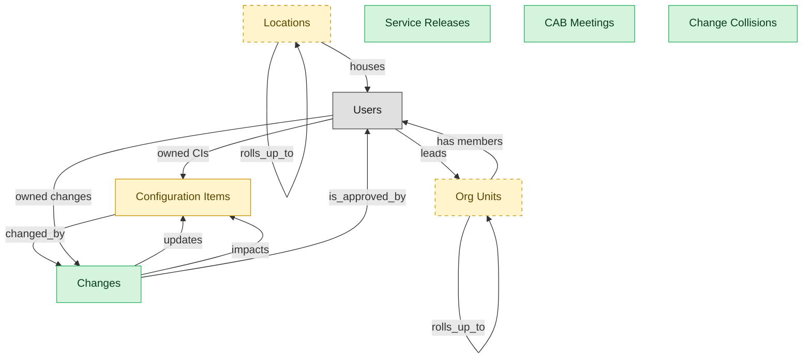

# Change and Release Management

## 1. Overview

Change request capture, CAB workflow, approval routing, release planning, and standard-change catalog.

## 2. Entity summary

| Name | data_object | Description |
| --- | --- | --- |
| CAB Meetings | `cab_meetings` | A Change Advisory Board meeting record: agenda, attendees, the changes reviewed, decisions, and minutes. The first-class artifact of the CAB review step in change management. |
| Change Collisions | `change_collisions` | A detected conflict between overlapping changes or a change scheduled inside a blackout window. Records the colliding changes, the window in question, and the resolution. Surfaces scheduling conflicts before they reach implementation. |
| Changes | `service_changes` | Planned modification to a service or configuration item. Carries change type (standard, normal, emergency), risk score, CAB approval state, implementation window, and back-out plan. The boundary object between ITSM and CMDB - CIs are updated as a result of an executed change. |
| Service Releases | `service_releases` | A release or deployment record that bundles one or more changes into a single shippable unit. Carries the release window, the included changes, deployment status, and rollback plan. Distinct from a single change ticket. |
| Configuration Items | `configuration_items` | Canonical record of an IT thing under management: server, container, application, business service, network device, database, cloud resource. The flagship CMDB entity, referenced by changes, incidents, problems, and topology. Multi-feed: DISCOVERY auto-populates, HAM provides the physical-asset overlay for hardware CIs, SAM/SMP overlay for software/SaaS CIs. |
| Locations | `locations` | - |
| Org Units | `org_units` | Node in the organizational hierarchy: division, business unit, department, team. Carries manager, cost center alignment, geographic scope, and parent/child relationships. HCM masters the operational hierarchy; EPM contributes the cost-center mapping (which would be Finance-mastered once a Finance/GL domain is loaded). |

## 3. Entities catalog

| # | data_object | canonical code | singular | plural | role | mastered in | mastered label | necessity | pattern flags | entity_type | write tier | notes |
| ---: | --- | --- | --- | --- | --- | --- | --- | --- | --- | --- | --- | --- |
| 1 | `cab_meetings` | `cab_meetings` | CAB Meeting | CAB Meetings | master | - | - | required | - | operational_record | `:manage` | - |
| 2 | `change_collisions` | `change_collisions` | Change Collision | Change Collisions | master | - | - | required | - | operational_record | `:manage` | - |
| 3 | `service_changes` | `service_changes` | Change | Changes | master | - | - | required | submit_lock, single_approver | operational_workflow | `:manage` | - |
| 4 | `service_releases` | `service_releases` | Service Release | Service Releases | master | - | - | required | - | operational_workflow | `:manage` | - |
| 5 | `configuration_items` | `configuration_items` | Configuration Item | Configuration Items | embedded_master | `cmdb-core` | CMDB Core Repository | required | - | operational_workflow | `:manage` | - |
| 6 | `locations` | `locations` | Location | Locations | embedded_master | `iwms-location-master` | Location and Property Master | optional | - | catalog | `:admin` | - |
| 7 | `org_units` | `org_units` | Org Unit | Org Units | embedded_master | `hcm-org-positions` | Organization and Position Management | optional | - | operational_workflow | `:manage` | - |

## 4. Aliases and industry synonyms

_(none: no industry-scoped aliases for this scope)_

## 5. Relationships

### 5.1 Intra-scope edges

| from | verb | to | cardinality | kind | necessity | owner_side | delete_mode | fk_format | notes |
| --- | --- | --- | --- | --- | --- | --- | --- | --- | --- |
| `service_changes` | updates | `configuration_items` | many_to_many | reference | optional | target | clear | reference | - |
| `configuration_items` | changed_by | `service_changes` | many_to_many | reference | optional | target | clear | reference | - |
| `service_changes` | impacts | `configuration_items` | many_to_many | reference | required | target | restrict | reference | - |
| `org_units` | rolls_up_to | `org_units` | one_to_many | reference | optional | source | clear | reference | - |
| `locations` | rolls_up_to | `locations` | one_to_many | reference | optional | source | clear | reference | - |

### 5.2 Built-in edges (`users` and other platform built-ins)

| from | verb | to | cardinality | necessity | owner_side | delete_mode | fk_format | notes |
| --- | --- | --- | --- | --- | --- | --- | --- | --- |
| `users` | owned CIs | `configuration_items` | one_to_many | optional | source | clear | reference | - |
| `users` | leads | `org_units` | one_to_many | optional | source | clear | reference | - |
| `users` | owned changes | `service_changes` | one_to_many | optional | source | clear | reference | - |
| `service_changes` | is_approved_by | `users` | many_to_many | optional | target | clear | reference | - |
| `org_units` | has members | `users` | one_to_many | optional | target | clear | reference | - |
| `locations` | houses | `users` | one_to_many | optional | target | clear | reference | - |

### 5.3 Cross-scope edges

#### 5.3a Outbound from this scope's masters and contributors

_Edges this scope drives: the in-scope endpoint has `role` of `master` or `contributor`._

| from | verb | to | cardinality | necessity | delete_mode | fk_format | notes |
| --- | --- | --- | --- | --- | --- | --- | --- |
| `service_changes` | references | `ci_baselines` | many_to_many | optional | none | n/a | - |
| `service_problems` | results_in | `service_changes` | one_to_many | optional | none | n/a | - |
| `service_changes` | generates | `asset_lifecycle_events` | one_to_many | optional | none | n/a | - |
| `vulnerability_remediations` | tracked_via | `service_changes` | one_to_many | optional | none | n/a | - |

#### 5.3b Context edges on embedded shells and consumed entities

_Edges the canonical owner drives, shown for context: the in-scope endpoint has `role` of `embedded_master`, `consumer`, or `derived`._

| from | verb | to | cardinality | necessity | delete_mode | fk_format | notes |
| --- | --- | --- | --- | --- | --- | --- | --- |
| `enterprise_applications` | mapped_to | `configuration_items` | many_to_many | optional | none | n/a | - |
| `enterprise_applications` | onboards_into | `configuration_items` | one_to_one | optional | none | n/a | - |
| `ci_classes` | classifies | `configuration_items` | one_to_many | required | none (required-if-present) | n/a | - |
| `configuration_items` | related_via | `ci_relationships` | one_to_many | optional | none | n/a | - |
| `configuration_items` | baselined_in | `ci_baselines` | many_to_many | optional | none | n/a | - |
| `configuration_items` | composes | `service_maps` | many_to_many | optional | none | n/a | - |
| `configuration_items` | backed_by | `hardware_assets` | one_to_one | optional | none | n/a | - |
| `configuration_items` | triggers | `service_incidents` | one_to_many | optional | none | n/a | - |
| `hardware_assets` | represented_as | `configuration_items` | one_to_one | optional | none | n/a | - |
| `locations` | hosts_desk_bookings | `desk_bookings` | one_to_many | required | none (required-if-present) | n/a | - |
| `locations` | hosts_room_reservations | `room_reservations` | one_to_many | required | none (required-if-present) | n/a | - |
| `locations` | site_of_service_requests | `workplace_service_requests` | one_to_many | required | none (required-if-present) | n/a | - |
| `locations` | measured_by_reports | `space_utilization_reports` | one_to_many | required | none (required-if-present) | n/a | - |
| `locations` | subject_of_feedback | `workplace_experience_feedback` | one_to_many | optional | none | n/a | - |
| `org_units` | groups | `employees` | one_to_many | required | none (required-if-present) | n/a | - |
| `org_units` | contains | `hcm_positions` | one_to_many | required | none (required-if-present) | n/a | - |
| `cost_centers` | funds | `org_units` | one_to_many | required | none (required-if-present) | n/a | - |
| `org_units` | engages | `contingent_workers` | one_to_many | optional | none | n/a | - |
| `org_units` | is_scored_by | `engagement_drivers` | one_to_many | optional | none | n/a | - |
| `org_units` | is_measured_by | `people_kpis` | one_to_many | optional | none | n/a | - |
| `org_units` | triggers | `iga_entitlement_definitions` | one_to_many | optional | none | n/a | - |
| `org_units` | maps_to | `cost_centers` | one_to_one | optional | none | n/a | - |
| `org_units` | sponsors | `compliance_assignments` | one_to_many | optional | none | n/a | - |
| `org_units` | sponsors | `benefit_plans` | many_to_many | optional | none | n/a | - |
| `survey_campaigns` | targets | `org_units` | many_to_many | optional | none | n/a | - |
| `org_units` | owns | `action_plans` | one_to_many | optional | none | n/a | - |
| `service_incidents` | references | `configuration_items` | many_to_many | optional | none | n/a | - |
| `dc_port_connections` | updates | `configuration_items` | one_to_many | optional | none | n/a | - |
| `vulnerabilities` | affects | `configuration_items` | one_to_many | optional | none | n/a | - |

## 6. Cross-domain context

### 6.1 Master consumers (other modules / domains that embed this scope's masters)

| data_object | other module / domain | role | necessity | notes |
| --- | --- | --- | --- | --- |
| `service_changes` | CMDB-CORE (CMDB Core Repository) - CMDB | contributor | required | - |
| `service_changes` | RMM-PATCH-MGMT (Patch Management) - RMM | contributor | required | - |

### 6.2 Outbound handoffs (events this scope publishes)

| source module | target domain | target module | trigger_event | transition | payload | integration | friction | description |
| --- | --- | --- | --- | --- | --- | --- | --- | --- |
| CMDB-CORE | ITSM | ITSM-INCIDENT-MGMT | `ci.unauthorized_change_detected` | _(state_change)_ | `configuration_items` | api_call | medium | Configuration drift against a CI baseline (or change without a CAB-approved change record) creates a compliance / security incident in ITSM. Friction is medium - false positives from legitimate-but-unrecorded operational tweaks are common. |
| ITSM-CHANGE-MGMT | CMDB | CMDB-CORE | `service_change.completed` | `completed` _(state_change)_ | `service_changes` | api_call | medium | Completed change in ITSM updates the affected CIs in CMDB (software version, configuration state, relationship topology). Friction is medium - most ITSM/CMDB pairs are same-vendor and reasonably integrated; cross-vendor combos drift. |
| HCM-ORG-POSITIONS | IGA | IGA-ACCESS-REQUEST | `org_unit.created` | _(state_change)_ | `org_units` | event_stream | medium | New org unit drives IGA group/role provisioning. Group-name conventions and ownership must be encoded; otherwise orphan groups proliferate. |
| HCM-ORG-POSITIONS | IGA | IGA-ACCESS-REQUEST | `org_unit.disbanded` | _(state_change)_ | `org_units` | event_stream | high | Org-unit disbandment requires IGA group cleanup; orphan-group risk if employees re-assigned slowly. |
| HCM-ORG-POSITIONS | IGA | IGA-ACCESS-REQUEST | `org_unit.merged` | _(state_change)_ | `org_units` | event_stream | high | Org-unit merge consolidates IGA groups: members migrate, entitlements deduplicated, SoD revalidated. Often runs as a batch project rather than event. |
| HCM-ORG-POSITIONS | HCM | HCM-CORE-WORKER | `org_unit.disbanded` | _(state_change)_ | `org_units` | lifecycle_progression | high | Disbanded org unit requires every incumbent employee to be re-placed before close; worker-record module blocks the close until reassignment completes. |
| HCM-ORG-POSITIONS | HCM | HCM-CORE-WORKER | `org_unit.merged` | _(state_change)_ | `org_units` | lifecycle_progression | medium | Org-unit consolidation cascades employee re-assignment, manager and dotted-line reassignment, and reporting-line recompute on the worker record. |
| HCM-ORG-POSITIONS | ATS | ATS-RECRUITMENT-PIPELINE | `org_unit.activated` | _(state_change)_ | `org_units` | api_call | low | - |
| HCM-ORG-POSITIONS | ATS | ATS-RECRUITMENT-PIPELINE | `org_unit.closed` | _(state_change)_ | `org_units` | api_call | high | - |
| HCM-ORG-POSITIONS | ATS | ATS-RECRUITMENT-PIPELINE | `org_unit.created` | _(state_change)_ | `org_units` | api_call | medium | - |
| HCM-ORG-POSITIONS | ATS | ATS-RECRUITMENT-PIPELINE | `org_unit.disbanded` | _(state_change)_ | `org_units` | api_call | high | - |
| HCM-ORG-POSITIONS | ATS | ATS-RECRUITMENT-PIPELINE | `org_unit.merged` | _(state_change)_ | `org_units` | api_call | high | - |
| HCM-ORG-POSITIONS | ATS | ATS-RECRUITMENT-PIPELINE | `org_unit.reorganized` | _(state_change)_ | `org_units` | api_call | high | - |
| HCM-ORG-POSITIONS | FIN | _(domain-level)_ | `org_unit.created` | _(state_change)_ | `org_units` | api_call | medium | New org unit usually maps to cost-center; ERP-FIN must reflect the structure for budgeting and labor allocation. |

### 6.3 Inbound handoffs (events this scope reacts to)

| target module | source domain | source module | trigger_event | transition | payload | integration | friction | description |
| --- | --- | --- | --- | --- | --- | --- | --- | --- |
| ITSM-CHANGE-MGMT | RMM | RMM-PATCH-MGMT | `patch_job.completed` | `completed` _(state_change)_ | `service_changes` | api_call | medium | Patch job completion updates the corresponding ITSM change record with per-endpoint execution result and closes it. Failure modes: partial-failure handling differs between tools; rollback events may not be reflected in the change history. |
| ITSM-CHANGE-MGMT | RMM | RMM-PATCH-MGMT | `patch_job.scheduled` | _(state_change)_ | `service_changes` | api_call | medium | A scheduled patch job in RMM creates a corresponding change record in ITSM for CAB approval and audit trail. Failure modes: approval delays in ITSM don't gate RMM execution; emergency patch jobs bypass change-control by design and leave the change record stale. |
| CMDB-CORE | DISCOVERY | _(domain-level)_ | `ci.discovered` | `discovered` _(signal)_ | `configuration_items` | event_stream | low | Discovered devices reconcile against the existing CMDB and either match (update existing CI), promote (create new CI), or queue for manual review (ambiguous match). Low friction when DISCOVERY and CMDB are same-vendor; medium otherwise. |
| CMDB-CORE | RMM | RMM-AGENT-MGMT | `ci_endpoint.discovered` | `discovered` _(signal)_ | `configuration_items` | api_call | high | RMM contributes CI attributes (OS, installed services, network config) to the CMDB. Failure modes: CMDB receives the same logical CI from multiple discovery sources (RMM, AD, agent-less scans, cloud APIs) with conflicting attribute values; reconciliation rules are CMDB-vendor-specific and rarely fully cover RMM's payload shape. |

### 6.4 Master providers (modules / domains that own masters this scope embeds)

| data_object | role here | necessity | canonical owner(s) | slice notes |
| --- | --- | --- | --- | --- |
| `configuration_items` | embedded_master | required | CMDB-CORE (CMDB) | - |
| `locations` | embedded_master | optional | IWMS-LOCATION-MASTER (IWMS) | - |
| `org_units` | embedded_master | optional | HCM-ORG-POSITIONS (HCM) | - |

## 7. Lifecycle states

### `configuration_items` (Configuration Item)

_This scope holds `configuration_items` as **embedded_master**; the canonical state machine is owned by `CMDB-CORE`._

| order | state_name | initial? | terminal? | requires_permission? | derived gate | description |
| --- | --- | --- | --- | --- | --- | --- |
| 1 | `discovered` | ✓ | - | - | - | CI auto-detected by discovery feed; not yet curated. |
| 2 | `registered` | - | - | ✓ | `itsm-change-mgmt:register_ci` | CI record curated and accepted into the CMDB of record. |
| 3 | `in_use` | - | - | - | - | CI is actively in operational use. |
| 4 | `retired` | - | - | ✓ | `itsm-change-mgmt:retire_ci` | CI taken out of service but record retained. |
| 5 | `archived` | - | ✓ | ✓ | `itsm-change-mgmt:archive_ci` | CI record archived after retirement; read-only for audit. |

### `org_units` (Org Unit)

_This scope holds `org_units` as **embedded_master**; the canonical state machine is owned by `HCM-ORG-POSITIONS`._

| order | state_name | initial? | terminal? | requires_permission? | derived gate | description |
| --- | --- | --- | --- | --- | --- | --- |
| 1 | `draft` | ✓ | - | - | - | Org unit defined as part of a future structure; not yet operational. |
| 2 | `active` | - | - | ✓ | `itsm-change-mgmt:active_org_unit` | Operational unit; carries headcount, cost-center linkage, and reporting lines. |
| 3 | `reorganized` | - | ✓ | ✓ | `itsm-change-mgmt:reorganized_org_unit` | Unit folded into or replaced by a new structure; references remain for history. |
| 4 | `closed` | - | ✓ | ✓ | `itsm-change-mgmt:closed_org_unit` | Unit dissolved; no employees or positions reside in it. |

### `service_changes` (Change)

| order | state_name | initial? | terminal? | requires_permission? | derived gate | description |
| --- | --- | --- | --- | --- | --- | --- |
| 1 | `draft` | ✓ | - | - | - | Change record being authored by the requester. |
| 2 | `submitted` | - | - | - | - | Submitted to CAB / change manager for review. |
| 3 | `approved` | - | - | ✓ | `itsm-change-mgmt:approve_change` | Approver has authorized the change to proceed. |
| 4 | `implementing` | - | - | - | - | Change is being executed in the implementation window. |
| 5 | `review` | - | - | - | - | Post-implementation review (success, back-out, lessons). |
| 6 | `closed` | - | ✓ | - | - | Change record finalized after PIR. |
| 7 | `rejected` | - | ✓ | - | - | Approver rejected the change; will not be implemented. |
| 8 | `canceled` | - | ✓ | - | - | Change withdrawn by requester before approval/implementation. |

## 8. Permissions and business rules (derived)

### 8.1 Permissions

| permission | tier | description | included in `:admin`? |
| --- | --- | --- | --- |
| `itsm-change-mgmt:read` | baseline-read | Read access to every entity in the module | ✓ |
| `itsm-change-mgmt:manage` | baseline-manage | Edit operational records | ✓ |
| `itsm-change-mgmt:admin` | baseline-admin | Edit reference data and inherit every workflow gate below | - |
| `itsm-change-mgmt:active_org_unit` | workflow-gate (lifecycle) | Transition `org_units` into state `active` | ✓ |
| `itsm-change-mgmt:reorganized_org_unit` | workflow-gate (lifecycle) | Transition `org_units` into state `reorganized` | ✓ |
| `itsm-change-mgmt:closed_org_unit` | workflow-gate (lifecycle) | Transition `org_units` into state `closed` | ✓ |
| `itsm-change-mgmt:approve_change` | workflow-gate (lifecycle) | Transition `service_changes` into state `approved` | ✓ |
| `itsm-change-mgmt:register_ci` | workflow-gate (lifecycle) | Transition `configuration_items` into state `registered` | ✓ |
| `itsm-change-mgmt:retire_ci` | workflow-gate (lifecycle) | Transition `configuration_items` into state `retired` | ✓ |
| `itsm-change-mgmt:archive_ci` | workflow-gate (lifecycle) | Transition `configuration_items` into state `archived` | ✓ |
| `itsm-change-mgmt:submit_change` | override (submit_lock) | Submit and lock a `service_changes` row (post-submit edits gated) | ✓ |

### 8.2 Business rules

| rule_name | data_object | source flag | intent |
| --- | --- | --- | --- |
| `submit_restricted_to_change_owner` | `service_changes` | has_submit_lock | Only the row's authoring user can submit; post-submit the row is read-only except via `itsm-change-mgmt:manage_all_changes` |
| `approve_change_requires_approver` | `service_changes` | has_single_approver | Exactly one explicit approver required; uses the module's approval gate (`itsm-change-mgmt:approve_change` if surfaced as a lifecycle workflow gate). |

## 9. Roles, RACI, and responsibilities (derived)

_Baseline roles, the permission hierarchy, and RACI realization are DERIVED from this scope's entity-type write tiers + `process_raci`; none of it is stored in the catalog (the deployer provisions it from this blueprint)._

### 9.1 `ITSM-CHANGE-MGMT`

**Baseline roles:**

| role | baseline grant |
| --- | --- |
| `itsm-change-mgmt_viewer` | `itsm-change-mgmt:read` |
| `itsm-change-mgmt_manager` | `itsm-change-mgmt:manage` |

**Permission hierarchy:**

| permission | includes |
| --- | --- |
| `itsm-change-mgmt:admin` | `itsm-change-mgmt:manage` |
| `itsm-change-mgmt:manage` | `itsm-change-mgmt:read` |
| `itsm-change-mgmt:admin` | `itsm-change-mgmt:active_org_unit` |
| `itsm-change-mgmt:admin` | `itsm-change-mgmt:reorganized_org_unit` |
| `itsm-change-mgmt:admin` | `itsm-change-mgmt:closed_org_unit` |
| `itsm-change-mgmt:admin` | `itsm-change-mgmt:approve_change` |
| `itsm-change-mgmt:admin` | `itsm-change-mgmt:register_ci` |
| `itsm-change-mgmt:admin` | `itsm-change-mgmt:retire_ci` |
| `itsm-change-mgmt:admin` | `itsm-change-mgmt:archive_ci` |
| `itsm-change-mgmt:admin` | `itsm-change-mgmt:submit_change` |

**Processes wired:**

| process_key | process_name | PCF code | PCF ID | level | description |
| --- | --- | --- | --- | --- | --- |
| `create_organizational_design` | Create organizational design | 1.2.5 | 10041 | 3 | Formulating a design for the organization's resources that allow it to meet its objectives. Develop a new framework for molding the organization's various processes into a coherent and seamless whole. |
| `conduct_organization` | Conduct organization restructuring opportunities | 1.1.5 | 16792 | 3 | Examining the scope and contingencies for restructuring based on market situation and internal realities. Map the market forces over which any and all probabilities can be probed for utility and viability. Once the restructuring options have been analyzed and the due-diligence performed, execute the deal. Consider seeking professional services for assistance in formalizing these opportunities. |

**RACI realization:**

| actor | kind | raci | process_key | realization |
| --- | --- | --- | --- | --- |
| `HR-ORG-DESIGN-ANALYST` | persona | responsible | `create_organizational_design` | grant gates [itsm-change-mgmt:active_org_unit] + the gated entities' write tier |
| `HR-BUSINESS-PARTNER` | persona | accountable | `create_organizational_design` | approval gate |
| `PEOPLE-MANAGER` | persona | consulted | `create_organizational_design` | advisory read grant |
| `HR-HRIS-ADMIN` | persona | informed | `create_organizational_design` | notification side effect (trigger_event / webhook_receiver) |
| `HR-ORG-DESIGN-ANALYST` | persona | responsible | `conduct_organization` | grant gates [itsm-change-mgmt:reorganized_org_unit] + the gated entities' write tier |
| `HR-BUSINESS-PARTNER` | persona | accountable | `conduct_organization` | approval gate |
| `PEOPLE-MANAGER` | persona | consulted | `conduct_organization` | advisory read grant |

### 9.2 Functional ownership and default grants

| responsibility | business function | default role | default tier |
| --- | --- | --- | --- |
| owner | IT Service Desk | `admin` | `:admin` |
| contributor | IT Operations | `manage` | `:manage` |
| contributor | Security | `manage` | `:manage` |
| consumer | Finance | `read` | `:read` |
| consumer | Human Resources | `read` | `:read` |
