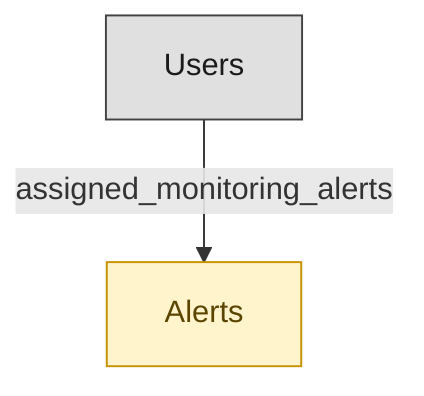

# Event and Alert Handling

## 1. Overview

Reactive event filtering, deduplication, and routing into the incident workflow. Bridge between observability platforms and ITSM.

## 2. Entity summary

| Name | data_object | Description |
| --- | --- | --- |
| Alerts | `monitoring_alerts` | Filtered, human-relevant subset of events that crossed a threshold, matched a pattern, or were enriched with priority and routing. Alerts are what gets paged or ticketed; events are what feeds the correlation engine. |

## 3. Entities catalog

| # | data_object | canonical code | singular | plural | role | mastered in | mastered label | necessity | pattern flags | entity_type | write tier | notes |
| ---: | --- | --- | --- | --- | --- | --- | --- | --- | --- | --- | --- | --- |
| 1 | `monitoring_alerts` | `monitoring_alerts` | Alert | Alerts | embedded_master | `itom-infra-mon` | Infrastructure Monitoring and Event Management | required | - | operational_workflow | `:manage` | - |

## 4. Aliases and industry synonyms

_(none: no industry-scoped aliases for this scope)_

## 5. Relationships

### 5.1 Intra-scope edges

_(none: no relationships with both endpoints inside the scope)_

### 5.2 Built-in edges (`users` and other platform built-ins)

| from | verb | to | cardinality | necessity | owner_side | delete_mode | fk_format | notes |
| --- | --- | --- | --- | --- | --- | --- | --- | --- |
| `users` | assigned_monitoring_alerts | `monitoring_alerts` | one_to_many | optional | source | clear | reference | - |

### 5.3 Cross-scope edges

#### 5.3a Outbound from this scope's masters and contributors

_Edges this scope drives: the in-scope endpoint has `role` of `master` or `contributor`._

_(none: no outbound cross-scope edges from this scope's masters or contributors)_

#### 5.3b Context edges on embedded shells and consumed entities

_Edges the canonical owner drives, shown for context: the in-scope endpoint has `role` of `embedded_master`, `consumer`, or `derived`._

| from | verb | to | cardinality | necessity | delete_mode | fk_format | notes |
| --- | --- | --- | --- | --- | --- | --- | --- |
| `service_incidents` | correlates_to | `monitoring_alerts` | many_to_many | optional | none | n/a | - |

## 6. Cross-domain context

### 6.1 Master consumers (other modules / domains that embed this scope's masters)

_(none: no other module embeds this scope's masters; the canonical owners do.)_

### 6.2 Outbound handoffs (events this scope publishes)

_(none: no outbound handoffs whose payload is in this scope)_

### 6.3 Inbound handoffs (events this scope reacts to)

| target module | source domain | source module | trigger_event | transition | payload | integration | friction | description |
| --- | --- | --- | --- | --- | --- | --- | --- | --- |
| ITOM-INFRA-MON | OBS | _(domain-level)_ | `monitoring_alert.threshold_breached` | _(threshold)_ | `monitoring_alerts` | event_stream | low | OBS-side alerts (from metric thresholds, log patterns, trace anomalies) are mirrored into the ITOM event/alert stream so AIOPS and ITSM see them in the unified pipeline. Modern stacks make this near-trivial. |

### 6.4 Master providers (modules / domains that own masters this scope embeds)

| data_object | role here | necessity | canonical owner(s) | slice notes |
| --- | --- | --- | --- | --- |
| `monitoring_alerts` | embedded_master | required | ITOM-INFRA-MON (ITOM) | - |

## 7. Lifecycle states

_(none: no lifecycle states for the entities in this scope)_
## 8. Permissions and business rules (derived)

### 8.1 Permissions

| permission | tier | description | included in `:admin`? |
| --- | --- | --- | --- |
| `itsm-event-mgmt:read` | baseline-read | Read access to every entity in the module | ✓ |
| `itsm-event-mgmt:manage` | baseline-manage | Edit operational records | ✓ |
| `itsm-event-mgmt:admin` | baseline-admin | Edit reference data and inherit every workflow gate below | - |

### 8.2 Business rules

_(none: no flag-derived business rules)_

## 9. Roles, RACI, and responsibilities (derived)

_Baseline roles, the permission hierarchy, and RACI realization are DERIVED from this scope's entity-type write tiers + `process_raci`; none of it is stored in the catalog (the deployer provisions it from this blueprint)._

### 9.1 `ITSM-EVENT-MGMT`

**Baseline roles:**

| role | baseline grant |
| --- | --- |
| `itsm-event-mgmt_viewer` | `itsm-event-mgmt:read` |
| `itsm-event-mgmt_manager` | `itsm-event-mgmt:manage` |

**Permission hierarchy:**

| permission | includes |
| --- | --- |
| `itsm-event-mgmt:admin` | `itsm-event-mgmt:manage` |
| `itsm-event-mgmt:manage` | `itsm-event-mgmt:read` |

**RACI realization:**

_(none: no process_raci assignments wired to this module's gated processes yet)_

### 9.2 Functional ownership and default grants

| responsibility | business function | default role | default tier |
| --- | --- | --- | --- |
| owner | IT Service Desk | `admin` | `:admin` |
| contributor | IT Operations | `manage` | `:manage` |
| contributor | Security | `manage` | `:manage` |
| consumer | Finance | `read` | `:read` |
| consumer | Human Resources | `read` | `:read` |
