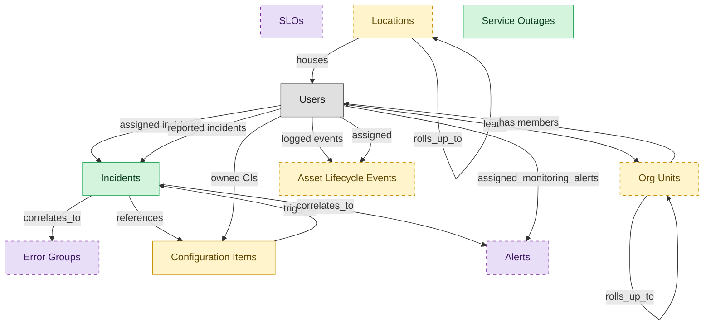

# Incident Management

## 1. Overview

Capture, triage, route, and resolve service-disrupting incidents. Includes major-incident command, AI-assisted classification, and skill-based assignment.

## 2. Entity summary

| Name | data_object | Description |
| --- | --- | --- |
| Incidents | `service_incidents` | Unplanned service interruptions or quality reductions, with severity, priority, category, assignee, and affected components. |
| Service Outages | `service_outages` | Customer-facing outage records, with the affected service, public status, start and end times, and the customer message. |
| Asset Lifecycle Events | `asset_lifecycle_events` | Cross-cutting lifecycle log for hardware, software, and SaaS assets: procurement, deployment, transfer, retirement, and disposal. |
| Configuration Items | `configuration_items` | Canonical records of IT things under management: servers, containers, applications, services, network devices, databases, and cloud resources. |
| Locations | `locations` | Physical or organizational locations referenced across the system, used to place and group other records. |
| Org Units | `org_units` | Nodes in the organizational hierarchy such as divisions, departments, and teams, with manager, cost center alignment, geographic scope, and parent-child links. |
| Alerts | `monitoring_alerts` | Filtered, human-relevant events that crossed a threshold or matched a pattern, enriched with priority and routing, ready to be paged or ticketed. |
| Error Groups | `error_groups` | Aggregated exception records grouped by fingerprint, with first and last seen, occurrence count, affected releases, owners, and status. |
| SLOs | `service_level_objectives` | Service-level objective definitions and their breach state, with targets, remaining error budget, burn rate, and last breach. |

## 3. Entities catalog

| # | data_object | canonical code | singular | plural | role | mastered in | mastered label | necessity | personal_content | entity_type | write tier | notes |
| ---: | --- | --- | --- | --- | --- | --- | --- | --- | --- | --- | --- | --- |
| 1 | `service_incidents` | `service_incidents` | Incident | Incidents | master | - | - | required | yes | operational_workflow | `:manage` | - |
| 2 | `service_outages` | `service_outages` | Service Outage | Service Outages | master | - | - | required | - | operational_workflow | `:manage` | - |
| 3 | `asset_lifecycle_events` | `asset_lifecycle_events` | Asset Lifecycle Event | Asset Lifecycle Events | embedded_master | `itam-lifecycle` | Unified Asset Lifecycle Log | optional | - | operational_record | `:manage` | - |
| 4 | `configuration_items` | `configuration_items` | Configuration Item | Configuration Items | embedded_master | `cmdb-core` | CMDB Core Repository | required | - | operational_workflow | `:manage` | - |
| 5 | `locations` | `locations` | Location | Locations | embedded_master | `iwms-location-master` | Location and Property Master | optional | - | catalog | `:admin` | - |
| 6 | `org_units` | `org_units` | Org Unit | Org Units | embedded_master | `hcm-org-positions` | Organization and Position Management | optional | - | operational_workflow | `:manage` | - |
| 7 | `monitoring_alerts` | `monitoring_alerts` | Alert | Alerts | consumer | `itom-infra-mon` | Infrastructure Monitoring and Event Management | optional | - | operational_workflow | `:manage` | - |
| 8 | `error_groups` | `error_groups` | Error Group | Error Groups | consumer | - | - | optional | - | operational_workflow | `:manage` | - |
| 9 | `service_level_objectives` | `service_level_objectives` | SLO | SLOs | consumer | - | - | optional | - | operational_workflow | `:manage` | - |

## 4. Aliases and industry synonyms

_(none: no industry-scoped aliases for this scope)_

## 5. Relationships

### 5.1 Intra-scope edges

| from | verb | to | cardinality | kind | necessity | owner_side | delete_mode | fk_format | notes |
| --- | --- | --- | --- | --- | --- | --- | --- | --- | --- |
| `configuration_items` | triggers | `service_incidents` | one_to_many | reference | optional | target | clear | reference | - |
| `service_incidents` | references | `configuration_items` | many_to_many | reference | optional | target | clear | reference | - |
| `service_incidents` | correlates_to | `monitoring_alerts` | many_to_many | reference | optional | target | clear | reference | - |
| `service_incidents` | correlates_to | `error_groups` | many_to_many | reference | optional | target | clear | reference | - |
| `org_units` | rolls_up_to | `org_units` | one_to_many | reference | optional | source | clear | reference | - |
| `locations` | rolls_up_to | `locations` | one_to_many | reference | optional | source | clear | reference | - |

### 5.2 Built-in edges (`users` and other platform built-ins)

| from | verb | to | cardinality | necessity | owner_side | delete_mode | fk_format | notes |
| --- | --- | --- | --- | --- | --- | --- | --- | --- |
| `users` | logged events | `asset_lifecycle_events` | one_to_many | optional | source | clear | reference | - |
| `users` | owned CIs | `configuration_items` | one_to_many | optional | source | clear | reference | - |
| `users` | assigned_monitoring_alerts | `monitoring_alerts` | one_to_many | optional | source | clear | reference | - |
| `users` | leads | `org_units` | one_to_many | optional | source | clear | reference | - |
| `users` | assigned | `asset_lifecycle_events` | one_to_many | optional | source | clear | reference | - |
| `users` | assigned incidents | `service_incidents` | one_to_many | optional | source | clear | reference | - |
| `users` | reported incidents | `service_incidents` | one_to_many | required | source | restrict | reference | - |
| `org_units` | has members | `users` | one_to_many | optional | target | clear | reference | - |
| `locations` | houses | `users` | one_to_many | optional | target | clear | reference | - |

### 5.3 Cross-scope edges

#### 5.3a Outbound from this scope's masters and contributors

_Edges this scope drives: the in-scope endpoint has `role` of `master` or `contributor`._

| from | verb | to | cardinality | necessity | delete_mode | fk_format | notes |
| --- | --- | --- | --- | --- | --- | --- | --- |
| `service_incidents` | triggers | `remediation_plans` | one_to_many | optional | none | n/a | - |
| `application_interfaces` | raises | `service_incidents` | one_to_many | optional | none | n/a | - |
| `service_maps` | refreshes | `service_incidents` | many_to_many | optional | none | n/a | - |
| `ci_baselines` | triggers | `service_incidents` | one_to_many | optional | none | n/a | - |
| `chat_threads` | escalates_to | `service_incidents` | one_to_many | optional | none | n/a | - |
| `control_tests` | escalates_to | `service_incidents` | one_to_many | optional | none | n/a | - |
| `test_defects` | escalates_to | `service_incidents` | one_to_many | optional | none | n/a | - |
| `lcap_apps` | opens | `service_incidents` | many_to_many | optional | none | n/a | - |
| `dlp_incidents` | informs_security_incident | `service_incidents` | one_to_many | optional | none | n/a | - |
| `onboarding_tasks` | emits | `service_incidents` | one_to_many | optional | none | n/a | - |
| `service_requests` | routes_to | `service_incidents` | one_to_many | optional | none | n/a | - |
| `service_requests` | triggers | `service_incidents` | one_to_many | optional | none | n/a | - |
| `service_problems` | is investigated by | `service_incidents` | one_to_many | optional | none | n/a | - |
| `service_slas` | governs incident | `service_incidents` | one_to_many | required | none (required-if-present) | n/a | - |
| `service_incidents` | resolved_with | `knowledge_articles` | many_to_many | optional | none | n/a | - |
| `eam_work_orders` | escalates_to | `service_incidents` | one_to_many | optional | none | n/a | - |
| `event_correlations` | triggers | `service_incidents` | one_to_many | optional | none | n/a | - |
| `root_cause_analyses` | annotates | `service_incidents` | one_to_many | optional | none | n/a | - |
| `incident_predictions` | forecasts | `service_incidents` | one_to_many | optional | none | n/a | - |
| `dc_cabinets` | raises | `service_incidents` | one_to_many | optional | none | n/a | - |
| `dc_power_distribution_units` | raises | `service_incidents` | one_to_many | optional | none | n/a | - |
| `dc_uninterruptible_power_supplies` | raises | `service_incidents` | one_to_many | optional | none | n/a | - |
| `dc_cooling_units` | raises | `service_incidents` | one_to_many | optional | none | n/a | - |
| `endpoint_experience_scores` | triggers | `service_incidents` | one_to_many | optional | none | n/a | - |
| `saas_applications` | raises_incident | `service_incidents` | one_to_many | optional | none | n/a | - |

#### 5.3b Context edges on embedded shells and consumed entities

_Edges the canonical owner drives, shown for context: the in-scope endpoint has `role` of `embedded_master`, `consumer`, or `derived`._

| from | verb | to | cardinality | necessity | delete_mode | fk_format | notes |
| --- | --- | --- | --- | --- | --- | --- | --- |
| `fixed_assets` | impacted by lifecycle | `asset_lifecycle_events` | one_to_many | optional | none | n/a | - |
| `service_changes` | updates | `configuration_items` | many_to_many | optional | none | n/a | - |
| `enterprise_applications` | mapped_to | `configuration_items` | many_to_many | optional | none | n/a | - |
| `technology_platforms` | registers_as | `asset_lifecycle_events` | one_to_many | optional | none | n/a | - |
| `enterprise_applications` | onboards_into | `configuration_items` | one_to_one | optional | none | n/a | - |
| `ci_classes` | classifies | `configuration_items` | one_to_many | required | none (required-if-present) | n/a | - |
| `configuration_items` | related_via | `ci_relationships` | one_to_many | optional | none | n/a | - |
| `configuration_items` | baselined_in | `ci_baselines` | many_to_many | optional | none | n/a | - |
| `configuration_items` | composes | `service_maps` | many_to_many | optional | none | n/a | - |
| `configuration_items` | backed_by | `hardware_assets` | one_to_one | optional | none | n/a | - |
| `configuration_items` | changed_by | `service_changes` | many_to_many | optional | none | n/a | - |
| `asset_contracts` | governs | `asset_lifecycle_events` | one_to_many | optional | none | n/a | - |
| `saas_applications` | lifecycle events for | `asset_lifecycle_events` | one_to_many | optional | none | n/a | - |
| `asset_lifecycle_events` | hands_off_to | `hardware_disposal_records` | one_to_one | optional | none | n/a | - |
| `fixed_assets` | updated by lifecycle | `asset_lifecycle_events` | one_to_many | optional | none | n/a | - |
| `hardware_assets` | represented_as | `configuration_items` | one_to_one | optional | none | n/a | - |
| `locations` | hosts_desk_bookings | `desk_bookings` | one_to_many | required | none (required-if-present) | n/a | - |
| `locations` | hosts_room_reservations | `room_reservations` | one_to_many | required | none (required-if-present) | n/a | - |
| `locations` | site_of_service_requests | `workplace_service_requests` | one_to_many | required | none (required-if-present) | n/a | - |
| `locations` | measured_by_reports | `space_utilization_reports` | one_to_many | required | none (required-if-present) | n/a | - |
| `locations` | subject_of_feedback | `workplace_experience_feedback` | one_to_many | optional | none | n/a | - |
| `org_units` | groups | `employees` | one_to_many | required | none (required-if-present) | n/a | - |
| `org_units` | contains | `hcm_positions` | one_to_many | required | none (required-if-present) | n/a | - |
| `cost_centers` | funds | `org_units` | one_to_many | required | none (required-if-present) | n/a | - |
| `employees` | triggers | `asset_lifecycle_events` | one_to_many | optional | none | n/a | - |
| `org_units` | engages | `contingent_workers` | one_to_many | optional | none | n/a | - |
| `org_units` | is_scored_by | `engagement_drivers` | one_to_many | optional | none | n/a | - |
| `org_units` | is_measured_by | `people_kpis` | one_to_many | optional | none | n/a | - |
| `org_units` | triggers | `iga_entitlement_definitions` | one_to_many | optional | none | n/a | - |
| `org_units` | maps_to | `cost_centers` | one_to_one | optional | none | n/a | - |
| `onboarding_tasks` | triggers | `asset_lifecycle_events` | one_to_many | optional | none | n/a | - |
| `hardware_assets` | delivered by | `asset_lifecycle_events` | one_to_many | optional | none | n/a | - |
| `org_units` | sponsors | `compliance_assignments` | one_to_many | optional | none | n/a | - |
| `org_units` | sponsors | `benefit_plans` | many_to_many | optional | none | n/a | - |
| `survey_campaigns` | targets | `org_units` | many_to_many | optional | none | n/a | - |
| `org_units` | owns | `action_plans` | one_to_many | optional | none | n/a | - |
| `service_changes` | generates | `asset_lifecycle_events` | one_to_many | optional | none | n/a | - |
| `service_changes` | impacts | `configuration_items` | many_to_many | required | none (required-if-present) | n/a | - |
| `service_slas` | aligns_with | `service_level_objectives` | many_to_many | optional | none | n/a | - |
| `dc_port_connections` | updates | `configuration_items` | one_to_many | optional | none | n/a | - |
| `vulnerabilities` | affects | `configuration_items` | one_to_many | optional | none | n/a | - |

## 6. Cross-domain context

### 6.1 Master consumers (other modules / domains that embed this scope's masters)

| data_object | other module / domain | role | necessity | notes |
| --- | --- | --- | --- | --- |
| `service_incidents` | IT-OPS-STARTER (IT Operations Starter) - IT-OPS-STARTER | embedded_master | optional | - |
| `service_incidents` | ITOM-INFRA-MON (Infrastructure Monitoring and Event Management) - ITOM | contributor | required | - |
| `service_incidents` | ITSM-STARTER (IT Service Desk Starter) - ITSM | embedded_master | required | - |
| `service_incidents` | MSP-PSA-SVC-DESK (MSP Multi-Tenant Service Desk) - MSP-PSA | contributor | optional | - |
| `service_incidents` | REMOTE-ACCESS-SESSION (Remote Session Control) - REMOTE-ACCESS | consumer | required | - |
| `service_incidents` | RMM-MONITORING (Monitoring and Alerting) - RMM | consumer | required | - |
| `service_incidents` | WSC-CHANNELS-CONVERSATIONS (Channels and Conversations) - WSC | consumer | optional | - |

### 6.2 Outbound handoffs (events this scope publishes)

| source module | target domain | target module | trigger_event | transition | payload | integration | friction | description |
| --- | --- | --- | --- | --- | --- | --- | --- | --- |
| ITSM-INCIDENT-MGMT | ITAM | ITAM-LIFECYCLE | `service_incident.asset_failure` | _(state_change)_ | `asset_lifecycle_events` | api_call | medium | Incident resolved by replacing or retiring an asset generates a lifecycle event in ITAM. Friction sits in the asset-id resolution (incidents are filed against users or symptoms, asset IDs come later). |
| ITAM-LIFECYCLE | ITAM | ITAM-PORTFOLIO-REPORTING | `asset_lifecycle_event.recorded` | _(state_change)_ | `asset_lifecycle_events` | lifecycle_progression | low | - |
| HCM-ORG-POSITIONS | IGA | IGA-ACCESS-REQUEST | `org_unit.created` | _(state_change)_ | `org_units` | event_stream | medium | New org unit drives IGA group/role provisioning. Group-name conventions and ownership must be encoded; otherwise orphan groups proliferate. |
| HCM-ORG-POSITIONS | IGA | IGA-ACCESS-REQUEST | `org_unit.disbanded` | _(state_change)_ | `org_units` | event_stream | high | Org-unit disbandment requires IGA group cleanup; orphan-group risk if employees re-assigned slowly. |
| HCM-ORG-POSITIONS | IGA | IGA-ACCESS-REQUEST | `org_unit.merged` | _(state_change)_ | `org_units` | event_stream | high | Org-unit merge consolidates IGA groups: members migrate, entitlements deduplicated, SoD revalidated. Often runs as a batch project rather than event. |
| ITAM-LIFECYCLE | HAM | _(domain-level)_ | `asset.retired_for_disposal` | _(state_change)_ | `asset_lifecycle_events` | event_stream | low | Retired assets hand off to HAM disposal workflow. |
| HCM-ORG-POSITIONS | HCM | HCM-CORE-WORKER | `org_unit.disbanded` | _(state_change)_ | `org_units` | lifecycle_progression | high | Disbanded org unit requires every incumbent employee to be re-placed before close; worker-record module blocks the close until reassignment completes. |
| HCM-ORG-POSITIONS | HCM | HCM-CORE-WORKER | `org_unit.merged` | _(state_change)_ | `org_units` | lifecycle_progression | medium | Org-unit consolidation cascades employee re-assignment, manager and dotted-line reassignment, and reporting-line recompute on the worker record. |
| HCM-ORG-POSITIONS | ATS | ATS-RECRUITMENT-PIPELINE | `org_unit.activated` | _(state_change)_ | `org_units` | api_call | low | - |
| HCM-ORG-POSITIONS | ATS | ATS-RECRUITMENT-PIPELINE | `org_unit.closed` | _(state_change)_ | `org_units` | api_call | high | - |
| HCM-ORG-POSITIONS | ATS | ATS-RECRUITMENT-PIPELINE | `org_unit.created` | _(state_change)_ | `org_units` | api_call | medium | - |
| HCM-ORG-POSITIONS | ATS | ATS-RECRUITMENT-PIPELINE | `org_unit.disbanded` | _(state_change)_ | `org_units` | api_call | high | - |
| HCM-ORG-POSITIONS | ATS | ATS-RECRUITMENT-PIPELINE | `org_unit.merged` | _(state_change)_ | `org_units` | api_call | high | - |
| HCM-ORG-POSITIONS | ATS | ATS-RECRUITMENT-PIPELINE | `org_unit.reorganized` | _(state_change)_ | `org_units` | api_call | high | - |
| ITAM-LIFECYCLE | FIN | _(domain-level)_ | `asset_lifecycle_event.recorded` | _(state_change)_ | `asset_lifecycle_events` | event_stream | medium | Asset lifecycle events update the ERP-FIN fixed-asset register and depreciation. |
| HCM-ORG-POSITIONS | FIN | _(domain-level)_ | `org_unit.created` | _(state_change)_ | `org_units` | api_call | medium | New org unit usually maps to cost-center; ERP-FIN must reflect the structure for budgeting and labor allocation. |

### 6.3 Inbound handoffs (events this scope reacts to)

| target module | source domain | source module | trigger_event | transition | payload | integration | friction | description |
| --- | --- | --- | --- | --- | --- | --- | --- | --- |
| ITSM-INCIDENT-MGMT | ITOM | ITOM-INFRA-MON | `monitoring_event.alert_triggered` | _(signal)_ | `service_incidents` | event_stream | high | Monitoring/alerting events from ITOM auto-create incidents in ITSM when severity and correlation rules match. High friction in practice - alert storms create incident floods, correlation rules drift, and dedupe logic between systems is rarely good enough. The classic 'NOC-floods-the-helpdesk' problem. |
| ITSM-INCIDENT-MGMT | CMDB | CMDB-CORE | `ci.unauthorized_change_detected` | _(state_change)_ | `configuration_items` | api_call | medium | Configuration drift against a CI baseline (or change without a CAB-approved change record) creates a compliance / security incident in ITSM. Friction is medium - false positives from legitimate-but-unrecorded operational tweaks are common. |
| ITSM-INCIDENT-MGMT | DISCOVERY | _(domain-level)_ | `discovery_scan.failed` | _(state_change)_ | `service_incidents` | api_call | medium | Failed DISCOVERY scans open ITSM tickets for the discovery owner. |
| ITSM-INCIDENT-MGMT | DISCOVERY | _(domain-level)_ | `discovery_source.disconnected` | _(state_change)_ | `service_incidents` | api_call | medium | DISCOVERY source outages auto-ticket ITSM to restore visibility. |
| ITSM-INCIDENT-MGMT | AIOPS | AIOPS-EVENT-CORRELATION | `correlation.identified` | `identified` _(signal)_ | `service_incidents` | event_stream | high | A correlated alert cluster surfaces as ONE incident in ITSM instead of N. The defining noise-reduction promise of AIOps - and the hardest integration to land cleanly, because suppressing the underlying alerts requires bidirectional state with ITOM, and ITSM needs to expose the correlated-events bundle as evidence on the incident. |
| ITSM-INCIDENT-MGMT | AIOPS | AIOPS-PREDICTIVE-INTELLIGENCE | `incident_prediction.high_confidence` | _(signal)_ | `service_incidents` | event_stream | low | Predicted incidents auto-open proactive ITSM tickets ahead of impact. |
| ITSM-INCIDENT-MGMT | AIOPS | AIOPS-PREDICTIVE-INTELLIGENCE | `root_cause_analysis.published` | _(state_change)_ | `service_incidents` | event_stream | low | AIOPS RCA conclusion lands on the linked ITSM incident/problem as resolution context. |
| ITSM-INCIDENT-MGMT | OBS | _(domain-level)_ | `error_group.regression_detected` | _(signal)_ | `error_groups` | api_call | medium | OBS regression on resolved error reopens ITSM problem record. |
| ITSM-INCIDENT-MGMT | OBS | _(domain-level)_ | `log_entry.error_pattern_matched` | _(signal)_ | `service_incidents` | api_call | medium | Critical log patterns auto-open ITSM tickets for technician triage. |
| ITSM-INCIDENT-MGMT | OBS | _(domain-level)_ | `service_level_objective.budget_exhausted` | _(state_change)_ | `service_level_objectives` | api_call | medium | Exhausted SLO error budget escalates to ITSM and triggers change/release controls. |
| ITSM-INCIDENT-MGMT | OBS | _(domain-level)_ | `service_level_objective.burn_rate_high` | _(threshold)_ | `service_level_objectives` | api_call | medium | OBS SLO burn-rate alerts trigger ITSM major-incident workflow. |
| ITSM-INCIDENT-MGMT | OBS | _(domain-level)_ | `slo.breached` | `breached` _(state_change)_ | `service_incidents` | event_stream | high | SLO breach (error budget exhausted, burn-rate spike) creates an incident in ITSM. High friction in practice, the routing from an OBS-side SLO-breach event to a correctly assigned ITSM incident is rarely turnkey, especially when the SLO-owning team and the incident-handling team differ. |
| ITSM-INCIDENT-MGMT | TEST-MGMT | _(domain-level)_ | `test_defect.created` | _(lifecycle)_ | `service_incidents` | api_call | medium | Customer-impacting defects in production-pathing tests escalate to ITSM tickets. |
| ITSM-INCIDENT-MGMT | APM | APM-PORTFOLIO-REGISTRY | `application_interface.broken` | `active` → `broken` _(state_change)_ | `service_incidents` | event_stream | high | Integration failure escalates to incident; detection lag; true-positive rate varies. |
| ITSM-INCIDENT-MGMT | GRC | _(domain-level)_ | `control.failed` | `untested` → `fail` _(state_change)_ | `service_incidents` | api_call | high | Failed IT control → ITSM ticket; no feedback when ITSM closes ticket on GRC SLA. |
| ITSM-INCIDENT-MGMT | GRC | _(domain-level)_ | `remediation_plan.created` | _(lifecycle)_ | `service_incidents` | event_stream | medium | Remediation ticket created in ITSM. |
| ITSM-INCIDENT-MGMT | AUDIT | _(domain-level)_ | `audit_engagement.completed` | `in_progress` → `completed` _(lifecycle)_ | `service_incidents` | manual_handoff | high | IT audit outcomes trigger ITSM actions; requires human interpretation of scope/findings. |
| ITSM-INCIDENT-MGMT | IGA | IGA-ACCESS-REQUEST | `iga_access_request.approved` | _(state_change)_ | `service_incidents` | api_call | medium | Approved access requests with manual-fulfillment steps route to ITSM. |
| ITSM-INCIDENT-MGMT | IGA | IGA-AUTO-PROVISIONING | `iga_provisioning_event.completed` | _(state_change)_ | `service_incidents` | event_stream | medium | Provisioning event drives ITSM fulfillment-task closure where access tickets exist. |
| ITSM-INCIDENT-MGMT | IGA | IGA-AUTO-PROVISIONING | `iga_provisioning_event.failed` | _(state_change)_ | `service_incidents` | api_call | high | Failed provisioning becomes ITSM incident/request for manual completion. Alert-without-feedback-loop friction shape. |
| ITSM-INCIDENT-MGMT | IPAAS | _(domain-level)_ | `integration_run.failed` | _(lifecycle)_ | `service_incidents` | api_call | high | iPaaS run failures often surface as ITSM tickets - the failed integration usually has business impact (missed orders, stalled provisioning). |
| ITSM-INCIDENT-MGMT | LCAP | LCAP-VISUAL-COMPOSITION | `lcap_app.deployment_failed` | _(signal)_ | `service_incidents` | api_call | medium | Deployment failure opens incident for platform team. |
| ITSM-INCIDENT-MGMT | RPA | _(domain-level)_ | `rpa_bot_credentials.expiring` | _(threshold)_ | `service_incidents` | api_call | medium | Expiring bot credentials open a service request for IT rotation. |
| ITSM-INCIDENT-MGMT | RPA | _(domain-level)_ | `rpa_execution.failed` | _(state_change)_ | `service_incidents` | api_call | high | Bot execution failure opens incident for bot owner; target system change often the root cause. |
| ITSM-INCIDENT-MGMT | TELCO-BSS | _(domain-level)_ | `network_inventory.updated` | _(state_change)_ | `service_incidents` | batch_sync | low | Network inventory updates sync to ITSM CMDB-adjacent inventory. |
| ITSM-INCIDENT-MGMT | TELCO-BSS | _(domain-level)_ | `service_provisioning.failed` | _(state_change)_ | `service_incidents` | event_stream | high | Provisioning failures escalate to ITSM for network/IT diagnosis. |
| ITSM-INCIDENT-MGMT | TELCO-BSS | _(domain-level)_ | `service_trouble_ticket.opened` | _(state_change)_ | `service_incidents` | event_stream | medium | Telco trouble ticket routes to ITSM for network ops resolution. |
| ITSM-INCIDENT-MGMT | HC-PATIENT | _(domain-level)_ | `clinical_order.placed` | _(lifecycle)_ | `service_incidents` | api_call | low | Order routing relies on ITSM-managed integration with lab/imaging systems. |
| ITSM-INCIDENT-MGMT | MFG-OPS | _(domain-level)_ | `shop_floor_case.opened` | _(lifecycle)_ | `service_incidents` | api_call | medium | Shop-floor case with IT/MES root cause is routed to ITSM for incident management. |
| ITSM-INCIDENT-MGMT | UTIL-OPS | _(domain-level)_ | `utility_asset.failed` | _(state_change)_ | `service_incidents` | api_call | medium | Failure of IT-dependent grid/SCADA asset raises an ITSM incident for dependent technology stack. |
| ITSM-INCIDENT-MGMT | CLIN-DEV | _(domain-level)_ | `clinical_engineering_work_order.opened` | _(lifecycle)_ | `service_incidents` | api_call | medium | Clinical engineering work order surfaces in ITSM when shared with IT for connected-device support. |
| ITSM-INCIDENT-MGMT | CLIN-DEV | _(domain-level)_ | `device_calibration.due` | _(threshold)_ | `service_incidents` | batch_sync | low | Calibration scheduling visible to ITSM when biomed device is shared infrastructure. |
| ITSM-INCIDENT-MGMT | EAM | _(domain-level)_ | `eam_work_order.created` | - | `service_incidents` | event_stream | medium | Critical equipment failures escalated to IT incidents. |
| ITSM-INCIDENT-MGMT | BI | _(domain-level)_ | `bi_report.failed` | _(state_change)_ | `service_incidents` | api_call | medium | Scheduled report failure files an ITSM ticket for the BI platform team to investigate. |
| ITSM-INCIDENT-MGMT | WSC | WSC-CHANNELS-CONVERSATIONS | `chat_thread.escalated_to_ticket` | _(state_change)_ | `service_incidents` | api_call | low | WSC IT-support threads are converted into ITSM tickets so the SLA clock starts and the transcript becomes incident context. |
| ITSM-INCIDENT-MGMT | APP-PAAS | _(domain-level)_ | `paas_deployment.failed` | _(state_change)_ | `service_incidents` | api_call | medium | Failed deployments raise incidents in ITSM for triage. |
| ITSM-INCIDENT-MGMT | VSDP | _(domain-level)_ | `software_deployment.failed` | _(state_change)_ | `service_incidents` | api_call | medium | Failed deployments raise incidents for change-management and operations triage. |
| ITSM-INCIDENT-MGMT | KUBE-PLAT | _(domain-level)_ | `container_workload.degraded` | _(state_change)_ | `service_incidents` | api_call | medium | Persistent workload degradation creates ITSM incidents for platform-team triage. |
| ITSM-INCIDENT-MGMT | NPMD | _(domain-level)_ | `network_interface.down` | _(state_change)_ | `service_incidents` | api_call | low | Interface-down events auto-create ITSM tickets for the responsible team. |
| ITSM-INCIDENT-MGMT | NPMD | _(domain-level)_ | `network_performance_alert.raised` | _(lifecycle)_ | `service_incidents` | api_call | medium | NPMD performance alerts auto-open ITSM network tickets. |
| ITSM-INCIDENT-MGMT | DEM | _(domain-level)_ | `endpoint_experience_score.degraded` | _(state_change)_ | `service_incidents` | event_stream | medium | Degraded DEM endpoint experience opens proactive ITSM tickets for the user. |
| ITSM-INCIDENT-MGMT | DCIM | DCIM-ASSET-SPACE | `dc_cabinet.environmental_alert` | _(threshold)_ | `service_incidents` | api_call | medium | DCIM cabinet environmental alerts auto-create facility ITSM tickets. |
| ITSM-INCIDENT-MGMT | DCIM | DCIM-POWER-ENV | `dc_cooling_unit.failure` | _(state_change)_ | `service_incidents` | event_stream | high | DCIM cooling failures trigger emergency ITSM workflow. |
| ITSM-INCIDENT-MGMT | DCIM | DCIM-POWER-ENV | `dc_power_distribution_unit.failure` | _(state_change)_ | `service_incidents` | event_stream | high | DCIM PDU failures trigger ITSM major-incident workflow. |
| ITSM-INCIDENT-MGMT | DCIM | DCIM-POWER-ENV | `dc_uninterruptible_power_supply.failover` | _(state_change)_ | `service_incidents` | event_stream | high | DCIM UPS failovers escalate to ITSM major-incident workflow. |
| ITSM-INCIDENT-MGMT | SMP | SMP-DISCOVERY | `saas_application.deprovisioned` | _(lifecycle)_ | `service_incidents` | event_stream | medium | SaaS app deprovisioning closes related ITSM tickets and access requests. |
| ITSM-INCIDENT-MGMT | UEM | UEM-DEVICE-LIFECYCLE | `enrolled_device.enrolled` | _(state_change)_ | `service_incidents` | event_stream | low | Newly enrolled UEM devices auto-link to onboarding ITSM tickets. |
| ITSM-INCIDENT-MGMT | UEM | UEM-CONFIG-APPS | `device_configuration_profile.drift_detected` | _(state_change)_ | `service_incidents` | api_call | medium | UEM configuration drift opens ITSM remediation tickets. |
| ITSM-INCIDENT-MGMT | UEM | UEM-COMPLIANCE-POSTURE | `device_compliance_result.non_compliant` | _(state_change)_ | `service_incidents` | api_call | medium | Non-compliant UEM devices auto-ticket ITSM for remediation. |
| ITSM-INCIDENT-MGMT | DI | _(domain-level)_ | `pipeline_run.failed` | _(state_change)_ | `service_incidents` | api_call | high | Pipeline failure opens incident for the data-platform on-call. |
| ITSM-INCIDENT-MGMT | DQ | _(domain-level)_ | `dq_scorecard.breached` | `compliant` → `non_compliant` _(threshold)_ | `service_incidents` | api_call | medium | Scorecard SLA breach → ITSM escalation ticket. |
| ITSM-INCIDENT-MGMT | DQ | _(domain-level)_ | `dq_sla_definition.breached` | _(threshold)_ | `service_incidents` | api_call | high | Data SLA breach creates incident for the producing pipeline's owning team. |
| ITSM-INCIDENT-MGMT | DQ | _(domain-level)_ | `quality_rule.breach` | `active` → `breached` _(state_change)_ | `service_incidents` | event_stream | medium | Severity ≥ HIGH or breach > SLA threshold → ITSM incident. Dedup on (asset_id, rule_id). |
| ITSM-INCIDENT-MGMT | DATA-AI-PLAT | DATA-AI-PLAT-ML | `ml_model.drift_detected` | _(signal)_ | `service_incidents` | event_stream | high | Drift detected on production model; ITSM incident created for MLOps team to triage retraining. |
| ITSM-INCIDENT-MGMT | DATA-AI-PLAT | DATA-AI-PLAT-ML | `ml_model.evaluation_failed` | _(state_change)_ | `service_incidents` | api_call | medium | Failed evaluation creates an incident for MLOps; deployment blocked until remediated. |
| ITSM-INCIDENT-MGMT | RMM | RMM-MONITORING | `monitoring_alert.threshold_breached` | _(threshold)_ | `service_incidents` | api_call | high | RMM agent telemetry breaches a monitoring policy threshold and the alert is forwarded to ITSM to auto-create an incident with affected endpoint, telemetry snapshot, and severity. Failure modes: alert-to-ticket bridges across different vendors break on auth/throttling/schema drift; threshold rules drift between systems; duplicate-alert suppression in one tool doesn't propagate to the other; closing the incident rarely closes the originating alert. |
| ITSM-INCIDENT-MGMT | RMM | RMM-AUTOMATION | `automation_script.failed` | _(state_change)_ | `service_incidents` | api_call | low | Failed RMM script executions auto-create ITSM tickets. |
| ITSM-INCIDENT-MGMT | REMOTE-ACCESS | REMOTE-ACCESS-SESSION | `remote_session.ended` | _(state_change)_ | `service_incidents` | event_stream | low | Completed remote sessions append worklog and timer to the linked ITSM ticket. |
| ITSM-INCIDENT-MGMT | REMOTE-ACCESS | REMOTE-ACCESS-SESSION | `support_session.completed` | `completed` _(state_change)_ | `service_incidents` | api_call | medium | Completed remote session writes a session summary (duration, technician, actions taken, recording link) back to the originating ITSM incident as a work-note. Failure modes: ticket-id correlation is brittle when session was launched outside the ticket flow; recording links break when retention policy expires before the ticket closes. |
| ITSM-INCIDENT-MGMT | NCDB | _(domain-level)_ | `nocode_automation.failed` | _(signal)_ | `service_incidents` | api_call | medium | Automation failure that the citizen owner cannot resolve escalates to IT support. |
| ITSM-INCIDENT-MGMT | WORK-MGMT | WORK-MGMT-TASK-EXEC | `work_automation.triggered` | _(signal)_ | `service_incidents` | event_stream | low | Work-item automations linked to IT tickets propagate status changes to ITSM. |
| ITSM-INCIDENT-MGMT | WORK-MGMT | WORK-MGMT-TASK-EXEC | `work_item.status_changed` | `any` → `any` _(lifecycle)_ | `service_incidents` | api_call | high | Cross-functional WORK-MGMT items intersect with IT support requests: a marketing project task ('IT-provision new SaaS') needs to be linked to an ITSM request, with status mirrored both ways. Bidirectional sync is bespoke; off-the-shelf WORK-MGMT-to-ITSM connectors exist but require careful per-team configuration. |
| ITSM-INCIDENT-MGMT | DLP | DLP-ENFORCEMENT-RUNTIME | `dlp_incident.blocked` | `confirmed` → `blocked` _(state_change)_ | `service_incidents` | event_stream | medium | DLP block creates security incident in ITSM. |
| ITSM-INCIDENT-MGMT | FLEET-MAINT | _(domain-level)_ | `maintenance_defect.reported` | - | `service_incidents` | event_stream | medium | In-vehicle IT defects escalated to IT tickets. |
| ITAM-LIFECYCLE | HCM | HCM-CORE-WORKER | `employee.terminated` | `terminated` _(lifecycle)_ | `asset_lifecycle_events` | api_call | high | Employee termination triggers asset-recall events: assigned laptops, mobile devices, badges, software licenses must be reclaimed. High friction - recall rates rarely hit 100%, and the cost of unrecovered SaaS seats / laptops shows up in financial leakage reports. |
| CMDB-CORE | DISCOVERY | _(domain-level)_ | `ci.discovered` | `discovered` _(signal)_ | `configuration_items` | event_stream | low | Discovered devices reconcile against the existing CMDB and either match (update existing CI), promote (create new CI), or queue for manual review (ambiguous match). Low friction when DISCOVERY and CMDB are same-vendor; medium otherwise. |
| CMDB-CORE | RMM | RMM-AGENT-MGMT | `ci_endpoint.discovered` | `discovered` _(signal)_ | `configuration_items` | api_call | high | RMM contributes CI attributes (OS, installed services, network config) to the CMDB. Failure modes: CMDB receives the same logical CI from multiple discovery sources (RMM, AD, agent-less scans, cloud APIs) with conflicting attribute values; reconciliation rules are CMDB-vendor-specific and rarely fully cover RMM's payload shape. |

### 6.4 Master providers (modules / domains that own masters this scope embeds)

| data_object | role here | necessity | canonical owner(s) | slice notes |
| --- | --- | --- | --- | --- |
| `asset_lifecycle_events` | embedded_master | optional | ITAM-LIFECYCLE (ITAM) | - |
| `configuration_items` | embedded_master | required | CMDB-CORE (CMDB) | - |
| `locations` | embedded_master | optional | IWMS-LOCATION-MASTER (IWMS) | - |
| `org_units` | embedded_master | optional | HCM-ORG-POSITIONS (HCM) | - |
| `error_groups` | consumer | optional | _(no canonical owner recorded)_ | - |
| `monitoring_alerts` | consumer | optional | ITOM-INFRA-MON (ITOM) | - |
| `service_level_objectives` | consumer | optional | _(no canonical owner recorded)_ | - |

## 7. Lifecycle states

### `configuration_items` (Configuration Item)

_This scope holds `configuration_items` as **embedded_master**; the canonical state machine is owned by `CMDB-CORE`._

| order | state_name | initial? | terminal? | requires_permission? | derived gate | description |
| --- | --- | --- | --- | --- | --- | --- |
| 1 | `discovered` | ✓ | - | - | - | CI auto-detected by discovery feed; not yet curated. |
| 2 | `registered` | - | - | ✓ | `itsm-incident-mgmt:register_ci` | CI record curated and accepted into the CMDB of record. |
| 3 | `in_use` | - | - | - | - | CI is actively in operational use. |
| 4 | `retired` | - | - | ✓ | `itsm-incident-mgmt:retire_ci` | CI taken out of service but record retained. |
| 5 | `archived` | - | ✓ | ✓ | `itsm-incident-mgmt:archive_ci` | CI record archived after retirement; read-only for audit. |

### `org_units` (Org Unit)

_This scope holds `org_units` as **embedded_master**; the canonical state machine is owned by `HCM-ORG-POSITIONS`._

| order | state_name | initial? | terminal? | requires_permission? | derived gate | description |
| --- | --- | --- | --- | --- | --- | --- |
| 1 | `draft` | ✓ | - | - | - | Org unit defined as part of a future structure; not yet operational. |
| 2 | `active` | - | - | ✓ | `itsm-incident-mgmt:active_org_unit` | Operational unit; carries headcount, cost-center linkage, and reporting lines. |
| 3 | `reorganized` | - | ✓ | ✓ | `itsm-incident-mgmt:reorganized_org_unit` | Unit folded into or replaced by a new structure; references remain for history. |
| 4 | `closed` | - | ✓ | ✓ | `itsm-incident-mgmt:closed_org_unit` | Unit dissolved; no employees or positions reside in it. |

### `service_incidents` (Incident)

| order | state_name | initial? | terminal? | requires_permission? | derived gate | description |
| --- | --- | --- | --- | --- | --- | --- |
| 1 | `new` | ✓ | - | - | - | Incident has been logged; not yet triaged or routed. |
| 2 | `assigned` | - | - | - | - | Triaged and assigned to a support group or agent. |
| 3 | `in_progress` | - | - | - | - | Assignee is actively diagnosing or working the incident. |
| 4 | `resolved` | - | - | ✓ | `itsm-incident-mgmt:resolved_incident` | Workaround or fix delivered; awaiting reporter confirmation. |
| 5 | `closed` | - | ✓ | ✓ | `itsm-incident-mgmt:closed_incident` | Resolution confirmed; incident archived and SLA clock stopped. |
| 6 | `canceled` | - | ✓ | - | - | Incident withdrawn (duplicate, invalid, raised in error). |

## 8. Permissions and business rules (derived)

### 8.1 Permissions

| permission | tier | description | included in `:admin`? |
| --- | --- | --- | --- |
| `itsm-incident-mgmt:read` | baseline-read | Read access to every entity in the module | ✓ |
| `itsm-incident-mgmt:manage` | baseline-manage | Edit operational records | ✓ |
| `itsm-incident-mgmt:admin` | baseline-admin | Edit reference data and inherit every workflow gate below | - |
| `itsm-incident-mgmt:active_org_unit` | workflow-gate (lifecycle) | Transition `org_units` into state `active` | ✓ |
| `itsm-incident-mgmt:reorganized_org_unit` | workflow-gate (lifecycle) | Transition `org_units` into state `reorganized` | ✓ |
| `itsm-incident-mgmt:closed_org_unit` | workflow-gate (lifecycle) | Transition `org_units` into state `closed` | ✓ |
| `itsm-incident-mgmt:resolved_incident` | workflow-gate (lifecycle) | Transition `service_incidents` into state `resolved` | ✓ |
| `itsm-incident-mgmt:closed_incident` | workflow-gate (lifecycle) | Transition `service_incidents` into state `closed` | ✓ |
| `itsm-incident-mgmt:register_ci` | workflow-gate (lifecycle) | Transition `configuration_items` into state `registered` | ✓ |
| `itsm-incident-mgmt:retire_ci` | workflow-gate (lifecycle) | Transition `configuration_items` into state `retired` | ✓ |
| `itsm-incident-mgmt:archive_ci` | workflow-gate (lifecycle) | Transition `configuration_items` into state `archived` | ✓ |
| `itsm-incident-mgmt:view_all_incidents` | override (personal_content) | View all `service_incidents` rows beyond row-scope | ✓ |
| `itsm-incident-mgmt:manage_all_incidents` | override (personal_content) | Manage all `service_incidents` rows beyond row-scope | ✓ |

### 8.2 Business rules

| rule_name | data_object | source flag | intent |
| --- | --- | --- | --- |
| `incident_edit_scope` | `service_incidents` | has_personal_content | Row-scope by default; override via `itsm-incident-mgmt:view_all_incidents` / `itsm-incident-mgmt:manage_all_incidents` |

## 9. Roles, RACI, and responsibilities (derived)

_Baseline roles, the permission hierarchy, and RACI realization are DERIVED from this scope's entity-type write tiers + `process_raci`; none of it is stored in the catalog (the deployer provisions it from this blueprint)._

### 9.1 `ITSM-INCIDENT-MGMT`

**Baseline roles:**

| role | baseline grant |
| --- | --- |
| `itsm-incident-mgmt_viewer` | `itsm-incident-mgmt:read` |
| `itsm-incident-mgmt_manager` | `itsm-incident-mgmt:manage` |

**Permission hierarchy:**

| permission | includes |
| --- | --- |
| `itsm-incident-mgmt:admin` | `itsm-incident-mgmt:manage` |
| `itsm-incident-mgmt:manage` | `itsm-incident-mgmt:read` |
| `itsm-incident-mgmt:admin` | `itsm-incident-mgmt:active_org_unit` |
| `itsm-incident-mgmt:admin` | `itsm-incident-mgmt:reorganized_org_unit` |
| `itsm-incident-mgmt:admin` | `itsm-incident-mgmt:closed_org_unit` |
| `itsm-incident-mgmt:admin` | `itsm-incident-mgmt:resolved_incident` |
| `itsm-incident-mgmt:admin` | `itsm-incident-mgmt:closed_incident` |
| `itsm-incident-mgmt:admin` | `itsm-incident-mgmt:register_ci` |
| `itsm-incident-mgmt:admin` | `itsm-incident-mgmt:retire_ci` |
| `itsm-incident-mgmt:admin` | `itsm-incident-mgmt:archive_ci` |
| `itsm-incident-mgmt:admin` | `itsm-incident-mgmt:view_all_incidents` |
| `itsm-incident-mgmt:admin` | `itsm-incident-mgmt:manage_all_incidents` |

**Processes wired:**

| process_key | process_name | PCF code | PCF ID | level | description |
| --- | --- | --- | --- | --- | --- |
| `create_organizational_design` | Create organizational design | 1.2.5 | 10041 | 3 | Formulating a design for the organization's resources that allow it to meet its objectives. Develop a new framework for molding the organization's various processes into a coherent and seamless whole. |
| `conduct_organization` | Conduct organization restructuring opportunities | 1.1.5 | 16792 | 3 | Examining the scope and contingencies for restructuring based on market situation and internal realities. Map the market forces over which any and all probabilities can be probed for utility and viability. Once the restructuring options have been analyzed and the due-diligence performed, execute the deal. Consider seeking professional services for assistance in formalizing these opportunities. |

**RACI realization:**

| actor | kind | raci | process_key | realization |
| --- | --- | --- | --- | --- |
| `HR-ORG-DESIGN-ANALYST` | persona | responsible | `create_organizational_design` | grant gates [itsm-incident-mgmt:active_org_unit] + the gated entities' write tier |
| `HR-BUSINESS-PARTNER` | persona | accountable | `create_organizational_design` | approval gate |
| `PEOPLE-MANAGER` | persona | consulted | `create_organizational_design` | advisory read grant |
| `HR-HRIS-ADMIN` | persona | informed | `create_organizational_design` | notification side effect (trigger_event / webhook_receiver) |
| `HR-ORG-DESIGN-ANALYST` | persona | responsible | `conduct_organization` | grant gates [itsm-incident-mgmt:reorganized_org_unit] + the gated entities' write tier |
| `HR-BUSINESS-PARTNER` | persona | accountable | `conduct_organization` | approval gate |
| `PEOPLE-MANAGER` | persona | consulted | `conduct_organization` | advisory read grant |

### 9.2 Functional ownership and default grants

| responsibility | business function | default role | default tier |
| --- | --- | --- | --- |
| owner | IT Service Desk | `admin` | `:admin` |
| contributor | IT Operations | `manage` | `:manage` |
| contributor | Security | `manage` | `:manage` |
| consumer | Finance | `read` | `:read` |
| consumer | Human Resources | `read` | `:read` |
