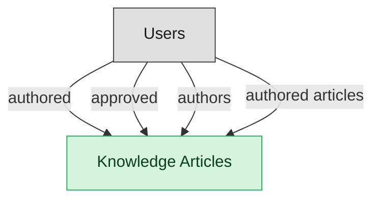

# Knowledge Management

## 1. Overview

Authoring, review, publication, and consumption of knowledge articles supporting ITSM agents and self-service portals.

## 2. Entity summary

| Name | data_object | Description |
| --- | --- | --- |
| Knowledge Articles | `knowledge_articles` | Knowledge-base articles backing self-service portals and agent-assist tools, moving through draft, review, published, and retired. |

## 3. Entities catalog

| # | data_object | canonical code | singular | plural | description | role | mastered in | mastered label | necessity | pattern flags | entity_type | write tier | notes |
| ---: | --- | --- | --- | --- | --- | --- | --- | --- | --- | --- | --- | --- | --- |
| 1 | `knowledge_articles` | `knowledge_articles` | Knowledge Article | Knowledge Articles | KB content backing both self-service portals and agent-assist tooling. Lifecycle: draft → review → published → retired. Quality and freshness are the silent ITSM KPIs that drive deflection rate. | master | - | - | required | submit_lock | operational_workflow | `:manage` | - |

## 4. Aliases and industry synonyms

_(none: no industry-scoped aliases for this scope)_

## 5. Relationships

### 5.1 Intra-scope edges

_(none: no relationships with both endpoints inside the scope)_

### 5.2 Built-in edges (`users` and other platform built-ins)

| from | verb | to | cardinality | necessity | owner_side | delete_mode | fk_format | notes |
| --- | --- | --- | --- | --- | --- | --- | --- | --- |
| `users` | authored | `knowledge_articles` | one_to_many | optional | source | clear | reference | - |
| `users` | approved | `knowledge_articles` | one_to_many | optional | source | clear | reference | - |
| `users` | authors | `knowledge_articles` | one_to_many | optional | source | clear | reference | - |
| `users` | authored articles | `knowledge_articles` | one_to_many | required | source | restrict | reference | - |

### 5.3 Cross-scope edges

#### 5.3a Outbound from this scope's masters and contributors

_Edges this scope drives: the in-scope endpoint has `role` of `master` or `contributor`._

| from | verb | to | cardinality | necessity | delete_mode | fk_format | notes |
| --- | --- | --- | --- | --- | --- | --- | --- |
| `knowledge_articles` | publishes_to | `knowledge_base_articles` | one_to_one | optional | none | n/a | - |
| `customer_cases` | references | `knowledge_articles` | many_to_many | optional | none | n/a | - |
| `knowledge_base_articles` | sources | `knowledge_articles` | one_to_many | optional | none | n/a | - |
| `intent_definitions` | informs | `knowledge_articles` | one_to_many | optional | none | n/a | - |
| `hr_cases` | references | `knowledge_articles` | many_to_many | optional | none | n/a | - |
| `service_problems` | documented_in | `knowledge_articles` | one_to_many | optional | none | n/a | - |
| `service_incidents` | resolved_with | `knowledge_articles` | many_to_many | optional | none | n/a | - |

#### 5.3b Context edges on embedded shells and consumed entities

_Edges the canonical owner drives, shown for context: the in-scope endpoint has `role` of `embedded_master`, `consumer`, or `derived`._

_(none: no context cross-scope edges on this scope's embedded shells or consumed entities)_

## 6. Cross-domain context

### 6.1 Master consumers (other modules / domains that embed this scope's masters)

| data_object | other module / domain | role | necessity | notes |
| --- | --- | --- | --- | --- |
| `knowledge_articles` | CSM-CASE-MGMT (Case Management) - CSM | contributor | optional | - |
| `knowledge_articles` | CSM-KNOWLEDGE (Customer Knowledge Surface) - CSM | contributor | required | - |
| `knowledge_articles` | HRSD-CASE-MGMT (HR Case Management) - HRSD | consumer | optional | - |
| `knowledge_articles` | HRSD-EMPLOYEE-PORTAL (Employee Self-Service Portal) - HRSD | embedded_master | required | - |
| `knowledge_articles` | HRSD-KNOWLEDGE (HR Knowledge) - HRSD | embedded_master | required | - |
| `knowledge_articles` | ITSM-STARTER (IT Service Desk Starter) - ITSM | embedded_master | optional | - |

### 6.2 Outbound handoffs (events this scope publishes)

| source module | target domain | target module | trigger_event | transition | payload | integration | friction | description |
| --- | --- | --- | --- | --- | --- | --- | --- | --- |
| ITSM-KNOWLEDGE | KMS | _(domain-level)_ | `knowledge_article.published` | _(state_change)_ | `knowledge_articles` | api_call | medium | Published ITSM knowledge articles sync to the broader KMS knowledge base. |

### 6.3 Inbound handoffs (events this scope reacts to)

_(none: no inbound handoffs whose payload is in this scope)_

### 6.4 Master providers (modules / domains that own masters this scope embeds)

_(none: this scope embeds no masters owned elsewhere; every entity is mastered here)_

## 7. Lifecycle states

### `knowledge_articles` (Knowledge Article)

| order | state_name | initial? | terminal? | requires_permission? | derived gate | description |
| --- | --- | --- | --- | --- | --- | --- |
| 1 | `draft` | ✓ | - | - | - | Author is drafting the article; freely editable. |
| 2 | `in_review` | - | - | - | - | Submitted for editorial/SME review; body locked from free edits. |
| 3 | `published` | - | - | ✓ | `itsm-knowledge:publish_article` | Article is live and visible to consumers. |
| 4 | `retired` | - | ✓ | - | - | Article withdrawn from circulation; retained for audit. |

## 8. Permissions and business rules (derived)

### 8.1 Permissions

| permission | tier | description | included in `:admin`? |
| --- | --- | --- | --- |
| `itsm-knowledge:read` | baseline-read | Read access to every entity in the module | ✓ |
| `itsm-knowledge:manage` | baseline-manage | Edit operational records | ✓ |
| `itsm-knowledge:admin` | baseline-admin | Edit reference data and inherit every workflow gate below | - |
| `itsm-knowledge:publish_article` | workflow-gate (lifecycle) | Transition `knowledge_articles` into state `published` | ✓ |
| `itsm-knowledge:submit_knowledge_article` | override (submit_lock) | Submit and lock a `knowledge_articles` row (post-submit edits gated) | ✓ |

### 8.2 Business rules

| rule_name | data_object | source flag | intent |
| --- | --- | --- | --- |
| `submit_restricted_to_knowledge_article_owner` | `knowledge_articles` | has_submit_lock | Only the row's authoring user can submit; post-submit the row is read-only except via `itsm-knowledge:manage_all_knowledge_articles` |

## 9. Roles, RACI, and responsibilities (derived)

_Baseline roles, the permission hierarchy, and RACI realization are DERIVED from this scope's entity-type write tiers + `process_raci`; none of it is stored in the catalog (the deployer provisions it from this blueprint)._

### 9.1 `ITSM-KNOWLEDGE`

**Baseline roles:**

| role | baseline grant |
| --- | --- |
| `itsm-knowledge_viewer` | `itsm-knowledge:read` |
| `itsm-knowledge_manager` | `itsm-knowledge:manage` |

**Permission hierarchy:**

| permission | includes |
| --- | --- |
| `itsm-knowledge:admin` | `itsm-knowledge:manage` |
| `itsm-knowledge:manage` | `itsm-knowledge:read` |
| `itsm-knowledge:admin` | `itsm-knowledge:publish_article` |
| `itsm-knowledge:admin` | `itsm-knowledge:submit_knowledge_article` |

**RACI realization:**

_(none: no process_raci assignments wired to this module's gated processes yet)_

### 9.2 Functional ownership and default grants

| responsibility | business function | default role | default tier |
| --- | --- | --- | --- |
| owner | IT Service Desk | `admin` | `:admin` |
| contributor | IT Operations | `manage` | `:manage` |
| contributor | Security | `manage` | `:manage` |
| consumer | Finance | `read` | `:read` |
| consumer | Human Resources | `read` | `:read` |
