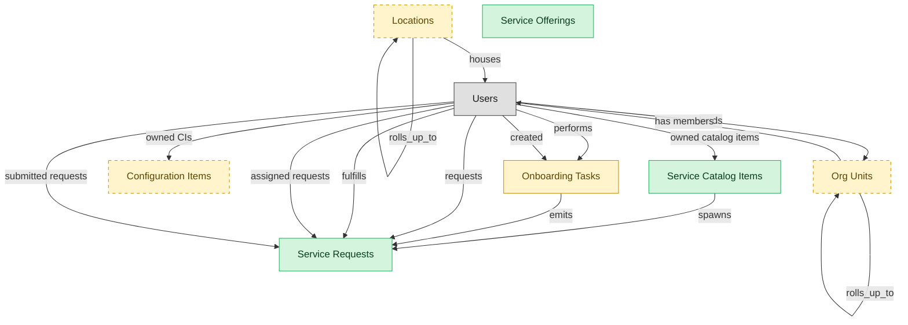

# Service Request Fulfillment

## 1. Overview

End-user-driven request workflow, including catalog authoring, request routing, approvals, and self-service portal.

## 2. Entity summary

| Name | data_object | Description |
| --- | --- | --- |
| Service Catalog Items | `service_catalog_items` | Definitions of what can be requested: the request form, fulfillment workflow, approvals, service level, and charge-back rules. |
| Service Offerings | `service_offerings` | Back-end service definitions covering commitments, supported configurations, and fulfillment, separate from their user-facing catalog items. |
| Service Requests | `service_requests` | Planned, catalog-driven requests for access, hardware, software, or information, distinct from reactive incidents. |
| Configuration Items | `configuration_items` | Canonical records of IT things under management: servers, containers, applications, services, network devices, databases, and cloud resources. |
| Locations | `locations` | Physical or organizational locations referenced across the system, used to place and group other records. |
| Onboarding Tasks | `onboarding_tasks` | Discrete to-do items within an onboarding journey, each with an assignee, due date, type, and completion state, some triggering handoffs to other systems. |
| Org Units | `org_units` | Nodes in the organizational hierarchy such as divisions, departments, and teams, with manager, cost center alignment, geographic scope, and parent-child links. |

## 3. Entities catalog

| # | data_object | canonical code | singular | plural | role | mastered in | mastered label | necessity | pattern flags | entity_type | write tier | notes |
| ---: | --- | --- | --- | --- | --- | --- | --- | --- | --- | --- | --- | --- |
| 1 | `service_catalog_items` | `service_catalog_items` | Service Catalog Item | Service Catalog Items | master | - | - | required | - | catalog | `:admin` | - |
| 2 | `service_offerings` | `service_offerings` | Service Offering | Service Offerings | master | - | - | required | - | catalog | `:admin` | - |
| 3 | `service_requests` | `service_requests` | Service Request | Service Requests | master | - | - | required | single_approver | operational_workflow | `:manage` | - |
| 4 | `configuration_items` | `configuration_items` | Configuration Item | Configuration Items | embedded_master | `cmdb-core` | CMDB Core Repository | optional | - | operational_workflow | `:manage` | - |
| 5 | `locations` | `locations` | Location | Locations | embedded_master | `iwms-location-master` | Location and Property Master | optional | - | catalog | `:admin` | - |
| 6 | `onboarding_tasks` | `onboarding_tasks` | Onboarding Task | Onboarding Tasks | embedded_master | `onb-journey-mgmt` | Onboarding Journey Management | required | personal_content | operational_workflow | `:manage` | ITSM-SERVICE-REQUEST receives onboarding tasks (IT provisioning, workplace setup) as service-request payloads. |
| 7 | `org_units` | `org_units` | Org Unit | Org Units | embedded_master | `hcm-org-positions` | Organization and Position Management | optional | - | operational_workflow | `:manage` | - |

## 4. Aliases and industry synonyms

_(none: no industry-scoped aliases for this scope)_

## 5. Relationships

### 5.1 Intra-scope edges

| from | verb | to | cardinality | kind | necessity | owner_side | delete_mode | fk_format | notes |
| --- | --- | --- | --- | --- | --- | --- | --- | --- | --- |
| `service_catalog_items` | spawns | `service_requests` | one_to_many | reference | optional | target | clear | reference | - |
| `onboarding_tasks` | emits | `service_requests` | one_to_many | reference | optional | source | clear | reference | - |
| `org_units` | rolls_up_to | `org_units` | one_to_many | reference | optional | source | clear | reference | - |
| `locations` | rolls_up_to | `locations` | one_to_many | reference | optional | source | clear | reference | - |

### 5.2 Built-in edges (`users` and other platform built-ins)

| from | verb | to | cardinality | necessity | owner_side | delete_mode | fk_format | notes |
| --- | --- | --- | --- | --- | --- | --- | --- | --- |
| `users` | owned CIs | `configuration_items` | one_to_many | optional | source | clear | reference | - |
| `users` | leads | `org_units` | one_to_many | optional | source | clear | reference | - |
| `users` | performs | `onboarding_tasks` | one_to_many | optional | source | clear | reference | - |
| `users` | created | `onboarding_tasks` | one_to_many | optional | source | clear | reference | - |
| `users` | requests | `service_requests` | one_to_many | required | source | restrict | reference | - |
| `users` | fulfills | `service_requests` | one_to_many | optional | source | clear | reference | - |
| `users` | assigned requests | `service_requests` | one_to_many | optional | source | clear | reference | - |
| `users` | submitted requests | `service_requests` | one_to_many | required | source | restrict | reference | - |
| `users` | owned catalog items | `service_catalog_items` | one_to_many | optional | source | clear | reference | - |
| `org_units` | has members | `users` | one_to_many | optional | target | clear | reference | - |
| `locations` | houses | `users` | one_to_many | optional | target | clear | reference | - |

### 5.3 Cross-scope edges

#### 5.3a Outbound from this scope's masters and contributors

_Edges this scope drives: the in-scope endpoint has `role` of `master` or `contributor`._

| from | verb | to | cardinality | necessity | delete_mode | fk_format | notes |
| --- | --- | --- | --- | --- | --- | --- | --- |
| `service_catalog_items` | exposes | `iga_entitlement_definitions` | one_to_many | optional | none | n/a | - |
| `audit_engagements` | triggers | `service_requests` | one_to_many | optional | none | n/a | - |
| `employees` | triggers | `service_requests` | one_to_many | optional | none | n/a | - |
| `hr_cases` | spawns | `service_requests` | one_to_many | optional | none | n/a | - |
| `service_requests` | routes_to | `service_incidents` | one_to_many | optional | none | n/a | - |
| `service_requests` | triggers | `service_incidents` | one_to_many | optional | none | n/a | - |
| `service_slas` | governs request | `service_requests` | one_to_many | required | none (required-if-present) | n/a | - |
| `clinical_engineering_work_orders` | surfaces_in | `service_requests` | one_to_one | optional | none | n/a | - |
| `device_calibration_records` | schedules_in | `service_requests` | one_to_many | optional | none | n/a | - |
| `work_items` | mirrors_to | `service_requests` | one_to_one | optional | none | n/a | - |
| `work_automations` | propagates_to | `service_requests` | many_to_many | optional | none | n/a | - |

#### 5.3b Context edges on embedded shells and consumed entities

_Edges the canonical owner drives, shown for context: the in-scope endpoint has `role` of `embedded_master`, `consumer`, or `derived`._

| from | verb | to | cardinality | necessity | delete_mode | fk_format | notes |
| --- | --- | --- | --- | --- | --- | --- | --- |
| `service_changes` | updates | `configuration_items` | many_to_many | optional | none | n/a | - |
| `enterprise_applications` | mapped_to | `configuration_items` | many_to_many | optional | none | n/a | - |
| `enterprise_applications` | onboards_into | `configuration_items` | one_to_one | optional | none | n/a | - |
| `ci_classes` | classifies | `configuration_items` | one_to_many | required | none (required-if-present) | n/a | - |
| `configuration_items` | related_via | `ci_relationships` | one_to_many | optional | none | n/a | - |
| `configuration_items` | baselined_in | `ci_baselines` | many_to_many | optional | none | n/a | - |
| `configuration_items` | composes | `service_maps` | many_to_many | optional | none | n/a | - |
| `configuration_items` | backed_by | `hardware_assets` | one_to_one | optional | none | n/a | - |
| `configuration_items` | changed_by | `service_changes` | many_to_many | optional | none | n/a | - |
| `configuration_items` | triggers | `service_incidents` | one_to_many | optional | none | n/a | - |
| `hardware_assets` | represented_as | `configuration_items` | one_to_one | optional | none | n/a | - |
| `locations` | hosts_desk_bookings | `desk_bookings` | one_to_many | required | none (required-if-present) | n/a | - |
| `locations` | hosts_room_reservations | `room_reservations` | one_to_many | required | none (required-if-present) | n/a | - |
| `locations` | site_of_service_requests | `workplace_service_requests` | one_to_many | required | none (required-if-present) | n/a | - |
| `locations` | measured_by_reports | `space_utilization_reports` | one_to_many | required | none (required-if-present) | n/a | - |
| `locations` | subject_of_feedback | `workplace_experience_feedback` | one_to_many | optional | none | n/a | - |
| `org_units` | groups | `employees` | one_to_many | required | none (required-if-present) | n/a | - |
| `org_units` | contains | `hcm_positions` | one_to_many | required | none (required-if-present) | n/a | - |
| `cost_centers` | funds | `org_units` | one_to_many | required | none (required-if-present) | n/a | - |
| `org_units` | engages | `contingent_workers` | one_to_many | optional | none | n/a | - |
| `org_units` | is_scored_by | `engagement_drivers` | one_to_many | optional | none | n/a | - |
| `org_units` | is_measured_by | `people_kpis` | one_to_many | optional | none | n/a | - |
| `org_units` | triggers | `iga_entitlement_definitions` | one_to_many | optional | none | n/a | - |
| `org_units` | maps_to | `cost_centers` | one_to_one | optional | none | n/a | - |
| `onboarding_stages` | contains | `onboarding_tasks` | one_to_many | required | ⚠ audit: required composed child out of scope | n/a | - |
| `onboarding_tasks` | triggers | `asset_lifecycle_events` | one_to_many | optional | none | n/a | - |
| `onboarding_tasks` | emits | `service_incidents` | one_to_many | optional | none | n/a | - |
| `onboarding_tasks` | emits | `workplace_service_requests` | one_to_many | optional | none | n/a | - |
| `onboarding_tasks` | spawns | `hr_cases` | one_to_many | optional | none | n/a | - |
| `onboarding_tasks` | spawns | `iga_access_requests` | one_to_many | optional | none | n/a | - |
| `onboarding_tasks` | spawns | `course_enrollments` | one_to_many | optional | none | n/a | - |
| `org_units` | sponsors | `compliance_assignments` | one_to_many | optional | none | n/a | - |
| `org_units` | sponsors | `benefit_plans` | many_to_many | optional | none | n/a | - |
| `survey_campaigns` | targets | `org_units` | many_to_many | optional | none | n/a | - |
| `org_units` | owns | `action_plans` | one_to_many | optional | none | n/a | - |
| `service_incidents` | references | `configuration_items` | many_to_many | optional | none | n/a | - |
| `service_changes` | impacts | `configuration_items` | many_to_many | required | none (required-if-present) | n/a | - |
| `dc_port_connections` | updates | `configuration_items` | one_to_many | optional | none | n/a | - |
| `vulnerabilities` | affects | `configuration_items` | one_to_many | optional | none | n/a | - |

## 6. Cross-domain context

### 6.1 Master consumers (other modules / domains that embed this scope's masters)

| data_object | other module / domain | role | necessity | notes |
| --- | --- | --- | --- | --- |
| `service_catalog_items` | IGA-ENTITLEMENT-CATALOG (IGA Entitlement Catalog) - IGA | consumer | optional | ITSM service-catalog publications spawn corresponding entitlement-catalog entries. |
| `service_catalog_items` | ITSM-STARTER (IT Service Desk Starter) - ITSM | embedded_master | optional | - |
| `service_requests` | HRSD-EMPLOYEE-PORTAL (Employee Self-Service Portal) - HRSD | embedded_master | optional | - |
| `service_requests` | IT-OPS-STARTER (IT Operations Starter) - IT-OPS-STARTER | embedded_master | optional | - |
| `service_requests` | ITSM-STARTER (IT Service Desk Starter) - ITSM | embedded_master | required | - |
| `service_requests` | ONB-JOURNEY-MGMT (Onboarding Journey Management) - ONBOARDING | contributor | required | - |
| `service_requests` | RMM-MONITORING (Monitoring and Alerting) - RMM | consumer | required | - |

### 6.2 Outbound handoffs (events this scope publishes)

| source module | target domain | target module | trigger_event | transition | payload | integration | friction | description |
| --- | --- | --- | --- | --- | --- | --- | --- | --- |
| CMDB-CORE | ITSM | ITSM-INCIDENT-MGMT | `ci.unauthorized_change_detected` | _(state_change)_ | `configuration_items` | api_call | medium | Configuration drift against a CI baseline (or change without a CAB-approved change record) creates a compliance / security incident in ITSM. Friction is medium - false positives from legitimate-but-unrecorded operational tweaks are common. |
| ONB-JOURNEY-MGMT | HRSD | HRSD-CASE-MGMT | `task.escalation_required` | _(state_change)_ | `onboarding_tasks` | api_call | medium | When an onboarding task is blocked, overdue, or contested (missing document, declined accommodation, pre-boarding question), an HR case is opened in HRSD. HRSD masters the case lifecycle; the case-resolution event flows back to unblock the task. Friction comes from inconsistent case-routing taxonomies between Onboarding and HRSD. |
| ONB-JOURNEY-MGMT | IWMS | IWMS-WORKPLACE-SERVICE-DESK | `task.workplace_setup_required` | _(state_change)_ | `onboarding_tasks` | manual_handoff | high | Onboarding flags physical-workplace tasks: badge issuance, desk allocation, parking, building access, ergonomic kit. IWMS systems are rarely event-driven; in practice the handoff is a ticket or an email to Facilities. High friction is the norm. |
| ITSM-SERVICE-REQUEST | IGA | IGA-ENTITLEMENT-CATALOG | `service_catalog_item.published` | _(state_change)_ | `service_catalog_items` | api_call | medium | New catalog items expose entitlements that IGA wires into access requests. |
| HCM-ORG-POSITIONS | IGA | IGA-ACCESS-REQUEST | `org_unit.created` | _(state_change)_ | `org_units` | event_stream | medium | New org unit drives IGA group/role provisioning. Group-name conventions and ownership must be encoded; otherwise orphan groups proliferate. |
| HCM-ORG-POSITIONS | IGA | IGA-ACCESS-REQUEST | `org_unit.disbanded` | _(state_change)_ | `org_units` | event_stream | high | Org-unit disbandment requires IGA group cleanup; orphan-group risk if employees re-assigned slowly. |
| HCM-ORG-POSITIONS | IGA | IGA-ACCESS-REQUEST | `org_unit.merged` | _(state_change)_ | `org_units` | event_stream | high | Org-unit merge consolidates IGA groups: members migrate, entitlements deduplicated, SoD revalidated. Often runs as a batch project rather than event. |
| ONB-JOURNEY-MGMT | IGA | IGA-ACCESS-REQUEST | `task.access_provisioning_required` | _(state_change)_ | `onboarding_tasks` | api_call | high | Onboarding flags the access-provisioning task for a new hire. IGA orchestrates the role/entitlement assignment via birthright-access policies and triggers provisioning to downstream systems. High friction because role-to-entitlement mappings are commonly maintained manually per business unit and drift quickly. |
| ONB-JOURNEY-MGMT | IGA | IGA-ACCESS-REQUEST | `task.it_provisioning_required` | _(state_change)_ | `onboarding_tasks` | api_call | high | Onboarding task requests IT provisioning; IGA must orchestrate downstream accounts and entitlements. SLA pressure on day-one readiness. |
| HCM-ORG-POSITIONS | HCM | HCM-CORE-WORKER | `org_unit.disbanded` | _(state_change)_ | `org_units` | lifecycle_progression | high | Disbanded org unit requires every incumbent employee to be re-placed before close; worker-record module blocks the close until reassignment completes. |
| HCM-ORG-POSITIONS | HCM | HCM-CORE-WORKER | `org_unit.merged` | _(state_change)_ | `org_units` | lifecycle_progression | medium | Org-unit consolidation cascades employee re-assignment, manager and dotted-line reassignment, and reporting-line recompute on the worker record. |
| HCM-ORG-POSITIONS | ATS | ATS-RECRUITMENT-PIPELINE | `org_unit.activated` | _(state_change)_ | `org_units` | api_call | low | - |
| HCM-ORG-POSITIONS | ATS | ATS-RECRUITMENT-PIPELINE | `org_unit.closed` | _(state_change)_ | `org_units` | api_call | high | - |
| HCM-ORG-POSITIONS | ATS | ATS-RECRUITMENT-PIPELINE | `org_unit.created` | _(state_change)_ | `org_units` | api_call | medium | - |
| HCM-ORG-POSITIONS | ATS | ATS-RECRUITMENT-PIPELINE | `org_unit.disbanded` | _(state_change)_ | `org_units` | api_call | high | - |
| HCM-ORG-POSITIONS | ATS | ATS-RECRUITMENT-PIPELINE | `org_unit.merged` | _(state_change)_ | `org_units` | api_call | high | - |
| HCM-ORG-POSITIONS | ATS | ATS-RECRUITMENT-PIPELINE | `org_unit.reorganized` | _(state_change)_ | `org_units` | api_call | high | - |
| ONB-JOURNEY-MGMT | LMS | LMS-COMPLIANCE-TRAINING | `task.compliance_training_required` | _(state_change)_ | `onboarding_tasks` | api_call | medium | Compliance training items (security awareness, anti-harassment, HIPAA, country-specific code-of-conduct, role-specific certifications) trigger LMS enrollments. LMS masters the enrollment record and completion certificate; Onboarding consumes the completion event to close out its task. Friction sits in keeping the training catalog mapped to roles/jurisdictions. |
| HCM-ORG-POSITIONS | FIN | _(domain-level)_ | `org_unit.created` | _(state_change)_ | `org_units` | api_call | medium | New org unit usually maps to cost-center; ERP-FIN must reflect the structure for budgeting and labor allocation. |

### 6.3 Inbound handoffs (events this scope reacts to)

| target module | source domain | source module | trigger_event | transition | payload | integration | friction | description |
| --- | --- | --- | --- | --- | --- | --- | --- | --- |
| ITSM-SERVICE-REQUEST | HRSD | HRSD-EMPLOYEE-PORTAL | `case.it_assistance_required` | _(state_change)_ | `service_requests` | api_call | medium | HR case that needs IT action (lost laptop replacement, app access for a new role, account lockout) routes a service request into ITSM. Friction sits in the case-to-SR field mapping and status synchronization back to HRSD. |
| ITSM-SERVICE-REQUEST | SAM | _(domain-level)_ | `license.expiry_warning` | _(threshold)_ | `service_requests` | api_call | low | Upcoming license expiry creates a renewal-action service request in ITSM. Low friction because the trigger is calendar-based and well-defined; routing to the right owner is the only nuance. |
| ITSM-SERVICE-REQUEST | SAM | _(domain-level)_ | `license_audit.required` | _(state_change)_ | `service_requests` | api_call | medium | Vendor-initiated audit or proactive internal review triggers an audit workflow service request. Friction sits in evidence collection across SAM + CLM + S2P data. |
| ITSM-SERVICE-REQUEST | HCM | HCM-CORE-WORKER | `employee.terminated` | `terminated` _(lifecycle)_ | `service_requests` | api_call | medium | Termination in HCM creates a fan-out of offboarding service requests in ITSM: workspace cleanup, mail-forwarding setup, equipment-return tracking, exit-interview scheduling. Failure modes: template tasks for new role types missing; tasks created against wrong assignee groups when org changed shortly before termination. |
| ITSM-SERVICE-REQUEST | ONBOARDING | ONB-JOURNEY-MGMT | `task.it_provisioning_required` | _(state_change)_ | `onboarding_tasks` | api_call | medium | Onboarding emits the IT-provisioning task for a new hire (laptop, peripherals, baseline software access). ITSM creates the corresponding service request(s); ITSM masters the fulfillment work item. Failure modes: late role / location changes invalidate the original SR catalog selection; manual rework is common. |
| ITSM-SERVICE-REQUEST | ONBOARDING | ONB-JOURNEY-MGMT | `task.workplace_setup_required` | _(state_change)_ | `onboarding_tasks` | api_call | medium | Workspace, desk, badge requests fulfilled by ITSM/IWMS. |
| CMDB-CORE | DISCOVERY | _(domain-level)_ | `ci.discovered` | `discovered` _(signal)_ | `configuration_items` | event_stream | low | Discovered devices reconcile against the existing CMDB and either match (update existing CI), promote (create new CI), or queue for manual review (ambiguous match). Low friction when DISCOVERY and CMDB are same-vendor; medium otherwise. |
| CMDB-CORE | RMM | RMM-AGENT-MGMT | `ci_endpoint.discovered` | `discovered` _(signal)_ | `configuration_items` | api_call | high | RMM contributes CI attributes (OS, installed services, network config) to the CMDB. Failure modes: CMDB receives the same logical CI from multiple discovery sources (RMM, AD, agent-less scans, cloud APIs) with conflicting attribute values; reconciliation rules are CMDB-vendor-specific and rarely fully cover RMM's payload shape. |

### 6.4 Master providers (modules / domains that own masters this scope embeds)

| data_object | role here | necessity | canonical owner(s) | slice notes |
| --- | --- | --- | --- | --- |
| `configuration_items` | embedded_master | optional | CMDB-CORE (CMDB) | - |
| `locations` | embedded_master | optional | IWMS-LOCATION-MASTER (IWMS) | - |
| `onboarding_tasks` | embedded_master | required | ONB-JOURNEY-MGMT (ONBOARDING) | ITSM-SERVICE-REQUEST receives onboarding tasks (IT provisioning, workplace setup) as service-request payloads. |
| `org_units` | embedded_master | optional | HCM-ORG-POSITIONS (HCM) | - |

## 7. Lifecycle states

### `configuration_items` (Configuration Item)

_This scope holds `configuration_items` as **embedded_master**; the canonical state machine is owned by `CMDB-CORE`._

| order | state_name | initial? | terminal? | requires_permission? | derived gate | description |
| --- | --- | --- | --- | --- | --- | --- |
| 1 | `discovered` | ✓ | - | - | - | CI auto-detected by discovery feed; not yet curated. |
| 2 | `registered` | - | - | ✓ | `itsm-service-request:register_ci` | CI record curated and accepted into the CMDB of record. |
| 3 | `in_use` | - | - | - | - | CI is actively in operational use. |
| 4 | `retired` | - | - | ✓ | `itsm-service-request:retire_ci` | CI taken out of service but record retained. |
| 5 | `archived` | - | ✓ | ✓ | `itsm-service-request:archive_ci` | CI record archived after retirement; read-only for audit. |

### `onboarding_tasks` (Onboarding Task)

_This scope holds `onboarding_tasks` as **embedded_master**; the canonical state machine is owned by `ONB-JOURNEY-MGMT`._

| order | state_name | initial? | terminal? | requires_permission? | derived gate | description |
| --- | --- | --- | --- | --- | --- | --- |
| 1 | `pending` | ✓ | - | - | - | Task assigned; due date set; not yet started. |
| 2 | `in_progress` | - | - | - | - | Assignee has started work or partial evidence captured. |
| 3 | `completed` | - | ✓ | ✓ | `itsm-service-request:completed_onboarding_task` | Task done; evidence (form, acknowledgment, signature, ticket id) captured. |
| 4 | `skipped` | - | ✓ | ✓ | `itsm-service-request:skipped_onboarding_task` | Task waived by manager/HR for this journey. |
| 5 | `canceled` | - | ✓ | ✓ | `itsm-service-request:canceled_onboarding_task` | Task voided (journey canceled, prerequisite removed). |

### `org_units` (Org Unit)

_This scope holds `org_units` as **embedded_master**; the canonical state machine is owned by `HCM-ORG-POSITIONS`._

| order | state_name | initial? | terminal? | requires_permission? | derived gate | description |
| --- | --- | --- | --- | --- | --- | --- |
| 1 | `draft` | ✓ | - | - | - | Org unit defined as part of a future structure; not yet operational. |
| 2 | `active` | - | - | ✓ | `itsm-service-request:active_org_unit` | Operational unit; carries headcount, cost-center linkage, and reporting lines. |
| 3 | `reorganized` | - | ✓ | ✓ | `itsm-service-request:reorganized_org_unit` | Unit folded into or replaced by a new structure; references remain for history. |
| 4 | `closed` | - | ✓ | ✓ | `itsm-service-request:closed_org_unit` | Unit dissolved; no employees or positions reside in it. |

### `service_catalog_items` (Service Catalog Item)

| order | state_name | initial? | terminal? | requires_permission? | derived gate | description |
| --- | --- | --- | --- | --- | --- | --- |
| 1 | `draft` | ✓ | - | - | - | - |
| 2 | `published` | - | - | ✓ | `itsm-service-request:publish_catalog_item` | - |
| 3 | `retired` | - | ✓ | ✓ | `itsm-service-request:retire_catalog_item` | - |

### `service_requests` (Service Request)

| order | state_name | initial? | terminal? | requires_permission? | derived gate | description |
| --- | --- | --- | --- | --- | --- | --- |
| 1 | `submitted` | ✓ | - | - | - | Requester has submitted the catalog request. |
| 2 | `approved` | - | - | ✓ | `itsm-service-request:approved_service_request` | Approver has authorized fulfillment. |
| 3 | `fulfilling` | - | - | - | - | Fulfillment team is provisioning or executing the request. |
| 4 | `fulfilled` | - | - | - | - | Item or access has been delivered to the requester. |
| 5 | `closed` | - | ✓ | - | - | Request archived after requester confirmation. |
| 6 | `canceled` | - | ✓ | - | - | Request withdrawn or rejected before fulfillment. |

## 8. Permissions and business rules (derived)

### 8.1 Permissions

| permission | tier | description | included in `:admin`? |
| --- | --- | --- | --- |
| `itsm-service-request:read` | baseline-read | Read access to every entity in the module | ✓ |
| `itsm-service-request:manage` | baseline-manage | Edit operational records | ✓ |
| `itsm-service-request:admin` | baseline-admin | Edit reference data and inherit every workflow gate below | - |
| `itsm-service-request:completed_onboarding_task` | workflow-gate (lifecycle) | Transition `onboarding_tasks` into state `completed` | ✓ |
| `itsm-service-request:skipped_onboarding_task` | workflow-gate (lifecycle) | Transition `onboarding_tasks` into state `skipped` | ✓ |
| `itsm-service-request:canceled_onboarding_task` | workflow-gate (lifecycle) | Transition `onboarding_tasks` into state `canceled` | ✓ |
| `itsm-service-request:active_org_unit` | workflow-gate (lifecycle) | Transition `org_units` into state `active` | ✓ |
| `itsm-service-request:reorganized_org_unit` | workflow-gate (lifecycle) | Transition `org_units` into state `reorganized` | ✓ |
| `itsm-service-request:closed_org_unit` | workflow-gate (lifecycle) | Transition `org_units` into state `closed` | ✓ |
| `itsm-service-request:approved_service_request` | workflow-gate (lifecycle) | Transition `service_requests` into state `approved` | ✓ |
| `itsm-service-request:publish_catalog_item` | workflow-gate (lifecycle) | Transition `service_catalog_items` into state `published` | ✓ |
| `itsm-service-request:retire_catalog_item` | workflow-gate (lifecycle) | Transition `service_catalog_items` into state `retired` | ✓ |
| `itsm-service-request:register_ci` | workflow-gate (lifecycle) | Transition `configuration_items` into state `registered` | ✓ |
| `itsm-service-request:retire_ci` | workflow-gate (lifecycle) | Transition `configuration_items` into state `retired` | ✓ |
| `itsm-service-request:archive_ci` | workflow-gate (lifecycle) | Transition `configuration_items` into state `archived` | ✓ |
| `itsm-service-request:view_all_onboarding_tasks` | override (personal_content) | View all `onboarding_tasks` rows beyond row-scope | ✓ |
| `itsm-service-request:manage_all_onboarding_tasks` | override (personal_content) | Manage all `onboarding_tasks` rows beyond row-scope | ✓ |

### 8.2 Business rules

| rule_name | data_object | source flag | intent |
| --- | --- | --- | --- |
| `approve_service_request_requires_approver` | `service_requests` | has_single_approver | Exactly one explicit approver required; uses the module's approval gate (`itsm-service-request:approved_service_request`). |
| `onboarding_task_edit_scope` | `onboarding_tasks` | has_personal_content | Row-scope by default; override via `itsm-service-request:view_all_onboarding_tasks` / `itsm-service-request:manage_all_onboarding_tasks` |

## 9. Roles, RACI, and responsibilities (derived)

_Baseline roles, the permission hierarchy, and RACI realization are DERIVED from this scope's entity-type write tiers + `process_raci`; none of it is stored in the catalog (the deployer provisions it from this blueprint)._

### 9.1 `ITSM-SERVICE-REQUEST`

**Baseline roles:**

| role | baseline grant |
| --- | --- |
| `itsm-service-request_viewer` | `itsm-service-request:read` |
| `itsm-service-request_manager` | `itsm-service-request:manage` |
| `itsm-service-request_admin` | `itsm-service-request:admin` |

**Permission hierarchy:**

| permission | includes |
| --- | --- |
| `itsm-service-request:admin` | `itsm-service-request:manage` |
| `itsm-service-request:manage` | `itsm-service-request:read` |
| `itsm-service-request:admin` | `itsm-service-request:completed_onboarding_task` |
| `itsm-service-request:admin` | `itsm-service-request:skipped_onboarding_task` |
| `itsm-service-request:admin` | `itsm-service-request:canceled_onboarding_task` |
| `itsm-service-request:admin` | `itsm-service-request:active_org_unit` |
| `itsm-service-request:admin` | `itsm-service-request:reorganized_org_unit` |
| `itsm-service-request:admin` | `itsm-service-request:closed_org_unit` |
| `itsm-service-request:admin` | `itsm-service-request:approved_service_request` |
| `itsm-service-request:admin` | `itsm-service-request:publish_catalog_item` |
| `itsm-service-request:admin` | `itsm-service-request:retire_catalog_item` |
| `itsm-service-request:admin` | `itsm-service-request:register_ci` |
| `itsm-service-request:admin` | `itsm-service-request:retire_ci` |
| `itsm-service-request:admin` | `itsm-service-request:archive_ci` |
| `itsm-service-request:admin` | `itsm-service-request:view_all_onboarding_tasks` |
| `itsm-service-request:admin` | `itsm-service-request:manage_all_onboarding_tasks` |

**Processes wired:**

| process_key | process_name | PCF code | PCF ID | level | description |
| --- | --- | --- | --- | --- | --- |
| `create_organizational_design` | Create organizational design | 1.2.5 | 10041 | 3 | Formulating a design for the organization's resources that allow it to meet its objectives. Develop a new framework for molding the organization's various processes into a coherent and seamless whole. |
| `conduct_organization` | Conduct organization restructuring opportunities | 1.1.5 | 16792 | 3 | Examining the scope and contingencies for restructuring based on market situation and internal realities. Map the market forces over which any and all probabilities can be probed for utility and viability. Once the restructuring options have been analyzed and the due-diligence performed, execute the deal. Consider seeking professional services for assistance in formalizing these opportunities. |

**RACI realization:**

| actor | kind | raci | process_key | realization |
| --- | --- | --- | --- | --- |
| `HR-ORG-DESIGN-ANALYST` | persona | responsible | `create_organizational_design` | grant gates [itsm-service-request:active_org_unit] + the gated entities' write tier |
| `HR-BUSINESS-PARTNER` | persona | accountable | `create_organizational_design` | approval gate |
| `PEOPLE-MANAGER` | persona | consulted | `create_organizational_design` | advisory read grant |
| `HR-HRIS-ADMIN` | persona | informed | `create_organizational_design` | notification side effect (trigger_event / webhook_receiver) |
| `HR-ORG-DESIGN-ANALYST` | persona | responsible | `conduct_organization` | grant gates [itsm-service-request:reorganized_org_unit] + the gated entities' write tier |
| `HR-BUSINESS-PARTNER` | persona | accountable | `conduct_organization` | approval gate |
| `PEOPLE-MANAGER` | persona | consulted | `conduct_organization` | advisory read grant |

### 9.2 Functional ownership and default grants

| responsibility | business function | default role | default tier |
| --- | --- | --- | --- |
| owner | IT Service Desk | `admin` | `:admin` |
| contributor | IT Operations | `manage` | `:manage` |
| contributor | Security | `manage` | `:manage` |
| consumer | Finance | `read` | `:read` |
| consumer | Human Resources | `read` | `:read` |
