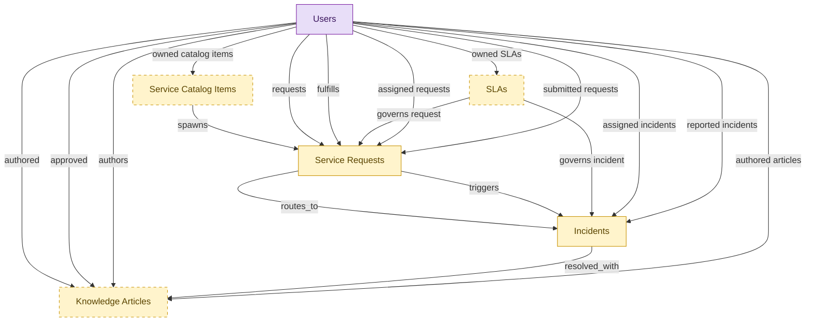

# IT Service Desk Starter

## 1. Overview

Single-domain starter kit for a small IT team that wants a lightweight service desk without the full ITSM suite or any asset estate. Embeds lightweight shells of ITSM's own records: incidents and service requests (the required helpdesk core), plus an optional request catalog, knowledge base, and SLA clocks. Problem, change, release, and event handling stay in the full itsm-* modules you turn on when you outgrow the desk; assets are out of scope (IT-OPS-STARTER and HAM). The embedded shells demote to the canonical itsm-* masters when those modules install alongside. The narrow, single-domain complement to IT-OPS-STARTER.

## 2. Entity summary

| Name | data_object | Description |
| --- | --- | --- |
| Incidents | `service_incidents` | Unplanned interruption of, or quality reduction to, a service. Carries severity, priority, category, assignee, affected CI(s), and the MTTR clock. The flagship ITSM work item. ITOM and SECOPS feed in (events become incidents, security alerts become incidents). |
| Knowledge Articles | `knowledge_articles` | KB content backing both self-service portals and agent-assist tooling. Lifecycle: draft → review → published → retired. Quality and freshness are the silent ITSM KPIs that drive deflection rate. |
| Service Catalog Items | `service_catalog_items` | Definition of what can be requested: the form schema, fulfillment workflow, approval routing, SLA, and the price/charge-back rules. Each service request instance references a catalog item. |
| Service Requests | `service_requests` | Planned, catalog-driven request: access, hardware, software, information. Distinct from incidents - incidents are reactive, service requests are proactive. The fulfillment for many requests crosses domains (provisioning ↔ IGA, asset assignment ↔ ITAM, HR exception ↔ HRSD). |
| SLAs | `service_slas` | Service-level agreement record: response-time, resolution-time, and availability targets per priority / category / customer tier. SLAs attach to incidents, service requests, and changes; breach metrics roll up to operational KPIs. |
| Users | `users` | Semantius platform-owned user table. Referenced from domain `data_objects` via `data_object_relationships` for assignee / author / approver / creator edges. Not surfaced in domain-level analytics (Signal 1/2 ignore `kind='platform_builtin'`). |

## 3. Entities catalog

| # | data_object | canonical code | singular | plural | role | mastered in | mastered label | necessity | pattern flags | entity_type | write tier | notes |
| ---: | --- | --- | --- | --- | --- | --- | --- | --- | --- | --- | --- | --- |
| 1 | `service_incidents` | `service_incidents` | Incident | Incidents | embedded_master | `itsm-incident-mgmt` | Incident Management | required | personal_content | operational_workflow | `:manage` | - |
| 2 | `knowledge_articles` | `knowledge_articles` | Knowledge Article | Knowledge Articles | embedded_master | `itsm-knowledge` | Knowledge Management | optional | submit_lock | operational_workflow | `:manage` | - |
| 3 | `service_catalog_items` | `service_catalog_items` | Service Catalog Item | Service Catalog Items | embedded_master | `itsm-service-request` | Service Request Fulfillment | optional | - | catalog | `:admin` | - |
| 4 | `service_requests` | `service_requests` | Service Request | Service Requests | embedded_master | `itsm-service-request` | Service Request Fulfillment | required | single_approver | operational_workflow | `:manage` | - |
| 5 | `service_slas` | `service_slas` | SLA | SLAs | embedded_master | `itsm-sla-mgmt` | SLA and Chargeback Management | optional | - | catalog | `:admin` | - |
| 6 | `users` | `users` | User | Users | consumer | _(platform built-in)_ | _(platform built-in)_ | required | - | operational_record | `:manage` | - |

## 4. Aliases and industry synonyms

_(none: no industry-scoped aliases for this scope)_

## 5. Relationships

### 5.1 Intra-scope edges

| from | verb | to | cardinality | kind | necessity | owner_side | delete_mode | fk_format | notes |
| --- | --- | --- | --- | --- | --- | --- | --- | --- | --- |
| `service_catalog_items` | spawns | `service_requests` | one_to_many | reference | optional | target | clear | reference | - |
| `service_requests` | routes_to | `service_incidents` | one_to_many | reference | optional | source | clear | reference | - |
| `service_requests` | triggers | `service_incidents` | one_to_many | reference | optional | target | clear | reference | - |
| `service_slas` | governs incident | `service_incidents` | one_to_many | reference | required | source | restrict | reference | - |
| `service_slas` | governs request | `service_requests` | one_to_many | reference | required | source | restrict | reference | - |
| `service_incidents` | resolved_with | `knowledge_articles` | many_to_many | reference | optional | source | clear | reference | - |

### 5.2 Built-in edges (`users` and other platform built-ins)

| from | verb | to | cardinality | necessity | owner_side | delete_mode | fk_format | notes |
| --- | --- | --- | --- | --- | --- | --- | --- | --- |
| `users` | authored | `knowledge_articles` | one_to_many | optional | source | clear | reference | - |
| `users` | approved | `knowledge_articles` | one_to_many | optional | source | clear | reference | - |
| `users` | authors | `knowledge_articles` | one_to_many | optional | source | clear | reference | - |
| `users` | requests | `service_requests` | one_to_many | required | source | restrict | reference | - |
| `users` | fulfills | `service_requests` | one_to_many | optional | source | clear | reference | - |
| `users` | assigned incidents | `service_incidents` | one_to_many | optional | source | clear | reference | - |
| `users` | reported incidents | `service_incidents` | one_to_many | required | source | restrict | reference | - |
| `users` | assigned requests | `service_requests` | one_to_many | optional | source | clear | reference | - |
| `users` | submitted requests | `service_requests` | one_to_many | required | source | restrict | reference | - |
| `users` | authored articles | `knowledge_articles` | one_to_many | required | source | restrict | reference | - |
| `users` | owned catalog items | `service_catalog_items` | one_to_many | optional | source | clear | reference | - |
| `users` | owned SLAs | `service_slas` | one_to_many | optional | source | clear | reference | - |

### 5.3 Cross-scope edges

#### 5.3a Outbound from this scope's masters and contributors

_Edges this scope drives: the in-scope endpoint has `role` of `master` or `contributor`._

_(none: no outbound cross-scope edges from this scope's masters or contributors)_

#### 5.3b Context edges on embedded shells and consumed entities

_Edges the canonical owner drives, shown for context: the in-scope endpoint has `role` of `embedded_master`, `consumer`, or `derived`._

| from | verb | to | cardinality | necessity | delete_mode | fk_format | notes |
| --- | --- | --- | --- | --- | --- | --- | --- |
| `knowledge_articles` | publishes_to | `knowledge_base_articles` | one_to_one | optional | none | n/a | - |
| `service_catalog_items` | exposes | `iga_entitlement_definitions` | one_to_many | optional | none | n/a | - |
| `service_incidents` | triggers | `remediation_plans` | one_to_many | optional | none | n/a | - |
| `application_interfaces` | raises | `service_incidents` | one_to_many | optional | none | n/a | - |
| `configuration_items` | triggers | `service_incidents` | one_to_many | optional | none | n/a | - |
| `service_maps` | refreshes | `service_incidents` | many_to_many | optional | none | n/a | - |
| `ci_baselines` | triggers | `service_incidents` | one_to_many | optional | none | n/a | - |
| `chat_threads` | escalates_to | `service_incidents` | one_to_many | optional | none | n/a | - |
| `control_tests` | escalates_to | `service_incidents` | one_to_many | optional | none | n/a | - |
| `audit_engagements` | triggers | `service_requests` | one_to_many | optional | none | n/a | - |
| `customer_cases` | references | `knowledge_articles` | many_to_many | optional | none | n/a | - |
| `test_defects` | escalates_to | `service_incidents` | one_to_many | optional | none | n/a | - |
| `lcap_apps` | opens | `service_incidents` | many_to_many | optional | none | n/a | - |
| `knowledge_base_articles` | sources | `knowledge_articles` | one_to_many | optional | none | n/a | - |
| `intent_definitions` | informs | `knowledge_articles` | one_to_many | optional | none | n/a | - |
| `dlp_incidents` | informs_security_incident | `service_incidents` | one_to_many | optional | none | n/a | - |
| `employees` | triggers | `service_requests` | one_to_many | optional | none | n/a | - |
| `onboarding_tasks` | emits | `service_requests` | one_to_many | optional | none | n/a | - |
| `onboarding_tasks` | emits | `service_incidents` | one_to_many | optional | none | n/a | - |
| `hr_cases` | references | `knowledge_articles` | many_to_many | optional | none | n/a | - |
| `hr_cases` | spawns | `service_requests` | one_to_many | optional | none | n/a | - |
| `service_problems` | is investigated by | `service_incidents` | one_to_many | optional | none | n/a | - |
| `service_incidents` | references | `configuration_items` | many_to_many | optional | none | n/a | - |
| `service_problems` | documented_in | `knowledge_articles` | one_to_many | optional | none | n/a | - |
| `service_incidents` | correlates_to | `monitoring_alerts` | many_to_many | optional | none | n/a | - |
| `service_incidents` | correlates_to | `error_groups` | many_to_many | optional | none | n/a | - |
| `service_slas` | aligns_with | `service_level_objectives` | many_to_many | optional | none | n/a | - |
| `eam_work_orders` | escalates_to | `service_incidents` | one_to_many | optional | none | n/a | - |
| `clinical_engineering_work_orders` | surfaces_in | `service_requests` | one_to_one | optional | none | n/a | - |
| `device_calibration_records` | schedules_in | `service_requests` | one_to_many | optional | none | n/a | - |
| `work_items` | mirrors_to | `service_requests` | one_to_one | optional | none | n/a | - |
| `work_automations` | propagates_to | `service_requests` | many_to_many | optional | none | n/a | - |
| `event_correlations` | triggers | `service_incidents` | one_to_many | optional | none | n/a | - |
| `root_cause_analyses` | annotates | `service_incidents` | one_to_many | optional | none | n/a | - |
| `incident_predictions` | forecasts | `service_incidents` | one_to_many | optional | none | n/a | - |
| `dc_cabinets` | raises | `service_incidents` | one_to_many | optional | none | n/a | - |
| `dc_power_distribution_units` | raises | `service_incidents` | one_to_many | optional | none | n/a | - |
| `dc_uninterruptible_power_supplies` | raises | `service_incidents` | one_to_many | optional | none | n/a | - |
| `dc_cooling_units` | raises | `service_incidents` | one_to_many | optional | none | n/a | - |
| `endpoint_experience_scores` | triggers | `service_incidents` | one_to_many | optional | none | n/a | - |
| `saas_applications` | raises_incident | `service_incidents` | one_to_many | optional | none | n/a | - |

## 6. Cross-domain context

### 6.1 Master consumers (other modules / domains that embed this scope's masters)

_(none: no other module embeds this scope's masters; the canonical owners do.)_

### 6.2 Outbound handoffs (events this scope publishes)

| source module | target domain | target module | trigger_event | transition | payload | integration | friction | description |
| --- | --- | --- | --- | --- | --- | --- | --- | --- |
| ITSM-KNOWLEDGE | KMS | _(domain-level)_ | `knowledge_article.published` | _(state_change)_ | `knowledge_articles` | api_call | medium | Published ITSM knowledge articles sync to the broader KMS knowledge base. |
| ITSM-SERVICE-REQUEST | IGA | IGA-ENTITLEMENT-CATALOG | `service_catalog_item.published` | _(state_change)_ | `service_catalog_items` | api_call | medium | New catalog items expose entitlements that IGA wires into access requests. |

### 6.3 Inbound handoffs (events this scope reacts to)

| target module | source domain | source module | trigger_event | transition | payload | integration | friction | description |
| --- | --- | --- | --- | --- | --- | --- | --- | --- |
| ITSM-INCIDENT-MGMT | ITOM | ITOM-INFRA-MON | `monitoring_event.alert_triggered` | _(signal)_ | `service_incidents` | event_stream | high | Monitoring/alerting events from ITOM auto-create incidents in ITSM when severity and correlation rules match. High friction in practice - alert storms create incident floods, correlation rules drift, and dedupe logic between systems is rarely good enough. The classic 'NOC-floods-the-helpdesk' problem. |
| ITSM-INCIDENT-MGMT | DISCOVERY | _(domain-level)_ | `discovery_scan.failed` | _(state_change)_ | `service_incidents` | api_call | medium | Failed DISCOVERY scans open ITSM tickets for the discovery owner. |
| ITSM-INCIDENT-MGMT | DISCOVERY | _(domain-level)_ | `discovery_source.disconnected` | _(state_change)_ | `service_incidents` | api_call | medium | DISCOVERY source outages auto-ticket ITSM to restore visibility. |
| ITSM-INCIDENT-MGMT | AIOPS | AIOPS-EVENT-CORRELATION | `correlation.identified` | `identified` _(signal)_ | `service_incidents` | event_stream | high | A correlated alert cluster surfaces as ONE incident in ITSM instead of N. The defining noise-reduction promise of AIOps - and the hardest integration to land cleanly, because suppressing the underlying alerts requires bidirectional state with ITOM, and ITSM needs to expose the correlated-events bundle as evidence on the incident. |
| ITSM-INCIDENT-MGMT | AIOPS | AIOPS-PREDICTIVE-INTELLIGENCE | `incident_prediction.high_confidence` | _(signal)_ | `service_incidents` | event_stream | low | Predicted incidents auto-open proactive ITSM tickets ahead of impact. |
| ITSM-INCIDENT-MGMT | AIOPS | AIOPS-PREDICTIVE-INTELLIGENCE | `root_cause_analysis.published` | _(state_change)_ | `service_incidents` | event_stream | low | AIOPS RCA conclusion lands on the linked ITSM incident/problem as resolution context. |
| ITSM-INCIDENT-MGMT | OBS | _(domain-level)_ | `log_entry.error_pattern_matched` | _(signal)_ | `service_incidents` | api_call | medium | Critical log patterns auto-open ITSM tickets for technician triage. |
| ITSM-INCIDENT-MGMT | OBS | _(domain-level)_ | `slo.breached` | `breached` _(state_change)_ | `service_incidents` | event_stream | high | SLO breach (error budget exhausted, burn-rate spike) creates an incident in ITSM. High friction in practice, the routing from an OBS-side SLO-breach event to a correctly assigned ITSM incident is rarely turnkey, especially when the SLO-owning team and the incident-handling team differ. |
| ITSM-INCIDENT-MGMT | TEST-MGMT | _(domain-level)_ | `test_defect.created` | _(lifecycle)_ | `service_incidents` | api_call | medium | Customer-impacting defects in production-pathing tests escalate to ITSM tickets. |
| ITSM-INCIDENT-MGMT | APM | APM-PORTFOLIO-REGISTRY | `application_interface.broken` | `active` → `broken` _(state_change)_ | `service_incidents` | event_stream | high | Integration failure escalates to incident; detection lag; true-positive rate varies. |
| ITSM-INCIDENT-MGMT | GRC | _(domain-level)_ | `control.failed` | `untested` → `fail` _(state_change)_ | `service_incidents` | api_call | high | Failed IT control → ITSM ticket; no feedback when ITSM closes ticket on GRC SLA. |
| ITSM-INCIDENT-MGMT | GRC | _(domain-level)_ | `remediation_plan.created` | _(lifecycle)_ | `service_incidents` | event_stream | medium | Remediation ticket created in ITSM. |
| ITSM-INCIDENT-MGMT | AUDIT | _(domain-level)_ | `audit_engagement.completed` | `in_progress` → `completed` _(lifecycle)_ | `service_incidents` | manual_handoff | high | IT audit outcomes trigger ITSM actions; requires human interpretation of scope/findings. |
| ITSM-SERVICE-REQUEST | HRSD | HRSD-EMPLOYEE-PORTAL | `case.it_assistance_required` | _(state_change)_ | `service_requests` | api_call | medium | HR case that needs IT action (lost laptop replacement, app access for a new role, account lockout) routes a service request into ITSM. Friction sits in the case-to-SR field mapping and status synchronization back to HRSD. |
| ITSM-INCIDENT-MGMT | IGA | IGA-ACCESS-REQUEST | `iga_access_request.approved` | _(state_change)_ | `service_incidents` | api_call | medium | Approved access requests with manual-fulfillment steps route to ITSM. |
| ITSM-INCIDENT-MGMT | IGA | IGA-AUTO-PROVISIONING | `iga_provisioning_event.completed` | _(state_change)_ | `service_incidents` | event_stream | medium | Provisioning event drives ITSM fulfillment-task closure where access tickets exist. |
| ITSM-INCIDENT-MGMT | IGA | IGA-AUTO-PROVISIONING | `iga_provisioning_event.failed` | _(state_change)_ | `service_incidents` | api_call | high | Failed provisioning becomes ITSM incident/request for manual completion. Alert-without-feedback-loop friction shape. |
| ITSM-INCIDENT-MGMT | IPAAS | _(domain-level)_ | `integration_run.failed` | _(lifecycle)_ | `service_incidents` | api_call | high | iPaaS run failures often surface as ITSM tickets - the failed integration usually has business impact (missed orders, stalled provisioning). |
| ITSM-INCIDENT-MGMT | LCAP | LCAP-VISUAL-COMPOSITION | `lcap_app.deployment_failed` | _(signal)_ | `service_incidents` | api_call | medium | Deployment failure opens incident for platform team. |
| ITSM-INCIDENT-MGMT | RPA | _(domain-level)_ | `rpa_bot_credentials.expiring` | _(threshold)_ | `service_incidents` | api_call | medium | Expiring bot credentials open a service request for IT rotation. |
| ITSM-INCIDENT-MGMT | RPA | _(domain-level)_ | `rpa_execution.failed` | _(state_change)_ | `service_incidents` | api_call | high | Bot execution failure opens incident for bot owner; target system change often the root cause. |
| ITSM-INCIDENT-MGMT | TELCO-BSS | _(domain-level)_ | `network_inventory.updated` | _(state_change)_ | `service_incidents` | batch_sync | low | Network inventory updates sync to ITSM CMDB-adjacent inventory. |
| ITSM-INCIDENT-MGMT | TELCO-BSS | _(domain-level)_ | `service_provisioning.failed` | _(state_change)_ | `service_incidents` | event_stream | high | Provisioning failures escalate to ITSM for network/IT diagnosis. |
| ITSM-INCIDENT-MGMT | TELCO-BSS | _(domain-level)_ | `service_trouble_ticket.opened` | _(state_change)_ | `service_incidents` | event_stream | medium | Telco trouble ticket routes to ITSM for network ops resolution. |
| ITSM-INCIDENT-MGMT | HC-PATIENT | _(domain-level)_ | `clinical_order.placed` | _(lifecycle)_ | `service_incidents` | api_call | low | Order routing relies on ITSM-managed integration with lab/imaging systems. |
| ITSM-INCIDENT-MGMT | MFG-OPS | _(domain-level)_ | `shop_floor_case.opened` | _(lifecycle)_ | `service_incidents` | api_call | medium | Shop-floor case with IT/MES root cause is routed to ITSM for incident management. |
| ITSM-INCIDENT-MGMT | UTIL-OPS | _(domain-level)_ | `utility_asset.failed` | _(state_change)_ | `service_incidents` | api_call | medium | Failure of IT-dependent grid/SCADA asset raises an ITSM incident for dependent technology stack. |
| ITSM-INCIDENT-MGMT | CLIN-DEV | _(domain-level)_ | `clinical_engineering_work_order.opened` | _(lifecycle)_ | `service_incidents` | api_call | medium | Clinical engineering work order surfaces in ITSM when shared with IT for connected-device support. |
| ITSM-INCIDENT-MGMT | CLIN-DEV | _(domain-level)_ | `device_calibration.due` | _(threshold)_ | `service_incidents` | batch_sync | low | Calibration scheduling visible to ITSM when biomed device is shared infrastructure. |
| ITSM-SERVICE-REQUEST | SAM | _(domain-level)_ | `license.expiry_warning` | _(threshold)_ | `service_requests` | api_call | low | Upcoming license expiry creates a renewal-action service request in ITSM. Low friction because the trigger is calendar-based and well-defined; routing to the right owner is the only nuance. |
| ITSM-SERVICE-REQUEST | SAM | _(domain-level)_ | `license_audit.required` | _(state_change)_ | `service_requests` | api_call | medium | Vendor-initiated audit or proactive internal review triggers an audit workflow service request. Friction sits in evidence collection across SAM + CLM + S2P data. |
| ITSM-INCIDENT-MGMT | EAM | _(domain-level)_ | `eam_work_order.created` | - | `service_incidents` | event_stream | medium | Critical equipment failures escalated to IT incidents. |
| ITSM-SERVICE-REQUEST | HCM | HCM-CORE-WORKER | `employee.terminated` | `terminated` _(lifecycle)_ | `service_requests` | api_call | medium | Termination in HCM creates a fan-out of offboarding service requests in ITSM: workspace cleanup, mail-forwarding setup, equipment-return tracking, exit-interview scheduling. Failure modes: template tasks for new role types missing; tasks created against wrong assignee groups when org changed shortly before termination. |
| ITSM-INCIDENT-MGMT | BI | _(domain-level)_ | `bi_report.failed` | _(state_change)_ | `service_incidents` | api_call | medium | Scheduled report failure files an ITSM ticket for the BI platform team to investigate. |
| ITSM-INCIDENT-MGMT | WSC | WSC-CHANNELS-CONVERSATIONS | `chat_thread.escalated_to_ticket` | _(state_change)_ | `service_incidents` | api_call | low | WSC IT-support threads are converted into ITSM tickets so the SLA clock starts and the transcript becomes incident context. |
| ITSM-INCIDENT-MGMT | APP-PAAS | _(domain-level)_ | `paas_deployment.failed` | _(state_change)_ | `service_incidents` | api_call | medium | Failed deployments raise incidents in ITSM for triage. |
| ITSM-INCIDENT-MGMT | VSDP | _(domain-level)_ | `software_deployment.failed` | _(state_change)_ | `service_incidents` | api_call | medium | Failed deployments raise incidents for change-management and operations triage. |
| ITSM-INCIDENT-MGMT | KUBE-PLAT | _(domain-level)_ | `container_workload.degraded` | _(state_change)_ | `service_incidents` | api_call | medium | Persistent workload degradation creates ITSM incidents for platform-team triage. |
| _(domain-level)_ | NPMD | _(domain-level)_ | `network_interface.flapping` | _(state_change)_ | `service_incidents` | api_call | medium | A flapping interface opens an ITSM incident for investigation. |
| _(domain-level)_ | NPMD | _(domain-level)_ | `network_path.degraded` | _(state_change)_ | `service_incidents` | api_call | medium | Sustained path degradation opens an ITSM incident for the affected service. |
| ITSM-INCIDENT-MGMT | NPMD | _(domain-level)_ | `network_interface.down` | _(state_change)_ | `service_incidents` | api_call | low | Interface-down events auto-create ITSM tickets for the responsible team. |
| ITSM-INCIDENT-MGMT | NPMD | _(domain-level)_ | `network_performance_alert.raised` | _(lifecycle)_ | `service_incidents` | api_call | medium | NPMD performance alerts auto-open ITSM network tickets. |
| ITSM-INCIDENT-MGMT | DEM | _(domain-level)_ | `endpoint_experience_score.degraded` | _(state_change)_ | `service_incidents` | event_stream | medium | Degraded DEM endpoint experience opens proactive ITSM tickets for the user. |
| ITSM-INCIDENT-MGMT | DCIM | DCIM-ASSET-SPACE | `dc_cabinet.environmental_alert` | _(threshold)_ | `service_incidents` | api_call | medium | DCIM cabinet environmental alerts auto-create facility ITSM tickets. |
| ITSM-INCIDENT-MGMT | DCIM | DCIM-POWER-ENV | `dc_cooling_unit.failure` | _(state_change)_ | `service_incidents` | event_stream | high | DCIM cooling failures trigger emergency ITSM workflow. |
| ITSM-INCIDENT-MGMT | DCIM | DCIM-POWER-ENV | `dc_power_distribution_unit.failure` | _(state_change)_ | `service_incidents` | event_stream | high | DCIM PDU failures trigger ITSM major-incident workflow. |
| ITSM-INCIDENT-MGMT | DCIM | DCIM-POWER-ENV | `dc_uninterruptible_power_supply.failover` | _(state_change)_ | `service_incidents` | event_stream | high | DCIM UPS failovers escalate to ITSM major-incident workflow. |
| ITSM-INCIDENT-MGMT | SMP | SMP-DISCOVERY | `saas_application.deprovisioned` | _(lifecycle)_ | `service_incidents` | event_stream | medium | SaaS app deprovisioning closes related ITSM tickets and access requests. |
| ITSM-INCIDENT-MGMT | UEM | UEM-DEVICE-LIFECYCLE | `enrolled_device.enrolled` | _(state_change)_ | `service_incidents` | event_stream | low | Newly enrolled UEM devices auto-link to onboarding ITSM tickets. |
| ITSM-INCIDENT-MGMT | UEM | UEM-CONFIG-APPS | `device_configuration_profile.drift_detected` | _(state_change)_ | `service_incidents` | api_call | medium | UEM configuration drift opens ITSM remediation tickets. |
| ITSM-INCIDENT-MGMT | UEM | UEM-COMPLIANCE-POSTURE | `device_compliance_result.non_compliant` | _(state_change)_ | `service_incidents` | api_call | medium | Non-compliant UEM devices auto-ticket ITSM for remediation. |
| ITSM-INCIDENT-MGMT | DI | _(domain-level)_ | `pipeline_run.failed` | _(state_change)_ | `service_incidents` | api_call | high | Pipeline failure opens incident for the data-platform on-call. |
| ITSM-INCIDENT-MGMT | DQ | _(domain-level)_ | `dq_scorecard.breached` | `compliant` → `non_compliant` _(threshold)_ | `service_incidents` | api_call | medium | Scorecard SLA breach → ITSM escalation ticket. |
| ITSM-INCIDENT-MGMT | DQ | _(domain-level)_ | `dq_sla_definition.breached` | _(threshold)_ | `service_incidents` | api_call | high | Data SLA breach creates incident for the producing pipeline's owning team. |
| ITSM-INCIDENT-MGMT | DQ | _(domain-level)_ | `quality_rule.breach` | `active` → `breached` _(state_change)_ | `service_incidents` | event_stream | medium | Severity ≥ HIGH or breach > SLA threshold → ITSM incident. Dedup on (asset_id, rule_id). |
| ITSM-INCIDENT-MGMT | DATA-AI-PLAT | DATA-AI-PLAT-ML | `ml_model.drift_detected` | _(signal)_ | `service_incidents` | event_stream | high | Drift detected on production model; ITSM incident created for MLOps team to triage retraining. |
| ITSM-INCIDENT-MGMT | DATA-AI-PLAT | DATA-AI-PLAT-ML | `ml_model.evaluation_failed` | _(state_change)_ | `service_incidents` | api_call | medium | Failed evaluation creates an incident for MLOps; deployment blocked until remediated. |
| ITSM-INCIDENT-MGMT | RMM | RMM-MONITORING | `monitoring_alert.threshold_breached` | _(threshold)_ | `service_incidents` | api_call | high | RMM agent telemetry breaches a monitoring policy threshold and the alert is forwarded to ITSM to auto-create an incident with affected endpoint, telemetry snapshot, and severity. Failure modes: alert-to-ticket bridges across different vendors break on auth/throttling/schema drift; threshold rules drift between systems; duplicate-alert suppression in one tool doesn't propagate to the other; closing the incident rarely closes the originating alert. |
| ITSM-INCIDENT-MGMT | RMM | RMM-AUTOMATION | `automation_script.failed` | _(state_change)_ | `service_incidents` | api_call | low | Failed RMM script executions auto-create ITSM tickets. |
| ITSM-INCIDENT-MGMT | REMOTE-ACCESS | REMOTE-ACCESS-SESSION | `remote_session.ended` | _(state_change)_ | `service_incidents` | event_stream | low | Completed remote sessions append worklog and timer to the linked ITSM ticket. |
| ITSM-INCIDENT-MGMT | REMOTE-ACCESS | REMOTE-ACCESS-SESSION | `support_session.completed` | `completed` _(state_change)_ | `service_incidents` | api_call | medium | Completed remote session writes a session summary (duration, technician, actions taken, recording link) back to the originating ITSM incident as a work-note. Failure modes: ticket-id correlation is brittle when session was launched outside the ticket flow; recording links break when retention policy expires before the ticket closes. |
| ITSM-INCIDENT-MGMT | NCDB | _(domain-level)_ | `nocode_automation.failed` | _(signal)_ | `service_incidents` | api_call | medium | Automation failure that the citizen owner cannot resolve escalates to IT support. |
| ITSM-INCIDENT-MGMT | WORK-MGMT | WORK-MGMT-TASK-EXEC | `work_automation.triggered` | _(signal)_ | `service_incidents` | event_stream | low | Work-item automations linked to IT tickets propagate status changes to ITSM. |
| ITSM-INCIDENT-MGMT | WORK-MGMT | WORK-MGMT-TASK-EXEC | `work_item.status_changed` | `any` → `any` _(lifecycle)_ | `service_incidents` | api_call | high | Cross-functional WORK-MGMT items intersect with IT support requests: a marketing project task ('IT-provision new SaaS') needs to be linked to an ITSM request, with status mirrored both ways. Bidirectional sync is bespoke; off-the-shelf WORK-MGMT-to-ITSM connectors exist but require careful per-team configuration. |
| ITSM-INCIDENT-MGMT | DLP | DLP-ENFORCEMENT-RUNTIME | `dlp_incident.blocked` | `confirmed` → `blocked` _(state_change)_ | `service_incidents` | event_stream | medium | DLP block creates security incident in ITSM. |
| ITSM-INCIDENT-MGMT | FLEET-MAINT | _(domain-level)_ | `maintenance_defect.reported` | - | `service_incidents` | event_stream | medium | In-vehicle IT defects escalated to IT tickets. |

### 6.4 Master providers (modules / domains that own masters this scope embeds)

| data_object | role here | necessity | canonical owner(s) | slice notes |
| --- | --- | --- | --- | --- |
| `knowledge_articles` | embedded_master | optional | ITSM-KNOWLEDGE (ITSM) | - |
| `service_catalog_items` | embedded_master | optional | ITSM-SERVICE-REQUEST (ITSM) | - |
| `service_incidents` | embedded_master | required | ITSM-INCIDENT-MGMT (ITSM) | - |
| `service_requests` | embedded_master | required | ITSM-SERVICE-REQUEST (ITSM) | - |
| `service_slas` | embedded_master | optional | ITSM-SLA-MGMT (ITSM) | - |
| `users` | consumer | required | _(platform built-in)_ | - |

## 7. Lifecycle states

### `knowledge_articles` (Knowledge Article)

_This scope holds `knowledge_articles` as **embedded_master**; the canonical state machine is owned by `ITSM-KNOWLEDGE`._

| order | state_name | initial? | terminal? | requires_permission? | derived gate | description |
| --- | --- | --- | --- | --- | --- | --- |
| 1 | `draft` | ✓ | - | - | - | Author is drafting the article; freely editable. |
| 2 | `in_review` | - | - | - | - | Submitted for editorial/SME review; body locked from free edits. |
| 3 | `published` | - | - | ✓ | `itsm-starter:publish_article` | Article is live and visible to consumers. |
| 4 | `retired` | - | ✓ | - | - | Article withdrawn from circulation; retained for audit. |

### `service_catalog_items` (Service Catalog Item)

_This scope holds `service_catalog_items` as **embedded_master**; the canonical state machine is owned by `ITSM-SERVICE-REQUEST`._

| order | state_name | initial? | terminal? | requires_permission? | derived gate | description |
| --- | --- | --- | --- | --- | --- | --- |
| 1 | `draft` | ✓ | - | - | - | - |
| 2 | `published` | - | - | ✓ | `itsm-starter:publish_catalog_item` | - |
| 3 | `retired` | - | ✓ | ✓ | `itsm-starter:retire_catalog_item` | - |

### `service_incidents` (Incident)

_This scope holds `service_incidents` as **embedded_master**; the canonical state machine is owned by `ITSM-INCIDENT-MGMT`._

| order | state_name | initial? | terminal? | requires_permission? | derived gate | description |
| --- | --- | --- | --- | --- | --- | --- |
| 1 | `new` | ✓ | - | - | - | Incident has been logged; not yet triaged or routed. |
| 2 | `assigned` | - | - | - | - | Triaged and assigned to a support group or agent. |
| 3 | `in_progress` | - | - | - | - | Assignee is actively diagnosing or working the incident. |
| 4 | `resolved` | - | - | ✓ | `itsm-starter:resolved_incident` | Workaround or fix delivered; awaiting reporter confirmation. |
| 5 | `closed` | - | ✓ | ✓ | `itsm-starter:closed_incident` | Resolution confirmed; incident archived and SLA clock stopped. |
| 6 | `canceled` | - | ✓ | - | - | Incident withdrawn (duplicate, invalid, raised in error). |

### `service_requests` (Service Request)

_This scope holds `service_requests` as **embedded_master**; the canonical state machine is owned by `ITSM-SERVICE-REQUEST`._

| order | state_name | initial? | terminal? | requires_permission? | derived gate | description |
| --- | --- | --- | --- | --- | --- | --- |
| 1 | `submitted` | ✓ | - | - | - | Requester has submitted the catalog request. |
| 2 | `approved` | - | - | ✓ | `itsm-starter:approved_service_request` | Approver has authorized fulfillment. |
| 3 | `fulfilling` | - | - | - | - | Fulfillment team is provisioning or executing the request. |
| 4 | `fulfilled` | - | - | - | - | Item or access has been delivered to the requester. |
| 5 | `closed` | - | ✓ | - | - | Request archived after requester confirmation. |
| 6 | `canceled` | - | ✓ | - | - | Request withdrawn or rejected before fulfillment. |

## 8. Permissions and business rules (derived)

### 8.1 Permissions

| permission | tier | description | included in `:admin`? |
| --- | --- | --- | --- |
| `itsm-starter:read` | baseline-read | Read access to every entity in the module | ✓ |
| `itsm-starter:manage` | baseline-manage | Edit operational records | ✓ |
| `itsm-starter:admin` | baseline-admin | Edit reference data and inherit every workflow gate below | - |
| `itsm-starter:resolved_incident` | workflow-gate (lifecycle) | Transition `service_incidents` into state `resolved` | ✓ |
| `itsm-starter:closed_incident` | workflow-gate (lifecycle) | Transition `service_incidents` into state `closed` | ✓ |
| `itsm-starter:approved_service_request` | workflow-gate (lifecycle) | Transition `service_requests` into state `approved` | ✓ |
| `itsm-starter:publish_article` | workflow-gate (lifecycle) | Transition `knowledge_articles` into state `published` | ✓ |
| `itsm-starter:publish_catalog_item` | workflow-gate (lifecycle) | Transition `service_catalog_items` into state `published` | ✓ |
| `itsm-starter:retire_catalog_item` | workflow-gate (lifecycle) | Transition `service_catalog_items` into state `retired` | ✓ |
| `itsm-starter:view_all_incidents` | override (personal_content) | View all `service_incidents` rows beyond row-scope | ✓ |
| `itsm-starter:manage_all_incidents` | override (personal_content) | Manage all `service_incidents` rows beyond row-scope | ✓ |
| `itsm-starter:submit_knowledge_article` | override (submit_lock) | Submit and lock a `knowledge_articles` row (post-submit edits gated) | ✓ |

### 8.2 Business rules

| rule_name | data_object | source flag | intent |
| --- | --- | --- | --- |
| `incident_edit_scope` | `service_incidents` | has_personal_content | Row-scope by default; override via `itsm-starter:view_all_incidents` / `itsm-starter:manage_all_incidents` |
| `approve_service_request_requires_approver` | `service_requests` | has_single_approver | Exactly one explicit approver required; uses the module's approval gate (`itsm-starter:approved_service_request`). |
| `submit_restricted_to_knowledge_article_owner` | `knowledge_articles` | has_submit_lock | Only the row's authoring user can submit; post-submit the row is read-only except via `itsm-starter:manage_all_knowledge_articles` |

## 9. Roles, RACI, and responsibilities (derived)

_Baseline roles, the permission hierarchy, and RACI realization are DERIVED from this scope's entity-type write tiers + `process_raci`; none of it is stored in the catalog (the deployer provisions it from this blueprint)._

### 9.1 `ITSM-STARTER`

**Baseline roles:**

| role | baseline grant |
| --- | --- |
| `itsm-starter_viewer` | `itsm-starter:read` |
| `itsm-starter_manager` | `itsm-starter:manage` |

**Permission hierarchy:**

| permission | includes |
| --- | --- |
| `itsm-starter:admin` | `itsm-starter:manage` |
| `itsm-starter:manage` | `itsm-starter:read` |
| `itsm-starter:admin` | `itsm-starter:resolved_incident` |
| `itsm-starter:admin` | `itsm-starter:closed_incident` |
| `itsm-starter:admin` | `itsm-starter:approved_service_request` |
| `itsm-starter:admin` | `itsm-starter:publish_article` |
| `itsm-starter:admin` | `itsm-starter:publish_catalog_item` |
| `itsm-starter:admin` | `itsm-starter:retire_catalog_item` |
| `itsm-starter:admin` | `itsm-starter:view_all_incidents` |
| `itsm-starter:admin` | `itsm-starter:manage_all_incidents` |
| `itsm-starter:admin` | `itsm-starter:submit_knowledge_article` |

**RACI realization:**

_(none: no process_raci assignments wired to this module's gated processes yet)_

### 9.2 Functional ownership and default grants

| responsibility | business function | default role | default tier |
| --- | --- | --- | --- |
| owner | IT Service Desk | `admin` | `:admin` |
| contributor | IT Operations | `manage` | `:manage` |
| contributor | Security | `manage` | `:manage` |
| consumer | Finance | `read` | `:read` |
| consumer | Human Resources | `read` | `:read` |
