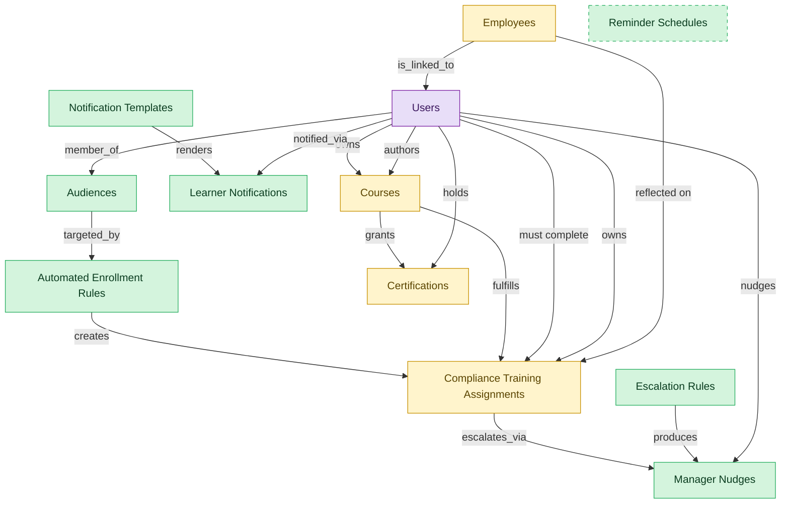

# Learning Automation

## 1. Overview

Horizontal automation surface across LMS deployment: dynamic audience segments, automated training assignment rules, reusable notification templates, learner notification log, manager-directed nudges for overdue training, and escalation policies. Cuts across LMS-COURSE-DELIVERY, LMS-COMPLIANCE-TRAINING, LMS-PATHS, and LMS-CREDENTIALS.

## 2. Entity summary

| Name | data_object | Description |
| --- | --- | --- |
| Audiences | `audiences` | Dynamic learner segments defined by attributes like department, location, and role, used by auto-enrollment and notification rules. |
| Automated Enrollment Rules | `automated_enrollment_rules` | Rule-engine entries that auto-enroll learners into courses or paths based on audience membership and lifecycle events. |
| Escalation Rules | `escalation_rules` | Policies that escalate overdue training through manager, skip-level, HR partner, or compliance officer. |
| Learner Notifications | `learner_notifications` | Log of notifications sent to learners: reminders, nudges, completions, and escalations. |
| Manager Nudges | `manager_nudges` | Reminders sent to a manager when one of their direct reports has overdue or upcoming training. |
| Notification Templates | `notification_templates` | Reusable email, in-app, and chat templates with merge fields, used by automation rules and manager reminders. |
| Reminder Schedules | `reminder_schedules` | Configured nudge cadences that drive automated reminders to learners and managers. |
| Certifications | `learner_certifications` | Credentials issued to a worker (internal, vendor, or regulatory), with issue date, expiry, issuing body, and renewal rules. Drives recertification campaigns. |
| Compliance Training Assignments | `compliance_assignments` | Mandatory training assignments tied to a regulation, role, location, or hire event, with due dates and escalation policy. |
| Courses | `courses` | Learning units such as e-learning modules, videos, live sessions, or blended programs, with format, duration, and prerequisites. |
| Employees | `employees` | Canonical records of people currently or formerly employed, carrying identity, employment metadata, and links to position, manager, and org unit. |
| Users | `users` | Platform users referenced as assignees, authors, approvers, and creators across records. |

## 3. Entities catalog

| # | data_object | canonical code | singular | plural | role | mastered in | mastered label | necessity | personal_content | entity_type | write tier | notes |
| ---: | --- | --- | --- | --- | --- | --- | --- | --- | --- | --- | --- | --- |
| 1 | `audiences` | `audiences` | Audience | Audiences | master | - | - | required | - | catalog | `:admin` | - |
| 2 | `automated_enrollment_rules` | `automated_enrollment_rules` | Automated Enrollment Rule | Automated Enrollment Rules | master | - | - | required | - | catalog | `:admin` | - |
| 3 | `escalation_rules` | `escalation_rules` | Escalation Rule | Escalation Rules | master | - | - | required | - | catalog | `:admin` | - |
| 4 | `learner_notifications` | `learner_notifications` | Learner Notification | Learner Notifications | master | - | - | required | yes | operational_record | `:manage` | - |
| 5 | `manager_nudges` | `manager_nudges` | Manager Nudge | Manager Nudges | master | - | - | required | yes | operational_workflow | `:manage` | - |
| 6 | `notification_templates` | `notification_templates` | Notification Template | Notification Templates | master | - | - | required | - | catalog | `:admin` | - |
| 7 | `reminder_schedules` | `reminder_schedules` | Reminder Schedule | Reminder Schedules | master | - | - | optional | - | catalog | `:admin` | - |
| 8 | `learner_certifications` | `learner_certifications` | Certification | Certifications | embedded_master | `lms-credentials` | Credentials, Badges and Continuing Education | required | yes | operational_workflow | `:manage` | - |
| 9 | `compliance_assignments` | `compliance_assignments` | Compliance Training Assignment | Compliance Training Assignments | embedded_master | `lms-compliance-training` | Compliance Training | required | yes | operational_workflow | `:manage` | - |
| 10 | `courses` | `courses` | Course | Courses | embedded_master | `lms-course-delivery` | Course Delivery | required | - | operational_workflow | `:manage` | - |
| 11 | `employees` | `employees` | Employee | Employees | embedded_master | `hcm-core-worker` | Core Worker Record | required | yes | operational_workflow | `:manage` | - |
| 12 | `users` | `users` | User | Users | consumer | _(platform built-in)_ | _(platform built-in)_ | required | - | operational_record | `:manage` | - |

## 4. Aliases and industry synonyms

_(none: no industry-scoped aliases for this scope)_

## 5. Relationships

### 5.1 Intra-scope edges

| from | verb | to | cardinality | kind | necessity | owner_side | delete_mode | fk_format | notes |
| --- | --- | --- | --- | --- | --- | --- | --- | --- | --- |
| `audiences` | targeted_by | `automated_enrollment_rules` | one_to_many | reference | optional | target | clear | reference | - |
| `automated_enrollment_rules` | creates | `compliance_assignments` | one_to_many | reference | optional | source | clear | reference | - |
| `notification_templates` | renders | `learner_notifications` | one_to_many | reference | optional | target | clear | reference | - |
| `compliance_assignments` | escalates_via | `manager_nudges` | one_to_many | reference | optional | target | clear | reference | - |
| `escalation_rules` | produces | `manager_nudges` | one_to_many | reference | optional | source | clear | reference | - |
| `courses` | fulfills | `compliance_assignments` | one_to_many | reference | optional | source | clear | reference | - |
| `courses` | grants | `learner_certifications` | one_to_many | reference | optional | source | clear | reference | - |
| `employees` | reflected on | `compliance_assignments` | one_to_many | reference | optional | source | clear | reference | - |

### 5.2 Built-in edges (`users` and other platform built-ins)

| from | verb | to | cardinality | necessity | owner_side | delete_mode | fk_format | notes |
| --- | --- | --- | --- | --- | --- | --- | --- | --- |
| `users` | owns | `courses` | one_to_many | optional | source | clear | reference | - |
| `users` | notified_via | `learner_notifications` | one_to_many | optional | source | clear | reference | - |
| `users` | nudges | `manager_nudges` | one_to_many | optional | source | clear | reference | - |
| `users` | member_of | `audiences` | one_to_many | optional | source | clear | reference | - |
| `employees` | is_linked_to | `users` | one_to_one | optional | target | clear | reference | - |
| `users` | authors | `courses` | one_to_many | optional | source | clear | reference | - |
| `users` | must complete | `compliance_assignments` | one_to_many | required | source | restrict | reference | - |
| `users` | owns | `compliance_assignments` | one_to_many | optional | source | clear | reference | - |
| `users` | holds | `learner_certifications` | one_to_many | required | source | restrict | reference | - |

### 5.3 Cross-scope edges

#### 5.3a Outbound from this scope's masters and contributors

_Edges this scope drives: the in-scope endpoint has `role` of `master` or `contributor`._

| from | verb | to | cardinality | necessity | delete_mode | fk_format | notes |
| --- | --- | --- | --- | --- | --- | --- | --- |
| `automated_enrollment_rules` | creates | `course_enrollments` | one_to_many | optional | none | n/a | - |
| `ad_audiences` | syncs from | `audiences` | one_to_one | optional | none | n/a | - |

#### 5.3b Context edges on embedded shells and consumed entities

_Edges the canonical owner drives, shown for context: the in-scope endpoint has `role` of `embedded_master`, `consumer`, or `derived`._

| from | verb | to | cardinality | necessity | delete_mode | fk_format | notes |
| --- | --- | --- | --- | --- | --- | --- | --- |
| `employees` | triggers | `iga_provisioning_events` | one_to_many | optional | none | n/a | - |
| `employees` | finalized by | `onboarding_document_collections` | one_to_many | optional | none | n/a | - |
| `pre_employees` | promotes to | `employees` | one_to_one | required | none (required-if-present) | n/a | - |
| `legal_holds` | identifies_custodians_from | `employees` | many_to_many | optional | none | n/a | - |
| `legal_advice_records` | references | `employees` | many_to_many | optional | none | n/a | - |
| `employees` | is host for | `host_assignments` | one_to_many | required | none (required-if-present) | n/a | - |
| `courses` | has_version | `course_versions` | one_to_many | required | ⚠ audit: required composed child out of scope | n/a | - |
| `courses` | classified_as | `course_categories` | many_to_many | optional | none | n/a | - |
| `courses` | tagged_with | `course_tags` | many_to_many | optional | none | n/a | - |
| `course_catalogs` | lists | `courses` | many_to_many | optional | none | n/a | - |
| `courses` | reviewed_via | `course_reviews` | one_to_many | optional | none | n/a | - |
| `courses` | rated_via | `course_ratings` | one_to_many | optional | none | n/a | - |
| `courses` | discussed_in | `course_discussions` | one_to_many | optional | none | n/a | - |
| `courses` | scheduled_as | `course_offerings` | one_to_many | optional | none | n/a | - |
| `certification_definitions` | instantiated_as | `learner_certifications` | one_to_many | required | none (required-if-present) | n/a | - |
| `certificate_templates` | renders | `learner_certifications` | one_to_many | optional | none | n/a | - |
| `courses` | grants | `certification_definitions` | many_to_many | optional | none | n/a | - |
| `courses` | yields_credits_via | `continuing_education_credits` | many_to_many | optional | none | n/a | - |
| `compliance_training_campaigns` | generates | `compliance_assignments` | one_to_many | required | ⚠ audit: required composed child out of scope | n/a | - |
| `compliance_assignments` | evidences | `compliance_audit_records` | one_to_many | optional | none | n/a | - |
| `compliance_assignments` | acknowledged_via | `harassment_training_acknowledgements` | one_to_many | optional | none | n/a | - |
| `compliance_assignments` | produces | `fda_part11_audit_trails` | one_to_many | optional | none | n/a | - |
| `learning_path_steps` | references | `courses` | one_to_many | optional | none | n/a | - |
| `contingent_workers` | converts_to | `employees` | one_to_one | optional | none | n/a | - |
| `merit_recommendations` | applies to | `employees` | one_to_one | optional | none | n/a | - |
| `equity_grants` | granted to | `employees` | one_to_one | optional | none | n/a | - |
| `compensation_statements` | issued to | `employees` | one_to_one | optional | none | n/a | - |
| `employees` | requests | `absence_requests` | one_to_many | optional | none | n/a | - |
| `org_units` | groups | `employees` | one_to_many | required | none (required-if-present) | n/a | - |
| `hcm_positions` | is_filled_by | `employees` | one_to_one | optional | none | n/a | - |
| `employees` | signs | `employment_contracts` | one_to_many | required | ⚠ audit: required composed child out of scope | n/a | - |
| `employees` | generates | `employment_events` | one_to_many | required | ⚠ audit: required composed child out of scope | n/a | - |
| `employees` | triggers | `asset_lifecycle_events` | one_to_many | optional | none | n/a | - |
| `employees` | holds | `skill_profiles` | one_to_one | optional | none | n/a | - |
| `employees` | triggers | `service_requests` | one_to_many | optional | none | n/a | - |
| `employees` | triggers | `pay_runs` | one_to_many | optional | none | n/a | - |
| `employees` | enrolls_in | `course_enrollments` | one_to_many | optional | none | n/a | - |
| `job_profiles` | maps_to | `courses` | many_to_many | optional | none | n/a | - |
| `employees` | becomes | `career_aspirations` | one_to_one | optional | none | n/a | - |
| `employees` | becomes | `work_shifts` | one_to_many | optional | none | n/a | - |
| `employees` | becomes | `compensation_statements` | one_to_one | optional | none | n/a | - |
| `employees` | triggers | `benefit_enrollments` | one_to_many | optional | none | n/a | - |
| `employees` | triggers | `corporate_cards` | one_to_many | optional | none | n/a | - |
| `employees` | spawns | `onboarding_journeys` | one_to_one | optional | none | n/a | - |
| `employees` | spawns | `hr_cases` | one_to_many | optional | none | n/a | - |
| `employees` | feeds | `headcount_plans` | one_to_many | optional | none | n/a | - |
| `employees` | feeds | `agency_time_entries` | one_to_many | optional | none | n/a | - |
| `employees` | onboarded by | `onboarding_journeys` | one_to_many | required | none (required-if-present) | n/a | - |
| `courses` | sequenced_into | `learning_paths` | many_to_many | optional | none | n/a | - |
| `courses` | enrolled_via | `course_enrollments` | one_to_many | required | none (required-if-present) | n/a | - |
| `skill_profiles` | updated by | `learner_certifications` | one_to_many | optional | none | n/a | - |
| `hcm_positions` | requires | `compliance_assignments` | one_to_many | optional | none | n/a | - |
| `org_units` | sponsors | `compliance_assignments` | one_to_many | optional | none | n/a | - |
| `compliance_obligations` | tracked by | `compliance_assignments` | one_to_many | optional | none | n/a | - |
| `compliance_assignments` | triggers | `iga_provisioning_events` | one_to_many | optional | none | n/a | - |
| `employees` | reflects | `learning_records` | one_to_many | optional | none | n/a | - |
| `employees` | declares | `life_events` | one_to_many | optional | none | n/a | - |
| `employees` | updated by | `life_events` | one_to_many | optional | none | n/a | - |
| `employees` | submits | `survey_responses` | one_to_many | optional | none | n/a | - |
| `employees` | flagged on | `engagement_drivers` | one_to_many | optional | none | n/a | - |
| `employees` | reflected on | `engagement_drivers` | one_to_many | optional | none | n/a | - |
| `employees` | raises | `hr_cases` | one_to_many | required | none (required-if-present) | n/a | - |
| `employees` | updated by | `hr_cases` | one_to_many | optional | none | n/a | - |
| `case_categories` | drives | `employees` | one_to_many | optional | none | n/a | - |
| `contingent_workers` | reviewed_against | `employees` | one_to_one | optional | none | n/a | - |
| `candidates` | becomes | `employees` | one_to_one | required | none (required-if-present) | n/a | - |
| `employees` | fills | `hcm_positions` | one_to_one | optional | none | n/a | - |
| `employees` | learns_via | `course_enrollments` | one_to_many | required | none (required-if-present) | n/a | - |
| `employees` | enrolls_in | `benefit_enrollments` | one_to_many | required | none (required-if-present) | n/a | - |
| `survey_campaigns` | targets | `employees` | many_to_many | optional | none | n/a | - |
| `employees` | has | `emergency_contacts` | one_to_many | required | ⚠ audit: required composed child out of scope | n/a | - |
| `employees` | has | `work_eligibility_documents` | one_to_many | required | ⚠ audit: required composed child out of scope | n/a | - |
| `employees` | has | `national_ids` | one_to_many | required | ⚠ audit: required composed child out of scope | n/a | - |
| `employees` | has | `worker_addresses` | one_to_many | required | ⚠ audit: required composed child out of scope | n/a | - |
| `employees` | has | `employee_dependents` | one_to_many | required | ⚠ audit: required composed child out of scope | n/a | - |
| `employees` | has | `worker_change_requests` | one_to_many | required | none (required-if-present) | n/a | - |
| `employees` | applies_as | `candidates` | one_to_many | optional | none | n/a | - |
| `employees` | is the worker behind | `traveler_profiles` | one_to_one | optional | none | n/a | - |
| `exit_risk_assessments` | assesses | `employees` | one_to_one | optional | none | n/a | - |
| `insider_risk_cases` | concerns | `employees` | one_to_many | optional | none | n/a | - |
| `frontline_recognitions` | recognizes | `employees` | one_to_many | required | none (required-if-present) | n/a | - |
| `advocate_profiles` | represents | `employees` | one_to_one | required | none (required-if-present) | n/a | - |

## 6. Cross-domain context

### 6.1 Master consumers (other modules / domains that embed this scope's masters)

_(none: no other module embeds this scope's masters; the canonical owners do.)_

### 6.2 Outbound handoffs (events this scope publishes)

| source module | target domain | target module | trigger_event | transition | payload | integration | friction | description |
| --- | --- | --- | --- | --- | --- | --- | --- | --- |
| LMS-COMPLIANCE-TRAINING | GRC | _(domain-level)_ | `compliance_assignment.completed` | _(lifecycle)_ | `compliance_assignments` | event_stream | low | - |
| LMS-COMPLIANCE-TRAINING | GRC | _(domain-level)_ | `compliance_assignment.due` | _(threshold)_ | `compliance_assignments` | event_stream | medium | GRC obligation tracker updates the per-employee compliance status to 'due' so the regulator-evidence dashboard reflects the impending breach risk. Drives audit-evidence reporting (e.g., Compliance Operations dashboard). |
| LMS-COMPLIANCE-TRAINING | GRC | _(domain-level)_ | `compliance_assignment.expired` | _(threshold)_ | `compliance_assignments` | event_stream | high | - |
| LMS-COMPLIANCE-TRAINING | GRC | _(domain-level)_ | `compliance_assignment.overdue` | _(threshold)_ | `compliance_assignments` | event_stream | high | Compliance training overdue is a control failure; GRC tracks obligation status, IGA may suspend high-risk access. |
| HCM-CORE-WORKER | HRSD | HRSD-CASE-MGMT | `employee.terminated` | `terminated` _(lifecycle)_ | `employees` | event_stream | medium | Termination kicks off offboarding case (exit interview, knowledge transfer, paperwork). Multiple downstream HRSD tasks created. |
| LMS-COMPLIANCE-TRAINING | HRSD | HRSD-CASE-MGMT | `compliance_assignment.due` | _(threshold)_ | `compliance_assignments` | api_call | medium | HR Service Delivery opens (or updates) an employee-facing case/task with the impending obligation, deadline, and link to the assigned course. Failure mode: when an HRSD platform isn't deployed, the nudge falls back to direct email and the in-tool reminder. |
| HCM-CORE-WORKER | IGA | IGA-ACCESS-REQUEST | `employee.created` | `created` _(lifecycle)_ | `employees` | api_call | high | New employee in HCM triggers directory account creation and birthright-role assignment in IGA. High friction because role-to-entitlement mappings drift per business unit, and IGA frequently needs additional context (cost center, manager, location) that arrives later in the journey. Same trigger event as the HCM → Onboarding and HCM → Payroll handoffs. |
| HCM-CORE-WORKER | IGA | IGA-ACCESS-REQUEST | `employee.promoted` | _(lifecycle)_ | `employees` | event_stream | high | Promotion (mover event) requires entitlement re-evaluation: add new role access, revoke prior-role access. SoD risk window during transition. |
| HCM-CORE-WORKER | IGA | IGA-ACCESS-REQUEST | `employee.terminated` | `terminated` _(lifecycle)_ | `employees` | api_call | high | Termination in HCM must immediately revoke identity access in IGA: disable account, remove group memberships, terminate app-level entitlements. Failure modes: contractor terminations not flowing (different HCM table); rehires confuse the de-provisioning idempotency; access lingers after termination is the canonical audit finding. |
| LMS-COMPLIANCE-TRAINING | IGA | IGA-AUTO-PROVISIONING | `compliance_assignment.expired` | _(threshold)_ | `compliance_assignments` | api_call | high | - |
| LMS-COMPLIANCE-TRAINING | IGA | IGA-AUTO-PROVISIONING | `compliance_assignment.overdue` | _(threshold)_ | `compliance_assignments` | api_call | high | Severe overdue (PCI, HIPAA, SOX-relevant) may auto-suspend system access pending completion. Alert-without-feedback-loop common. |
| LMS-CREDENTIALS | IGA | IGA-AUTO-PROVISIONING | `learner_certification.expired` | _(threshold)_ | `learner_certifications` | api_call | high | - |
| LMS-CREDENTIALS | IGA | IGA-AUTO-PROVISIONING | `learner_certification.renewed` | _(lifecycle)_ | `learner_certifications` | api_call | medium | - |
| LMS-CREDENTIALS | IGA | IGA-AUTO-PROVISIONING | `learner_certification.revoked` | _(lifecycle)_ | `learner_certifications` | api_call | high | - |
| HCM-CORE-WORKER | HCM | HCM-LIFECYCLE-WORKFLOWS | `employee.created` | `created` _(lifecycle)_ | `employees` | lifecycle_progression | low | New worker record surfaces in self-service: manager dashboard, new-hire welcome surface, lifecycle task inbox. In-process state read; no message bus. |
| HCM-CORE-WORKER | HCM | HCM-LIFECYCLE-WORKFLOWS | `employee.terminated` | `terminated` _(lifecycle)_ | `employees` | lifecycle_progression | low | Termination drives the offboarding self-service flow: exit-interview prompt, equipment-return task, knowledge-handoff surfaces in the lifecycle workflow module. |
| LMS-COMPLIANCE-TRAINING | HCM | HCM-LIFECYCLE-WORKFLOWS | `compliance_assignment.due` | _(threshold)_ | `compliance_assignments` | event_stream | medium | Compliance assignment due-date nudges to HCM-mastered manager/employee record. HCM surfaces the impending obligation on the employee profile and routes a reminder to the line manager. |
| HCM-CORE-WORKER | PAYROLL | PAYROLL-RUN | `employee.created` | `created` _(lifecycle)_ | `employees` | api_call | medium | New employee in HCM triggers comp profile activation in Payroll: gross-to-net rules selected by jurisdiction, deductions initialised, bank account and tax setup collected via Onboarding flow. Same trigger event as the HCM → Onboarding handoff; both subscribe to the employee.created event. |
| HCM-CORE-WORKER | PAYROLL | PAYROLL-RUN | `employee.promoted` | _(lifecycle)_ | `employees` | event_stream | medium | Promotion typically includes salary change. Effective-dated change must flow to PAYROLL with retroactive handling. |
| HCM-CORE-WORKER | PAYROLL | PAYROLL-RUN | `employee.terminated` | `terminated` _(lifecycle)_ | `employees` | event_stream | high | Termination drives final pay (severance, accrued PTO payout, prorated bonus). Cross-vendor stack when HCM and PAYROLL are different vendors; retro-adjustments are common. |
| LMS-AUTOMATION | LMS | LMS-COURSE-DELIVERY | `automated_enrollment_rule.activated` | _(lifecycle)_ | `automated_enrollment_rules` | lifecycle_progression | low | - |
| LMS-AUTOMATION | LMS | LMS-COMPLIANCE-TRAINING | `automated_enrollment_rule.activated` | _(lifecycle)_ | `automated_enrollment_rules` | lifecycle_progression | low | - |
| HCM-CORE-WORKER | TALENT-MGMT | TALENT-PERFORMANCE-MGMT | `employee.created` | `created` _(lifecycle)_ | `employees` | api_call | low | New employee triggers talent-profile initialisation in Talent Management: career aspirations, mobility preferences, skills profile stubs. Same employee.created trigger as Onboarding / Payroll / IGA handoffs. |
| HCM-CORE-WORKER | TALENT-MGMT | TALENT-PERFORMANCE-MGMT | `employee.promoted` | _(lifecycle)_ | `employees` | event_stream | low | Promotion updates succession-plan slots and 9-box placement context. |
| HCM-CORE-WORKER | WFM | _(domain-level)_ | `employee.created` | `created` _(lifecycle)_ | `employees` | event_stream | low | New employee provisioned in HCM becomes a schedulable resource in WFM - identity, position, base FTE. Mid-shift onboarding and badge-binding are typical edge cases. |
| HCM-CORE-WORKER | COMP-MGMT | COMP-PLANNING | `employee.created` | `created` _(lifecycle)_ | `employees` | event_stream | low | New-hire creation provides compensation basis. Bands and grades attach via job profile. |
| HCM-CORE-WORKER | COMP-MGMT | COMP-PLANNING | `employee.promoted` | _(lifecycle)_ | `employees` | event_stream | low | Promotion event triggers off-cycle compensation review (eligibility, band placement, increase recommendation) in COMP-MGMT. |
| HCM-CORE-WORKER | BEN-ADMIN | BEN-ENROLLMENT | `employee.created` | `created` _(lifecycle)_ | `employees` | event_stream | medium | New-hire creation seeds benefits eligibility (waiting periods, default elections). Drives carrier feed setup at end of new-hire window. |
| HCM-CORE-WORKER | BEN-ADMIN | BEN-ENROLLMENT | `employee.terminated` | `terminated` _(lifecycle)_ | `employees` | event_stream | high | Termination triggers benefits termination, COBRA / equivalent notices, and dependent coverage decisions. Late notifications cause coverage gaps. |
| HCM-CORE-WORKER | EXPENSE | _(domain-level)_ | `employee.terminated` | `terminated` _(lifecycle)_ | `employees` | event_stream | medium | Termination triggers EXPENSE corporate-card deactivation and outstanding-report close-out. |
| HCM-CORE-WORKER | PSA | PSA-PROJECT-DELIVERY | `employee.terminated` | `terminated` _(lifecycle)_ | `employees` | event_stream | medium | Terminated employee may be the assignee on open project_tasks. PROJECT-DELIVERY needs to surface affected tasks for reassignment or completion handover. |
| HCM-CORE-WORKER | PSA | PSA-RESOURCE-MGMT | `attrition_risk.high` | _(state_change)_ | `employees` | event_stream | high | ML attrition score crosses high threshold. PSA resource managers may proactively rebalance assignments away from at-risk consultants on critical engagements. High friction: probabilistic→deterministic pattern (score requires judgment call), false-positive volume can swamp the staffing queue. |
| HCM-CORE-WORKER | PSA | PSA-RESOURCE-MGMT | `employee.created` | `created` _(lifecycle)_ | `employees` | event_stream | low | New consultant hired. PSA resource pool adds the employee as available capacity; skill inventory record is seeded for downstream certifications. |
| HCM-CORE-WORKER | PSA | PSA-RESOURCE-MGMT | `employee.promoted` | _(lifecycle)_ | `employees` | event_stream | low | Consultant promoted (level / job profile change). PSA reevaluates billable rate band and skill inventory; existing project_assignments may need rate revision. |
| HCM-CORE-WORKER | PSA | PSA-RESOURCE-MGMT | `employee.terminated` | `terminated` _(lifecycle)_ | `employees` | event_stream | medium | Consultant terminated. PSA must release any active project_assignments, return capacity to bench and re-allocate forecast. Medium friction: leaver-event timing varies (immediate vs notice period) and active assignments may need urgent rebalancing. |
| LMS-COURSE-DELIVERY | SKILLS-MGMT | SKILLS-MGMT-PROFILE | `course.published` | _(lifecycle)_ | `courses` | lifecycle_progression | low | - |

### 6.3 Inbound handoffs (events this scope reacts to)

| target module | source domain | source module | trigger_event | transition | payload | integration | friction | description |
| --- | --- | --- | --- | --- | --- | --- | --- | --- |
| HCM-CORE-WORKER | ATS | ATS-CANDIDATE-CRM | `candidate.hired` | `hired` _(lifecycle)_ | `employees` | event_stream | medium | Candidate-to-employee conversion: hired candidate from ATS triggers employee-record creation in HCM. Field mapping (candidate → employee) is rarely perfect; missing fields (legal name spelling, work-eligibility detail, tax IDs) get collected in the Onboarding journey and back-filled into HCM. |
| HCM-CORE-WORKER | COMP-MGMT | COMP-PLANNING | `merit_cycle.approved` | `approved` _(state_change)_ | `employees` | event_stream | low | Cycle-close pay-rate changes post to the worker record (base salary, bonus target, equity guideline). |
| HCM-CORE-WORKER | EMP-EXP | EMP-EXP-CONTINUOUS-LISTEN | `attrition_risk.high` | _(state_change)_ | `employees` | api_call | high | Attrition-risk inference from engagement signals surfaces to managers via HCM dashboards. Probabilistic-signal → deterministic-action pattern: a risk score is not a directive; intervention is gated by manager judgment, data-privacy rules (anonymity floor), and DEI-bias concerns. |
| HCM-CORE-WORKER | PA | PA-PREDICTIVE-MODELS | `attrition_risk.high` | _(state_change)_ | `employees` | event_stream | high | Flight-risk score flagged on employee; HR-business-partner motion required. Probabilistic-signal-to-deterministic-action friction shape; false-positive volume drives mistrust. |
| HCM-CORE-WORKER | MDM | _(domain-level)_ | `employee_golden_record.created` | `active` _(lifecycle)_ | `employees` | api_call | medium | Resolved identity → HCM links operational HR record. |
| LMS-AUTOMATION | LMS | LMS-COMPLIANCE-TRAINING | `compliance_assignment.overdue` | _(threshold)_ | `compliance_assignments` | lifecycle_progression | low | - |

### 6.4 Master providers (modules / domains that own masters this scope embeds)

| data_object | role here | necessity | canonical owner(s) | slice notes |
| --- | --- | --- | --- | --- |
| `compliance_assignments` | embedded_master | required | LMS-COMPLIANCE-TRAINING (LMS) | - |
| `courses` | embedded_master | required | LMS-COURSE-DELIVERY (LMS) | - |
| `employees` | embedded_master | required | HCM-CORE-WORKER (HCM) | - |
| `learner_certifications` | embedded_master | required | LMS-CREDENTIALS (LMS) | - |
| `users` | consumer | required | _(platform built-in)_ | - |

## 7. Lifecycle states

### `automated_enrollment_rules` (Automated Enrollment Rule)

| order | state_name | initial? | terminal? | requires_permission? | derived gate | description |
| --- | --- | --- | --- | --- | --- | --- |
| 1 | `draft` | ✓ | - | - | - | - |
| 2 | `active` | - | - | ✓ | `lms-automation:activate` | - |
| 3 | `paused` | - | - | ✓ | `lms-automation:pause` | - |
| 4 | `archived` | - | ✓ | ✓ | `lms-automation:archive` | - |

### `compliance_assignments` (Compliance Training Assignment)

_This scope holds `compliance_assignments` as **embedded_master**; the canonical state machine is owned by `LMS-COMPLIANCE-TRAINING`._

| order | state_name | initial? | terminal? | requires_permission? | derived gate | description |
| --- | --- | --- | --- | --- | --- | --- |
| 1 | `assigned` | ✓ | - | - | - | Mandatory training assignment created for a learner with due date. |
| 2 | `in_progress` | - | - | - | - | Learner has started the underlying course or activity. |
| 3 | `completed` | - | ✓ | ✓ | `lms-automation:complete` | Learner finished the assignment within the due window. |
| 4 | `overdue` | - | - | - | - | Due date passed without completion and escalation policy engaged. |
| 5 | `waived` | - | ✓ | ✓ | `lms-automation:waive` | Assignment formally waived by compliance owner with audit reason. |
| 6 | `expired` | - | ✓ | ✓ | `lms-automation:expire` | Assignment closed unmet at the regulatory deadline. |

### `courses` (Course)

_This scope holds `courses` as **embedded_master**; the canonical state machine is owned by `LMS-COURSE-DELIVERY`._

| order | state_name | initial? | terminal? | requires_permission? | derived gate | description |
| --- | --- | --- | --- | --- | --- | --- |
| 1 | `draft` | ✓ | - | - | - | Course being authored by an instructional designer or SME. |
| 2 | `in_review` | - | - | - | - | Content under review by L&D or compliance reviewers. |
| 3 | `published` | - | - | ✓ | `lms-automation:publish` | Course released to the catalog and available for enrollment. |
| 4 | `retired` | - | ✓ | ✓ | `lms-automation:retire` | Course removed from the catalog and kept for historical transcripts. |

### `employees` (Employee)

_This scope holds `employees` as **embedded_master**; the canonical state machine is owned by `HCM-CORE-WORKER`._

| order | state_name | initial? | terminal? | requires_permission? | derived gate | description |
| --- | --- | --- | --- | --- | --- | --- |
| 1 | `draft` | ✓ | - | - | - | Pre-hire stub created during requisition or onboarding handoff; not yet a worker of record. |
| 2 | `active` | - | - | ✓ | `lms-automation:active_employee` | Worker is currently employed and appears in headcount, payroll eligibility, and directory feeds. |
| 3 | `on_leave` | - | - | ✓ | `lms-automation:on_leave_employee` | Employee is on approved leave (parental, medical, sabbatical); active record but suppressed from some downstream feeds. |
| 4 | `suspended` | - | - | ✓ | `lms-automation:suspended_employee` | Employment temporarily halted (investigation, disciplinary); pay and access may be paused. |
| 5 | `terminated` | - | ✓ | ✓ | `lms-automation:terminated_employee` | Employment ended (voluntary or involuntary); final pay processed, access deprovisioned. |

### `escalation_rules` (Escalation Rule)

| order | state_name | initial? | terminal? | requires_permission? | derived gate | description |
| --- | --- | --- | --- | --- | --- | --- |
| 1 | `draft` | ✓ | - | - | - | - |
| 2 | `active` | - | - | ✓ | `lms-automation:activate` | - |
| 3 | `paused` | - | - | ✓ | `lms-automation:pause` | - |
| 4 | `archived` | - | ✓ | ✓ | `lms-automation:archive` | - |

### `learner_certifications` (Certification)

_This scope holds `learner_certifications` as **embedded_master**; the canonical state machine is owned by `LMS-CREDENTIALS`._

| order | state_name | initial? | terminal? | requires_permission? | derived gate | description |
| --- | --- | --- | --- | --- | --- | --- |
| 1 | `issued` | ✓ | - | ✓ | `lms-automation:issue` | Credential awarded to the learner with issue and expiry dates. |
| 2 | `active` | - | - | - | - | Credential in force and valid for compliance or role requirements. |
| 3 | `renewing` | - | - | - | - | Recertification campaign engaged before expiry. |
| 4 | `renewed` | - | - | ✓ | `lms-automation:renew` | Credential renewed with a fresh validity window. |
| 5 | `expired` | - | ✓ | - | - | Credential past its expiry date and no longer valid. |
| 6 | `revoked` | - | ✓ | ✓ | `lms-automation:revoke` | Credential withdrawn by the issuing body or L&D for cause. |

### `learner_notifications` (Learner Notification)

| order | state_name | initial? | terminal? | requires_permission? | derived gate | description |
| --- | --- | --- | --- | --- | --- | --- |
| 1 | `queued` | ✓ | - | - | - | - |
| 2 | `sent` | - | - | ✓ | `lms-automation:send` | - |
| 3 | `delivered` | - | ✓ | - | - | - |
| 4 | `failed` | - | ✓ | - | - | - |

### `manager_nudges` (Manager Nudge)

| order | state_name | initial? | terminal? | requires_permission? | derived gate | description |
| --- | --- | --- | --- | --- | --- | --- |
| 1 | `pending` | ✓ | - | - | - | - |
| 2 | `sent` | - | - | ✓ | `lms-automation:send` | - |
| 3 | `acknowledged` | - | ✓ | - | - | - |
| 4 | `dismissed` | - | ✓ | - | - | - |

## 8. Permissions and business rules (derived)

### 8.1 Permissions

| permission | tier | description | included in `:admin`? |
| --- | --- | --- | --- |
| `lms-automation:read` | baseline-read | Read access to every entity in the module | ✓ |
| `lms-automation:manage` | baseline-manage | Edit operational records | ✓ |
| `lms-automation:admin` | baseline-admin | Edit reference data and inherit every workflow gate below | - |
| `lms-automation:active_employee` | workflow-gate (lifecycle) | Transition `employees` into state `active` | ✓ |
| `lms-automation:on_leave_employee` | workflow-gate (lifecycle) | Transition `employees` into state `on_leave` | ✓ |
| `lms-automation:suspended_employee` | workflow-gate (lifecycle) | Transition `employees` into state `suspended` | ✓ |
| `lms-automation:terminated_employee` | workflow-gate (lifecycle) | Transition `employees` into state `terminated` | ✓ |
| `lms-automation:publish` | workflow-gate (lifecycle) | Transition `courses` into state `published` | ✓ |
| `lms-automation:retire` | workflow-gate (lifecycle) | Transition `courses` into state `retired` | ✓ |
| `lms-automation:issue` | workflow-gate (lifecycle) | Transition `learner_certifications` into state `issued` | ✓ |
| `lms-automation:renew` | workflow-gate (lifecycle) | Transition `learner_certifications` into state `renewed` | ✓ |
| `lms-automation:revoke` | workflow-gate (lifecycle) | Transition `learner_certifications` into state `revoked` | ✓ |
| `lms-automation:complete` | workflow-gate (lifecycle) | Transition `compliance_assignments` into state `completed` | ✓ |
| `lms-automation:waive` | workflow-gate (lifecycle) | Transition `compliance_assignments` into state `waived` | ✓ |
| `lms-automation:expire` | workflow-gate (lifecycle) | Transition `compliance_assignments` into state `expired` | ✓ |
| `lms-automation:activate` | workflow-gate (lifecycle) | Transition `automated_enrollment_rules` into state `active` | ✓ |
| `lms-automation:pause` | workflow-gate (lifecycle) | Transition `automated_enrollment_rules` into state `paused` | ✓ |
| `lms-automation:archive` | workflow-gate (lifecycle) | Transition `automated_enrollment_rules` into state `archived` | ✓ |
| `lms-automation:send` | workflow-gate (lifecycle) | Transition `learner_notifications` into state `sent` | ✓ |
| `lms-automation:view_all_learner_notifications` | override (personal_content) | View all `learner_notifications` rows beyond row-scope | ✓ |
| `lms-automation:manage_all_learner_notifications` | override (personal_content) | Manage all `learner_notifications` rows beyond row-scope | ✓ |
| `lms-automation:view_all_manager_nudges` | override (personal_content) | View all `manager_nudges` rows beyond row-scope | ✓ |
| `lms-automation:manage_all_manager_nudges` | override (personal_content) | Manage all `manager_nudges` rows beyond row-scope | ✓ |
| `lms-automation:view_all_employees` | override (personal_content) | View all `employees` rows beyond row-scope | ✓ |
| `lms-automation:manage_all_employees` | override (personal_content) | Manage all `employees` rows beyond row-scope | ✓ |
| `lms-automation:view_all_compliance_training_assignments` | override (personal_content) | View all `compliance_assignments` rows beyond row-scope | ✓ |
| `lms-automation:manage_all_compliance_training_assignments` | override (personal_content) | Manage all `compliance_assignments` rows beyond row-scope | ✓ |
| `lms-automation:view_all_certifications` | override (personal_content) | View all `learner_certifications` rows beyond row-scope | ✓ |
| `lms-automation:manage_all_certifications` | override (personal_content) | Manage all `learner_certifications` rows beyond row-scope | ✓ |

### 8.2 Business rules

| rule_name | data_object | source flag | intent |
| --- | --- | --- | --- |
| `learner_notification_edit_scope` | `learner_notifications` | has_personal_content | Row-scope by default; override via `lms-automation:view_all_learner_notifications` / `lms-automation:manage_all_learner_notifications` |
| `manager_nudge_edit_scope` | `manager_nudges` | has_personal_content | Row-scope by default; override via `lms-automation:view_all_manager_nudges` / `lms-automation:manage_all_manager_nudges` |
| `employee_edit_scope` | `employees` | has_personal_content | Row-scope by default; override via `lms-automation:view_all_employees` / `lms-automation:manage_all_employees` |
| `compliance_training_assignment_edit_scope` | `compliance_assignments` | has_personal_content | Row-scope by default; override via `lms-automation:view_all_compliance_training_assignments` / `lms-automation:manage_all_compliance_training_assignments` |
| `certification_edit_scope` | `learner_certifications` | has_personal_content | Row-scope by default; override via `lms-automation:view_all_certifications` / `lms-automation:manage_all_certifications` |

## 9. Roles, RACI, and responsibilities (derived)

_Baseline roles, the permission hierarchy, and RACI realization are DERIVED from this scope's entity-type write tiers + `process_raci`; none of it is stored in the catalog (the deployer provisions it from this blueprint)._

### 9.1 `LMS-AUTOMATION`

**Baseline roles:**

| role | baseline grant |
| --- | --- |
| `lms-automation_viewer` | `lms-automation:read` |
| `lms-automation_manager` | `lms-automation:manage` |
| `lms-automation_admin` | `lms-automation:admin` |

**Permission hierarchy:**

| permission | includes |
| --- | --- |
| `lms-automation:admin` | `lms-automation:manage` |
| `lms-automation:manage` | `lms-automation:read` |
| `lms-automation:admin` | `lms-automation:active_employee` |
| `lms-automation:admin` | `lms-automation:on_leave_employee` |
| `lms-automation:admin` | `lms-automation:suspended_employee` |
| `lms-automation:admin` | `lms-automation:terminated_employee` |
| `lms-automation:admin` | `lms-automation:publish` |
| `lms-automation:admin` | `lms-automation:retire` |
| `lms-automation:admin` | `lms-automation:issue` |
| `lms-automation:admin` | `lms-automation:renew` |
| `lms-automation:admin` | `lms-automation:revoke` |
| `lms-automation:admin` | `lms-automation:complete` |
| `lms-automation:admin` | `lms-automation:waive` |
| `lms-automation:admin` | `lms-automation:expire` |
| `lms-automation:admin` | `lms-automation:activate` |
| `lms-automation:admin` | `lms-automation:pause` |
| `lms-automation:admin` | `lms-automation:archive` |
| `lms-automation:admin` | `lms-automation:send` |
| `lms-automation:admin` | `lms-automation:view_all_learner_notifications` |
| `lms-automation:admin` | `lms-automation:manage_all_learner_notifications` |
| `lms-automation:admin` | `lms-automation:view_all_manager_nudges` |
| `lms-automation:admin` | `lms-automation:manage_all_manager_nudges` |
| `lms-automation:admin` | `lms-automation:view_all_employees` |
| `lms-automation:admin` | `lms-automation:manage_all_employees` |
| `lms-automation:admin` | `lms-automation:view_all_compliance_training_assignments` |
| `lms-automation:admin` | `lms-automation:manage_all_compliance_training_assignments` |
| `lms-automation:admin` | `lms-automation:view_all_certifications` |
| `lms-automation:admin` | `lms-automation:manage_all_certifications` |

**Processes wired:**

| process_key | process_name | PCF code | PCF ID | level | description |
| --- | --- | --- | --- | --- | --- |
| `manage_maintain_employee_data` | Manage and maintain employee data | 7.7.3 | 10524 | 3 | Capturing and updating employee information and data and information on the employees. |
| `manage_leave_absence` | Manage leave of absence | 7.6.2.2 | 10515 | 4 | Managing the period of time that an employee must be away from their primary job, while maintaining the status of employee (i.e., paid and unpaid leave of absence but not vacations, holidays, hiatuses, sabbaticals, and work-from-home programs). |
| `manage_separation` | Manage separation | 7.6.2 | 10513 | 3 | Managing the process of employee separation, including leaves of absence, resignations, discharges, and layoffs. Inform the employee of the termination. Complete paperwork for continuation of benefits. Enter employment status change into system. |
| `develop_conduct_manage_employee` | Develop, conduct, and manage employee training programs | 7.3.4.5 | 10493 | 4 | Creating, implementing, and managing the programs for training employees. Create and design sessions on the basis of the needs and the availability of the skills. Conduct the sessions in person or virtually. Manage all aspects related to the training programs. Consider including literacy training, interpersonal skills training, technical training, problem-solving training, diversity or sensitivity training, etc. |
| `manage_examinations` | Manage examinations and certifications | 7.3.4.6 | 20125 | 4 | Managing identified training programs for employees. Engage with industries to provide certifications, administer certification test, and maintain active certification. |
| `train_employees_appropriate` | Train employees on appropriate regulatory requirements | 2.1.3.5.1 | 12772 | 5 | Conducting training and impart learning to existing and new employees. Training will relate to the most recent/enforced regulations of the business to meet Manage regulatory requirements [12771]. |

**RACI realization:**

| actor | kind | raci | process_key | realization |
| --- | --- | --- | --- | --- |
| `HR-PEOPLE-OPS-SPECIALIST` | persona | responsible | `manage_maintain_employee_data` | grant gates [lms-automation:active_employee] + the gated entities' write tier |
| `HR-BUSINESS-PARTNER` | persona | accountable | `manage_maintain_employee_data` | approval gate |
| `HR-HRIS-ADMIN` | persona | consulted | `manage_maintain_employee_data` | advisory read grant |
| `PEOPLE-MANAGER` | persona | informed | `manage_maintain_employee_data` | notification side effect (trigger_event / webhook_receiver) |
| `HR-PEOPLE-OPS-SPECIALIST` | persona | responsible | `manage_leave_absence` | grant gates [lms-automation:on_leave_employee] + the gated entities' write tier |
| `PEOPLE-MANAGER` | persona | accountable | `manage_leave_absence` | approval gate |
| `HR-BUSINESS-PARTNER` | persona | consulted | `manage_leave_absence` | blocking consultation state |
| `HR-HRIS-ADMIN` | persona | informed | `manage_leave_absence` | notification side effect (trigger_event / webhook_receiver) |
| `HR-PEOPLE-OPS-SPECIALIST` | persona | responsible | `manage_separation` | grant gates [lms-automation:terminated_employee] + the gated entities' write tier |
| `HR-BUSINESS-PARTNER` | persona | accountable | `manage_separation` | approval gate |
| `PEOPLE-MANAGER` | persona | consulted | `manage_separation` | advisory read grant |
| `HR-HRIS-ADMIN` | persona | informed | `manage_separation` | notification side effect (trigger_event / webhook_receiver) |
| `LD-INSTRUCTIONAL-DESIGNER` | persona | responsible | `develop_conduct_manage_employee` | grant gates [lms-automation:publish] + the gated entities' write tier |
| `LD-LEARNING-ADMIN` | persona | accountable | `develop_conduct_manage_employee` | approval gate |
| `LD-INSTRUCTOR` | persona | consulted | `develop_conduct_manage_employee` | advisory read grant |
| `PEOPLE-MANAGER` | persona | informed | `develop_conduct_manage_employee` | notification side effect (trigger_event / webhook_receiver) |
| `LD-LEARNING-ADMIN` | persona | responsible | `manage_examinations` | grant gates [lms-automation:issue] + the gated entities' write tier |
| `GRC-COMPLIANCE-TRAINING-MANAGER` | persona | accountable | `manage_examinations` | approval gate |
| `LD-INSTRUCTOR` | persona | consulted | `manage_examinations` | advisory read grant |
| `GRC-COMPLIANCE-TRAINING-MANAGER` | persona | responsible | `train_employees_appropriate` | grant gates [lms-automation:complete] + the gated entities' write tier |
| `GRC-COMPLIANCE-TRAINING-MANAGER` | persona | accountable | `train_employees_appropriate` | approval gate |
| `PEOPLE-MANAGER` | persona | consulted | `train_employees_appropriate` | advisory read grant |
| `LEGAL-COMPLIANCE-SPECIALIST` | persona | informed | `train_employees_appropriate` | notification side effect (trigger_event / webhook_receiver) |

### 9.2 Functional ownership and default grants

| responsibility | business function | default role | default tier |
| --- | --- | --- | --- |
| owner | Learning and Development | `admin` | `:admin` |
| contributor | Governance, Risk and Compliance | `manage` | `:manage` |
| contributor | Legal | `manage` | `:manage` |
| consumer | Manufacturing Operations | `read` | `:read` |
| consumer | Sales | `read` | `:read` |
| consumer | Software Engineering | `read` | `:read` |
