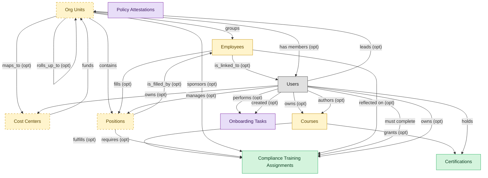

# Compliance Training

## 1. Overview

Mandatory regulatory training assignment, tracking, and certification: sexual harassment training (CA SB-1343), HIPAA, OSHA, anti-bribery, SOX, GDPR, AML. Masters `compliance_assignments` and `learner_certifications`. Realizes COMPLIANCE-TRAIN and CERT-MGMT. Distinct from general LMS course delivery: assignments are mandatory and time-bound, lifecycle includes `overdue`/`waived`/`expired` states with regulator-evidence retention, and ownership typically sits with GRC/Compliance, not L&D.

## 2. Entity summary

| Name | Description |
| --- | --- |
| Certifications | Issued credential against a worker (internal certification, vendor cert, regulatory cert) with issue date, expiry, issuing body, and renewal rules. Drives recertification campaigns. |
| Compliance Training Assignments | Mandatory training assignment tied to a regulation, role, location, or hire-event (anti-harassment, AML, GDPR, OSHA, HIPAA). Carries due date, escalation policy, audit log. |
| Cost Centers | Organisational unit for cost allocation: name, code, manager, hierarchy, currency. Drives variance reporting and project / departmental P&L. A near-universal foreign key in finance and payroll. |
| Courses | Atomic learning unit: e-learning module, video, live session, blended programme, external content. Carries content reference, duration, format, language, prerequisites, certification award. |
| Employees | Canonical record of a person currently or formerly employed by the organization. Carries identity (legal name, contact, IDs), employment metadata (start date, end date, employment type, country), and pointers to position, job profile, org unit, manager, and life-event history. The most multi-mastered data object in the catalog: HCM masters the core HR slice, Payroll masters the comp/withholding slice, and IGA masters the identity/access slice. Onboarding, PA, and Talent Management consume or contribute. |
| Org Units | Node in the organizational hierarchy: division, business unit, department, team. Carries manager, cost center alignment, geographic scope, and parent/child relationships. HCM masters the operational hierarchy; EPM contributes the cost-center mapping (which would be Finance-mastered once a Finance/GL domain is loaded). |
| Positions | Approved slot in the org - a 'chair' with role definition, cost center, reporting line, location, and FTE allocation. Distinct from job_profiles (the catalog definition) and from employees (the person filling the slot). A position can be open, filled, or eliminated. SWP designs future positions via org_designs; HCM operationalizes them once approved. |
| Onboarding Tasks | Discrete to-do within a journey: sign I-9, attend orientation, complete compliance training, meet buddy, receive laptop. Carries assignee (new hire / manager / IT / facilities / HR), due date, completion state, evidence, and task type (form / training / meeting / provisioning / acknowledgement). Many tasks are local; a subset triggers cross-domain handoffs into ITSM, IWMS, Payroll, LMS, IGA, or HRSD. |
| Policy Attestations | Record that a user read, understood, and acknowledged a policy; timestamp, version, medium, completion evidence. |

## 3. Entities catalog

| # | data_object | role | mastered in | necessity | pattern flags | notes |
| ---: | --- | --- | --- | --- | --- | --- |
| 1 | `learner_certifications` (Certifications) | master | - | required | personal_content | - |
| 2 | `compliance_assignments` (Compliance Training Assignments) | master | - | required | - | - |
| 3 | `cost_centers` (Cost Centers) | embedded_master | `ERP-FIN` _(domain-level, not modularized)_ | optional | - | - |
| 4 | `courses` (Courses) | embedded_master | `lms-course-delivery` | required | - | - |
| 5 | `employees` (Employees) | embedded_master | `hcm-core-worker` | required | personal_content | - |
| 6 | `org_units` (Org Units) | embedded_master | `hcm-org-positions` | optional | - | - |
| 7 | `hcm_positions` (Positions) | embedded_master | `hcm-org-positions` | optional | single_approver | - |
| 8 | `onboarding_tasks` (Onboarding Tasks) | consumer | `onb-journey-mgmt` | required | personal_content | - |
| 9 | `policy_attestations` (Policy Attestations) | consumer | `GRC` _(domain-level, not modularized)_ | required | - | - |

## 4. Aliases and industry synonyms

_(no industry-scoped aliases or non-synonym alias types loaded for this scope; generic synonyms are omitted as common knowledge.)_

## 5. Relationships

### 5.1 Intra-scope edges

| from | verb | to | cardinality | kind | necessity | owner_side | notes |
| --- | --- | --- | --- | --- | --- | --- | --- |
| `org_units` | groups | `employees` | one_to_many | reference | required | source | - |
| `org_units` | contains | `hcm_positions` | one_to_many | reference | required | source | - |
| `hcm_positions` | is_filled_by | `employees` | one_to_one | reference | optional | target | - |
| `cost_centers` | funds | `org_units` | one_to_many | reference | required | source | - |
| `org_units` | maps_to | `cost_centers` | one_to_one | reference | optional | source | - |
| `courses` | fulfills | `compliance_assignments` | one_to_many | reference | optional | source | - |
| `courses` | grants | `learner_certifications` | one_to_many | reference | optional | source | - |
| `hcm_positions` | requires | `compliance_assignments` | one_to_many | reference | optional | source | - |
| `org_units` | sponsors | `compliance_assignments` | one_to_many | reference | optional | source | - |
| `employees` | reflected on | `compliance_assignments` | one_to_many | reference | optional | source | - |
| `employees` | fills | `hcm_positions` | one_to_one | reference | optional | source | - |
| `org_units` | rolls_up_to | `org_units` | one_to_many | reference | optional | source | - |

### 5.2 Built-in edges (`users` and other platform built-ins)

| from | verb | to | cardinality | necessity | owner_side | notes |
| --- | --- | --- | --- | --- | --- | --- |
| `users` | owns | `courses` | one_to_many | optional | source | - |
| `employees` | is_linked_to | `users` | one_to_one | optional | target | - |
| `users` | manages | `hcm_positions` | one_to_many | optional | source | - |
| `users` | leads | `org_units` | one_to_many | optional | source | - |
| `users` | owns | `cost_centers` | one_to_many | optional | source | - |
| `users` | performs | `onboarding_tasks` | one_to_many | optional | source | - |
| `users` | created | `onboarding_tasks` | one_to_many | optional | source | - |
| `users` | authors | `courses` | one_to_many | optional | source | - |
| `users` | must complete | `compliance_assignments` | one_to_many | required | source | - |
| `users` | owns | `compliance_assignments` | one_to_many | optional | source | - |
| `users` | holds | `learner_certifications` | one_to_many | required | source | - |
| `org_units` | has members | `users` | one_to_many | optional | target | - |

### 5.3 Cross-scope edges

| from | verb | to | cardinality | necessity | notes |
| --- | --- | --- | --- | --- | --- |
| `employees` | triggers | `iga_provisioning_events` | one_to_many | optional | - |
| `employees` | finalized by | `onboarding_document_collections` | one_to_many | optional | - |
| `pre_employees` | promotes to | `employees` | one_to_one | required | - |
| `legal_holds` | identifies_custodians_from | `employees` | many_to_many | optional | - |
| `legal_advice_records` | references | `employees` | many_to_many | optional | - |
| `employees` | is host for | `host_assignments` | one_to_many | required | - |
| `job_profiles` | defines | `hcm_positions` | one_to_many | required | - |
| `employees` | signs | `employment_contracts` | one_to_many | required | - |
| `employees` | generates | `employment_events` | one_to_many | required | - |
| `employees` | triggers | `asset_lifecycle_events` | one_to_many | optional | - |
| `employees` | requests | `absence_requests` | one_to_many | optional | - |
| `employees` | holds | `skill_profiles` | one_to_one | optional | - |
| `org_units` | engages | `contingent_workers` | one_to_many | optional | - |
| `org_units` | is_scored_by | `engagement_drivers` | one_to_many | optional | - |
| `org_units` | is_measured_by | `people_kpis` | one_to_many | optional | - |
| `employees` | triggers | `service_requests` | one_to_many | optional | - |
| `org_units` | triggers | `iga_entitlement_definitions` | one_to_many | optional | - |
| `employees` | triggers | `pay_runs` | one_to_many | optional | - |
| `hcm_positions` | spawns | `job_requisitions` | one_to_many | optional | - |
| `employees` | enrolls_in | `course_enrollments` | one_to_many | optional | - |
| `job_profiles` | maps_to | `courses` | many_to_many | optional | - |
| `employees` | becomes | `career_aspirations` | one_to_one | optional | - |
| `employees` | becomes | `work_shifts` | one_to_many | optional | - |
| `employees` | becomes | `compensation_statements` | one_to_one | optional | - |
| `salary_bands` | anchors | `hcm_positions` | one_to_many | optional | - |
| `employees` | triggers | `benefit_enrollments` | one_to_many | optional | - |
| `employees` | triggers | `corporate_cards` | one_to_many | optional | - |
| `employees` | spawns | `onboarding_journeys` | one_to_one | optional | - |
| `employees` | spawns | `hr_cases` | one_to_many | optional | - |
| `employees` | feeds | `headcount_plans` | one_to_many | optional | - |
| `employees` | feeds | `agency_time_entries` | one_to_many | optional | - |
| `onboarding_stages` | contains | `onboarding_tasks` | one_to_many | required | - |
| `employees` | onboarded by | `onboarding_journeys` | one_to_many | required | - |
| `onboarding_tasks` | emits | `service_requests` | one_to_many | optional | - |
| `onboarding_tasks` | triggers | `asset_lifecycle_events` | one_to_many | optional | - |
| `onboarding_tasks` | emits | `service_incidents` | one_to_many | optional | - |
| `onboarding_tasks` | emits | `workplace_service_requests` | one_to_many | optional | - |
| `onboarding_tasks` | spawns | `hr_cases` | one_to_many | optional | - |
| `onboarding_tasks` | spawns | `iga_access_requests` | one_to_many | optional | - |
| `onboarding_tasks` | spawns | `course_enrollments` | one_to_many | optional | - |
| `courses` | sequenced_into | `learning_paths` | many_to_many | optional | - |
| `courses` | enrolled_via | `course_enrollments` | one_to_many | required | - |
| `skill_profiles` | updated by | `learner_certifications` | one_to_many | optional | - |
| `cost_centers` | funds | `course_enrollments` | one_to_many | optional | - |
| `compliance_obligations` | tracked by | `compliance_assignments` | one_to_many | optional | - |
| `compliance_assignments` | triggers | `iga_provisioning_events` | one_to_many | optional | - |
| `employees` | reflects | `learning_records` | one_to_many | optional | - |
| `employees` | declares | `life_events` | one_to_many | optional | - |
| `org_units` | sponsors | `benefit_plans` | many_to_many | optional | - |
| `employees` | updated by | `life_events` | one_to_many | optional | - |
| `survey_campaigns` | targets | `org_units` | many_to_many | optional | - |
| `org_units` | owns | `action_plans` | one_to_many | optional | - |
| `employees` | submits | `survey_responses` | one_to_many | optional | - |
| `employees` | flagged on | `engagement_drivers` | one_to_many | optional | - |
| `employees` | reflected on | `engagement_drivers` | one_to_many | optional | - |
| `employees` | raises | `hr_cases` | one_to_many | required | - |
| `employees` | updated by | `hr_cases` | one_to_many | optional | - |
| `case_categories` | drives | `employees` | one_to_many | optional | - |
| `contingent_workers` | reviewed_against | `employees` | one_to_one | optional | - |
| `candidates` | becomes | `employees` | one_to_one | required | - |
| `employees` | learns_via | `course_enrollments` | one_to_many | required | - |
| `employees` | enrolls_in | `benefit_enrollments` | one_to_many | required | - |
| `survey_campaigns` | targets | `employees` | many_to_many | optional | - |
| `workforce_scenarios` | drives | `hcm_positions` | one_to_many | required | - |
| `org_designs` | proposes | `hcm_positions` | one_to_many | required | - |

## 6. Cross-domain context

### 6.1 Master consumers (other modules / domains that embed this scope's masters)

| data_object | other module / domain | role | necessity | notes |
| --- | --- | --- | --- | --- |
| `compliance_assignments` | HRSD-CASE-MGMT (HR Case Management) - HRSD | consumer | optional | Consumed by HRSD-CASE-MGMT when an inbound handoff escalates to an HR case. Routed via B10b 2026-05-26 audit fixes. |
| `compliance_assignments` | IGA-AUTO-PROVISIONING (IGA Automated Provisioning) - IGA | consumer | optional | Overdue compliance training fires auto-revoke of gated access (e.g. PII data, regulated systems). |
| `learner_certifications` | LMS-SKILLS (Skills and Learning Paths) - LMS | embedded_master | required | - |

### 6.2 Outbound handoffs (events this scope publishes)

| source module | target domain | target module | trigger_event | payload | integration | friction | description |
| --- | --- | --- | --- | --- | --- | --- | --- |
| LMS-COMPLIANCE-TRAINING | GRC | _(domain-level)_ | `compliance_assignment.overdue` | `compliance_assignments` | event_stream | high | Compliance training overdue is a control failure; GRC tracks obligation status, IGA may suspend high-risk access. |
| LMS-COMPLIANCE-TRAINING | GRC | _(domain-level)_ | `compliance_assignment.due` | `compliance_assignments` | event_stream | medium | GRC obligation tracker updates the per-employee compliance status to 'due' so the regulator-evidence dashboard reflects the impending breach risk. Drives audit-evidence reporting (e.g., Compliance Operations dashboard). |
| LMS-COMPLIANCE-TRAINING | HRSD | HRSD-CASE-MGMT | `compliance_assignment.due` | `compliance_assignments` | api_call | medium | HR Service Delivery opens (or updates) an employee-facing case/task with the impending obligation, deadline, and link to the assigned course. Failure mode: when an HRSD platform isn't deployed, the nudge falls back to direct email and the in-tool reminder. |
| LMS-COMPLIANCE-TRAINING | IGA | IGA-AUTO-PROVISIONING | `compliance_assignment.overdue` | `compliance_assignments` | api_call | high | Severe overdue (PCI, HIPAA, SOX-relevant) may auto-suspend system access pending completion. Alert-without-feedback-loop common. |
| LMS-COMPLIANCE-TRAINING | HCM | _(domain-level)_ | `compliance_assignment.due` | `compliance_assignments` | event_stream | medium | Compliance assignment due-date nudges to HCM-mastered manager/employee record. HCM surfaces the impending obligation on the employee profile and routes a reminder to the line manager. |
| LMS-COMPLIANCE-TRAINING | LMS | LMS-SKILLS | `learner_certification.earned` | `learner_certifications` | lifecycle_progression | low | - |

### 6.3 Inbound handoffs (events this scope reacts to)

| target module | source domain | source module | trigger_event | payload | integration | friction | description |
| --- | --- | --- | --- | --- | --- | --- | --- |
| LMS-COMPLIANCE-TRAINING | GRC | _(domain-level)_ | `compliance_policy.updated` | `policy_attestations` | api_call | medium | Policy version triggers LMS compliance-training requirement for scoped users. |
| LMS-COMPLIANCE-TRAINING | LMS | LMS-COURSE-DELIVERY | `course.published` | `courses` | lifecycle_progression | low | - |
| LMS-COMPLIANCE-TRAINING | ONBOARDING | ONB-JOURNEY-MGMT | `task.compliance_training_required` | `onboarding_tasks` | api_call | medium | Compliance training items (security awareness, anti-harassment, HIPAA, country-specific code-of-conduct, role-specific certifications) trigger LMS enrollments. LMS masters the enrollment record and completion certificate; Onboarding consumes the completion event to close out its task. Friction sits in keeping the training catalog mapped to roles/jurisdictions. |

### 6.4 Master providers (modules / domains that own masters this scope embeds)

| data_object | role here | necessity | canonical owner(s) | slice notes |
| --- | --- | --- | --- | --- |
| `cost_centers` | embedded_master | optional | ERP-FIN (Core ERP Financial Management) | - |
| `courses` | embedded_master | required | LMS-COURSE-DELIVERY (LMS) | - |
| `employees` | embedded_master | required | HCM-CORE-WORKER (HCM), PAYROLL (Payroll Management), IGA (Identity Governance and Administration), MDM (Master Data Management) | - |
| `hcm_positions` | embedded_master | optional | HCM-ORG-POSITIONS (HCM) | - |
| `org_units` | embedded_master | optional | HCM-ORG-POSITIONS (HCM) | - |
| `onboarding_tasks` | consumer | required | ONB-JOURNEY-MGMT (ONBOARDING) | - |
| `policy_attestations` | consumer | required | GRC (Governance, Risk and Compliance) | - |

## 7. Lifecycle states (per touched entity)

### `compliance_assignments` (Compliance Training Assignment)

| order | state_name | initial? | terminal? | requires_permission? | derived gate | description |
| --- | --- | --- | --- | --- | --- | --- |
| 1 | `assigned` | ✓ | - | - | - | Mandatory training assignment created for a learner with due date. |
| 2 | `in_progress` | - | - | - | - | Learner has started the underlying course or activity. |
| 3 | `completed` | - | ✓ | ✓ | `lms-compliance-training:complete` | Learner finished the assignment within the due window. |
| 4 | `overdue` | - | - | - | - | Due date passed without completion and escalation policy engaged. |
| 5 | `waived` | - | ✓ | ✓ | `lms-compliance-training:waive` | Assignment formally waived by compliance owner with audit reason. |
| 6 | `expired` | - | ✓ | ✓ | `lms-compliance-training:expire` | Assignment closed unmet at the regulatory deadline. |

### `courses` (Course)

_This scope holds `courses` as **embedded_master**; the canonical state machine is owned by `LMS-COURSE-DELIVERY`._

| order | state_name | initial? | terminal? | requires_permission? | derived gate | description |
| --- | --- | --- | --- | --- | --- | --- |
| 1 | `draft` | ✓ | - | - | - | Course being authored by an instructional designer or SME. |
| 2 | `in_review` | - | - | - | - | Content under review by L&D or compliance reviewers. |
| 3 | `published` | - | - | ✓ | `lms-course-delivery:publish` | Course released to the catalog and available for enrollment. |
| 4 | `retired` | - | ✓ | ✓ | `lms-course-delivery:retire` | Course removed from the catalog and kept for historical transcripts. |

### `employees` (Employee)

_This scope holds `employees` as **embedded_master**; the canonical state machine is owned by `HCM-CORE-WORKER`._

| order | state_name | initial? | terminal? | requires_permission? | derived gate | description |
| --- | --- | --- | --- | --- | --- | --- |
| 1 | `draft` | ✓ | - | - | - | Pre-hire stub created during requisition or onboarding handoff; not yet a worker of record. |
| 2 | `active` | - | - | ✓ | `hcm-core-worker:active_employee` | Worker is currently employed and appears in headcount, payroll eligibility, and directory feeds. |
| 3 | `on_leave` | - | - | ✓ | `hcm-core-worker:on_leave_employee` | Employee is on approved leave (parental, medical, sabbatical); active record but suppressed from some downstream feeds. |
| 4 | `suspended` | - | - | ✓ | `hcm-core-worker:suspended_employee` | Employment temporarily halted (investigation, disciplinary); pay and access may be paused. |
| 5 | `terminated` | - | ✓ | ✓ | `hcm-core-worker:terminated_employee` | Employment ended (voluntary or involuntary); final pay processed, access deprovisioned. |

### `hcm_positions` (Position)

_This scope holds `hcm_positions` as **embedded_master**; the canonical state machine is owned by `HCM-ORG-POSITIONS`._

| order | state_name | initial? | terminal? | requires_permission? | derived gate | description |
| --- | --- | --- | --- | --- | --- | --- |
| 1 | `proposed` | ✓ | - | - | - | Position has been designed but not yet approved against the headcount plan. |
| 2 | `approved` | - | - | ✓ | `hcm-org-positions:approved_position` | Cleared by headcount/finance owner; eligible to spawn a requisition. |
| 3 | `open` | - | - | ✓ | `hcm-org-positions:open_position` | Approved and actively being recruited against; not yet filled. |
| 4 | `filled` | - | - | ✓ | `hcm-org-positions:filled_position` | An employee occupies the position. |
| 5 | `frozen` | - | - | ✓ | `hcm-org-positions:frozen_position` | Temporarily not fillable (hiring freeze, budget hold); retains the slot. |
| 6 | `eliminated` | - | ✓ | ✓ | `hcm-org-positions:eliminated_position` | Removed from the org structure permanently. |

### `learner_certifications` (Certification)

| order | state_name | initial? | terminal? | requires_permission? | derived gate | description |
| --- | --- | --- | --- | --- | --- | --- |
| 1 | `issued` | ✓ | - | ✓ | `lms-compliance-training:issue` | Credential awarded to the learner with issue and expiry dates. |
| 2 | `active` | - | - | - | - | Credential in force and valid for compliance or role requirements. |
| 3 | `renewing` | - | - | - | - | Recertification campaign engaged before expiry. |
| 4 | `renewed` | - | - | ✓ | `lms-compliance-training:renew` | Credential renewed with a fresh validity window. |
| 5 | `expired` | - | ✓ | - | - | Credential past its expiry date and no longer valid. |
| 6 | `revoked` | - | ✓ | ✓ | `lms-compliance-training:revoke` | Credential withdrawn by the issuing body or L&D for cause. |

### `onboarding_tasks` (Onboarding Task)

_This scope holds `onboarding_tasks` as **consumer**; the canonical state machine is owned by `ONB-JOURNEY-MGMT`._

| order | state_name | initial? | terminal? | requires_permission? | derived gate | description |
| --- | --- | --- | --- | --- | --- | --- |
| 1 | `pending` | ✓ | - | - | - | Task assigned; due date set; not yet started. |
| 2 | `in_progress` | - | - | - | - | Assignee has started work or partial evidence captured. |
| 3 | `completed` | - | ✓ | ✓ | `onb-journey-mgmt:completed_onboarding_task` | Task done; evidence (form, acknowledgement, signature, ticket id) captured. |
| 4 | `skipped` | - | ✓ | ✓ | `onb-journey-mgmt:skipped_onboarding_task` | Task waived by manager/HR for this journey. |
| 5 | `cancelled` | - | ✓ | ✓ | `onb-journey-mgmt:cancelled_onboarding_task` | Task voided (journey cancelled, prerequisite removed). |

### `org_units` (Org Unit)

_This scope holds `org_units` as **embedded_master**; the canonical state machine is owned by `HCM-ORG-POSITIONS`._

| order | state_name | initial? | terminal? | requires_permission? | derived gate | description |
| --- | --- | --- | --- | --- | --- | --- |
| 1 | `draft` | ✓ | - | - | - | Org unit defined as part of a future structure; not yet operational. |
| 2 | `active` | - | - | ✓ | `hcm-org-positions:active_org_unit` | Operational unit; carries headcount, cost-center linkage, and reporting lines. |
| 3 | `reorganized` | - | ✓ | ✓ | `hcm-org-positions:reorganized_org_unit` | Unit folded into or replaced by a new structure; references remain for history. |
| 4 | `closed` | - | ✓ | ✓ | `hcm-org-positions:closed_org_unit` | Unit dissolved; no employees or positions reside in it. |

## 8. Permissions and business rules (derived)

### 8.1 Permissions

| permission | tier | description | included in `:admin`? |
| --- | --- | --- | --- |
| `lms-compliance-training:read` | baseline-read | Read access to every entity in the module | ✓ |
| `lms-compliance-training:manage` | baseline-manage | Edit operational records | ✓ |
| `lms-compliance-training:admin` | baseline-admin | Edit reference data and inherit every workflow gate below | - |
| `lms-compliance-training:issue` | workflow-gate (lifecycle) | Transition `learner_certifications` into state `issued` | ✓ |
| `lms-compliance-training:renew` | workflow-gate (lifecycle) | Transition `learner_certifications` into state `renewed` | ✓ |
| `lms-compliance-training:revoke` | workflow-gate (lifecycle) | Transition `learner_certifications` into state `revoked` | ✓ |
| `lms-compliance-training:complete` | workflow-gate (lifecycle) | Transition `compliance_assignments` into state `completed` | ✓ |
| `lms-compliance-training:waive` | workflow-gate (lifecycle) | Transition `compliance_assignments` into state `waived` | ✓ |
| `lms-compliance-training:expire` | workflow-gate (lifecycle) | Transition `compliance_assignments` into state `expired` | ✓ |
| `lms-compliance-training:view_all_certifications` | override (personal_content) | View all `learner_certifications` rows beyond row-scope | ✓ |
| `lms-compliance-training:manage_all_certifications` | override (personal_content) | Manage all `learner_certifications` rows beyond row-scope | ✓ |

### 8.2 Business rules

| rule_name | data_object | source flag | intent |
| --- | --- | --- | --- |
| `certification_edit_scope` | `learner_certifications` | has_personal_content | Row-scope by default; override via `lms-compliance-training:view_all_certifications` / `lms-compliance-training:manage_all_certifications` |
