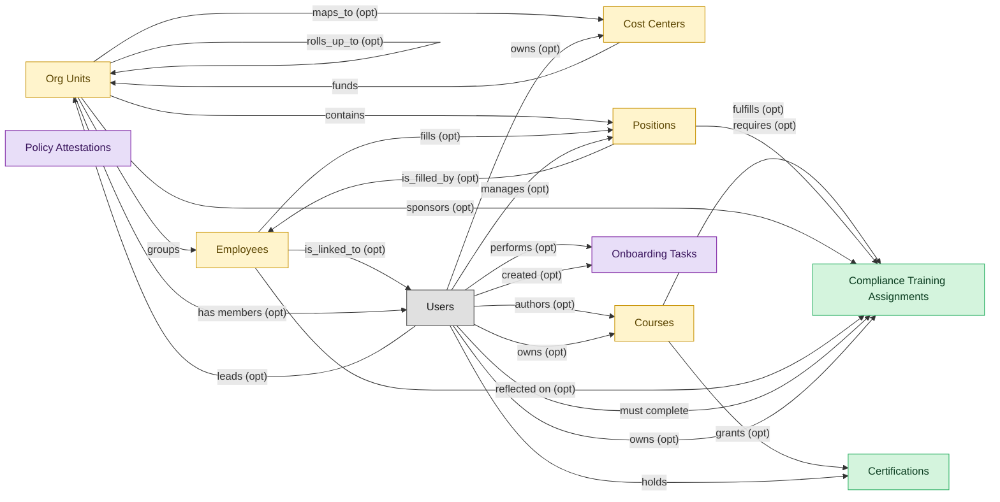

# Compliance Training

## 1. Overview

Mandatory regulatory training assignment, tracking, and certification: sexual harassment training (CA SB-1343), HIPAA, OSHA, anti-bribery, SOX, GDPR, AML. Masters `compliance_assignments` and `learner_certifications`. Realizes COMPLIANCE-TRAIN and CERT-MGMT. Distinct from general LMS course delivery: assignments are mandatory and time-bound, lifecycle includes `overdue`/`waived`/`expired` states with regulator-evidence retention, and ownership typically sits with GRC/Compliance, not L&D. Specialised vendor market: KnowBe4, NAVEX, EVERFI, MetricStream, OneTrust, plus all general LMSs.

## 2. Entity summary

| Name | Description |
| --- | --- |
| Certifications | Issued credential against a worker (internal certification, vendor cert, regulatory cert) with issue date, expiry, issuing body, and renewal rules. Drives recertification campaigns. |
| Compliance Training Assignments | Mandatory training assignment tied to a regulation, role, location, or hire-event (anti-harassment, AML, GDPR, OSHA, HIPAA). Carries due date, escalation policy, audit log. |
| Cost Centers | Organisational unit for cost allocation: name, code, manager, hierarchy, currency. Drives variance reporting and project / departmental P&L. A near-universal foreign key in finance and payroll. |
| Courses | Atomic learning unit: e-learning module, video, live session, blended programme, external content. Carries content reference, duration, format, language, prerequisites, certification award. |
| Employees | Canonical record of a person currently or formerly employed by the organization. Carries identity (legal name, contact, IDs), employment metadata (start date, end date, employment type, country), and pointers to position, job profile, org unit, manager, and life-event history. The most multi-mastered data object in the catalog: HCM masters the core HR slice, Payroll masters the comp/withholding slice, and IGA masters the identity/access slice. Onboarding, PA, and Talent Management consume or contribute. |
| Org Units | Node in the organizational hierarchy: division, business unit, department, team. Carries manager, cost center alignment, geographic scope, and parent/child relationships. HCM masters the operational hierarchy; EPM contributes the cost-center mapping (which would be Finance-mastered once a Finance/GL domain is loaded). |
| Positions | Approved slot in the org - a 'chair' with role definition, cost center, reporting line, location, and FTE allocation. Distinct from job_profiles (the catalog definition) and from employees (the person filling the slot). A position can be open, filled, or eliminated. SWP designs future positions via org_designs; HCM operationalizes them once approved. |
| Onboarding Tasks | Discrete to-do within a journey: sign I-9, attend orientation, complete compliance training, meet buddy, receive laptop. Carries assignee (new hire / manager / IT / facilities / HR), due date, completion state, evidence, and task type (form / training / meeting / provisioning / acknowledgement). Many tasks are local; a subset triggers cross-domain handoffs into ITSM, IWMS, Payroll, LMS, IGA, or HRSD. |
| Policy Attestations | Record that a user read, understood, and acknowledged a policy; timestamp, version, medium, completion evidence. |

## 3. Entities catalog

| # | data_object | role | mastered in | necessity | pattern flags | notes |
| ---: | --- | --- | --- | --- | --- | --- |
| 1 | `learner_certifications` (Certifications) | master | - | required | personal_content | - |
| 2 | `compliance_assignments` (Compliance Training Assignments) | master | - | required | - | - |
| 3 | `cost_centers` (Cost Centers) | embedded_master | `ERP-FIN` _(domain-level, not modularized)_ | optional | - | - |
| 4 | `courses` (Courses) | embedded_master | `lms-course-delivery` | required | - | - |
| 5 | `employees` (Employees) | embedded_master | `hcm-core-worker` | required | personal_content | - |
| 6 | `org_units` (Org Units) | embedded_master | `hcm-org-positions` | optional | - | - |
| 7 | `hcm_positions` (Positions) | embedded_master | `hcm-org-positions` | optional | single_approver | - |
| 8 | `onboarding_tasks` (Onboarding Tasks) | consumer | `onb-journey-mgmt` | required | personal_content | - |
| 9 | `policy_attestations` (Policy Attestations) | consumer | `GRC` _(domain-level, not modularized)_ | required | - | - |

## 4. Aliases and industry synonyms

_(no industry-scoped aliases or non-synonym alias types loaded for this scope; generic synonyms are omitted as common knowledge.)_

## 5. Relationships

### 5.1 Intra-scope edges

| from | verb | to | cardinality | kind | necessity | owner_side | notes |
| --- | --- | --- | --- | --- | --- | --- | --- |
| `org_units` | groups | `employees` | one_to_many | reference | required | source | intra \| cluster A \| HCM \| every employee rolls up to an org unit |
| `org_units` | contains | `hcm_positions` | one_to_many | reference | required | source | intra \| cluster A \| HCM \| positions live inside an org unit |
| `hcm_positions` | is_filled_by | `employees` | one_to_one | reference | optional | target | intra \| cluster A \| HCM \| a position may be vacant or filled by one incumbent |
| `cost_centers` | funds | `org_units` | one_to_many | reference | required | source | intra \| cluster A \| HCM \| org-unit labor cost rolls to a cost center \| auto-flipped from many_to_one |
| `org_units` | maps_to | `cost_centers` | one_to_one | reference | optional | source | cross \| cluster A \| HCM \| new org unit usually maps to ERP-FIN cost center |
| `courses` | fulfills | `compliance_assignments` | one_to_many | reference | optional | source | intra \| cluster A \| LMS \| compliance assignment satisfied by one or more courses |
| `courses` | grants | `learner_certifications` | one_to_many | reference | optional | source | intra \| cluster A \| LMS \| certifications earned from courses |
| `hcm_positions` | requires | `compliance_assignments` | one_to_many | reference | optional | source | intra \| cluster A \| LMS \| role-based compliance training |
| `org_units` | sponsors | `compliance_assignments` | one_to_many | reference | optional | source | intra \| cluster A \| LMS \| org-unit assigns compliance training |
| `employees` | reflected on | `compliance_assignments` | one_to_many | reference | optional | source | cross \| cluster A \| LMS \| lapsed mandatory training surfaces on HCM employee record \| auto-flipped from many_to_one |
| `employees` | fills | `hcm_positions` | one_to_one | reference | optional | source | intra \| cluster A \| ONBOARDING \| embedded: incumbent of the position being onboarded |
| `org_units` | rolls_up_to | `org_units` | one_to_many | reference | optional | source | Hierarchical parent-child between org_units (Team -> Department -> Division -> BU -> Company). |

### 5.2 Built-in edges (`users` and other platform built-ins)

| from | verb | to | cardinality | necessity | owner_side | notes |
| --- | --- | --- | --- | --- | --- | --- |
| `employees` | is_linked_to | `users` | one_to_one | optional | target | users \| cluster A \| HCM \| every employee maps to an identity user |
| `users` | manages | `hcm_positions` | one_to_many | optional | source | users \| cluster A \| HCM \| manager-of-position relationship \| auto-flipped from many_to_one |
| `users` | leads | `org_units` | one_to_many | optional | source | users \| cluster A \| HCM \| org-unit head \| auto-flipped from many_to_one |
| `users` | owns | `cost_centers` | one_to_many | optional | source | users \| cluster A \| HCM \| cost-center owner \| auto-flipped from many_to_one |
| `users` | holds | `learner_certifications` | one_to_many | required | source | users \| cluster A \| LMS \| cert holder \| auto-flipped from many_to_one |
| `users` | performs | `onboarding_tasks` | one_to_many | optional | source | users \| cluster A \| ONBOARDING \| task assignee (new hire, manager, IT) \| auto-flipped from many_to_one |
| `users` | created | `onboarding_tasks` | one_to_many | optional | source | users \| cluster A \| ONBOARDING \| who added/edited the task \| auto-flipped from many_to_one |
| `users` | authors | `courses` | one_to_many | optional | source | users \| cluster A \| LMS \| course author / instructor \| auto-flipped from many_to_one |
| `users` | owns | `courses` | one_to_many | optional | source | users \| cluster A \| LMS \| content owner \| auto-flipped from many_to_one |
| `users` | must complete | `compliance_assignments` | one_to_many | required | source | users \| cluster A \| LMS \| mandatory training assignee \| auto-flipped from many_to_one |
| `users` | owns | `compliance_assignments` | one_to_many | optional | source | users \| cluster A \| LMS \| compliance owner \| auto-flipped from many_to_one |
| `org_units` | has members | `users` | one_to_many | optional | target | Every user is assigned to one or more org_units (department membership). Drives assignment routing, RBAC scoping, and chargeback. |

### 5.3 Cross-scope edges

| from | verb | to | cardinality | necessity | notes |
| --- | --- | --- | --- | --- | --- |
| `job_profiles` | defines | `hcm_positions` | one_to_many | required | intra \| cluster A \| HCM \| job profile is the template for positions |
| `employees` | signs | `employment_contracts` | one_to_many | required | intra \| cluster A \| HCM \| contracts belong to the employee |
| `employees` | generates | `employment_events` | one_to_many | required | intra \| cluster A \| HCM \| hire/transfer/leave/term events for an employee |
| `employees` | triggers | `asset_lifecycle_events` | one_to_many | optional | intra \| cluster A \| HCM \| issue/return/recall events tied to the employee |
| `employees` | requests | `absence_requests` | one_to_many | optional | intra \| cluster A \| HCM \| self-service absence requests originate from employee |
| `employees` | holds | `skill_profiles` | one_to_one | optional | intra \| cluster A \| HCM \| each employee may have a skill profile |
| `org_units` | engages | `contingent_workers` | one_to_many | optional | intra \| cluster A \| HCM \| contingent workforce attaches to an org unit |
| `org_units` | is_scored_by | `engagement_drivers` | one_to_many | optional | intra \| cluster A \| HCM \| engagement drivers measured at org-unit level |
| `org_units` | is_measured_by | `people_kpis` | one_to_many | optional | intra \| cluster A \| HCM \| people KPIs aggregated by org unit |
| `employees` | triggers | `service_requests` | one_to_many | optional | cross \| cluster A \| HCM \| termination fan-out of offboarding service requests in ITSM |
| `employees` | feeds | `agency_time_entries` | one_to_many | optional | cross \| cluster A \| HCM \| agency staff termination freezes time entries in AGENCY-MGMT |
| `employees` | triggers | `iga_provisioning_events` | one_to_many | optional | cross \| cluster A \| HCM \| create/terminate/promote drives IGA account/entitlement actions |
| `org_units` | triggers | `iga_entitlement_definitions` | one_to_many | optional | cross \| cluster A \| HCM \| new/merged/disbanded org units drive IGA group lifecycle |
| `employees` | triggers | `pay_runs` | one_to_many | optional | cross \| cluster A \| HCM \| new-hire/termination/promotion drives Payroll comp activation and final pay |
| `hcm_positions` | spawns | `job_requisitions` | one_to_many | optional | cross \| cluster A \| HCM \| approved position becomes a requisition in ATS |
| `employees` | enrolls_in | `course_enrollments` | one_to_many | optional | cross \| cluster A \| HCM \| new-hire creation provisions LMS training |
| `job_profiles` | maps_to | `courses` | many_to_many | optional | cross \| cluster A \| HCM \| job-profile competencies drive required training |
| `employees` | becomes | `career_aspirations` | one_to_one | optional | cross \| cluster A \| HCM \| new employee triggers talent-profile initialization in Talent-Mgmt |
| `employees` | becomes | `work_shifts` | one_to_many | optional | cross \| cluster A \| HCM \| new employee becomes a schedulable resource in WFM |
| `employees` | becomes | `compensation_statements` | one_to_one | optional | cross \| cluster A \| HCM \| new-hire/promotion drives Comp-Mgmt compensation basis |
| `salary_bands` | anchors | `hcm_positions` | one_to_many | optional | cross \| cluster A \| HCM \| approved position carries grade/band to Comp-Mgmt \| auto-flipped from many_to_one |
| `employees` | triggers | `benefit_enrollments` | one_to_many | optional | cross \| cluster A \| HCM \| create/terminate/event drives BEN-ADMIN eligibility & COBRA |
| `employees` | triggers | `corporate_cards` | one_to_many | optional | cross \| cluster A \| HCM \| termination deactivates corporate cards in EXPENSE |
| `employees` | spawns | `onboarding_journeys` | one_to_one | optional | cross \| cluster A \| HCM \| new-hire creation triggers onboarding plan instantiation |
| `employees` | spawns | `hr_cases` | one_to_many | optional | cross \| cluster A \| HCM \| termination kicks off offboarding HR case in HRSD |
| `employees` | feeds | `headcount_plans` | one_to_many | optional | cross \| cluster A \| HCM \| headcount actuals reconcile to SWP plan |
| `onboarding_stages` | contains | `onboarding_tasks` | one_to_many | required | intra \| cluster A \| ONBOARDING \| tasks live inside one stage |
| `employees` | onboarded by | `onboarding_journeys` | one_to_many | required | intra \| cluster A \| ONBOARDING \| journey is bound to one new-hire employee \| auto-flipped from many_to_one |
| `onboarding_tasks` | emits | `service_requests` | one_to_many | optional | intra \| cluster A \| ONBOARDING \| IT/workplace task creates an internal service request |
| `onboarding_tasks` | triggers | `asset_lifecycle_events` | one_to_many | optional | intra \| cluster A \| ONBOARDING \| hardware-issue events tied to task |
| `onboarding_tasks` | emits | `service_incidents` | one_to_many | optional | cross \| cluster A \| ONBOARDING \| IT-provisioning onboarding task creates ITSM SR (incident family) |
| `onboarding_tasks` | emits | `workplace_service_requests` | one_to_many | optional | cross \| cluster A \| ONBOARDING \| workplace-setup tasks fan out to IWMS |
| `onboarding_tasks` | spawns | `hr_cases` | one_to_many | optional | cross \| cluster A \| ONBOARDING \| blocked/overdue task opens an HRSD case |
| `onboarding_tasks` | spawns | `iga_access_requests` | one_to_many | optional | cross \| cluster A \| ONBOARDING \| access-provisioning task drives IGA request |
| `employees` | finalized by | `onboarding_document_collections` | one_to_many | optional | cross \| cluster A \| ONBOARDING \| all docs collected → HCM finalizes employee record \| auto-flipped from many_to_one |
| `onboarding_tasks` | spawns | `course_enrollments` | one_to_many | optional | cross \| cluster A \| ONBOARDING \| compliance-training task triggers LMS enrollment |
| `courses` | sequenced_into | `learning_paths` | many_to_many | optional | intra \| cluster A \| LMS \| a path is an ordered collection of courses |
| `courses` | enrolled_via | `course_enrollments` | one_to_many | required | intra \| cluster A \| LMS \| enrollments reference a course |
| `skill_profiles` | updated by | `learner_certifications` | one_to_many | optional | intra \| cluster A \| LMS \| earning a cert refreshes the worker skill profile \| auto-flipped from many_to_one |
| `cost_centers` | funds | `course_enrollments` | one_to_many | optional | intra \| cluster A \| LMS \| training cost allocation |
| `compliance_obligations` | tracked by | `compliance_assignments` | one_to_many | optional | cross \| cluster A \| LMS \| overdue compliance training is a control failure in GRC \| auto-flipped from many_to_one |
| `compliance_assignments` | triggers | `iga_provisioning_events` | one_to_many | optional | cross \| cluster A \| LMS \| severe overdue suspends access via IGA |
| `employees` | reflects | `learning_records` | one_to_many | optional | cross \| cluster A \| LMS \| learning transcript visible on HCM employee record \| auto-flipped from many_to_one |
| `employees` | declares | `life_events` | one_to_many | optional | intra \| cluster A \| BEN-ADMIN \| embedded: employee declaring event |
| `org_units` | sponsors | `benefit_plans` | many_to_many | optional | intra \| cluster A \| BEN-ADMIN \| embedded: org-level offering |
| `employees` | updated by | `life_events` | one_to_many | optional | cross \| cluster A \| BEN-ADMIN \| approved life event may update dependents / emergency contacts in HCM \| auto-flipped from many_to_one |
| `survey_campaigns` | targets | `org_units` | many_to_many | optional | intra \| cluster A \| EMP-EXP \| embedded: org-unit scoping |
| `org_units` | owns | `action_plans` | one_to_many | optional | intra \| cluster A \| EMP-EXP \| org-unit accountable for action plan \| auto-flipped from many_to_one |
| `employees` | submits | `survey_responses` | one_to_many | optional | intra \| cluster A \| EMP-EXP \| respondent identity at employee level \| auto-flipped from many_to_one |
| `employees` | flagged on | `engagement_drivers` | one_to_many | optional | cross \| cluster A \| EMP-EXP \| high attrition-risk surfaces on HCM employee dashboard \| auto-flipped from many_to_one |
| `employees` | reflected on | `engagement_drivers` | one_to_many | optional | cross \| cluster A \| EMP-EXP \| survey-cycle results visible to HRBPs in HCM \| auto-flipped from many_to_one |
| `employees` | raises | `hr_cases` | one_to_many | required | intra \| cluster A \| HRSD \| requester identity (employee scope) \| auto-flipped from many_to_one |
| `employees` | updated by | `hr_cases` | one_to_many | optional | cross \| cluster A \| HRSD \| HR cases involving data changes flow back to HCM \| auto-flipped from many_to_one |
| `case_categories` | drives | `employees` | one_to_many | optional | cross \| cluster A \| HRSD \| taxonomy affects HCM employee-portal self-service routing |
| `legal_holds` | identifies_custodians_from | `employees` | many_to_many | optional | cross \| cluster C \| LSD \| HCM employee data drives custodian id |
| `legal_advice_records` | references | `employees` | many_to_many | optional | cross \| cluster C \| LSD \| employee-related advice from HR case |
| `employees` | is host for | `host_assignments` | one_to_many | required | cross \| cluster C \| VIS-MGMT \| host notifications trigger employee engagement \| auto-flipped from many_to_one |
| `contingent_workers` | reviewed_against | `employees` | one_to_one | optional | cross \| cluster D \| VMS \| tenure-threshold crossover triggers HCM reclassification/conversion |
| `candidates` | becomes | `employees` | one_to_one | required | cross \| ATS→HCM \| candidate.hired creates employee record; identity handoff |
| `pre_employees` | promotes to | `employees` | one_to_one | required | cross \| ATS->HCM \| pre_employee.activated converts the pre-hire record into the canonical HCM employee record |
| `employees` | learns_via | `course_enrollments` | one_to_many | required | intra \| cluster A \| LMS \| embedded: learner identity |
| `employees` | enrolls_in | `benefit_enrollments` | one_to_many | required | intra \| cluster A \| BEN-ADMIN \| embedded: enrollee identity |
| `survey_campaigns` | targets | `employees` | many_to_many | optional | intra \| cluster A \| EMP-EXP \| embedded: invited population |
| `workforce_scenarios` | drives | `hcm_positions` | one_to_many | required | cross \| SWP→HCM \| adopted scenario drives HCM position changes. |
| `org_designs` | proposes | `hcm_positions` | one_to_many | required | cross \| SWP→HCM \| org_design.published proposes new hcm_positions for creation. |

## 6. Cross-domain context

### 6.1 Master consumers (other modules / domains that embed this scope's masters)

| data_object | other module / domain | role | necessity | notes |
| --- | --- | --- | --- | --- |
| `compliance_assignments` | HRSD-CASE-MGMT (HR Case Management) - HRSD | consumer | optional | Consumed by HRSD-CASE-MGMT when an inbound handoff escalates to an HR case. Routed via B10b 2026-05-26 audit fixes. |
| `learner_certifications` | LMS-SKILLS (Skills and Learning Paths) - LMS | embedded_master | required | - |

### 6.2 Outbound handoffs (events this scope publishes)

| source module | target domain | target module | trigger_event | payload | integration | friction | description |
| --- | --- | --- | --- | --- | --- | --- | --- |
| LMS-COMPLIANCE-TRAINING | GRC | _(domain-level)_ | `compliance_assignment.overdue` | `compliance_assignments` | event_stream | high | Compliance training overdue is a control failure; GRC tracks obligation status, IGA may suspend high-risk access. |
| LMS-COMPLIANCE-TRAINING | GRC | _(domain-level)_ | `compliance_assignment.due` | `compliance_assignments` | event_stream | medium | GRC obligation tracker updates the per-employee compliance status to 'due' so the regulator-evidence dashboard reflects the impending breach risk. Drives audit-evidence reporting (e.g., Compliance Operations dashboard). |
| LMS-COMPLIANCE-TRAINING | HRSD | HRSD-CASE-MGMT | `compliance_assignment.due` | `compliance_assignments` | api_call | medium | HR Service Delivery opens (or updates) an employee-facing case/task with the impending obligation, deadline, and link to the assigned course. Failure mode: when an HRSD platform isn't deployed, the nudge falls back to direct email and the in-tool reminder. |
| LMS-COMPLIANCE-TRAINING | IGA | _(domain-level)_ | `compliance_assignment.overdue` | `compliance_assignments` | api_call | high | Severe overdue (PCI, HIPAA, SOX-relevant) may auto-suspend system access pending completion. Alert-without-feedback-loop common. |
| LMS-COMPLIANCE-TRAINING | HCM | _(domain-level)_ | `compliance_assignment.due` | `compliance_assignments` | event_stream | medium | Compliance assignment due-date nudges to HCM-mastered manager/employee record. HCM surfaces the impending obligation on the employee profile and routes a reminder to the line manager. |
| LMS-COMPLIANCE-TRAINING | LMS | LMS-SKILLS | `learner_certification.earned` | `learner_certifications` | lifecycle_progression | low | - |

### 6.3 Inbound handoffs (events this scope reacts to)

| target module | source domain | source module | trigger_event | payload | integration | friction | description |
| --- | --- | --- | --- | --- | --- | --- | --- |
| LMS-COMPLIANCE-TRAINING | LMS | LMS-COURSE-DELIVERY | `course.published` | `courses` | lifecycle_progression | low | - |
| LMS-COMPLIANCE-TRAINING | GRC | _(domain-level)_ | `compliance_policy.updated` | `policy_attestations` | api_call | medium | Policy version triggers LMS compliance-training requirement for scoped users. |
| LMS-COMPLIANCE-TRAINING | ONBOARDING | ONB-JOURNEY-MGMT | `task.compliance_training_required` | `onboarding_tasks` | api_call | medium | Compliance training items (security awareness, anti-harassment, HIPAA, country-specific code-of-conduct, role-specific certifications) trigger LMS enrollments. LMS masters the enrollment record and completion certificate; Onboarding consumes the completion event to close out its task. Friction sits in keeping the training catalog mapped to roles/jurisdictions. |

### 6.4 Master providers (modules / domains that own masters this scope embeds)

| data_object | role here | necessity | canonical owner(s) | slice notes |
| --- | --- | --- | --- | --- |
| `cost_centers` | embedded_master | optional | ERP-FIN (Core ERP Financial Management) | - |
| `courses` | embedded_master | required | LMS-COURSE-DELIVERY (LMS) | - |
| `employees` | embedded_master | required | HCM-CORE-WORKER (HCM), PAYROLL (Payroll Management), IGA (Identity Governance and Administration), MDM (Master Data Management) | - |
| `hcm_positions` | embedded_master | optional | HCM-ORG-POSITIONS (HCM) | - |
| `org_units` | embedded_master | optional | HCM-ORG-POSITIONS (HCM) | - |
| `onboarding_tasks` | consumer | required | ONB-JOURNEY-MGMT (ONBOARDING) | - |
| `policy_attestations` | consumer | required | GRC (Governance, Risk and Compliance) | - |

## 7. Lifecycle states (per master)

### `compliance_assignments` (Compliance Training Assignment)

| order | state_name | initial? | terminal? | requires_permission? | derived gate | description |
| --- | --- | --- | --- | --- | --- | --- |
| 1 | `assigned` | ✓ | - | - | - | Mandatory training assignment created for a learner with due date. |
| 2 | `in_progress` | - | - | - | - | Learner has started the underlying course or activity. |
| 3 | `completed` | - | ✓ | ✓ | `lms-compliance-training:complete` | Learner finished the assignment within the due window. |
| 4 | `overdue` | - | - | - | - | Due date passed without completion and escalation policy engaged. |
| 5 | `waived` | - | ✓ | ✓ | `lms-compliance-training:waive` | Assignment formally waived by compliance owner with audit reason. |
| 6 | `expired` | - | ✓ | ✓ | `lms-compliance-training:expire` | Assignment closed unmet at the regulatory deadline. |

### `learner_certifications` (Certification)

| order | state_name | initial? | terminal? | requires_permission? | derived gate | description |
| --- | --- | --- | --- | --- | --- | --- |
| 1 | `issued` | ✓ | - | ✓ | `lms-compliance-training:issue` | Credential awarded to the learner with issue and expiry dates. |
| 2 | `active` | - | - | - | - | Credential in force and valid for compliance or role requirements. |
| 3 | `renewing` | - | - | - | - | Recertification campaign engaged before expiry. |
| 4 | `renewed` | - | - | ✓ | `lms-compliance-training:renew` | Credential renewed with a fresh validity window. |
| 5 | `expired` | - | ✓ | - | - | Credential past its expiry date and no longer valid. |
| 6 | `revoked` | - | ✓ | ✓ | `lms-compliance-training:revoke` | Credential withdrawn by the issuing body or L&D for cause. |

## 8. Permissions and business rules (derived)

### 8.1 Permissions

| permission | tier | description | included in `:admin`? |
| --- | --- | --- | --- |
| `lms-compliance-training:read` | baseline-read | Read access to every entity in the module | ✓ |
| `lms-compliance-training:manage` | baseline-manage | Edit operational records | ✓ |
| `lms-compliance-training:admin` | baseline-admin | Edit reference data and inherit every workflow gate below | - |
| `lms-compliance-training:issue` | workflow-gate (lifecycle) | Transition `learner_certifications` into state `issued` | ✓ |
| `lms-compliance-training:renew` | workflow-gate (lifecycle) | Transition `learner_certifications` into state `renewed` | ✓ |
| `lms-compliance-training:revoke` | workflow-gate (lifecycle) | Transition `learner_certifications` into state `revoked` | ✓ |
| `lms-compliance-training:complete` | workflow-gate (lifecycle) | Transition `compliance_assignments` into state `completed` | ✓ |
| `lms-compliance-training:waive` | workflow-gate (lifecycle) | Transition `compliance_assignments` into state `waived` | ✓ |
| `lms-compliance-training:expire` | workflow-gate (lifecycle) | Transition `compliance_assignments` into state `expired` | ✓ |
| `lms-compliance-training:view_all_certifications` | override (personal_content) | View all `learner_certifications` rows beyond row-scope | ✓ |
| `lms-compliance-training:manage_all_certifications` | override (personal_content) | Manage all `learner_certifications` rows beyond row-scope | ✓ |

### 8.2 Business rules

| rule_name | data_object | source flag | intent |
| --- | --- | --- | --- |
| `certification_edit_scope` | `learner_certifications` | has_personal_content | Row-scope by default; override via `lms-compliance-training:view_all_certifications` / `lms-compliance-training:manage_all_certifications` |
