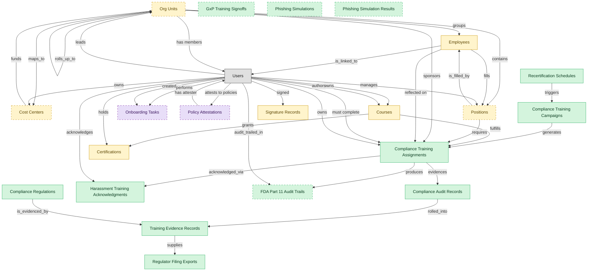

# Compliance Training

## 1. Overview

Mandatory regulatory training assignment, tracking, and certification: sexual harassment training (CA SB-1343), HIPAA, OSHA, anti-bribery, SOX, GDPR, AML. Masters `compliance_assignments` and `learner_certifications`. Realizes COMPLIANCE-TRAIN and CERT-MGMT. Distinct from general LMS course delivery: assignments are mandatory and time-bound, lifecycle includes `overdue`/`waived`/`expired` states with regulator-evidence retention, and ownership typically sits with GRC/Compliance, not L&D.

## 2. Entity summary

| Name | data_object | Description |
| --- | --- | --- |
| Compliance Audit Records | `compliance_audit_records` | Regulator-facing audit records of who completed which training, when, with version and evidence references. |
| Compliance Regulations | `compliance_regulations` | Reference table of statutes a tenant is subject to, with jurisdiction, citation, and retention period; each tenant activates its applicable subset. |
| Compliance Training Assignments | `compliance_assignments` | Mandatory training assignments tied to a regulation, role, location, or hire event, with due dates and escalation policy. |
| Compliance Training Campaigns | `compliance_training_campaigns` | Campaigns that bundle compliance training assignments by audience and due date, such as an annual code-of-conduct cycle. |
| FDA Part 11 Audit Trails | `fda_part11_audit_trails` | Tamper-evident, retention-locked audit-trail rows for regulated training, meeting electronic-records requirements. |
| GxP Training Signoffs | `gxp_training_signoffs` | Witnessed electronic signatures binding learner, course, content version, and timestamp for regulated life-sciences training. |
| Harassment Training Acknowledgments | `harassment_training_acknowledgements` | Statutory acknowledgments that harassment training was completed, carrying a signed timestamp and IP address. |
| Phishing Simulation Results | `phishing_simulation_results` | Per-recipient outcomes of a phishing simulation, recording whether each person clicked, reported, or ignored the test message. |
| Phishing Simulations | `phishing_simulations` | Configured simulated-phishing campaigns used for security-awareness training and PCI DSS compliance. |
| Recertification Schedules | `recertification_schedules` | Recurrence configurations that drive periodic compliance-refresh assignment cycles for regulations like FINRA, HIPAA, and OSHA. |
| Regulator Filing Exports | `regulator_filing_exports` | Export artifacts prepared for regulator submissions, such as OSHA 300 logs, FINRA filings, and state rollups. |
| Training Evidence Records | `training_evidence_records` | Inspection-ready training evidence packages, bundling the signed roster, certificate hash, content version, and signature record for regulators. |
| Certifications | `learner_certifications` | Credentials issued to a worker (internal, vendor, or regulatory), with issue date, expiry, issuing body, and renewal rules. Drives recertification campaigns. |
| Cost Centers | `cost_centers` | Organizational units for cost allocation, with code, manager, hierarchy, and currency, driving variance and departmental reporting. |
| Courses | `courses` | Learning units such as e-learning modules, videos, live sessions, or blended programs, with format, duration, and prerequisites. |
| Employees | `employees` | Canonical records of people currently or formerly employed, carrying identity, employment metadata, and links to position, manager, and org unit. |
| Org Units | `org_units` | Nodes in the organizational hierarchy such as divisions, departments, and teams, with manager, cost center alignment, geographic scope, and parent-child links. |
| Positions | `hcm_positions` | Approved org slots with role definition, cost center, reporting line, location, and FTE allocation. Each can be open, filled, or eliminated. |
| Signature Records | `signature_records` | E-signature envelopes with signing audit trail, IP addresses, provider references, and the signed document, one contract may have many. |
| Onboarding Tasks | `onboarding_tasks` | Discrete to-do items within an onboarding journey, each with an assignee, due date, type, and completion state, some triggering handoffs to other systems. |
| Policy Attestations | `policy_attestations` | Records that a user read and acknowledged a policy, with timestamp, policy version, medium, and completion evidence. |

## 3. Entities catalog

| # | data_object | canonical code | singular | plural | description | role | mastered in | mastered label | necessity | pattern flags | entity_type | write tier | notes |
| ---: | --- | --- | --- | --- | --- | --- | --- | --- | --- | --- | --- | --- | --- |
| 1 | `compliance_audit_records` | `compliance_audit_records` | Compliance Audit Record | Compliance Audit Records | Regulator-facing audit trail row capturing who did what training when, with version and evidence reference. Distinct from learning_records: audit-purpose subset, retention-locked. | master | - | - | required | personal_content, submit_lock | operational_workflow | `:manage` | - |
| 2 | `compliance_regulations` | `compliance_regulations` | Compliance Regulation | Compliance Regulations | Tenant-scoped reference table of statutes a tenant is subject to (jurisdiction, citation, retention period). Each tenant activates only its applicable subset; the regulation field on training_evidence_records is an FK into this table, and the active rows gate which compliance evidence applies. | master | - | - | required | - | catalog | `:admin` | - |
| 3 | `compliance_assignments` | `compliance_assignments` | Compliance Training Assignment | Compliance Training Assignments | Mandatory training assignment tied to a regulation, role, location, or hire-event (anti-harassment, AML, GDPR, OSHA, HIPAA). Carries due date, escalation policy, audit log. | master | - | - | required | personal_content | operational_workflow | `:manage` | - |
| 4 | `compliance_training_campaigns` | `compliance_training_campaigns` | Compliance Training Campaign | Compliance Training Campaigns | Campaign container that bundles assignments by audience and due-date: annual code-of-conduct cycle, harassment refresh, security awareness wave. | master | - | - | required | submit_lock | operational_workflow | `:manage` | - |
| 5 | `fda_part11_audit_trails` | `fda_part11_audit_trails` | FDA Part 11 Audit Trail | FDA Part 11 Audit Trails | 21 CFR Part 11 audit trail row for GxP-relevant training; tamper-evident, retention-locked. | master | - | - | optional | personal_content, submit_lock | operational_workflow | `:manage` | - |
| 6 | `gxp_training_signoffs` | `gxp_training_signoffs` | GxP Training Signoff | GxP Training Signoffs | Witnessed e-signature binding learner, course, content version and timestamp for FDA 21 CFR Part 11 life-sciences training. | master | - | - | optional | personal_content | operational_workflow | `:manage` | - |
| 7 | `harassment_training_acknowledgements` | `harassment_training_acknowledgements` | Harassment Training Acknowledgment | Harassment Training Acknowledgments | Statutory acknowledgment of harassment training completion per CA SB-1343, NY 201-g, IL 2-109; carries signed timestamp and IP. | master | - | - | required | personal_content, submit_lock | operational_workflow | `:manage` | - |
| 8 | `phishing_simulation_results` | `phishing_simulation_results` | Phishing Simulation Result | Phishing Simulation Results | Per-recipient outcome of a phishing simulation (clicked, reported, ignored). | master | - | - | optional | personal_content | operational_record | `:manage` | - |
| 9 | `phishing_simulations` | `phishing_simulations` | Phishing Simulation | Phishing Simulations | Configured simulated-phishing campaign for security-awareness training (PCI DSS 12.6). | master | - | - | optional | - | catalog | `:admin` | - |
| 10 | `recertification_schedules` | `recertification_schedules` | Recertification Schedule | Recertification Schedules | Periodic recurrence configuration that drives FINRA / BSA-AML / HIPAA / OSHA refresh assignment cycles. | master | - | - | required | - | catalog | `:admin` | - |
| 11 | `regulator_filing_exports` | `regulator_filing_exports` | Regulator Filing Export | Regulator Filing Exports | Export artifact for regulator submissions: OSHA 300, FINRA CE filings, state-CE rollups. | master | - | - | required | submit_lock | operational_workflow | `:manage` | - |
| 12 | `training_evidence_records` | `training_evidence_records` | Training Evidence Record | Training Evidence Records | Inspection-ready evidence package: signed roster, certificate hash, content version, signature record reference. Generated for regulator submission. | master | - | - | required | personal_content, submit_lock | operational_workflow | `:manage` | - |
| 13 | `learner_certifications` | `learner_certifications` | Certification | Certifications | Issued credential against a worker (internal certification, vendor cert, regulatory cert) with issue date, expiry, issuing body, and renewal rules. Drives recertification campaigns. | embedded_master | `lms-credentials` | Credentials, Badges and Continuing Education | required | personal_content, submit_lock | operational_workflow | `:manage` | - |
| 14 | `cost_centers` | `cost_centers` | Cost Center | Cost Centers | Organizational unit for cost allocation: name, code, manager, hierarchy, currency. Drives variance reporting and project / departmental P&L. A near-universal foreign key in finance and payroll. | embedded_master | `fin-gl-close` | General Ledger and Close | optional | - | catalog | `:admin` | - |
| 15 | `courses` | `courses` | Course | Courses | Atomic learning unit: e-learning module, video, live session, blended program, external content. Carries content reference, duration, format, language, prerequisites, certification award. | embedded_master | `lms-course-delivery` | Course Delivery | required | - | operational_workflow | `:manage` | - |
| 16 | `employees` | `employees` | Employee | Employees | Canonical record of a person currently or formerly employed by the organization. Carries identity (legal name, contact, IDs), employment metadata (start date, end date, employment type, country), and pointers to position, job profile, org unit, manager, and life-event history. The most multi-mastered data object in the catalog: HCM masters the core HR slice, Payroll masters the comp/withholding slice, and IGA masters the identity/access slice. Onboarding, PA, and Talent Management consume or contribute. | embedded_master | `hcm-core-worker` | Core Worker Record | required | personal_content | operational_workflow | `:manage` | - |
| 17 | `org_units` | `org_units` | Org Unit | Org Units | Node in the organizational hierarchy: division, business unit, department, team. Carries manager, cost center alignment, geographic scope, and parent/child relationships. HCM masters the operational hierarchy; EPM contributes the cost-center mapping (which would be Finance-mastered once a Finance/GL domain is loaded). | embedded_master | `hcm-org-positions` | Organization and Position Management | optional | - | operational_workflow | `:manage` | - |
| 18 | `hcm_positions` | `hcm_positions` | Position | Positions | Approved slot in the org - a 'chair' with role definition, cost center, reporting line, location, and FTE allocation. Distinct from job_profiles (the catalog definition) and from employees (the person filling the slot). A position can be open, filled, or eliminated. SWP designs future positions via org_designs; HCM operationalizes them once approved. | embedded_master | `hcm-org-positions` | Organization and Position Management | optional | single_approver | operational_workflow | `:manage` | - |
| 19 | `signature_records` | `signature_records` | Signature Record | Signature Records | E-signature envelope: signing audit trail, IP addresses, external e-signature provider envelope and document reference IDs, and the signed PDF artifact. Distinct from contracts, one contract may have many signature events (counterpart, amendment, renewal). | embedded_master | `clm-repository` | Contract Repository | required | personal_content, submit_lock | operational_workflow | `:manage` | - |
| 20 | `onboarding_tasks` | `onboarding_tasks` | Onboarding Task | Onboarding Tasks | Discrete to-do within a journey: sign I-9, attend orientation, complete compliance training, meet buddy, receive laptop. Carries assignee (new hire / manager / IT / facilities / HR), due date, completion state, evidence, and task type (form / training / meeting / provisioning / acknowledgment). Many tasks are local; a subset triggers cross-domain handoffs into ITSM, IWMS, Payroll, LMS, IGA, or HRSD. | consumer | `onb-journey-mgmt` | Onboarding Journey Management | optional | personal_content | operational_workflow | `:manage` | - |
| 21 | `policy_attestations` | `policy_attestations` | Policy Attestation | Policy Attestations | Record that a user read, understood, and acknowledged a policy; timestamp, version, medium, completion evidence. | consumer | - | - | optional | - | operational_workflow | `:manage` | - |

## 4. Aliases and industry synonyms

_(none: no industry-scoped aliases for this scope)_

## 5. Relationships

### 5.1 Intra-scope edges

| from | verb | to | cardinality | kind | necessity | owner_side | delete_mode | fk_format | notes |
| --- | --- | --- | --- | --- | --- | --- | --- | --- | --- |
| `compliance_training_campaigns` | generates | `compliance_assignments` | one_to_many | composition | required | source | cascade | parent | - |
| `compliance_assignments` | evidences | `compliance_audit_records` | one_to_many | reference | optional | target | clear | reference | - |
| `compliance_audit_records` | rolled_into | `training_evidence_records` | one_to_many | reference | optional | target | clear | reference | - |
| `training_evidence_records` | supplies | `regulator_filing_exports` | many_to_many | association | optional | source | clear | reference | - |
| `compliance_assignments` | acknowledged_via | `harassment_training_acknowledgements` | one_to_many | reference | optional | target | clear | reference | - |
| `recertification_schedules` | triggers | `compliance_training_campaigns` | one_to_many | reference | optional | target | clear | reference | - |
| `compliance_assignments` | produces | `fda_part11_audit_trails` | one_to_many | reference | optional | target | clear | reference | - |
| `org_units` | groups | `employees` | one_to_many | reference | required | source | restrict | reference | - |
| `org_units` | contains | `hcm_positions` | one_to_many | reference | required | source | restrict | reference | - |
| `hcm_positions` | is_filled_by | `employees` | one_to_one | reference | optional | target | clear | reference | - |
| `cost_centers` | funds | `org_units` | one_to_many | reference | required | source | restrict | reference | - |
| `org_units` | maps_to | `cost_centers` | one_to_one | reference | optional | source | clear | reference | - |
| `courses` | fulfills | `compliance_assignments` | one_to_many | reference | optional | source | clear | reference | - |
| `courses` | grants | `learner_certifications` | one_to_many | reference | optional | source | clear | reference | - |
| `hcm_positions` | requires | `compliance_assignments` | one_to_many | reference | optional | source | clear | reference | - |
| `org_units` | sponsors | `compliance_assignments` | one_to_many | reference | optional | source | clear | reference | - |
| `employees` | reflected on | `compliance_assignments` | one_to_many | reference | optional | source | clear | reference | - |
| `employees` | fills | `hcm_positions` | one_to_one | reference | optional | source | clear | reference | - |
| `org_units` | rolls_up_to | `org_units` | one_to_many | reference | optional | source | clear | reference | - |
| `compliance_regulations` | is_evidenced_by | `training_evidence_records` | one_to_many | reference | optional | target | clear | reference | - |

### 5.2 Built-in edges (`users` and other platform built-ins)

| from | verb | to | cardinality | necessity | owner_side | delete_mode | fk_format | notes |
| --- | --- | --- | --- | --- | --- | --- | --- | --- |
| `users` | owns | `courses` | one_to_many | optional | source | clear | reference | - |
| `users` | acknowledges | `harassment_training_acknowledgements` | one_to_many | required | source | restrict | reference | - |
| `users` | audit_trailed_in | `fda_part11_audit_trails` | one_to_many | optional | source | clear | reference | - |
| `users` | attests to policies | `policy_attestations` | one_to_many | optional | source | clear | reference | - |
| `policy_attestations` | has attester | `users` | many_to_many | required | source | restrict | reference | - |
| `users` | signed | `signature_records` | one_to_many | optional | source | clear | reference | - |
| `employees` | is_linked_to | `users` | one_to_one | optional | target | clear | reference | - |
| `users` | manages | `hcm_positions` | one_to_many | optional | source | clear | reference | - |
| `users` | leads | `org_units` | one_to_many | optional | source | clear | reference | - |
| `users` | owns | `cost_centers` | one_to_many | optional | source | clear | reference | - |
| `users` | performs | `onboarding_tasks` | one_to_many | optional | source | clear | reference | - |
| `users` | created | `onboarding_tasks` | one_to_many | optional | source | clear | reference | - |
| `users` | authors | `courses` | one_to_many | optional | source | clear | reference | - |
| `users` | must complete | `compliance_assignments` | one_to_many | required | source | restrict | reference | - |
| `users` | owns | `compliance_assignments` | one_to_many | optional | source | clear | reference | - |
| `users` | holds | `learner_certifications` | one_to_many | required | source | restrict | reference | - |
| `org_units` | has members | `users` | one_to_many | optional | target | clear | reference | - |

### 5.3 Cross-scope edges

#### 5.3a Outbound from this scope's masters and contributors

_Edges this scope drives: the in-scope endpoint has `role` of `master` or `contributor`._

| from | verb | to | cardinality | necessity | delete_mode | fk_format | notes |
| --- | --- | --- | --- | --- | --- | --- | --- |
| `automated_enrollment_rules` | creates | `compliance_assignments` | one_to_many | optional | none | n/a | - |
| `compliance_assignments` | escalates_via | `manager_nudges` | one_to_many | optional | none | n/a | - |
| `compliance_obligations` | tracked by | `compliance_assignments` | one_to_many | optional | none | n/a | - |
| `compliance_assignments` | triggers | `iga_provisioning_events` | one_to_many | optional | none | n/a | - |

#### 5.3b Context edges on embedded shells and consumed entities

_Edges the canonical owner drives, shown for context: the in-scope endpoint has `role` of `embedded_master`, `consumer`, or `derived`._

| from | verb | to | cardinality | necessity | delete_mode | fk_format | notes |
| --- | --- | --- | --- | --- | --- | --- | --- |
| `employees` | triggers | `iga_provisioning_events` | one_to_many | optional | none | n/a | - |
| `employees` | finalized by | `onboarding_document_collections` | one_to_many | optional | none | n/a | - |
| `pre_employees` | promotes to | `employees` | one_to_one | required | none (required-if-present) | n/a | - |
| `legal_holds` | identifies_custodians_from | `employees` | many_to_many | optional | none | n/a | - |
| `legal_advice_records` | references | `employees` | many_to_many | optional | none | n/a | - |
| `employees` | is host for | `host_assignments` | one_to_many | required | none (required-if-present) | n/a | - |
| `courses` | has_version | `course_versions` | one_to_many | required | ⚠ audit: required composed child out of scope | n/a | - |
| `courses` | classified_as | `course_categories` | many_to_many | optional | none | n/a | - |
| `courses` | tagged_with | `course_tags` | many_to_many | optional | none | n/a | - |
| `course_catalogs` | lists | `courses` | many_to_many | optional | none | n/a | - |
| `courses` | reviewed_via | `course_reviews` | one_to_many | optional | none | n/a | - |
| `courses` | rated_via | `course_ratings` | one_to_many | optional | none | n/a | - |
| `courses` | discussed_in | `course_discussions` | one_to_many | optional | none | n/a | - |
| `courses` | scheduled_as | `course_offerings` | one_to_many | optional | none | n/a | - |
| `certification_definitions` | instantiated_as | `learner_certifications` | one_to_many | required | none (required-if-present) | n/a | - |
| `certificate_templates` | renders | `learner_certifications` | one_to_many | optional | none | n/a | - |
| `courses` | grants | `certification_definitions` | many_to_many | optional | none | n/a | - |
| `courses` | yields_credits_via | `continuing_education_credits` | many_to_many | optional | none | n/a | - |
| `learning_path_steps` | references | `courses` | one_to_many | optional | none | n/a | - |
| `contingent_workers` | converts_to | `employees` | one_to_one | optional | none | n/a | - |
| `legal_contracts` | witnessed_by | `signature_records` | one_to_many | required | ⚠ audit: required composed child out of scope | n/a | - |
| `merit_recommendations` | applies to | `employees` | one_to_one | optional | none | n/a | - |
| `equity_grants` | granted to | `employees` | one_to_one | optional | none | n/a | - |
| `compensation_statements` | issued to | `employees` | one_to_one | optional | none | n/a | - |
| `employees` | requests | `absence_requests` | one_to_many | optional | none | n/a | - |
| `job_profiles` | defines | `hcm_positions` | one_to_many | required | none (required-if-present) | n/a | - |
| `employees` | signs | `employment_contracts` | one_to_many | required | ⚠ audit: required composed child out of scope | n/a | - |
| `employees` | generates | `employment_events` | one_to_many | required | ⚠ audit: required composed child out of scope | n/a | - |
| `employees` | triggers | `asset_lifecycle_events` | one_to_many | optional | none | n/a | - |
| `employees` | holds | `skill_profiles` | one_to_one | optional | none | n/a | - |
| `org_units` | engages | `contingent_workers` | one_to_many | optional | none | n/a | - |
| `org_units` | is_scored_by | `engagement_drivers` | one_to_many | optional | none | n/a | - |
| `org_units` | is_measured_by | `people_kpis` | one_to_many | optional | none | n/a | - |
| `employees` | triggers | `service_requests` | one_to_many | optional | none | n/a | - |
| `org_units` | triggers | `iga_entitlement_definitions` | one_to_many | optional | none | n/a | - |
| `employees` | triggers | `pay_runs` | one_to_many | optional | none | n/a | - |
| `hcm_positions` | spawns | `job_requisitions` | one_to_many | optional | none | n/a | - |
| `employees` | enrolls_in | `course_enrollments` | one_to_many | optional | none | n/a | - |
| `job_profiles` | maps_to | `courses` | many_to_many | optional | none | n/a | - |
| `employees` | becomes | `career_aspirations` | one_to_one | optional | none | n/a | - |
| `employees` | becomes | `work_shifts` | one_to_many | optional | none | n/a | - |
| `employees` | becomes | `compensation_statements` | one_to_one | optional | none | n/a | - |
| `salary_bands` | anchors | `hcm_positions` | one_to_many | optional | none | n/a | - |
| `employees` | triggers | `benefit_enrollments` | one_to_many | optional | none | n/a | - |
| `employees` | triggers | `corporate_cards` | one_to_many | optional | none | n/a | - |
| `employees` | spawns | `onboarding_journeys` | one_to_one | optional | none | n/a | - |
| `employees` | spawns | `hr_cases` | one_to_many | optional | none | n/a | - |
| `employees` | feeds | `headcount_plans` | one_to_many | optional | none | n/a | - |
| `employees` | feeds | `agency_time_entries` | one_to_many | optional | none | n/a | - |
| `onboarding_stages` | contains | `onboarding_tasks` | one_to_many | required | ⚠ audit: required composed child out of scope | n/a | - |
| `employees` | onboarded by | `onboarding_journeys` | one_to_many | required | none (required-if-present) | n/a | - |
| `onboarding_tasks` | emits | `service_requests` | one_to_many | optional | none | n/a | - |
| `onboarding_tasks` | triggers | `asset_lifecycle_events` | one_to_many | optional | none | n/a | - |
| `onboarding_tasks` | emits | `service_incidents` | one_to_many | optional | none | n/a | - |
| `onboarding_tasks` | emits | `workplace_service_requests` | one_to_many | optional | none | n/a | - |
| `onboarding_tasks` | spawns | `hr_cases` | one_to_many | optional | none | n/a | - |
| `onboarding_tasks` | spawns | `iga_access_requests` | one_to_many | optional | none | n/a | - |
| `onboarding_tasks` | spawns | `course_enrollments` | one_to_many | optional | none | n/a | - |
| `courses` | sequenced_into | `learning_paths` | many_to_many | optional | none | n/a | - |
| `courses` | enrolled_via | `course_enrollments` | one_to_many | required | none (required-if-present) | n/a | - |
| `skill_profiles` | updated by | `learner_certifications` | one_to_many | optional | none | n/a | - |
| `cost_centers` | funds | `course_enrollments` | one_to_many | optional | none | n/a | - |
| `employees` | reflects | `learning_records` | one_to_many | optional | none | n/a | - |
| `employees` | declares | `life_events` | one_to_many | optional | none | n/a | - |
| `org_units` | sponsors | `benefit_plans` | many_to_many | optional | none | n/a | - |
| `employees` | updated by | `life_events` | one_to_many | optional | none | n/a | - |
| `survey_campaigns` | targets | `org_units` | many_to_many | optional | none | n/a | - |
| `org_units` | owns | `action_plans` | one_to_many | optional | none | n/a | - |
| `employees` | submits | `survey_responses` | one_to_many | optional | none | n/a | - |
| `employees` | flagged on | `engagement_drivers` | one_to_many | optional | none | n/a | - |
| `employees` | reflected on | `engagement_drivers` | one_to_many | optional | none | n/a | - |
| `employees` | raises | `hr_cases` | one_to_many | required | none (required-if-present) | n/a | - |
| `employees` | updated by | `hr_cases` | one_to_many | optional | none | n/a | - |
| `case_categories` | drives | `employees` | one_to_many | optional | none | n/a | - |
| `envelopes` | yields | `signature_records` | one_to_many | optional | none | n/a | - |
| `contingent_workers` | reviewed_against | `employees` | one_to_one | optional | none | n/a | - |
| `candidates` | becomes | `employees` | one_to_one | required | none (required-if-present) | n/a | - |
| `employees` | learns_via | `course_enrollments` | one_to_many | required | none (required-if-present) | n/a | - |
| `employees` | enrolls_in | `benefit_enrollments` | one_to_many | required | none (required-if-present) | n/a | - |
| `survey_campaigns` | targets | `employees` | many_to_many | optional | none | n/a | - |
| `workforce_scenarios` | drives | `hcm_positions` | one_to_many | required | none (required-if-present) | n/a | - |
| `org_designs` | proposes | `hcm_positions` | one_to_many | required | none (required-if-present) | n/a | - |
| `employees` | has | `emergency_contacts` | one_to_many | required | ⚠ audit: required composed child out of scope | n/a | - |
| `employees` | has | `work_eligibility_documents` | one_to_many | required | ⚠ audit: required composed child out of scope | n/a | - |
| `employees` | has | `national_ids` | one_to_many | required | ⚠ audit: required composed child out of scope | n/a | - |
| `employees` | has | `worker_addresses` | one_to_many | required | ⚠ audit: required composed child out of scope | n/a | - |
| `employees` | has | `employee_dependents` | one_to_many | required | ⚠ audit: required composed child out of scope | n/a | - |
| `employees` | has | `worker_change_requests` | one_to_many | required | none (required-if-present) | n/a | - |
| `employees` | applies_as | `candidates` | one_to_many | optional | none | n/a | - |
| `employees` | is the worker behind | `traveler_profiles` | one_to_one | optional | none | n/a | - |
| `exit_risk_assessments` | assesses | `employees` | one_to_one | optional | none | n/a | - |
| `insider_risk_cases` | concerns | `employees` | one_to_many | optional | none | n/a | - |
| `frontline_recognitions` | recognizes | `employees` | one_to_many | required | none (required-if-present) | n/a | - |
| `advocate_profiles` | represents | `employees` | one_to_one | required | none (required-if-present) | n/a | - |

## 6. Cross-domain context

### 6.1 Master consumers (other modules / domains that embed this scope's masters)

| data_object | other module / domain | role | necessity | notes |
| --- | --- | --- | --- | --- |
| `compliance_assignments` | HCM-LIFECYCLE-WORKFLOWS (Employee Lifecycle Workflows) - HCM | consumer | optional | - |
| `compliance_assignments` | HRSD-CASE-MGMT (HR Case Management) - HRSD | consumer | optional | - |
| `compliance_assignments` | IGA-AUTO-PROVISIONING (IGA Automated Provisioning) - IGA | consumer | optional | Overdue compliance training fires auto-revoke of gated access (e.g. PII data, regulated systems). |
| `compliance_assignments` | LMS-AUTOMATION (Learning Automation) - LMS | embedded_master | required | - |
| `compliance_assignments` | TRAINING-RECORDS-STARTER (Training Records (Compliance Documentation Starter)) - LMS | embedded_master | required | - |
| `compliance_regulations` | TRAINING-RECORDS-STARTER (Training Records (Compliance Documentation Starter)) - LMS | embedded_master | optional | - |
| `fda_part11_audit_trails` | TRAINING-RECORDS-STARTER (Training Records (Compliance Documentation Starter)) - LMS | embedded_master | optional | - |
| `harassment_training_acknowledgements` | TRAINING-RECORDS-STARTER (Training Records (Compliance Documentation Starter)) - LMS | embedded_master | optional | - |
| `training_evidence_records` | TRAINING-RECORDS-STARTER (Training Records (Compliance Documentation Starter)) - LMS | embedded_master | required | - |

### 6.2 Outbound handoffs (events this scope publishes)

| source module | target domain | target module | trigger_event | transition | payload | integration | friction | description |
| --- | --- | --- | --- | --- | --- | --- | --- | --- |
| LMS-COMPLIANCE-TRAINING | GRC | _(domain-level)_ | `compliance_assignment.completed` | _(lifecycle)_ | `compliance_assignments` | event_stream | low | - |
| LMS-COMPLIANCE-TRAINING | GRC | _(domain-level)_ | `compliance_assignment.due` | _(threshold)_ | `compliance_assignments` | event_stream | medium | GRC obligation tracker updates the per-employee compliance status to 'due' so the regulator-evidence dashboard reflects the impending breach risk. Drives audit-evidence reporting (e.g., Compliance Operations dashboard). |
| LMS-COMPLIANCE-TRAINING | GRC | _(domain-level)_ | `compliance_assignment.expired` | _(threshold)_ | `compliance_assignments` | event_stream | high | - |
| LMS-COMPLIANCE-TRAINING | GRC | _(domain-level)_ | `compliance_assignment.overdue` | _(threshold)_ | `compliance_assignments` | event_stream | high | Compliance training overdue is a control failure; GRC tracks obligation status, IGA may suspend high-risk access. |
| LMS-COMPLIANCE-TRAINING | GRC | _(domain-level)_ | `training_evidence_record.submitted` | _(lifecycle)_ | `training_evidence_records` | event_stream | low | - |
| HCM-CORE-WORKER | HRSD | HRSD-CASE-MGMT | `employee.terminated` | `terminated` _(lifecycle)_ | `employees` | event_stream | medium | Termination kicks off offboarding case (exit interview, knowledge transfer, paperwork). Multiple downstream HRSD tasks created. |
| LMS-COMPLIANCE-TRAINING | HRSD | HRSD-CASE-MGMT | `compliance_assignment.due` | _(threshold)_ | `compliance_assignments` | api_call | medium | HR Service Delivery opens (or updates) an employee-facing case/task with the impending obligation, deadline, and link to the assigned course. Failure mode: when an HRSD platform isn't deployed, the nudge falls back to direct email and the in-tool reminder. |
| HCM-CORE-WORKER | IGA | IGA-ACCESS-REQUEST | `employee.created` | `created` _(lifecycle)_ | `employees` | api_call | high | New employee in HCM triggers directory account creation and birthright-role assignment in IGA. High friction because role-to-entitlement mappings drift per business unit, and IGA frequently needs additional context (cost center, manager, location) that arrives later in the journey. Same trigger event as the HCM → Onboarding and HCM → Payroll handoffs. |
| HCM-CORE-WORKER | IGA | IGA-ACCESS-REQUEST | `employee.promoted` | _(lifecycle)_ | `employees` | event_stream | high | Promotion (mover event) requires entitlement re-evaluation: add new role access, revoke prior-role access. SoD risk window during transition. |
| HCM-CORE-WORKER | IGA | IGA-ACCESS-REQUEST | `employee.terminated` | `terminated` _(lifecycle)_ | `employees` | api_call | high | Termination in HCM must immediately revoke identity access in IGA: disable account, remove group memberships, terminate app-level entitlements. Failure modes: contractor terminations not flowing (different HCM table); rehires confuse the de-provisioning idempotency; access lingers after termination is the canonical audit finding. |
| HCM-ORG-POSITIONS | IGA | IGA-ACCESS-REQUEST | `org_unit.created` | _(state_change)_ | `org_units` | event_stream | medium | New org unit drives IGA group/role provisioning. Group-name conventions and ownership must be encoded; otherwise orphan groups proliferate. |
| HCM-ORG-POSITIONS | IGA | IGA-ACCESS-REQUEST | `org_unit.disbanded` | _(state_change)_ | `org_units` | event_stream | high | Org-unit disbandment requires IGA group cleanup; orphan-group risk if employees re-assigned slowly. |
| HCM-ORG-POSITIONS | IGA | IGA-ACCESS-REQUEST | `org_unit.merged` | _(state_change)_ | `org_units` | event_stream | high | Org-unit merge consolidates IGA groups: members migrate, entitlements deduplicated, SoD revalidated. Often runs as a batch project rather than event. |
| LMS-COMPLIANCE-TRAINING | IGA | IGA-AUTO-PROVISIONING | `compliance_assignment.expired` | _(threshold)_ | `compliance_assignments` | api_call | high | - |
| LMS-COMPLIANCE-TRAINING | IGA | IGA-AUTO-PROVISIONING | `compliance_assignment.overdue` | _(threshold)_ | `compliance_assignments` | api_call | high | Severe overdue (PCI, HIPAA, SOX-relevant) may auto-suspend system access pending completion. Alert-without-feedback-loop common. |
| LMS-CREDENTIALS | IGA | IGA-AUTO-PROVISIONING | `learner_certification.expired` | _(threshold)_ | `learner_certifications` | api_call | high | - |
| LMS-CREDENTIALS | IGA | IGA-AUTO-PROVISIONING | `learner_certification.renewed` | _(lifecycle)_ | `learner_certifications` | api_call | medium | - |
| LMS-CREDENTIALS | IGA | IGA-AUTO-PROVISIONING | `learner_certification.revoked` | _(lifecycle)_ | `learner_certifications` | api_call | high | - |
| HCM-CORE-WORKER | HCM | HCM-LIFECYCLE-WORKFLOWS | `employee.created` | `created` _(lifecycle)_ | `employees` | lifecycle_progression | low | New worker record surfaces in self-service: manager dashboard, new-hire welcome surface, lifecycle task inbox. In-process state read; no message bus. |
| HCM-CORE-WORKER | HCM | HCM-LIFECYCLE-WORKFLOWS | `employee.terminated` | `terminated` _(lifecycle)_ | `employees` | lifecycle_progression | low | Termination drives the offboarding self-service flow: exit-interview prompt, equipment-return task, knowledge-handoff surfaces in the lifecycle workflow module. |
| LMS-COMPLIANCE-TRAINING | HCM | HCM-LIFECYCLE-WORKFLOWS | `compliance_assignment.due` | _(threshold)_ | `compliance_assignments` | event_stream | medium | Compliance assignment due-date nudges to HCM-mastered manager/employee record. HCM surfaces the impending obligation on the employee profile and routes a reminder to the line manager. |
| HCM-CORE-WORKER | PAYROLL | PAYROLL-RUN | `employee.created` | `created` _(lifecycle)_ | `employees` | api_call | medium | New employee in HCM triggers comp profile activation in Payroll: gross-to-net rules selected by jurisdiction, deductions initialised, bank account and tax setup collected via Onboarding flow. Same trigger event as the HCM → Onboarding handoff; both subscribe to the employee.created event. |
| HCM-CORE-WORKER | PAYROLL | PAYROLL-RUN | `employee.promoted` | _(lifecycle)_ | `employees` | event_stream | medium | Promotion typically includes salary change. Effective-dated change must flow to PAYROLL with retroactive handling. |
| HCM-CORE-WORKER | PAYROLL | PAYROLL-RUN | `employee.terminated` | `terminated` _(lifecycle)_ | `employees` | event_stream | high | Termination drives final pay (severance, accrued PTO payout, prorated bonus). Cross-vendor stack when HCM and PAYROLL are different vendors; retro-adjustments are common. |
| HCM-ORG-POSITIONS | ATS | ATS-RECRUITMENT-PIPELINE | `hcm_position.approved` | _(state_change)_ | `hcm_positions` | api_call | medium | - |
| HCM-ORG-POSITIONS | ATS | ATS-RECRUITMENT-PIPELINE | `hcm_position.approved_for_creation` | `approved_for_creation` _(lifecycle)_ | `hcm_positions` | event_stream | medium | Approved position flows to ATS as the basis for a requisition. Approval state must be in sync to avoid requisitions opened against unapproved positions. |
| HCM-ORG-POSITIONS | ATS | ATS-RECRUITMENT-PIPELINE | `hcm_position.eliminated` | _(state_change)_ | `hcm_positions` | api_call | high | - |
| HCM-ORG-POSITIONS | ATS | ATS-RECRUITMENT-PIPELINE | `hcm_position.filled` | _(state_change)_ | `hcm_positions` | api_call | medium | - |
| HCM-ORG-POSITIONS | ATS | ATS-RECRUITMENT-PIPELINE | `hcm_position.frozen` | _(state_change)_ | `hcm_positions` | api_call | high | - |
| HCM-ORG-POSITIONS | ATS | ATS-RECRUITMENT-PIPELINE | `hcm_position.opened` | _(state_change)_ | `hcm_positions` | api_call | medium | - |
| HCM-ORG-POSITIONS | ATS | ATS-RECRUITMENT-PIPELINE | `org_unit.activated` | _(state_change)_ | `org_units` | api_call | low | - |
| HCM-ORG-POSITIONS | ATS | ATS-RECRUITMENT-PIPELINE | `org_unit.closed` | _(state_change)_ | `org_units` | api_call | high | - |
| HCM-ORG-POSITIONS | ATS | ATS-RECRUITMENT-PIPELINE | `org_unit.created` | _(state_change)_ | `org_units` | api_call | medium | - |
| HCM-ORG-POSITIONS | ATS | ATS-RECRUITMENT-PIPELINE | `org_unit.disbanded` | _(state_change)_ | `org_units` | api_call | high | - |
| HCM-ORG-POSITIONS | ATS | ATS-RECRUITMENT-PIPELINE | `org_unit.merged` | _(state_change)_ | `org_units` | api_call | high | - |
| HCM-ORG-POSITIONS | ATS | ATS-RECRUITMENT-PIPELINE | `org_unit.reorganized` | _(state_change)_ | `org_units` | api_call | high | - |
| LMS-COMPLIANCE-TRAINING | LMS | LMS-AUTOMATION | `compliance_assignment.overdue` | _(threshold)_ | `compliance_assignments` | lifecycle_progression | low | - |
| LMS-COMPLIANCE-TRAINING | LMS | LMS-AUTOMATION | `compliance_training_campaign.launched` | _(lifecycle)_ | `compliance_training_campaigns` | lifecycle_progression | low | - |
| HCM-CORE-WORKER | TALENT-MGMT | TALENT-PERFORMANCE-MGMT | `employee.created` | `created` _(lifecycle)_ | `employees` | api_call | low | New employee triggers talent-profile initialisation in Talent Management: career aspirations, mobility preferences, skills profile stubs. Same employee.created trigger as Onboarding / Payroll / IGA handoffs. |
| HCM-CORE-WORKER | TALENT-MGMT | TALENT-PERFORMANCE-MGMT | `employee.promoted` | _(lifecycle)_ | `employees` | event_stream | low | Promotion updates succession-plan slots and 9-box placement context. |
| HCM-CORE-WORKER | WFM | _(domain-level)_ | `employee.created` | `created` _(lifecycle)_ | `employees` | event_stream | low | New employee provisioned in HCM becomes a schedulable resource in WFM - identity, position, base FTE. Mid-shift onboarding and badge-binding are typical edge cases. |
| HCM-CORE-WORKER | COMP-MGMT | COMP-PLANNING | `employee.created` | `created` _(lifecycle)_ | `employees` | event_stream | low | New-hire creation provides compensation basis. Bands and grades attach via job profile. |
| HCM-CORE-WORKER | COMP-MGMT | COMP-PLANNING | `employee.promoted` | _(lifecycle)_ | `employees` | event_stream | low | Promotion event triggers off-cycle compensation review (eligibility, band placement, increase recommendation) in COMP-MGMT. |
| HCM-ORG-POSITIONS | COMP-MGMT | COMP-PLANNING | `hcm_position.approved_for_creation` | `approved_for_creation` _(lifecycle)_ | `hcm_positions` | event_stream | low | Approved position carries grade/band, anchoring offer-comp generation. |
| HCM-CORE-WORKER | BEN-ADMIN | BEN-ENROLLMENT | `employee.created` | `created` _(lifecycle)_ | `employees` | event_stream | medium | New-hire creation seeds benefits eligibility (waiting periods, default elections). Drives carrier feed setup at end of new-hire window. |
| HCM-CORE-WORKER | BEN-ADMIN | BEN-ENROLLMENT | `employee.terminated` | `terminated` _(lifecycle)_ | `employees` | event_stream | high | Termination triggers benefits termination, COBRA / equivalent notices, and dependent coverage decisions. Late notifications cause coverage gaps. |
| HCM-ORG-POSITIONS | FIN | _(domain-level)_ | `org_unit.created` | _(state_change)_ | `org_units` | api_call | medium | New org unit usually maps to cost-center; ERP-FIN must reflect the structure for budgeting and labor allocation. |
| FIN-GL-CLOSE | EPM | _(domain-level)_ | `cost_center.created` | _(lifecycle)_ | `cost_centers` | event_stream | low | New cost centers get a plan slot in EPM. |
| HCM-CORE-WORKER | EXPENSE | _(domain-level)_ | `employee.terminated` | `terminated` _(lifecycle)_ | `employees` | event_stream | medium | Termination triggers EXPENSE corporate-card deactivation and outstanding-report close-out. |
| HCM-CORE-WORKER | PSA | PSA-PROJECT-DELIVERY | `employee.terminated` | `terminated` _(lifecycle)_ | `employees` | event_stream | medium | Terminated employee may be the assignee on open project_tasks. PROJECT-DELIVERY needs to surface affected tasks for reassignment or completion handover. |
| HCM-CORE-WORKER | PSA | PSA-RESOURCE-MGMT | `attrition_risk.high` | _(state_change)_ | `employees` | event_stream | high | ML attrition score crosses high threshold. PSA resource managers may proactively rebalance assignments away from at-risk consultants on critical engagements. High friction: probabilistic→deterministic pattern (score requires judgment call), false-positive volume can swamp the staffing queue. |
| HCM-CORE-WORKER | PSA | PSA-RESOURCE-MGMT | `employee.created` | `created` _(lifecycle)_ | `employees` | event_stream | low | New consultant hired. PSA resource pool adds the employee as available capacity; skill inventory record is seeded for downstream certifications. |
| HCM-CORE-WORKER | PSA | PSA-RESOURCE-MGMT | `employee.promoted` | _(lifecycle)_ | `employees` | event_stream | low | Consultant promoted (level / job profile change). PSA reevaluates billable rate band and skill inventory; existing project_assignments may need rate revision. |
| HCM-CORE-WORKER | PSA | PSA-RESOURCE-MGMT | `employee.terminated` | `terminated` _(lifecycle)_ | `employees` | event_stream | medium | Consultant terminated. PSA must release any active project_assignments, return capacity to bench and re-allocate forecast. Medium friction: leaver-event timing varies (immediate vs notice period) and active assignments may need urgent rebalancing. |
| LMS-COURSE-DELIVERY | SKILLS-MGMT | SKILLS-MGMT-PROFILE | `course.published` | _(lifecycle)_ | `courses` | lifecycle_progression | low | - |
| LMS-COMPLIANCE-TRAINING | SKILLS-MGMT | SKILLS-MGMT-PROFILE | `learner_certification.earned` | _(lifecycle)_ | `learner_certifications` | lifecycle_progression | low | - |

### 6.3 Inbound handoffs (events this scope reacts to)

| target module | source domain | source module | trigger_event | transition | payload | integration | friction | description |
| --- | --- | --- | --- | --- | --- | --- | --- | --- |
| CLM-REPOSITORY | CLM | CLM-NEGOTIATION | `signature_record.completed` | _(state_change)_ | `signature_records` | lifecycle_progression | low | Signature envelope completion in negotiation hands the executed envelope to the repository for persistence. Intra-domain lifecycle progression; the signed document gets indexed and the linked legal_contract transitions out_for_signature -> signed. |
| HCM-CORE-WORKER | ATS | ATS-CANDIDATE-CRM | `candidate.hired` | `hired` _(lifecycle)_ | `employees` | event_stream | medium | Candidate-to-employee conversion: hired candidate from ATS triggers employee-record creation in HCM. Field mapping (candidate → employee) is rarely perfect; missing fields (legal name spelling, work-eligibility detail, tax IDs) get collected in the Onboarding journey and back-filled into HCM. |
| HCM-CORE-WORKER | COMP-MGMT | COMP-PLANNING | `merit_cycle.approved` | `approved` _(state_change)_ | `employees` | event_stream | low | Cycle-close pay-rate changes post to the worker record (base salary, bonus target, equity guideline). |
| HCM-CORE-WORKER | EMP-EXP | EMP-EXP-CONTINUOUS-LISTEN | `attrition_risk.high` | _(state_change)_ | `employees` | api_call | high | Attrition-risk inference from engagement signals surfaces to managers via HCM dashboards. Probabilistic-signal → deterministic-action pattern: a risk score is not a directive; intervention is gated by manager judgment, data-privacy rules (anonymity floor), and DEI-bias concerns. |
| HCM-CORE-WORKER | PA | PA-PREDICTIVE-MODELS | `attrition_risk.high` | _(state_change)_ | `employees` | event_stream | high | Flight-risk score flagged on employee; HR-business-partner motion required. Probabilistic-signal-to-deterministic-action friction shape; false-positive volume drives mistrust. |
| HCM-CORE-WORKER | MDM | _(domain-level)_ | `employee_golden_record.created` | `active` _(lifecycle)_ | `employees` | api_call | medium | Resolved identity → HCM links operational HR record. |
| LMS-COMPLIANCE-TRAINING | GRC | _(domain-level)_ | `compliance_policy.updated` | `published` → `republished` _(state_change)_ | `policy_attestations` | api_call | medium | Policy version triggers LMS compliance-training requirement for scoped users. |
| LMS-COMPLIANCE-TRAINING | LMS | LMS-COURSE-DELIVERY | `course.published` | _(lifecycle)_ | `courses` | lifecycle_progression | low | - |
| LMS-COMPLIANCE-TRAINING | ONBOARDING | ONB-JOURNEY-MGMT | `task.compliance_training_required` | _(state_change)_ | `onboarding_tasks` | api_call | medium | Compliance training items (security awareness, anti-harassment, HIPAA, country-specific code-of-conduct, role-specific certifications) trigger LMS enrollments. LMS masters the enrollment record and completion certificate; Onboarding consumes the completion event to close out its task. Friction sits in keeping the training catalog mapped to roles/jurisdictions. |

### 6.4 Master providers (modules / domains that own masters this scope embeds)

| data_object | role here | necessity | canonical owner(s) | slice notes |
| --- | --- | --- | --- | --- |
| `cost_centers` | embedded_master | optional | FIN-GL-CLOSE (FIN) | - |
| `courses` | embedded_master | required | LMS-COURSE-DELIVERY (LMS) | - |
| `employees` | embedded_master | required | HCM-CORE-WORKER (HCM) | - |
| `hcm_positions` | embedded_master | optional | HCM-ORG-POSITIONS (HCM) | - |
| `learner_certifications` | embedded_master | required | LMS-CREDENTIALS (LMS) | - |
| `org_units` | embedded_master | optional | HCM-ORG-POSITIONS (HCM) | - |
| `signature_records` | embedded_master | required | CLM-REPOSITORY (CLM) | - |
| `onboarding_tasks` | consumer | optional | ONB-JOURNEY-MGMT (ONBOARDING) | - |
| `policy_attestations` | consumer | optional | _(no canonical owner recorded)_ | - |

## 7. Lifecycle states

### `compliance_assignments` (Compliance Training Assignment)

| order | state_name | initial? | terminal? | requires_permission? | derived gate | description |
| --- | --- | --- | --- | --- | --- | --- |
| 1 | `assigned` | ✓ | - | - | - | Mandatory training assignment created for a learner with due date. |
| 2 | `in_progress` | - | - | - | - | Learner has started the underlying course or activity. |
| 3 | `completed` | - | ✓ | ✓ | `lms-compliance-training:complete` | Learner finished the assignment within the due window. |
| 4 | `overdue` | - | - | - | - | Due date passed without completion and escalation policy engaged. |
| 5 | `waived` | - | ✓ | ✓ | `lms-compliance-training:waive` | Assignment formally waived by compliance owner with audit reason. |
| 6 | `expired` | - | ✓ | ✓ | `lms-compliance-training:expire` | Assignment closed unmet at the regulatory deadline. |

### `compliance_audit_records` (Compliance Audit Record)

| order | state_name | initial? | terminal? | requires_permission? | derived gate | description |
| --- | --- | --- | --- | --- | --- | --- |
| 1 | `recorded` | ✓ | - | - | - | - |
| 2 | `validated` | - | - | ✓ | `lms-compliance-training:validate` | - |
| 3 | `submitted` | - | - | ✓ | `lms-compliance-training:submit` | - |
| 4 | `archived` | - | ✓ | ✓ | `lms-compliance-training:archive` | - |

### `compliance_training_campaigns` (Compliance Training Campaign)

| order | state_name | initial? | terminal? | requires_permission? | derived gate | description |
| --- | --- | --- | --- | --- | --- | --- |
| 1 | `draft` | ✓ | - | - | - | - |
| 2 | `scheduled` | - | - | ✓ | `lms-compliance-training:schedule` | - |
| 3 | `running` | - | - | - | - | - |
| 4 | `completed` | - | ✓ | ✓ | `lms-compliance-training:complete` | - |
| 5 | `canceled` | - | ✓ | ✓ | `lms-compliance-training:cancel` | - |

### `courses` (Course)

_This scope holds `courses` as **embedded_master**; the canonical state machine is owned by `LMS-COURSE-DELIVERY`._

| order | state_name | initial? | terminal? | requires_permission? | derived gate | description |
| --- | --- | --- | --- | --- | --- | --- |
| 1 | `draft` | ✓ | - | - | - | Course being authored by an instructional designer or SME. |
| 2 | `in_review` | - | - | - | - | Content under review by L&D or compliance reviewers. |
| 3 | `published` | - | - | ✓ | `lms-compliance-training:publish` | Course released to the catalog and available for enrollment. |
| 4 | `retired` | - | ✓ | ✓ | `lms-compliance-training:retire` | Course removed from the catalog and kept for historical transcripts. |

### `employees` (Employee)

_This scope holds `employees` as **embedded_master**; the canonical state machine is owned by `HCM-CORE-WORKER`._

| order | state_name | initial? | terminal? | requires_permission? | derived gate | description |
| --- | --- | --- | --- | --- | --- | --- |
| 1 | `draft` | ✓ | - | - | - | Pre-hire stub created during requisition or onboarding handoff; not yet a worker of record. |
| 2 | `active` | - | - | ✓ | `lms-compliance-training:active_employee` | Worker is currently employed and appears in headcount, payroll eligibility, and directory feeds. |
| 3 | `on_leave` | - | - | ✓ | `lms-compliance-training:on_leave_employee` | Employee is on approved leave (parental, medical, sabbatical); active record but suppressed from some downstream feeds. |
| 4 | `suspended` | - | - | ✓ | `lms-compliance-training:suspended_employee` | Employment temporarily halted (investigation, disciplinary); pay and access may be paused. |
| 5 | `terminated` | - | ✓ | ✓ | `lms-compliance-training:terminated_employee` | Employment ended (voluntary or involuntary); final pay processed, access deprovisioned. |

### `fda_part11_audit_trails` (FDA Part 11 Audit Trail)

| order | state_name | initial? | terminal? | requires_permission? | derived gate | description |
| --- | --- | --- | --- | --- | --- | --- |
| 1 | `recorded` | ✓ | - | - | - | - |
| 2 | `validated` | - | - | ✓ | `lms-compliance-training:validate` | - |
| 3 | `archived` | - | ✓ | ✓ | `lms-compliance-training:archive` | - |

### `gxp_training_signoffs` (GxP Training Signoff)

| order | state_name | initial? | terminal? | requires_permission? | derived gate | description |
| --- | --- | --- | --- | --- | --- | --- |
| 1 | `pending` | ✓ | - | - | - | - |
| 2 | `signed` | - | - | ✓ | `lms-compliance-training:sign` | - |
| 3 | `locked` | - | ✓ | ✓ | `lms-compliance-training:lock` | - |

### `harassment_training_acknowledgements` (Harassment Training Acknowledgment)

| order | state_name | initial? | terminal? | requires_permission? | derived gate | description |
| --- | --- | --- | --- | --- | --- | --- |
| 1 | `pending` | ✓ | - | - | - | - |
| 2 | `acknowledged` | - | - | ✓ | `lms-compliance-training:acknowledge` | - |
| 3 | `archived` | - | ✓ | ✓ | `lms-compliance-training:archive` | - |

### `hcm_positions` (Position)

_This scope holds `hcm_positions` as **embedded_master**; the canonical state machine is owned by `HCM-ORG-POSITIONS`._

| order | state_name | initial? | terminal? | requires_permission? | derived gate | description |
| --- | --- | --- | --- | --- | --- | --- |
| 1 | `proposed` | ✓ | - | - | - | Position has been designed but not yet approved against the headcount plan. |
| 2 | `approved` | - | - | ✓ | `lms-compliance-training:approved_position` | Cleared by headcount/finance owner; eligible to spawn a requisition. |
| 3 | `open` | - | - | ✓ | `lms-compliance-training:open_position` | Approved and actively being recruited against; not yet filled. |
| 4 | `filled` | - | - | ✓ | `lms-compliance-training:filled_position` | An employee occupies the position. |
| 5 | `frozen` | - | - | ✓ | `lms-compliance-training:frozen_position` | Temporarily not fillable (hiring freeze, budget hold); retains the slot. |
| 6 | `eliminated` | - | ✓ | ✓ | `lms-compliance-training:eliminated_position` | Removed from the org structure permanently. |

### `learner_certifications` (Certification)

_This scope holds `learner_certifications` as **embedded_master**; the canonical state machine is owned by `LMS-CREDENTIALS`._

| order | state_name | initial? | terminal? | requires_permission? | derived gate | description |
| --- | --- | --- | --- | --- | --- | --- |
| 1 | `issued` | ✓ | - | ✓ | `lms-compliance-training:issue` | Credential awarded to the learner with issue and expiry dates. |
| 2 | `active` | - | - | - | - | Credential in force and valid for compliance or role requirements. |
| 3 | `renewing` | - | - | - | - | Recertification campaign engaged before expiry. |
| 4 | `renewed` | - | - | ✓ | `lms-compliance-training:renew` | Credential renewed with a fresh validity window. |
| 5 | `expired` | - | ✓ | - | - | Credential past its expiry date and no longer valid. |
| 6 | `revoked` | - | ✓ | ✓ | `lms-compliance-training:revoke` | Credential withdrawn by the issuing body or L&D for cause. |

### `onboarding_tasks` (Onboarding Task)

_This scope holds `onboarding_tasks` as **consumer**; the canonical state machine is owned by `ONB-JOURNEY-MGMT`._

| order | state_name | initial? | terminal? | requires_permission? | derived gate | description |
| --- | --- | --- | --- | --- | --- | --- |
| 1 | `pending` | ✓ | - | - | - | Task assigned; due date set; not yet started. |
| 2 | `in_progress` | - | - | - | - | Assignee has started work or partial evidence captured. |
| 3 | `completed` | - | ✓ | ✓ | `onb-journey-mgmt:completed_onboarding_task` | Task done; evidence (form, acknowledgment, signature, ticket id) captured. |
| 4 | `skipped` | - | ✓ | ✓ | `onb-journey-mgmt:skipped_onboarding_task` | Task waived by manager/HR for this journey. |
| 5 | `canceled` | - | ✓ | ✓ | `onb-journey-mgmt:canceled_onboarding_task` | Task voided (journey canceled, prerequisite removed). |

### `org_units` (Org Unit)

_This scope holds `org_units` as **embedded_master**; the canonical state machine is owned by `HCM-ORG-POSITIONS`._

| order | state_name | initial? | terminal? | requires_permission? | derived gate | description |
| --- | --- | --- | --- | --- | --- | --- |
| 1 | `draft` | ✓ | - | - | - | Org unit defined as part of a future structure; not yet operational. |
| 2 | `active` | - | - | ✓ | `lms-compliance-training:active_org_unit` | Operational unit; carries headcount, cost-center linkage, and reporting lines. |
| 3 | `reorganized` | - | ✓ | ✓ | `lms-compliance-training:reorganized_org_unit` | Unit folded into or replaced by a new structure; references remain for history. |
| 4 | `closed` | - | ✓ | ✓ | `lms-compliance-training:closed_org_unit` | Unit dissolved; no employees or positions reside in it. |

### `phishing_simulations` (Phishing Simulation)

| order | state_name | initial? | terminal? | requires_permission? | derived gate | description |
| --- | --- | --- | --- | --- | --- | --- |
| 1 | `draft` | ✓ | - | - | - | - |
| 2 | `launched` | - | - | ✓ | `lms-compliance-training:launch` | - |
| 3 | `closed` | - | ✓ | ✓ | `lms-compliance-training:close` | - |

### `regulator_filing_exports` (Regulator Filing Export)

| order | state_name | initial? | terminal? | requires_permission? | derived gate | description |
| --- | --- | --- | --- | --- | --- | --- |
| 1 | `drafted` | ✓ | - | - | - | - |
| 2 | `finalized` | - | - | ✓ | `lms-compliance-training:finalize` | - |
| 3 | `filed` | - | - | ✓ | `lms-compliance-training:file` | - |
| 4 | `archived` | - | ✓ | ✓ | `lms-compliance-training:archive` | - |

### `signature_records` (Signature Record)

_This scope holds `signature_records` as **embedded_master**; the canonical state machine is owned by `CLM-REPOSITORY`._

| order | state_name | initial? | terminal? | requires_permission? | derived gate | description |
| --- | --- | --- | --- | --- | --- | --- |
| 10 | `pending` | ✓ | - | - | - | Signature envelope created but not yet dispatched. |
| 20 | `sent` | - | - | - | - | Envelope dispatched to first signer(s); awaiting first signature. |
| 30 | `in_progress` | - | - | - | - | One or more signers have signed; others remain. |
| 40 | `completed` | - | ✓ | - | - | All required signers have signed. The signed contract document is persisted. Terminal positive outcome. |
| 50 | `declined` | - | ✓ | - | - | A signer declined to sign. Envelope is terminal; a new envelope can be created if negotiation re-opens. |
| 60 | `voided` | - | ✓ | ✓ | `lms-compliance-training:void_signature_record` | Sender voided the envelope before all signers completed. Terminal. |

### `training_evidence_records` (Training Evidence Record)

| order | state_name | initial? | terminal? | requires_permission? | derived gate | description |
| --- | --- | --- | --- | --- | --- | --- |
| 1 | `drafted` | ✓ | - | - | - | - |
| 2 | `finalized` | - | - | ✓ | `lms-compliance-training:finalize` | - |
| 3 | `submitted` | - | - | ✓ | `lms-compliance-training:submit` | - |
| 4 | `archived` | - | ✓ | ✓ | `lms-compliance-training:archive` | - |

## 8. Permissions and business rules (derived)

### 8.1 Permissions

| permission | tier | description | included in `:admin`? |
| --- | --- | --- | --- |
| `lms-compliance-training:read` | baseline-read | Read access to every entity in the module | ✓ |
| `lms-compliance-training:manage` | baseline-manage | Edit operational records | ✓ |
| `lms-compliance-training:admin` | baseline-admin | Edit reference data and inherit every workflow gate below | - |
| `lms-compliance-training:active_employee` | workflow-gate (lifecycle) | Transition `employees` into state `active` | ✓ |
| `lms-compliance-training:on_leave_employee` | workflow-gate (lifecycle) | Transition `employees` into state `on_leave` | ✓ |
| `lms-compliance-training:suspended_employee` | workflow-gate (lifecycle) | Transition `employees` into state `suspended` | ✓ |
| `lms-compliance-training:terminated_employee` | workflow-gate (lifecycle) | Transition `employees` into state `terminated` | ✓ |
| `lms-compliance-training:approved_position` | workflow-gate (lifecycle) | Transition `hcm_positions` into state `approved` | ✓ |
| `lms-compliance-training:open_position` | workflow-gate (lifecycle) | Transition `hcm_positions` into state `open` | ✓ |
| `lms-compliance-training:filled_position` | workflow-gate (lifecycle) | Transition `hcm_positions` into state `filled` | ✓ |
| `lms-compliance-training:frozen_position` | workflow-gate (lifecycle) | Transition `hcm_positions` into state `frozen` | ✓ |
| `lms-compliance-training:eliminated_position` | workflow-gate (lifecycle) | Transition `hcm_positions` into state `eliminated` | ✓ |
| `lms-compliance-training:active_org_unit` | workflow-gate (lifecycle) | Transition `org_units` into state `active` | ✓ |
| `lms-compliance-training:reorganized_org_unit` | workflow-gate (lifecycle) | Transition `org_units` into state `reorganized` | ✓ |
| `lms-compliance-training:closed_org_unit` | workflow-gate (lifecycle) | Transition `org_units` into state `closed` | ✓ |
| `lms-compliance-training:void_signature_record` | workflow-gate (lifecycle) | Transition `signature_records` into state `voided` | ✓ |
| `lms-compliance-training:publish` | workflow-gate (lifecycle) | Transition `courses` into state `published` | ✓ |
| `lms-compliance-training:retire` | workflow-gate (lifecycle) | Transition `courses` into state `retired` | ✓ |
| `lms-compliance-training:issue` | workflow-gate (lifecycle) | Transition `learner_certifications` into state `issued` | ✓ |
| `lms-compliance-training:renew` | workflow-gate (lifecycle) | Transition `learner_certifications` into state `renewed` | ✓ |
| `lms-compliance-training:revoke` | workflow-gate (lifecycle) | Transition `learner_certifications` into state `revoked` | ✓ |
| `lms-compliance-training:complete` | workflow-gate (lifecycle) | Transition `compliance_assignments` into state `completed` | ✓ |
| `lms-compliance-training:waive` | workflow-gate (lifecycle) | Transition `compliance_assignments` into state `waived` | ✓ |
| `lms-compliance-training:expire` | workflow-gate (lifecycle) | Transition `compliance_assignments` into state `expired` | ✓ |
| `lms-compliance-training:schedule` | workflow-gate (lifecycle) | Transition `compliance_training_campaigns` into state `scheduled` | ✓ |
| `lms-compliance-training:cancel` | workflow-gate (lifecycle) | Transition `compliance_training_campaigns` into state `canceled` | ✓ |
| `lms-compliance-training:validate` | workflow-gate (lifecycle) | Transition `compliance_audit_records` into state `validated` | ✓ |
| `lms-compliance-training:submit` | workflow-gate (lifecycle) | Transition `compliance_audit_records` into state `submitted` | ✓ |
| `lms-compliance-training:archive` | workflow-gate (lifecycle) | Transition `compliance_audit_records` into state `archived` | ✓ |
| `lms-compliance-training:finalize` | workflow-gate (lifecycle) | Transition `training_evidence_records` into state `finalized` | ✓ |
| `lms-compliance-training:acknowledge` | workflow-gate (lifecycle) | Transition `harassment_training_acknowledgements` into state `acknowledged` | ✓ |
| `lms-compliance-training:file` | workflow-gate (lifecycle) | Transition `regulator_filing_exports` into state `filed` | ✓ |
| `lms-compliance-training:sign` | workflow-gate (lifecycle) | Transition `gxp_training_signoffs` into state `signed` | ✓ |
| `lms-compliance-training:lock` | workflow-gate (lifecycle) | Transition `gxp_training_signoffs` into state `locked` | ✓ |
| `lms-compliance-training:launch` | workflow-gate (lifecycle) | Transition `phishing_simulations` into state `launched` | ✓ |
| `lms-compliance-training:close` | workflow-gate (lifecycle) | Transition `phishing_simulations` into state `closed` | ✓ |
| `lms-compliance-training:view_all_compliance_training_assignments` | override (personal_content) | View all `compliance_assignments` rows beyond row-scope | ✓ |
| `lms-compliance-training:manage_all_compliance_training_assignments` | override (personal_content) | Manage all `compliance_assignments` rows beyond row-scope | ✓ |
| `lms-compliance-training:view_all_employees` | override (personal_content) | View all `employees` rows beyond row-scope | ✓ |
| `lms-compliance-training:manage_all_employees` | override (personal_content) | Manage all `employees` rows beyond row-scope | ✓ |
| `lms-compliance-training:view_all_certifications` | override (personal_content) | View all `learner_certifications` rows beyond row-scope | ✓ |
| `lms-compliance-training:manage_all_certifications` | override (personal_content) | Manage all `learner_certifications` rows beyond row-scope | ✓ |
| `lms-compliance-training:submit_certification` | override (submit_lock) | Submit and lock a `learner_certifications` row (post-submit edits gated) | ✓ |
| `lms-compliance-training:submit_compliance_training_campaign` | override (submit_lock) | Submit and lock a `compliance_training_campaigns` row (post-submit edits gated) | ✓ |
| `lms-compliance-training:view_all_compliance_audit_records` | override (personal_content) | View all `compliance_audit_records` rows beyond row-scope | ✓ |
| `lms-compliance-training:manage_all_compliance_audit_records` | override (personal_content) | Manage all `compliance_audit_records` rows beyond row-scope | ✓ |
| `lms-compliance-training:submit_compliance_audit_record` | override (submit_lock) | Submit and lock a `compliance_audit_records` row (post-submit edits gated) | ✓ |
| `lms-compliance-training:view_all_training_evidence_records` | override (personal_content) | View all `training_evidence_records` rows beyond row-scope | ✓ |
| `lms-compliance-training:manage_all_training_evidence_records` | override (personal_content) | Manage all `training_evidence_records` rows beyond row-scope | ✓ |
| `lms-compliance-training:submit_training_evidence_record` | override (submit_lock) | Submit and lock a `training_evidence_records` row (post-submit edits gated) | ✓ |
| `lms-compliance-training:view_all_harassment_training_acknowledgments` | override (personal_content) | View all `harassment_training_acknowledgements` rows beyond row-scope | ✓ |
| `lms-compliance-training:manage_all_harassment_training_acknowledgments` | override (personal_content) | Manage all `harassment_training_acknowledgements` rows beyond row-scope | ✓ |
| `lms-compliance-training:submit_harassment_training_acknowledgment` | override (submit_lock) | Submit and lock a `harassment_training_acknowledgements` row (post-submit edits gated) | ✓ |
| `lms-compliance-training:submit_regulator_filing_export` | override (submit_lock) | Submit and lock a `regulator_filing_exports` row (post-submit edits gated) | ✓ |
| `lms-compliance-training:view_all_signature_records` | override (personal_content) | View all `signature_records` rows beyond row-scope | ✓ |
| `lms-compliance-training:manage_all_signature_records` | override (personal_content) | Manage all `signature_records` rows beyond row-scope | ✓ |
| `lms-compliance-training:submit_signature_record` | override (submit_lock) | Submit and lock a `signature_records` row (post-submit edits gated) | ✓ |
| `lms-compliance-training:view_all_fda_part_11_audit_trails` | override (personal_content) | View all `fda_part11_audit_trails` rows beyond row-scope | ✓ |
| `lms-compliance-training:manage_all_fda_part_11_audit_trails` | override (personal_content) | Manage all `fda_part11_audit_trails` rows beyond row-scope | ✓ |
| `lms-compliance-training:submit_fda_part_11_audit_trail` | override (submit_lock) | Submit and lock a `fda_part11_audit_trails` row (post-submit edits gated) | ✓ |
| `lms-compliance-training:view_all_gxp_training_signoffs` | override (personal_content) | View all `gxp_training_signoffs` rows beyond row-scope | ✓ |
| `lms-compliance-training:manage_all_gxp_training_signoffs` | override (personal_content) | Manage all `gxp_training_signoffs` rows beyond row-scope | ✓ |
| `lms-compliance-training:view_all_phishing_simulation_results` | override (personal_content) | View all `phishing_simulation_results` rows beyond row-scope | ✓ |
| `lms-compliance-training:manage_all_phishing_simulation_results` | override (personal_content) | Manage all `phishing_simulation_results` rows beyond row-scope | ✓ |

### 8.2 Business rules

| rule_name | data_object | source flag | intent |
| --- | --- | --- | --- |
| `compliance_training_assignment_edit_scope` | `compliance_assignments` | has_personal_content | Row-scope by default; override via `lms-compliance-training:view_all_compliance_training_assignments` / `lms-compliance-training:manage_all_compliance_training_assignments` |
| `employee_edit_scope` | `employees` | has_personal_content | Row-scope by default; override via `lms-compliance-training:view_all_employees` / `lms-compliance-training:manage_all_employees` |
| `certification_edit_scope` | `learner_certifications` | has_personal_content | Row-scope by default; override via `lms-compliance-training:view_all_certifications` / `lms-compliance-training:manage_all_certifications` |
| `submit_restricted_to_certification_owner` | `learner_certifications` | has_submit_lock | Only the row's authoring user can submit; post-submit the row is read-only except via `lms-compliance-training:manage_all_certifications` |
| `approve_position_requires_approver` | `hcm_positions` | has_single_approver | Exactly one explicit approver required; uses the module's approval gate (`lms-compliance-training:approved_position`). |
| `submit_restricted_to_compliance_training_campaign_owner` | `compliance_training_campaigns` | has_submit_lock | Only the row's authoring user can submit; post-submit the row is read-only except via `lms-compliance-training:manage_all_compliance_training_campaigns` |
| `compliance_audit_record_edit_scope` | `compliance_audit_records` | has_personal_content | Row-scope by default; override via `lms-compliance-training:view_all_compliance_audit_records` / `lms-compliance-training:manage_all_compliance_audit_records` |
| `submit_restricted_to_compliance_audit_record_owner` | `compliance_audit_records` | has_submit_lock | Only the row's authoring user can submit; post-submit the row is read-only except via `lms-compliance-training:manage_all_compliance_audit_records` |
| `training_evidence_record_edit_scope` | `training_evidence_records` | has_personal_content | Row-scope by default; override via `lms-compliance-training:view_all_training_evidence_records` / `lms-compliance-training:manage_all_training_evidence_records` |
| `submit_restricted_to_training_evidence_record_owner` | `training_evidence_records` | has_submit_lock | Only the row's authoring user can submit; post-submit the row is read-only except via `lms-compliance-training:manage_all_training_evidence_records` |
| `harassment_training_acknowledgment_edit_scope` | `harassment_training_acknowledgements` | has_personal_content | Row-scope by default; override via `lms-compliance-training:view_all_harassment_training_acknowledgments` / `lms-compliance-training:manage_all_harassment_training_acknowledgments` |
| `submit_restricted_to_harassment_training_acknowledgment_owner` | `harassment_training_acknowledgements` | has_submit_lock | Only the row's authoring user can submit; post-submit the row is read-only except via `lms-compliance-training:manage_all_harassment_training_acknowledgments` |
| `submit_restricted_to_regulator_filing_export_owner` | `regulator_filing_exports` | has_submit_lock | Only the row's authoring user can submit; post-submit the row is read-only except via `lms-compliance-training:manage_all_regulator_filing_exports` |
| `signature_record_edit_scope` | `signature_records` | has_personal_content | Row-scope by default; override via `lms-compliance-training:view_all_signature_records` / `lms-compliance-training:manage_all_signature_records` |
| `submit_restricted_to_signature_record_owner` | `signature_records` | has_submit_lock | Only the row's authoring user can submit; post-submit the row is read-only except via `lms-compliance-training:manage_all_signature_records` |
| `fda_part_11_audit_trail_edit_scope` | `fda_part11_audit_trails` | has_personal_content | Row-scope by default; override via `lms-compliance-training:view_all_fda_part_11_audit_trails` / `lms-compliance-training:manage_all_fda_part_11_audit_trails` |
| `submit_restricted_to_fda_part_11_audit_trail_owner` | `fda_part11_audit_trails` | has_submit_lock | Only the row's authoring user can submit; post-submit the row is read-only except via `lms-compliance-training:manage_all_fda_part_11_audit_trails` |
| `gxp_training_signoff_edit_scope` | `gxp_training_signoffs` | has_personal_content | Row-scope by default; override via `lms-compliance-training:view_all_gxp_training_signoffs` / `lms-compliance-training:manage_all_gxp_training_signoffs` |
| `phishing_simulation_result_edit_scope` | `phishing_simulation_results` | has_personal_content | Row-scope by default; override via `lms-compliance-training:view_all_phishing_simulation_results` / `lms-compliance-training:manage_all_phishing_simulation_results` |

## 9. Roles, RACI, and responsibilities (derived)

_Baseline roles, the permission hierarchy, and RACI realization are DERIVED from this scope's entity-type write tiers + `process_raci`; none of it is stored in the catalog (the deployer provisions it from this blueprint)._

### 9.1 `LMS-COMPLIANCE-TRAINING`

**Baseline roles:**

| role | baseline grant |
| --- | --- |
| `lms-compliance-training_viewer` | `lms-compliance-training:read` |
| `lms-compliance-training_manager` | `lms-compliance-training:manage` |
| `lms-compliance-training_admin` | `lms-compliance-training:admin` |

**Permission hierarchy:**

| permission | includes |
| --- | --- |
| `lms-compliance-training:admin` | `lms-compliance-training:manage` |
| `lms-compliance-training:manage` | `lms-compliance-training:read` |
| `lms-compliance-training:admin` | `lms-compliance-training:active_employee` |
| `lms-compliance-training:admin` | `lms-compliance-training:on_leave_employee` |
| `lms-compliance-training:admin` | `lms-compliance-training:suspended_employee` |
| `lms-compliance-training:admin` | `lms-compliance-training:terminated_employee` |
| `lms-compliance-training:admin` | `lms-compliance-training:approved_position` |
| `lms-compliance-training:admin` | `lms-compliance-training:open_position` |
| `lms-compliance-training:admin` | `lms-compliance-training:filled_position` |
| `lms-compliance-training:admin` | `lms-compliance-training:frozen_position` |
| `lms-compliance-training:admin` | `lms-compliance-training:eliminated_position` |
| `lms-compliance-training:admin` | `lms-compliance-training:active_org_unit` |
| `lms-compliance-training:admin` | `lms-compliance-training:reorganized_org_unit` |
| `lms-compliance-training:admin` | `lms-compliance-training:closed_org_unit` |
| `lms-compliance-training:admin` | `lms-compliance-training:void_signature_record` |
| `lms-compliance-training:admin` | `lms-compliance-training:publish` |
| `lms-compliance-training:admin` | `lms-compliance-training:retire` |
| `lms-compliance-training:admin` | `lms-compliance-training:issue` |
| `lms-compliance-training:admin` | `lms-compliance-training:renew` |
| `lms-compliance-training:admin` | `lms-compliance-training:revoke` |
| `lms-compliance-training:admin` | `lms-compliance-training:complete` |
| `lms-compliance-training:admin` | `lms-compliance-training:waive` |
| `lms-compliance-training:admin` | `lms-compliance-training:expire` |
| `lms-compliance-training:admin` | `lms-compliance-training:schedule` |
| `lms-compliance-training:admin` | `lms-compliance-training:cancel` |
| `lms-compliance-training:admin` | `lms-compliance-training:validate` |
| `lms-compliance-training:admin` | `lms-compliance-training:submit` |
| `lms-compliance-training:admin` | `lms-compliance-training:archive` |
| `lms-compliance-training:admin` | `lms-compliance-training:finalize` |
| `lms-compliance-training:admin` | `lms-compliance-training:acknowledge` |
| `lms-compliance-training:admin` | `lms-compliance-training:file` |
| `lms-compliance-training:admin` | `lms-compliance-training:sign` |
| `lms-compliance-training:admin` | `lms-compliance-training:lock` |
| `lms-compliance-training:admin` | `lms-compliance-training:launch` |
| `lms-compliance-training:admin` | `lms-compliance-training:close` |
| `lms-compliance-training:admin` | `lms-compliance-training:view_all_compliance_training_assignments` |
| `lms-compliance-training:admin` | `lms-compliance-training:manage_all_compliance_training_assignments` |
| `lms-compliance-training:admin` | `lms-compliance-training:view_all_employees` |
| `lms-compliance-training:admin` | `lms-compliance-training:manage_all_employees` |
| `lms-compliance-training:admin` | `lms-compliance-training:view_all_certifications` |
| `lms-compliance-training:admin` | `lms-compliance-training:manage_all_certifications` |
| `lms-compliance-training:admin` | `lms-compliance-training:submit_certification` |
| `lms-compliance-training:admin` | `lms-compliance-training:submit_compliance_training_campaign` |
| `lms-compliance-training:admin` | `lms-compliance-training:view_all_compliance_audit_records` |
| `lms-compliance-training:admin` | `lms-compliance-training:manage_all_compliance_audit_records` |
| `lms-compliance-training:admin` | `lms-compliance-training:submit_compliance_audit_record` |
| `lms-compliance-training:admin` | `lms-compliance-training:view_all_training_evidence_records` |
| `lms-compliance-training:admin` | `lms-compliance-training:manage_all_training_evidence_records` |
| `lms-compliance-training:admin` | `lms-compliance-training:submit_training_evidence_record` |
| `lms-compliance-training:admin` | `lms-compliance-training:view_all_harassment_training_acknowledgments` |
| `lms-compliance-training:admin` | `lms-compliance-training:manage_all_harassment_training_acknowledgments` |
| `lms-compliance-training:admin` | `lms-compliance-training:submit_harassment_training_acknowledgment` |
| `lms-compliance-training:admin` | `lms-compliance-training:submit_regulator_filing_export` |
| `lms-compliance-training:admin` | `lms-compliance-training:view_all_signature_records` |
| `lms-compliance-training:admin` | `lms-compliance-training:manage_all_signature_records` |
| `lms-compliance-training:admin` | `lms-compliance-training:submit_signature_record` |
| `lms-compliance-training:admin` | `lms-compliance-training:view_all_fda_part_11_audit_trails` |
| `lms-compliance-training:admin` | `lms-compliance-training:manage_all_fda_part_11_audit_trails` |
| `lms-compliance-training:admin` | `lms-compliance-training:submit_fda_part_11_audit_trail` |
| `lms-compliance-training:admin` | `lms-compliance-training:view_all_gxp_training_signoffs` |
| `lms-compliance-training:admin` | `lms-compliance-training:manage_all_gxp_training_signoffs` |
| `lms-compliance-training:admin` | `lms-compliance-training:view_all_phishing_simulation_results` |
| `lms-compliance-training:admin` | `lms-compliance-training:manage_all_phishing_simulation_results` |

**Processes wired:**

| process_key | process_name | PCF code | PCF ID | level | description |
| --- | --- | --- | --- | --- | --- |
| `manage_maintain_employee_data` | Manage and maintain employee data | 7.7.3 | 10524 | 3 | Capturing and updating employee information and data and information on the employees. |
| `manage_leave_absence` | Manage leave of absence | 7.6.2.2 | 10515 | 4 | Managing the period of time that an employee must be away from their primary job, while maintaining the status of employee (i.e., paid and unpaid leave of absence but not vacations, holidays, hiatuses, sabbaticals, and work-from-home programs). |
| `manage_separation` | Manage separation | 7.6.2 | 10513 | 3 | Managing the process of employee separation, including leaves of absence, resignations, discharges, and layoffs. Inform the employee of the termination. Complete paperwork for continuation of benefits. Enter employment status change into system. |
| `create_organizational_design` | Create organizational design | 1.2.5 | 10041 | 3 | Formulating a design for the organization's resources that allow it to meet its objectives. Develop a new framework for molding the organization's various processes into a coherent and seamless whole. |
| `conduct_organization` | Conduct organization restructuring opportunities | 1.1.5 | 16792 | 3 | Examining the scope and contingencies for restructuring based on market situation and internal realities. Map the market forces over which any and all probabilities can be probed for utility and viability. Once the restructuring options have been analyzed and the due-diligence performed, execute the deal. Consider seeking professional services for assistance in formalizing these opportunities. |
| `manage_contracts` | Manage contracts | 4.2.3.4 | 10291 | 4 | Keeping contracts up-to-date with routine evaluation. Maintain order and discipline with the contracts in order to avoid any loss of information and mishaps. |
| `develop_conduct_manage_employee` | Develop, conduct, and manage employee training programs | 7.3.4.5 | 10493 | 4 | Creating, implementing, and managing the programs for training employees. Create and design sessions on the basis of the needs and the availability of the skills. Conduct the sessions in person or virtually. Manage all aspects related to the training programs. Consider including literacy training, interpersonal skills training, technical training, problem-solving training, diversity or sensitivity training, etc. |
| `manage_examinations` | Manage examinations and certifications | 7.3.4.6 | 20125 | 4 | Managing identified training programs for employees. Engage with industries to provide certifications, administer certification test, and maintain active certification. |
| `train_employees_appropriate` | Train employees on appropriate regulatory requirements | 2.1.3.5.1 | 12772 | 5 | Conducting training and impart learning to existing and new employees. Training will relate to the most recent/enforced regulations of the business to meet Manage regulatory requirements [12771]. |

**RACI realization:**

| actor | kind | raci | process_key | realization |
| --- | --- | --- | --- | --- |
| `HR-PEOPLE-OPS-SPECIALIST` | persona | responsible | `manage_maintain_employee_data` | grant gates [lms-compliance-training:active_employee] + the gated entities' write tier |
| `HR-BUSINESS-PARTNER` | persona | accountable | `manage_maintain_employee_data` | approval gate |
| `HR-HRIS-ADMIN` | persona | consulted | `manage_maintain_employee_data` | advisory read grant |
| `PEOPLE-MANAGER` | persona | informed | `manage_maintain_employee_data` | notification side effect (trigger_event / webhook_receiver) |
| `HR-PEOPLE-OPS-SPECIALIST` | persona | responsible | `manage_leave_absence` | grant gates [lms-compliance-training:on_leave_employee] + the gated entities' write tier |
| `PEOPLE-MANAGER` | persona | accountable | `manage_leave_absence` | approval gate |
| `HR-BUSINESS-PARTNER` | persona | consulted | `manage_leave_absence` | blocking consultation state |
| `HR-HRIS-ADMIN` | persona | informed | `manage_leave_absence` | notification side effect (trigger_event / webhook_receiver) |
| `HR-PEOPLE-OPS-SPECIALIST` | persona | responsible | `manage_separation` | grant gates [lms-compliance-training:terminated_employee] + the gated entities' write tier |
| `HR-BUSINESS-PARTNER` | persona | accountable | `manage_separation` | approval gate |
| `PEOPLE-MANAGER` | persona | consulted | `manage_separation` | advisory read grant |
| `HR-HRIS-ADMIN` | persona | informed | `manage_separation` | notification side effect (trigger_event / webhook_receiver) |
| `HR-ORG-DESIGN-ANALYST` | persona | responsible | `create_organizational_design` | grant gates [lms-compliance-training:approved_position, lms-compliance-training:active_org_unit] + the gated entities' write tier |
| `HR-BUSINESS-PARTNER` | persona | accountable | `create_organizational_design` | approval gate |
| `PEOPLE-MANAGER` | persona | consulted | `create_organizational_design` | advisory read grant |
| `HR-HRIS-ADMIN` | persona | informed | `create_organizational_design` | notification side effect (trigger_event / webhook_receiver) |
| `HR-ORG-DESIGN-ANALYST` | persona | responsible | `conduct_organization` | grant gates [lms-compliance-training:reorganized_org_unit] + the gated entities' write tier |
| `HR-BUSINESS-PARTNER` | persona | accountable | `conduct_organization` | approval gate |
| `PEOPLE-MANAGER` | persona | consulted | `conduct_organization` | advisory read grant |
| `CONTRACT-OPS-SPECIALIST` | persona | responsible | `manage_contracts` | grant gates [lms-compliance-training:void_signature_record] + the gated entities' write tier |
| `CONTRACT-OPS-MANAGER` | persona | accountable | `manage_contracts` | approval gate |
| `LEGAL-COUNSEL` | persona | consulted | `manage_contracts` | advisory read grant |
| `LD-INSTRUCTIONAL-DESIGNER` | persona | responsible | `develop_conduct_manage_employee` | grant gates [lms-compliance-training:publish] + the gated entities' write tier |
| `LD-LEARNING-ADMIN` | persona | accountable | `develop_conduct_manage_employee` | approval gate |
| `LD-INSTRUCTOR` | persona | consulted | `develop_conduct_manage_employee` | advisory read grant |
| `PEOPLE-MANAGER` | persona | informed | `develop_conduct_manage_employee` | notification side effect (trigger_event / webhook_receiver) |
| `LD-LEARNING-ADMIN` | persona | responsible | `manage_examinations` | grant gates [lms-compliance-training:issue] + the gated entities' write tier |
| `GRC-COMPLIANCE-TRAINING-MANAGER` | persona | accountable | `manage_examinations` | approval gate |
| `LD-INSTRUCTOR` | persona | consulted | `manage_examinations` | advisory read grant |
| `GRC-COMPLIANCE-TRAINING-MANAGER` | persona | responsible | `train_employees_appropriate` | grant gates [lms-compliance-training:complete, lms-compliance-training:schedule, lms-compliance-training:submit, lms-compliance-training:file] + the gated entities' write tier |
| `GRC-COMPLIANCE-TRAINING-MANAGER` | persona | accountable | `train_employees_appropriate` | approval gate |
| `PEOPLE-MANAGER` | persona | consulted | `train_employees_appropriate` | advisory read grant |
| `LEGAL-COMPLIANCE-SPECIALIST` | persona | informed | `train_employees_appropriate` | notification side effect (trigger_event / webhook_receiver) |

### 9.2 Functional ownership and default grants

| responsibility | business function | default role | default tier |
| --- | --- | --- | --- |
| owner | Learning and Development | `admin` | `:admin` |
| contributor | Governance, Risk and Compliance | `manage` | `:manage` |
| contributor | Legal | `manage` | `:manage` |
| consumer | Manufacturing Operations | `read` | `:read` |
| consumer | Sales | `read` | `:read` |
| consumer | Software Engineering | `read` | `:read` |
