# Course Delivery

## 1. Overview

The core LMS workflow: course authoring, content delivery, enrollment, completion tracking, and transcript posting. Masters `courses`, `course_enrollments`, `learning_records`. Realizes COURSE-AUTHOR and CONTENT-DELIVERY capabilities. The backbone module every LMS deployment installs first; the other LMS modules embedded_master courses to reference content.

## 2. Entity summary

| Name | data_object | Description |
| --- | --- | --- |
| Assessment Attempts | `assessment_attempts` | Per-learner, per-attempt records of an assessment: start time, score, pass or fail, and time on task, retained as compliance evidence. |
| Assessment Questions | `assessment_questions` | Item-bank questions with their stem, answer choices, scoring, and metadata for randomization. |
| cmi5 Assignable Units | `cmi5_assignable_units` | Assignable units in the cmi5 standard, launched against a learning record store as the modern successor to SCORM. |
| Course Assessments | `course_assessments` | Quiz or exam definitions tied to a course or lesson, with passing score and attempt policy. |
| Course Catalogs | `course_catalogs` | Scoped catalog views surfacing a subset of courses to a specific audience, branch, or domain. |
| Course Categories | `course_categories` | Hierarchical taxonomy for browsing and reporting on the course catalog. |
| Course Completions | `course_completions` | Terminal completion records per learner per course version, marking the course as finished. |
| Course Discussions | `course_discussions` | Forum-style discussion threads attached to a course or lesson, supporting collaborative learning. |
| Course Enrollments | `course_enrollments` | Per-learner per-course records tracking assigned and due dates, attempts, status, and score. |
| Course Modules | `course_modules` | Units within a course that group related lessons, supporting completion tracking below course level. |
| Course Ratings | `course_ratings` | Numeric ratings per learner per course, feeding aggregate analytics. |
| Course Reviews | `course_reviews` | Learner-authored qualitative reviews of a course written after completion. |
| Course Tags | `course_tags` | Free-form tags alongside categories that support faceted search of courses. |
| Course Versions | `course_versions` | Versioned snapshots of a course's content, required to record which version each learner completed for compliance. |
| Courses | `courses` | Learning units such as e-learning modules, videos, live sessions, or blended programs, with format, duration, and prerequisites. |
| Learning Content Assets | `learning_content_assets` | Reusable content assets (video, PDF, image, audio) referenced by lessons and modules. |
| Learning Records | `learning_records` | Granular completion events for a course or activity (actor, verb, object, result, timestamp) feeding skill profiles and certifications. |
| Lessons | `lessons` | Individual lessons inside a course module: a video, document, SCORM block, or live activity. |
| LRS Statement Endpoints | `lrs_statement_endpoints` | External Learning Record Store endpoints that xAPI learning statements are routed to. |
| Observation Checklist Results | `observation_checklist_results` | Scored learner results against observation checklists, with observer signoff. |
| Observation Checklists | `observation_checklists` | On-the-job competency checklists that an observer scores against for field-skill assessment. |
| Question Banks | `question_banks` | Reusable pools of assessment questions independent of any single test, drawn from for randomized quizzes and recertification exams. |
| Quiz Responses | `quiz_responses` | Item-level learner responses to quiz questions, captured for per-question review and psychometric analysis. |
| SCORM Packages | `scorm_packages` | Imported e-learning content packages in standard formats, carrying the content manifest and runtime tracking state. |
| xAPI Statements | `xapi_statements` | Experience-API event log entries capturing actor-verb-object learning activity inside or outside the learning system. |
| Cost Centers | `cost_centers` | Organizational units for cost allocation, with code, manager, hierarchy, and currency, driving variance and departmental reporting. |
| Employees | `employees` | Canonical records of people currently or formerly employed, carrying identity, employment metadata, and links to position, manager, and org unit. |
| Org Units | `org_units` | Nodes in the organizational hierarchy such as divisions, departments, and teams, with manager, cost center alignment, geographic scope, and parent-child links. |
| Positions | `hcm_positions` | Approved org slots with role definition, cost center, reporting line, location, and FTE allocation. Each can be open, filled, or eliminated. |

```mermaid
flowchart TD
  classDef master fill:#d4f4dd,stroke:#27ae60,color:#0b3d20;
  classDef embedded_master fill:#fff4cc,stroke:#c79100,color:#5b4500;
  classDef platform_builtin fill:#e0e0e0,stroke:#424242,color:#1a1a1a;
  org_units["Org Units"]
  courses["Courses"]
  course_enrollments["Course Enrollments"]
  learning_records["Learning Records"]
  employees["Employees"]
  hcm_positions["Positions"]
  cost_centers["Cost Centers"]
  course_versions["Course Versions"]
  course_modules["Course Modules"]
  lessons["Lessons"]
  learning_content_assets["Learning Content Assets"]
  scorm_packages["SCORM Packages"]
  xapi_statements["xAPI Statements"]
  course_completions["Course Completions"]
  course_assessments["Course Assessments"]
  assessment_questions["Assessment Questions"]
  assessment_attempts["Assessment Attempts"]
  quiz_responses["Quiz Responses"]
  course_categories["Course Categories"]
  course_tags["Course Tags"]
  course_catalogs["Course Catalogs"]
  course_discussions["Course Discussions"]
  course_reviews["Course Reviews"]
  course_ratings["Course Ratings"]
  question_banks["Question Banks"]
  cmi5_assignable_units["cmi5 Assignable Units"]
  lrs_statement_endpoints["LRS Statement Endpoints"]
  observation_checklists["Observation Checklists"]
  observation_checklist_results["Observation Checklist Results"]
  users["Users"]
  courses -->|"has_version"| course_versions
  course_versions -->|"contains"| course_modules
  course_modules -->|"contains"| lessons
  lessons -->|"uses"| learning_content_assets
  course_versions -->|"imports"| scorm_packages
  course_completions -->|"records_completion_of"| course_versions
  course_enrollments -->|"yields"| course_completions
  course_assessments -->|"contains"| assessment_questions
  course_assessments -->|"attempted_by"| assessment_attempts
  assessment_attempts -->|"produces"| quiz_responses
  courses -->|"classified_as"| course_categories
  courses -->|"tagged_with"| course_tags
  course_catalogs -->|"lists"| courses
  courses -->|"reviewed_via"| course_reviews
  courses -->|"rated_via"| course_ratings
  courses -->|"discussed_in"| course_discussions
  org_units -->|"groups"| employees
  org_units -->|"contains"| hcm_positions
  hcm_positions -->|"is_filled_by"| employees
  cost_centers -->|"funds"| org_units
  employees -->|"enrolls_in"| course_enrollments
  org_units -->|"maps_to"| cost_centers
  courses -->|"enrolled_via"| course_enrollments
  course_enrollments -->|"produces"| learning_records
  cost_centers -->|"funds"| course_enrollments
  employees -->|"reflects"| learning_records
  employees -->|"fills"| hcm_positions
  employees -->|"learns_via"| course_enrollments
  org_units -->|"rolls_up_to"| org_units
  users -->|"owns"| courses
  users -->|"attempts"| assessment_attempts
  users -->|"answers"| quiz_responses
  users -->|"completes"| course_completions
  users -->|"posts_in"| course_discussions
  users -->|"authors"| course_reviews
  users -->|"rates_via"| course_ratings
  employees -->|"is_linked_to"| users
  users -->|"manages"| hcm_positions
  users -->|"leads"| org_units
  users -->|"owns"| cost_centers
  users -->|"authors"| courses
  users -->|"enrolls in"| course_enrollments
  users -->|"assigns"| course_enrollments
  users -->|"earns"| learning_records
  org_units -->|"has members"| users
  class org_units embedded_master;
  class courses master;
  class course_enrollments master;
  class learning_records master;
  class employees embedded_master;
  class hcm_positions embedded_master;
  class cost_centers embedded_master;
  class course_versions master;
  class course_modules master;
  class lessons master;
  class learning_content_assets master;
  class scorm_packages master;
  class xapi_statements master;
  class course_completions master;
  class course_assessments master;
  class assessment_questions master;
  class assessment_attempts master;
  class quiz_responses master;
  class course_categories master;
  class course_tags master;
  class course_catalogs master;
  class course_discussions master;
  class course_reviews master;
  class course_ratings master;
  class question_banks master;
  class cmi5_assignable_units master;
  class lrs_statement_endpoints master;
  class observation_checklists master;
  class observation_checklist_results master;
  class users platform_builtin;
  style org_units stroke-dasharray:5 5;
  style hcm_positions stroke-dasharray:5 5;
  style cost_centers stroke-dasharray:5 5;
  style question_banks stroke-dasharray:5 5;
  style cmi5_assignable_units stroke-dasharray:5 5;
  style lrs_statement_endpoints stroke-dasharray:5 5;
  style observation_checklists stroke-dasharray:5 5;
  style observation_checklist_results stroke-dasharray:5 5;
```

## 3. Entities catalog

| # | data_object | canonical code | singular | plural | role | mastered in | mastered label | necessity | pattern flags | entity_type | write tier | notes |
| ---: | --- | --- | --- | --- | --- | --- | --- | --- | --- | --- | --- | --- |
| 1 | `assessment_attempts` | `assessment_attempts` | Assessment Attempt | Assessment Attempts | master | - | - | required | personal_content, submit_lock | operational_workflow | `:manage` | - |
| 2 | `assessment_questions` | `assessment_questions` | Assessment Question | Assessment Questions | master | - | - | required | - | catalog | `:admin` | - |
| 3 | `cmi5_assignable_units` | `cmi5_assignable_units` | cmi5 Assignable Unit | cmi5 Assignable Units | master | - | - | optional | - | catalog | `:admin` | - |
| 4 | `course_assessments` | `course_assessments` | Course Assessment | Course Assessments | master | - | - | required | submit_lock | operational_workflow | `:manage` | - |
| 5 | `course_catalogs` | `course_catalogs` | Course Catalog | Course Catalogs | master | - | - | required | - | catalog | `:admin` | - |
| 6 | `course_categories` | `course_categories` | Course Category | Course Categories | master | - | - | required | - | catalog | `:admin` | - |
| 7 | `course_completions` | `course_completions` | Course Completion | Course Completions | master | - | - | required | personal_content, submit_lock | operational_record | `:manage` | - |
| 8 | `course_discussions` | `course_discussions` | Course Discussion | Course Discussions | master | - | - | required | personal_content | operational_record | `:manage` | - |
| 9 | `course_enrollments` | `course_enrollments` | Course Enrollment | Course Enrollments | master | - | - | required | personal_content | operational_workflow | `:manage` | - |
| 10 | `course_modules` | `course_modules` | Course Module | Course Modules | master | - | - | required | - | catalog | `:admin` | - |
| 11 | `course_ratings` | `course_ratings` | Course Rating | Course Ratings | master | - | - | required | personal_content | operational_record | `:manage` | - |
| 12 | `course_reviews` | `course_reviews` | Course Review | Course Reviews | master | - | - | required | personal_content, submit_lock | operational_record | `:manage` | - |
| 13 | `course_tags` | `course_tags` | Course Tag | Course Tags | master | - | - | required | - | catalog | `:admin` | - |
| 14 | `course_versions` | `course_versions` | Course Version | Course Versions | master | - | - | required | submit_lock | operational_workflow | `:manage` | - |
| 15 | `courses` | `courses` | Course | Courses | master | - | - | required | - | operational_workflow | `:manage` | - |
| 16 | `learning_content_assets` | `learning_content_assets` | Learning Content Asset | Learning Content Assets | master | - | - | required | - | catalog | `:admin` | - |
| 17 | `learning_records` | `learning_records` | Learning Record | Learning Records | master | - | - | required | personal_content | operational_record | `:manage` | - |
| 18 | `lessons` | `lessons` | Lesson | Lessons | master | - | - | required | - | catalog | `:admin` | - |
| 19 | `lrs_statement_endpoints` | `lrs_statement_endpoints` | LRS Statement Endpoint | LRS Statement Endpoints | master | - | - | optional | - | catalog | `:admin` | - |
| 20 | `observation_checklist_results` | `observation_checklist_results` | Observation Checklist Result | Observation Checklist Results | master | - | - | optional | personal_content | operational_workflow | `:manage` | - |
| 21 | `observation_checklists` | `observation_checklists` | Observation Checklist | Observation Checklists | master | - | - | optional | - | catalog | `:admin` | - |
| 22 | `question_banks` | `question_banks` | Question Bank | Question Banks | master | - | - | optional | - | catalog | `:admin` | - |
| 23 | `quiz_responses` | `quiz_responses` | Quiz Response | Quiz Responses | master | - | - | required | personal_content, submit_lock | operational_record | `:manage` | - |
| 24 | `scorm_packages` | `scorm_packages` | SCORM Package | SCORM Packages | master | - | - | required | - | operational_workflow | `:manage` | - |
| 25 | `xapi_statements` | `xapi_statements` | xAPI Statement | xAPI Statements | master | - | - | required | personal_content | operational_record | `:manage` | - |
| 26 | `cost_centers` | `cost_centers` | Cost Center | Cost Centers | embedded_master | `fin-gl-close` | General Ledger and Close | optional | - | catalog | `:admin` | - |
| 27 | `employees` | `employees` | Employee | Employees | embedded_master | `hcm-core-worker` | Core Worker Record | required | personal_content | operational_workflow | `:manage` | - |
| 28 | `org_units` | `org_units` | Org Unit | Org Units | embedded_master | `hcm-org-positions` | Organization and Position Management | optional | - | operational_workflow | `:manage` | - |
| 29 | `hcm_positions` | `hcm_positions` | Position | Positions | embedded_master | `hcm-org-positions` | Organization and Position Management | optional | single_approver | operational_workflow | `:manage` | - |

## 4. Aliases and industry synonyms

_(none: no industry-scoped aliases for this scope)_

## 5. Relationships

### 5.1 Intra-scope edges

| from | verb | to | cardinality | kind | necessity | owner_side | delete_mode | fk_format | notes |
| --- | --- | --- | --- | --- | --- | --- | --- | --- | --- |
| `courses` | has_version | `course_versions` | one_to_many | composition | required | source | cascade | parent | - |
| `course_versions` | contains | `course_modules` | one_to_many | composition | optional | source | cascade | parent | - |
| `course_modules` | contains | `lessons` | one_to_many | composition | optional | source | cascade | parent | - |
| `lessons` | uses | `learning_content_assets` | many_to_many | association | optional | source | clear | reference | - |
| `course_versions` | imports | `scorm_packages` | one_to_many | reference | optional | source | clear | reference | - |
| `course_completions` | records_completion_of | `course_versions` | one_to_many | reference | required | target | restrict | reference | - |
| `course_enrollments` | yields | `course_completions` | one_to_many | composition | optional | source | cascade | parent | - |
| `course_assessments` | contains | `assessment_questions` | one_to_many | composition | optional | source | cascade | parent | - |
| `course_assessments` | attempted_by | `assessment_attempts` | one_to_many | reference | optional | source | clear | reference | - |
| `assessment_attempts` | produces | `quiz_responses` | one_to_many | composition | optional | source | cascade | parent | - |
| `courses` | classified_as | `course_categories` | many_to_many | association | optional | source | clear | reference | - |
| `courses` | tagged_with | `course_tags` | many_to_many | association | optional | source | clear | reference | - |
| `course_catalogs` | lists | `courses` | many_to_many | association | optional | source | clear | reference | - |
| `courses` | reviewed_via | `course_reviews` | one_to_many | reference | optional | target | clear | reference | - |
| `courses` | rated_via | `course_ratings` | one_to_many | reference | optional | target | clear | reference | - |
| `courses` | discussed_in | `course_discussions` | one_to_many | reference | optional | target | clear | reference | - |
| `org_units` | groups | `employees` | one_to_many | reference | required | source | restrict | reference | - |
| `org_units` | contains | `hcm_positions` | one_to_many | reference | required | source | restrict | reference | - |
| `hcm_positions` | is_filled_by | `employees` | one_to_one | reference | optional | target | clear | reference | - |
| `cost_centers` | funds | `org_units` | one_to_many | reference | required | source | restrict | reference | - |
| `employees` | enrolls_in | `course_enrollments` | one_to_many | reference | optional | source | clear | reference | - |
| `org_units` | maps_to | `cost_centers` | one_to_one | reference | optional | source | clear | reference | - |
| `courses` | enrolled_via | `course_enrollments` | one_to_many | reference | required | source | restrict | reference | - |
| `course_enrollments` | produces | `learning_records` | one_to_many | composition | required | source | cascade | parent | - |
| `cost_centers` | funds | `course_enrollments` | one_to_many | reference | optional | source | clear | reference | - |
| `employees` | reflects | `learning_records` | one_to_many | reference | optional | source | clear | reference | - |
| `employees` | fills | `hcm_positions` | one_to_one | reference | optional | source | clear | reference | - |
| `employees` | learns_via | `course_enrollments` | one_to_many | reference | required | source | restrict | reference | - |
| `org_units` | rolls_up_to | `org_units` | one_to_many | reference | optional | source | clear | reference | - |

### 5.2 Built-in edges (`users` and other platform built-ins)

| from | verb | to | cardinality | necessity | owner_side | delete_mode | fk_format | notes |
| --- | --- | --- | --- | --- | --- | --- | --- | --- |
| `users` | owns | `courses` | one_to_many | optional | source | clear | reference | - |
| `users` | attempts | `assessment_attempts` | one_to_many | required | source | restrict | reference | - |
| `users` | answers | `quiz_responses` | one_to_many | optional | source | clear | reference | - |
| `users` | completes | `course_completions` | one_to_many | required | source | restrict | reference | - |
| `users` | posts_in | `course_discussions` | one_to_many | optional | source | clear | reference | - |
| `users` | authors | `course_reviews` | one_to_many | optional | source | clear | reference | - |
| `users` | rates_via | `course_ratings` | one_to_many | optional | source | clear | reference | - |
| `employees` | is_linked_to | `users` | one_to_one | optional | target | clear | reference | - |
| `users` | manages | `hcm_positions` | one_to_many | optional | source | clear | reference | - |
| `users` | leads | `org_units` | one_to_many | optional | source | clear | reference | - |
| `users` | owns | `cost_centers` | one_to_many | optional | source | clear | reference | - |
| `users` | authors | `courses` | one_to_many | optional | source | clear | reference | - |
| `users` | enrolls in | `course_enrollments` | one_to_many | required | source | restrict | reference | - |
| `users` | assigns | `course_enrollments` | one_to_many | optional | source | clear | reference | - |
| `users` | earns | `learning_records` | one_to_many | required | source | restrict | reference | - |
| `org_units` | has members | `users` | one_to_many | optional | target | clear | reference | - |

### 5.3 Cross-scope edges

#### 5.3a Outbound from this scope's masters and contributors

_Edges this scope drives: the in-scope endpoint has `role` of `master` or `contributor`._

| from | verb | to | cardinality | necessity | delete_mode | fk_format | notes |
| --- | --- | --- | --- | --- | --- | --- | --- |
| `courses` | scheduled_as | `course_offerings` | one_to_many | optional | none | n/a | - |
| `courses` | grants | `certification_definitions` | many_to_many | optional | none | n/a | - |
| `courses` | yields_credits_via | `continuing_education_credits` | many_to_many | optional | none | n/a | - |
| `learning_path_steps` | references | `courses` | one_to_many | optional | none | n/a | - |
| `automated_enrollment_rules` | creates | `course_enrollments` | one_to_many | optional | none | n/a | - |
| `job_profiles` | maps_to | `courses` | many_to_many | optional | none | n/a | - |
| `onboarding_tasks` | spawns | `course_enrollments` | one_to_many | optional | none | n/a | - |
| `courses` | sequenced_into | `learning_paths` | many_to_many | optional | none | n/a | - |
| `courses` | fulfills | `compliance_assignments` | one_to_many | optional | none | n/a | - |
| `courses` | grants | `learner_certifications` | one_to_many | optional | none | n/a | - |
| `skill_profiles` | updated by | `course_enrollments` | one_to_many | optional | none | n/a | - |
| `course_enrollments` | updates | `career_aspirations` | one_to_many | optional | none | n/a | - |
| `learning_records` | feeds | `people_kpis` | one_to_many | optional | none | n/a | - |

#### 5.3b Context edges on embedded shells and consumed entities

_Edges the canonical owner drives, shown for context: the in-scope endpoint has `role` of `embedded_master`, `consumer`, or `derived`._

| from | verb | to | cardinality | necessity | delete_mode | fk_format | notes |
| --- | --- | --- | --- | --- | --- | --- | --- |
| `employees` | triggers | `iga_provisioning_events` | one_to_many | optional | none | n/a | - |
| `employees` | finalized by | `onboarding_document_collections` | one_to_many | optional | none | n/a | - |
| `pre_employees` | promotes to | `employees` | one_to_one | required | none (required-if-present) | n/a | - |
| `legal_holds` | identifies_custodians_from | `employees` | many_to_many | optional | none | n/a | - |
| `legal_advice_records` | references | `employees` | many_to_many | optional | none | n/a | - |
| `employees` | is host for | `host_assignments` | one_to_many | required | none (required-if-present) | n/a | - |
| `contingent_workers` | converts_to | `employees` | one_to_one | optional | none | n/a | - |
| `merit_recommendations` | applies to | `employees` | one_to_one | optional | none | n/a | - |
| `equity_grants` | granted to | `employees` | one_to_one | optional | none | n/a | - |
| `compensation_statements` | issued to | `employees` | one_to_one | optional | none | n/a | - |
| `employees` | requests | `absence_requests` | one_to_many | optional | none | n/a | - |
| `job_profiles` | defines | `hcm_positions` | one_to_many | required | none (required-if-present) | n/a | - |
| `employees` | signs | `employment_contracts` | one_to_many | required | ⚠ audit: required composed child out of scope | n/a | - |
| `employees` | generates | `employment_events` | one_to_many | required | ⚠ audit: required composed child out of scope | n/a | - |
| `employees` | triggers | `asset_lifecycle_events` | one_to_many | optional | none | n/a | - |
| `employees` | holds | `skill_profiles` | one_to_one | optional | none | n/a | - |
| `org_units` | engages | `contingent_workers` | one_to_many | optional | none | n/a | - |
| `org_units` | is_scored_by | `engagement_drivers` | one_to_many | optional | none | n/a | - |
| `org_units` | is_measured_by | `people_kpis` | one_to_many | optional | none | n/a | - |
| `employees` | triggers | `service_requests` | one_to_many | optional | none | n/a | - |
| `org_units` | triggers | `iga_entitlement_definitions` | one_to_many | optional | none | n/a | - |
| `employees` | triggers | `pay_runs` | one_to_many | optional | none | n/a | - |
| `hcm_positions` | spawns | `job_requisitions` | one_to_many | optional | none | n/a | - |
| `employees` | becomes | `career_aspirations` | one_to_one | optional | none | n/a | - |
| `employees` | becomes | `work_shifts` | one_to_many | optional | none | n/a | - |
| `employees` | becomes | `compensation_statements` | one_to_one | optional | none | n/a | - |
| `salary_bands` | anchors | `hcm_positions` | one_to_many | optional | none | n/a | - |
| `employees` | triggers | `benefit_enrollments` | one_to_many | optional | none | n/a | - |
| `employees` | triggers | `corporate_cards` | one_to_many | optional | none | n/a | - |
| `employees` | spawns | `onboarding_journeys` | one_to_one | optional | none | n/a | - |
| `employees` | spawns | `hr_cases` | one_to_many | optional | none | n/a | - |
| `employees` | feeds | `headcount_plans` | one_to_many | optional | none | n/a | - |
| `employees` | feeds | `agency_time_entries` | one_to_many | optional | none | n/a | - |
| `employees` | onboarded by | `onboarding_journeys` | one_to_many | required | none (required-if-present) | n/a | - |
| `hcm_positions` | requires | `compliance_assignments` | one_to_many | optional | none | n/a | - |
| `org_units` | sponsors | `compliance_assignments` | one_to_many | optional | none | n/a | - |
| `employees` | reflected on | `compliance_assignments` | one_to_many | optional | none | n/a | - |
| `employees` | declares | `life_events` | one_to_many | optional | none | n/a | - |
| `org_units` | sponsors | `benefit_plans` | many_to_many | optional | none | n/a | - |
| `employees` | updated by | `life_events` | one_to_many | optional | none | n/a | - |
| `survey_campaigns` | targets | `org_units` | many_to_many | optional | none | n/a | - |
| `org_units` | owns | `action_plans` | one_to_many | optional | none | n/a | - |
| `employees` | submits | `survey_responses` | one_to_many | optional | none | n/a | - |
| `employees` | flagged on | `engagement_drivers` | one_to_many | optional | none | n/a | - |
| `employees` | reflected on | `engagement_drivers` | one_to_many | optional | none | n/a | - |
| `employees` | raises | `hr_cases` | one_to_many | required | none (required-if-present) | n/a | - |
| `employees` | updated by | `hr_cases` | one_to_many | optional | none | n/a | - |
| `case_categories` | drives | `employees` | one_to_many | optional | none | n/a | - |
| `contingent_workers` | reviewed_against | `employees` | one_to_one | optional | none | n/a | - |
| `candidates` | becomes | `employees` | one_to_one | required | none (required-if-present) | n/a | - |
| `employees` | enrolls_in | `benefit_enrollments` | one_to_many | required | none (required-if-present) | n/a | - |
| `survey_campaigns` | targets | `employees` | many_to_many | optional | none | n/a | - |
| `workforce_scenarios` | drives | `hcm_positions` | one_to_many | required | none (required-if-present) | n/a | - |
| `org_designs` | proposes | `hcm_positions` | one_to_many | required | none (required-if-present) | n/a | - |
| `employees` | has | `emergency_contacts` | one_to_many | required | ⚠ audit: required composed child out of scope | n/a | - |
| `employees` | has | `work_eligibility_documents` | one_to_many | required | ⚠ audit: required composed child out of scope | n/a | - |
| `employees` | has | `national_ids` | one_to_many | required | ⚠ audit: required composed child out of scope | n/a | - |
| `employees` | has | `worker_addresses` | one_to_many | required | ⚠ audit: required composed child out of scope | n/a | - |
| `employees` | has | `employee_dependents` | one_to_many | required | ⚠ audit: required composed child out of scope | n/a | - |
| `employees` | has | `worker_change_requests` | one_to_many | required | none (required-if-present) | n/a | - |
| `employees` | applies_as | `candidates` | one_to_many | optional | none | n/a | - |
| `employees` | is the worker behind | `traveler_profiles` | one_to_one | optional | none | n/a | - |
| `exit_risk_assessments` | assesses | `employees` | one_to_one | optional | none | n/a | - |
| `insider_risk_cases` | concerns | `employees` | one_to_many | optional | none | n/a | - |
| `frontline_recognitions` | recognizes | `employees` | one_to_many | required | none (required-if-present) | n/a | - |
| `advocate_profiles` | represents | `employees` | one_to_one | required | none (required-if-present) | n/a | - |

## 6. Cross-domain context

### 6.1 Master consumers (other modules / domains that embed this scope's masters)

| data_object | other module / domain | role | necessity | notes |
| --- | --- | --- | --- | --- |
| `course_completions` | HCM-LIFECYCLE-WORKFLOWS (Employee Lifecycle Workflows) - HCM | consumer | optional | - |
| `course_enrollments` | LMS-CREDENTIALS (Credentials, Badges and Continuing Education) - LMS | embedded_master | required | - |
| `course_enrollments` | LMS-ILT-DELIVERY (Instructor-Led and Virtual-Instructor-Led Training) - LMS | embedded_master | required | - |
| `course_enrollments` | LMS-PATHS (Learning Paths) - LMS | embedded_master | required | - |
| `course_enrollments` | PA-PREDICTIVE-MODELS (Predictive Models) - PA | consumer | optional | - |
| `course_enrollments` | SKILLS-MGMT-PROFILE (Worker Skill Profiles and Assessments) - SKILLS-MGMT | contributor | optional | - |
| `course_enrollments` | TALENT-SUCCESSION-CAREER (Succession and Career Planning) - TALENT-MGMT | consumer | optional | - |
| `courses` | LMS-AUTOMATION (Learning Automation) - LMS | embedded_master | required | - |
| `courses` | LMS-COMPLIANCE-TRAINING (Compliance Training) - LMS | embedded_master | required | - |
| `courses` | LMS-CREDENTIALS (Credentials, Badges and Continuing Education) - LMS | embedded_master | required | - |
| `courses` | LMS-ILT-DELIVERY (Instructor-Led and Virtual-Instructor-Led Training) - LMS | embedded_master | required | - |
| `learning_records` | HCM-LIFECYCLE-WORKFLOWS (Employee Lifecycle Workflows) - HCM | consumer | optional | - |
| `learning_records` | PA-PREDICTIVE-MODELS (Predictive Models) - PA | derived | required | - |

### 6.2 Outbound handoffs (events this scope publishes)

| source module | target domain | target module | trigger_event | transition | payload | integration | friction | description |
| --- | --- | --- | --- | --- | --- | --- | --- | --- |
| HCM-CORE-WORKER | HRSD | HRSD-CASE-MGMT | `employee.terminated` | `terminated` _(lifecycle)_ | `employees` | event_stream | medium | Termination kicks off offboarding case (exit interview, knowledge transfer, paperwork). Multiple downstream HRSD tasks created. |
| HCM-CORE-WORKER | IGA | IGA-ACCESS-REQUEST | `employee.created` | `created` _(lifecycle)_ | `employees` | api_call | high | New employee in HCM triggers directory account creation and birthright-role assignment in IGA. High friction because role-to-entitlement mappings drift per business unit, and IGA frequently needs additional context (cost center, manager, location) that arrives later in the journey. Same trigger event as the HCM → Onboarding and HCM → Payroll handoffs. |
| HCM-CORE-WORKER | IGA | IGA-ACCESS-REQUEST | `employee.promoted` | _(lifecycle)_ | `employees` | event_stream | high | Promotion (mover event) requires entitlement re-evaluation: add new role access, revoke prior-role access. SoD risk window during transition. |
| HCM-CORE-WORKER | IGA | IGA-ACCESS-REQUEST | `employee.terminated` | `terminated` _(lifecycle)_ | `employees` | api_call | high | Termination in HCM must immediately revoke identity access in IGA: disable account, remove group memberships, terminate app-level entitlements. Failure modes: contractor terminations not flowing (different HCM table); rehires confuse the de-provisioning idempotency; access lingers after termination is the canonical audit finding. |
| HCM-ORG-POSITIONS | IGA | IGA-ACCESS-REQUEST | `org_unit.created` | _(state_change)_ | `org_units` | event_stream | medium | New org unit drives IGA group/role provisioning. Group-name conventions and ownership must be encoded; otherwise orphan groups proliferate. |
| HCM-ORG-POSITIONS | IGA | IGA-ACCESS-REQUEST | `org_unit.disbanded` | _(state_change)_ | `org_units` | event_stream | high | Org-unit disbandment requires IGA group cleanup; orphan-group risk if employees re-assigned slowly. |
| HCM-ORG-POSITIONS | IGA | IGA-ACCESS-REQUEST | `org_unit.merged` | _(state_change)_ | `org_units` | event_stream | high | Org-unit merge consolidates IGA groups: members migrate, entitlements deduplicated, SoD revalidated. Often runs as a batch project rather than event. |
| HCM-CORE-WORKER | HCM | HCM-LIFECYCLE-WORKFLOWS | `employee.created` | `created` _(lifecycle)_ | `employees` | lifecycle_progression | low | New worker record surfaces in self-service: manager dashboard, new-hire welcome surface, lifecycle task inbox. In-process state read; no message bus. |
| HCM-CORE-WORKER | HCM | HCM-LIFECYCLE-WORKFLOWS | `employee.terminated` | `terminated` _(lifecycle)_ | `employees` | lifecycle_progression | low | Termination drives the offboarding self-service flow: exit-interview prompt, equipment-return task, knowledge-handoff surfaces in the lifecycle workflow module. |
| LMS-COURSE-DELIVERY | HCM | HCM-LIFECYCLE-WORKFLOWS | `course_completion.recorded` | _(lifecycle)_ | `course_completions` | event_stream | low | - |
| LMS-COURSE-DELIVERY | HCM | HCM-LIFECYCLE-WORKFLOWS | `learning_record.posted` | _(lifecycle)_ | `learning_records` | event_stream | low | Authoritative learning transcript visible in HCM employee record. |
| HCM-CORE-WORKER | PAYROLL | PAYROLL-RUN | `employee.created` | `created` _(lifecycle)_ | `employees` | api_call | medium | New employee in HCM triggers comp profile activation in Payroll: gross-to-net rules selected by jurisdiction, deductions initialised, bank account and tax setup collected via Onboarding flow. Same trigger event as the HCM → Onboarding handoff; both subscribe to the employee.created event. |
| HCM-CORE-WORKER | PAYROLL | PAYROLL-RUN | `employee.promoted` | _(lifecycle)_ | `employees` | event_stream | medium | Promotion typically includes salary change. Effective-dated change must flow to PAYROLL with retroactive handling. |
| HCM-CORE-WORKER | PAYROLL | PAYROLL-RUN | `employee.terminated` | `terminated` _(lifecycle)_ | `employees` | event_stream | high | Termination drives final pay (severance, accrued PTO payout, prorated bonus). Cross-vendor stack when HCM and PAYROLL are different vendors; retro-adjustments are common. |
| HCM-ORG-POSITIONS | ATS | ATS-RECRUITMENT-PIPELINE | `hcm_position.approved` | _(state_change)_ | `hcm_positions` | api_call | medium | - |
| HCM-ORG-POSITIONS | ATS | ATS-RECRUITMENT-PIPELINE | `hcm_position.approved_for_creation` | `approved_for_creation` _(lifecycle)_ | `hcm_positions` | event_stream | medium | Approved position flows to ATS as the basis for a requisition. Approval state must be in sync to avoid requisitions opened against unapproved positions. |
| HCM-ORG-POSITIONS | ATS | ATS-RECRUITMENT-PIPELINE | `hcm_position.eliminated` | _(state_change)_ | `hcm_positions` | api_call | high | - |
| HCM-ORG-POSITIONS | ATS | ATS-RECRUITMENT-PIPELINE | `hcm_position.filled` | _(state_change)_ | `hcm_positions` | api_call | medium | - |
| HCM-ORG-POSITIONS | ATS | ATS-RECRUITMENT-PIPELINE | `hcm_position.frozen` | _(state_change)_ | `hcm_positions` | api_call | high | - |
| HCM-ORG-POSITIONS | ATS | ATS-RECRUITMENT-PIPELINE | `hcm_position.opened` | _(state_change)_ | `hcm_positions` | api_call | medium | - |
| HCM-ORG-POSITIONS | ATS | ATS-RECRUITMENT-PIPELINE | `org_unit.activated` | _(state_change)_ | `org_units` | api_call | low | - |
| HCM-ORG-POSITIONS | ATS | ATS-RECRUITMENT-PIPELINE | `org_unit.closed` | _(state_change)_ | `org_units` | api_call | high | - |
| HCM-ORG-POSITIONS | ATS | ATS-RECRUITMENT-PIPELINE | `org_unit.created` | _(state_change)_ | `org_units` | api_call | medium | - |
| HCM-ORG-POSITIONS | ATS | ATS-RECRUITMENT-PIPELINE | `org_unit.disbanded` | _(state_change)_ | `org_units` | api_call | high | - |
| HCM-ORG-POSITIONS | ATS | ATS-RECRUITMENT-PIPELINE | `org_unit.merged` | _(state_change)_ | `org_units` | api_call | high | - |
| HCM-ORG-POSITIONS | ATS | ATS-RECRUITMENT-PIPELINE | `org_unit.reorganized` | _(state_change)_ | `org_units` | api_call | high | - |
| LMS-COURSE-DELIVERY | LMS | LMS-COMPLIANCE-TRAINING | `course.published` | _(lifecycle)_ | `courses` | lifecycle_progression | low | - |
| LMS-COURSE-DELIVERY | LMS | LMS-COMPLIANCE-TRAINING | `course_completion.recorded` | _(lifecycle)_ | `course_completions` | lifecycle_progression | low | - |
| LMS-COURSE-DELIVERY | LMS | LMS-ILT-DELIVERY | `course_version.published` | _(lifecycle)_ | `course_versions` | lifecycle_progression | low | - |
| LMS-COURSE-DELIVERY | LMS | LMS-CREDENTIALS | `assessment_attempt.passed` | _(lifecycle)_ | `assessment_attempts` | lifecycle_progression | low | - |
| LMS-COURSE-DELIVERY | LMS | LMS-CREDENTIALS | `course_completion.recorded` | _(lifecycle)_ | `course_completions` | lifecycle_progression | low | - |
| HCM-CORE-WORKER | TALENT-MGMT | TALENT-PERFORMANCE-MGMT | `employee.created` | `created` _(lifecycle)_ | `employees` | api_call | low | New employee triggers talent-profile initialisation in Talent Management: career aspirations, mobility preferences, skills profile stubs. Same employee.created trigger as Onboarding / Payroll / IGA handoffs. |
| HCM-CORE-WORKER | TALENT-MGMT | TALENT-PERFORMANCE-MGMT | `employee.promoted` | _(lifecycle)_ | `employees` | event_stream | low | Promotion updates succession-plan slots and 9-box placement context. |
| LMS-COURSE-DELIVERY | TALENT-MGMT | TALENT-SUCCESSION-CAREER | `course_enrollment.completed` | _(lifecycle)_ | `course_enrollments` | event_stream | low | Course completion updates skill-profile; TALENT-MGMT reflects in dev-plans and succession. |
| HCM-CORE-WORKER | WFM | _(domain-level)_ | `employee.created` | `created` _(lifecycle)_ | `employees` | event_stream | low | New employee provisioned in HCM becomes a schedulable resource in WFM - identity, position, base FTE. Mid-shift onboarding and badge-binding are typical edge cases. |
| HCM-CORE-WORKER | COMP-MGMT | COMP-PLANNING | `employee.created` | `created` _(lifecycle)_ | `employees` | event_stream | low | New-hire creation provides compensation basis. Bands and grades attach via job profile. |
| HCM-CORE-WORKER | COMP-MGMT | COMP-PLANNING | `employee.promoted` | _(lifecycle)_ | `employees` | event_stream | low | Promotion event triggers off-cycle compensation review (eligibility, band placement, increase recommendation) in COMP-MGMT. |
| HCM-ORG-POSITIONS | COMP-MGMT | COMP-PLANNING | `hcm_position.approved_for_creation` | `approved_for_creation` _(lifecycle)_ | `hcm_positions` | event_stream | low | Approved position carries grade/band, anchoring offer-comp generation. |
| HCM-CORE-WORKER | BEN-ADMIN | BEN-ENROLLMENT | `employee.created` | `created` _(lifecycle)_ | `employees` | event_stream | medium | New-hire creation seeds benefits eligibility (waiting periods, default elections). Drives carrier feed setup at end of new-hire window. |
| HCM-CORE-WORKER | BEN-ADMIN | BEN-ENROLLMENT | `employee.terminated` | `terminated` _(lifecycle)_ | `employees` | event_stream | high | Termination triggers benefits termination, COBRA / equivalent notices, and dependent coverage decisions. Late notifications cause coverage gaps. |
| HCM-ORG-POSITIONS | FIN | _(domain-level)_ | `org_unit.created` | _(state_change)_ | `org_units` | api_call | medium | New org unit usually maps to cost-center; ERP-FIN must reflect the structure for budgeting and labor allocation. |
| FIN-GL-CLOSE | EPM | _(domain-level)_ | `cost_center.created` | _(lifecycle)_ | `cost_centers` | event_stream | low | New cost centers get a plan slot in EPM. |
| HCM-CORE-WORKER | EXPENSE | _(domain-level)_ | `employee.terminated` | `terminated` _(lifecycle)_ | `employees` | event_stream | medium | Termination triggers EXPENSE corporate-card deactivation and outstanding-report close-out. |
| HCM-CORE-WORKER | PSA | PSA-PROJECT-DELIVERY | `employee.terminated` | `terminated` _(lifecycle)_ | `employees` | event_stream | medium | Terminated employee may be the assignee on open project_tasks. PROJECT-DELIVERY needs to surface affected tasks for reassignment or completion handover. |
| HCM-CORE-WORKER | PSA | PSA-RESOURCE-MGMT | `attrition_risk.high` | _(state_change)_ | `employees` | event_stream | high | ML attrition score crosses high threshold. PSA resource managers may proactively rebalance assignments away from at-risk consultants on critical engagements. High friction: probabilistic→deterministic pattern (score requires judgment call), false-positive volume can swamp the staffing queue. |
| HCM-CORE-WORKER | PSA | PSA-RESOURCE-MGMT | `employee.created` | `created` _(lifecycle)_ | `employees` | event_stream | low | New consultant hired. PSA resource pool adds the employee as available capacity; skill inventory record is seeded for downstream certifications. |
| HCM-CORE-WORKER | PSA | PSA-RESOURCE-MGMT | `employee.promoted` | _(lifecycle)_ | `employees` | event_stream | low | Consultant promoted (level / job profile change). PSA reevaluates billable rate band and skill inventory; existing project_assignments may need rate revision. |
| HCM-CORE-WORKER | PSA | PSA-RESOURCE-MGMT | `employee.terminated` | `terminated` _(lifecycle)_ | `employees` | event_stream | medium | Consultant terminated. PSA must release any active project_assignments, return capacity to bench and re-allocate forecast. Medium friction: leaver-event timing varies (immediate vs notice period) and active assignments may need urgent rebalancing. |
| LMS-COURSE-DELIVERY | SKILLS-MGMT | SKILLS-MGMT-PROFILE | `course.published` | _(lifecycle)_ | `courses` | lifecycle_progression | low | - |
| LMS-COURSE-DELIVERY | SKILLS-MGMT | SKILLS-MGMT-PROFILE | `course_completion.recorded` | _(lifecycle)_ | `course_completions` | lifecycle_progression | low | - |
| LMS-COURSE-DELIVERY | SKILLS-MGMT | SKILLS-MGMT-PROFILE | `course_enrollment.completed` | _(lifecycle)_ | `course_enrollments` | lifecycle_progression | low | - |
| LMS-COURSE-DELIVERY | SKILLS-MGMT | SKILLS-MGMT-PROFILE | `course_version.published` | _(lifecycle)_ | `course_versions` | lifecycle_progression | low | - |

### 6.3 Inbound handoffs (events this scope reacts to)

| target module | source domain | source module | trigger_event | transition | payload | integration | friction | description |
| --- | --- | --- | --- | --- | --- | --- | --- | --- |
| HCM-CORE-WORKER | ATS | ATS-CANDIDATE-CRM | `candidate.hired` | `hired` _(lifecycle)_ | `employees` | event_stream | medium | Candidate-to-employee conversion: hired candidate from ATS triggers employee-record creation in HCM. Field mapping (candidate → employee) is rarely perfect; missing fields (legal name spelling, work-eligibility detail, tax IDs) get collected in the Onboarding journey and back-filled into HCM. |
| HCM-CORE-WORKER | COMP-MGMT | COMP-PLANNING | `merit_cycle.approved` | `approved` _(state_change)_ | `employees` | event_stream | low | Cycle-close pay-rate changes post to the worker record (base salary, bonus target, equity guideline). |
| HCM-CORE-WORKER | EMP-EXP | EMP-EXP-CONTINUOUS-LISTEN | `attrition_risk.high` | _(state_change)_ | `employees` | api_call | high | Attrition-risk inference from engagement signals surfaces to managers via HCM dashboards. Probabilistic-signal → deterministic-action pattern: a risk score is not a directive; intervention is gated by manager judgment, data-privacy rules (anonymity floor), and DEI-bias concerns. |
| HCM-CORE-WORKER | PA | PA-PREDICTIVE-MODELS | `attrition_risk.high` | _(state_change)_ | `employees` | event_stream | high | Flight-risk score flagged on employee; HR-business-partner motion required. Probabilistic-signal-to-deterministic-action friction shape; false-positive volume drives mistrust. |
| HCM-CORE-WORKER | MDM | _(domain-level)_ | `employee_golden_record.created` | `active` _(lifecycle)_ | `employees` | api_call | medium | Resolved identity → HCM links operational HR record. |
| LMS-COURSE-DELIVERY | HCM | HCM-CORE-WORKER | `employee.created` | `created` _(lifecycle)_ | `employees` | event_stream | low | New-hire creation provisions required-training assignments (compliance, role-based). Drives day-one and 30-day learning workflows. |

### 6.4 Master providers (modules / domains that own masters this scope embeds)

| data_object | role here | necessity | canonical owner(s) | slice notes |
| --- | --- | --- | --- | --- |
| `cost_centers` | embedded_master | optional | FIN-GL-CLOSE (FIN) | - |
| `employees` | embedded_master | required | HCM-CORE-WORKER (HCM) | - |
| `hcm_positions` | embedded_master | optional | HCM-ORG-POSITIONS (HCM) | - |
| `org_units` | embedded_master | optional | HCM-ORG-POSITIONS (HCM) | - |

## 7. Lifecycle states

### `assessment_attempts` (Assessment Attempt)

| order | state_name | initial? | terminal? | requires_permission? | derived gate | description |
| --- | --- | --- | --- | --- | --- | --- |
| 1 | `in_progress` | ✓ | - | - | - | - |
| 2 | `submitted` | - | - | ✓ | `lms-course-delivery:submit` | - |
| 3 | `graded` | - | - | ✓ | `lms-course-delivery:grade` | - |
| 4 | `passed` | - | ✓ | - | - | - |
| 5 | `failed` | - | ✓ | - | - | - |

### `course_assessments` (Course Assessment)

| order | state_name | initial? | terminal? | requires_permission? | derived gate | description |
| --- | --- | --- | --- | --- | --- | --- |
| 1 | `draft` | ✓ | - | - | - | - |
| 2 | `published` | - | - | ✓ | `lms-course-delivery:publish` | - |
| 3 | `retired` | - | ✓ | ✓ | `lms-course-delivery:retire` | - |

### `course_completions` (Course Completion)

| order | state_name | initial? | terminal? | requires_permission? | derived gate | description |
| --- | --- | --- | --- | --- | --- | --- |
| 1 | `recorded` | ✓ | - | - | - | - |
| 2 | `validated` | - | - | ✓ | `lms-course-delivery:validate` | - |
| 3 | `voided` | - | ✓ | ✓ | `lms-course-delivery:void` | - |

### `course_discussions` (Course Discussion)

| order | state_name | initial? | terminal? | requires_permission? | derived gate | description |
| --- | --- | --- | --- | --- | --- | --- |
| 1 | `open` | ✓ | - | - | - | - |
| 2 | `closed` | - | - | ✓ | `lms-course-delivery:close` | - |
| 3 | `archived` | - | ✓ | ✓ | `lms-course-delivery:archive` | - |

### `course_enrollments` (Course Enrollment)

| order | state_name | initial? | terminal? | requires_permission? | derived gate | description |
| --- | --- | --- | --- | --- | --- | --- |
| 1 | `enrolled` | ✓ | - | - | - | Learner enrolled in the course but has not started. |
| 2 | `in_progress` | - | - | - | - | Learner has begun the course content or activities. |
| 3 | `completed` | - | ✓ | ✓ | `lms-course-delivery:complete` | Learner met all completion criteria with a passing score. |
| 4 | `failed` | - | ✓ | ✓ | `lms-course-delivery:fail` | Learner did not meet the passing criteria within allowed attempts. |
| 5 | `expired` | - | ✓ | ✓ | `lms-course-delivery:expire` | Enrollment closed unmet at the due date or content expiry. |
| 6 | `withdrawn` | - | ✓ | ✓ | `lms-course-delivery:withdraw` | Learner withdrew or was unenrolled before completion. |

### `course_reviews` (Course Review)

| order | state_name | initial? | terminal? | requires_permission? | derived gate | description |
| --- | --- | --- | --- | --- | --- | --- |
| 1 | `submitted` | ✓ | - | - | - | - |
| 2 | `published` | - | - | ✓ | `lms-course-delivery:publish` | - |
| 3 | `flagged` | - | - | - | - | - |
| 4 | `removed` | - | ✓ | ✓ | `lms-course-delivery:remove` | - |

### `course_versions` (Course Version)

| order | state_name | initial? | terminal? | requires_permission? | derived gate | description |
| --- | --- | --- | --- | --- | --- | --- |
| 1 | `draft` | ✓ | - | - | - | - |
| 2 | `in_review` | - | - | - | - | - |
| 3 | `published` | - | - | ✓ | `lms-course-delivery:publish` | - |
| 4 | `retired` | - | ✓ | ✓ | `lms-course-delivery:retire` | - |

### `courses` (Course)

| order | state_name | initial? | terminal? | requires_permission? | derived gate | description |
| --- | --- | --- | --- | --- | --- | --- |
| 1 | `draft` | ✓ | - | - | - | Course being authored by an instructional designer or SME. |
| 2 | `in_review` | - | - | - | - | Content under review by L&D or compliance reviewers. |
| 3 | `published` | - | - | ✓ | `lms-course-delivery:publish` | Course released to the catalog and available for enrollment. |
| 4 | `retired` | - | ✓ | ✓ | `lms-course-delivery:retire` | Course removed from the catalog and kept for historical transcripts. |

### `employees` (Employee)

_This scope holds `employees` as **embedded_master**; the canonical state machine is owned by `HCM-CORE-WORKER`._

| order | state_name | initial? | terminal? | requires_permission? | derived gate | description |
| --- | --- | --- | --- | --- | --- | --- |
| 1 | `draft` | ✓ | - | - | - | Pre-hire stub created during requisition or onboarding handoff; not yet a worker of record. |
| 2 | `active` | - | - | ✓ | `lms-course-delivery:active_employee` | Worker is currently employed and appears in headcount, payroll eligibility, and directory feeds. |
| 3 | `on_leave` | - | - | ✓ | `lms-course-delivery:on_leave_employee` | Employee is on approved leave (parental, medical, sabbatical); active record but suppressed from some downstream feeds. |
| 4 | `suspended` | - | - | ✓ | `lms-course-delivery:suspended_employee` | Employment temporarily halted (investigation, disciplinary); pay and access may be paused. |
| 5 | `terminated` | - | ✓ | ✓ | `lms-course-delivery:terminated_employee` | Employment ended (voluntary or involuntary); final pay processed, access deprovisioned. |

### `hcm_positions` (Position)

_This scope holds `hcm_positions` as **embedded_master**; the canonical state machine is owned by `HCM-ORG-POSITIONS`._

| order | state_name | initial? | terminal? | requires_permission? | derived gate | description |
| --- | --- | --- | --- | --- | --- | --- |
| 1 | `proposed` | ✓ | - | - | - | Position has been designed but not yet approved against the headcount plan. |
| 2 | `approved` | - | - | ✓ | `lms-course-delivery:approved_position` | Cleared by headcount/finance owner; eligible to spawn a requisition. |
| 3 | `open` | - | - | ✓ | `lms-course-delivery:open_position` | Approved and actively being recruited against; not yet filled. |
| 4 | `filled` | - | - | ✓ | `lms-course-delivery:filled_position` | An employee occupies the position. |
| 5 | `frozen` | - | - | ✓ | `lms-course-delivery:frozen_position` | Temporarily not fillable (hiring freeze, budget hold); retains the slot. |
| 6 | `eliminated` | - | ✓ | ✓ | `lms-course-delivery:eliminated_position` | Removed from the org structure permanently. |

### `learning_content_assets` (Learning Content Asset)

| order | state_name | initial? | terminal? | requires_permission? | derived gate | description |
| --- | --- | --- | --- | --- | --- | --- |
| 1 | `uploaded` | ✓ | - | - | - | - |
| 2 | `active` | - | - | - | - | - |
| 3 | `deprecated` | - | - | - | - | - |
| 4 | `archived` | - | ✓ | ✓ | `lms-course-delivery:archive` | - |

### `learning_records` (Learning Record)

| order | state_name | initial? | terminal? | requires_permission? | derived gate | description |
| --- | --- | --- | --- | --- | --- | --- |
| 1 | `recorded` | ✓ | - | - | - | Statement captured from the content runtime or external source. |
| 2 | `validated` | - | ✓ | ✓ | `lms-course-delivery:validate` | Record validated against schema and posted to the learner transcript. |
| 3 | `voided` | - | ✓ | ✓ | `lms-course-delivery:void` | Record voided due to data error, duplicate, or content reset. |

### `observation_checklist_results` (Observation Checklist Result)

| order | state_name | initial? | terminal? | requires_permission? | derived gate | description |
| --- | --- | --- | --- | --- | --- | --- |
| 1 | `in_progress` | ✓ | - | - | - | - |
| 2 | `submitted` | - | - | ✓ | `lms-course-delivery:submit` | - |
| 3 | `signed_off` | - | ✓ | ✓ | `lms-course-delivery:sign_off` | - |

### `observation_checklists` (Observation Checklist)

| order | state_name | initial? | terminal? | requires_permission? | derived gate | description |
| --- | --- | --- | --- | --- | --- | --- |
| 1 | `draft` | ✓ | - | - | - | - |
| 2 | `published` | - | - | ✓ | `lms-course-delivery:publish` | - |
| 3 | `retired` | - | ✓ | ✓ | `lms-course-delivery:retire` | - |

### `org_units` (Org Unit)

_This scope holds `org_units` as **embedded_master**; the canonical state machine is owned by `HCM-ORG-POSITIONS`._

| order | state_name | initial? | terminal? | requires_permission? | derived gate | description |
| --- | --- | --- | --- | --- | --- | --- |
| 1 | `draft` | ✓ | - | - | - | Org unit defined as part of a future structure; not yet operational. |
| 2 | `active` | - | - | ✓ | `lms-course-delivery:active_org_unit` | Operational unit; carries headcount, cost-center linkage, and reporting lines. |
| 3 | `reorganized` | - | ✓ | ✓ | `lms-course-delivery:reorganized_org_unit` | Unit folded into or replaced by a new structure; references remain for history. |
| 4 | `closed` | - | ✓ | ✓ | `lms-course-delivery:closed_org_unit` | Unit dissolved; no employees or positions reside in it. |

### `scorm_packages` (SCORM Package)

| order | state_name | initial? | terminal? | requires_permission? | derived gate | description |
| --- | --- | --- | --- | --- | --- | --- |
| 1 | `uploaded` | ✓ | - | - | - | - |
| 2 | `validated` | - | - | ✓ | `lms-course-delivery:validate` | - |
| 3 | `active` | - | - | - | - | - |
| 4 | `deprecated` | - | ✓ | ✓ | `lms-course-delivery:deprecate` | - |

## 8. Permissions and business rules (derived)

### 8.1 Permissions

| permission | tier | description | included in `:admin`? |
| --- | --- | --- | --- |
| `lms-course-delivery:read` | baseline-read | Read access to every entity in the module | ✓ |
| `lms-course-delivery:manage` | baseline-manage | Edit operational records | ✓ |
| `lms-course-delivery:admin` | baseline-admin | Edit reference data and inherit every workflow gate below | - |
| `lms-course-delivery:active_employee` | workflow-gate (lifecycle) | Transition `employees` into state `active` | ✓ |
| `lms-course-delivery:on_leave_employee` | workflow-gate (lifecycle) | Transition `employees` into state `on_leave` | ✓ |
| `lms-course-delivery:suspended_employee` | workflow-gate (lifecycle) | Transition `employees` into state `suspended` | ✓ |
| `lms-course-delivery:terminated_employee` | workflow-gate (lifecycle) | Transition `employees` into state `terminated` | ✓ |
| `lms-course-delivery:approved_position` | workflow-gate (lifecycle) | Transition `hcm_positions` into state `approved` | ✓ |
| `lms-course-delivery:open_position` | workflow-gate (lifecycle) | Transition `hcm_positions` into state `open` | ✓ |
| `lms-course-delivery:filled_position` | workflow-gate (lifecycle) | Transition `hcm_positions` into state `filled` | ✓ |
| `lms-course-delivery:frozen_position` | workflow-gate (lifecycle) | Transition `hcm_positions` into state `frozen` | ✓ |
| `lms-course-delivery:eliminated_position` | workflow-gate (lifecycle) | Transition `hcm_positions` into state `eliminated` | ✓ |
| `lms-course-delivery:active_org_unit` | workflow-gate (lifecycle) | Transition `org_units` into state `active` | ✓ |
| `lms-course-delivery:reorganized_org_unit` | workflow-gate (lifecycle) | Transition `org_units` into state `reorganized` | ✓ |
| `lms-course-delivery:closed_org_unit` | workflow-gate (lifecycle) | Transition `org_units` into state `closed` | ✓ |
| `lms-course-delivery:publish` | workflow-gate (lifecycle) | Transition `courses` into state `published` | ✓ |
| `lms-course-delivery:retire` | workflow-gate (lifecycle) | Transition `courses` into state `retired` | ✓ |
| `lms-course-delivery:complete` | workflow-gate (lifecycle) | Transition `course_enrollments` into state `completed` | ✓ |
| `lms-course-delivery:fail` | workflow-gate (lifecycle) | Transition `course_enrollments` into state `failed` | ✓ |
| `lms-course-delivery:expire` | workflow-gate (lifecycle) | Transition `course_enrollments` into state `expired` | ✓ |
| `lms-course-delivery:withdraw` | workflow-gate (lifecycle) | Transition `course_enrollments` into state `withdrawn` | ✓ |
| `lms-course-delivery:validate` | workflow-gate (lifecycle) | Transition `learning_records` into state `validated` | ✓ |
| `lms-course-delivery:void` | workflow-gate (lifecycle) | Transition `learning_records` into state `voided` | ✓ |
| `lms-course-delivery:archive` | workflow-gate (lifecycle) | Transition `learning_content_assets` into state `archived` | ✓ |
| `lms-course-delivery:deprecate` | workflow-gate (lifecycle) | Transition `scorm_packages` into state `deprecated` | ✓ |
| `lms-course-delivery:submit` | workflow-gate (lifecycle) | Transition `assessment_attempts` into state `submitted` | ✓ |
| `lms-course-delivery:grade` | workflow-gate (lifecycle) | Transition `assessment_attempts` into state `graded` | ✓ |
| `lms-course-delivery:close` | workflow-gate (lifecycle) | Transition `course_discussions` into state `closed` | ✓ |
| `lms-course-delivery:remove` | workflow-gate (lifecycle) | Transition `course_reviews` into state `removed` | ✓ |
| `lms-course-delivery:sign_off` | workflow-gate (lifecycle) | Transition `observation_checklist_results` into state `signed_off` | ✓ |
| `lms-course-delivery:view_all_course_enrollments` | override (personal_content) | View all `course_enrollments` rows beyond row-scope | ✓ |
| `lms-course-delivery:manage_all_course_enrollments` | override (personal_content) | Manage all `course_enrollments` rows beyond row-scope | ✓ |
| `lms-course-delivery:view_all_learning_records` | override (personal_content) | View all `learning_records` rows beyond row-scope | ✓ |
| `lms-course-delivery:manage_all_learning_records` | override (personal_content) | Manage all `learning_records` rows beyond row-scope | ✓ |
| `lms-course-delivery:view_all_employees` | override (personal_content) | View all `employees` rows beyond row-scope | ✓ |
| `lms-course-delivery:manage_all_employees` | override (personal_content) | Manage all `employees` rows beyond row-scope | ✓ |
| `lms-course-delivery:submit_course_version` | override (submit_lock) | Submit and lock a `course_versions` row (post-submit edits gated) | ✓ |
| `lms-course-delivery:view_all_xapi_statements` | override (personal_content) | View all `xapi_statements` rows beyond row-scope | ✓ |
| `lms-course-delivery:manage_all_xapi_statements` | override (personal_content) | Manage all `xapi_statements` rows beyond row-scope | ✓ |
| `lms-course-delivery:view_all_course_completions` | override (personal_content) | View all `course_completions` rows beyond row-scope | ✓ |
| `lms-course-delivery:manage_all_course_completions` | override (personal_content) | Manage all `course_completions` rows beyond row-scope | ✓ |
| `lms-course-delivery:submit_course_completion` | override (submit_lock) | Submit and lock a `course_completions` row (post-submit edits gated) | ✓ |
| `lms-course-delivery:submit_course_assessment` | override (submit_lock) | Submit and lock a `course_assessments` row (post-submit edits gated) | ✓ |
| `lms-course-delivery:view_all_assessment_attempts` | override (personal_content) | View all `assessment_attempts` rows beyond row-scope | ✓ |
| `lms-course-delivery:manage_all_assessment_attempts` | override (personal_content) | Manage all `assessment_attempts` rows beyond row-scope | ✓ |
| `lms-course-delivery:submit_assessment_attempt` | override (submit_lock) | Submit and lock a `assessment_attempts` row (post-submit edits gated) | ✓ |
| `lms-course-delivery:view_all_quiz_responses` | override (personal_content) | View all `quiz_responses` rows beyond row-scope | ✓ |
| `lms-course-delivery:manage_all_quiz_responses` | override (personal_content) | Manage all `quiz_responses` rows beyond row-scope | ✓ |
| `lms-course-delivery:submit_quiz_response` | override (submit_lock) | Submit and lock a `quiz_responses` row (post-submit edits gated) | ✓ |
| `lms-course-delivery:view_all_course_discussions` | override (personal_content) | View all `course_discussions` rows beyond row-scope | ✓ |
| `lms-course-delivery:manage_all_course_discussions` | override (personal_content) | Manage all `course_discussions` rows beyond row-scope | ✓ |
| `lms-course-delivery:view_all_course_reviews` | override (personal_content) | View all `course_reviews` rows beyond row-scope | ✓ |
| `lms-course-delivery:manage_all_course_reviews` | override (personal_content) | Manage all `course_reviews` rows beyond row-scope | ✓ |
| `lms-course-delivery:submit_course_review` | override (submit_lock) | Submit and lock a `course_reviews` row (post-submit edits gated) | ✓ |
| `lms-course-delivery:view_all_course_ratings` | override (personal_content) | View all `course_ratings` rows beyond row-scope | ✓ |
| `lms-course-delivery:manage_all_course_ratings` | override (personal_content) | Manage all `course_ratings` rows beyond row-scope | ✓ |
| `lms-course-delivery:view_all_observation_checklist_results` | override (personal_content) | View all `observation_checklist_results` rows beyond row-scope | ✓ |
| `lms-course-delivery:manage_all_observation_checklist_results` | override (personal_content) | Manage all `observation_checklist_results` rows beyond row-scope | ✓ |

### 8.2 Business rules

| rule_name | data_object | source flag | intent |
| --- | --- | --- | --- |
| `course_enrollment_edit_scope` | `course_enrollments` | has_personal_content | Row-scope by default; override via `lms-course-delivery:view_all_course_enrollments` / `lms-course-delivery:manage_all_course_enrollments` |
| `learning_record_edit_scope` | `learning_records` | has_personal_content | Row-scope by default; override via `lms-course-delivery:view_all_learning_records` / `lms-course-delivery:manage_all_learning_records` |
| `employee_edit_scope` | `employees` | has_personal_content | Row-scope by default; override via `lms-course-delivery:view_all_employees` / `lms-course-delivery:manage_all_employees` |
| `approve_position_requires_approver` | `hcm_positions` | has_single_approver | Exactly one explicit approver required; uses the module's approval gate (`lms-course-delivery:approved_position`). |
| `submit_restricted_to_course_version_owner` | `course_versions` | has_submit_lock | Only the row's authoring user can submit; post-submit the row is read-only except via `lms-course-delivery:manage_all_course_versions` |
| `xapi_statement_edit_scope` | `xapi_statements` | has_personal_content | Row-scope by default; override via `lms-course-delivery:view_all_xapi_statements` / `lms-course-delivery:manage_all_xapi_statements` |
| `course_completion_edit_scope` | `course_completions` | has_personal_content | Row-scope by default; override via `lms-course-delivery:view_all_course_completions` / `lms-course-delivery:manage_all_course_completions` |
| `submit_restricted_to_course_completion_owner` | `course_completions` | has_submit_lock | Only the row's authoring user can submit; post-submit the row is read-only except via `lms-course-delivery:manage_all_course_completions` |
| `submit_restricted_to_course_assessment_owner` | `course_assessments` | has_submit_lock | Only the row's authoring user can submit; post-submit the row is read-only except via `lms-course-delivery:manage_all_course_assessments` |
| `assessment_attempt_edit_scope` | `assessment_attempts` | has_personal_content | Row-scope by default; override via `lms-course-delivery:view_all_assessment_attempts` / `lms-course-delivery:manage_all_assessment_attempts` |
| `submit_restricted_to_assessment_attempt_owner` | `assessment_attempts` | has_submit_lock | Only the row's authoring user can submit; post-submit the row is read-only except via `lms-course-delivery:manage_all_assessment_attempts` |
| `quiz_response_edit_scope` | `quiz_responses` | has_personal_content | Row-scope by default; override via `lms-course-delivery:view_all_quiz_responses` / `lms-course-delivery:manage_all_quiz_responses` |
| `submit_restricted_to_quiz_response_owner` | `quiz_responses` | has_submit_lock | Only the row's authoring user can submit; post-submit the row is read-only except via `lms-course-delivery:manage_all_quiz_responses` |
| `course_discussion_edit_scope` | `course_discussions` | has_personal_content | Row-scope by default; override via `lms-course-delivery:view_all_course_discussions` / `lms-course-delivery:manage_all_course_discussions` |
| `course_review_edit_scope` | `course_reviews` | has_personal_content | Row-scope by default; override via `lms-course-delivery:view_all_course_reviews` / `lms-course-delivery:manage_all_course_reviews` |
| `submit_restricted_to_course_review_owner` | `course_reviews` | has_submit_lock | Only the row's authoring user can submit; post-submit the row is read-only except via `lms-course-delivery:manage_all_course_reviews` |
| `course_rating_edit_scope` | `course_ratings` | has_personal_content | Row-scope by default; override via `lms-course-delivery:view_all_course_ratings` / `lms-course-delivery:manage_all_course_ratings` |
| `observation_checklist_result_edit_scope` | `observation_checklist_results` | has_personal_content | Row-scope by default; override via `lms-course-delivery:view_all_observation_checklist_results` / `lms-course-delivery:manage_all_observation_checklist_results` |

## 9. Roles, RACI, and responsibilities (derived)

_Baseline roles, the permission hierarchy, and RACI realization are DERIVED from this scope's entity-type write tiers + `process_raci`; none of it is stored in the catalog (the deployer provisions it from this blueprint)._

### 9.1 `LMS-COURSE-DELIVERY`

**Baseline roles:**

| role | baseline grant |
| --- | --- |
| `lms-course-delivery_viewer` | `lms-course-delivery:read` |
| `lms-course-delivery_manager` | `lms-course-delivery:manage` |
| `lms-course-delivery_admin` | `lms-course-delivery:admin` |

**Permission hierarchy:**

| permission | includes |
| --- | --- |
| `lms-course-delivery:admin` | `lms-course-delivery:manage` |
| `lms-course-delivery:manage` | `lms-course-delivery:read` |
| `lms-course-delivery:admin` | `lms-course-delivery:active_employee` |
| `lms-course-delivery:admin` | `lms-course-delivery:on_leave_employee` |
| `lms-course-delivery:admin` | `lms-course-delivery:suspended_employee` |
| `lms-course-delivery:admin` | `lms-course-delivery:terminated_employee` |
| `lms-course-delivery:admin` | `lms-course-delivery:approved_position` |
| `lms-course-delivery:admin` | `lms-course-delivery:open_position` |
| `lms-course-delivery:admin` | `lms-course-delivery:filled_position` |
| `lms-course-delivery:admin` | `lms-course-delivery:frozen_position` |
| `lms-course-delivery:admin` | `lms-course-delivery:eliminated_position` |
| `lms-course-delivery:admin` | `lms-course-delivery:active_org_unit` |
| `lms-course-delivery:admin` | `lms-course-delivery:reorganized_org_unit` |
| `lms-course-delivery:admin` | `lms-course-delivery:closed_org_unit` |
| `lms-course-delivery:admin` | `lms-course-delivery:publish` |
| `lms-course-delivery:admin` | `lms-course-delivery:retire` |
| `lms-course-delivery:admin` | `lms-course-delivery:complete` |
| `lms-course-delivery:admin` | `lms-course-delivery:fail` |
| `lms-course-delivery:admin` | `lms-course-delivery:expire` |
| `lms-course-delivery:admin` | `lms-course-delivery:withdraw` |
| `lms-course-delivery:admin` | `lms-course-delivery:validate` |
| `lms-course-delivery:admin` | `lms-course-delivery:void` |
| `lms-course-delivery:admin` | `lms-course-delivery:archive` |
| `lms-course-delivery:admin` | `lms-course-delivery:deprecate` |
| `lms-course-delivery:admin` | `lms-course-delivery:submit` |
| `lms-course-delivery:admin` | `lms-course-delivery:grade` |
| `lms-course-delivery:admin` | `lms-course-delivery:close` |
| `lms-course-delivery:admin` | `lms-course-delivery:remove` |
| `lms-course-delivery:admin` | `lms-course-delivery:sign_off` |
| `lms-course-delivery:admin` | `lms-course-delivery:view_all_course_enrollments` |
| `lms-course-delivery:admin` | `lms-course-delivery:manage_all_course_enrollments` |
| `lms-course-delivery:admin` | `lms-course-delivery:view_all_learning_records` |
| `lms-course-delivery:admin` | `lms-course-delivery:manage_all_learning_records` |
| `lms-course-delivery:admin` | `lms-course-delivery:view_all_employees` |
| `lms-course-delivery:admin` | `lms-course-delivery:manage_all_employees` |
| `lms-course-delivery:admin` | `lms-course-delivery:submit_course_version` |
| `lms-course-delivery:admin` | `lms-course-delivery:view_all_xapi_statements` |
| `lms-course-delivery:admin` | `lms-course-delivery:manage_all_xapi_statements` |
| `lms-course-delivery:admin` | `lms-course-delivery:view_all_course_completions` |
| `lms-course-delivery:admin` | `lms-course-delivery:manage_all_course_completions` |
| `lms-course-delivery:admin` | `lms-course-delivery:submit_course_completion` |
| `lms-course-delivery:admin` | `lms-course-delivery:submit_course_assessment` |
| `lms-course-delivery:admin` | `lms-course-delivery:view_all_assessment_attempts` |
| `lms-course-delivery:admin` | `lms-course-delivery:manage_all_assessment_attempts` |
| `lms-course-delivery:admin` | `lms-course-delivery:submit_assessment_attempt` |
| `lms-course-delivery:admin` | `lms-course-delivery:view_all_quiz_responses` |
| `lms-course-delivery:admin` | `lms-course-delivery:manage_all_quiz_responses` |
| `lms-course-delivery:admin` | `lms-course-delivery:submit_quiz_response` |
| `lms-course-delivery:admin` | `lms-course-delivery:view_all_course_discussions` |
| `lms-course-delivery:admin` | `lms-course-delivery:manage_all_course_discussions` |
| `lms-course-delivery:admin` | `lms-course-delivery:view_all_course_reviews` |
| `lms-course-delivery:admin` | `lms-course-delivery:manage_all_course_reviews` |
| `lms-course-delivery:admin` | `lms-course-delivery:submit_course_review` |
| `lms-course-delivery:admin` | `lms-course-delivery:view_all_course_ratings` |
| `lms-course-delivery:admin` | `lms-course-delivery:manage_all_course_ratings` |
| `lms-course-delivery:admin` | `lms-course-delivery:view_all_observation_checklist_results` |
| `lms-course-delivery:admin` | `lms-course-delivery:manage_all_observation_checklist_results` |

**Processes wired:**

| process_key | process_name | PCF code | PCF ID | level | description |
| --- | --- | --- | --- | --- | --- |
| `manage_maintain_employee_data` | Manage and maintain employee data | 7.7.3 | 10524 | 3 | Capturing and updating employee information and data and information on the employees. |
| `manage_leave_absence` | Manage leave of absence | 7.6.2.2 | 10515 | 4 | Managing the period of time that an employee must be away from their primary job, while maintaining the status of employee (i.e., paid and unpaid leave of absence but not vacations, holidays, hiatuses, sabbaticals, and work-from-home programs). |
| `manage_separation` | Manage separation | 7.6.2 | 10513 | 3 | Managing the process of employee separation, including leaves of absence, resignations, discharges, and layoffs. Inform the employee of the termination. Complete paperwork for continuation of benefits. Enter employment status change into system. |
| `create_organizational_design` | Create organizational design | 1.2.5 | 10041 | 3 | Formulating a design for the organization's resources that allow it to meet its objectives. Develop a new framework for molding the organization's various processes into a coherent and seamless whole. |
| `conduct_organization` | Conduct organization restructuring opportunities | 1.1.5 | 16792 | 3 | Examining the scope and contingencies for restructuring based on market situation and internal realities. Map the market forces over which any and all probabilities can be probed for utility and viability. Once the restructuring options have been analyzed and the due-diligence performed, execute the deal. Consider seeking professional services for assistance in formalizing these opportunities. |
| `develop_conduct_manage_employee` | Develop, conduct, and manage employee training programs | 7.3.4.5 | 10493 | 4 | Creating, implementing, and managing the programs for training employees. Create and design sessions on the basis of the needs and the availability of the skills. Conduct the sessions in person or virtually. Manage all aspects related to the training programs. Consider including literacy training, interpersonal skills training, technical training, problem-solving training, diversity or sensitivity training, etc. |
| `evaluate_training_effectiveness` | Evaluate training effectiveness | 5.2.3.7 | 12135 | 4 | Eliciting feedback from various sources to evaluate the training provided. This can be achieved through testing and the practical application of skills. Additionally, manager or student feedback can be garnered to evaluate training effectiveness. |

**RACI realization:**

| actor | kind | raci | process_key | realization |
| --- | --- | --- | --- | --- |
| `HR-PEOPLE-OPS-SPECIALIST` | persona | responsible | `manage_maintain_employee_data` | grant gates [lms-course-delivery:active_employee] + the gated entities' write tier |
| `HR-BUSINESS-PARTNER` | persona | accountable | `manage_maintain_employee_data` | approval gate |
| `HR-HRIS-ADMIN` | persona | consulted | `manage_maintain_employee_data` | advisory read grant |
| `PEOPLE-MANAGER` | persona | informed | `manage_maintain_employee_data` | notification side effect (trigger_event / webhook_receiver) |
| `HR-PEOPLE-OPS-SPECIALIST` | persona | responsible | `manage_leave_absence` | grant gates [lms-course-delivery:on_leave_employee] + the gated entities' write tier |
| `PEOPLE-MANAGER` | persona | accountable | `manage_leave_absence` | approval gate |
| `HR-BUSINESS-PARTNER` | persona | consulted | `manage_leave_absence` | blocking consultation state |
| `HR-HRIS-ADMIN` | persona | informed | `manage_leave_absence` | notification side effect (trigger_event / webhook_receiver) |
| `HR-PEOPLE-OPS-SPECIALIST` | persona | responsible | `manage_separation` | grant gates [lms-course-delivery:terminated_employee] + the gated entities' write tier |
| `HR-BUSINESS-PARTNER` | persona | accountable | `manage_separation` | approval gate |
| `PEOPLE-MANAGER` | persona | consulted | `manage_separation` | advisory read grant |
| `HR-HRIS-ADMIN` | persona | informed | `manage_separation` | notification side effect (trigger_event / webhook_receiver) |
| `HR-ORG-DESIGN-ANALYST` | persona | responsible | `create_organizational_design` | grant gates [lms-course-delivery:approved_position, lms-course-delivery:active_org_unit] + the gated entities' write tier |
| `HR-BUSINESS-PARTNER` | persona | accountable | `create_organizational_design` | approval gate |
| `PEOPLE-MANAGER` | persona | consulted | `create_organizational_design` | advisory read grant |
| `HR-HRIS-ADMIN` | persona | informed | `create_organizational_design` | notification side effect (trigger_event / webhook_receiver) |
| `HR-ORG-DESIGN-ANALYST` | persona | responsible | `conduct_organization` | grant gates [lms-course-delivery:reorganized_org_unit] + the gated entities' write tier |
| `HR-BUSINESS-PARTNER` | persona | accountable | `conduct_organization` | approval gate |
| `PEOPLE-MANAGER` | persona | consulted | `conduct_organization` | advisory read grant |
| `LD-INSTRUCTIONAL-DESIGNER` | persona | responsible | `develop_conduct_manage_employee` | grant gates [lms-course-delivery:publish, lms-course-delivery:complete] + the gated entities' write tier |
| `LD-LEARNING-ADMIN` | persona | accountable | `develop_conduct_manage_employee` | approval gate |
| `LD-INSTRUCTOR` | persona | consulted | `develop_conduct_manage_employee` | advisory read grant |
| `PEOPLE-MANAGER` | persona | informed | `develop_conduct_manage_employee` | notification side effect (trigger_event / webhook_receiver) |
| `LD-INSTRUCTIONAL-DESIGNER` | persona | responsible | `evaluate_training_effectiveness` | grant gates [lms-course-delivery:publish, lms-course-delivery:grade] + the gated entities' write tier |
| `LD-LEARNING-ADMIN` | persona | accountable | `evaluate_training_effectiveness` | approval gate |
| `LD-INSTRUCTOR` | persona | consulted | `evaluate_training_effectiveness` | advisory read grant |

### 9.2 Functional ownership and default grants

| responsibility | business function | default role | default tier |
| --- | --- | --- | --- |
| owner | Learning and Development | `admin` | `:admin` |
| contributor | Governance, Risk and Compliance | `manage` | `:manage` |
| contributor | Legal | `manage` | `:manage` |
| consumer | Manufacturing Operations | `read` | `:read` |
| consumer | Sales | `read` | `:read` |
| consumer | Software Engineering | `read` | `:read` |
