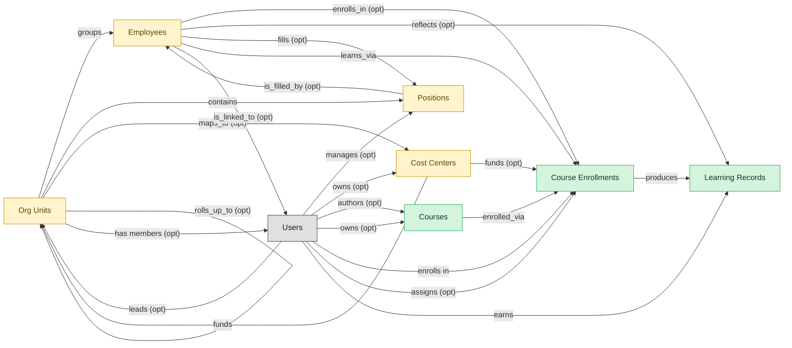

# Course Delivery

## 1. Overview

The core LMS workflow: course authoring, content delivery, enrollment, completion tracking, and transcript posting. Masters `courses`, `course_enrollments`, `learning_records`. Realizes COURSE-AUTHOR and CONTENT-DELIVERY capabilities. The backbone module every LMS deployment installs first; the other LMS modules embedded_master courses to reference content.

## 2. Entity summary

| Name | Description |
| --- | --- |
| Course Enrollments | Per-learner per-course state record: assigned date, due date, attempts, status (not_started, in_progress, completed, expired), score. The operational unit of learning tracking. |
| Courses | Atomic learning unit: e-learning module, video, live session, blended programme, external content. Carries content reference, duration, format, language, prerequisites, certification award. |
| Learning Records | Granular completion event for a course or activity, often xAPI / SCORM / cmi5 statement: actor, verb, object, result, timestamp. Feeds skill_profiles and certifications. |
| Cost Centers | Organisational unit for cost allocation: name, code, manager, hierarchy, currency. Drives variance reporting and project / departmental P&L. A near-universal foreign key in finance and payroll. |
| Employees | Canonical record of a person currently or formerly employed by the organization. Carries identity (legal name, contact, IDs), employment metadata (start date, end date, employment type, country), and pointers to position, job profile, org unit, manager, and life-event history. The most multi-mastered data object in the catalog: HCM masters the core HR slice, Payroll masters the comp/withholding slice, and IGA masters the identity/access slice. Onboarding, PA, and Talent Management consume or contribute. |
| Org Units | Node in the organizational hierarchy: division, business unit, department, team. Carries manager, cost center alignment, geographic scope, and parent/child relationships. HCM masters the operational hierarchy; EPM contributes the cost-center mapping (which would be Finance-mastered once a Finance/GL domain is loaded). |
| Positions | Approved slot in the org - a 'chair' with role definition, cost center, reporting line, location, and FTE allocation. Distinct from job_profiles (the catalog definition) and from employees (the person filling the slot). A position can be open, filled, or eliminated. SWP designs future positions via org_designs; HCM operationalizes them once approved. |

## 3. Entities catalog

| # | data_object | role | mastered in | necessity | pattern flags | notes |
| ---: | --- | --- | --- | --- | --- | --- |
| 1 | `course_enrollments` (Course Enrollments) | master | - | required | personal_content | - |
| 2 | `courses` (Courses) | master | - | required | - | - |
| 3 | `learning_records` (Learning Records) | master | - | required | personal_content | - |
| 4 | `cost_centers` (Cost Centers) | embedded_master | `ERP-FIN` _(domain-level, not modularized)_ | optional | - | - |
| 5 | `employees` (Employees) | embedded_master | `hcm-core-worker` | required | personal_content | - |
| 6 | `org_units` (Org Units) | embedded_master | `hcm-org-positions` | optional | - | - |
| 7 | `hcm_positions` (Positions) | embedded_master | `hcm-org-positions` | optional | single_approver | - |

## 4. Aliases and industry synonyms

_(no industry-scoped aliases or non-synonym alias types loaded for this scope; generic synonyms are omitted as common knowledge.)_

## 5. Relationships

### 5.1 Intra-scope edges

| from | verb | to | cardinality | kind | necessity | owner_side | notes |
| --- | --- | --- | --- | --- | --- | --- | --- |
| `org_units` | groups | `employees` | one_to_many | reference | required | source | intra \| cluster A \| HCM \| every employee rolls up to an org unit |
| `org_units` | contains | `hcm_positions` | one_to_many | reference | required | source | intra \| cluster A \| HCM \| positions live inside an org unit |
| `hcm_positions` | is_filled_by | `employees` | one_to_one | reference | optional | target | intra \| cluster A \| HCM \| a position may be vacant or filled by one incumbent |
| `cost_centers` | funds | `org_units` | one_to_many | reference | required | source | intra \| cluster A \| HCM \| org-unit labor cost rolls to a cost center \| auto-flipped from many_to_one |
| `employees` | enrolls_in | `course_enrollments` | one_to_many | reference | optional | source | cross \| cluster A \| HCM \| new-hire creation provisions LMS training |
| `org_units` | maps_to | `cost_centers` | one_to_one | reference | optional | source | cross \| cluster A \| HCM \| new org unit usually maps to ERP-FIN cost center |
| `courses` | enrolled_via | `course_enrollments` | one_to_many | reference | required | source | intra \| cluster A \| LMS \| enrollments reference a course |
| `course_enrollments` | produces | `learning_records` | one_to_many | composition | required | source | intra \| cluster A \| LMS \| transcript records derive from enrollments |
| `cost_centers` | funds | `course_enrollments` | one_to_many | reference | optional | source | intra \| cluster A \| LMS \| training cost allocation |
| `employees` | reflects | `learning_records` | one_to_many | reference | optional | source | cross \| cluster A \| LMS \| learning transcript visible on HCM employee record \| auto-flipped from many_to_one |
| `employees` | fills | `hcm_positions` | one_to_one | reference | optional | source | intra \| cluster A \| ONBOARDING \| embedded: incumbent of the position being onboarded |
| `employees` | learns_via | `course_enrollments` | one_to_many | reference | required | source | intra \| cluster A \| LMS \| embedded: learner identity |
| `org_units` | rolls_up_to | `org_units` | one_to_many | reference | optional | source | Hierarchical parent-child between org_units (Team -> Department -> Division -> BU -> Company). |

### 5.2 Built-in edges (`users` and other platform built-ins)

| from | verb | to | cardinality | necessity | owner_side | notes |
| --- | --- | --- | --- | --- | --- | --- |
| `employees` | is_linked_to | `users` | one_to_one | optional | target | users \| cluster A \| HCM \| every employee maps to an identity user |
| `users` | manages | `hcm_positions` | one_to_many | optional | source | users \| cluster A \| HCM \| manager-of-position relationship \| auto-flipped from many_to_one |
| `users` | leads | `org_units` | one_to_many | optional | source | users \| cluster A \| HCM \| org-unit head \| auto-flipped from many_to_one |
| `users` | owns | `cost_centers` | one_to_many | optional | source | users \| cluster A \| HCM \| cost-center owner \| auto-flipped from many_to_one |
| `users` | authors | `courses` | one_to_many | optional | source | users \| cluster A \| LMS \| course author / instructor \| auto-flipped from many_to_one |
| `users` | owns | `courses` | one_to_many | optional | source | users \| cluster A \| LMS \| content owner \| auto-flipped from many_to_one |
| `users` | enrolls in | `course_enrollments` | one_to_many | required | source | users \| cluster A \| LMS \| learner identity \| auto-flipped from many_to_one |
| `users` | assigns | `course_enrollments` | one_to_many | optional | source | users \| cluster A \| LMS \| assigning manager \| auto-flipped from many_to_one |
| `users` | earns | `learning_records` | one_to_many | required | source | users \| cluster A \| LMS \| transcript belongs to learner \| auto-flipped from many_to_one |
| `org_units` | has members | `users` | one_to_many | optional | target | Every user is assigned to one or more org_units (department membership). Drives assignment routing, RBAC scoping, and chargeback. |

### 5.3 Cross-scope edges

| from | verb | to | cardinality | necessity | notes |
| --- | --- | --- | --- | --- | --- |
| `job_profiles` | defines | `hcm_positions` | one_to_many | required | intra \| cluster A \| HCM \| job profile is the template for positions |
| `employees` | signs | `employment_contracts` | one_to_many | required | intra \| cluster A \| HCM \| contracts belong to the employee |
| `employees` | generates | `employment_events` | one_to_many | required | intra \| cluster A \| HCM \| hire/transfer/leave/term events for an employee |
| `employees` | triggers | `asset_lifecycle_events` | one_to_many | optional | intra \| cluster A \| HCM \| issue/return/recall events tied to the employee |
| `employees` | requests | `absence_requests` | one_to_many | optional | intra \| cluster A \| HCM \| self-service absence requests originate from employee |
| `employees` | holds | `skill_profiles` | one_to_one | optional | intra \| cluster A \| HCM \| each employee may have a skill profile |
| `org_units` | engages | `contingent_workers` | one_to_many | optional | intra \| cluster A \| HCM \| contingent workforce attaches to an org unit |
| `org_units` | is_scored_by | `engagement_drivers` | one_to_many | optional | intra \| cluster A \| HCM \| engagement drivers measured at org-unit level |
| `org_units` | is_measured_by | `people_kpis` | one_to_many | optional | intra \| cluster A \| HCM \| people KPIs aggregated by org unit |
| `employees` | triggers | `service_requests` | one_to_many | optional | cross \| cluster A \| HCM \| termination fan-out of offboarding service requests in ITSM |
| `employees` | feeds | `agency_time_entries` | one_to_many | optional | cross \| cluster A \| HCM \| agency staff termination freezes time entries in AGENCY-MGMT |
| `employees` | triggers | `iga_provisioning_events` | one_to_many | optional | cross \| cluster A \| HCM \| create/terminate/promote drives IGA account/entitlement actions |
| `org_units` | triggers | `iga_entitlement_definitions` | one_to_many | optional | cross \| cluster A \| HCM \| new/merged/disbanded org units drive IGA group lifecycle |
| `employees` | triggers | `pay_runs` | one_to_many | optional | cross \| cluster A \| HCM \| new-hire/termination/promotion drives Payroll comp activation and final pay |
| `hcm_positions` | spawns | `job_requisitions` | one_to_many | optional | cross \| cluster A \| HCM \| approved position becomes a requisition in ATS |
| `job_profiles` | maps_to | `courses` | many_to_many | optional | cross \| cluster A \| HCM \| job-profile competencies drive required training |
| `employees` | becomes | `career_aspirations` | one_to_one | optional | cross \| cluster A \| HCM \| new employee triggers talent-profile initialization in Talent-Mgmt |
| `employees` | becomes | `work_shifts` | one_to_many | optional | cross \| cluster A \| HCM \| new employee becomes a schedulable resource in WFM |
| `employees` | becomes | `compensation_statements` | one_to_one | optional | cross \| cluster A \| HCM \| new-hire/promotion drives Comp-Mgmt compensation basis |
| `salary_bands` | anchors | `hcm_positions` | one_to_many | optional | cross \| cluster A \| HCM \| approved position carries grade/band to Comp-Mgmt \| auto-flipped from many_to_one |
| `employees` | triggers | `benefit_enrollments` | one_to_many | optional | cross \| cluster A \| HCM \| create/terminate/event drives BEN-ADMIN eligibility & COBRA |
| `employees` | triggers | `corporate_cards` | one_to_many | optional | cross \| cluster A \| HCM \| termination deactivates corporate cards in EXPENSE |
| `employees` | spawns | `onboarding_journeys` | one_to_one | optional | cross \| cluster A \| HCM \| new-hire creation triggers onboarding plan instantiation |
| `employees` | spawns | `hr_cases` | one_to_many | optional | cross \| cluster A \| HCM \| termination kicks off offboarding HR case in HRSD |
| `employees` | feeds | `headcount_plans` | one_to_many | optional | cross \| cluster A \| HCM \| headcount actuals reconcile to SWP plan |
| `employees` | onboarded by | `onboarding_journeys` | one_to_many | required | intra \| cluster A \| ONBOARDING \| journey is bound to one new-hire employee \| auto-flipped from many_to_one |
| `employees` | finalized by | `onboarding_document_collections` | one_to_many | optional | cross \| cluster A \| ONBOARDING \| all docs collected → HCM finalizes employee record \| auto-flipped from many_to_one |
| `onboarding_tasks` | spawns | `course_enrollments` | one_to_many | optional | cross \| cluster A \| ONBOARDING \| compliance-training task triggers LMS enrollment |
| `courses` | sequenced_into | `learning_paths` | many_to_many | optional | intra \| cluster A \| LMS \| a path is an ordered collection of courses |
| `courses` | fulfills | `compliance_assignments` | one_to_many | optional | intra \| cluster A \| LMS \| compliance assignment satisfied by one or more courses |
| `courses` | grants | `learner_certifications` | one_to_many | optional | intra \| cluster A \| LMS \| certifications earned from courses |
| `skill_profiles` | updated by | `course_enrollments` | one_to_many | optional | intra \| cluster A \| LMS \| completion refreshes skill profile \| auto-flipped from many_to_one |
| `hcm_positions` | requires | `compliance_assignments` | one_to_many | optional | intra \| cluster A \| LMS \| role-based compliance training |
| `org_units` | sponsors | `compliance_assignments` | one_to_many | optional | intra \| cluster A \| LMS \| org-unit assigns compliance training |
| `employees` | reflected on | `compliance_assignments` | one_to_many | optional | cross \| cluster A \| LMS \| lapsed mandatory training surfaces on HCM employee record \| auto-flipped from many_to_one |
| `course_enrollments` | updates | `career_aspirations` | one_to_many | optional | cross \| cluster A \| LMS \| completion drives dev-plans / succession |
| `learning_records` | feeds | `people_kpis` | one_to_many | optional | cross \| cluster A \| LMS \| training completions feed PA L&D KPIs |
| `employees` | declares | `life_events` | one_to_many | optional | intra \| cluster A \| BEN-ADMIN \| embedded: employee declaring event |
| `org_units` | sponsors | `benefit_plans` | many_to_many | optional | intra \| cluster A \| BEN-ADMIN \| embedded: org-level offering |
| `employees` | updated by | `life_events` | one_to_many | optional | cross \| cluster A \| BEN-ADMIN \| approved life event may update dependents / emergency contacts in HCM \| auto-flipped from many_to_one |
| `survey_campaigns` | targets | `org_units` | many_to_many | optional | intra \| cluster A \| EMP-EXP \| embedded: org-unit scoping |
| `org_units` | owns | `action_plans` | one_to_many | optional | intra \| cluster A \| EMP-EXP \| org-unit accountable for action plan \| auto-flipped from many_to_one |
| `employees` | submits | `survey_responses` | one_to_many | optional | intra \| cluster A \| EMP-EXP \| respondent identity at employee level \| auto-flipped from many_to_one |
| `employees` | flagged on | `engagement_drivers` | one_to_many | optional | cross \| cluster A \| EMP-EXP \| high attrition-risk surfaces on HCM employee dashboard \| auto-flipped from many_to_one |
| `employees` | reflected on | `engagement_drivers` | one_to_many | optional | cross \| cluster A \| EMP-EXP \| survey-cycle results visible to HRBPs in HCM \| auto-flipped from many_to_one |
| `employees` | raises | `hr_cases` | one_to_many | required | intra \| cluster A \| HRSD \| requester identity (employee scope) \| auto-flipped from many_to_one |
| `employees` | updated by | `hr_cases` | one_to_many | optional | cross \| cluster A \| HRSD \| HR cases involving data changes flow back to HCM \| auto-flipped from many_to_one |
| `case_categories` | drives | `employees` | one_to_many | optional | cross \| cluster A \| HRSD \| taxonomy affects HCM employee-portal self-service routing |
| `legal_holds` | identifies_custodians_from | `employees` | many_to_many | optional | cross \| cluster C \| LSD \| HCM employee data drives custodian id |
| `legal_advice_records` | references | `employees` | many_to_many | optional | cross \| cluster C \| LSD \| employee-related advice from HR case |
| `employees` | is host for | `host_assignments` | one_to_many | required | cross \| cluster C \| VIS-MGMT \| host notifications trigger employee engagement \| auto-flipped from many_to_one |
| `contingent_workers` | reviewed_against | `employees` | one_to_one | optional | cross \| cluster D \| VMS \| tenure-threshold crossover triggers HCM reclassification/conversion |
| `candidates` | becomes | `employees` | one_to_one | required | cross \| ATS→HCM \| candidate.hired creates employee record; identity handoff |
| `pre_employees` | promotes to | `employees` | one_to_one | required | cross \| ATS->HCM \| pre_employee.activated converts the pre-hire record into the canonical HCM employee record |
| `employees` | enrolls_in | `benefit_enrollments` | one_to_many | required | intra \| cluster A \| BEN-ADMIN \| embedded: enrollee identity |
| `survey_campaigns` | targets | `employees` | many_to_many | optional | intra \| cluster A \| EMP-EXP \| embedded: invited population |
| `workforce_scenarios` | drives | `hcm_positions` | one_to_many | required | cross \| SWP→HCM \| adopted scenario drives HCM position changes. |
| `org_designs` | proposes | `hcm_positions` | one_to_many | required | cross \| SWP→HCM \| org_design.published proposes new hcm_positions for creation. |

## 6. Cross-domain context

### 6.1 Master consumers (other modules / domains that embed this scope's masters)

| data_object | other module / domain | role | necessity | notes |
| --- | --- | --- | --- | --- |
| `course_enrollments` | LMS-SKILLS (Skills and Learning Paths) - LMS | embedded_master | required | - |
| `course_enrollments` | PA-PREDICTIVE-MODELS (Predictive Models) - PA | consumer | optional | - |
| `course_enrollments` | TALENT-SUCCESSION-CAREER (Succession and Career Planning) - TALENT-MGMT | consumer | optional | - |
| `courses` | LMS-COMPLIANCE-TRAINING (Compliance Training) - LMS | embedded_master | required | - |
| `learning_records` | PA-PREDICTIVE-MODELS (Predictive Models) - PA | derived | required | - |

### 6.2 Outbound handoffs (events this scope publishes)

| source module | target domain | target module | trigger_event | payload | integration | friction | description |
| --- | --- | --- | --- | --- | --- | --- | --- |
| LMS-COURSE-DELIVERY | HCM | _(domain-level)_ | `learning_record.posted` | `learning_records` | event_stream | low | Authoritative learning transcript visible in HCM employee record. |
| LMS-COURSE-DELIVERY | LMS | LMS-SKILLS | `course_enrollment.completed` | `course_enrollments` | lifecycle_progression | low | - |
| LMS-COURSE-DELIVERY | LMS | LMS-COMPLIANCE-TRAINING | `course.published` | `courses` | lifecycle_progression | low | - |
| LMS-COURSE-DELIVERY | TALENT-MGMT | TALENT-SUCCESSION-CAREER | `course_enrollment.completed` | `course_enrollments` | event_stream | low | Course completion updates skill-profile; TALENT-MGMT reflects in dev-plans and succession. |

### 6.3 Inbound handoffs (events this scope reacts to)

| target module | source domain | source module | trigger_event | payload | integration | friction | description |
| --- | --- | --- | --- | --- | --- | --- | --- |
| LMS-COURSE-DELIVERY | HCM | HCM-CORE-WORKER | `employee.created` | `employees` | event_stream | low | New-hire creation provisions required-training assignments (compliance, role-based). Drives day-one and 30-day learning workflows. |

### 6.4 Master providers (modules / domains that own masters this scope embeds)

| data_object | role here | necessity | canonical owner(s) | slice notes |
| --- | --- | --- | --- | --- |
| `cost_centers` | embedded_master | optional | ERP-FIN (Core ERP Financial Management) | - |
| `employees` | embedded_master | required | HCM-CORE-WORKER (HCM), PAYROLL (Payroll Management), IGA (Identity Governance and Administration), MDM (Master Data Management) | - |
| `hcm_positions` | embedded_master | optional | HCM-ORG-POSITIONS (HCM) | - |
| `org_units` | embedded_master | optional | HCM-ORG-POSITIONS (HCM) | - |

## 7. Lifecycle states (per master)

### `course_enrollments` (Course Enrollment)

| order | state_name | initial? | terminal? | requires_permission? | derived gate | description |
| --- | --- | --- | --- | --- | --- | --- |
| 1 | `enrolled` | ✓ | - | - | - | Learner enrolled in the course but has not started. |
| 2 | `in_progress` | - | - | - | - | Learner has begun the course content or activities. |
| 3 | `completed` | - | ✓ | ✓ | `lms-course-delivery:complete` | Learner met all completion criteria with a passing score. |
| 4 | `failed` | - | ✓ | ✓ | `lms-course-delivery:fail` | Learner did not meet the passing criteria within allowed attempts. |
| 5 | `expired` | - | ✓ | ✓ | `lms-course-delivery:expire` | Enrollment closed unmet at the due date or content expiry. |
| 6 | `withdrawn` | - | ✓ | ✓ | `lms-course-delivery:withdraw` | Learner withdrew or was unenrolled before completion. |

### `courses` (Course)

| order | state_name | initial? | terminal? | requires_permission? | derived gate | description |
| --- | --- | --- | --- | --- | --- | --- |
| 1 | `draft` | ✓ | - | - | - | Course being authored by an instructional designer or SME. |
| 2 | `in_review` | - | - | - | - | Content under review by L&D or compliance reviewers. |
| 3 | `published` | - | - | ✓ | `lms-course-delivery:publish` | Course released to the catalog and available for enrollment. |
| 4 | `retired` | - | ✓ | ✓ | `lms-course-delivery:retire` | Course removed from the catalog and kept for historical transcripts. |

### `learning_records` (Learning Record)

| order | state_name | initial? | terminal? | requires_permission? | derived gate | description |
| --- | --- | --- | --- | --- | --- | --- |
| 1 | `recorded` | ✓ | - | - | - | Statement captured from the content runtime or external source. |
| 2 | `validated` | - | ✓ | ✓ | `lms-course-delivery:validate` | Record validated against schema and posted to the learner transcript. |
| 3 | `voided` | - | ✓ | ✓ | `lms-course-delivery:void` | Record voided due to data error, duplicate, or content reset. |

## 8. Permissions and business rules (derived)

### 8.1 Permissions

| permission | tier | description | included in `:admin`? |
| --- | --- | --- | --- |
| `lms-course-delivery:read` | baseline-read | Read access to every entity in the module | ✓ |
| `lms-course-delivery:manage` | baseline-manage | Edit operational records | ✓ |
| `lms-course-delivery:admin` | baseline-admin | Edit reference data and inherit every workflow gate below | - |
| `lms-course-delivery:publish` | workflow-gate (lifecycle) | Transition `courses` into state `published` | ✓ |
| `lms-course-delivery:retire` | workflow-gate (lifecycle) | Transition `courses` into state `retired` | ✓ |
| `lms-course-delivery:complete` | workflow-gate (lifecycle) | Transition `course_enrollments` into state `completed` | ✓ |
| `lms-course-delivery:fail` | workflow-gate (lifecycle) | Transition `course_enrollments` into state `failed` | ✓ |
| `lms-course-delivery:expire` | workflow-gate (lifecycle) | Transition `course_enrollments` into state `expired` | ✓ |
| `lms-course-delivery:withdraw` | workflow-gate (lifecycle) | Transition `course_enrollments` into state `withdrawn` | ✓ |
| `lms-course-delivery:validate` | workflow-gate (lifecycle) | Transition `learning_records` into state `validated` | ✓ |
| `lms-course-delivery:void` | workflow-gate (lifecycle) | Transition `learning_records` into state `voided` | ✓ |
| `lms-course-delivery:view_all_course_enrollments` | override (personal_content) | View all `course_enrollments` rows beyond row-scope | ✓ |
| `lms-course-delivery:manage_all_course_enrollments` | override (personal_content) | Manage all `course_enrollments` rows beyond row-scope | ✓ |
| `lms-course-delivery:view_all_learning_records` | override (personal_content) | View all `learning_records` rows beyond row-scope | ✓ |
| `lms-course-delivery:manage_all_learning_records` | override (personal_content) | Manage all `learning_records` rows beyond row-scope | ✓ |

### 8.2 Business rules

| rule_name | data_object | source flag | intent |
| --- | --- | --- | --- |
| `course_enrollment_edit_scope` | `course_enrollments` | has_personal_content | Row-scope by default; override via `lms-course-delivery:view_all_course_enrollments` / `lms-course-delivery:manage_all_course_enrollments` |
| `learning_record_edit_scope` | `learning_records` | has_personal_content | Row-scope by default; override via `lms-course-delivery:view_all_learning_records` / `lms-course-delivery:manage_all_learning_records` |
