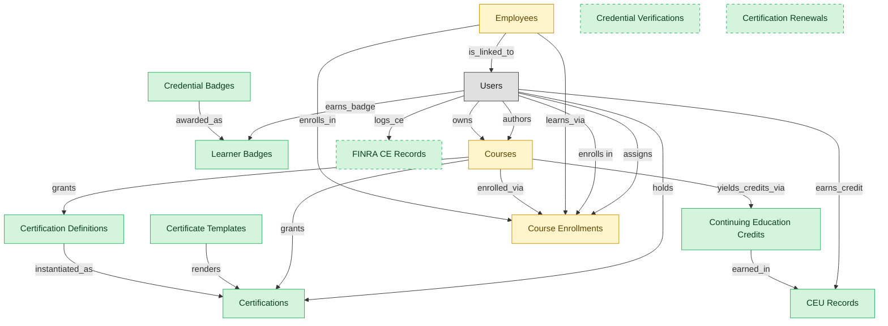

# Credentials, Badges and Continuing Education

## 1. Overview

Catalog and lifecycle for certifications, micro-credential badges, and continuing-education credits. Masters learner_certifications (re-mastered from LMS-COMPLIANCE-TRAINING) since professional development, FINRA CE, internal product certifications, and Open-Badges micro-credentials all live here, not just compliance training. Compliance training embeds learner_certifications for the regulated-training certification workflow.

## 2. Entity summary

| Name | data_object | Description |
| --- | --- | --- |
| Certificate Templates | `certificate_templates` | PDF / image template used to issue a certificate to a learner; carries layout and dynamic fields. |
| Certification Definitions | `certification_definitions` | Catalog of certification types: name, issuing authority, validity period, recertification policy, prerequisite courses. |
| Certification Renewals | `certification_renewals` | Renewal cycle of an existing certification, distinct from initial issuance. |
| Certifications | `learner_certifications` | Issued credential against a worker (internal certification, vendor cert, regulatory cert) with issue date, expiry, issuing body, and renewal rules. Drives recertification campaigns. |
| CEU Records | `ceu_records` | Earned-credit ledger row per learner; CEU evidence for state-CE, NASBA, and similar professional licensure reporting. |
| Continuing Education Credits | `continuing_education_credits` | CEU credit-value master: credit hours, accrediting body, eligible courses. |
| Credential Badges | `credential_badges` | Open Badges / micro-credential definition: criteria, image, issuer, expiration policy. Distinct from visitor_badges (physical access). |
| Credential Verifications | `credential_verifications` | Third-party verification handshake for an issued badge or credential (Open Badges 3.0). |
| FINRA CE Records | `finra_ce_records` | FINRA Rule 1240 continuing-education ledger row per registered representative; regulator-evidence retention. |
| Learner Badges | `learner_badges` | Earned-badge junction per learner per badge; carries earn date, evidence URL, and verification token. |
| Course Enrollments | `course_enrollments` | Per-learner per-course state record: assigned date, due date, attempts, status (not_started, in_progress, completed, expired), score. The operational unit of learning tracking. |
| Courses | `courses` | Atomic learning unit: e-learning module, video, live session, blended program, external content. Carries content reference, duration, format, language, prerequisites, certification award. |
| Employees | `employees` | Canonical record of a person currently or formerly employed by the organization. Carries identity (legal name, contact, IDs), employment metadata (start date, end date, employment type, country), and pointers to position, job profile, org unit, manager, and life-event history. The most multi-mastered data object in the catalog: HCM masters the core HR slice, Payroll masters the comp/withholding slice, and IGA masters the identity/access slice. Onboarding, PA, and Talent Management consume or contribute. |

## 3. Entities catalog

| # | data_object | canonical code | singular | plural | role | mastered in | mastered label | necessity | pattern flags | entity_type | write tier | notes |
| ---: | --- | --- | --- | --- | --- | --- | --- | --- | --- | --- | --- | --- |
| 1 | `certificate_templates` | `certificate_templates` | Certificate Template | Certificate Templates | master | - | - | required | - | catalog | `:admin` | - |
| 2 | `certification_definitions` | `certification_definitions` | Certification Definition | Certification Definitions | master | - | - | required | - | catalog | `:admin` | - |
| 3 | `certification_renewals` | `certification_renewals` | Certification Renewal | Certification Renewals | master | - | - | optional | personal_content | operational_workflow | `:manage` | - |
| 4 | `learner_certifications` | `learner_certifications` | Certification | Certifications | master | - | - | required | personal_content, submit_lock | operational_workflow | `:manage` | - |
| 5 | `ceu_records` | `ceu_records` | CEU Record | CEU Records | master | - | - | required | personal_content, submit_lock | operational_workflow | `:manage` | - |
| 6 | `continuing_education_credits` | `continuing_education_credits` | Continuing Education Credit | Continuing Education Credits | master | - | - | required | - | catalog | `:admin` | - |
| 7 | `credential_badges` | `credential_badges` | Credential Badge | Credential Badges | master | - | - | required | - | catalog | `:admin` | - |
| 8 | `credential_verifications` | `credential_verifications` | Credential Verification | Credential Verifications | master | - | - | optional | personal_content | operational_workflow | `:manage` | - |
| 9 | `finra_ce_records` | `finra_ce_records` | FINRA CE Record | FINRA CE Records | master | - | - | optional | personal_content, submit_lock | operational_workflow | `:manage` | - |
| 10 | `learner_badges` | `learner_badges` | Learner Badge | Learner Badges | master | - | - | required | personal_content, submit_lock | operational_workflow | `:manage` | - |
| 11 | `course_enrollments` | `course_enrollments` | Course Enrollment | Course Enrollments | embedded_master | `lms-course-delivery` | Course Delivery | required | personal_content | operational_workflow | `:manage` | - |
| 12 | `courses` | `courses` | Course | Courses | embedded_master | `lms-course-delivery` | Course Delivery | required | - | operational_workflow | `:manage` | - |
| 13 | `employees` | `employees` | Employee | Employees | embedded_master | `hcm-core-worker` | Core Worker Record | required | personal_content | operational_workflow | `:manage` | - |

## 4. Aliases and industry synonyms

_(none: no industry-scoped aliases for this scope)_

## 5. Relationships

### 5.1 Intra-scope edges

| from | verb | to | cardinality | kind | necessity | owner_side | delete_mode | fk_format | notes |
| --- | --- | --- | --- | --- | --- | --- | --- | --- | --- |
| `certification_definitions` | instantiated_as | `learner_certifications` | one_to_many | reference | required | target | restrict | reference | - |
| `certificate_templates` | renders | `learner_certifications` | one_to_many | reference | optional | target | clear | reference | - |
| `credential_badges` | awarded_as | `learner_badges` | one_to_many | reference | required | target | restrict | reference | - |
| `continuing_education_credits` | earned_in | `ceu_records` | one_to_many | reference | required | target | restrict | reference | - |
| `courses` | grants | `certification_definitions` | many_to_many | association | optional | source | clear | reference | - |
| `courses` | yields_credits_via | `continuing_education_credits` | many_to_many | association | optional | source | clear | reference | - |
| `employees` | enrolls_in | `course_enrollments` | one_to_many | reference | optional | source | clear | reference | - |
| `courses` | enrolled_via | `course_enrollments` | one_to_many | reference | required | source | restrict | reference | - |
| `courses` | grants | `learner_certifications` | one_to_many | reference | optional | source | clear | reference | - |
| `employees` | learns_via | `course_enrollments` | one_to_many | reference | required | source | restrict | reference | - |

### 5.2 Built-in edges (`users` and other platform built-ins)

| from | verb | to | cardinality | necessity | owner_side | delete_mode | fk_format | notes |
| --- | --- | --- | --- | --- | --- | --- | --- | --- |
| `users` | owns | `courses` | one_to_many | optional | source | clear | reference | - |
| `users` | earns_badge | `learner_badges` | one_to_many | required | source | restrict | reference | - |
| `users` | earns_credit | `ceu_records` | one_to_many | required | source | restrict | reference | - |
| `users` | logs_ce | `finra_ce_records` | one_to_many | required | source | restrict | reference | - |
| `employees` | is_linked_to | `users` | one_to_one | optional | target | clear | reference | - |
| `users` | authors | `courses` | one_to_many | optional | source | clear | reference | - |
| `users` | enrolls in | `course_enrollments` | one_to_many | required | source | restrict | reference | - |
| `users` | assigns | `course_enrollments` | one_to_many | optional | source | clear | reference | - |
| `users` | holds | `learner_certifications` | one_to_many | required | source | restrict | reference | - |

### 5.3 Cross-scope edges

#### 5.3a Outbound from this scope's masters and contributors

_Edges this scope drives: the in-scope endpoint has `role` of `master` or `contributor`._

| from | verb | to | cardinality | necessity | delete_mode | fk_format | notes |
| --- | --- | --- | --- | --- | --- | --- | --- |
| `skill_profiles` | updated by | `learner_certifications` | one_to_many | optional | none | n/a | - |

#### 5.3b Context edges on embedded shells and consumed entities

_Edges the canonical owner drives, shown for context: the in-scope endpoint has `role` of `embedded_master`, `consumer`, or `derived`._

| from | verb | to | cardinality | necessity | delete_mode | fk_format | notes |
| --- | --- | --- | --- | --- | --- | --- | --- |
| `employees` | triggers | `iga_provisioning_events` | one_to_many | optional | none | n/a | - |
| `employees` | finalized by | `onboarding_document_collections` | one_to_many | optional | none | n/a | - |
| `pre_employees` | promotes to | `employees` | one_to_one | required | none (required-if-present) | n/a | - |
| `legal_holds` | identifies_custodians_from | `employees` | many_to_many | optional | none | n/a | - |
| `legal_advice_records` | references | `employees` | many_to_many | optional | none | n/a | - |
| `employees` | is host for | `host_assignments` | one_to_many | required | none (required-if-present) | n/a | - |
| `courses` | has_version | `course_versions` | one_to_many | required | ⚠ audit: required composed child out of scope | n/a | - |
| `course_enrollments` | yields | `course_completions` | one_to_many | optional | none | n/a | - |
| `courses` | classified_as | `course_categories` | many_to_many | optional | none | n/a | - |
| `courses` | tagged_with | `course_tags` | many_to_many | optional | none | n/a | - |
| `course_catalogs` | lists | `courses` | many_to_many | optional | none | n/a | - |
| `courses` | reviewed_via | `course_reviews` | one_to_many | optional | none | n/a | - |
| `courses` | rated_via | `course_ratings` | one_to_many | optional | none | n/a | - |
| `courses` | discussed_in | `course_discussions` | one_to_many | optional | none | n/a | - |
| `courses` | scheduled_as | `course_offerings` | one_to_many | optional | none | n/a | - |
| `learning_path_steps` | references | `courses` | one_to_many | optional | none | n/a | - |
| `automated_enrollment_rules` | creates | `course_enrollments` | one_to_many | optional | none | n/a | - |
| `contingent_workers` | converts_to | `employees` | one_to_one | optional | none | n/a | - |
| `merit_recommendations` | applies to | `employees` | one_to_one | optional | none | n/a | - |
| `equity_grants` | granted to | `employees` | one_to_one | optional | none | n/a | - |
| `compensation_statements` | issued to | `employees` | one_to_one | optional | none | n/a | - |
| `employees` | requests | `absence_requests` | one_to_many | optional | none | n/a | - |
| `org_units` | groups | `employees` | one_to_many | required | none (required-if-present) | n/a | - |
| `hcm_positions` | is_filled_by | `employees` | one_to_one | optional | none | n/a | - |
| `employees` | signs | `employment_contracts` | one_to_many | required | ⚠ audit: required composed child out of scope | n/a | - |
| `employees` | generates | `employment_events` | one_to_many | required | ⚠ audit: required composed child out of scope | n/a | - |
| `employees` | triggers | `asset_lifecycle_events` | one_to_many | optional | none | n/a | - |
| `employees` | holds | `skill_profiles` | one_to_one | optional | none | n/a | - |
| `employees` | triggers | `service_requests` | one_to_many | optional | none | n/a | - |
| `employees` | triggers | `pay_runs` | one_to_many | optional | none | n/a | - |
| `job_profiles` | maps_to | `courses` | many_to_many | optional | none | n/a | - |
| `employees` | becomes | `career_aspirations` | one_to_one | optional | none | n/a | - |
| `employees` | becomes | `work_shifts` | one_to_many | optional | none | n/a | - |
| `employees` | becomes | `compensation_statements` | one_to_one | optional | none | n/a | - |
| `employees` | triggers | `benefit_enrollments` | one_to_many | optional | none | n/a | - |
| `employees` | triggers | `corporate_cards` | one_to_many | optional | none | n/a | - |
| `employees` | spawns | `onboarding_journeys` | one_to_one | optional | none | n/a | - |
| `employees` | spawns | `hr_cases` | one_to_many | optional | none | n/a | - |
| `employees` | feeds | `headcount_plans` | one_to_many | optional | none | n/a | - |
| `employees` | feeds | `agency_time_entries` | one_to_many | optional | none | n/a | - |
| `employees` | onboarded by | `onboarding_journeys` | one_to_many | required | none (required-if-present) | n/a | - |
| `onboarding_tasks` | spawns | `course_enrollments` | one_to_many | optional | none | n/a | - |
| `courses` | sequenced_into | `learning_paths` | many_to_many | optional | none | n/a | - |
| `course_enrollments` | produces | `learning_records` | one_to_many | required | ⚠ audit: required composed child out of scope | n/a | - |
| `courses` | fulfills | `compliance_assignments` | one_to_many | optional | none | n/a | - |
| `skill_profiles` | updated by | `course_enrollments` | one_to_many | optional | none | n/a | - |
| `cost_centers` | funds | `course_enrollments` | one_to_many | optional | none | n/a | - |
| `employees` | reflects | `learning_records` | one_to_many | optional | none | n/a | - |
| `employees` | reflected on | `compliance_assignments` | one_to_many | optional | none | n/a | - |
| `course_enrollments` | updates | `career_aspirations` | one_to_many | optional | none | n/a | - |
| `employees` | declares | `life_events` | one_to_many | optional | none | n/a | - |
| `employees` | updated by | `life_events` | one_to_many | optional | none | n/a | - |
| `employees` | submits | `survey_responses` | one_to_many | optional | none | n/a | - |
| `employees` | flagged on | `engagement_drivers` | one_to_many | optional | none | n/a | - |
| `employees` | reflected on | `engagement_drivers` | one_to_many | optional | none | n/a | - |
| `employees` | raises | `hr_cases` | one_to_many | required | none (required-if-present) | n/a | - |
| `employees` | updated by | `hr_cases` | one_to_many | optional | none | n/a | - |
| `case_categories` | drives | `employees` | one_to_many | optional | none | n/a | - |
| `contingent_workers` | reviewed_against | `employees` | one_to_one | optional | none | n/a | - |
| `candidates` | becomes | `employees` | one_to_one | required | none (required-if-present) | n/a | - |
| `employees` | fills | `hcm_positions` | one_to_one | optional | none | n/a | - |
| `employees` | enrolls_in | `benefit_enrollments` | one_to_many | required | none (required-if-present) | n/a | - |
| `survey_campaigns` | targets | `employees` | many_to_many | optional | none | n/a | - |
| `employees` | has | `emergency_contacts` | one_to_many | required | ⚠ audit: required composed child out of scope | n/a | - |
| `employees` | has | `work_eligibility_documents` | one_to_many | required | ⚠ audit: required composed child out of scope | n/a | - |
| `employees` | has | `national_ids` | one_to_many | required | ⚠ audit: required composed child out of scope | n/a | - |
| `employees` | has | `worker_addresses` | one_to_many | required | ⚠ audit: required composed child out of scope | n/a | - |
| `employees` | has | `employee_dependents` | one_to_many | required | ⚠ audit: required composed child out of scope | n/a | - |
| `employees` | has | `worker_change_requests` | one_to_many | required | none (required-if-present) | n/a | - |
| `employees` | applies_as | `candidates` | one_to_many | optional | none | n/a | - |
| `employees` | is the worker behind | `traveler_profiles` | one_to_one | optional | none | n/a | - |
| `exit_risk_assessments` | assesses | `employees` | one_to_one | optional | none | n/a | - |
| `insider_risk_cases` | concerns | `employees` | one_to_many | optional | none | n/a | - |
| `frontline_recognitions` | recognizes | `employees` | one_to_many | required | none (required-if-present) | n/a | - |
| `advocate_profiles` | represents | `employees` | one_to_one | required | none (required-if-present) | n/a | - |

## 6. Cross-domain context

### 6.1 Master consumers (other modules / domains that embed this scope's masters)

| data_object | other module / domain | role | necessity | notes |
| --- | --- | --- | --- | --- |
| `learner_certifications` | IGA-AUTO-PROVISIONING (IGA Automated Provisioning) - IGA | consumer | optional | - |
| `learner_certifications` | LMS-AUTOMATION (Learning Automation) - LMS | embedded_master | required | - |
| `learner_certifications` | LMS-COMPLIANCE-TRAINING (Compliance Training) - LMS | embedded_master | required | - |
| `learner_certifications` | LMS-PATHS (Learning Paths) - LMS | embedded_master | required | - |
| `learner_certifications` | SKILLS-MGMT-PROFILE (Worker Skill Profiles and Assessments) - SKILLS-MGMT | contributor | optional | - |
| `learner_certifications` | TRAINING-RECORDS-STARTER (Training Records (Compliance Documentation Starter)) - LMS | embedded_master | required | - |

### 6.2 Outbound handoffs (events this scope publishes)

| source module | target domain | target module | trigger_event | transition | payload | integration | friction | description |
| --- | --- | --- | --- | --- | --- | --- | --- | --- |
| HCM-CORE-WORKER | HRSD | HRSD-CASE-MGMT | `employee.terminated` | `terminated` _(lifecycle)_ | `employees` | event_stream | medium | Termination kicks off offboarding case (exit interview, knowledge transfer, paperwork). Multiple downstream HRSD tasks created. |
| HCM-CORE-WORKER | IGA | IGA-ACCESS-REQUEST | `employee.created` | `created` _(lifecycle)_ | `employees` | api_call | high | New employee in HCM triggers directory account creation and birthright-role assignment in IGA. High friction because role-to-entitlement mappings drift per business unit, and IGA frequently needs additional context (cost center, manager, location) that arrives later in the journey. Same trigger event as the HCM → Onboarding and HCM → Payroll handoffs. |
| HCM-CORE-WORKER | IGA | IGA-ACCESS-REQUEST | `employee.promoted` | _(lifecycle)_ | `employees` | event_stream | high | Promotion (mover event) requires entitlement re-evaluation: add new role access, revoke prior-role access. SoD risk window during transition. |
| HCM-CORE-WORKER | IGA | IGA-ACCESS-REQUEST | `employee.terminated` | `terminated` _(lifecycle)_ | `employees` | api_call | high | Termination in HCM must immediately revoke identity access in IGA: disable account, remove group memberships, terminate app-level entitlements. Failure modes: contractor terminations not flowing (different HCM table); rehires confuse the de-provisioning idempotency; access lingers after termination is the canonical audit finding. |
| LMS-CREDENTIALS | IGA | IGA-AUTO-PROVISIONING | `learner_certification.expired` | _(threshold)_ | `learner_certifications` | api_call | high | - |
| LMS-CREDENTIALS | IGA | IGA-AUTO-PROVISIONING | `learner_certification.renewed` | _(lifecycle)_ | `learner_certifications` | api_call | medium | - |
| LMS-CREDENTIALS | IGA | IGA-AUTO-PROVISIONING | `learner_certification.revoked` | _(lifecycle)_ | `learner_certifications` | api_call | high | - |
| HCM-CORE-WORKER | HCM | HCM-LIFECYCLE-WORKFLOWS | `employee.created` | `created` _(lifecycle)_ | `employees` | lifecycle_progression | low | New worker record surfaces in self-service: manager dashboard, new-hire welcome surface, lifecycle task inbox. In-process state read; no message bus. |
| HCM-CORE-WORKER | HCM | HCM-LIFECYCLE-WORKFLOWS | `employee.terminated` | `terminated` _(lifecycle)_ | `employees` | lifecycle_progression | low | Termination drives the offboarding self-service flow: exit-interview prompt, equipment-return task, knowledge-handoff surfaces in the lifecycle workflow module. |
| HCM-CORE-WORKER | PAYROLL | PAYROLL-RUN | `employee.created` | `created` _(lifecycle)_ | `employees` | api_call | medium | New employee in HCM triggers comp profile activation in Payroll: gross-to-net rules selected by jurisdiction, deductions initialised, bank account and tax setup collected via Onboarding flow. Same trigger event as the HCM → Onboarding handoff; both subscribe to the employee.created event. |
| HCM-CORE-WORKER | PAYROLL | PAYROLL-RUN | `employee.promoted` | _(lifecycle)_ | `employees` | event_stream | medium | Promotion typically includes salary change. Effective-dated change must flow to PAYROLL with retroactive handling. |
| HCM-CORE-WORKER | PAYROLL | PAYROLL-RUN | `employee.terminated` | `terminated` _(lifecycle)_ | `employees` | event_stream | high | Termination drives final pay (severance, accrued PTO payout, prorated bonus). Cross-vendor stack when HCM and PAYROLL are different vendors; retro-adjustments are common. |
| LMS-COURSE-DELIVERY | LMS | LMS-COMPLIANCE-TRAINING | `course.published` | _(lifecycle)_ | `courses` | lifecycle_progression | low | - |
| LMS-CREDENTIALS | LMS | LMS-COMPLIANCE-TRAINING | `certification_definition.published` | _(lifecycle)_ | `certification_definitions` | lifecycle_progression | low | - |
| HCM-CORE-WORKER | TALENT-MGMT | TALENT-PERFORMANCE-MGMT | `employee.created` | `created` _(lifecycle)_ | `employees` | api_call | low | New employee triggers talent-profile initialisation in Talent Management: career aspirations, mobility preferences, skills profile stubs. Same employee.created trigger as Onboarding / Payroll / IGA handoffs. |
| HCM-CORE-WORKER | TALENT-MGMT | TALENT-PERFORMANCE-MGMT | `employee.promoted` | _(lifecycle)_ | `employees` | event_stream | low | Promotion updates succession-plan slots and 9-box placement context. |
| LMS-COURSE-DELIVERY | TALENT-MGMT | TALENT-SUCCESSION-CAREER | `course_enrollment.completed` | _(lifecycle)_ | `course_enrollments` | event_stream | low | Course completion updates skill-profile; TALENT-MGMT reflects in dev-plans and succession. |
| LMS-CREDENTIALS | TALENT-MGMT | TALENT-SUCCESSION-CAREER | `learner_badge.earned` | _(lifecycle)_ | `learner_badges` | event_stream | low | - |
| HCM-CORE-WORKER | WFM | _(domain-level)_ | `employee.created` | `created` _(lifecycle)_ | `employees` | event_stream | low | New employee provisioned in HCM becomes a schedulable resource in WFM - identity, position, base FTE. Mid-shift onboarding and badge-binding are typical edge cases. |
| HCM-CORE-WORKER | COMP-MGMT | COMP-PLANNING | `employee.created` | `created` _(lifecycle)_ | `employees` | event_stream | low | New-hire creation provides compensation basis. Bands and grades attach via job profile. |
| HCM-CORE-WORKER | COMP-MGMT | COMP-PLANNING | `employee.promoted` | _(lifecycle)_ | `employees` | event_stream | low | Promotion event triggers off-cycle compensation review (eligibility, band placement, increase recommendation) in COMP-MGMT. |
| HCM-CORE-WORKER | BEN-ADMIN | BEN-ENROLLMENT | `employee.created` | `created` _(lifecycle)_ | `employees` | event_stream | medium | New-hire creation seeds benefits eligibility (waiting periods, default elections). Drives carrier feed setup at end of new-hire window. |
| HCM-CORE-WORKER | BEN-ADMIN | BEN-ENROLLMENT | `employee.terminated` | `terminated` _(lifecycle)_ | `employees` | event_stream | high | Termination triggers benefits termination, COBRA / equivalent notices, and dependent coverage decisions. Late notifications cause coverage gaps. |
| HCM-CORE-WORKER | EXPENSE | _(domain-level)_ | `employee.terminated` | `terminated` _(lifecycle)_ | `employees` | event_stream | medium | Termination triggers EXPENSE corporate-card deactivation and outstanding-report close-out. |
| HCM-CORE-WORKER | PSA | PSA-PROJECT-DELIVERY | `employee.terminated` | `terminated` _(lifecycle)_ | `employees` | event_stream | medium | Terminated employee may be the assignee on open project_tasks. PROJECT-DELIVERY needs to surface affected tasks for reassignment or completion handover. |
| HCM-CORE-WORKER | PSA | PSA-RESOURCE-MGMT | `attrition_risk.high` | _(state_change)_ | `employees` | event_stream | high | ML attrition score crosses high threshold. PSA resource managers may proactively rebalance assignments away from at-risk consultants on critical engagements. High friction: probabilistic→deterministic pattern (score requires judgment call), false-positive volume can swamp the staffing queue. |
| HCM-CORE-WORKER | PSA | PSA-RESOURCE-MGMT | `employee.created` | `created` _(lifecycle)_ | `employees` | event_stream | low | New consultant hired. PSA resource pool adds the employee as available capacity; skill inventory record is seeded for downstream certifications. |
| HCM-CORE-WORKER | PSA | PSA-RESOURCE-MGMT | `employee.promoted` | _(lifecycle)_ | `employees` | event_stream | low | Consultant promoted (level / job profile change). PSA reevaluates billable rate band and skill inventory; existing project_assignments may need rate revision. |
| HCM-CORE-WORKER | PSA | PSA-RESOURCE-MGMT | `employee.terminated` | `terminated` _(lifecycle)_ | `employees` | event_stream | medium | Consultant terminated. PSA must release any active project_assignments, return capacity to bench and re-allocate forecast. Medium friction: leaver-event timing varies (immediate vs notice period) and active assignments may need urgent rebalancing. |
| LMS-COURSE-DELIVERY | SKILLS-MGMT | SKILLS-MGMT-PROFILE | `course.published` | _(lifecycle)_ | `courses` | lifecycle_progression | low | - |
| LMS-COURSE-DELIVERY | SKILLS-MGMT | SKILLS-MGMT-PROFILE | `course_enrollment.completed` | _(lifecycle)_ | `course_enrollments` | lifecycle_progression | low | - |
| LMS-CREDENTIALS | SKILLS-MGMT | _(domain-level)_ | `learner_badge.earned` | _(lifecycle)_ | `learner_badges` | event_stream | low | - |
| LMS-CREDENTIALS | SKILLS-MGMT | SKILLS-MGMT-PROFILE | `learner_badge.earned` | _(lifecycle)_ | `learner_badges` | lifecycle_progression | low | - |

### 6.3 Inbound handoffs (events this scope reacts to)

| target module | source domain | source module | trigger_event | transition | payload | integration | friction | description |
| --- | --- | --- | --- | --- | --- | --- | --- | --- |
| HCM-CORE-WORKER | ATS | ATS-CANDIDATE-CRM | `candidate.hired` | `hired` _(lifecycle)_ | `employees` | event_stream | medium | Candidate-to-employee conversion: hired candidate from ATS triggers employee-record creation in HCM. Field mapping (candidate → employee) is rarely perfect; missing fields (legal name spelling, work-eligibility detail, tax IDs) get collected in the Onboarding journey and back-filled into HCM. |
| HCM-CORE-WORKER | COMP-MGMT | COMP-PLANNING | `merit_cycle.approved` | `approved` _(state_change)_ | `employees` | event_stream | low | Cycle-close pay-rate changes post to the worker record (base salary, bonus target, equity guideline). |
| HCM-CORE-WORKER | EMP-EXP | EMP-EXP-CONTINUOUS-LISTEN | `attrition_risk.high` | _(state_change)_ | `employees` | api_call | high | Attrition-risk inference from engagement signals surfaces to managers via HCM dashboards. Probabilistic-signal → deterministic-action pattern: a risk score is not a directive; intervention is gated by manager judgment, data-privacy rules (anonymity floor), and DEI-bias concerns. |
| HCM-CORE-WORKER | PA | PA-PREDICTIVE-MODELS | `attrition_risk.high` | _(state_change)_ | `employees` | event_stream | high | Flight-risk score flagged on employee; HR-business-partner motion required. Probabilistic-signal-to-deterministic-action friction shape; false-positive volume drives mistrust. |
| HCM-CORE-WORKER | MDM | _(domain-level)_ | `employee_golden_record.created` | `active` _(lifecycle)_ | `employees` | api_call | medium | Resolved identity → HCM links operational HR record. |

### 6.4 Master providers (modules / domains that own masters this scope embeds)

| data_object | role here | necessity | canonical owner(s) | slice notes |
| --- | --- | --- | --- | --- |
| `course_enrollments` | embedded_master | required | LMS-COURSE-DELIVERY (LMS) | - |
| `courses` | embedded_master | required | LMS-COURSE-DELIVERY (LMS) | - |
| `employees` | embedded_master | required | HCM-CORE-WORKER (HCM) | - |

## 7. Lifecycle states

### `certification_definitions` (Certification Definition)

| order | state_name | initial? | terminal? | requires_permission? | derived gate | description |
| --- | --- | --- | --- | --- | --- | --- |
| 1 | `draft` | ✓ | - | - | - | - |
| 2 | `published` | - | - | ✓ | `lms-credentials:publish` | - |
| 3 | `retired` | - | ✓ | ✓ | `lms-credentials:retire` | - |

### `certification_renewals` (Certification Renewal)

| order | state_name | initial? | terminal? | requires_permission? | derived gate | description |
| --- | --- | --- | --- | --- | --- | --- |
| 1 | `due` | ✓ | - | - | - | - |
| 2 | `submitted` | - | - | ✓ | `lms-credentials:submit` | - |
| 3 | `renewed` | - | ✓ | ✓ | `lms-credentials:renew` | - |

### `ceu_records` (CEU Record)

| order | state_name | initial? | terminal? | requires_permission? | derived gate | description |
| --- | --- | --- | --- | --- | --- | --- |
| 1 | `recorded` | ✓ | - | - | - | - |
| 2 | `validated` | - | - | ✓ | `lms-credentials:validate` | - |
| 3 | `filed` | - | - | ✓ | `lms-credentials:file` | - |
| 4 | `voided` | - | ✓ | ✓ | `lms-credentials:void` | - |

### `course_enrollments` (Course Enrollment)

_This scope holds `course_enrollments` as **embedded_master**; the canonical state machine is owned by `LMS-COURSE-DELIVERY`._

| order | state_name | initial? | terminal? | requires_permission? | derived gate | description |
| --- | --- | --- | --- | --- | --- | --- |
| 1 | `enrolled` | ✓ | - | - | - | Learner enrolled in the course but has not started. |
| 2 | `in_progress` | - | - | - | - | Learner has begun the course content or activities. |
| 3 | `completed` | - | ✓ | ✓ | `lms-credentials:complete` | Learner met all completion criteria with a passing score. |
| 4 | `failed` | - | ✓ | ✓ | `lms-credentials:fail` | Learner did not meet the passing criteria within allowed attempts. |
| 5 | `expired` | - | ✓ | ✓ | `lms-credentials:expire` | Enrollment closed unmet at the due date or content expiry. |
| 6 | `withdrawn` | - | ✓ | ✓ | `lms-credentials:withdraw` | Learner withdrew or was unenrolled before completion. |

### `courses` (Course)

_This scope holds `courses` as **embedded_master**; the canonical state machine is owned by `LMS-COURSE-DELIVERY`._

| order | state_name | initial? | terminal? | requires_permission? | derived gate | description |
| --- | --- | --- | --- | --- | --- | --- |
| 1 | `draft` | ✓ | - | - | - | Course being authored by an instructional designer or SME. |
| 2 | `in_review` | - | - | - | - | Content under review by L&D or compliance reviewers. |
| 3 | `published` | - | - | ✓ | `lms-credentials:publish` | Course released to the catalog and available for enrollment. |
| 4 | `retired` | - | ✓ | ✓ | `lms-credentials:retire` | Course removed from the catalog and kept for historical transcripts. |

### `credential_badges` (Credential Badge)

| order | state_name | initial? | terminal? | requires_permission? | derived gate | description |
| --- | --- | --- | --- | --- | --- | --- |
| 1 | `draft` | ✓ | - | - | - | - |
| 2 | `published` | - | - | ✓ | `lms-credentials:publish` | - |
| 3 | `retired` | - | ✓ | ✓ | `lms-credentials:retire` | - |

### `credential_verifications` (Credential Verification)

| order | state_name | initial? | terminal? | requires_permission? | derived gate | description |
| --- | --- | --- | --- | --- | --- | --- |
| 1 | `requested` | ✓ | - | - | - | - |
| 2 | `verified` | - | - | ✓ | `lms-credentials:verify` | - |
| 3 | `rejected` | - | ✓ | ✓ | `lms-credentials:reject` | - |

### `employees` (Employee)

_This scope holds `employees` as **embedded_master**; the canonical state machine is owned by `HCM-CORE-WORKER`._

| order | state_name | initial? | terminal? | requires_permission? | derived gate | description |
| --- | --- | --- | --- | --- | --- | --- |
| 1 | `draft` | ✓ | - | - | - | Pre-hire stub created during requisition or onboarding handoff; not yet a worker of record. |
| 2 | `active` | - | - | ✓ | `lms-credentials:active_employee` | Worker is currently employed and appears in headcount, payroll eligibility, and directory feeds. |
| 3 | `on_leave` | - | - | ✓ | `lms-credentials:on_leave_employee` | Employee is on approved leave (parental, medical, sabbatical); active record but suppressed from some downstream feeds. |
| 4 | `suspended` | - | - | ✓ | `lms-credentials:suspended_employee` | Employment temporarily halted (investigation, disciplinary); pay and access may be paused. |
| 5 | `terminated` | - | ✓ | ✓ | `lms-credentials:terminated_employee` | Employment ended (voluntary or involuntary); final pay processed, access deprovisioned. |

### `finra_ce_records` (FINRA CE Record)

| order | state_name | initial? | terminal? | requires_permission? | derived gate | description |
| --- | --- | --- | --- | --- | --- | --- |
| 1 | `recorded` | ✓ | - | - | - | - |
| 2 | `validated` | - | - | ✓ | `lms-credentials:validate` | - |
| 3 | `filed` | - | ✓ | ✓ | `lms-credentials:file` | - |
| 4 | `voided` | - | ✓ | ✓ | `lms-credentials:void` | - |

### `learner_badges` (Learner Badge)

| order | state_name | initial? | terminal? | requires_permission? | derived gate | description |
| --- | --- | --- | --- | --- | --- | --- |
| 1 | `earned` | ✓ | ✓ | - | - | - |
| 2 | `revoked` | - | ✓ | ✓ | `lms-credentials:revoke` | - |

### `learner_certifications` (Certification)

| order | state_name | initial? | terminal? | requires_permission? | derived gate | description |
| --- | --- | --- | --- | --- | --- | --- |
| 1 | `issued` | ✓ | - | ✓ | `lms-compliance-training:issue` | Credential awarded to the learner with issue and expiry dates. |
| 2 | `active` | - | - | - | - | Credential in force and valid for compliance or role requirements. |
| 3 | `renewing` | - | - | - | - | Recertification campaign engaged before expiry. |
| 4 | `renewed` | - | - | ✓ | `lms-compliance-training:renew` | Credential renewed with a fresh validity window. |
| 5 | `expired` | - | ✓ | - | - | Credential past its expiry date and no longer valid. |
| 6 | `revoked` | - | ✓ | ✓ | `lms-compliance-training:revoke` | Credential withdrawn by the issuing body or L&D for cause. |

## 8. Permissions and business rules (derived)

### 8.1 Permissions

| permission | tier | description | included in `:admin`? |
| --- | --- | --- | --- |
| `lms-credentials:read` | baseline-read | Read access to every entity in the module | ✓ |
| `lms-credentials:manage` | baseline-manage | Edit operational records | ✓ |
| `lms-credentials:admin` | baseline-admin | Edit reference data and inherit every workflow gate below | - |
| `lms-credentials:active_employee` | workflow-gate (lifecycle) | Transition `employees` into state `active` | ✓ |
| `lms-credentials:on_leave_employee` | workflow-gate (lifecycle) | Transition `employees` into state `on_leave` | ✓ |
| `lms-credentials:suspended_employee` | workflow-gate (lifecycle) | Transition `employees` into state `suspended` | ✓ |
| `lms-credentials:terminated_employee` | workflow-gate (lifecycle) | Transition `employees` into state `terminated` | ✓ |
| `lms-credentials:publish` | workflow-gate (lifecycle) | Transition `courses` into state `published` | ✓ |
| `lms-credentials:retire` | workflow-gate (lifecycle) | Transition `courses` into state `retired` | ✓ |
| `lms-credentials:complete` | workflow-gate (lifecycle) | Transition `course_enrollments` into state `completed` | ✓ |
| `lms-credentials:fail` | workflow-gate (lifecycle) | Transition `course_enrollments` into state `failed` | ✓ |
| `lms-credentials:expire` | workflow-gate (lifecycle) | Transition `course_enrollments` into state `expired` | ✓ |
| `lms-credentials:withdraw` | workflow-gate (lifecycle) | Transition `course_enrollments` into state `withdrawn` | ✓ |
| `lms-credentials:revoke` | workflow-gate (lifecycle) | Transition `learner_badges` into state `revoked` | ✓ |
| `lms-credentials:validate` | workflow-gate (lifecycle) | Transition `ceu_records` into state `validated` | ✓ |
| `lms-credentials:file` | workflow-gate (lifecycle) | Transition `ceu_records` into state `filed` | ✓ |
| `lms-credentials:void` | workflow-gate (lifecycle) | Transition `ceu_records` into state `voided` | ✓ |
| `lms-credentials:verify` | workflow-gate (lifecycle) | Transition `credential_verifications` into state `verified` | ✓ |
| `lms-credentials:reject` | workflow-gate (lifecycle) | Transition `credential_verifications` into state `rejected` | ✓ |
| `lms-credentials:submit` | workflow-gate (lifecycle) | Transition `certification_renewals` into state `submitted` | ✓ |
| `lms-credentials:renew` | workflow-gate (lifecycle) | Transition `certification_renewals` into state `renewed` | ✓ |
| `lms-credentials:view_all_learner_badges` | override (personal_content) | View all `learner_badges` rows beyond row-scope | ✓ |
| `lms-credentials:manage_all_learner_badges` | override (personal_content) | Manage all `learner_badges` rows beyond row-scope | ✓ |
| `lms-credentials:submit_learner_badge` | override (submit_lock) | Submit and lock a `learner_badges` row (post-submit edits gated) | ✓ |
| `lms-credentials:view_all_ceu_records` | override (personal_content) | View all `ceu_records` rows beyond row-scope | ✓ |
| `lms-credentials:manage_all_ceu_records` | override (personal_content) | Manage all `ceu_records` rows beyond row-scope | ✓ |
| `lms-credentials:submit_ceu_record` | override (submit_lock) | Submit and lock a `ceu_records` row (post-submit edits gated) | ✓ |
| `lms-credentials:view_all_certifications` | override (personal_content) | View all `learner_certifications` rows beyond row-scope | ✓ |
| `lms-credentials:manage_all_certifications` | override (personal_content) | Manage all `learner_certifications` rows beyond row-scope | ✓ |
| `lms-credentials:submit_certification` | override (submit_lock) | Submit and lock a `learner_certifications` row (post-submit edits gated) | ✓ |
| `lms-credentials:view_all_employees` | override (personal_content) | View all `employees` rows beyond row-scope | ✓ |
| `lms-credentials:manage_all_employees` | override (personal_content) | Manage all `employees` rows beyond row-scope | ✓ |
| `lms-credentials:view_all_course_enrollments` | override (personal_content) | View all `course_enrollments` rows beyond row-scope | ✓ |
| `lms-credentials:manage_all_course_enrollments` | override (personal_content) | Manage all `course_enrollments` rows beyond row-scope | ✓ |
| `lms-credentials:view_all_finra_ce_records` | override (personal_content) | View all `finra_ce_records` rows beyond row-scope | ✓ |
| `lms-credentials:manage_all_finra_ce_records` | override (personal_content) | Manage all `finra_ce_records` rows beyond row-scope | ✓ |
| `lms-credentials:submit_finra_ce_record` | override (submit_lock) | Submit and lock a `finra_ce_records` row (post-submit edits gated) | ✓ |
| `lms-credentials:view_all_credential_verifications` | override (personal_content) | View all `credential_verifications` rows beyond row-scope | ✓ |
| `lms-credentials:manage_all_credential_verifications` | override (personal_content) | Manage all `credential_verifications` rows beyond row-scope | ✓ |
| `lms-credentials:view_all_certification_renewals` | override (personal_content) | View all `certification_renewals` rows beyond row-scope | ✓ |
| `lms-credentials:manage_all_certification_renewals` | override (personal_content) | Manage all `certification_renewals` rows beyond row-scope | ✓ |

### 8.2 Business rules

| rule_name | data_object | source flag | intent |
| --- | --- | --- | --- |
| `learner_badge_edit_scope` | `learner_badges` | has_personal_content | Row-scope by default; override via `lms-credentials:view_all_learner_badges` / `lms-credentials:manage_all_learner_badges` |
| `submit_restricted_to_learner_badge_owner` | `learner_badges` | has_submit_lock | Only the row's authoring user can submit; post-submit the row is read-only except via `lms-credentials:manage_all_learner_badges` |
| `ceu_record_edit_scope` | `ceu_records` | has_personal_content | Row-scope by default; override via `lms-credentials:view_all_ceu_records` / `lms-credentials:manage_all_ceu_records` |
| `submit_restricted_to_ceu_record_owner` | `ceu_records` | has_submit_lock | Only the row's authoring user can submit; post-submit the row is read-only except via `lms-credentials:manage_all_ceu_records` |
| `certification_edit_scope` | `learner_certifications` | has_personal_content | Row-scope by default; override via `lms-credentials:view_all_certifications` / `lms-credentials:manage_all_certifications` |
| `submit_restricted_to_certification_owner` | `learner_certifications` | has_submit_lock | Only the row's authoring user can submit; post-submit the row is read-only except via `lms-credentials:manage_all_certifications` |
| `employee_edit_scope` | `employees` | has_personal_content | Row-scope by default; override via `lms-credentials:view_all_employees` / `lms-credentials:manage_all_employees` |
| `course_enrollment_edit_scope` | `course_enrollments` | has_personal_content | Row-scope by default; override via `lms-credentials:view_all_course_enrollments` / `lms-credentials:manage_all_course_enrollments` |
| `finra_ce_record_edit_scope` | `finra_ce_records` | has_personal_content | Row-scope by default; override via `lms-credentials:view_all_finra_ce_records` / `lms-credentials:manage_all_finra_ce_records` |
| `submit_restricted_to_finra_ce_record_owner` | `finra_ce_records` | has_submit_lock | Only the row's authoring user can submit; post-submit the row is read-only except via `lms-credentials:manage_all_finra_ce_records` |
| `credential_verification_edit_scope` | `credential_verifications` | has_personal_content | Row-scope by default; override via `lms-credentials:view_all_credential_verifications` / `lms-credentials:manage_all_credential_verifications` |
| `certification_renewal_edit_scope` | `certification_renewals` | has_personal_content | Row-scope by default; override via `lms-credentials:view_all_certification_renewals` / `lms-credentials:manage_all_certification_renewals` |

## 9. Roles, RACI, and responsibilities (derived)

_Baseline roles, the permission hierarchy, and RACI realization are DERIVED from this scope's entity-type write tiers + `process_raci`; none of it is stored in the catalog (the deployer provisions it from this blueprint)._

### 9.1 `LMS-CREDENTIALS`

**Baseline roles:**

| role | baseline grant |
| --- | --- |
| `lms-credentials_viewer` | `lms-credentials:read` |
| `lms-credentials_manager` | `lms-credentials:manage` |
| `lms-credentials_admin` | `lms-credentials:admin` |

**Permission hierarchy:**

| permission | includes |
| --- | --- |
| `lms-credentials:admin` | `lms-credentials:manage` |
| `lms-credentials:manage` | `lms-credentials:read` |
| `lms-credentials:admin` | `lms-credentials:active_employee` |
| `lms-credentials:admin` | `lms-credentials:on_leave_employee` |
| `lms-credentials:admin` | `lms-credentials:suspended_employee` |
| `lms-credentials:admin` | `lms-credentials:terminated_employee` |
| `lms-credentials:admin` | `lms-credentials:publish` |
| `lms-credentials:admin` | `lms-credentials:retire` |
| `lms-credentials:admin` | `lms-credentials:complete` |
| `lms-credentials:admin` | `lms-credentials:fail` |
| `lms-credentials:admin` | `lms-credentials:expire` |
| `lms-credentials:admin` | `lms-credentials:withdraw` |
| `lms-credentials:admin` | `lms-credentials:revoke` |
| `lms-credentials:admin` | `lms-credentials:validate` |
| `lms-credentials:admin` | `lms-credentials:file` |
| `lms-credentials:admin` | `lms-credentials:void` |
| `lms-credentials:admin` | `lms-credentials:verify` |
| `lms-credentials:admin` | `lms-credentials:reject` |
| `lms-credentials:admin` | `lms-credentials:submit` |
| `lms-credentials:admin` | `lms-credentials:renew` |
| `lms-credentials:admin` | `lms-credentials:view_all_learner_badges` |
| `lms-credentials:admin` | `lms-credentials:manage_all_learner_badges` |
| `lms-credentials:admin` | `lms-credentials:submit_learner_badge` |
| `lms-credentials:admin` | `lms-credentials:view_all_ceu_records` |
| `lms-credentials:admin` | `lms-credentials:manage_all_ceu_records` |
| `lms-credentials:admin` | `lms-credentials:submit_ceu_record` |
| `lms-credentials:admin` | `lms-credentials:view_all_certifications` |
| `lms-credentials:admin` | `lms-credentials:manage_all_certifications` |
| `lms-credentials:admin` | `lms-credentials:submit_certification` |
| `lms-credentials:admin` | `lms-credentials:view_all_employees` |
| `lms-credentials:admin` | `lms-credentials:manage_all_employees` |
| `lms-credentials:admin` | `lms-credentials:view_all_course_enrollments` |
| `lms-credentials:admin` | `lms-credentials:manage_all_course_enrollments` |
| `lms-credentials:admin` | `lms-credentials:view_all_finra_ce_records` |
| `lms-credentials:admin` | `lms-credentials:manage_all_finra_ce_records` |
| `lms-credentials:admin` | `lms-credentials:submit_finra_ce_record` |
| `lms-credentials:admin` | `lms-credentials:view_all_credential_verifications` |
| `lms-credentials:admin` | `lms-credentials:manage_all_credential_verifications` |
| `lms-credentials:admin` | `lms-credentials:view_all_certification_renewals` |
| `lms-credentials:admin` | `lms-credentials:manage_all_certification_renewals` |

**Processes wired:**

| process_key | process_name | PCF code | PCF ID | level | description |
| --- | --- | --- | --- | --- | --- |
| `manage_maintain_employee_data` | Manage and maintain employee data | 7.7.3 | 10524 | 3 | Capturing and updating employee information and data and information on the employees. |
| `manage_leave_absence` | Manage leave of absence | 7.6.2.2 | 10515 | 4 | Managing the period of time that an employee must be away from their primary job, while maintaining the status of employee (i.e., paid and unpaid leave of absence but not vacations, holidays, hiatuses, sabbaticals, and work-from-home programs). |
| `manage_separation` | Manage separation | 7.6.2 | 10513 | 3 | Managing the process of employee separation, including leaves of absence, resignations, discharges, and layoffs. Inform the employee of the termination. Complete paperwork for continuation of benefits. Enter employment status change into system. |
| `develop_conduct_manage_employee` | Develop, conduct, and manage employee training programs | 7.3.4.5 | 10493 | 4 | Creating, implementing, and managing the programs for training employees. Create and design sessions on the basis of the needs and the availability of the skills. Conduct the sessions in person or virtually. Manage all aspects related to the training programs. Consider including literacy training, interpersonal skills training, technical training, problem-solving training, diversity or sensitivity training, etc. |
| `manage_examinations` | Manage examinations and certifications | 7.3.4.6 | 20125 | 4 | Managing identified training programs for employees. Engage with industries to provide certifications, administer certification test, and maintain active certification. |

**RACI realization:**

| actor | kind | raci | process_key | realization |
| --- | --- | --- | --- | --- |
| `HR-PEOPLE-OPS-SPECIALIST` | persona | responsible | `manage_maintain_employee_data` | grant gates [lms-credentials:active_employee] + the gated entities' write tier |
| `HR-BUSINESS-PARTNER` | persona | accountable | `manage_maintain_employee_data` | approval gate |
| `HR-HRIS-ADMIN` | persona | consulted | `manage_maintain_employee_data` | advisory read grant |
| `PEOPLE-MANAGER` | persona | informed | `manage_maintain_employee_data` | notification side effect (trigger_event / webhook_receiver) |
| `HR-PEOPLE-OPS-SPECIALIST` | persona | responsible | `manage_leave_absence` | grant gates [lms-credentials:on_leave_employee] + the gated entities' write tier |
| `PEOPLE-MANAGER` | persona | accountable | `manage_leave_absence` | approval gate |
| `HR-BUSINESS-PARTNER` | persona | consulted | `manage_leave_absence` | blocking consultation state |
| `HR-HRIS-ADMIN` | persona | informed | `manage_leave_absence` | notification side effect (trigger_event / webhook_receiver) |
| `HR-PEOPLE-OPS-SPECIALIST` | persona | responsible | `manage_separation` | grant gates [lms-credentials:terminated_employee] + the gated entities' write tier |
| `HR-BUSINESS-PARTNER` | persona | accountable | `manage_separation` | approval gate |
| `PEOPLE-MANAGER` | persona | consulted | `manage_separation` | advisory read grant |
| `HR-HRIS-ADMIN` | persona | informed | `manage_separation` | notification side effect (trigger_event / webhook_receiver) |
| `LD-INSTRUCTIONAL-DESIGNER` | persona | responsible | `develop_conduct_manage_employee` | grant gates [lms-credentials:publish, lms-credentials:complete] + the gated entities' write tier |
| `LD-LEARNING-ADMIN` | persona | accountable | `develop_conduct_manage_employee` | approval gate |
| `LD-INSTRUCTOR` | persona | consulted | `develop_conduct_manage_employee` | advisory read grant |
| `PEOPLE-MANAGER` | persona | informed | `develop_conduct_manage_employee` | notification side effect (trigger_event / webhook_receiver) |
| `LD-LEARNING-ADMIN` | persona | responsible | `manage_examinations` | grant gates [lms-compliance-training:issue, lms-credentials:publish, lms-credentials:file] + the gated entities' write tier |
| `GRC-COMPLIANCE-TRAINING-MANAGER` | persona | accountable | `manage_examinations` | approval gate |
| `LD-INSTRUCTOR` | persona | consulted | `manage_examinations` | advisory read grant |

### 9.2 Functional ownership and default grants

| responsibility | business function | default role | default tier |
| --- | --- | --- | --- |
| owner | Learning and Development | `admin` | `:admin` |
| contributor | Governance, Risk and Compliance | `manage` | `:manage` |
| contributor | Legal | `manage` | `:manage` |
| consumer | Manufacturing Operations | `read` | `:read` |
| consumer | Sales | `read` | `:read` |
| consumer | Software Engineering | `read` | `:read` |
