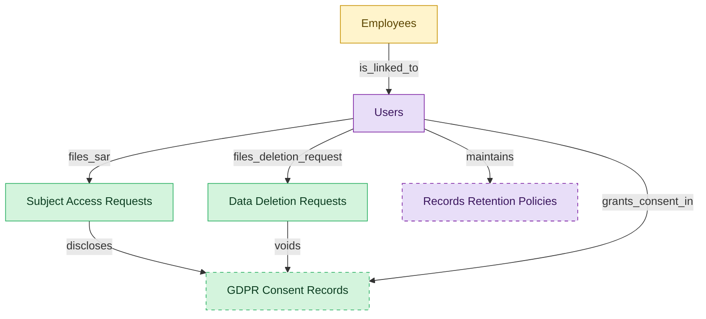

# Learner Data Privacy

## 1. Overview

Learner data privacy substrate that compliance training depends on: GDPR Article 6/7 consent capture, Article 15 subject access requests, and Article 17 right-to-erasure processing for training data. Carved out from LMS-COMPLIANCE-TRAINING because privacy obligations apply across the LMS even where statutory training is out of scope.

## 2. Entity summary

| Name | data_object | Description |
| --- | --- | --- |
| Data Deletion Requests | `data_deletion_requests` | Right-to-erasure requests under GDPR Article 17, covering scope, anonymization policy, regulator deadline, and fulfillment status. |
| GDPR Consent Records | `gdpr_consent_records` | Consent records for learner training data under GDPR, capturing purpose, lawful basis, and grant and withdrawal timestamps. |
| Subject Access Requests | `subject_access_requests` | Subject access request tickets under GDPR Article 15, tracking requester, scope, fulfillment status, and regulator deadline. |
| Employees | `employees` | Canonical records of people currently or formerly employed, carrying identity, employment metadata, and links to position, manager, and org unit. |
| Records Retention Policies | `records_retention_policies` | Legal hold and disposition rules per document class, with regulatory retention periods and scheduled destruction dates. |
| Users | `users` | Platform users referenced as assignees, authors, approvers, and creators across records. |

## 3. Entities catalog

| # | data_object | canonical code | singular | plural | role | mastered in | mastered label | necessity | personal_content | entity_type | write tier | notes |
| ---: | --- | --- | --- | --- | --- | --- | --- | --- | --- | --- | --- | --- |
| 1 | `data_deletion_requests` | `data_deletion_requests` | Data Deletion Request | Data Deletion Requests | master | - | - | required | yes | operational_workflow | `:manage` | - |
| 2 | `gdpr_consent_records` | `gdpr_consent_records` | GDPR Consent Record | GDPR Consent Records | master | - | - | optional | yes | operational_workflow | `:manage` | - |
| 3 | `subject_access_requests` | `subject_access_requests` | Subject Access Request | Subject Access Requests | master | - | - | required | yes | operational_workflow | `:manage` | - |
| 4 | `employees` | `employees` | Employee | Employees | embedded_master | `hcm-core-worker` | Core Worker Record | required | yes | operational_workflow | `:manage` | - |
| 5 | `records_retention_policies` | `records_retention_policies` | Records Retention Policy | Records Retention Policies | consumer | `ecm-records-gov` | Records Management and Information Governance | optional | - | operational_workflow | `:manage` | - |
| 6 | `users` | `users` | User | Users | consumer | _(platform built-in)_ | _(platform built-in)_ | required | - | operational_record | `:manage` | - |

## 4. Aliases and industry synonyms

_(none: no industry-scoped aliases for this scope)_

## 5. Relationships

### 5.1 Intra-scope edges

| from | verb | to | cardinality | kind | necessity | owner_side | delete_mode | fk_format | notes |
| --- | --- | --- | --- | --- | --- | --- | --- | --- | --- |
| `subject_access_requests` | discloses | `gdpr_consent_records` | many_to_many | association | optional | source | clear | reference | - |
| `data_deletion_requests` | voids | `gdpr_consent_records` | many_to_many | association | optional | source | clear | reference | - |

### 5.2 Built-in edges (`users` and other platform built-ins)

| from | verb | to | cardinality | necessity | owner_side | delete_mode | fk_format | notes |
| --- | --- | --- | --- | --- | --- | --- | --- | --- |
| `users` | grants_consent_in | `gdpr_consent_records` | one_to_many | required | source | restrict | reference | - |
| `users` | files_sar | `subject_access_requests` | one_to_many | required | source | restrict | reference | - |
| `users` | files_deletion_request | `data_deletion_requests` | one_to_many | required | source | restrict | reference | - |
| `employees` | is_linked_to | `users` | one_to_one | optional | target | clear | reference | - |
| `users` | maintains | `records_retention_policies` | one_to_many | optional | source | clear | reference | - |

### 5.3 Cross-scope edges

#### 5.3a Outbound from this scope's masters and contributors

_Edges this scope drives: the in-scope endpoint has `role` of `master` or `contributor`._

_(none: no outbound cross-scope edges from this scope's masters or contributors)_

#### 5.3b Context edges on embedded shells and consumed entities

_Edges the canonical owner drives, shown for context: the in-scope endpoint has `role` of `embedded_master`, `consumer`, or `derived`._

| from | verb | to | cardinality | necessity | delete_mode | fk_format | notes |
| --- | --- | --- | --- | --- | --- | --- | --- |
| `employees` | triggers | `iga_provisioning_events` | one_to_many | optional | none | n/a | - |
| `employees` | finalized by | `onboarding_document_collections` | one_to_many | optional | none | n/a | - |
| `audit_findings` | reviews | `records_retention_policies` | many_to_many | optional | none | n/a | - |
| `pre_employees` | promotes to | `employees` | one_to_one | required | none (required-if-present) | n/a | - |
| `legal_holds` | identifies_custodians_from | `employees` | many_to_many | optional | none | n/a | - |
| `legal_advice_records` | references | `employees` | many_to_many | optional | none | n/a | - |
| `employees` | is host for | `host_assignments` | one_to_many | required | none (required-if-present) | n/a | - |
| `contingent_workers` | converts_to | `employees` | one_to_one | optional | none | n/a | - |
| `merit_recommendations` | applies to | `employees` | one_to_one | optional | none | n/a | - |
| `equity_grants` | granted to | `employees` | one_to_one | optional | none | n/a | - |
| `compensation_statements` | issued to | `employees` | one_to_one | optional | none | n/a | - |
| `employees` | requests | `absence_requests` | one_to_many | optional | none | n/a | - |
| `org_units` | groups | `employees` | one_to_many | required | none (required-if-present) | n/a | - |
| `hcm_positions` | is_filled_by | `employees` | one_to_one | optional | none | n/a | - |
| `employees` | signs | `employment_contracts` | one_to_many | required | ⚠ audit: required composed child out of scope | n/a | - |
| `employees` | generates | `employment_events` | one_to_many | required | ⚠ audit: required composed child out of scope | n/a | - |
| `employees` | triggers | `asset_lifecycle_events` | one_to_many | optional | none | n/a | - |
| `employees` | holds | `skill_profiles` | one_to_one | optional | none | n/a | - |
| `employees` | triggers | `service_requests` | one_to_many | optional | none | n/a | - |
| `employees` | triggers | `pay_runs` | one_to_many | optional | none | n/a | - |
| `employees` | enrolls_in | `course_enrollments` | one_to_many | optional | none | n/a | - |
| `employees` | becomes | `career_aspirations` | one_to_one | optional | none | n/a | - |
| `employees` | becomes | `work_shifts` | one_to_many | optional | none | n/a | - |
| `employees` | becomes | `compensation_statements` | one_to_one | optional | none | n/a | - |
| `employees` | triggers | `benefit_enrollments` | one_to_many | optional | none | n/a | - |
| `employees` | triggers | `corporate_cards` | one_to_many | optional | none | n/a | - |
| `employees` | spawns | `onboarding_journeys` | one_to_one | optional | none | n/a | - |
| `employees` | spawns | `hr_cases` | one_to_many | optional | none | n/a | - |
| `employees` | feeds | `headcount_plans` | one_to_many | optional | none | n/a | - |
| `employees` | feeds | `agency_time_entries` | one_to_many | optional | none | n/a | - |
| `employees` | onboarded by | `onboarding_journeys` | one_to_many | required | none (required-if-present) | n/a | - |
| `employees` | reflects | `learning_records` | one_to_many | optional | none | n/a | - |
| `employees` | reflected on | `compliance_assignments` | one_to_many | optional | none | n/a | - |
| `employees` | declares | `life_events` | one_to_many | optional | none | n/a | - |
| `employees` | updated by | `life_events` | one_to_many | optional | none | n/a | - |
| `employees` | submits | `survey_responses` | one_to_many | optional | none | n/a | - |
| `employees` | flagged on | `engagement_drivers` | one_to_many | optional | none | n/a | - |
| `employees` | reflected on | `engagement_drivers` | one_to_many | optional | none | n/a | - |
| `employees` | raises | `hr_cases` | one_to_many | required | none (required-if-present) | n/a | - |
| `employees` | updated by | `hr_cases` | one_to_many | optional | none | n/a | - |
| `case_categories` | drives | `employees` | one_to_many | optional | none | n/a | - |
| `contingent_workers` | reviewed_against | `employees` | one_to_one | optional | none | n/a | - |
| `records_retention_policies` | retains | `content_documents` | one_to_many | optional | none | n/a | - |
| `records_retention_policies` | retains | `document_folders` | one_to_many | optional | none | n/a | - |
| `records_retention_policies` | applies to classification | `document_classifications` | one_to_many | optional | none | n/a | - |
| `records_retention_policies` | streams_disposition_to | `audit_engagements` | one_to_many | optional | none | n/a | - |
| `candidates` | becomes | `employees` | one_to_one | required | none (required-if-present) | n/a | - |
| `employees` | fills | `hcm_positions` | one_to_one | optional | none | n/a | - |
| `employees` | learns_via | `course_enrollments` | one_to_many | required | none (required-if-present) | n/a | - |
| `employees` | enrolls_in | `benefit_enrollments` | one_to_many | required | none (required-if-present) | n/a | - |
| `survey_campaigns` | targets | `employees` | many_to_many | optional | none | n/a | - |
| `employees` | has | `emergency_contacts` | one_to_many | required | ⚠ audit: required composed child out of scope | n/a | - |
| `employees` | has | `work_eligibility_documents` | one_to_many | required | ⚠ audit: required composed child out of scope | n/a | - |
| `employees` | has | `national_ids` | one_to_many | required | ⚠ audit: required composed child out of scope | n/a | - |
| `employees` | has | `worker_addresses` | one_to_many | required | ⚠ audit: required composed child out of scope | n/a | - |
| `employees` | has | `employee_dependents` | one_to_many | required | ⚠ audit: required composed child out of scope | n/a | - |
| `employees` | has | `worker_change_requests` | one_to_many | required | none (required-if-present) | n/a | - |
| `employees` | applies_as | `candidates` | one_to_many | optional | none | n/a | - |
| `employees` | is the worker behind | `traveler_profiles` | one_to_one | optional | none | n/a | - |
| `exit_risk_assessments` | assesses | `employees` | one_to_one | optional | none | n/a | - |
| `insider_risk_cases` | concerns | `employees` | one_to_many | optional | none | n/a | - |
| `frontline_recognitions` | recognizes | `employees` | one_to_many | required | none (required-if-present) | n/a | - |
| `advocate_profiles` | represents | `employees` | one_to_one | required | none (required-if-present) | n/a | - |

## 6. Cross-domain context

### 6.1 Master consumers (other modules / domains that embed this scope's masters)

_(none: no other module embeds this scope's masters; the canonical owners do.)_

### 6.2 Outbound handoffs (events this scope publishes)

| source module | target domain | target module | trigger_event | transition | payload | integration | friction | description |
| --- | --- | --- | --- | --- | --- | --- | --- | --- |
| HCM-CORE-WORKER | HRSD | HRSD-CASE-MGMT | `employee.terminated` | `terminated` _(lifecycle)_ | `employees` | event_stream | medium | Termination kicks off offboarding case (exit interview, knowledge transfer, paperwork). Multiple downstream HRSD tasks created. |
| HCM-CORE-WORKER | IGA | IGA-ACCESS-REQUEST | `employee.created` | `created` _(lifecycle)_ | `employees` | api_call | high | New employee in HCM triggers directory account creation and birthright-role assignment in IGA. High friction because role-to-entitlement mappings drift per business unit, and IGA frequently needs additional context (cost center, manager, location) that arrives later in the journey. Same trigger event as the HCM → Onboarding and HCM → Payroll handoffs. |
| HCM-CORE-WORKER | IGA | IGA-ACCESS-REQUEST | `employee.promoted` | _(lifecycle)_ | `employees` | event_stream | high | Promotion (mover event) requires entitlement re-evaluation: add new role access, revoke prior-role access. SoD risk window during transition. |
| HCM-CORE-WORKER | IGA | IGA-ACCESS-REQUEST | `employee.terminated` | `terminated` _(lifecycle)_ | `employees` | api_call | high | Termination in HCM must immediately revoke identity access in IGA: disable account, remove group memberships, terminate app-level entitlements. Failure modes: contractor terminations not flowing (different HCM table); rehires confuse the de-provisioning idempotency; access lingers after termination is the canonical audit finding. |
| HCM-CORE-WORKER | HCM | HCM-LIFECYCLE-WORKFLOWS | `employee.created` | `created` _(lifecycle)_ | `employees` | lifecycle_progression | low | New worker record surfaces in self-service: manager dashboard, new-hire welcome surface, lifecycle task inbox. In-process state read; no message bus. |
| HCM-CORE-WORKER | HCM | HCM-LIFECYCLE-WORKFLOWS | `employee.terminated` | `terminated` _(lifecycle)_ | `employees` | lifecycle_progression | low | Termination drives the offboarding self-service flow: exit-interview prompt, equipment-return task, knowledge-handoff surfaces in the lifecycle workflow module. |
| LMS-CT-GDPR | HCM | _(domain-level)_ | `data_deletion_request.fulfilled` | _(lifecycle)_ | `data_deletion_requests` | api_call | medium | - |
| LMS-CT-GDPR | HCM | _(domain-level)_ | `gdpr_consent_record.withdrawn` | _(state_change)_ | `gdpr_consent_records` | event_stream | medium | - |
| HCM-CORE-WORKER | PAYROLL | PAYROLL-RUN | `employee.created` | `created` _(lifecycle)_ | `employees` | api_call | medium | New employee in HCM triggers comp profile activation in Payroll: gross-to-net rules selected by jurisdiction, deductions initialised, bank account and tax setup collected via Onboarding flow. Same trigger event as the HCM → Onboarding handoff; both subscribe to the employee.created event. |
| HCM-CORE-WORKER | PAYROLL | PAYROLL-RUN | `employee.promoted` | _(lifecycle)_ | `employees` | event_stream | medium | Promotion typically includes salary change. Effective-dated change must flow to PAYROLL with retroactive handling. |
| HCM-CORE-WORKER | PAYROLL | PAYROLL-RUN | `employee.terminated` | `terminated` _(lifecycle)_ | `employees` | event_stream | high | Termination drives final pay (severance, accrued PTO payout, prorated bonus). Cross-vendor stack when HCM and PAYROLL are different vendors; retro-adjustments are common. |
| HCM-CORE-WORKER | LMS | LMS-COURSE-DELIVERY | `employee.created` | `created` _(lifecycle)_ | `employees` | event_stream | low | New-hire creation provisions required-training assignments (compliance, role-based). Drives day-one and 30-day learning workflows. |
| LMS-CT-GDPR | LMS | LMS-COURSE-DELIVERY | `data_deletion_request.fulfilled` | _(lifecycle)_ | `data_deletion_requests` | lifecycle_progression | medium | - |
| LMS-CT-GDPR | LMS | LMS-COURSE-DELIVERY | `gdpr_consent_record.withdrawn` | _(state_change)_ | `gdpr_consent_records` | lifecycle_progression | medium | - |
| LMS-CT-GDPR | LMS | LMS-COMPLIANCE-TRAINING | `gdpr_consent_record.withdrawn` | _(state_change)_ | `gdpr_consent_records` | lifecycle_progression | medium | - |
| HCM-CORE-WORKER | TALENT-MGMT | TALENT-PERFORMANCE-MGMT | `employee.created` | `created` _(lifecycle)_ | `employees` | api_call | low | New employee triggers talent-profile initialisation in Talent Management: career aspirations, mobility preferences, skills profile stubs. Same employee.created trigger as Onboarding / Payroll / IGA handoffs. |
| HCM-CORE-WORKER | TALENT-MGMT | TALENT-PERFORMANCE-MGMT | `employee.promoted` | _(lifecycle)_ | `employees` | event_stream | low | Promotion updates succession-plan slots and 9-box placement context. |
| HCM-CORE-WORKER | WFM | _(domain-level)_ | `employee.created` | `created` _(lifecycle)_ | `employees` | event_stream | low | New employee provisioned in HCM becomes a schedulable resource in WFM - identity, position, base FTE. Mid-shift onboarding and badge-binding are typical edge cases. |
| HCM-CORE-WORKER | COMP-MGMT | COMP-PLANNING | `employee.created` | `created` _(lifecycle)_ | `employees` | event_stream | low | New-hire creation provides compensation basis. Bands and grades attach via job profile. |
| HCM-CORE-WORKER | COMP-MGMT | COMP-PLANNING | `employee.promoted` | _(lifecycle)_ | `employees` | event_stream | low | Promotion event triggers off-cycle compensation review (eligibility, band placement, increase recommendation) in COMP-MGMT. |
| HCM-CORE-WORKER | BEN-ADMIN | BEN-ENROLLMENT | `employee.created` | `created` _(lifecycle)_ | `employees` | event_stream | medium | New-hire creation seeds benefits eligibility (waiting periods, default elections). Drives carrier feed setup at end of new-hire window. |
| HCM-CORE-WORKER | BEN-ADMIN | BEN-ENROLLMENT | `employee.terminated` | `terminated` _(lifecycle)_ | `employees` | event_stream | high | Termination triggers benefits termination, COBRA / equivalent notices, and dependent coverage decisions. Late notifications cause coverage gaps. |
| HCM-CORE-WORKER | EXPENSE | _(domain-level)_ | `employee.terminated` | `terminated` _(lifecycle)_ | `employees` | event_stream | medium | Termination triggers EXPENSE corporate-card deactivation and outstanding-report close-out. |
| HCM-CORE-WORKER | PSA | PSA-PROJECT-DELIVERY | `employee.terminated` | `terminated` _(lifecycle)_ | `employees` | event_stream | medium | Terminated employee may be the assignee on open project_tasks. PROJECT-DELIVERY needs to surface affected tasks for reassignment or completion handover. |
| HCM-CORE-WORKER | PSA | PSA-RESOURCE-MGMT | `attrition_risk.high` | _(state_change)_ | `employees` | event_stream | high | ML attrition score crosses high threshold. PSA resource managers may proactively rebalance assignments away from at-risk consultants on critical engagements. High friction: probabilistic→deterministic pattern (score requires judgment call), false-positive volume can swamp the staffing queue. |
| HCM-CORE-WORKER | PSA | PSA-RESOURCE-MGMT | `employee.created` | `created` _(lifecycle)_ | `employees` | event_stream | low | New consultant hired. PSA resource pool adds the employee as available capacity; skill inventory record is seeded for downstream certifications. |
| HCM-CORE-WORKER | PSA | PSA-RESOURCE-MGMT | `employee.promoted` | _(lifecycle)_ | `employees` | event_stream | low | Consultant promoted (level / job profile change). PSA reevaluates billable rate band and skill inventory; existing project_assignments may need rate revision. |
| HCM-CORE-WORKER | PSA | PSA-RESOURCE-MGMT | `employee.terminated` | `terminated` _(lifecycle)_ | `employees` | event_stream | medium | Consultant terminated. PSA must release any active project_assignments, return capacity to bench and re-allocate forecast. Medium friction: leaver-event timing varies (immediate vs notice period) and active assignments may need urgent rebalancing. |

### 6.3 Inbound handoffs (events this scope reacts to)

| target module | source domain | source module | trigger_event | transition | payload | integration | friction | description |
| --- | --- | --- | --- | --- | --- | --- | --- | --- |
| HCM-CORE-WORKER | ATS | ATS-CANDIDATE-CRM | `candidate.hired` | `hired` _(lifecycle)_ | `employees` | event_stream | medium | Candidate-to-employee conversion: hired candidate from ATS triggers employee-record creation in HCM. Field mapping (candidate → employee) is rarely perfect; missing fields (legal name spelling, work-eligibility detail, tax IDs) get collected in the Onboarding journey and back-filled into HCM. |
| HCM-CORE-WORKER | COMP-MGMT | COMP-PLANNING | `merit_cycle.approved` | `approved` _(state_change)_ | `employees` | event_stream | low | Cycle-close pay-rate changes post to the worker record (base salary, bonus target, equity guideline). |
| HCM-CORE-WORKER | EMP-EXP | EMP-EXP-CONTINUOUS-LISTEN | `attrition_risk.high` | _(state_change)_ | `employees` | api_call | high | Attrition-risk inference from engagement signals surfaces to managers via HCM dashboards. Probabilistic-signal → deterministic-action pattern: a risk score is not a directive; intervention is gated by manager judgment, data-privacy rules (anonymity floor), and DEI-bias concerns. |
| HCM-CORE-WORKER | PA | PA-PREDICTIVE-MODELS | `attrition_risk.high` | _(state_change)_ | `employees` | event_stream | high | Flight-risk score flagged on employee; HR-business-partner motion required. Probabilistic-signal-to-deterministic-action friction shape; false-positive volume drives mistrust. |
| HCM-CORE-WORKER | MDM | _(domain-level)_ | `employee_golden_record.created` | `active` _(lifecycle)_ | `employees` | api_call | medium | Resolved identity → HCM links operational HR record. |

### 6.4 Master providers (modules / domains that own masters this scope embeds)

| data_object | role here | necessity | canonical owner(s) | slice notes |
| --- | --- | --- | --- | --- |
| `employees` | embedded_master | required | HCM-CORE-WORKER (HCM) | - |
| `records_retention_policies` | consumer | optional | ECM-RECORDS-GOV (ECM) | - |
| `users` | consumer | required | _(platform built-in)_ | - |

## 7. Lifecycle states

### `data_deletion_requests` (Data Deletion Request)

| order | state_name | initial? | terminal? | requires_permission? | derived gate | description |
| --- | --- | --- | --- | --- | --- | --- |
| 1 | `received` | ✓ | - | - | - | - |
| 2 | `in_progress` | - | - | - | - | - |
| 3 | `fulfilled` | - | ✓ | ✓ | `lms-ct-gdpr:fulfill` | - |
| 4 | `declined` | - | ✓ | ✓ | `lms-ct-gdpr:decline` | - |

### `employees` (Employee)

_This scope holds `employees` as **embedded_master**; the canonical state machine is owned by `HCM-CORE-WORKER`._

| order | state_name | initial? | terminal? | requires_permission? | derived gate | description |
| --- | --- | --- | --- | --- | --- | --- |
| 1 | `draft` | ✓ | - | - | - | Pre-hire stub created during requisition or onboarding handoff; not yet a worker of record. |
| 2 | `active` | - | - | ✓ | `lms-ct-gdpr:active_employee` | Worker is currently employed and appears in headcount, payroll eligibility, and directory feeds. |
| 3 | `on_leave` | - | - | ✓ | `lms-ct-gdpr:on_leave_employee` | Employee is on approved leave (parental, medical, sabbatical); active record but suppressed from some downstream feeds. |
| 4 | `suspended` | - | - | ✓ | `lms-ct-gdpr:suspended_employee` | Employment temporarily halted (investigation, disciplinary); pay and access may be paused. |
| 5 | `terminated` | - | ✓ | ✓ | `lms-ct-gdpr:terminated_employee` | Employment ended (voluntary or involuntary); final pay processed, access deprovisioned. |

### `gdpr_consent_records` (GDPR Consent Record)

| order | state_name | initial? | terminal? | requires_permission? | derived gate | description |
| --- | --- | --- | --- | --- | --- | --- |
| 1 | `granted` | ✓ | - | - | - | - |
| 2 | `withdrawn` | - | ✓ | ✓ | `lms-ct-gdpr:withdraw` | - |
| 3 | `expired` | - | ✓ | - | - | - |

### `records_retention_policies` (Records Retention Policy)

_This scope holds `records_retention_policies` as **consumer**; the canonical state machine is owned by `ECM-RECORDS-GOV`._

| order | state_name | initial? | terminal? | requires_permission? | derived gate | description |
| --- | --- | --- | --- | --- | --- | --- |
| 10 | `draft` | ✓ | - | - | - | Retention policy being authored by the records officer. |
| 20 | `under_review` | - | - | - | - | Retention policy circulated for review before activation. |
| 30 | `active` | - | - | ✓ | `ecm-records-gov:activate_retention_policy` | Retention policy in force and applied to in-scope records. |
| 40 | `superseded` | - | ✓ | - | - | Retention policy replaced by a newer active policy. |
| 50 | `retired` | - | ✓ | - | - | Retention policy decommissioned and no longer applied. |

### `subject_access_requests` (Subject Access Request)

| order | state_name | initial? | terminal? | requires_permission? | derived gate | description |
| --- | --- | --- | --- | --- | --- | --- |
| 1 | `received` | ✓ | - | - | - | - |
| 2 | `in_progress` | - | - | - | - | - |
| 3 | `fulfilled` | - | - | ✓ | `lms-ct-gdpr:fulfill` | - |
| 4 | `closed` | - | ✓ | ✓ | `lms-ct-gdpr:close` | - |

## 8. Permissions and business rules (derived)

### 8.1 Permissions

| permission | tier | description | included in `:admin`? |
| --- | --- | --- | --- |
| `lms-ct-gdpr:read` | baseline-read | Read access to every entity in the module | ✓ |
| `lms-ct-gdpr:manage` | baseline-manage | Edit operational records | ✓ |
| `lms-ct-gdpr:admin` | baseline-admin | Edit reference data and inherit every workflow gate below | - |
| `lms-ct-gdpr:active_employee` | workflow-gate (lifecycle) | Transition `employees` into state `active` | ✓ |
| `lms-ct-gdpr:on_leave_employee` | workflow-gate (lifecycle) | Transition `employees` into state `on_leave` | ✓ |
| `lms-ct-gdpr:suspended_employee` | workflow-gate (lifecycle) | Transition `employees` into state `suspended` | ✓ |
| `lms-ct-gdpr:terminated_employee` | workflow-gate (lifecycle) | Transition `employees` into state `terminated` | ✓ |
| `lms-ct-gdpr:withdraw` | workflow-gate (lifecycle) | Transition `gdpr_consent_records` into state `withdrawn` | ✓ |
| `lms-ct-gdpr:fulfill` | workflow-gate (lifecycle) | Transition `subject_access_requests` into state `fulfilled` | ✓ |
| `lms-ct-gdpr:close` | workflow-gate (lifecycle) | Transition `subject_access_requests` into state `closed` | ✓ |
| `lms-ct-gdpr:decline` | workflow-gate (lifecycle) | Transition `data_deletion_requests` into state `declined` | ✓ |
| `lms-ct-gdpr:view_all_subject_access_requests` | override (personal_content) | View all `subject_access_requests` rows beyond row-scope | ✓ |
| `lms-ct-gdpr:manage_all_subject_access_requests` | override (personal_content) | Manage all `subject_access_requests` rows beyond row-scope | ✓ |
| `lms-ct-gdpr:view_all_data_deletion_requests` | override (personal_content) | View all `data_deletion_requests` rows beyond row-scope | ✓ |
| `lms-ct-gdpr:manage_all_data_deletion_requests` | override (personal_content) | Manage all `data_deletion_requests` rows beyond row-scope | ✓ |
| `lms-ct-gdpr:view_all_employees` | override (personal_content) | View all `employees` rows beyond row-scope | ✓ |
| `lms-ct-gdpr:manage_all_employees` | override (personal_content) | Manage all `employees` rows beyond row-scope | ✓ |
| `lms-ct-gdpr:view_all_gdpr_consent_records` | override (personal_content) | View all `gdpr_consent_records` rows beyond row-scope | ✓ |
| `lms-ct-gdpr:manage_all_gdpr_consent_records` | override (personal_content) | Manage all `gdpr_consent_records` rows beyond row-scope | ✓ |

### 8.2 Business rules

| rule_name | data_object | source flag | intent |
| --- | --- | --- | --- |
| `subject_access_request_edit_scope` | `subject_access_requests` | has_personal_content | Row-scope by default; override via `lms-ct-gdpr:view_all_subject_access_requests` / `lms-ct-gdpr:manage_all_subject_access_requests` |
| `data_deletion_request_edit_scope` | `data_deletion_requests` | has_personal_content | Row-scope by default; override via `lms-ct-gdpr:view_all_data_deletion_requests` / `lms-ct-gdpr:manage_all_data_deletion_requests` |
| `employee_edit_scope` | `employees` | has_personal_content | Row-scope by default; override via `lms-ct-gdpr:view_all_employees` / `lms-ct-gdpr:manage_all_employees` |
| `gdpr_consent_record_edit_scope` | `gdpr_consent_records` | has_personal_content | Row-scope by default; override via `lms-ct-gdpr:view_all_gdpr_consent_records` / `lms-ct-gdpr:manage_all_gdpr_consent_records` |

## 9. Roles, RACI, and responsibilities (derived)

_Baseline roles, the permission hierarchy, and RACI realization are DERIVED from this scope's entity-type write tiers + `process_raci`; none of it is stored in the catalog (the deployer provisions it from this blueprint)._

### 9.1 `LMS-CT-GDPR`

**Baseline roles:**

| role | baseline grant |
| --- | --- |
| `lms-ct-gdpr_viewer` | `lms-ct-gdpr:read` |
| `lms-ct-gdpr_manager` | `lms-ct-gdpr:manage` |

**Permission hierarchy:**

| permission | includes |
| --- | --- |
| `lms-ct-gdpr:admin` | `lms-ct-gdpr:manage` |
| `lms-ct-gdpr:manage` | `lms-ct-gdpr:read` |
| `lms-ct-gdpr:admin` | `lms-ct-gdpr:active_employee` |
| `lms-ct-gdpr:admin` | `lms-ct-gdpr:on_leave_employee` |
| `lms-ct-gdpr:admin` | `lms-ct-gdpr:suspended_employee` |
| `lms-ct-gdpr:admin` | `lms-ct-gdpr:terminated_employee` |
| `lms-ct-gdpr:admin` | `lms-ct-gdpr:withdraw` |
| `lms-ct-gdpr:admin` | `lms-ct-gdpr:fulfill` |
| `lms-ct-gdpr:admin` | `lms-ct-gdpr:close` |
| `lms-ct-gdpr:admin` | `lms-ct-gdpr:decline` |
| `lms-ct-gdpr:admin` | `lms-ct-gdpr:view_all_subject_access_requests` |
| `lms-ct-gdpr:admin` | `lms-ct-gdpr:manage_all_subject_access_requests` |
| `lms-ct-gdpr:admin` | `lms-ct-gdpr:view_all_data_deletion_requests` |
| `lms-ct-gdpr:admin` | `lms-ct-gdpr:manage_all_data_deletion_requests` |
| `lms-ct-gdpr:admin` | `lms-ct-gdpr:view_all_employees` |
| `lms-ct-gdpr:admin` | `lms-ct-gdpr:manage_all_employees` |
| `lms-ct-gdpr:admin` | `lms-ct-gdpr:view_all_gdpr_consent_records` |
| `lms-ct-gdpr:admin` | `lms-ct-gdpr:manage_all_gdpr_consent_records` |

**Processes wired:**

| process_key | process_name | PCF code | PCF ID | level | description |
| --- | --- | --- | --- | --- | --- |
| `manage_maintain_employee_data` | Manage and maintain employee data | 7.7.3 | 10524 | 3 | Capturing and updating employee information and data and information on the employees. |
| `manage_leave_absence` | Manage leave of absence | 7.6.2.2 | 10515 | 4 | Managing the period of time that an employee must be away from their primary job, while maintaining the status of employee (i.e., paid and unpaid leave of absence but not vacations, holidays, hiatuses, sabbaticals, and work-from-home programs). |
| `manage_separation` | Manage separation | 7.6.2 | 10513 | 3 | Managing the process of employee separation, including leaves of absence, resignations, discharges, and layoffs. Inform the employee of the termination. Complete paperwork for continuation of benefits. Enter employment status change into system. |

**RACI realization:**

| actor | kind | raci | process_key | realization |
| --- | --- | --- | --- | --- |
| `HR-PEOPLE-OPS-SPECIALIST` | persona | responsible | `manage_maintain_employee_data` | grant gates [lms-ct-gdpr:active_employee] + the gated entities' write tier |
| `HR-BUSINESS-PARTNER` | persona | accountable | `manage_maintain_employee_data` | approval gate |
| `HR-HRIS-ADMIN` | persona | consulted | `manage_maintain_employee_data` | advisory read grant |
| `PEOPLE-MANAGER` | persona | informed | `manage_maintain_employee_data` | notification side effect (trigger_event / webhook_receiver) |
| `HR-PEOPLE-OPS-SPECIALIST` | persona | responsible | `manage_leave_absence` | grant gates [lms-ct-gdpr:on_leave_employee] + the gated entities' write tier |
| `PEOPLE-MANAGER` | persona | accountable | `manage_leave_absence` | approval gate |
| `HR-BUSINESS-PARTNER` | persona | consulted | `manage_leave_absence` | blocking consultation state |
| `HR-HRIS-ADMIN` | persona | informed | `manage_leave_absence` | notification side effect (trigger_event / webhook_receiver) |
| `HR-PEOPLE-OPS-SPECIALIST` | persona | responsible | `manage_separation` | grant gates [lms-ct-gdpr:terminated_employee] + the gated entities' write tier |
| `HR-BUSINESS-PARTNER` | persona | accountable | `manage_separation` | approval gate |
| `PEOPLE-MANAGER` | persona | consulted | `manage_separation` | advisory read grant |
| `HR-HRIS-ADMIN` | persona | informed | `manage_separation` | notification side effect (trigger_event / webhook_receiver) |

### 9.2 Functional ownership and default grants

| responsibility | business function | default role | default tier |
| --- | --- | --- | --- |
| owner | Learning and Development | `admin` | `:admin` |
| contributor | Governance, Risk and Compliance | `manage` | `:manage` |
| contributor | Legal | `manage` | `:manage` |
| consumer | Manufacturing Operations | `read` | `:read` |
| consumer | Sales | `read` | `:read` |
| consumer | Software Engineering | `read` | `:read` |
