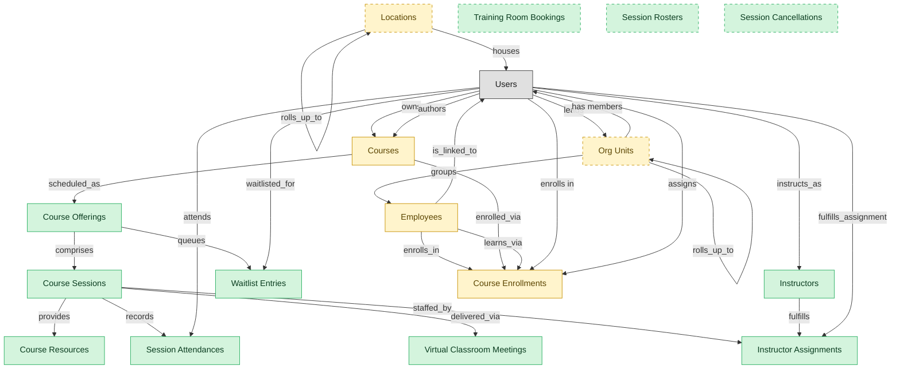

# Instructor-Led and Virtual-Instructor-Led Training

## 1. Overview

Scheduled course delivery: offerings and sessions, instructor assignments, attendance capture (OSHA evidence substrate), waitlist management, virtual-classroom integration, and per-session resources. Structurally distinct from evergreen e-learning in LMS-COURSE-DELIVERY because it carries its own cardinality (course -> many offerings -> many sessions), its own roles (instructors are not learners), and its own per-session compliance footprint.

## 2. Entity summary

| Name | data_object | Description |
| --- | --- | --- |
| Course Offerings | `course_offerings` | Scheduled instances of a course, with date range, location, capacity, language, and delivery mode. |
| Course Resources | `course_resources` | Handouts, supplementary materials, and pre-reads attached to a course offering or session. |
| Course Sessions | `course_sessions` | Individual sessions within a multi-day offering, with per-session attendance and instructor assignment. |
| Instructor Assignments | `instructor_assignments` | Assignments of an instructor to a session or offering, with role such as primary, assistant, or observer. |
| Instructors | `instructors` | Instructor records covering internal trainers, contracted experts, and external vendor instructors, kept separate from employees. |
| Session Attendances | `session_attendances` | Per-session attendance roster rows for each learner, serving as evidence of completed required workplace training. |
| Session Cancellations | `session_cancellations` | Cancellation or no-show records for an instructor-led session, used to drive waitlist promotion. |
| Session Rosters | `session_rosters` | Pre-session enrollment snapshots for an instructor-led session, used as the basis for attendance proof. |
| Training Room Bookings | `training_room_bookings` | Reservations of a physical or virtual room and its resources for an instructor-led session. |
| Virtual Classroom Meetings | `virtual_classroom_meetings` | Links to external video meetings for a virtual session, carrying the join URL and recording reference. |
| Waitlist Entries | `waitlist_entries` | Capacity overflow queue for a course offering, with priority order and a notify-on-seat-open policy. |
| Course Enrollments | `course_enrollments` | Per-learner per-course records tracking assigned and due dates, attempts, status, and score. |
| Courses | `courses` | Learning units such as e-learning modules, videos, live sessions, or blended programs, with format, duration, and prerequisites. |
| Employees | `employees` | Canonical records of people currently or formerly employed, carrying identity, employment metadata, and links to position, manager, and org unit. |
| Locations | `locations` | Physical or organizational locations referenced across the system, used to place and group other records. |
| Org Units | `org_units` | Nodes in the organizational hierarchy such as divisions, departments, and teams, with manager, cost center alignment, geographic scope, and parent-child links. |

## 3. Entities catalog

| # | data_object | canonical code | singular | plural | role | mastered in | mastered label | necessity | pattern flags | entity_type | write tier | notes |
| ---: | --- | --- | --- | --- | --- | --- | --- | --- | --- | --- | --- | --- |
| 1 | `course_offerings` | `course_offerings` | Course Offering | Course Offerings | master | - | - | required | - | operational_workflow | `:manage` | - |
| 2 | `course_resources` | `course_resources` | Course Resource | Course Resources | master | - | - | required | - | catalog | `:admin` | - |
| 3 | `course_sessions` | `course_sessions` | Course Session | Course Sessions | master | - | - | required | - | operational_workflow | `:manage` | - |
| 4 | `instructor_assignments` | `instructor_assignments` | Instructor Assignment | Instructor Assignments | master | - | - | required | - | operational_workflow | `:manage` | - |
| 5 | `instructors` | `instructors` | Instructor | Instructors | master | - | - | required | personal_content | operational_workflow | `:manage` | - |
| 6 | `session_attendances` | `session_attendances` | Session Attendance | Session Attendances | master | - | - | required | personal_content, submit_lock | operational_record | `:manage` | - |
| 7 | `session_cancellations` | `session_cancellations` | Session Cancellation | Session Cancellations | master | - | - | optional | personal_content | operational_record | `:manage` | - |
| 8 | `session_rosters` | `session_rosters` | Session Roster | Session Rosters | master | - | - | optional | personal_content | operational_record | `:manage` | - |
| 9 | `training_room_bookings` | `training_room_bookings` | Training Room Booking | Training Room Bookings | master | - | - | optional | personal_content | operational_workflow | `:manage` | - |
| 10 | `virtual_classroom_meetings` | `virtual_classroom_meetings` | Virtual Classroom Meeting | Virtual Classroom Meetings | master | - | - | required | - | operational_workflow | `:manage` | - |
| 11 | `waitlist_entries` | `waitlist_entries` | Waitlist Entry | Waitlist Entries | master | - | - | required | personal_content | operational_workflow | `:manage` | - |
| 12 | `course_enrollments` | `course_enrollments` | Course Enrollment | Course Enrollments | embedded_master | `lms-course-delivery` | Course Delivery | required | personal_content | operational_workflow | `:manage` | - |
| 13 | `courses` | `courses` | Course | Courses | embedded_master | `lms-course-delivery` | Course Delivery | required | - | operational_workflow | `:manage` | - |
| 14 | `employees` | `employees` | Employee | Employees | embedded_master | `hcm-core-worker` | Core Worker Record | required | personal_content | operational_workflow | `:manage` | - |
| 15 | `locations` | `locations` | Location | Locations | embedded_master | `iwms-location-master` | Location and Property Master | optional | - | catalog | `:admin` | - |
| 16 | `org_units` | `org_units` | Org Unit | Org Units | embedded_master | `hcm-org-positions` | Organization and Position Management | optional | - | operational_workflow | `:manage` | - |

## 4. Aliases and industry synonyms

_(none: no industry-scoped aliases for this scope)_

## 5. Relationships

### 5.1 Intra-scope edges

| from | verb | to | cardinality | kind | necessity | owner_side | delete_mode | fk_format | notes |
| --- | --- | --- | --- | --- | --- | --- | --- | --- | --- |
| `courses` | scheduled_as | `course_offerings` | one_to_many | reference | optional | target | clear | reference | - |
| `course_offerings` | comprises | `course_sessions` | one_to_many | composition | optional | source | cascade | parent | - |
| `course_sessions` | staffed_by | `instructor_assignments` | one_to_many | reference | optional | target | clear | reference | - |
| `instructors` | fulfills | `instructor_assignments` | one_to_many | reference | optional | target | clear | reference | - |
| `course_sessions` | records | `session_attendances` | one_to_many | composition | optional | source | cascade | parent | - |
| `course_offerings` | queues | `waitlist_entries` | one_to_many | composition | optional | source | cascade | parent | - |
| `course_sessions` | delivered_via | `virtual_classroom_meetings` | one_to_many | reference | optional | target | clear | reference | - |
| `course_sessions` | provides | `course_resources` | many_to_many | association | optional | source | clear | reference | - |
| `org_units` | groups | `employees` | one_to_many | reference | required | source | restrict | reference | - |
| `employees` | enrolls_in | `course_enrollments` | one_to_many | reference | optional | source | clear | reference | - |
| `courses` | enrolled_via | `course_enrollments` | one_to_many | reference | required | source | restrict | reference | - |
| `employees` | learns_via | `course_enrollments` | one_to_many | reference | required | source | restrict | reference | - |
| `org_units` | rolls_up_to | `org_units` | one_to_many | reference | optional | source | clear | reference | - |
| `locations` | rolls_up_to | `locations` | one_to_many | reference | optional | source | clear | reference | - |

### 5.2 Built-in edges (`users` and other platform built-ins)

| from | verb | to | cardinality | necessity | owner_side | delete_mode | fk_format | notes |
| --- | --- | --- | --- | --- | --- | --- | --- | --- |
| `users` | owns | `courses` | one_to_many | optional | source | clear | reference | - |
| `users` | instructs_as | `instructors` | one_to_many | optional | source | clear | reference | - |
| `users` | fulfills_assignment | `instructor_assignments` | one_to_many | optional | source | clear | reference | - |
| `users` | attends | `session_attendances` | one_to_many | required | source | restrict | reference | - |
| `users` | waitlisted_for | `waitlist_entries` | one_to_many | required | source | restrict | reference | - |
| `employees` | is_linked_to | `users` | one_to_one | optional | target | clear | reference | - |
| `users` | leads | `org_units` | one_to_many | optional | source | clear | reference | - |
| `users` | authors | `courses` | one_to_many | optional | source | clear | reference | - |
| `users` | enrolls in | `course_enrollments` | one_to_many | required | source | restrict | reference | - |
| `users` | assigns | `course_enrollments` | one_to_many | optional | source | clear | reference | - |
| `org_units` | has members | `users` | one_to_many | optional | target | clear | reference | - |
| `locations` | houses | `users` | one_to_many | optional | target | clear | reference | - |

### 5.3 Cross-scope edges

#### 5.3a Outbound from this scope's masters and contributors

_Edges this scope drives: the in-scope endpoint has `role` of `master` or `contributor`._

_(none: no outbound cross-scope edges from this scope's masters or contributors)_

#### 5.3b Context edges on embedded shells and consumed entities

_Edges the canonical owner drives, shown for context: the in-scope endpoint has `role` of `embedded_master`, `consumer`, or `derived`._

| from | verb | to | cardinality | necessity | delete_mode | fk_format | notes |
| --- | --- | --- | --- | --- | --- | --- | --- |
| `employees` | triggers | `iga_provisioning_events` | one_to_many | optional | none | n/a | - |
| `employees` | finalized by | `onboarding_document_collections` | one_to_many | optional | none | n/a | - |
| `pre_employees` | promotes to | `employees` | one_to_one | required | none (required-if-present) | n/a | - |
| `legal_holds` | identifies_custodians_from | `employees` | many_to_many | optional | none | n/a | - |
| `legal_advice_records` | references | `employees` | many_to_many | optional | none | n/a | - |
| `employees` | is host for | `host_assignments` | one_to_many | required | none (required-if-present) | n/a | - |
| `courses` | has_version | `course_versions` | one_to_many | required | ⚠ audit: required composed child out of scope | n/a | - |
| `course_enrollments` | yields | `course_completions` | one_to_many | optional | none | n/a | - |
| `courses` | classified_as | `course_categories` | many_to_many | optional | none | n/a | - |
| `courses` | tagged_with | `course_tags` | many_to_many | optional | none | n/a | - |
| `course_catalogs` | lists | `courses` | many_to_many | optional | none | n/a | - |
| `courses` | reviewed_via | `course_reviews` | one_to_many | optional | none | n/a | - |
| `courses` | rated_via | `course_ratings` | one_to_many | optional | none | n/a | - |
| `courses` | discussed_in | `course_discussions` | one_to_many | optional | none | n/a | - |
| `courses` | grants | `certification_definitions` | many_to_many | optional | none | n/a | - |
| `courses` | yields_credits_via | `continuing_education_credits` | many_to_many | optional | none | n/a | - |
| `learning_path_steps` | references | `courses` | one_to_many | optional | none | n/a | - |
| `automated_enrollment_rules` | creates | `course_enrollments` | one_to_many | optional | none | n/a | - |
| `contingent_workers` | converts_to | `employees` | one_to_one | optional | none | n/a | - |
| `merit_recommendations` | applies to | `employees` | one_to_one | optional | none | n/a | - |
| `equity_grants` | granted to | `employees` | one_to_one | optional | none | n/a | - |
| `compensation_statements` | issued to | `employees` | one_to_one | optional | none | n/a | - |
| `locations` | hosts_desk_bookings | `desk_bookings` | one_to_many | required | none (required-if-present) | n/a | - |
| `locations` | hosts_room_reservations | `room_reservations` | one_to_many | required | none (required-if-present) | n/a | - |
| `locations` | site_of_service_requests | `workplace_service_requests` | one_to_many | required | none (required-if-present) | n/a | - |
| `locations` | measured_by_reports | `space_utilization_reports` | one_to_many | required | none (required-if-present) | n/a | - |
| `locations` | subject_of_feedback | `workplace_experience_feedback` | one_to_many | optional | none | n/a | - |
| `employees` | requests | `absence_requests` | one_to_many | optional | none | n/a | - |
| `org_units` | contains | `hcm_positions` | one_to_many | required | none (required-if-present) | n/a | - |
| `hcm_positions` | is_filled_by | `employees` | one_to_one | optional | none | n/a | - |
| `employees` | signs | `employment_contracts` | one_to_many | required | ⚠ audit: required composed child out of scope | n/a | - |
| `employees` | generates | `employment_events` | one_to_many | required | ⚠ audit: required composed child out of scope | n/a | - |
| `cost_centers` | funds | `org_units` | one_to_many | required | none (required-if-present) | n/a | - |
| `employees` | triggers | `asset_lifecycle_events` | one_to_many | optional | none | n/a | - |
| `employees` | holds | `skill_profiles` | one_to_one | optional | none | n/a | - |
| `org_units` | engages | `contingent_workers` | one_to_many | optional | none | n/a | - |
| `org_units` | is_scored_by | `engagement_drivers` | one_to_many | optional | none | n/a | - |
| `org_units` | is_measured_by | `people_kpis` | one_to_many | optional | none | n/a | - |
| `employees` | triggers | `service_requests` | one_to_many | optional | none | n/a | - |
| `org_units` | triggers | `iga_entitlement_definitions` | one_to_many | optional | none | n/a | - |
| `employees` | triggers | `pay_runs` | one_to_many | optional | none | n/a | - |
| `job_profiles` | maps_to | `courses` | many_to_many | optional | none | n/a | - |
| `employees` | becomes | `career_aspirations` | one_to_one | optional | none | n/a | - |
| `employees` | becomes | `work_shifts` | one_to_many | optional | none | n/a | - |
| `employees` | becomes | `compensation_statements` | one_to_one | optional | none | n/a | - |
| `employees` | triggers | `benefit_enrollments` | one_to_many | optional | none | n/a | - |
| `org_units` | maps_to | `cost_centers` | one_to_one | optional | none | n/a | - |
| `employees` | triggers | `corporate_cards` | one_to_many | optional | none | n/a | - |
| `employees` | spawns | `onboarding_journeys` | one_to_one | optional | none | n/a | - |
| `employees` | spawns | `hr_cases` | one_to_many | optional | none | n/a | - |
| `employees` | feeds | `headcount_plans` | one_to_many | optional | none | n/a | - |
| `employees` | feeds | `agency_time_entries` | one_to_many | optional | none | n/a | - |
| `employees` | onboarded by | `onboarding_journeys` | one_to_many | required | none (required-if-present) | n/a | - |
| `onboarding_tasks` | spawns | `course_enrollments` | one_to_many | optional | none | n/a | - |
| `courses` | sequenced_into | `learning_paths` | many_to_many | optional | none | n/a | - |
| `course_enrollments` | produces | `learning_records` | one_to_many | required | ⚠ audit: required composed child out of scope | n/a | - |
| `courses` | fulfills | `compliance_assignments` | one_to_many | optional | none | n/a | - |
| `courses` | grants | `learner_certifications` | one_to_many | optional | none | n/a | - |
| `skill_profiles` | updated by | `course_enrollments` | one_to_many | optional | none | n/a | - |
| `org_units` | sponsors | `compliance_assignments` | one_to_many | optional | none | n/a | - |
| `cost_centers` | funds | `course_enrollments` | one_to_many | optional | none | n/a | - |
| `employees` | reflects | `learning_records` | one_to_many | optional | none | n/a | - |
| `employees` | reflected on | `compliance_assignments` | one_to_many | optional | none | n/a | - |
| `course_enrollments` | updates | `career_aspirations` | one_to_many | optional | none | n/a | - |
| `employees` | declares | `life_events` | one_to_many | optional | none | n/a | - |
| `org_units` | sponsors | `benefit_plans` | many_to_many | optional | none | n/a | - |
| `employees` | updated by | `life_events` | one_to_many | optional | none | n/a | - |
| `survey_campaigns` | targets | `org_units` | many_to_many | optional | none | n/a | - |
| `org_units` | owns | `action_plans` | one_to_many | optional | none | n/a | - |
| `employees` | submits | `survey_responses` | one_to_many | optional | none | n/a | - |
| `employees` | flagged on | `engagement_drivers` | one_to_many | optional | none | n/a | - |
| `employees` | reflected on | `engagement_drivers` | one_to_many | optional | none | n/a | - |
| `employees` | raises | `hr_cases` | one_to_many | required | none (required-if-present) | n/a | - |
| `employees` | updated by | `hr_cases` | one_to_many | optional | none | n/a | - |
| `case_categories` | drives | `employees` | one_to_many | optional | none | n/a | - |
| `contingent_workers` | reviewed_against | `employees` | one_to_one | optional | none | n/a | - |
| `candidates` | becomes | `employees` | one_to_one | required | none (required-if-present) | n/a | - |
| `employees` | fills | `hcm_positions` | one_to_one | optional | none | n/a | - |
| `employees` | enrolls_in | `benefit_enrollments` | one_to_many | required | none (required-if-present) | n/a | - |
| `survey_campaigns` | targets | `employees` | many_to_many | optional | none | n/a | - |
| `employees` | has | `emergency_contacts` | one_to_many | required | ⚠ audit: required composed child out of scope | n/a | - |
| `employees` | has | `work_eligibility_documents` | one_to_many | required | ⚠ audit: required composed child out of scope | n/a | - |
| `employees` | has | `national_ids` | one_to_many | required | ⚠ audit: required composed child out of scope | n/a | - |
| `employees` | has | `worker_addresses` | one_to_many | required | ⚠ audit: required composed child out of scope | n/a | - |
| `employees` | has | `employee_dependents` | one_to_many | required | ⚠ audit: required composed child out of scope | n/a | - |
| `employees` | has | `worker_change_requests` | one_to_many | required | none (required-if-present) | n/a | - |
| `employees` | applies_as | `candidates` | one_to_many | optional | none | n/a | - |
| `employees` | is the worker behind | `traveler_profiles` | one_to_one | optional | none | n/a | - |
| `exit_risk_assessments` | assesses | `employees` | one_to_one | optional | none | n/a | - |
| `insider_risk_cases` | concerns | `employees` | one_to_many | optional | none | n/a | - |
| `frontline_recognitions` | recognizes | `employees` | one_to_many | required | none (required-if-present) | n/a | - |
| `advocate_profiles` | represents | `employees` | one_to_one | required | none (required-if-present) | n/a | - |

## 6. Cross-domain context

### 6.1 Master consumers (other modules / domains that embed this scope's masters)

_(none: no other module embeds this scope's masters; the canonical owners do.)_

### 6.2 Outbound handoffs (events this scope publishes)

| source module | target domain | target module | trigger_event | transition | payload | integration | friction | description |
| --- | --- | --- | --- | --- | --- | --- | --- | --- |
| HCM-CORE-WORKER | HRSD | HRSD-CASE-MGMT | `employee.terminated` | `terminated` _(lifecycle)_ | `employees` | event_stream | medium | Termination kicks off offboarding case (exit interview, knowledge transfer, paperwork). Multiple downstream HRSD tasks created. |
| HCM-CORE-WORKER | IGA | IGA-ACCESS-REQUEST | `employee.created` | `created` _(lifecycle)_ | `employees` | api_call | high | New employee in HCM triggers directory account creation and birthright-role assignment in IGA. High friction because role-to-entitlement mappings drift per business unit, and IGA frequently needs additional context (cost center, manager, location) that arrives later in the journey. Same trigger event as the HCM → Onboarding and HCM → Payroll handoffs. |
| HCM-CORE-WORKER | IGA | IGA-ACCESS-REQUEST | `employee.promoted` | _(lifecycle)_ | `employees` | event_stream | high | Promotion (mover event) requires entitlement re-evaluation: add new role access, revoke prior-role access. SoD risk window during transition. |
| HCM-CORE-WORKER | IGA | IGA-ACCESS-REQUEST | `employee.terminated` | `terminated` _(lifecycle)_ | `employees` | api_call | high | Termination in HCM must immediately revoke identity access in IGA: disable account, remove group memberships, terminate app-level entitlements. Failure modes: contractor terminations not flowing (different HCM table); rehires confuse the de-provisioning idempotency; access lingers after termination is the canonical audit finding. |
| HCM-ORG-POSITIONS | IGA | IGA-ACCESS-REQUEST | `org_unit.created` | _(state_change)_ | `org_units` | event_stream | medium | New org unit drives IGA group/role provisioning. Group-name conventions and ownership must be encoded; otherwise orphan groups proliferate. |
| HCM-ORG-POSITIONS | IGA | IGA-ACCESS-REQUEST | `org_unit.disbanded` | _(state_change)_ | `org_units` | event_stream | high | Org-unit disbandment requires IGA group cleanup; orphan-group risk if employees re-assigned slowly. |
| HCM-ORG-POSITIONS | IGA | IGA-ACCESS-REQUEST | `org_unit.merged` | _(state_change)_ | `org_units` | event_stream | high | Org-unit merge consolidates IGA groups: members migrate, entitlements deduplicated, SoD revalidated. Often runs as a batch project rather than event. |
| HCM-CORE-WORKER | HCM | HCM-LIFECYCLE-WORKFLOWS | `employee.created` | `created` _(lifecycle)_ | `employees` | lifecycle_progression | low | New worker record surfaces in self-service: manager dashboard, new-hire welcome surface, lifecycle task inbox. In-process state read; no message bus. |
| HCM-CORE-WORKER | HCM | HCM-LIFECYCLE-WORKFLOWS | `employee.terminated` | `terminated` _(lifecycle)_ | `employees` | lifecycle_progression | low | Termination drives the offboarding self-service flow: exit-interview prompt, equipment-return task, knowledge-handoff surfaces in the lifecycle workflow module. |
| HCM-CORE-WORKER | PAYROLL | PAYROLL-RUN | `employee.created` | `created` _(lifecycle)_ | `employees` | api_call | medium | New employee in HCM triggers comp profile activation in Payroll: gross-to-net rules selected by jurisdiction, deductions initialised, bank account and tax setup collected via Onboarding flow. Same trigger event as the HCM → Onboarding handoff; both subscribe to the employee.created event. |
| HCM-CORE-WORKER | PAYROLL | PAYROLL-RUN | `employee.promoted` | _(lifecycle)_ | `employees` | event_stream | medium | Promotion typically includes salary change. Effective-dated change must flow to PAYROLL with retroactive handling. |
| HCM-CORE-WORKER | PAYROLL | PAYROLL-RUN | `employee.terminated` | `terminated` _(lifecycle)_ | `employees` | event_stream | high | Termination drives final pay (severance, accrued PTO payout, prorated bonus). Cross-vendor stack when HCM and PAYROLL are different vendors; retro-adjustments are common. |
| HCM-ORG-POSITIONS | ATS | ATS-RECRUITMENT-PIPELINE | `org_unit.activated` | _(state_change)_ | `org_units` | api_call | low | - |
| HCM-ORG-POSITIONS | ATS | ATS-RECRUITMENT-PIPELINE | `org_unit.closed` | _(state_change)_ | `org_units` | api_call | high | - |
| HCM-ORG-POSITIONS | ATS | ATS-RECRUITMENT-PIPELINE | `org_unit.created` | _(state_change)_ | `org_units` | api_call | medium | - |
| HCM-ORG-POSITIONS | ATS | ATS-RECRUITMENT-PIPELINE | `org_unit.disbanded` | _(state_change)_ | `org_units` | api_call | high | - |
| HCM-ORG-POSITIONS | ATS | ATS-RECRUITMENT-PIPELINE | `org_unit.merged` | _(state_change)_ | `org_units` | api_call | high | - |
| HCM-ORG-POSITIONS | ATS | ATS-RECRUITMENT-PIPELINE | `org_unit.reorganized` | _(state_change)_ | `org_units` | api_call | high | - |
| LMS-COURSE-DELIVERY | LMS | LMS-COMPLIANCE-TRAINING | `course.published` | _(lifecycle)_ | `courses` | lifecycle_progression | low | - |
| LMS-ILT-DELIVERY | LMS | LMS-COURSE-DELIVERY | `course_offering.completed` | _(lifecycle)_ | `course_offerings` | lifecycle_progression | low | - |
| LMS-ILT-DELIVERY | LMS | LMS-COMPLIANCE-TRAINING | `session_attendance.validated` | _(lifecycle)_ | `session_attendances` | lifecycle_progression | low | - |
| HCM-CORE-WORKER | TALENT-MGMT | TALENT-PERFORMANCE-MGMT | `employee.created` | `created` _(lifecycle)_ | `employees` | api_call | low | New employee triggers talent-profile initialisation in Talent Management: career aspirations, mobility preferences, skills profile stubs. Same employee.created trigger as Onboarding / Payroll / IGA handoffs. |
| HCM-CORE-WORKER | TALENT-MGMT | TALENT-PERFORMANCE-MGMT | `employee.promoted` | _(lifecycle)_ | `employees` | event_stream | low | Promotion updates succession-plan slots and 9-box placement context. |
| LMS-COURSE-DELIVERY | TALENT-MGMT | TALENT-SUCCESSION-CAREER | `course_enrollment.completed` | _(lifecycle)_ | `course_enrollments` | event_stream | low | Course completion updates skill-profile; TALENT-MGMT reflects in dev-plans and succession. |
| HCM-CORE-WORKER | WFM | _(domain-level)_ | `employee.created` | `created` _(lifecycle)_ | `employees` | event_stream | low | New employee provisioned in HCM becomes a schedulable resource in WFM - identity, position, base FTE. Mid-shift onboarding and badge-binding are typical edge cases. |
| HCM-CORE-WORKER | COMP-MGMT | COMP-PLANNING | `employee.created` | `created` _(lifecycle)_ | `employees` | event_stream | low | New-hire creation provides compensation basis. Bands and grades attach via job profile. |
| HCM-CORE-WORKER | COMP-MGMT | COMP-PLANNING | `employee.promoted` | _(lifecycle)_ | `employees` | event_stream | low | Promotion event triggers off-cycle compensation review (eligibility, band placement, increase recommendation) in COMP-MGMT. |
| HCM-CORE-WORKER | BEN-ADMIN | BEN-ENROLLMENT | `employee.created` | `created` _(lifecycle)_ | `employees` | event_stream | medium | New-hire creation seeds benefits eligibility (waiting periods, default elections). Drives carrier feed setup at end of new-hire window. |
| HCM-CORE-WORKER | BEN-ADMIN | BEN-ENROLLMENT | `employee.terminated` | `terminated` _(lifecycle)_ | `employees` | event_stream | high | Termination triggers benefits termination, COBRA / equivalent notices, and dependent coverage decisions. Late notifications cause coverage gaps. |
| HCM-ORG-POSITIONS | FIN | _(domain-level)_ | `org_unit.created` | _(state_change)_ | `org_units` | api_call | medium | New org unit usually maps to cost-center; ERP-FIN must reflect the structure for budgeting and labor allocation. |
| HCM-CORE-WORKER | EXPENSE | _(domain-level)_ | `employee.terminated` | `terminated` _(lifecycle)_ | `employees` | event_stream | medium | Termination triggers EXPENSE corporate-card deactivation and outstanding-report close-out. |
| HCM-CORE-WORKER | PSA | PSA-PROJECT-DELIVERY | `employee.terminated` | `terminated` _(lifecycle)_ | `employees` | event_stream | medium | Terminated employee may be the assignee on open project_tasks. PROJECT-DELIVERY needs to surface affected tasks for reassignment or completion handover. |
| HCM-CORE-WORKER | PSA | PSA-RESOURCE-MGMT | `attrition_risk.high` | _(state_change)_ | `employees` | event_stream | high | ML attrition score crosses high threshold. PSA resource managers may proactively rebalance assignments away from at-risk consultants on critical engagements. High friction: probabilistic→deterministic pattern (score requires judgment call), false-positive volume can swamp the staffing queue. |
| HCM-CORE-WORKER | PSA | PSA-RESOURCE-MGMT | `employee.created` | `created` _(lifecycle)_ | `employees` | event_stream | low | New consultant hired. PSA resource pool adds the employee as available capacity; skill inventory record is seeded for downstream certifications. |
| HCM-CORE-WORKER | PSA | PSA-RESOURCE-MGMT | `employee.promoted` | _(lifecycle)_ | `employees` | event_stream | low | Consultant promoted (level / job profile change). PSA reevaluates billable rate band and skill inventory; existing project_assignments may need rate revision. |
| HCM-CORE-WORKER | PSA | PSA-RESOURCE-MGMT | `employee.terminated` | `terminated` _(lifecycle)_ | `employees` | event_stream | medium | Consultant terminated. PSA must release any active project_assignments, return capacity to bench and re-allocate forecast. Medium friction: leaver-event timing varies (immediate vs notice period) and active assignments may need urgent rebalancing. |
| LMS-COURSE-DELIVERY | SKILLS-MGMT | SKILLS-MGMT-PROFILE | `course.published` | _(lifecycle)_ | `courses` | lifecycle_progression | low | - |
| LMS-COURSE-DELIVERY | SKILLS-MGMT | SKILLS-MGMT-PROFILE | `course_enrollment.completed` | _(lifecycle)_ | `course_enrollments` | lifecycle_progression | low | - |

### 6.3 Inbound handoffs (events this scope reacts to)

| target module | source domain | source module | trigger_event | transition | payload | integration | friction | description |
| --- | --- | --- | --- | --- | --- | --- | --- | --- |
| HCM-CORE-WORKER | ATS | ATS-CANDIDATE-CRM | `candidate.hired` | `hired` _(lifecycle)_ | `employees` | event_stream | medium | Candidate-to-employee conversion: hired candidate from ATS triggers employee-record creation in HCM. Field mapping (candidate → employee) is rarely perfect; missing fields (legal name spelling, work-eligibility detail, tax IDs) get collected in the Onboarding journey and back-filled into HCM. |
| HCM-CORE-WORKER | COMP-MGMT | COMP-PLANNING | `merit_cycle.approved` | `approved` _(state_change)_ | `employees` | event_stream | low | Cycle-close pay-rate changes post to the worker record (base salary, bonus target, equity guideline). |
| HCM-CORE-WORKER | EMP-EXP | EMP-EXP-CONTINUOUS-LISTEN | `attrition_risk.high` | _(state_change)_ | `employees` | api_call | high | Attrition-risk inference from engagement signals surfaces to managers via HCM dashboards. Probabilistic-signal → deterministic-action pattern: a risk score is not a directive; intervention is gated by manager judgment, data-privacy rules (anonymity floor), and DEI-bias concerns. |
| HCM-CORE-WORKER | PA | PA-PREDICTIVE-MODELS | `attrition_risk.high` | _(state_change)_ | `employees` | event_stream | high | Flight-risk score flagged on employee; HR-business-partner motion required. Probabilistic-signal-to-deterministic-action friction shape; false-positive volume drives mistrust. |
| HCM-CORE-WORKER | MDM | _(domain-level)_ | `employee_golden_record.created` | `active` _(lifecycle)_ | `employees` | api_call | medium | Resolved identity → HCM links operational HR record. |

### 6.4 Master providers (modules / domains that own masters this scope embeds)

| data_object | role here | necessity | canonical owner(s) | slice notes |
| --- | --- | --- | --- | --- |
| `course_enrollments` | embedded_master | required | LMS-COURSE-DELIVERY (LMS) | - |
| `courses` | embedded_master | required | LMS-COURSE-DELIVERY (LMS) | - |
| `employees` | embedded_master | required | HCM-CORE-WORKER (HCM) | - |
| `locations` | embedded_master | optional | IWMS-LOCATION-MASTER (IWMS) | - |
| `org_units` | embedded_master | optional | HCM-ORG-POSITIONS (HCM) | - |

## 7. Lifecycle states

### `course_enrollments` (Course Enrollment)

_This scope holds `course_enrollments` as **embedded_master**; the canonical state machine is owned by `LMS-COURSE-DELIVERY`._

| order | state_name | initial? | terminal? | requires_permission? | derived gate | description |
| --- | --- | --- | --- | --- | --- | --- |
| 1 | `enrolled` | ✓ | - | - | - | Learner enrolled in the course but has not started. |
| 2 | `in_progress` | - | - | - | - | Learner has begun the course content or activities. |
| 3 | `completed` | - | ✓ | ✓ | `lms-ilt-delivery:complete` | Learner met all completion criteria with a passing score. |
| 4 | `failed` | - | ✓ | ✓ | `lms-ilt-delivery:fail` | Learner did not meet the passing criteria within allowed attempts. |
| 5 | `expired` | - | ✓ | ✓ | `lms-ilt-delivery:expire` | Enrollment closed unmet at the due date or content expiry. |
| 6 | `withdrawn` | - | ✓ | ✓ | `lms-ilt-delivery:withdraw` | Learner withdrew or was unenrolled before completion. |

### `course_offerings` (Course Offering)

| order | state_name | initial? | terminal? | requires_permission? | derived gate | description |
| --- | --- | --- | --- | --- | --- | --- |
| 1 | `scheduled` | ✓ | - | - | - | - |
| 2 | `open_for_enrollment` | - | - | ✓ | `lms-ilt-delivery:open` | - |
| 3 | `in_progress` | - | - | - | - | - |
| 4 | `completed` | - | ✓ | ✓ | `lms-ilt-delivery:complete` | - |
| 5 | `canceled` | - | ✓ | ✓ | `lms-ilt-delivery:cancel` | - |

### `course_sessions` (Course Session)

| order | state_name | initial? | terminal? | requires_permission? | derived gate | description |
| --- | --- | --- | --- | --- | --- | --- |
| 1 | `scheduled` | ✓ | - | - | - | - |
| 2 | `in_progress` | - | - | - | - | - |
| 3 | `completed` | - | ✓ | ✓ | `lms-ilt-delivery:complete` | - |
| 4 | `canceled` | - | ✓ | ✓ | `lms-ilt-delivery:cancel` | - |

### `courses` (Course)

_This scope holds `courses` as **embedded_master**; the canonical state machine is owned by `LMS-COURSE-DELIVERY`._

| order | state_name | initial? | terminal? | requires_permission? | derived gate | description |
| --- | --- | --- | --- | --- | --- | --- |
| 1 | `draft` | ✓ | - | - | - | Course being authored by an instructional designer or SME. |
| 2 | `in_review` | - | - | - | - | Content under review by L&D or compliance reviewers. |
| 3 | `published` | - | - | ✓ | `lms-ilt-delivery:publish` | Course released to the catalog and available for enrollment. |
| 4 | `retired` | - | ✓ | ✓ | `lms-ilt-delivery:retire` | Course removed from the catalog and kept for historical transcripts. |

### `employees` (Employee)

_This scope holds `employees` as **embedded_master**; the canonical state machine is owned by `HCM-CORE-WORKER`._

| order | state_name | initial? | terminal? | requires_permission? | derived gate | description |
| --- | --- | --- | --- | --- | --- | --- |
| 1 | `draft` | ✓ | - | - | - | Pre-hire stub created during requisition or onboarding handoff; not yet a worker of record. |
| 2 | `active` | - | - | ✓ | `lms-ilt-delivery:active_employee` | Worker is currently employed and appears in headcount, payroll eligibility, and directory feeds. |
| 3 | `on_leave` | - | - | ✓ | `lms-ilt-delivery:on_leave_employee` | Employee is on approved leave (parental, medical, sabbatical); active record but suppressed from some downstream feeds. |
| 4 | `suspended` | - | - | ✓ | `lms-ilt-delivery:suspended_employee` | Employment temporarily halted (investigation, disciplinary); pay and access may be paused. |
| 5 | `terminated` | - | ✓ | ✓ | `lms-ilt-delivery:terminated_employee` | Employment ended (voluntary or involuntary); final pay processed, access deprovisioned. |

### `instructor_assignments` (Instructor Assignment)

| order | state_name | initial? | terminal? | requires_permission? | derived gate | description |
| --- | --- | --- | --- | --- | --- | --- |
| 1 | `assigned` | ✓ | - | - | - | - |
| 2 | `confirmed` | - | - | ✓ | `lms-ilt-delivery:confirm` | - |
| 3 | `completed` | - | ✓ | - | - | - |
| 4 | `canceled` | - | ✓ | ✓ | `lms-ilt-delivery:cancel` | - |

### `instructors` (Instructor)

| order | state_name | initial? | terminal? | requires_permission? | derived gate | description |
| --- | --- | --- | --- | --- | --- | --- |
| 1 | `pending` | ✓ | - | - | - | - |
| 2 | `active` | - | - | ✓ | `lms-ilt-delivery:activate` | - |
| 3 | `inactive` | - | ✓ | ✓ | `lms-ilt-delivery:deactivate` | - |

### `org_units` (Org Unit)

_This scope holds `org_units` as **embedded_master**; the canonical state machine is owned by `HCM-ORG-POSITIONS`._

| order | state_name | initial? | terminal? | requires_permission? | derived gate | description |
| --- | --- | --- | --- | --- | --- | --- |
| 1 | `draft` | ✓ | - | - | - | Org unit defined as part of a future structure; not yet operational. |
| 2 | `active` | - | - | ✓ | `lms-ilt-delivery:active_org_unit` | Operational unit; carries headcount, cost-center linkage, and reporting lines. |
| 3 | `reorganized` | - | ✓ | ✓ | `lms-ilt-delivery:reorganized_org_unit` | Unit folded into or replaced by a new structure; references remain for history. |
| 4 | `closed` | - | ✓ | ✓ | `lms-ilt-delivery:closed_org_unit` | Unit dissolved; no employees or positions reside in it. |

### `session_attendances` (Session Attendance)

| order | state_name | initial? | terminal? | requires_permission? | derived gate | description |
| --- | --- | --- | --- | --- | --- | --- |
| 1 | `recorded` | ✓ | - | - | - | - |
| 2 | `validated` | - | ✓ | ✓ | `lms-ilt-delivery:validate` | - |

### `training_room_bookings` (Training Room Booking)

| order | state_name | initial? | terminal? | requires_permission? | derived gate | description |
| --- | --- | --- | --- | --- | --- | --- |
| 1 | `requested` | ✓ | - | - | - | - |
| 2 | `confirmed` | - | - | ✓ | `lms-ilt-delivery:confirm` | - |
| 3 | `released` | - | ✓ | ✓ | `lms-ilt-delivery:release` | - |

### `virtual_classroom_meetings` (Virtual Classroom Meeting)

| order | state_name | initial? | terminal? | requires_permission? | derived gate | description |
| --- | --- | --- | --- | --- | --- | --- |
| 1 | `scheduled` | ✓ | - | - | - | - |
| 2 | `in_progress` | - | - | - | - | - |
| 3 | `completed` | - | ✓ | - | - | - |
| 4 | `canceled` | - | ✓ | ✓ | `lms-ilt-delivery:cancel` | - |

### `waitlist_entries` (Waitlist Entry)

| order | state_name | initial? | terminal? | requires_permission? | derived gate | description |
| --- | --- | --- | --- | --- | --- | --- |
| 1 | `waiting` | ✓ | - | - | - | - |
| 2 | `promoted` | - | ✓ | ✓ | `lms-ilt-delivery:promote` | - |
| 3 | `expired` | - | ✓ | - | - | - |
| 4 | `canceled` | - | ✓ | - | - | - |

## 8. Permissions and business rules (derived)

### 8.1 Permissions

| permission | tier | description | included in `:admin`? |
| --- | --- | --- | --- |
| `lms-ilt-delivery:read` | baseline-read | Read access to every entity in the module | ✓ |
| `lms-ilt-delivery:manage` | baseline-manage | Edit operational records | ✓ |
| `lms-ilt-delivery:admin` | baseline-admin | Edit reference data and inherit every workflow gate below | - |
| `lms-ilt-delivery:active_employee` | workflow-gate (lifecycle) | Transition `employees` into state `active` | ✓ |
| `lms-ilt-delivery:on_leave_employee` | workflow-gate (lifecycle) | Transition `employees` into state `on_leave` | ✓ |
| `lms-ilt-delivery:suspended_employee` | workflow-gate (lifecycle) | Transition `employees` into state `suspended` | ✓ |
| `lms-ilt-delivery:terminated_employee` | workflow-gate (lifecycle) | Transition `employees` into state `terminated` | ✓ |
| `lms-ilt-delivery:active_org_unit` | workflow-gate (lifecycle) | Transition `org_units` into state `active` | ✓ |
| `lms-ilt-delivery:reorganized_org_unit` | workflow-gate (lifecycle) | Transition `org_units` into state `reorganized` | ✓ |
| `lms-ilt-delivery:closed_org_unit` | workflow-gate (lifecycle) | Transition `org_units` into state `closed` | ✓ |
| `lms-ilt-delivery:publish` | workflow-gate (lifecycle) | Transition `courses` into state `published` | ✓ |
| `lms-ilt-delivery:retire` | workflow-gate (lifecycle) | Transition `courses` into state `retired` | ✓ |
| `lms-ilt-delivery:complete` | workflow-gate (lifecycle) | Transition `course_enrollments` into state `completed` | ✓ |
| `lms-ilt-delivery:fail` | workflow-gate (lifecycle) | Transition `course_enrollments` into state `failed` | ✓ |
| `lms-ilt-delivery:expire` | workflow-gate (lifecycle) | Transition `course_enrollments` into state `expired` | ✓ |
| `lms-ilt-delivery:withdraw` | workflow-gate (lifecycle) | Transition `course_enrollments` into state `withdrawn` | ✓ |
| `lms-ilt-delivery:open` | workflow-gate (lifecycle) | Transition `course_offerings` into state `open_for_enrollment` | ✓ |
| `lms-ilt-delivery:cancel` | workflow-gate (lifecycle) | Transition `course_offerings` into state `canceled` | ✓ |
| `lms-ilt-delivery:activate` | workflow-gate (lifecycle) | Transition `instructors` into state `active` | ✓ |
| `lms-ilt-delivery:deactivate` | workflow-gate (lifecycle) | Transition `instructors` into state `inactive` | ✓ |
| `lms-ilt-delivery:confirm` | workflow-gate (lifecycle) | Transition `instructor_assignments` into state `confirmed` | ✓ |
| `lms-ilt-delivery:validate` | workflow-gate (lifecycle) | Transition `session_attendances` into state `validated` | ✓ |
| `lms-ilt-delivery:promote` | workflow-gate (lifecycle) | Transition `waitlist_entries` into state `promoted` | ✓ |
| `lms-ilt-delivery:release` | workflow-gate (lifecycle) | Transition `training_room_bookings` into state `released` | ✓ |
| `lms-ilt-delivery:view_all_instructors` | override (personal_content) | View all `instructors` rows beyond row-scope | ✓ |
| `lms-ilt-delivery:manage_all_instructors` | override (personal_content) | Manage all `instructors` rows beyond row-scope | ✓ |
| `lms-ilt-delivery:view_all_session_attendances` | override (personal_content) | View all `session_attendances` rows beyond row-scope | ✓ |
| `lms-ilt-delivery:manage_all_session_attendances` | override (personal_content) | Manage all `session_attendances` rows beyond row-scope | ✓ |
| `lms-ilt-delivery:submit_session_attendance` | override (submit_lock) | Submit and lock a `session_attendances` row (post-submit edits gated) | ✓ |
| `lms-ilt-delivery:view_all_waitlist_entries` | override (personal_content) | View all `waitlist_entries` rows beyond row-scope | ✓ |
| `lms-ilt-delivery:manage_all_waitlist_entries` | override (personal_content) | Manage all `waitlist_entries` rows beyond row-scope | ✓ |
| `lms-ilt-delivery:view_all_course_enrollments` | override (personal_content) | View all `course_enrollments` rows beyond row-scope | ✓ |
| `lms-ilt-delivery:manage_all_course_enrollments` | override (personal_content) | Manage all `course_enrollments` rows beyond row-scope | ✓ |
| `lms-ilt-delivery:view_all_employees` | override (personal_content) | View all `employees` rows beyond row-scope | ✓ |
| `lms-ilt-delivery:manage_all_employees` | override (personal_content) | Manage all `employees` rows beyond row-scope | ✓ |
| `lms-ilt-delivery:view_all_training_room_bookings` | override (personal_content) | View all `training_room_bookings` rows beyond row-scope | ✓ |
| `lms-ilt-delivery:manage_all_training_room_bookings` | override (personal_content) | Manage all `training_room_bookings` rows beyond row-scope | ✓ |
| `lms-ilt-delivery:view_all_session_rosters` | override (personal_content) | View all `session_rosters` rows beyond row-scope | ✓ |
| `lms-ilt-delivery:manage_all_session_rosters` | override (personal_content) | Manage all `session_rosters` rows beyond row-scope | ✓ |
| `lms-ilt-delivery:view_all_session_cancellations` | override (personal_content) | View all `session_cancellations` rows beyond row-scope | ✓ |
| `lms-ilt-delivery:manage_all_session_cancellations` | override (personal_content) | Manage all `session_cancellations` rows beyond row-scope | ✓ |

### 8.2 Business rules

| rule_name | data_object | source flag | intent |
| --- | --- | --- | --- |
| `instructor_edit_scope` | `instructors` | has_personal_content | Row-scope by default; override via `lms-ilt-delivery:view_all_instructors` / `lms-ilt-delivery:manage_all_instructors` |
| `session_attendance_edit_scope` | `session_attendances` | has_personal_content | Row-scope by default; override via `lms-ilt-delivery:view_all_session_attendances` / `lms-ilt-delivery:manage_all_session_attendances` |
| `submit_restricted_to_session_attendance_owner` | `session_attendances` | has_submit_lock | Only the row's authoring user can submit; post-submit the row is read-only except via `lms-ilt-delivery:manage_all_session_attendances` |
| `waitlist_entry_edit_scope` | `waitlist_entries` | has_personal_content | Row-scope by default; override via `lms-ilt-delivery:view_all_waitlist_entries` / `lms-ilt-delivery:manage_all_waitlist_entries` |
| `course_enrollment_edit_scope` | `course_enrollments` | has_personal_content | Row-scope by default; override via `lms-ilt-delivery:view_all_course_enrollments` / `lms-ilt-delivery:manage_all_course_enrollments` |
| `employee_edit_scope` | `employees` | has_personal_content | Row-scope by default; override via `lms-ilt-delivery:view_all_employees` / `lms-ilt-delivery:manage_all_employees` |
| `training_room_booking_edit_scope` | `training_room_bookings` | has_personal_content | Row-scope by default; override via `lms-ilt-delivery:view_all_training_room_bookings` / `lms-ilt-delivery:manage_all_training_room_bookings` |
| `session_roster_edit_scope` | `session_rosters` | has_personal_content | Row-scope by default; override via `lms-ilt-delivery:view_all_session_rosters` / `lms-ilt-delivery:manage_all_session_rosters` |
| `session_cancellation_edit_scope` | `session_cancellations` | has_personal_content | Row-scope by default; override via `lms-ilt-delivery:view_all_session_cancellations` / `lms-ilt-delivery:manage_all_session_cancellations` |

## 9. Roles, RACI, and responsibilities (derived)

_Baseline roles, the permission hierarchy, and RACI realization are DERIVED from this scope's entity-type write tiers + `process_raci`; none of it is stored in the catalog (the deployer provisions it from this blueprint)._

### 9.1 `LMS-ILT-DELIVERY`

**Baseline roles:**

| role | baseline grant |
| --- | --- |
| `lms-ilt-delivery_viewer` | `lms-ilt-delivery:read` |
| `lms-ilt-delivery_manager` | `lms-ilt-delivery:manage` |
| `lms-ilt-delivery_admin` | `lms-ilt-delivery:admin` |

**Permission hierarchy:**

| permission | includes |
| --- | --- |
| `lms-ilt-delivery:admin` | `lms-ilt-delivery:manage` |
| `lms-ilt-delivery:manage` | `lms-ilt-delivery:read` |
| `lms-ilt-delivery:admin` | `lms-ilt-delivery:active_employee` |
| `lms-ilt-delivery:admin` | `lms-ilt-delivery:on_leave_employee` |
| `lms-ilt-delivery:admin` | `lms-ilt-delivery:suspended_employee` |
| `lms-ilt-delivery:admin` | `lms-ilt-delivery:terminated_employee` |
| `lms-ilt-delivery:admin` | `lms-ilt-delivery:active_org_unit` |
| `lms-ilt-delivery:admin` | `lms-ilt-delivery:reorganized_org_unit` |
| `lms-ilt-delivery:admin` | `lms-ilt-delivery:closed_org_unit` |
| `lms-ilt-delivery:admin` | `lms-ilt-delivery:publish` |
| `lms-ilt-delivery:admin` | `lms-ilt-delivery:retire` |
| `lms-ilt-delivery:admin` | `lms-ilt-delivery:complete` |
| `lms-ilt-delivery:admin` | `lms-ilt-delivery:fail` |
| `lms-ilt-delivery:admin` | `lms-ilt-delivery:expire` |
| `lms-ilt-delivery:admin` | `lms-ilt-delivery:withdraw` |
| `lms-ilt-delivery:admin` | `lms-ilt-delivery:open` |
| `lms-ilt-delivery:admin` | `lms-ilt-delivery:cancel` |
| `lms-ilt-delivery:admin` | `lms-ilt-delivery:activate` |
| `lms-ilt-delivery:admin` | `lms-ilt-delivery:deactivate` |
| `lms-ilt-delivery:admin` | `lms-ilt-delivery:confirm` |
| `lms-ilt-delivery:admin` | `lms-ilt-delivery:validate` |
| `lms-ilt-delivery:admin` | `lms-ilt-delivery:promote` |
| `lms-ilt-delivery:admin` | `lms-ilt-delivery:release` |
| `lms-ilt-delivery:admin` | `lms-ilt-delivery:view_all_instructors` |
| `lms-ilt-delivery:admin` | `lms-ilt-delivery:manage_all_instructors` |
| `lms-ilt-delivery:admin` | `lms-ilt-delivery:view_all_session_attendances` |
| `lms-ilt-delivery:admin` | `lms-ilt-delivery:manage_all_session_attendances` |
| `lms-ilt-delivery:admin` | `lms-ilt-delivery:submit_session_attendance` |
| `lms-ilt-delivery:admin` | `lms-ilt-delivery:view_all_waitlist_entries` |
| `lms-ilt-delivery:admin` | `lms-ilt-delivery:manage_all_waitlist_entries` |
| `lms-ilt-delivery:admin` | `lms-ilt-delivery:view_all_course_enrollments` |
| `lms-ilt-delivery:admin` | `lms-ilt-delivery:manage_all_course_enrollments` |
| `lms-ilt-delivery:admin` | `lms-ilt-delivery:view_all_employees` |
| `lms-ilt-delivery:admin` | `lms-ilt-delivery:manage_all_employees` |
| `lms-ilt-delivery:admin` | `lms-ilt-delivery:view_all_training_room_bookings` |
| `lms-ilt-delivery:admin` | `lms-ilt-delivery:manage_all_training_room_bookings` |
| `lms-ilt-delivery:admin` | `lms-ilt-delivery:view_all_session_rosters` |
| `lms-ilt-delivery:admin` | `lms-ilt-delivery:manage_all_session_rosters` |
| `lms-ilt-delivery:admin` | `lms-ilt-delivery:view_all_session_cancellations` |
| `lms-ilt-delivery:admin` | `lms-ilt-delivery:manage_all_session_cancellations` |

**Processes wired:**

| process_key | process_name | PCF code | PCF ID | level | description |
| --- | --- | --- | --- | --- | --- |
| `manage_maintain_employee_data` | Manage and maintain employee data | 7.7.3 | 10524 | 3 | Capturing and updating employee information and data and information on the employees. |
| `manage_leave_absence` | Manage leave of absence | 7.6.2.2 | 10515 | 4 | Managing the period of time that an employee must be away from their primary job, while maintaining the status of employee (i.e., paid and unpaid leave of absence but not vacations, holidays, hiatuses, sabbaticals, and work-from-home programs). |
| `manage_separation` | Manage separation | 7.6.2 | 10513 | 3 | Managing the process of employee separation, including leaves of absence, resignations, discharges, and layoffs. Inform the employee of the termination. Complete paperwork for continuation of benefits. Enter employment status change into system. |
| `create_organizational_design` | Create organizational design | 1.2.5 | 10041 | 3 | Formulating a design for the organization's resources that allow it to meet its objectives. Develop a new framework for molding the organization's various processes into a coherent and seamless whole. |
| `conduct_organization` | Conduct organization restructuring opportunities | 1.1.5 | 16792 | 3 | Examining the scope and contingencies for restructuring based on market situation and internal realities. Map the market forces over which any and all probabilities can be probed for utility and viability. Once the restructuring options have been analyzed and the due-diligence performed, execute the deal. Consider seeking professional services for assistance in formalizing these opportunities. |
| `develop_conduct_manage_employee` | Develop, conduct, and manage employee training programs | 7.3.4.5 | 10493 | 4 | Creating, implementing, and managing the programs for training employees. Create and design sessions on the basis of the needs and the availability of the skills. Conduct the sessions in person or virtually. Manage all aspects related to the training programs. Consider including literacy training, interpersonal skills training, technical training, problem-solving training, diversity or sensitivity training, etc. |
| `manage_training_schedule` | Manage training schedule | 5.2.3.3 | 12131 | 4 | Providing training to the employee within a manageable timeframe to meet the needs of both the individual and the organization. |

**RACI realization:**

| actor | kind | raci | process_key | realization |
| --- | --- | --- | --- | --- |
| `HR-PEOPLE-OPS-SPECIALIST` | persona | responsible | `manage_maintain_employee_data` | grant gates [lms-ilt-delivery:active_employee] + the gated entities' write tier |
| `HR-BUSINESS-PARTNER` | persona | accountable | `manage_maintain_employee_data` | approval gate |
| `HR-HRIS-ADMIN` | persona | consulted | `manage_maintain_employee_data` | advisory read grant |
| `PEOPLE-MANAGER` | persona | informed | `manage_maintain_employee_data` | notification side effect (trigger_event / webhook_receiver) |
| `HR-PEOPLE-OPS-SPECIALIST` | persona | responsible | `manage_leave_absence` | grant gates [lms-ilt-delivery:on_leave_employee] + the gated entities' write tier |
| `PEOPLE-MANAGER` | persona | accountable | `manage_leave_absence` | approval gate |
| `HR-BUSINESS-PARTNER` | persona | consulted | `manage_leave_absence` | blocking consultation state |
| `HR-HRIS-ADMIN` | persona | informed | `manage_leave_absence` | notification side effect (trigger_event / webhook_receiver) |
| `HR-PEOPLE-OPS-SPECIALIST` | persona | responsible | `manage_separation` | grant gates [lms-ilt-delivery:terminated_employee] + the gated entities' write tier |
| `HR-BUSINESS-PARTNER` | persona | accountable | `manage_separation` | approval gate |
| `PEOPLE-MANAGER` | persona | consulted | `manage_separation` | advisory read grant |
| `HR-HRIS-ADMIN` | persona | informed | `manage_separation` | notification side effect (trigger_event / webhook_receiver) |
| `HR-ORG-DESIGN-ANALYST` | persona | responsible | `create_organizational_design` | grant gates [lms-ilt-delivery:active_org_unit] + the gated entities' write tier |
| `HR-BUSINESS-PARTNER` | persona | accountable | `create_organizational_design` | approval gate |
| `PEOPLE-MANAGER` | persona | consulted | `create_organizational_design` | advisory read grant |
| `HR-HRIS-ADMIN` | persona | informed | `create_organizational_design` | notification side effect (trigger_event / webhook_receiver) |
| `HR-ORG-DESIGN-ANALYST` | persona | responsible | `conduct_organization` | grant gates [lms-ilt-delivery:reorganized_org_unit] + the gated entities' write tier |
| `HR-BUSINESS-PARTNER` | persona | accountable | `conduct_organization` | approval gate |
| `PEOPLE-MANAGER` | persona | consulted | `conduct_organization` | advisory read grant |
| `LD-INSTRUCTIONAL-DESIGNER` | persona | responsible | `develop_conduct_manage_employee` | grant gates [lms-ilt-delivery:publish, lms-ilt-delivery:complete] + the gated entities' write tier |
| `LD-LEARNING-ADMIN` | persona | accountable | `develop_conduct_manage_employee` | approval gate |
| `LD-INSTRUCTOR` | persona | consulted | `develop_conduct_manage_employee` | advisory read grant |
| `PEOPLE-MANAGER` | persona | informed | `develop_conduct_manage_employee` | notification side effect (trigger_event / webhook_receiver) |
| `LD-INSTRUCTOR` | persona | responsible | `manage_training_schedule` | grant gates [lms-ilt-delivery:open, lms-ilt-delivery:complete] + the gated entities' write tier |
| `LD-LEARNING-ADMIN` | persona | accountable | `manage_training_schedule` | approval gate |

### 9.2 Functional ownership and default grants

| responsibility | business function | default role | default tier |
| --- | --- | --- | --- |
| owner | Learning and Development | `admin` | `:admin` |
| contributor | Governance, Risk and Compliance | `manage` | `:manage` |
| contributor | Legal | `manage` | `:manage` |
| consumer | Manufacturing Operations | `read` | `:read` |
| consumer | Sales | `read` | `:read` |
| consumer | Software Engineering | `read` | `:read` |
