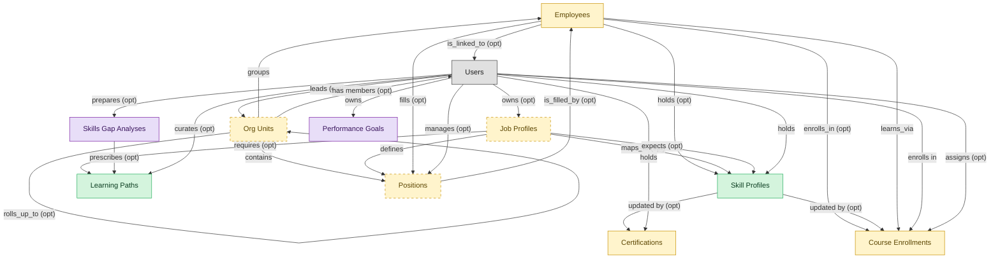

# Skills and Learning Paths

## 1. Overview

Skills-cloud surface of an LMS: employee skill profiles, competency tracking, and skills-driven learning-path recommendation. Masters `skill_profiles` and `learning_paths`. Realizes SKILLS-MGMT and LEARNING-PATH. Distinct from LMS-COURSE-DELIVERY because learning paths here are assigned to close skill gaps rather than sequenced as course curricula. Heavy contributors: TALENT-MGMT (talent reviews), ATS (internal mobility), SWP (workforce planning).

## 2. Entity summary

| Name | Description |
| --- | --- |
| Learning Paths | Curated sequence of courses targeting a role, skill, or certification. Drives ordered enrolment and progress tracking across multiple courses. |
| Skill Profiles | Per-worker collection of skills with self-assessed and validated proficiency levels, derived from completed courses, certifications, performance signals, and inferred peer-comparison. The central artifact of HCM-side skills-cloud and talent-intelligence offerings. |
| Certifications | Issued credential against a worker (internal certification, vendor cert, regulatory cert) with issue date, expiry, issuing body, and renewal rules. Drives recertification campaigns. |
| Course Enrollments | Per-learner per-course state record: assigned date, due date, attempts, status (not_started, in_progress, completed, expired), score. The operational unit of learning tracking. |
| Employees | Canonical record of a person currently or formerly employed by the organization. Carries identity (legal name, contact, IDs), employment metadata (start date, end date, employment type, country), and pointers to position, job profile, org unit, manager, and life-event history. The most multi-mastered data object in the catalog: HCM masters the core HR slice, Payroll masters the comp/withholding slice, and IGA masters the identity/access slice. Onboarding, PA, and Talent Management consume or contribute. |
| Job Profiles | Canonical role definition in the job catalog: title, family, level, responsibilities, required skills and competencies, pay range, FLSA classification. Distinct from positions (which are slots referencing a profile). Many positions share a single job profile. |
| Org Units | Node in the organizational hierarchy: division, business unit, department, team. Carries manager, cost center alignment, geographic scope, and parent/child relationships. HCM masters the operational hierarchy; EPM contributes the cost-center mapping (which would be Finance-mastered once a Finance/GL domain is loaded). |
| Positions | Approved slot in the org - a 'chair' with role definition, cost center, reporting line, location, and FTE allocation. Distinct from job_profiles (the catalog definition) and from employees (the person filling the slot). A position can be open, filled, or eliminated. SWP designs future positions via org_designs; HCM operationalizes them once approved. |
| Performance Goals | Individual goal or OKR with owner, period, metric, weight, status, alignment to organisational objectives. Reviewed within performance_reviews cycles. |
| Skills Gap Analyses | Comparison of current-state skills inventory vs future-state demand by role, level, and geography. Drives build/buy/borrow strategy: which gaps to close via training (LMS), external hires (ATS), or contingent workforce. Outputs feed both SWP scenarios and LMS curriculum decisions. |

## 3. Entities catalog

| # | data_object | role | mastered in | necessity | pattern flags | notes |
| ---: | --- | --- | --- | --- | --- | --- |
| 1 | `learning_paths` (Learning Paths) | master | - | required | - | - |
| 2 | `skill_profiles` (Skill Profiles) | master | - | required | personal_content | - |
| 3 | `learner_certifications` (Certifications) | embedded_master | `lms-compliance-training` | required | personal_content | - |
| 4 | `course_enrollments` (Course Enrollments) | embedded_master | `lms-course-delivery` | required | personal_content | - |
| 5 | `employees` (Employees) | embedded_master | `hcm-core-worker` | required | personal_content | - |
| 6 | `job_profiles` (Job Profiles) | embedded_master | `hcm-org-positions` | optional | single_approver | - |
| 7 | `org_units` (Org Units) | embedded_master | `hcm-org-positions` | optional | - | - |
| 8 | `hcm_positions` (Positions) | embedded_master | `hcm-org-positions` | optional | single_approver | - |
| 9 | `performance_goals` (Performance Goals) | consumer | `talent-performance-mgmt` | required | personal_content | - |
| 10 | `skills_gap_analyses` (Skills Gap Analyses) | consumer | `swp-demand-forecast` | required | - | - |

## 4. Aliases and industry synonyms

_(no industry-scoped aliases or non-synonym alias types loaded for this scope; generic synonyms are omitted as common knowledge.)_

## 5. Relationships

### 5.1 Intra-scope edges

| from | verb | to | cardinality | kind | necessity | owner_side | notes |
| --- | --- | --- | --- | --- | --- | --- | --- |
| `org_units` | groups | `employees` | one_to_many | reference | required | source | - |
| `org_units` | contains | `hcm_positions` | one_to_many | reference | required | source | - |
| `hcm_positions` | is_filled_by | `employees` | one_to_one | reference | optional | target | - |
| `job_profiles` | defines | `hcm_positions` | one_to_many | reference | required | source | - |
| `employees` | holds | `skill_profiles` | one_to_one | reference | optional | source | - |
| `job_profiles` | maps_to | `skill_profiles` | many_to_many | association | optional | source | - |
| `employees` | enrolls_in | `course_enrollments` | one_to_many | reference | optional | source | - |
| `skill_profiles` | updated by | `learner_certifications` | one_to_many | reference | optional | source | - |
| `skill_profiles` | updated by | `course_enrollments` | one_to_many | reference | optional | source | - |
| `job_profiles` | requires | `learning_paths` | many_to_many | association | optional | source | - |
| `job_profiles` | expects | `skill_profiles` | many_to_many | association | optional | source | - |
| `employees` | fills | `hcm_positions` | one_to_one | reference | optional | source | - |
| `employees` | learns_via | `course_enrollments` | one_to_many | reference | required | source | - |
| `org_units` | rolls_up_to | `org_units` | one_to_many | reference | optional | source | - |
| `skills_gap_analyses` | prescribes | `learning_paths` | one_to_many | reference | optional | source | - |

### 5.2 Built-in edges (`users` and other platform built-ins)

| from | verb | to | cardinality | necessity | owner_side | notes |
| --- | --- | --- | --- | --- | --- | --- |
| `users` | curates | `learning_paths` | one_to_many | optional | source | - |
| `employees` | is_linked_to | `users` | one_to_one | optional | target | - |
| `users` | manages | `hcm_positions` | one_to_many | optional | source | - |
| `users` | leads | `org_units` | one_to_many | optional | source | - |
| `users` | owns | `job_profiles` | one_to_many | optional | source | - |
| `users` | enrolls in | `course_enrollments` | one_to_many | required | source | - |
| `users` | assigns | `course_enrollments` | one_to_many | optional | source | - |
| `users` | holds | `learner_certifications` | one_to_many | required | source | - |
| `users` | holds | `skill_profiles` | one_to_many | required | source | - |
| `users` | owns | `performance_goals` | one_to_many | required | target | - |
| `org_units` | has members | `users` | one_to_many | optional | target | - |
| `users` | prepares | `skills_gap_analyses` | one_to_many | optional | source | - |

### 5.3 Cross-scope edges

| from | verb | to | cardinality | necessity | notes |
| --- | --- | --- | --- | --- | --- |
| `employees` | triggers | `iga_provisioning_events` | one_to_many | optional | - |
| `employees` | finalized by | `onboarding_document_collections` | one_to_many | optional | - |
| `pre_employees` | promotes to | `employees` | one_to_one | required | - |
| `legal_holds` | identifies_custodians_from | `employees` | many_to_many | optional | - |
| `legal_advice_records` | references | `employees` | many_to_many | optional | - |
| `employees` | is host for | `host_assignments` | one_to_many | required | - |
| `employees` | signs | `employment_contracts` | one_to_many | required | - |
| `employees` | generates | `employment_events` | one_to_many | required | - |
| `cost_centers` | funds | `org_units` | one_to_many | required | - |
| `employees` | triggers | `asset_lifecycle_events` | one_to_many | optional | - |
| `employees` | requests | `absence_requests` | one_to_many | optional | - |
| `org_units` | engages | `contingent_workers` | one_to_many | optional | - |
| `org_units` | is_scored_by | `engagement_drivers` | one_to_many | optional | - |
| `org_units` | is_measured_by | `people_kpis` | one_to_many | optional | - |
| `employees` | triggers | `service_requests` | one_to_many | optional | - |
| `org_units` | triggers | `iga_entitlement_definitions` | one_to_many | optional | - |
| `employees` | triggers | `pay_runs` | one_to_many | optional | - |
| `hcm_positions` | spawns | `job_requisitions` | one_to_many | optional | - |
| `job_profiles` | feeds | `job_postings` | one_to_many | optional | - |
| `job_profiles` | maps_to | `courses` | many_to_many | optional | - |
| `employees` | becomes | `career_aspirations` | one_to_one | optional | - |
| `employees` | becomes | `work_shifts` | one_to_many | optional | - |
| `employees` | becomes | `compensation_statements` | one_to_one | optional | - |
| `salary_bands` | anchors | `hcm_positions` | one_to_many | optional | - |
| `salary_bands` | bands | `job_profiles` | one_to_many | optional | - |
| `employees` | triggers | `benefit_enrollments` | one_to_many | optional | - |
| `org_units` | maps_to | `cost_centers` | one_to_one | optional | - |
| `employees` | triggers | `corporate_cards` | one_to_many | optional | - |
| `employees` | spawns | `onboarding_journeys` | one_to_one | optional | - |
| `employees` | spawns | `hr_cases` | one_to_many | optional | - |
| `employees` | feeds | `headcount_plans` | one_to_many | optional | - |
| `employees` | feeds | `agency_time_entries` | one_to_many | optional | - |
| `employees` | onboarded by | `onboarding_journeys` | one_to_many | required | - |
| `onboarding_tasks` | spawns | `course_enrollments` | one_to_many | optional | - |
| `courses` | sequenced_into | `learning_paths` | many_to_many | optional | - |
| `courses` | enrolled_via | `course_enrollments` | one_to_many | required | - |
| `course_enrollments` | produces | `learning_records` | one_to_many | required | - |
| `courses` | grants | `learner_certifications` | one_to_many | optional | - |
| `hcm_positions` | requires | `compliance_assignments` | one_to_many | optional | - |
| `org_units` | sponsors | `compliance_assignments` | one_to_many | optional | - |
| `cost_centers` | funds | `course_enrollments` | one_to_many | optional | - |
| `employees` | reflects | `learning_records` | one_to_many | optional | - |
| `employees` | reflected on | `compliance_assignments` | one_to_many | optional | - |
| `skill_profiles` | feeds | `candidates` | one_to_many | optional | - |
| `skill_profiles` | feeds | `career_aspirations` | one_to_many | optional | - |
| `course_enrollments` | updates | `career_aspirations` | one_to_many | optional | - |
| `employees` | declares | `life_events` | one_to_many | optional | - |
| `org_units` | sponsors | `benefit_plans` | many_to_many | optional | - |
| `employees` | updated by | `life_events` | one_to_many | optional | - |
| `survey_campaigns` | targets | `org_units` | many_to_many | optional | - |
| `org_units` | owns | `action_plans` | one_to_many | optional | - |
| `employees` | submits | `survey_responses` | one_to_many | optional | - |
| `employees` | flagged on | `engagement_drivers` | one_to_many | optional | - |
| `employees` | reflected on | `engagement_drivers` | one_to_many | optional | - |
| `employees` | raises | `hr_cases` | one_to_many | required | - |
| `employees` | updated by | `hr_cases` | one_to_many | optional | - |
| `case_categories` | drives | `employees` | one_to_many | optional | - |
| `contingent_workers` | reviewed_against | `employees` | one_to_one | optional | - |
| `candidates` | becomes | `employees` | one_to_one | required | - |
| `employees` | enrolls_in | `benefit_enrollments` | one_to_many | required | - |
| `survey_campaigns` | targets | `employees` | many_to_many | optional | - |
| `performance_reviews` | evaluates | `performance_goals` | one_to_many | optional | - |
| `performance_goals` | aligns_to | `okr_objectives` | many_to_many | optional | - |
| `position_demand_forecasts` | grounds | `skills_gap_analyses` | one_to_many | optional | - |
| `workforce_scenarios` | drives | `hcm_positions` | one_to_many | required | - |
| `org_designs` | proposes | `hcm_positions` | one_to_many | required | - |

## 6. Cross-domain context

### 6.1 Master consumers (other modules / domains that embed this scope's masters)

| data_object | other module / domain | role | necessity | notes |
| --- | --- | --- | --- | --- |
| `skill_profiles` | ATS-CANDIDATE-CRM (Candidate CRM) - ATS | contributor | required | - |
| `skill_profiles` | HCM-LIFECYCLE-WORKFLOWS (Employee Lifecycle Workflows) - HCM | consumer | optional | - |
| `skill_profiles` | TALENT-PERFORMANCE-MGMT (Performance and Goal Management) - TALENT-MGMT | contributor | required | - |

### 6.2 Outbound handoffs (events this scope publishes)

| source module | target domain | target module | trigger_event | payload | integration | friction | description |
| --- | --- | --- | --- | --- | --- | --- | --- |
| LMS-SKILLS | ATS | ATS-CANDIDATE-CRM | `skill_profile.updated` | `skill_profiles` | event_stream | medium | Internal-candidate skill data flows into ATS for internal mobility sourcing. |
| LMS-SKILLS | LMS | LMS-COURSE-DELIVERY | `learning_path.assigned` | `learning_paths` | lifecycle_progression | low | - |
| LMS-SKILLS | TALENT-MGMT | TALENT-PERFORMANCE-MGMT | `skill_profile.updated` | `skill_profiles` | event_stream | medium | Skill-profile refresh drives internal mobility, succession, and dev-plan suggestions. |

### 6.3 Inbound handoffs (events this scope reacts to)

| target module | source domain | source module | trigger_event | payload | integration | friction | description |
| --- | --- | --- | --- | --- | --- | --- | --- |
| LMS-SKILLS | SWP | SWP-DEMAND-FORECAST | `skills_gap_analysis.completed` | `skills_gap_analyses` | event_stream | medium | Identified gaps drive LMS curriculum updates and assignment campaigns. |
| LMS-SKILLS | TALENT-MGMT | TALENT-PERFORMANCE-MGMT | `performance_goal.set` | `performance_goals` | event_stream | low | Goal setting drives learning-path suggestions for capability gaps. |
| LMS-SKILLS | LMS | LMS-COURSE-DELIVERY | `course_enrollment.completed` | `course_enrollments` | lifecycle_progression | low | - |
| LMS-SKILLS | LMS | LMS-COMPLIANCE-TRAINING | `learner_certification.earned` | `learner_certifications` | lifecycle_progression | low | - |
| LMS-SKILLS | HCM | HCM-ORG-POSITIONS | `job_profile.published` | `job_profiles` | event_stream | low | Job profile competencies drive LMS skill-profile expectations and required-training assignments. |

### 6.4 Master providers (modules / domains that own masters this scope embeds)

| data_object | role here | necessity | canonical owner(s) | slice notes |
| --- | --- | --- | --- | --- |
| `course_enrollments` | embedded_master | required | LMS-COURSE-DELIVERY (LMS) | - |
| `employees` | embedded_master | required | HCM-CORE-WORKER (HCM), PAYROLL (Payroll Management), IGA (Identity Governance and Administration), MDM (Master Data Management) | - |
| `hcm_positions` | embedded_master | optional | HCM-ORG-POSITIONS (HCM) | - |
| `job_profiles` | embedded_master | optional | HCM-ORG-POSITIONS (HCM) | - |
| `learner_certifications` | embedded_master | required | LMS-COMPLIANCE-TRAINING (LMS) | - |
| `org_units` | embedded_master | optional | HCM-ORG-POSITIONS (HCM) | - |
| `performance_goals` | consumer | required | TALENT-PERFORMANCE-MGMT (TALENT-MGMT) | - |
| `skills_gap_analyses` | consumer | required | SWP-DEMAND-FORECAST (SWP) | - |

## 7. Lifecycle states (per touched entity)

### `course_enrollments` (Course Enrollment)

_This scope holds `course_enrollments` as **embedded_master**; the canonical state machine is owned by `LMS-COURSE-DELIVERY`._

| order | state_name | initial? | terminal? | requires_permission? | derived gate | description |
| --- | --- | --- | --- | --- | --- | --- |
| 1 | `enrolled` | ✓ | - | - | - | Learner enrolled in the course but has not started. |
| 2 | `in_progress` | - | - | - | - | Learner has begun the course content or activities. |
| 3 | `completed` | - | ✓ | ✓ | `lms-course-delivery:complete` | Learner met all completion criteria with a passing score. |
| 4 | `failed` | - | ✓ | ✓ | `lms-course-delivery:fail` | Learner did not meet the passing criteria within allowed attempts. |
| 5 | `expired` | - | ✓ | ✓ | `lms-course-delivery:expire` | Enrollment closed unmet at the due date or content expiry. |
| 6 | `withdrawn` | - | ✓ | ✓ | `lms-course-delivery:withdraw` | Learner withdrew or was unenrolled before completion. |

### `employees` (Employee)

_This scope holds `employees` as **embedded_master**; the canonical state machine is owned by `HCM-CORE-WORKER`._

| order | state_name | initial? | terminal? | requires_permission? | derived gate | description |
| --- | --- | --- | --- | --- | --- | --- |
| 1 | `draft` | ✓ | - | - | - | Pre-hire stub created during requisition or onboarding handoff; not yet a worker of record. |
| 2 | `active` | - | - | ✓ | `hcm-core-worker:active_employee` | Worker is currently employed and appears in headcount, payroll eligibility, and directory feeds. |
| 3 | `on_leave` | - | - | ✓ | `hcm-core-worker:on_leave_employee` | Employee is on approved leave (parental, medical, sabbatical); active record but suppressed from some downstream feeds. |
| 4 | `suspended` | - | - | ✓ | `hcm-core-worker:suspended_employee` | Employment temporarily halted (investigation, disciplinary); pay and access may be paused. |
| 5 | `terminated` | - | ✓ | ✓ | `hcm-core-worker:terminated_employee` | Employment ended (voluntary or involuntary); final pay processed, access deprovisioned. |

### `hcm_positions` (Position)

_This scope holds `hcm_positions` as **embedded_master**; the canonical state machine is owned by `HCM-ORG-POSITIONS`._

| order | state_name | initial? | terminal? | requires_permission? | derived gate | description |
| --- | --- | --- | --- | --- | --- | --- |
| 1 | `proposed` | ✓ | - | - | - | Position has been designed but not yet approved against the headcount plan. |
| 2 | `approved` | - | - | ✓ | `hcm-org-positions:approved_position` | Cleared by headcount/finance owner; eligible to spawn a requisition. |
| 3 | `open` | - | - | ✓ | `hcm-org-positions:open_position` | Approved and actively being recruited against; not yet filled. |
| 4 | `filled` | - | - | ✓ | `hcm-org-positions:filled_position` | An employee occupies the position. |
| 5 | `frozen` | - | - | ✓ | `hcm-org-positions:frozen_position` | Temporarily not fillable (hiring freeze, budget hold); retains the slot. |
| 6 | `eliminated` | - | ✓ | ✓ | `hcm-org-positions:eliminated_position` | Removed from the org structure permanently. |

### `job_profiles` (Job Profile)

_This scope holds `job_profiles` as **embedded_master**; the canonical state machine is owned by `HCM-ORG-POSITIONS`._

| order | state_name | initial? | terminal? | requires_permission? | derived gate | description |
| --- | --- | --- | --- | --- | --- | --- |
| 1 | `draft` | ✓ | - | - | - | Profile is being authored or revised; not yet available for position assignment. |
| 2 | `approved` | - | - | ✓ | `hcm-org-positions:approved_job_profile` | Cleared by the catalog owner; ready to be referenced by positions and postings. |
| 3 | `active` | - | - | ✓ | `hcm-org-positions:active_job_profile` | In production use; positions and postings can reference it. |
| 4 | `retired` | - | ✓ | ✓ | `hcm-org-positions:retired_job_profile` | No longer assignable to new positions; historical references preserved. |

### `learner_certifications` (Certification)

_This scope holds `learner_certifications` as **embedded_master**; the canonical state machine is owned by `LMS-COMPLIANCE-TRAINING`._

| order | state_name | initial? | terminal? | requires_permission? | derived gate | description |
| --- | --- | --- | --- | --- | --- | --- |
| 1 | `issued` | ✓ | - | ✓ | `lms-compliance-training:issue` | Credential awarded to the learner with issue and expiry dates. |
| 2 | `active` | - | - | - | - | Credential in force and valid for compliance or role requirements. |
| 3 | `renewing` | - | - | - | - | Recertification campaign engaged before expiry. |
| 4 | `renewed` | - | - | ✓ | `lms-compliance-training:renew` | Credential renewed with a fresh validity window. |
| 5 | `expired` | - | ✓ | - | - | Credential past its expiry date and no longer valid. |
| 6 | `revoked` | - | ✓ | ✓ | `lms-compliance-training:revoke` | Credential withdrawn by the issuing body or L&D for cause. |

### `learning_paths` (Learning Path)

| order | state_name | initial? | terminal? | requires_permission? | derived gate | description |
| --- | --- | --- | --- | --- | --- | --- |
| 1 | `draft` | ✓ | - | - | - | Path being curated by L&D with course sequencing. |
| 2 | `published` | - | - | ✓ | `lms-skills:publish` | Path released and assignable to roles, skills, or audiences. |
| 3 | `retired` | - | ✓ | ✓ | `lms-skills:retire` | Path removed from new assignments and kept for historical reference. |

### `org_units` (Org Unit)

_This scope holds `org_units` as **embedded_master**; the canonical state machine is owned by `HCM-ORG-POSITIONS`._

| order | state_name | initial? | terminal? | requires_permission? | derived gate | description |
| --- | --- | --- | --- | --- | --- | --- |
| 1 | `draft` | ✓ | - | - | - | Org unit defined as part of a future structure; not yet operational. |
| 2 | `active` | - | - | ✓ | `hcm-org-positions:active_org_unit` | Operational unit; carries headcount, cost-center linkage, and reporting lines. |
| 3 | `reorganized` | - | ✓ | ✓ | `hcm-org-positions:reorganized_org_unit` | Unit folded into or replaced by a new structure; references remain for history. |
| 4 | `closed` | - | ✓ | ✓ | `hcm-org-positions:closed_org_unit` | Unit dissolved; no employees or positions reside in it. |

### `performance_goals` (Performance Goal)

_This scope holds `performance_goals` as **consumer**; the canonical state machine is owned by `TALENT-PERFORMANCE-MGMT`._

| order | state_name | initial? | terminal? | requires_permission? | derived gate | description |
| --- | --- | --- | --- | --- | --- | --- |
| 1 | `drafted` | ✓ | - | - | - | Goal authored by employee or manager. |
| 2 | `approved` | - | - | ✓ | `talent-performance-mgmt:approve_performance_goal` | Manager approves the goal; it becomes part of the cycle. |
| 3 | `in_progress` | - | - | - | - | Goal is being worked. |
| 4 | `completed` | - | - | ✓ | `talent-performance-mgmt:complete_performance_goal` | Outcome recorded; counts toward review rating. |
| 5 | `cancelled` | - | ✓ | ✓ | `talent-performance-mgmt:cancel_performance_goal` | Goal abandoned (role change, priority shift, etc.). |

### `skill_profiles` (Skill Profile)

| order | state_name | initial? | terminal? | requires_permission? | derived gate | description |
| --- | --- | --- | --- | --- | --- | --- |
| 1 | `initialized` | ✓ | - | - | - | Profile seeded for the worker from role and prior signals. |
| 2 | `self_assessed` | - | - | - | - | Worker has captured self-assessed proficiency levels. |
| 3 | `validated` | - | - | ✓ | `lms-skills:validate` | Manager or skills owner validated proficiency entries. |
| 4 | `inactive` | - | ✓ | ✓ | `lms-skills:deactivate` | Profile retired (worker exit or role-change reset). |

### `skills_gap_analyses` (Skills Gap Analysis)

_This scope holds `skills_gap_analyses` as **consumer**; the canonical state machine is owned by `SWP-DEMAND-FORECAST`._

| order | state_name | initial? | terminal? | requires_permission? | derived gate | description |
| --- | --- | --- | --- | --- | --- | --- |
| 10 | `draft` | ✓ | - | - | - | Analysis under construction. |
| 20 | `published` | - | - | ✓ | `swp-demand-forecast:publish_skills_gap_analysis` | Analysis published; LMS curricula refresh, ATS sourcing prioritization shifts. |
| 90 | `archived` | - | ✓ | - | - | Analysis superseded by a later cycle. |

## 8. Permissions and business rules (derived)

### 8.1 Permissions

| permission | tier | description | included in `:admin`? |
| --- | --- | --- | --- |
| `lms-skills:read` | baseline-read | Read access to every entity in the module | ✓ |
| `lms-skills:manage` | baseline-manage | Edit operational records | ✓ |
| `lms-skills:admin` | baseline-admin | Edit reference data and inherit every workflow gate below | - |
| `lms-skills:publish` | workflow-gate (lifecycle) | Transition `learning_paths` into state `published` | ✓ |
| `lms-skills:retire` | workflow-gate (lifecycle) | Transition `learning_paths` into state `retired` | ✓ |
| `lms-skills:validate` | workflow-gate (lifecycle) | Transition `skill_profiles` into state `validated` | ✓ |
| `lms-skills:deactivate` | workflow-gate (lifecycle) | Transition `skill_profiles` into state `inactive` | ✓ |
| `lms-skills:view_all_skill_profiles` | override (personal_content) | View all `skill_profiles` rows beyond row-scope | ✓ |
| `lms-skills:manage_all_skill_profiles` | override (personal_content) | Manage all `skill_profiles` rows beyond row-scope | ✓ |

### 8.2 Business rules

| rule_name | data_object | source flag | intent |
| --- | --- | --- | --- |
| `skill_profile_edit_scope` | `skill_profiles` | has_personal_content | Row-scope by default; override via `lms-skills:view_all_skill_profiles` / `lms-skills:manage_all_skill_profiles` |
