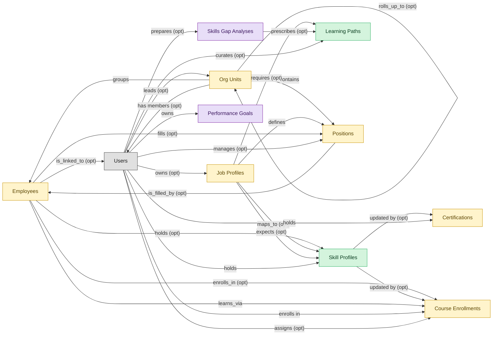

# Skills and Learning Paths

## 1. Overview

Skills-cloud surface of an LMS: employee skill profiles, competency tracking, and skills-driven learning-path recommendation. Masters `skill_profiles` and `learning_paths`. Realizes SKILLS-MGMT and LEARNING-PATH. Distinct from LMS-COURSE-DELIVERY because learning paths here are assigned to close skill gaps (Workday Skills Cloud, Cornerstone Skills Graph, SAP Skills Ontology, Degreed Pathways) rather than sequenced as course curricula. Heavy contributors: TALENT-MGMT (talent reviews), ATS (internal mobility), SWP (workforce planning).

## 2. Entity summary

| Name | Description |
| --- | --- |
| Learning Paths | Curated sequence of courses targeting a role, skill, or certification. Drives ordered enrolment and progress tracking across multiple courses. |
| Skill Profiles | Per-worker collection of skills with self-assessed and validated proficiency levels, derived from completed courses, certifications, performance signals, and inferred peer-comparison. The Workday Skills Cloud central artifact and equivalents (SuccessFactors Skills, Cornerstone Capabilities, Eightfold Talent DNA). |
| Certifications | Issued credential against a worker (internal certification, vendor cert, regulatory cert) with issue date, expiry, issuing body, and renewal rules. Drives recertification campaigns. |
| Course Enrollments | Per-learner per-course state record: assigned date, due date, attempts, status (not_started, in_progress, completed, expired), score. The operational unit of learning tracking. |
| Employees | Canonical record of a person currently or formerly employed by the organization. Carries identity (legal name, contact, IDs), employment metadata (start date, end date, employment type, country), and pointers to position, job profile, org unit, manager, and life-event history. The most multi-mastered data object in the catalog: HCM masters the core HR slice, Payroll masters the comp/withholding slice, and IGA masters the identity/access slice. Onboarding, PA, and Talent Management consume or contribute. |
| Job Profiles | Canonical role definition in the job catalog: title, family, level, responsibilities, required skills and competencies, pay range, FLSA classification. Distinct from positions (which are slots referencing a profile). Many positions share a single job profile. |
| Org Units | Node in the organizational hierarchy: division, business unit, department, team. Carries manager, cost center alignment, geographic scope, and parent/child relationships. HCM masters the operational hierarchy; EPM contributes the cost-center mapping (which would be Finance-mastered once a Finance/GL domain is loaded). |
| Positions | Approved slot in the org - a 'chair' with role definition, cost center, reporting line, location, and FTE allocation. Distinct from job_profiles (the catalog definition) and from employees (the person filling the slot). A position can be open, filled, or eliminated. SWP designs future positions via org_designs; HCM operationalizes them once approved. |
| Performance Goals | Individual goal or OKR with owner, period, metric, weight, status, alignment to organisational objectives. Reviewed within performance_reviews cycles. |
| Skills Gap Analyses | Comparison of current-state skills inventory vs future-state demand by role, level, and geography. Drives build/buy/borrow strategy: which gaps to close via training (LMS), external hires (ATS), or contingent workforce. Outputs feed both SWP scenarios and LMS curriculum decisions. |

## 3. Entities catalog

| # | data_object | role | mastered in | necessity | pattern flags | notes |
| ---: | --- | --- | --- | --- | --- | --- |
| 1 | `learning_paths` (Learning Paths) | master | - | required | - | - |
| 2 | `skill_profiles` (Skill Profiles) | master | - | required | personal_content | - |
| 3 | `learner_certifications` (Certifications) | embedded_master | `lms-compliance-training` | required | personal_content | - |
| 4 | `course_enrollments` (Course Enrollments) | embedded_master | `lms-course-delivery` | required | personal_content | - |
| 5 | `employees` (Employees) | embedded_master | `hcm-core-worker` | required | personal_content | - |
| 6 | `job_profiles` (Job Profiles) | embedded_master | `hcm-org-positions` | optional | single_approver | - |
| 7 | `org_units` (Org Units) | embedded_master | `hcm-org-positions` | optional | - | - |
| 8 | `hcm_positions` (Positions) | embedded_master | `hcm-org-positions` | optional | single_approver | - |
| 9 | `performance_goals` (Performance Goals) | consumer | `talent-performance-mgmt` | required | personal_content | - |
| 10 | `skills_gap_analyses` (Skills Gap Analyses) | consumer | `swp-demand-forecast` | required | - | - |

## 4. Aliases and industry synonyms

_(no industry-scoped aliases or non-synonym alias types loaded for this scope; generic synonyms are omitted as common knowledge.)_

## 5. Relationships

### 5.1 Intra-scope edges

| from | verb | to | cardinality | kind | necessity | owner_side | notes |
| --- | --- | --- | --- | --- | --- | --- | --- |
| `org_units` | groups | `employees` | one_to_many | reference | required | source | intra \| cluster A \| HCM \| every employee rolls up to an org unit |
| `org_units` | contains | `hcm_positions` | one_to_many | reference | required | source | intra \| cluster A \| HCM \| positions live inside an org unit |
| `hcm_positions` | is_filled_by | `employees` | one_to_one | reference | optional | target | intra \| cluster A \| HCM \| a position may be vacant or filled by one incumbent |
| `job_profiles` | defines | `hcm_positions` | one_to_many | reference | required | source | intra \| cluster A \| HCM \| job profile is the template for positions |
| `employees` | holds | `skill_profiles` | one_to_one | reference | optional | source | intra \| cluster A \| HCM \| each employee may have a skill profile |
| `job_profiles` | maps_to | `skill_profiles` | many_to_many | association | optional | source | intra \| cluster A \| HCM \| competencies expected by job profile |
| `employees` | enrolls_in | `course_enrollments` | one_to_many | reference | optional | source | cross \| cluster A \| HCM \| new-hire creation provisions LMS training |
| `skill_profiles` | updated by | `learner_certifications` | one_to_many | reference | optional | source | intra \| cluster A \| LMS \| earning a cert refreshes the worker skill profile \| auto-flipped from many_to_one |
| `skill_profiles` | updated by | `course_enrollments` | one_to_many | reference | optional | source | intra \| cluster A \| LMS \| completion refreshes skill profile \| auto-flipped from many_to_one |
| `job_profiles` | requires | `learning_paths` | many_to_many | association | optional | source | intra \| cluster A \| LMS \| job-profile competency paths |
| `job_profiles` | expects | `skill_profiles` | many_to_many | association | optional | source | intra \| cluster A \| LMS \| competency expectation by profile |
| `employees` | fills | `hcm_positions` | one_to_one | reference | optional | source | intra \| cluster A \| ONBOARDING \| embedded: incumbent of the position being onboarded |
| `employees` | learns_via | `course_enrollments` | one_to_many | reference | required | source | intra \| cluster A \| LMS \| embedded: learner identity |
| `org_units` | rolls_up_to | `org_units` | one_to_many | reference | optional | source | Hierarchical parent-child between org_units (Team -> Department -> Division -> BU -> Company). |
| `skills_gap_analyses` | prescribes | `learning_paths` | one_to_many | reference | optional | source | cross \| SWP→LMS \| skills_gap_analysis.completed prescribes learning_paths for capability build. |

### 5.2 Built-in edges (`users` and other platform built-ins)

| from | verb | to | cardinality | necessity | owner_side | notes |
| --- | --- | --- | --- | --- | --- | --- |
| `employees` | is_linked_to | `users` | one_to_one | optional | target | users \| cluster A \| HCM \| every employee maps to an identity user |
| `users` | manages | `hcm_positions` | one_to_many | optional | source | users \| cluster A \| HCM \| manager-of-position relationship \| auto-flipped from many_to_one |
| `users` | leads | `org_units` | one_to_many | optional | source | users \| cluster A \| HCM \| org-unit head \| auto-flipped from many_to_one |
| `users` | owns | `job_profiles` | one_to_many | optional | source | users \| cluster A \| HCM \| catalog owner (HR/COE) \| auto-flipped from many_to_one |
| `users` | holds | `learner_certifications` | one_to_many | required | source | users \| cluster A \| LMS \| cert holder \| auto-flipped from many_to_one |
| `users` | enrolls in | `course_enrollments` | one_to_many | required | source | users \| cluster A \| LMS \| learner identity \| auto-flipped from many_to_one |
| `users` | assigns | `course_enrollments` | one_to_many | optional | source | users \| cluster A \| LMS \| assigning manager \| auto-flipped from many_to_one |
| `users` | curates | `learning_paths` | one_to_many | optional | source | users \| cluster A \| LMS \| curriculum owner \| auto-flipped from many_to_one |
| `users` | holds | `skill_profiles` | one_to_many | required | source | users \| cluster A \| LMS \| learner identity \| auto-flipped from many_to_one |
| `users` | owns | `performance_goals` | one_to_many | required | target | The employee whose goal it is. |
| `org_units` | has members | `users` | one_to_many | optional | target | Every user is assigned to one or more org_units (department membership). Drives assignment routing, RBAC scoping, and chargeback. |
| `users` | prepares | `skills_gap_analyses` | one_to_many | optional | source | Analyst who authors the skills-gap analysis. |

### 5.3 Cross-scope edges

| from | verb | to | cardinality | necessity | notes |
| --- | --- | --- | --- | --- | --- |
| `employees` | signs | `employment_contracts` | one_to_many | required | intra \| cluster A \| HCM \| contracts belong to the employee |
| `employees` | generates | `employment_events` | one_to_many | required | intra \| cluster A \| HCM \| hire/transfer/leave/term events for an employee |
| `cost_centers` | funds | `org_units` | one_to_many | required | intra \| cluster A \| HCM \| org-unit labor cost rolls to a cost center \| auto-flipped from many_to_one |
| `employees` | triggers | `asset_lifecycle_events` | one_to_many | optional | intra \| cluster A \| HCM \| issue/return/recall events tied to the employee |
| `employees` | requests | `absence_requests` | one_to_many | optional | intra \| cluster A \| HCM \| self-service absence requests originate from employee |
| `org_units` | engages | `contingent_workers` | one_to_many | optional | intra \| cluster A \| HCM \| contingent workforce attaches to an org unit |
| `org_units` | is_scored_by | `engagement_drivers` | one_to_many | optional | intra \| cluster A \| HCM \| engagement drivers measured at org-unit level |
| `org_units` | is_measured_by | `people_kpis` | one_to_many | optional | intra \| cluster A \| HCM \| people KPIs aggregated by org unit |
| `employees` | triggers | `service_requests` | one_to_many | optional | cross \| cluster A \| HCM \| termination fan-out of offboarding service requests in ITSM |
| `employees` | feeds | `agency_time_entries` | one_to_many | optional | cross \| cluster A \| HCM \| agency staff termination freezes time entries in AGENCY-MGMT |
| `employees` | triggers | `iga_provisioning_events` | one_to_many | optional | cross \| cluster A \| HCM \| create/terminate/promote drives IGA account/entitlement actions |
| `org_units` | triggers | `iga_entitlement_definitions` | one_to_many | optional | cross \| cluster A \| HCM \| new/merged/disbanded org units drive IGA group lifecycle |
| `employees` | triggers | `pay_runs` | one_to_many | optional | cross \| cluster A \| HCM \| new-hire/termination/promotion drives Payroll comp activation and final pay |
| `hcm_positions` | spawns | `job_requisitions` | one_to_many | optional | cross \| cluster A \| HCM \| approved position becomes a requisition in ATS |
| `job_profiles` | feeds | `job_postings` | one_to_many | optional | cross \| cluster A \| HCM \| canonical job profile feeds ATS posting templates |
| `job_profiles` | maps_to | `courses` | many_to_many | optional | cross \| cluster A \| HCM \| job-profile competencies drive required training |
| `employees` | becomes | `career_aspirations` | one_to_one | optional | cross \| cluster A \| HCM \| new employee triggers talent-profile initialization in Talent-Mgmt |
| `employees` | becomes | `work_shifts` | one_to_many | optional | cross \| cluster A \| HCM \| new employee becomes a schedulable resource in WFM |
| `employees` | becomes | `compensation_statements` | one_to_one | optional | cross \| cluster A \| HCM \| new-hire/promotion drives Comp-Mgmt compensation basis |
| `salary_bands` | anchors | `hcm_positions` | one_to_many | optional | cross \| cluster A \| HCM \| approved position carries grade/band to Comp-Mgmt \| auto-flipped from many_to_one |
| `salary_bands` | bands | `job_profiles` | one_to_many | optional | cross \| cluster A \| HCM \| job-profile-to-salary-band mapping is authoritative \| auto-flipped from many_to_one |
| `employees` | triggers | `benefit_enrollments` | one_to_many | optional | cross \| cluster A \| HCM \| create/terminate/event drives BEN-ADMIN eligibility & COBRA |
| `org_units` | maps_to | `cost_centers` | one_to_one | optional | cross \| cluster A \| HCM \| new org unit usually maps to ERP-FIN cost center |
| `employees` | triggers | `corporate_cards` | one_to_many | optional | cross \| cluster A \| HCM \| termination deactivates corporate cards in EXPENSE |
| `employees` | spawns | `onboarding_journeys` | one_to_one | optional | cross \| cluster A \| HCM \| new-hire creation triggers onboarding plan instantiation |
| `employees` | spawns | `hr_cases` | one_to_many | optional | cross \| cluster A \| HCM \| termination kicks off offboarding HR case in HRSD |
| `employees` | feeds | `headcount_plans` | one_to_many | optional | cross \| cluster A \| HCM \| headcount actuals reconcile to SWP plan |
| `employees` | onboarded by | `onboarding_journeys` | one_to_many | required | intra \| cluster A \| ONBOARDING \| journey is bound to one new-hire employee \| auto-flipped from many_to_one |
| `employees` | finalized by | `onboarding_document_collections` | one_to_many | optional | cross \| cluster A \| ONBOARDING \| all docs collected → HCM finalizes employee record \| auto-flipped from many_to_one |
| `onboarding_tasks` | spawns | `course_enrollments` | one_to_many | optional | cross \| cluster A \| ONBOARDING \| compliance-training task triggers LMS enrollment |
| `courses` | sequenced_into | `learning_paths` | many_to_many | optional | intra \| cluster A \| LMS \| a path is an ordered collection of courses |
| `courses` | enrolled_via | `course_enrollments` | one_to_many | required | intra \| cluster A \| LMS \| enrollments reference a course |
| `course_enrollments` | produces | `learning_records` | one_to_many | required | intra \| cluster A \| LMS \| transcript records derive from enrollments |
| `courses` | grants | `learner_certifications` | one_to_many | optional | intra \| cluster A \| LMS \| certifications earned from courses |
| `hcm_positions` | requires | `compliance_assignments` | one_to_many | optional | intra \| cluster A \| LMS \| role-based compliance training |
| `org_units` | sponsors | `compliance_assignments` | one_to_many | optional | intra \| cluster A \| LMS \| org-unit assigns compliance training |
| `cost_centers` | funds | `course_enrollments` | one_to_many | optional | intra \| cluster A \| LMS \| training cost allocation |
| `employees` | reflects | `learning_records` | one_to_many | optional | cross \| cluster A \| LMS \| learning transcript visible on HCM employee record \| auto-flipped from many_to_one |
| `employees` | reflected on | `compliance_assignments` | one_to_many | optional | cross \| cluster A \| LMS \| lapsed mandatory training surfaces on HCM employee record \| auto-flipped from many_to_one |
| `skill_profiles` | feeds | `candidates` | one_to_many | optional | cross \| cluster A \| LMS \| internal-candidate skill data flows to ATS |
| `skill_profiles` | feeds | `career_aspirations` | one_to_many | optional | cross \| cluster A \| LMS \| skill profile drives talent-mobility matching |
| `course_enrollments` | updates | `career_aspirations` | one_to_many | optional | cross \| cluster A \| LMS \| completion drives dev-plans / succession |
| `employees` | declares | `life_events` | one_to_many | optional | intra \| cluster A \| BEN-ADMIN \| embedded: employee declaring event |
| `org_units` | sponsors | `benefit_plans` | many_to_many | optional | intra \| cluster A \| BEN-ADMIN \| embedded: org-level offering |
| `employees` | updated by | `life_events` | one_to_many | optional | cross \| cluster A \| BEN-ADMIN \| approved life event may update dependents / emergency contacts in HCM \| auto-flipped from many_to_one |
| `survey_campaigns` | targets | `org_units` | many_to_many | optional | intra \| cluster A \| EMP-EXP \| embedded: org-unit scoping |
| `org_units` | owns | `action_plans` | one_to_many | optional | intra \| cluster A \| EMP-EXP \| org-unit accountable for action plan \| auto-flipped from many_to_one |
| `employees` | submits | `survey_responses` | one_to_many | optional | intra \| cluster A \| EMP-EXP \| respondent identity at employee level \| auto-flipped from many_to_one |
| `employees` | flagged on | `engagement_drivers` | one_to_many | optional | cross \| cluster A \| EMP-EXP \| high attrition-risk surfaces on HCM employee dashboard \| auto-flipped from many_to_one |
| `employees` | reflected on | `engagement_drivers` | one_to_many | optional | cross \| cluster A \| EMP-EXP \| survey-cycle results visible to HRBPs in HCM \| auto-flipped from many_to_one |
| `employees` | raises | `hr_cases` | one_to_many | required | intra \| cluster A \| HRSD \| requester identity (employee scope) \| auto-flipped from many_to_one |
| `employees` | updated by | `hr_cases` | one_to_many | optional | cross \| cluster A \| HRSD \| HR cases involving data changes flow back to HCM \| auto-flipped from many_to_one |
| `case_categories` | drives | `employees` | one_to_many | optional | cross \| cluster A \| HRSD \| taxonomy affects HCM employee-portal self-service routing |
| `legal_holds` | identifies_custodians_from | `employees` | many_to_many | optional | cross \| cluster C \| LSD \| HCM employee data drives custodian id |
| `legal_advice_records` | references | `employees` | many_to_many | optional | cross \| cluster C \| LSD \| employee-related advice from HR case |
| `employees` | is host for | `host_assignments` | one_to_many | required | cross \| cluster C \| VIS-MGMT \| host notifications trigger employee engagement \| auto-flipped from many_to_one |
| `contingent_workers` | reviewed_against | `employees` | one_to_one | optional | cross \| cluster D \| VMS \| tenure-threshold crossover triggers HCM reclassification/conversion |
| `candidates` | becomes | `employees` | one_to_one | required | cross \| ATS→HCM \| candidate.hired creates employee record; identity handoff |
| `pre_employees` | promotes to | `employees` | one_to_one | required | cross \| ATS->HCM \| pre_employee.activated converts the pre-hire record into the canonical HCM employee record |
| `employees` | enrolls_in | `benefit_enrollments` | one_to_many | required | intra \| cluster A \| BEN-ADMIN \| embedded: enrollee identity |
| `survey_campaigns` | targets | `employees` | many_to_many | optional | intra \| cluster A \| EMP-EXP \| embedded: invited population |
| `performance_reviews` | evaluates | `performance_goals` | one_to_many | optional | A review cycle assesses many goals set for the same employee/cycle. Goals exist independently of any single review. |
| `performance_goals` | aligns_to | `okr_objectives` | many_to_many | optional | Goals and OKRs align bidirectionally when the org runs both. A goal can roll up to an OKR; an OKR can be measured by goals. |
| `position_demand_forecasts` | grounds | `skills_gap_analyses` | one_to_many | optional | Position-demand forecasts ground skills-gap analyses (future-state demand). |
| `workforce_scenarios` | drives | `hcm_positions` | one_to_many | required | cross \| SWP→HCM \| adopted scenario drives HCM position changes. |
| `org_designs` | proposes | `hcm_positions` | one_to_many | required | cross \| SWP→HCM \| org_design.published proposes new hcm_positions for creation. |

## 6. Cross-domain context

### 6.1 Master consumers (other modules / domains that embed this scope's masters)

| data_object | other module / domain | role | necessity | notes |
| --- | --- | --- | --- | --- |
| `skill_profiles` | ATS-CANDIDATE-CRM (Candidate CRM) - ATS | contributor | required | - |
| `skill_profiles` | HCM-LIFECYCLE-WORKFLOWS (Employee Lifecycle Workflows) - HCM | consumer | optional | - |
| `skill_profiles` | TALENT-PERFORMANCE-MGMT (Performance and Goal Management) - TALENT-MGMT | contributor | required | - |

### 6.2 Outbound handoffs (events this scope publishes)

| source module | target domain | target module | trigger_event | payload | integration | friction | description |
| --- | --- | --- | --- | --- | --- | --- | --- |
| LMS-SKILLS | ATS | ATS-CANDIDATE-CRM | `skill_profile.updated` | `skill_profiles` | event_stream | medium | Internal-candidate skill data flows into ATS for internal mobility sourcing. |
| LMS-SKILLS | LMS | LMS-COURSE-DELIVERY | `learning_path.assigned` | `learning_paths` | lifecycle_progression | low | - |
| LMS-SKILLS | TALENT-MGMT | TALENT-PERFORMANCE-MGMT | `skill_profile.updated` | `skill_profiles` | event_stream | medium | Skill-profile refresh drives internal mobility, succession, and dev-plan suggestions. |

### 6.3 Inbound handoffs (events this scope reacts to)

| target module | source domain | source module | trigger_event | payload | integration | friction | description |
| --- | --- | --- | --- | --- | --- | --- | --- |
| LMS-SKILLS | HCM | HCM-ORG-POSITIONS | `job_profile.published` | `job_profiles` | event_stream | low | Job profile competencies drive LMS skill-profile expectations and required-training assignments. |
| LMS-SKILLS | SWP | SWP-DEMAND-FORECAST | `skills_gap_analysis.completed` | `skills_gap_analyses` | event_stream | medium | Identified gaps drive LMS curriculum updates and assignment campaigns. |
| LMS-SKILLS | TALENT-MGMT | TALENT-PERFORMANCE-MGMT | `performance_goal.set` | `performance_goals` | event_stream | low | Goal setting drives learning-path suggestions for capability gaps. |
| LMS-SKILLS | LMS | LMS-COURSE-DELIVERY | `course_enrollment.completed` | `course_enrollments` | lifecycle_progression | low | - |
| LMS-SKILLS | LMS | LMS-COMPLIANCE-TRAINING | `learner_certification.earned` | `learner_certifications` | lifecycle_progression | low | - |

### 6.4 Master providers (modules / domains that own masters this scope embeds)

| data_object | role here | necessity | canonical owner(s) | slice notes |
| --- | --- | --- | --- | --- |
| `course_enrollments` | embedded_master | required | LMS-COURSE-DELIVERY (LMS) | - |
| `employees` | embedded_master | required | HCM-CORE-WORKER (HCM), PAYROLL (Payroll Management), IGA (Identity Governance and Administration), MDM (Master Data Management) | - |
| `hcm_positions` | embedded_master | optional | HCM-ORG-POSITIONS (HCM) | - |
| `job_profiles` | embedded_master | optional | HCM-ORG-POSITIONS (HCM) | - |
| `learner_certifications` | embedded_master | required | LMS-COMPLIANCE-TRAINING (LMS) | - |
| `org_units` | embedded_master | optional | HCM-ORG-POSITIONS (HCM) | - |
| `performance_goals` | consumer | required | TALENT-PERFORMANCE-MGMT (TALENT-MGMT) | - |
| `skills_gap_analyses` | consumer | required | SWP-DEMAND-FORECAST (SWP) | - |

## 7. Lifecycle states (per master)

### `learning_paths` (Learning Path)

| order | state_name | initial? | terminal? | requires_permission? | derived gate | description |
| --- | --- | --- | --- | --- | --- | --- |
| 1 | `draft` | ✓ | - | - | - | Path being curated by L&D with course sequencing. |
| 2 | `published` | - | - | ✓ | `lms-skills:publish` | Path released and assignable to roles, skills, or audiences. |
| 3 | `retired` | - | ✓ | ✓ | `lms-skills:retire` | Path removed from new assignments and kept for historical reference. |

### `skill_profiles` (Skill Profile)

| order | state_name | initial? | terminal? | requires_permission? | derived gate | description |
| --- | --- | --- | --- | --- | --- | --- |
| 1 | `initialized` | ✓ | - | - | - | Profile seeded for the worker from role and prior signals. |
| 2 | `self_assessed` | - | - | - | - | Worker has captured self-assessed proficiency levels. |
| 3 | `validated` | - | - | ✓ | `lms-skills:validate` | Manager or skills owner validated proficiency entries. |
| 4 | `inactive` | - | ✓ | ✓ | `lms-skills:deactivate` | Profile retired (worker exit or role-change reset). |

## 8. Permissions and business rules (derived)

### 8.1 Permissions

| permission | tier | description | included in `:admin`? |
| --- | --- | --- | --- |
| `lms-skills:read` | baseline-read | Read access to every entity in the module | ✓ |
| `lms-skills:manage` | baseline-manage | Edit operational records | ✓ |
| `lms-skills:admin` | baseline-admin | Edit reference data and inherit every workflow gate below | - |
| `lms-skills:publish` | workflow-gate (lifecycle) | Transition `learning_paths` into state `published` | ✓ |
| `lms-skills:retire` | workflow-gate (lifecycle) | Transition `learning_paths` into state `retired` | ✓ |
| `lms-skills:validate` | workflow-gate (lifecycle) | Transition `skill_profiles` into state `validated` | ✓ |
| `lms-skills:deactivate` | workflow-gate (lifecycle) | Transition `skill_profiles` into state `inactive` | ✓ |
| `lms-skills:view_all_skill_profiles` | override (personal_content) | View all `skill_profiles` rows beyond row-scope | ✓ |
| `lms-skills:manage_all_skill_profiles` | override (personal_content) | Manage all `skill_profiles` rows beyond row-scope | ✓ |

### 8.2 Business rules

| rule_name | data_object | source flag | intent |
| --- | --- | --- | --- |
| `skill_profile_edit_scope` | `skill_profiles` | has_personal_content | Row-scope by default; override via `lms-skills:view_all_skill_profiles` / `lms-skills:manage_all_skill_profiles` |
